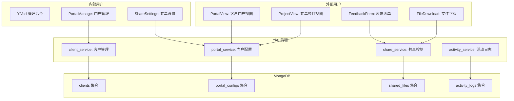
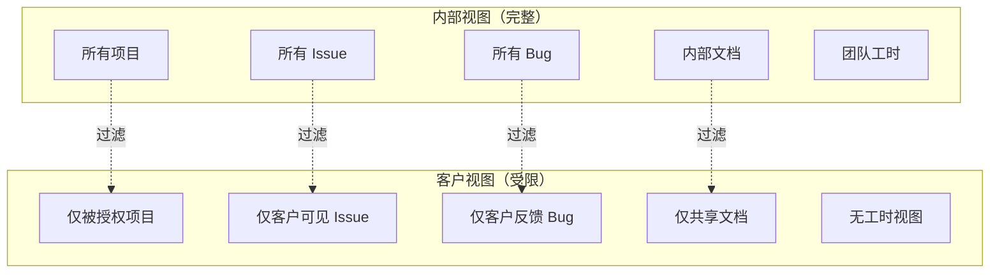

# YV-09-82: 客户与外部协作门户 — 受限权限客户访问、共享项目视图、反馈收集、安全文件共享、品牌化门户、外部活动日志

> 需求编号：YV-09-82 · 优先级：P2 · 人天：0.5d · 状态：需求已编写
> 依赖：无

## 背景

### 问题陈述

YiVad 当前仅面向内部团队成员使用，无法让外部客户或协作者参与项目管理。当需要客户查看项目进度、提供反馈、共享文件时，团队只能通过邮件、截图、第三方工具等方式间接沟通。这导致三大痛点：信息同步延迟（邮件来回）、反馈碎片化（分散在邮件/微信/会议中）、安全性不可控（文件共享缺乏权限管控）。

1. **客户无法自主查看进度**：每次需要手动截图或导出发送邮件
2. **反馈无法集中管理**：客户反馈分散在多个渠道，难以追踪和关联
3. **文件共享不安全**：通过邮件或网盘共享文件，缺乏权限控制和访问日志
4. **品牌化缺失**：无法为客户提供品牌化的协作体验
5. **活动不可见**：不知道客户查看了哪些内容，无法追踪协作效率

**核心矛盾**：项目管理需要客户参与，但 YiVad 缺乏安全、可控的外部协作机制，团队被迫使用碎片化的外部工具。

### 影响范围

| # | 影响 | 严重程度 | 典型场景 |
|---|------|----------|----------|
| 1 | 信息同步延迟 | 高 | 客户需要每周手动同步项目进度 |
| 2 | 反馈碎片化 | 高 | 客户反馈分散在邮件/微信/会议中 |
| 3 | 文件共享不安全 | 高 | 敏感文件通过邮件发送，缺乏访问控制 |
| 4 | 品牌化缺失 | 中 | 无法为客户提供品牌化门户体验 |
| 5 | 协作效率低 | 中 | 外部协作者的权限无法精细控制 |

### 挑战

| 挑战 | 说明 |
|------|------|
| 权限粒度 | 客户只能看到被授权的项目和视图，不能看到内部信息 |
| 安全隔离 | 外部用户和内部用户的数据隔离，防止权限提升 |
| 品牌化配置 | 不同客户需要不同的 Logo、颜色、域名 |
| 反馈关联 | 客户反馈需要关联到具体 Issue 或项目 |
| 文件共享安全 | 共享文件需要过期时间、访问次数限制、下载控制 |

---

## 一、现状分析

### 1.1 当前外部协作流程

```
客户需要了解项目进度
  │ 发邮件给 PM
  ▼
PM 在 YiVad 截图/导出报告
  │ 整理成邮件
  ▼
发送邮件给客户
  │ 客户查看
  ▼
客户有反馈
  │ 回复邮件 / 微信留言
  ▼
PM 在 YiVad 中创建 Issue
  │ 手动将反馈转化为任务
  ▼
客户需要共享文件
  │ 通过邮件附件 / 网盘链接
  总耗时：1-3 天（含邮件延迟）
```

### 1.2 当前权限模型

```
现有权限模型:
├── 内部用户（完整权限）
│   ├── admin: 全部权限
│   ├── manager: 项目管理权限
│   └── member: 受限权限
└── 外部用户: 不存在
    ├── 无外部用户模型
    ├── 无客户角色
    └── 无受限视图
```

### 1.3 根因矩阵

| 症状 | 根因 | 触发条件 | 频率 |
|------|------|----------|------|
| 信息同步延迟 | 无客户自助查看入口 | 客户需要了解进度时 | 高 |
| 反馈碎片化 | 无集中的反馈收集渠道 | 客户有建议/问题时 | 高 |
| 文件共享不安全 | 无权限控制的文件共享 | 需要共享文件时 | 中 |
| 品牌化缺失 | 无品牌化配置 | 面向多个客户时 | 中 |
| 协作不可追踪 | 无外部活动日志 | 需要了解客户活跃度时 | 中 |

---

## 二、设计决策

### 决策 1：外部用户认证 — 独立账号 vs 邀请链接 vs OAuth

| 选项 | 安全性 | 用户体验 | 管理成本 |
|------|--------|----------|----------|
| 独立账号（邮箱+密码） | 高 | 中（需注册） | 中 |
| 魔法链接（邮箱验证） | 高 | 高（无需密码） | 中 |
| OAuth（Google/GitHub） | 高 | 高 | 低 |

**选择：魔法链接（邮箱验证码）。** 客户无需记忆密码，每次登录发送 6 位验证码到邮箱。有效期 10 分钟。登录后可选择"记住此设备"（30 天免验证）。

### 决策 2：权限模型 — 项目级 vs Issue 级 vs 视图级

| 选项 | 粒度 | 复杂度 | 适用场景 |
|------|------|--------|----------|
| 项目级（客户可查看整个项目） | 粗 | 低 | 简单协作 |
| Issue 级（客户只能看特定 Issue） | 细 | 高 | 精确控制 |
| 视图级（客户只能看特定视图） | 中 | 中 | 品牌化门户 |

**选择：项目级 + 可选 Issue 级限制。** 默认客户可查看整个项目的共享视图（进度、里程碑、文件）。PM 可设置 Issue 级限制（客户只能看到被标记为"客户可见"的 Issue）。视图级通过门户配置控制。

### 决策 3：品牌化方式 — 独立域名 vs 子路径 vs CSS 变量

| 选项 | 效果 | 实现复杂度 | 成本 |
|------|------|-----------|------|
| 独立域名（per client） | 最佳 | 高 | 高 |
| 子路径（/portal/client-name） | 好 | 中 | 低 |
| CSS 变量 + 配置 | 中 | 低 | 低 |

**选择：子路径 + CSS 变量。** 每个客户门户通过 `/portal/{client-id}` 访问。品牌化通过配置（Logo URL、主色调、公司名称）实现，前端通过 CSS 变量动态注入。独立域名暂不实现（需要 DNS 和 SSL 配置）。

### 决策 4：文件共享安全 — 仅链接 vs 过期控制 vs 访问日志

| 选项 | 安全性 | 用户体验 | 实现复杂度 |
|------|--------|----------|-----------|
| 仅临时链接 | 低 | 高 | 低 |
| 过期时间 + 下载限制 | 高 | 中 | 中 |
| 完整数字版权管理 | 最高 | 低 | 高 |

**选择：过期时间 + 下载限制。** 每个共享文件设置过期时间（1h/24h/7d/30d）和最大下载次数（1/5/10/无限）。过期后链接自动失效。记录每次访问日志（谁、何时、IP、操作）。

---

## 三、目标架构

### 3.1 客户协作门户架构



### 3.2 客户登录流程

```mermaid
graph TD
    A[客户访问 /portal/{id}] --> B{已登录?}
    B -->|是| C[显示门户视图]
    B -->|否| D[输入邮箱]
    D --> E[发送 6 位验证码]
    E --> F{验证码正确?}
    F -->|是| G[创建会话]
    G --> H[记录登录活动]
    H --> C
    F -->|否| I[显示错误 + 重新发送]
    I --> D
```

### 3.3 权限隔离模型



---

## 四、具体改动

### 4.1 客户数据模型

```typescript
// src/types/client.ts (新增)

export interface Client {
  _id: string;
  name: string;
  company: string;
  email: string;
  phone?: string;
  /** 关联的项目 */
  project_keys: string[];
  /** 门户配置 */
  portal_config: PortalConfig;
  /** 状态 */
  status: 'active' | 'inactive' | 'invited';
  /** 上次活动时间 */
  last_activity_at?: string;
  created_at: string;
  created_by: string;
}

export interface PortalConfig {
  /** 门户子路径 */
  slug: string;
  /** 品牌化 */
  branding: PortalBranding;
  /** 可见模块 */
  modules: PortalModule[];
  /** 功能开关 */
  features: PortalFeatures;
}

export interface PortalBranding {
  logo_url?: string;
  primary_color: string;
  company_name: string;
  welcome_message: string;
}

export type PortalModule = 'overview' | 'issues' | 'milestones' | 'files' | 'feedback';

export interface PortalFeatures {
  feedback_enabled: boolean;
  file_sharing_enabled: boolean;
  issue_visibility: 'all' | 'tagged' | 'none';
  download_enabled: boolean;
}

export interface SharedFile {
  _id: string;
  client_id: string;
  project_key: string;
  file_name: string;
  file_path: string;
  file_size: number;
  /** 过期时间 */
  expires_at: string;
  /** 最大下载次数（0=无限） */
  max_downloads: number;
  current_downloads: number;
  /** 访问日志 */
  access_logs: FileAccessLog[];
  created_at: string;
}

export interface FileAccessLog {
  user_email: string;
  action: 'download' | 'view';
  ip_address: string;
  timestamp: string;
}

export interface ClientActivity {
  _id: string;
  client_id: string;
  action: string;
  resource_type: string;
  resource_id?: string;
  ip_address: string;
  user_agent: string;
  timestamp: string;
}
```

### 4.2 客户登录 Composable

```typescript
// src/hooks/useClientAuth.ts (新增)

import { ref } from 'vue';
import { useRequest } from './useRequest';

export function useClientAuth() {
  const isLoggedIn = ref(false);
  const clientInfo = ref<Client | null>(null);
  const loginStep = ref<'email' | 'code' | 'done'>('email');
  const email = ref('');

  async function sendCode(e: string): Promise<void> {
    email.value = e;
    await useRequest().post('/client/send-login-code', { email: e });
    loginStep.value = 'code';
  }

  async function verifyCode(code: string): Promise<boolean> {
    try {
      const res = await useRequest().post('/client/verify-login-code', {
        email: email.value, code,
      });
      clientInfo.value = res.data.client;
      isLoggedIn.value = true;
      loginStep.value = 'done';
      return true;
    } catch {
      return false;
    }
  }

  async function logout(): Promise<void> {
    await useRequest().post('/client/logout');
    isLoggedIn.value = false;
    clientInfo.value = null;
    loginStep.value = 'email';
  }

  return { isLoggedIn, clientInfo, loginStep, email, sendCode, verifyCode, logout };
}
```

### 4.3 门户路由守卫

```typescript
// src/router/guards/portalGuard.ts (新增)

import type { Router } from 'vue-router';

export function setupPortalGuard(router: Router): void {
  router.beforeEach(async (to, from, next) => {
    // 仅处理 /portal/ 路由
    if (!to.path.startsWith('/portal/')) {
      return next();
    }

    const portalId = to.params.id as string;

    // 检查是否已登录
    const token = localStorage.getItem(`portal_token_${portalId}`);

    if (!token && to.name !== 'PortalLogin') {
      return next({ name: 'PortalLogin', params: { id: portalId } });
    }

    if (token) {
      try {
        // 验证 token 有效性
        const res = await fetch('/api/client/verify-token', {
          headers: { 'Authorization': `Bearer ${token}` },
        });
        if (!res.ok) {
          localStorage.removeItem(`portal_token_${portalId}`);
          return next({ name: 'PortalLogin', params: { id: portalId } });
        }
      } catch {
        return next({ name: 'PortalLogin', params: { id: portalId } });
      }
    }

    next();
  });
}
```

### 4.4 文件变更清单

| 文件 | 操作 | 说明 |
|------|------|------|
| `src/types/client.ts` | 新增 | 客户 + 门户类型定义 |
| `src/hooks/useClientAuth.ts` | 新增 | 客户认证 Composable |
| `src/hooks/usePortalConfig.ts` | 新增 | 门户配置 Composable |
| `src/router/guards/portalGuard.ts` | 新增 | 门户路由守卫 |
| `src/views/portal/PortalLogin.vue` | 新增 | 客户登录页 |
| `src/views/portal/PortalLayout.vue` | 新增 | 客户门户布局 |
| `src/views/portal/PortalOverview.vue` | 新增 | 项目概览视图 |
| `src/views/portal/PortalIssues.vue` | 新增 | Issue 列表视图 |
| `src/views/portal/PortalFiles.vue` | 新增 | 文件共享视图 |
| `src/views/portal/PortalFeedback.vue` | 新增 | 反馈表单 |
| `src/views/admin/ClientManage.vue` | 新增 | 客户管理页 |
| `src/views/admin/PortalConfig.vue` | 新增 | 门户配置页 |
| `src/router/index.ts` | 修改 | 添加门户和管理路由 |
| `src/languages/modules/portal/zh.ts` | 新增 | 中文 i18n |
| `src/languages/modules/portal/en.ts` | 新增 | 英文 i18n |

---

## 五、实施步骤

| 步骤 | 操作 | 路径 | 验证 | 人天 |
|------|------|------|------|------|
| 1 | 定义类型 + 数据模型 | `src/types/client.ts` | 类型检查通过 | 0.02 |
| 2 | 实现客户认证 | `useClientAuth.ts` | 验证码登录正常 | 0.06 |
| 3 | 实现门户路由守卫 | `portalGuard.ts` | 未登录重定向 | 0.03 |
| 4 | 实现门户布局 + 品牌化 | `PortalLayout.vue` | 品牌化样式生效 | 0.06 |
| 5 | 实现门户视图（概览/Issue/文件/反馈） | `portal/*.vue` | 受限数据正确展示 | 0.15 |
| 6 | 实现客户管理页 | `ClientManage.vue` | CRUD 正常 | 0.08 |
| 7 | 实现门户配置页 | `PortalConfig.vue` | 品牌化 + 模块配置 | 0.05 |
| 8 | 路由 + i18n | 路由注册 + 中英文 | 页面可访问，i18n 正常 | 0.05 |

**总人天：0.5d**

---

## 六、测试规格

### 场景 1：客户登录

**GIVEN** 客户访问 `/portal/acme-corp`
**WHEN** 输入邮箱 `client@acme.com` 并点击发送验证码
**THEN** 收到 6 位验证码邮件
**WHEN** 输入正确验证码
**THEN** 登录成功，看到 Acme Corp 品牌化门户首页

### 场景 2：品牌化门户

**GIVEN** 客户已登录，门户配置主色调为 `#FF6600`
**WHEN** 访问门户各页面
**THEN** 导航栏、按钮、链接颜色为 `#FF6600`
**AND** Logo 显示客户公司的 Logo
**AND** 页脚显示客户公司名称

### 场景 3：受限项目视图

**GIVEN** 客户被授权查看 "Website Redesign" 项目，但未授权 "Internal Tools" 项目
**WHEN** 客户访问项目列表
**THEN** 仅显示 "Website Redesign" 项目
**AND** "Internal Tools" 项目不可见

### 场景 4：客户反馈

**GIVEN** 客户在门户中查看 Issue "Implement Login Page"
**WHEN** 客户点击 "提交反馈"
**THEN** 弹出反馈表单：标题、描述、优先级
**WHEN** 客户提交反馈
**THEN** 系统创建反馈 Issue，关联到原 Issue
**AND** 内部团队收到通知

### 场景 5：安全文件共享

**GIVEN** PM 上传文件 "design-mockup.pdf" 并设置 7 天过期、最多下载 3 次
**WHEN** 客户在门户下载该文件（第 1 次）
**THEN** 下载成功，记录访问日志
**WHEN** 客户第 4 次尝试下载
**THEN** 显示 "下载次数已用完"
**WHEN** 8 天后尝试下载
**THEN** 显示 "链接已过期"

### 场景 6：活动日志

**GIVEN** 客户在门户中浏览了项目、查看了 3 个 Issue、下载了 1 个文件
**WHEN** PM 在管理后台查看客户活动日志
**THEN** 显示：登录时间、浏览页面、查看 Issue 详情、文件下载记录
**AND** 显示 IP 地址和时间戳

---

## 七、风险与缓解

| 风险 | 概率 | 影响 | 缓解措施 |
|------|------|------|----------|
| 客户权限提升 | 低 | 高 | 路由守卫 + API 层权限校验双重保护 |
| 验证码邮件延迟 | 中 | 中 | 支持重新发送（60s 冷却），提示检查垃圾邮件 |
| 品牌化样式未生效 | 低 | 低 | CSS 变量动态注入，提供预览功能 |
| 共享文件泄露 | 中 | 高 | 过期时间 + 下载限制 + 访问日志 + 水印 |
| 门户路由与内部路由冲突 | 低 | 中 | `/portal/` 前缀隔离，路由独立配置 |

---

## 八、回滚策略

| 场景 | 回滚操作 | 影响 |
|------|----------|------|
| 门户认证异常 | 禁用门户登录，门户页面显示维护中 | 客户无法访问 |
| 权限泄露 | 紧急关闭所有门户访问，审计权限配置 | 临时中断协作 |
| 品牌化配置错误 | 重置为默认品牌化 | 失去品牌化效果 |
| 完全回滚 | 移除门户路由和组件，保留客户数据 | 功能回到改造前 |

---

## 九、设计决策记录

### D-01：为什么选择魔法链接而非密码登录？

客户不太愿意为查看项目进度而记住另一个密码。魔法链接（邮箱验证码）降低登录门槛，每次登录只需邮箱 + 验证码。10 分钟有效期和 60 秒重发冷却平衡了安全性和用户体验。"记住此设备"功能（30 天免验证）进一步减少了频繁登录的烦恼。

### D-02：为什么权限模型选择项目级 + 可选 Issue 级？

纯项目级权限过于粗糙（客户能看到所有 Issue），纯 Issue 级配置过于复杂（PM 需要为每个 Issue 设置可见性）。默认项目级满足 80% 场景，Issue 级限制作为可选增强满足安全需求（如只能看标记为 `client-visible` 的 Issue）。

### D-03：为什么品牌化使用 CSS 变量而非独立主题？

独立主题需要为每个客户维护一套完整的 CSS 文件，维护成本高。CSS 变量（`--portal-primary-color`、`--portal-logo-url`）在运行时注入，配置存储在 MongoDB 中，前端通过 API 获取后动态设置。一种实现满足所有客户。

### D-04：为什么文件共享不使用云存储签名 URL？

YiVad 当前没有集成云存储（OSS/S3），签名 URL 需要额外的云存储基础设施。临时下载链接通过 YiAi 后端生成（带 token 参数），服务端验证 token 有效性和权限。后续可升级为云存储签名 URL。

---

## 十、可观测性

### 指标

| 指标 | 类型 | 说明 |
|------|------|------|
| `yivad.portal.login_count` | Counter | 客户登录次数 |
| `yivad.portal.active_clients` | Gauge | 活跃客户数 |
| `yivad.portal.feedback_count` | Counter | 客户反馈数 |
| `yivad.portal.file_download_count` | Counter | 文件下载次数 |
| `yivad.portal.failed_login_count` | Counter | 登录失败次数 |
| `yivad.portal.avg_session_duration` | Histogram | 平均会话时长 |

### 告警

| 告警 | 条件 | 级别 |
|------|------|------|
| 异常登录尝试 | 5 分钟内失败 > 5 次 | WARNING |
| 大量文件下载 | 1 小时内下载 > 50 次 | WARNING |
| 验证码发送失败 | 5 分钟内失败 > 10 次 | ERROR |

---

## 十一、代码审查检查清单

- [ ] 门户路由使用 `/portal/` 前缀隔离
- [ ] 路由守卫正确拦截未登录请求
- [ ] API 层权限校验双重保护（前端路由守卫 + 后端权限校验）
- [ ] 品牌化 CSS 变量动态注入生效
- [ ] 客户数据与内部数据隔离（MongoDB filter 限制）
- [ ] 验证码有效期 10 分钟 + 重发冷却 60 秒
- [ ] 共享文件过期时间 + 下载限制生效
- [ ] 活动日志记录所有关键操作
- [ ] "记住此设备" 30 天免验证
- [ ] 客户管理页支持 invite/resend/disable 操作

---

## 回归问题预测

| # | 预测问题 | 原因 | 验证方法 |
|---|---------|------|---------|
| 1 | 客户登录后访问 `/project` 路径（内部路由）绕过了权限检查，看到内部项目 | 路由守卫仅检查 `/portal/` 前缀，客户 token 可能通过 `/project` 访问 | 在路由守卫中检查用户类型（internal/external），限制外部用户仅访问 `/portal/` |
| 2 | 品牌化 CSS 变量在 SSG/SSR 预渲染时未注入，首次渲染显示默认颜色 | CSS 变量在 `onMounted` 中通过 API 获取后设置，预渲染时不执行 | 在 `index.html` 中预设默认颜色变量，页面加载后覆盖 |
| 3 | 验证码邮件被邮件服务商标记为垃圾邮件，客户收不到 | 邮件来自未知发件人，spam score 高 | 配置 SPF/DKIM 记录，使用专用邮件服务（SendGrid/Mailgun） |
| 4 | 客户登录后长时间未操作，token 过期但前端未处理，操作失败无提示 | token 过期时间默认 24h，前端未监听 401 响应 | 在 ApiClient 拦截器中处理 401，自动跳转登录页 |
| 5 | 文件共享链接被客户转发给非授权人员，跳过权限控制 | 共享链接中包含一次性 token，但链接本身可被转发 | 在文件下载时额外校验客户邮箱，非授权邮箱拒绝下载 |
| 6 | 活动日志数据量快速增长（每个页面访问都记录），MongoDB 文档膨胀 | 每次页面切换和文件下载都记录活动日志 | 设置 TTL（90 天），仅记录关键操作（登录/下载/反馈），页面浏览记录采样（10%） |

---

## 性能分析

### 各操作耗时

| 阶段 | 预估耗时 | 说明 |
|------|----------|------|
| 登录（发送验证码） | < 1s | 邮件发送耗时 |
| 登录（验证码校验） | < 200ms | MongoDB 查询 |
| 门户首页加载 | < 1s | 品牌化配置 + 项目数据 |
| 文件下载 | < 1s | 服务端验证 + 文件流 |
| 反馈提交 | < 300ms | RPC 写入 |
| 活动日志查询 | < 500ms | MongoDB 聚合查询 |

### 文件体积预估

| 文件 | 大小 | 说明 |
|------|------|------|
| `src/types/client.ts` | ~2KB | 类型定义 |
| `src/hooks/useClientAuth.ts` | ~2KB | 认证逻辑 |
| `src/hooks/usePortalConfig.ts` | ~1KB | 门户配置 |
| `src/router/guards/portalGuard.ts` | ~1KB | 路由守卫 |
| `src/views/portal/PortalLogin.vue` | ~3KB | 登录页 |
| `src/views/portal/PortalLayout.vue` | ~3KB | 布局 |
| `src/views/portal/PortalOverview.vue` | ~3KB | 概览视图 |
| `src/views/portal/PortalIssues.vue` | ~4KB | Issue 列表 |
| `src/views/portal/PortalFiles.vue` | ~3KB | 文件共享 |
| `src/views/portal/PortalFeedback.vue` | ~2KB | 反馈表单 |
| `src/views/admin/ClientManage.vue` | ~4KB | 客户管理 |
| `src/views/admin/PortalConfig.vue` | ~3KB | 门户配置 |
| `src/languages/modules/portal/*.ts` | ~3KB | 中英文（~40 Key） |

