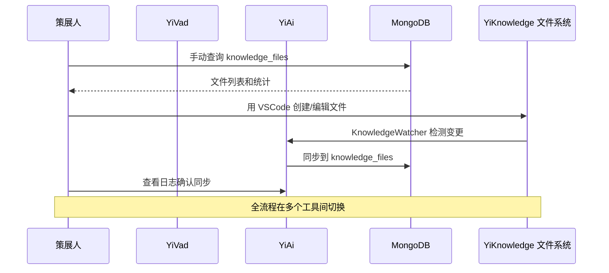
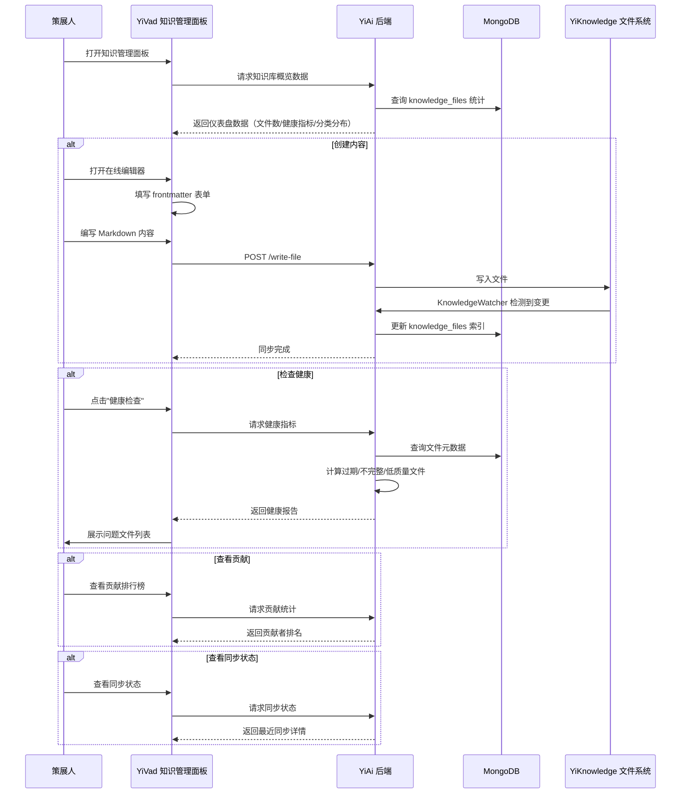
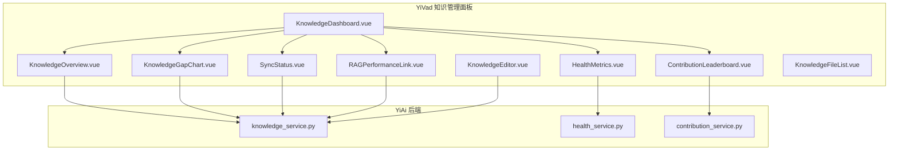

# YV-09-85: 知识管理面板 — 知识库管理仪表盘、内容创建工作流、健康指标、贡献排行榜、知识缺口可视化、RAG 性能关联、YiKnowledge 同步状态

> 需求编号：YV-09-85 · 优先级：P2 · 人天：0.3d · 状态：需求已编写
> 依赖：YV-09-10（知识库页面优化）、YK-09-97（内容统计仪表盘）

## 背景

### 问题陈述

YiVad 作为管理后台，当前对 YiKnowledge 知识库的管理能力非常有限。知识库页面仅提供基本的文件列表浏览，缺少系统化的管理能力：

1. **无全局视图**：无法快速了解知识库的整体状态（文件数、覆盖率、质量分布）
2. **无创建工作流**：在 YiVad 中创建知识文件需要手动编写 Markdown 和 frontmatter，流程繁琐
3. **无健康指标**：不知道哪些文件过期、哪些 frontmatter 不完整、哪些内容质量低
4. **无贡献追踪**：无法识别和激励知识贡献者
5. **无知识缺口分析**：不知道哪些领域缺少文档
6. **无 RAG 关联**：无法从管理后台了解 RAG 检索质量与知识库内容的关联
7. **同步状态不可见**：不清楚 YiKnowledge 文件系统与 MongoDB 索引的同步状态

**核心矛盾**：YiKnowledge 是 YiAi RAG 的数据源，但 YiVad 作为管理后台缺少管理知识库的能力，知识策展人只能通过文件系统或 MongoDB 客户端操作。

### 影响范围

| # | 影响 | 严重程度 | 典型场景 |
|---|------|----------|----------|
| 1 | 知识库管理效率低 | 高 | 策展人需在多个工具间切换 |
| 2 | 内容质量不可见 | 高 | 无法发现过期或低质量内容 |
| 3 | 创作流程断裂 | 中 | 创建知识文件需离开 YiVad |
| 4 | 贡献无法量化 | 中 | 无法衡量团队知识贡献 |
| 5 | 知识缺口难发现 | 中 | 不知道哪些领域需要补充内容 |

### 挑战

| 挑战 | 说明 |
|------|------|
| 数据汇聚 | 需从多个数据源（MongoDB、文件系统、RAG 日志）聚合并展示 |
| 实时同步 | KnowledgeWatcher 每 5s 轮询，同步状态需实时反映 |
| 创作工作流 | 在 YiVad 中创建文件需回写到 YiKnowledge 文件系统 |
| 知识缺口计算 | 需要领域模型来识别"应该存在但不存在的文档" |
| RAG 关联 | 需要将 RAG 检索日志与知识文件关联分析 |

---

## 一、现状分析

### 1.1 当前知识管理流程

```
策展人管理知识库
  │
  ├─ 查看知识库状态
  │   ├─ 打开 MongoDB Compass → 查询 knowledge_files
  │   ├─ 手动统计文件数/分类/状态
  │   └─ 耗时：30min
  │
  ├─ 创建知识文件
  │   ├─ 打开 VSCode
  │   ├─ 手动编写 Markdown + frontmatter
  │   ├─ 保存到 YiKnowledge 目录
  │   └─ 等待 KnowledgeWatcher 同步（5s）
  │
  ├─ 检查内容健康
  │   ├─ 逐文件检查 frontmatter 完整性
  │   ├─ 逐文件检查 updated 日期是否过期
  │   └─ 耗时：1-2h（800+ 文件）
  │
  └─ 查看同步状态
      ├─ 查看 YiAi 日志
      └─ 对比文件系统文件数和 MongoDB 文档数
```

### 1.2 当前可用能力

| 能力 | 可用性 | 获取方式 | 易用性 |
|------|--------|----------|--------|
| 文件列表 | ⚠️ | YiVad 知识库页面 | 中 |
| 全局统计 | ❌ | MongoDB 手动查询 | 低 |
| 内容创建 | ❌ | 需离开 YiVad | — |
| 健康指标 | ❌ | 逐文件检查 | — |
| 贡献统计 | ❌ | 手动统计 | — |
| 同步状态 | ❌ | YiAi 日志 | 低 |
| RAG 关联 | ❌ | 无 | — |

### 1.3 改造前数据流



### 1.4 根因矩阵

| 症状 | 根因 | 触发条件 | 频率 |
|------|------|----------|------|
| 管理效率低 | YiVad 缺少知识管理面板 | 策展人日常工作 | 每日 |
| 创建流程断裂 | 无内置文件编辑器 | 每次创建新内容 | 每周 |
| 健康不可见 | 无自动健康检查 | 需要质量报告时 | 每月 |
| 贡献无法量化 | 缺少贡献者统计 | 管理层需要汇报时 | 每月 |
| 同步不透明 | 缺少同步状态展示 | KnowledgeWatcher 故障时 | 偶尔 |

---

## 二、设计决策

### 决策 1：知识文件编辑方式 — 在线编辑器 vs 外部编辑器 vs 混合

| 选项 | 编辑体验 | 实现复杂度 | 文件系统同步 |
|------|----------|-----------|------------|
| 在线 Markdown 编辑器 | 中 | 中 | 通过 API 写入 |
| 外部编辑器（VSCode） | 高 | 低 | 文件系统直接写入 |
| 混合 | 高 | 中 | 两者均可 |

**选择：混合模式。** 提供在线编辑器的同时，保留通过文件系统编辑的能力（YiAi 的 `/write-file` API）。在线编辑器适合快速修改，外部编辑器适合复杂编辑。

### 决策 2：健康指标计算 — 实时计算 vs 定时预计算 vs 按需计算

| 选项 | 实时性 | 性能 | 复杂度 |
|------|--------|------|--------|
| 实时计算（每次查询） | 高 | 低 | 低 |
| 定时预计算（cron job） | 中 | 高 | 中 |
| 按需计算 + 缓存 | 中 | 高 | 中 |

**选择：按需计算 + 缓存（5min TTL）。** 对 800+ 文件的健康检查（frontmatter 完整性、过期检测）较耗时，每次请求实时计算不合理。按需计算后缓存 5 分钟，平衡实时性和性能。

### 决策 3：知识缺口识别 — 手动定义 vs 自动分析 vs 混合

| 选项 | 准确性 | 实现复杂度 | 维护成本 |
|------|--------|-----------|---------|
| 手动定义（管理员配置期望文档） | 高 | 低 | 高 |
| 自动分析（基于搜索日志/标签） | 中 | 高 | 低 |
| 混合 | 高 | 中 | 中 |

**选择：手动定义 + 自动建议。** 策展人在知识面板中定义"期望文档结构"，系统自动对比现有文件和期望文档识别缺口。同时基于搜索日志自动建议可能缺失的内容。

### 决策 4：同步状态展示 — 简单状态 vs 详细进度 vs 事件流

| 选项 | 信息深度 | 实现复杂度 | 调试价值 |
|------|----------|-----------|---------|
| 简单状态（同步中/已同步/错误） | 低 | 低 | 低 |
| 详细进度（文件数/耗时/变更列表） | 中 | 中 | 中 |
| 事件流（实时变更事件） | 高 | 高 | 高 |

**选择：详细进度。** 显示最近一次同步的时间、文件变更数（新增/修改/删除）、同步耗时、错误列表。不需要事件流（过于复杂），但比简单状态提供更多调试信息。

### 设计决策记录

| 决策 | 选项 A | 选项 B | 选项 C | 选择 | 理由 |
|------|--------|--------|--------|------|------|
| 编辑方式 | 在线编辑 | 外部编辑 | 混合 | **混合** | 兼顾便捷和专业 |
| 健康计算 | 实时 | 定时预计算 | 缓存+按需 | **缓存+按需** | 平衡实时性和性能 |
| 知识缺口 | 手动定义 | 自动分析 | 混合 | **混合** | 准确性+自动化 |
| 同步状态 | 简单状态 | 详细进度 | 事件流 | **详细进度** | 足够的调试信息 |

---

## 三、目标架构

### 3.1 改造后知识管理流程



### 3.2 功能模块结构



### 3.3 性能指标

| 指标 | 改造前 | 改造后 |
|------|--------|--------|
| 知识库概览获取 | 30min（手动统计） | < 5s（缓存） |
| 内容创建 | 5min（VSCode） | 2min（在线表单） |
| 健康检查 | 1-2h（逐文件） | < 10s（自动） |
| 贡献统计 | 30min（手动） | < 5s（自动） |

---

## 四、具体改动

### 4.1 知识管理仪表盘

```typescript
// 改造前：无知识管理面板
// src/views/knowledge/KnowledgeDashboard.vue (改造后)

interface KnowledgeDashboardData {
  overview: {
    totalFiles: number;
    totalCategories: number;
    totalWords: number;
    lastSyncTime: string;
    syncStatus: 'synced' | 'syncing' | 'error';
  };
  categoryDistribution: {
    category: string;
    count: number;
    percentage: number;
  }[];
  healthMetrics: {
    score: number; // 0-100
    issues: {
      type: 'expired' | 'incomplete_frontmatter' | 'low_quality' | 'broken_links';
      count: number;
    }[];
    trend: 'improving' | 'stable' | 'declining';
  };
  topContributors: {
    author: string;
    fileCount: number;
    lastContribution: string;
  }[];
  knowledgeGaps: {
    expectedPath: string;
    reason: string;
    priority: 'high' | 'medium' | 'low';
  }[];
  ragPerformance: {
    avgRecall: number;
    avgPrecision: number;
    topQueriedFiles: string[];
  };
}

// 功能：
// - 概览卡片：总文件数/分类数/字数/最后同步时间
// - 分类分布饼图（ECharts）
// - 健康评分仪表盘（半圆仪表盘，0-100 分）
// - 健康问题列表（可点击跳转到文件）
// - 贡献者排行榜（头像 + 文件数 + 最近贡献日期）
// - 知识缺口列表（期望路径 + 原因 + 优先级标识）
// - RAG 性能关联卡片（平均召回率/精确率）
// - 同步状态指示器（绿/黄/红 + 详细信息）
```

### 4.2 知识文件编辑器

```typescript
// src/views/knowledge/KnowledgeEditor.vue (改造后)

// 功能：
// - Frontmatter 表单（title/tags/category/type/status 必填项）
// - Markdown 编辑器（左右分栏：编辑+预览）
// - Frontmatter 实时校验（必填项检查、格式检查）
// - 自动生成 created/updated 时间戳
// - 选择目标路径（YiKnowledge 目录结构浏览）
// - 保存 → POST /write-file API
// - 保存后显示同步状态
```

### 4.3 文件变更清单

| 文件 | 操作 | 说明 |
|------|------|------|
| `src/views/knowledge/KnowledgeDashboard.vue` | 新增 | 知识管理仪表盘 |
| `src/views/knowledge/KnowledgeEditor.vue` | 新增 | 知识文件在线编辑器 |
| `src/components/knowledge/KnowledgeOverview.vue` | 新增 | 概览卡片组件 |
| `src/components/knowledge/HealthMetrics.vue` | 新增 | 健康指标组件 |
| `src/components/knowledge/ContributionLeaderboard.vue` | 新增 | 贡献排行榜 |
| `src/components/knowledge/KnowledgeGapChart.vue` | 新增 | 知识缺口可视化 |
| `src/components/knowledge/SyncStatus.vue` | 新增 | 同步状态指示器 |
| `src/components/knowledge/RAGPerformanceLink.vue` | 新增 | RAG 性能关联 |
| `src/api/knowledge.ts` | 修改 | 添加知识管理 API |
| `src/router/modules/knowledge.ts` | 修改 | 添加知识管理路由 |
| `tests/unit/knowledge/KnowledgeDashboard.test.ts` | 新增 | 仪表盘测试 |

### 4.4 后端 API

| 端点 | 方法 | 说明 |
|------|------|------|
| `knowledge_service.get_dashboard` | RPC | 获取仪表盘数据（聚合查询） |
| `knowledge_service.get_health_metrics` | RPC | 获取健康指标 |
| `knowledge_service.get_contributions` | RPC | 获取贡献统计 |
| `knowledge_service.get_knowledge_gaps` | RPC | 获取知识缺口 |
| `knowledge_service.get_sync_status` | RPC | 获取同步状态 |
| `knowledge_service.get_rag_performance` | RPC | 获取 RAG 性能关联数据 |

---

## 五、实施步骤

| 步骤 | 操作 | 路径 | 验证 | 人天 |
|------|------|------|------|------|
| 1 | 后端仪表盘聚合查询 | `YiAi/knowledge_service.py` | 返回正确的仪表盘数据 | 0.05 |
| 2 | 后端健康指标服务 | `YiAi/health_service.py` | 过期/不完整/低质量检测 | 0.05 |
| 3 | 前端仪表盘 UI | `YiVad/KnowledgeDashboard.vue` | 概览/图表/指标展示 | 0.08 |
| 4 | 前端知识编辑器 | `YiVad/KnowledgeEditor.vue` | 创建/编辑/保存知识文件 | 0.05 |
| 5 | 前端贡献排行榜 | `YiVad/ContributionLeaderboard.vue` | 排名和数据展示 | 0.03 |
| 6 | 前端同步状态 | `YiVad/SyncStatus.vue` | 同步状态实时展示 | 0.02 |
| 7 | 集成测试 | 前后端 | 完整流程验证 | 0.02 |

**总人天：0.3d**

---

## 六、测试规格

### 场景 1：仪表盘数据加载

**GIVEN** 知识库有 800+ 文件
**WHEN** 策展人打开知识管理仪表盘
**THEN** 应显示总文件数、分类数、字数概览
**AND** 分类分布饼图应正确渲染
**AND** 健康评分应介于 0-100 之间

### 场景 2：健康指标检测

**GIVEN** 知识库中有 10 个过期的文件、5 个 frontmatter 不完整的文件
**WHEN** 策展人查看健康指标
**THEN** 应显示过期文件数 10、不完整文件数 5
**AND** 点击每种问题类型应跳转到对应的文件列表

### 场景 3：在线创建知识文件

**GIVEN** 策展人在知识编辑器中填写 frontmatter 和 Markdown 内容
**WHEN** 点击保存
**THEN** 文件应通过 `/write-file` API 写入 YiKnowledge 文件系统
**AND** KnowledgeWatcher 应检测到变更并同步到 MongoDB
**AND** 应显示保存成功 + 同步完成的提示

### 场景 4：贡献排行榜

**GIVEN** 3 个作者分别贡献了 50/30/20 个文件
**WHEN** 策展人查看贡献排行榜
**THEN** 应按照文件数降序排列
**AND** 应显示每个作者的最近贡献日期

### 场景 5：知识缺口可视化

**GIVEN** 策展人定义了期望文档结构，但缺 3 个文件
**WHEN** 查看知识缺口图表
**THEN** 应高亮显示缺失的文件路径
**AND** 应显示缺失原因和优先级

### 场景 6：同步状态监控

**GIVEN** KnowledgeWatcher 最近一次同步失败
**WHEN** 策展人查看同步状态
**THEN** 应显示红色错误状态
**AND** 应显示错误详情（失败原因、失败文件数）

---

## 七、风险与缓解

| 风险 | 概率 | 影响 | 缓解措施 |
|------|------|------|----------|
| 聚合查询超时（800+ 文件） | 中 | 中 | MongoDB 聚合管道优化 + 5min 缓存 |
| 在线编辑与文件系统冲突 | 低 | 中 | 编辑前检查文件修改时间，冲突时提示 |
| 健康指标误报 | 中 | 低 | 提供忽略/标记为"已确认"功能 |
| RAG 性能数据缺失 | 低 | 中 | 无数据时显示"数据收集中"，不报错 |

---

## 八、回滚策略

| 场景 | 回滚操作 | 影响 |
|------|----------|------|
| 仪表盘性能问题 | 降级为简单统计卡片（无图表） | 可视化效果下降 |
| 在线编辑器文件冲突 | 降级为只读模式 + 提示用户用 VSCode | 编辑功能不可用 |
| 聚合查询超时 | 缓存时间延长至 30min | 数据实时性下降 |

---

## 九、设计决策记录

### D-01：健康评分算法

- **问题**：健康评分如何计算
- **选项**：仅 frontmatter 完整性、综合评分（完整性+新鲜度+质量）、可配置权重
- **选择**：综合评分（frontmatter 完整性 40% + 内容新鲜度 30% + 链接有效性 20% + 标签覆盖率 10%）
- **理由**：单一维度不足以反映知识库健康度，综合评分更全面

### D-02：缓存策略

- **问题**：仪表盘数据的缓存策略
- **选项**：无缓存、1min TTL、5min TTL、15min TTL
- **选择**：5min TTL
- **理由**：仪表盘数据变化不频繁（文件变更后才变化），5min TTL 在实时性和性能间取得平衡

### D-03：编辑器自动保存

- **问题**：在线编辑器是否需要自动保存草稿
- **选项**：无需、localStorage 草稿、后端草稿
- **选择**：localStorage 草稿
- **理由**：避免意外关闭导致内容丢失，localStorage 实现简单，不需后端支持

### D-04：知识缺口优先级

- **问题**：知识缺口如何确定优先级
- **选项**：固定顺序、基于搜索热度、基于用户反馈
- **选择**：用户搜索频率 + 手动优先级覆盖
- **理由**：搜索频率高的缺少文档，说明用户急需；策展人可手动调整优先级

---

## 十、可观测性

### 指标

| 指标 | 类型 | 说明 |
|------|------|------|
| `yivad.knowledge.dashboard.load` | Counter | 仪表盘加载次数 |
| `yivad.knowledge.editor.save` | Counter | 知识文件保存次数 |
| `yivad.knowledge.health.score` | Gauge | 当前知识库健康评分 |
| `yivad.knowledge.gap.count` | Gauge | 当前知识缺口数量 |
| `yivad.knowledge.dashboard.load_time` | Histogram | 仪表盘加载耗时 |

### 告警

| 告警 | 条件 | 级别 |
|------|------|------|
| 健康评分下降 | 评分连续 2 次下降 > 10 分 | WARNING |
| 同步失败 | KnowledgeWatcher 同步连续失败 3 次 | ERROR |
| 过期文件过多 | 过期文件 > 总数的 20% | WARNING |

---

## 十一、代码审查检查清单

- [ ] 仪表盘正确展示文件数/分类/字数概览
- [ ] 分类分布饼图数据正确
- [ ] 健康评分计算逻辑合理
- [ ] 健康问题列表可点击跳转
- [ ] 贡献排行榜排序正确
- [ ] 知识缺口列表按优先级排序
- [ ] 同步状态指示器实时反映 KnowledgeWatcher 状态
- [ ] RAG 性能关联数据正确
- [ ] 在线编辑器 frontmatter 表单校验
- [ ] 在线编辑器自动保存草稿到 localStorage
- [ ] 聚合查询有 5min 缓存
- [ ] 无数据时显示合理的空状态

---

## 回归问题预测

| # | 预测问题 | 原因 | 验证方法 |
|---|---------|------|---------|
| 1 | 仪表盘分类分布饼图中，标签过多（>20 个分类）时 ECharts 图例重叠，部分标签不可见 | ECharts 默认图例横向排列，标签数量超过容器宽度时显示不全 | 模拟 25 个分类，验证饼图图例有滚动或分页功能 |
| 2 | 健康检查中"内容新鲜度"判断时，某些文件的 `updated` 字段是未来时间（系统时钟偏差），被错误标记为"过期" | `updated` 字段值大于当前时间时，时间差为负数，逻辑错误导致标记异常 | 手动设置某个文件的 `updated` 为 3 天后的时间，验证健康检查不将其标记为过期 |
| 3 | 在线编辑器保存文件时，如果目标文件在保存前被其他用户通过文件系统修改，YiVad 覆盖了最新版本导致数据丢失 | 编辑器未检查文件最后修改时间，直接覆盖写入 | 打开两个标签页编辑同一文件，A 先保存，B 再保存，验证 B 收到冲突提示 |
| 4 | 仪表盘聚合查询在 `knowledge_files` 集合为空（新建知识库）时，`$group` 聚合管道返回空数组，前端未处理导致饼图 JS 错误 | MongoDB 聚合管道对空集合的 `$group` 阶段返回空结果，前端直接遍历导致 undefined 访问 | 清空 `knowledge_files` 集合，验证仪表盘显示空状态页面而非控制台报错 |
| 5 | 贡献排行榜中，作者名从 frontmatter 的 `author` 字段提取，但历史文件中作者名不一致（如 `陈铭` vs `Chen Ming` vs `cm`），同一人出现在多个排名位置 | 作者名字段无序标准化，大小写、中英文导致同一人被识别为不同作者 | 手动创建 5 个文件，其中 3 个用 `Chen Ming`、2 个用 `陈铭`，验证是否合并或至少有提示 |
| 6 | 同步状态指示器依赖 KnowledgeWatcher 的状态 API，但 KnowledgeWatcher 被暂停或重启时，状态 API 返回过期数据，导致前端显示"已同步"但实际未同步 | KnowledgeWatcher 的心跳更新被阻塞，状态 API 返回的是最后成功更新的缓存值 | 手动停止 KnowledgeWatcher 后等待 30s，验证同步状态从"已同步"变为"异常"或"超时" |

---

## 性能分析

### 仪表盘关键操作耗时

| 操作 | 耗时 | 说明 |
|------|------|------|
| 聚合查询（文件数/分类/状态） | < 100ms | MongoDB `$group` 管道 |
| 健康指标计算（800 文件） | < 500ms | Python 内存计算 |
| 贡献统计（按 author 分组） | < 100ms | MongoDB 聚合 |
| ECharts 饼图渲染 | < 50ms | 客户端 Canvas 渲染 |
| 仪表盘全量加载（含缓存） | < 500ms | 后端并行聚合 + 前端渲染 |

### 数据量预估

| 数据项 | 大小 |
|--------|------|
| 仪表盘聚合数据 | ~5KB JSON |
| 分类分布数据（20 分类） | ~1KB |
| 健康指标详情 | ~10KB（含问题文件列表） |
| 贡献排行榜（Top 20） | ~2KB |

---

## 相关文档

- [YiKnowledge 知识库概述](../yiknowledge/README.md)
- [YK-09-97 内容统计仪表盘](../yiknowledge/requirements/2026-09/97-需求-内容统计仪表盘.md)
- [KnowledgeWatcher 实现](../yiai/)

