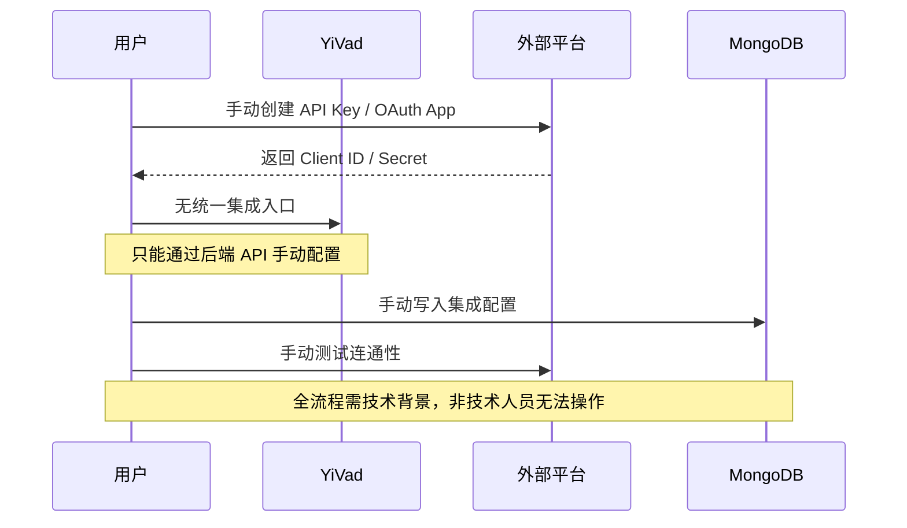
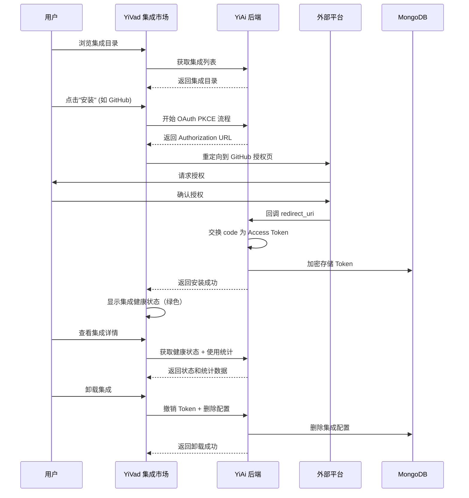
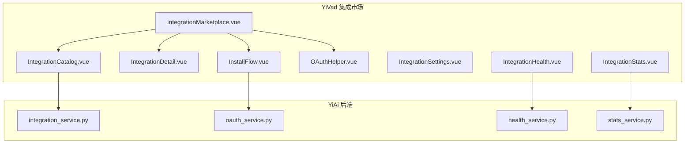

# YV-09-86: 集成市场 — 第三方集成目录、安装/配置/卸载流程、集成健康状态、使用统计、OAuth 配置助手

> 需求编号：YV-09-86 · 优先级：P2 · 人天：0.3d · 状态：需求已编写
> 依赖：YV-09-67（Webhook 管理界面）

## 背景

### 问题陈述

YiVad 作为项目管理平台，当前是完全独立的系统，无法与团队日常使用的第三方工具（Slack、GitHub、Jira、邮件、Webhook）集成。这导致以下痛点：

1. **信息孤岛**：GitHub 的代码提交不会自动关联到 YiVad 的 Issue，Slack 的消息不会自动创建任务
2. **手动同步**：每次需要将 Jira Issue 同步到 YiVad 时，团队成员手动复制粘贴
3. **通知分散**：YiVad 的通知无法推送到 Slack/邮件，用户需要频繁检查多个平台
4. **集成难发现**：用户不知道 YiVad 支持哪些第三方集成
5. **配置复杂**：OAuth 配置、API Key 管理、Webhook URL 设置分散在不同页面

**核心矛盾**：现代团队使用 5-15 个 SaaS 工具，YiVad 作为管理中枢需要与这些工具互通数据，但目前缺乏统一的集成管理平台。

### 影响范围

| # | 影响 | 严重程度 | 典型场景 |
|---|------|----------|----------|
| 1 | 信息孤岛 | 高 | GitHub 提交不关联 YiVad Issue |
| 2 | 手动同步低效 | 高 | 跨工具复制粘贴信息 |
| 3 | 通知覆盖不全 | 高 | 错过重要更新 |
| 4 | 集成不可发现 | 中 | 用户不知道可用的集成 |
| 5 | OAuth 配置困难 | 中 | 非技术人员配置 OAuth 门槛高 |

### 挑战

| 挑战 | 说明 |
|------|------|
| 多平台 OAuth | 不同平台的 OAuth 流程不同，需统一抽象 |
| Token 安全存储 | API Key/OAuth Token 需加密存储 |
| 集成健康监控 | 需要为每个集成检测连接状态和调用成功率 |
| 集成可扩展性 | 新增集成应遵循统一接口，不需修改前端代码 |
| 权限控制 | 不同角色的用户可以配置的集成不同 |

---

## 一、现状分析

### 1.1 当前集成配置流程

```
用户需要集成 Slack
  │
  ├─ 登录 Slack API 控制台
  │   └─ 创建 App → 获取 Client ID/Secret
  │
  ├─ 配置 OAuth 重定向 URL
  │   └─ 手动填写 YiVad 回调地址
  │
  ├─ 在 YiVad 中手动配置
  │   └─ 目前无统一入口，只能通过后端 API 或数据库操作
  │
  └─ 测试连接
      └─ 手动发送测试消息验证
```

### 1.2 当前可用能力

| 能力 | 可用性 | 获取方式 | 易用性 |
|------|--------|----------|--------|
| Webhook 管理 | ⚠️ | YiVad Webhook 页面（YV-09-67） | 中 |
| Slack 集成 | ❌ | 无内置支持 | — |
| GitHub 集成 | ❌ | 无内置支持 | — |
| Jira 集成 | ❌ | 无内置支持 | — |
| 邮件集成 | ❌ | 无内置支持 | — |
| OAuth 配置 | ❌ | 无统一入口 | — |

### 1.3 改造前数据流



### 1.4 根因矩阵

| 症状 | 根因 | 触发条件 | 频率 |
|------|------|----------|------|
| 无法发现集成 | 无集成目录/市场 | 新用户接入时 | 高 |
| 配置复杂 | 无 OAuth 配置助手 | 每次配置集成 | 中 |
| Token 不安全 | 无加密存储机制 | 集成配置后 | 高 |
| 集成状态不可见 | 无健康监控 | 集成出问题时 | 中 |
| 用量不可追踪 | 无使用统计 | 评估集成价值时 | 中 |

---

## 二、设计决策

### 决策 1：集成架构 — 插件化 vs 硬编码 vs 注册制

| 选项 | 扩展性 | 实现复杂度 | 维护成本 |
|------|--------|-----------|---------|
| 插件化（动态加载） | 高 | 高 | 低 |
| 硬编码（每种集成独立开发） | 低 | 低 | 高 |
| 注册制（统一接口 + 配置驱动） | 高 | 中 | 低 |

**选择：注册制（统一接口 + 配置驱动）。** 定义统一的 `IntegrationProvider` 接口，后端通过配置注册不同的集成实现。前端通过集成注册表动态渲染配置表单。新增集成只需实现接口 + 配置，不需修改前端。

### 决策 2：OAuth 流程 — 服务端代理 vs 客户端直接 vs PKCE

| 选项 | 安全性 | 实现复杂度 | 用户体验 |
|------|--------|-----------|---------|
| 服务端代理（传统 OAuth） | 高 | 中 | 好 |
| 客户端直接（Implicit Grant） | 低 | 低 | 好 |
| PKCE（Authorization Code + PKCE） | 高 | 中 | 好 |

**选择：PKCE（Authorization Code + PKCE）。** 现代 OAuth 2.0 最佳实践，适合 SPA。YiVad 作为前端 SPA，通过 PKCE 无需暴露 Client Secret，安全性与传统 OAuth 等同。

### 决策 3：集成健康检查 — 定时检查 vs 按需检查 vs 被动监控

| 选项 | 实时性 | 性能开销 | 实现复杂度 |
|------|--------|----------|-----------|
| 定时检查（cron job） | 中 | 中 | 中 |
| 按需检查（用户触发） | 低 | 低 | 低 |
| 被动监控（API 调用失败计数） | 高 | 低 | 中 |

**选择：定时检查 + 被动监控。** 每 5 分钟定时检查关键集成连接，同时被动监控每次 API 调用的成功率。结合两种方式提供准确的健康状态。

### 决策 4：集成市场来源 — 仅内置 vs 社区贡献 vs 可自定义

| 选项 | 质量保证 | 覆盖范围 | 维护成本 |
|------|----------|----------|---------|
| 仅内置（官方开发） | 高 | 低 | 高 |
| 社区贡献（类似插件市场） | 中 | 高 | 高 |
| 内置 + Webhook 通用集成 | 高 | 高 | 中 |

**选择：内置 + Webhook 通用集成。** 官方开发 Slack/GitHub/Jira/Email/Webhook 5 种核心集成。Webhook 通用集成作为兜底方案，用户可自行对接任意 Webhook 平台（通过 YV-09-67 Webhook 管理）。

### 设计决策记录

| 决策 | 选项 A | 选项 B | 选项 C | 选择 | 理由 |
|------|--------|--------|--------|------|------|
| 集成架构 | 插件化 | 硬编码 | 注册制 | **注册制** | 扩展性强，实现适中 |
| OAuth 流程 | 服务端代理 | 客户端直接 | PKCE | **PKCE** | 安全且适合 SPA |
| 健康检查 | 定时 | 按需 | 被动 | **定时+被动** | 准确且及时 |
| 集成来源 | 仅内置 | 社区贡献 | 内置+Webhook | **内置+Webhook** | 核心覆盖 + 通用兜底 |

---

## 三、目标架构

### 3.1 改造后集成管理流程



### 3.2 功能模块结构



### 3.3 性能指标

| 指标 | 改造前 | 改造后 |
|------|--------|--------|
| 集成发现 | 无 | 一键浏览 |
| 安装集成 | 30min（手动配置） | 2min（OAuth 流程） |
| 健康检查 | 需手动测试 | 自动监控 + 告警 |
| 使用统计 | 无 | 实时可见 |

---

## 四、具体改动

### 4.1 集成目录

```typescript
// 改造前：无集成市场
// src/views/integration/IntegrationMarketplace.vue (改造后)

interface IntegrationProvider {
  id: string;           // 'slack' | 'github' | 'jira' | 'email' | 'webhook'
  name: string;
  description: string;
  icon: string;         // icon URL or icon component name
  category: 'communication' | 'development' | 'project-management' | 'email' | 'custom';
  authType: 'oauth2' | 'api_key' | 'webhook_url' | 'none';
  installed: boolean;
  status: 'connected' | 'disconnected' | 'error' | 'installing';
  features: string[];
}

interface IntegrationCatalog {
  available: IntegrationProvider[];
  installed: IntegrationProvider[];
}

// 功能：
// - 分类筛选（通信/开发/项目管理/邮件/自定义）
// - 卡片式展示：图标 + 名称 + 描述 + 安装状态
// - 已安装的集成显示绿色圆点
// - 搜索和排序
// - 点击卡片进入详情页
```

### 4.2 安装流程

```typescript
// src/views/integration/InstallFlow.vue (改造后)

// 功能：
// - 步骤向导：
//   1. 选择集成 → 2. 授权配置 → 3. 权限选择 → 4. 测试连接 → 5. 完成
//
// - OAuth PKCE 流程：
//   - 生成 code_verifier + code_challenge
//   - 打开授权窗口（popup）或页面重定向
//   - 接收回调 code
//   - 后端交换 Token
//
// - API Key 流程（非 OAuth）：
//   - 表单输入 API Key / URL
//   - 加密传输到后端
//   - 连接测试
//
// - Webhook 流程：
//   - 生成 Webhook URL
//   - 显示 URL 供用户复制到第三方平台
//
// - 权限选择：勾选需要的数据访问权限（读 Issue、写评论等）
// - 连接测试：发送测试请求验证配置正确性
```

### 4.3 集成健康状态

```typescript
// src/components/integration/IntegrationHealth.vue (改造后)

// 功能：
// - 每个集成的健康状态指示器（绿/黄/红/灰）
//   - 绿色：最后 5 次调用全部成功
//   - 黄色：最近 1 小时有失败但可恢复
//   - 红色：连接断开，需要重新配置
//   - 灰色：未安装
//
// - 点击查看详情：
//   - 最近 10 次 API 调用的状态和耗时
//   - 错误日志
//   - Token 过期时间
//   - 手动重试/重连按钮
```

### 4.4 文件变更清单

| 文件 | 操作 | 说明 |
|------|------|------|
| `src/views/integration/IntegrationMarketplace.vue` | 新增 | 集成市场主页 |
| `src/views/integration/IntegrationDetail.vue` | 新增 | 集成详情页 |
| `src/components/integration/IntegrationCatalog.vue` | 新增 | 集成目录卡片列表 |
| `src/components/integration/InstallFlow.vue` | 新增 | 安装流程向导 |
| `src/components/integration/OAuthHelper.vue` | 新增 | OAuth PKCE 配置助手 |
| `src/components/integration/IntegrationHealth.vue` | 新增 | 健康状态监控 |
| `src/components/integration/IntegrationStats.vue` | 新增 | 使用统计图表 |
| `src/components/integration/IntegrationSettings.vue` | 新增 | 集成设置/卸载 |
| `src/api/integration.ts` | 新增 | 集成 API 封装 |
| `src/router/modules/integration.ts` | 新增 | 集成管理路由 |
| `tests/unit/integration/InstallFlow.test.ts` | 新增 | 安装流程测试 |

### 4.5 后端统一接口

```python
# YiAi/services/integration/integration_service.py

class IntegrationProvider(ABC):
    """集成提供者统一接口"""
    provider_id: str
    provider_name: str
    auth_type: Literal['oauth2', 'api_key', 'webhook_url']

    @abstractmethod
    async def install(self, config: dict) -> InstallResult: ...

    @abstractmethod
    async def uninstall(self, instance_id: str) -> UninstallResult: ...

    @abstractmethod
    async def health_check(self, instance_id: str) -> HealthStatus: ...

    @abstractmethod
    async def get_usage_stats(self, instance_id: str) -> UsageStats: ...
```

---

## 五、实施步骤

| 步骤 | 操作 | 路径 | 验证 | 人天 |
|------|------|------|------|------|
| 1 | 后端集成注册表 + 统一接口 | `YiAi/integration_service.py` | 注册/查询集成 | 0.05 |
| 2 | 后端 OAuth PKCE 服务 | `YiAi/oauth_service.py` | PKCE 流程正确 | 0.05 |
| 3 | 前端集成目录 UI | `YiVad/IntegrationCatalog.vue` | 目录展示和筛选 | 0.05 |
| 4 | 前端安装流程向导 | `YiVad/InstallFlow.vue` | 多步骤流程正确 | 0.06 |
| 5 | 前端 OAuth 配置助手 | `YiVad/OAuthHelper.vue` | PKCE 流程 UI | 0.03 |
| 6 | 前端健康状态 + 统计 | `YiVad/IntegrationHealth.vue` | 状态指示和详情 | 0.04 |
| 7 | 集成测试 | 前后端 | Slack/GitHub 完整安装流程 | 0.02 |

**总人天：0.3d**

---

## 六、测试规格

### 场景 1：浏览集成目录

**GIVEN** 后端注册了 5 个集成（Slack/GitHub/Jira/Email/Webhook）
**WHEN** 用户打开集成市场
**THEN** 应显示 5 个集成卡片
**AND** 应按分类分组显示
**AND** 搜索框可过滤集成

### 场景 2：安装 GitHub 集成（OAuth PKCE）

**GIVEN** 用户点击 GitHub 集成的"安装"按钮
**WHEN** 完成 OAuth PKCE 流程
**THEN** 应重定向到 GitHub 授权页
**AND** 授权后返回 YiVad
**AND** 集成状态应变为"已连接"

### 场景 3：安装 Webhook 集成

**GIVEN** 用户点击 Webhook 集成的"安装"按钮
**WHEN** 配置完成
**THEN** 应生成 Webhook URL
**AND** 应显示密钥（仅显示一次）
**AND** 应提供复制 URL 和密钥的功能

### 场景 4：查看集成健康状态

**GIVEN** GitHub 集成已安装但最近一次调用失败
**WHEN** 用户查看集成健康状态
**THEN** GitHub 卡片应显示黄色警告状态
**AND** 点击详情应显示最近 10 次调用记录

### 场景 5：卸载集成

**GIVEN** Slack 集成已安装
**WHEN** 用户点击"卸载"并确认
**THEN** Token 应被撤销
**AND** 配置应被删除
**AND** 集成卡片状态应变回"未安装"

### 场景 6：使用统计

**GIVEN** Slack 集成已安装并使用了 30 天
**WHEN** 用户查看使用统计
**THEN** 应显示：总 API 调用次数、日均调用量、成功率、活跃天数
**AND** 应显示按日/按月的趋势图

---

## 七、风险与缓解

| 风险 | 概率 | 影响 | 缓解措施 |
|------|------|------|----------|
| OAuth 回调 URL 配置错误 | 中 | 高 | OAuth 助手自动验证回调 URL 可达性 |
| Token 泄露 | 低 | 高 | 后端加密存储（AES-256），前端不暴露 Token |
| 第三方 API 限流 | 中 | 中 | 实现请求队列 + 指数退避重试 |
| 集成卸载后残留数据 | 中 | 中 | 卸载时级联删除所有关联数据 |
| 第三方平台 API 变更 | 低 | 中 | 版本化集成接口，兼容性检测 |

---

## 八、回滚策略

| 场景 | 回滚操作 | 影响 |
|------|----------|------|
| OAuth PKCE 流程异常 | 降级为 API Key 手动配置模式 | 体验下降 |
| 健康检查导致外部 API 限流 | 关闭定时检查，仅保留被动监控 | 状态更新延迟 |
| 集成市场性能问题 | 降级为静态配置的集成列表 | 不可发现新集成 |

---

## 九、设计决策记录

### D-01：Token 加密存储

- **问题**：OAuth Token 和 API Key 在 MongoDB 中的存储方式
- **选项**：明文存储、AES-256 加密、Hashicorp Vault
- **选择**：AES-256 加密
- **理由**：Vault 对于当前规模过于复杂，AES-256 提供足够的安全性，加密密钥通过环境变量注入

### D-02：PKCE 实现方式

- **问题**：PKCE 的 code_verifier 生成和存储
- **选项**：前端生成 + sessionStorage、后端生成 + Redis、后端生成 + 内存
- **选择**：后端生成 + 内存（带过期时间）
- **理由**：前端生成的安全性较低（可被 XSS 窃取），后端生成 + Redis 需要额外基础设施，内存存储（30min TTL）简单且安全

### D-03：集成调用超时

- **问题**：第三方 API 调用的超时设置
- **选项**：5s、10s、30s、60s
- **选择**：10s 统一超时
- **理由**：大多数第三方 API 应在 10s 内响应；个别慢 API（如大文件上传）可配置单独超时

### D-04：健康检查频率

- **问题**：定时健康检查的频率
- **选项**：1min、5min、15min、30min
- **选择**：5min
- **理由**：5min 足够及时发现集成问题，同时不超过第三方 API 的限流阈值

---

## 十、可观测性

### 指标

| 指标 | 类型 | 说明 |
|------|------|------|
| `yivad.integration.install` | Counter | 集成安装次数（按 provider 标签） |
| `yivad.integration.uninstall` | Counter | 集成卸载次数 |
| `yivad.integration.api.call` | Counter | 第三方 API 调用次数 |
| `yivad.integration.api.error` | Counter | 第三方 API 调用失败次数 |
| `yivad.integration.api.latency` | Histogram | 第三方 API 调用延迟 |
| `yivad.integration.health.status` | Gauge | 集成健康状态（1=正常 0=异常） |

### 告警

| 告警 | 条件 | 级别 |
|------|------|------|
| 集成健康下降 | 任意集成健康状态变为红色 | WARNING |
| API 调用成功率下降 | 1h 内成功率 < 90% | WARNING |
| Token 即将过期 | Token 过期时间 < 24h | INFO |

---

## 十一、代码审查检查清单

- [ ] 集成目录正确显示所有已注册的集成
- [ ] 安装流程向导多步骤体验流畅
- [ ] OAuth PKCE 流程 code_verifier/code_challenge 正确
- [ ] Token 后端 AES-256 加密存储
- [ ] 集成健康状态绿/黄/红/灰正确反映实际状态
- [ ] 卸载流程撤销 Token + 删除配置
- [ ] 使用统计按日/月趋势图正确
- [ ] 搜索和分类筛选功能
- [ ] Webhook URL 密钥仅首次显示
- [ ] OAuth 回调 URL 自动验证可达性
- [ ] 所有外部 API 调用有 10s 超时限制

---

## 回归问题预测

| # | 预测问题 | 原因 | 验证方法 |
|---|---------|------|---------|
| 1 | OAuth PKCE 流程中，用户在授权页面点击"取消"后回调 URL 缺少 `code` 参数，前端未处理 `error=access_denied` 回到错误页面 | 回调处理逻辑只覆盖了成功路径（有 `code`），未处理 OAuth 错误参数 | 在集成安装流程中跳转到授权页后点击"取消"，验证回到 YiVad 后显示友好提示而非 500 |
| 2 | 同一集成安装了两次（用户重复点击安装按钮），数据库出现重复配置，健康检查同时使用两个 Token 导致 API 调用混乱 | 安装按钮未在点击后 disable，快速双击导致两次 OAuth 流程同时启动 | 快速双击"安装"按钮，验证仅创建一个配置且第二次点击被忽略或提示"安装中" |
| 3 | Token 加密密钥轮换后，已存储的 Token 无法解密，所有已安装的集成同时失效 | 密钥轮换时未实现密钥版本化或未使用密钥派生方案 | 配置多个密钥版本，用 v1 加密的 Token 在密钥切换到 v2 后仍能通过 v1 解密，验证集成状态不变 |
| 4 | 健康检查定时任务中，某个集成（如 Slack）的 API 端点响应缓慢（超时 10s），阻塞了其他集成的健康检查 | 健康检查在同一个 asyncio 任务中顺序执行，一个慢请求阻塞全部 | 模拟 Slack API 响应 15s 超时，验证 GitHub/Jira 等其他集成的健康检查不受影响（并行执行） |
| 5 | 集成卸载后，与之关联的 Webhook 回调 URL 仍可被触发（第三方平台缓存了旧的 Webhook URL），导致数据库中残留失效的 Webhook 事件记录 | 卸载时删除 Webhook 配置但未使 URL 失效，第三方平台可能继续发送 | 安装 Webhook 集成，卸载后向已失效的 Webhook URL 发送请求，验证返回 410 Gone 而非 200 |
| 6 | OAuth PKCE 流程的 `state` 参数验证被绕过时，可被 CSRF 攻击强制绑定攻击者的第三方账户 | `state` 参数生成后未在回调时校验，或校验方式有缺陷（如使用可预测的随机数） | 验证 OAuth 回调中 `state` 参数与发起请求时生成的 `state` 完全一致，不一致时拒绝处理并提示安全警告 |

---

## 性能分析

### 集成相关关键操作耗时

| 操作 | 耗时 | 说明 |
|------|------|------|
| 集成目录加载 | < 100ms | 从注册表读取配置 |
| OAuth PKCE 初始化 | < 50ms | 生成 code_verifier + challenge |
| Token 交换 | 200-500ms | 调用外部平台 Token 端点 |
| 健康检查（单个集成） | 200-1000ms | 调用外部 API |
| 集成使用统计查询 | < 100ms | MongoDB 聚合查询 |

### 数据量预估

| 数据项 | 大小 |
|--------|------|
| 集成配置（单个） | ~1KB |
| OAuth Token（加密后） | ~500B |
| API 调用日志（每天） | ~100KB（假设 1000 次调用） |
| 使用统计聚合结果 | ~5KB |

---

## 相关文档

- [YV-09-67 Webhook 管理界面](67-需求-Webhook管理界面.md)
- [OAuth 2.0 PKCE RFC 7636](https://datatracker.ietf.org/doc/html/rfc7636)
- [Slack OAuth 2.0 文档](https://api.slack.com/authentication/oauth-v2)
- [GitHub OAuth 文档](https://docs.github.com/en/apps/oauth-apps)

