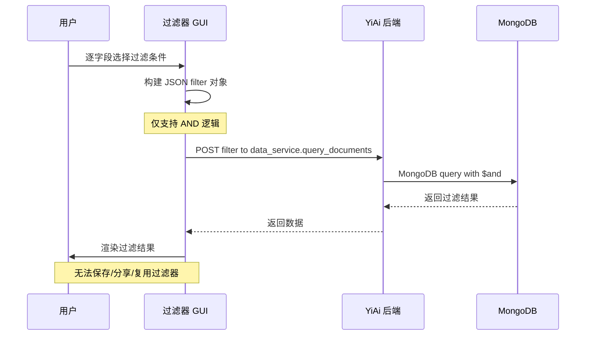
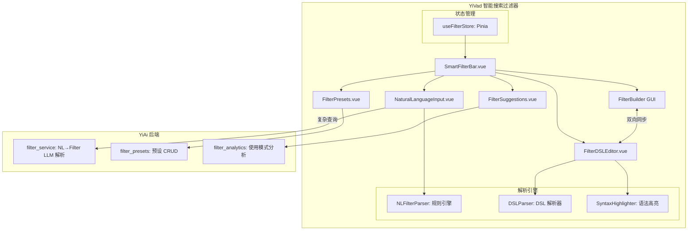
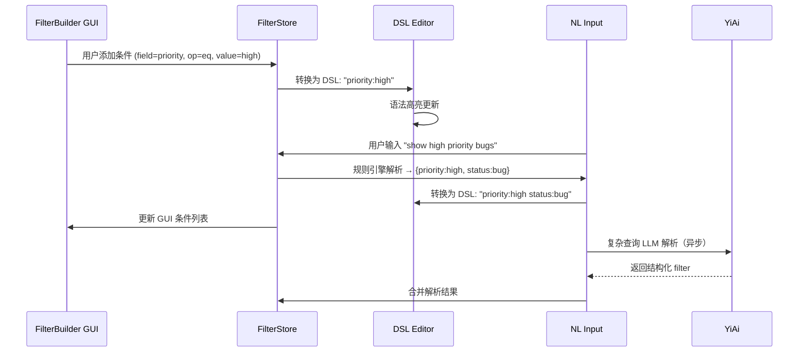
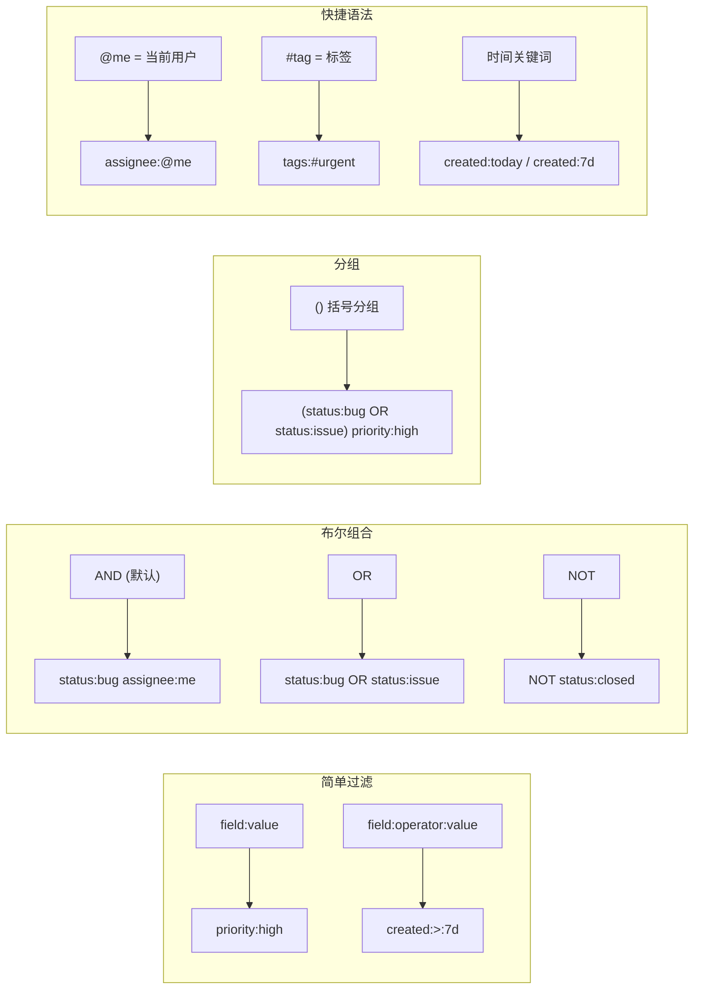

# YV-09-87: 智能搜索过滤器 — 自然语言查询、保存过滤预设、过滤器分享、使用模式建议、语法高亮、布尔组合(AND/OR/NOT)

> 需求编号：YV-09-87 · 优先级：P2 · 人天：0.3d · 状态：需求已编写
> 依赖：YV-09-36（全局搜索增强）、YV-09-68（全局搜索命令面板）

## 背景

### 问题陈述

YiVad 当前的搜索和过滤功能依赖用户手动构建复杂的查询条件——在多个下拉框中逐项选择字段、运算符和值。这种交互方式在以下场景中表现极差：

1. **思考-操作鸿沟**：用户脑中想的是"上周创建的高优先级 bug"，但界面要求将其拆解为 `status=bug AND priority=high AND created>7days ago`，认知转换成本高
2. **重复构建过滤器**：常见的过滤组合（如"我负责的未关闭 issue"）每次都需重新配置，无预设保存机制
3. **过滤器不可共享**：团队成员无法分享常用的过滤视图，每个人都要独立配置
4. **缺乏智能辅助**：系统不知道哪些过滤器常用、哪些组合用户可能感兴趣
5. **复杂布尔逻辑困难**：需要表达 `(A AND B) OR (C AND NOT D)` 这样的嵌套逻辑时，GUI 过滤器几乎无法操作
6. **过滤器语法不透明**：用户不知道当前生效的过滤条件到底是什么，缺乏可读的表达式展示

**核心矛盾**：传统 GUI 过滤器在简单场景下够用，但在复杂过滤、重复使用、团队协作场景下成为效率瓶颈。用户需要一个既能理解自然语言、又能处理复杂布尔逻辑的智能搜索过滤器。

### 影响范围

| # | 影响 | 严重程度 | 典型场景 |
|---|------|----------|----------|
| 1 | 复杂过滤器构建困难 | 高 | AND/OR/NOT 嵌套组合无法用 GUI 表达 |
| 2 | 过滤器重复配置 | 高 | 每天重新配置相同的过滤条件 |
| 3 | 自然语言到过滤条件的转换 | 高 | "上周高优先级 bug" → 手动拆解 |
| 4 | 团队过滤视图不统一 | 中 | 不同成员看到的数据范围不一致 |
| 5 | 过滤器语法不可读 | 中 | 不知道当前过滤条件具体是什么 |
| 6 | 缺少使用模式洞察 | 低 | 不知道团队常用哪些过滤组合 |

### 挑战

| 挑战 | 说明 |
|------|------|
| 自然语言理解 | 如何将"show me high priority bugs from last week"正确解析为结构化过滤条件 |
| 过滤器表达式设计 | 设计既人类可读又可机器解析的过滤器 DSL |
| AND/OR/NOT 分组 UI | 如何在 GUI 中直观表达布尔逻辑分组 |
| 预设存储与共享 | 预设存储结构、权限控制、分享机制 |
| 使用模式分析 | 如何从历史过滤行为中提取有价值的模式建议 |
| 语法高亮实现 | 在输入框中实现过滤器语法的实时高亮 |

---

## 一、现状分析

### 1.1 当前过滤器构建流程

```
用户想要查看"我负责的、最近一周创建的高优先级 bug 或 issue"
  │
  ├─ 步骤 1: 打开过滤器面板
  │   └─ 点击多个下拉框展开
  │
  ├─ 步骤 2: 选择字段 "status"
  │   └─ 选择运算符 "equals"
  │   └─ 选择值 "bug"
  │
  ├─ 步骤 3: 点击"添加条件"
  │   └─ 选择字段 "assignee"
  │   └─ 选择运算符 "equals"
  │   └─ 选择值 "当前用户"
  │
  ├─ 步骤 4: 点击"添加条件"
  │   └─ 选择字段 "priority"
  │   └─ 选择运算符 "equals"
  │   └─ 选择值 "high"
  │
  ├─ 步骤 5: 点击"添加条件"
  │   └─ 选择字段 "created_at"
  │   └─ 选择运算符 "greater than"
  │   └─ 选择值 "7 days ago"
  │
  └─ 步骤 6: 但 OR 关系无法表达！
      └─ status=bug AND status=issue 无法通过 AND 连接
      └─ 需要切换整个过滤器组的逻辑运算符，但 UI 不支持
  │
  总计: 6 个步骤 × 多次点击，且无法表达 OR 关系
```

### 1.2 当前过滤器能力矩阵

| 能力 | 可用性 | 表达方式 | 易用性 |
|------|--------|----------|--------|
| 单字段等值过滤 | 是 | GUI 下拉框 | 高 |
| 多字段 AND 组合 | 是 | GUI 逐条添加 | 中 |
| OR 逻辑组合 | 否 | 不支持 | — |
| NOT 逻辑 | 否 | 不支持 | — |
| 嵌套布尔分组 | 否 | 不支持 | — |
| 过滤器保存 | 否 | 不支持 | — |
| 过滤器分享 | 否 | 不支持 | — |
| 自然语言输入 | 否 | 不支持 | — |
| 使用模式建议 | 否 | 不支持 | — |

### 1.3 改造前数据流



### 1.4 根因矩阵

| 症状 | 根因 | 触发条件 | 频率 |
|------|------|----------|------|
| 复杂过滤无法表达 | GUI 不支持 OR/NOT/嵌套 | 需要表达 "A 或 B" 条件时 | 高 |
| 过滤器重复配置 | 无预设保存机制 | 每次打开同一页面 | 高 |
| 过滤条件不可见 | 无可读表达式展示 | 多人协作查看同一视图 | 中 |
| 无智能辅助 | 无使用模式分析 | 新用户不知如何构建过滤器 | 中 |
| 过滤语法不统一 | 无 DSL 标准 | 不同页面过滤器行为不一致 | 中 |
| 自然语言无法使用 | 无 NL→Filter 解析 | 想用自然语言时 | 中 |

---

## 二、设计决策

### 决策 1：过滤器输入方式 — 纯 GUI vs 纯文本 vs GUI+文本双模式

| 选项 | 表达能力 | 学习成本 | 实现复杂度 |
|------|----------|----------|-----------|
| 纯 GUI（下拉框 + 按钮） | 低（无法表达 OR/NOT） | 低 | 低 |
| 纯文本（DSL 输入） | 高 | 高 | 中 |
| GUI + 文本双模式 | 高 | 中 | 高 |

**选择：GUI + 文本双模式，实时双向同步。** 用户在 GUI 中添加条件时，文本输入框自动生成可读的 DSL 表达式。用户在文本框中输入 DSL 时，GUI 面板解析并展示结构化条件。两种模式之间实时双向同步，用户可在任意模式下操作。

### 决策 2：自然语言解析 — 规则匹配 vs LLM 解析 vs 混合方案

| 选项 | 准确率 | 延迟 | 离线可用 |
|------|--------|------|----------|
| 规则匹配（正则 + 关键词） | 中（80%） | < 10ms | 是 |
| LLM 解析（调用 YiAi） | 高（95%） | 500-2000ms | 否 |
| 混合方案（规则优先 → LLM 兜底） | 高 | 10-2000ms | 部分 |

**选择：混合方案（规则优先 → LLM 兜底）。** 90% 的常见自然语言查询（"高优先级 bug"、"上周创建的"、"我负责的"）通过前端规则引擎在 < 10ms 内解析。复杂或不明确的查询（"跟支付相关的紧急问题"）异步调用 YiAi LLM 解析，2s 内返回结构化过滤条件。

### 决策 3：过滤器 DSL 设计 — 类 SQL vs 类 MongoDB vs 自定义简化 DSL

| 选项 | 可读性 | 表达力 | 解析复杂度 |
|------|--------|--------|-----------|
| 类 SQL（`WHERE priority='high' AND status='bug'`） | 高 | 高 | 高 |
| 类 MongoDB（`{priority:'high', status:'bug'}`） | 低 | 高 | 低 |
| 自定义简化 DSL（`priority:high status:bug`） | 高 | 中 | 中 |

**选择：自定义简化 DSL + 类 SQL 双语法。** 默认使用简化 DSL（`field:value` 格式），支持 `AND`/`OR`/`NOT` 关键词和括号分组。同时兼容类 SQL 语法作为高级模式。DSL 易于阅读和手写，解析简单。

### 决策 4：预设分享机制 — URL 分享 vs 预设中心 vs 两者

| 选项 | 即时性 | 可发现性 | 实现复杂度 |
|------|--------|----------|-----------|
| URL 分享（编码过滤器到 URL query） | 高 | 低 | 低 |
| 预设中心（保存到后端 + 列表页） | 中 | 高 | 中 |
| URL + 预设中心 | 高 | 高 | 中 |

**选择：URL + 预设中心。** 即时分享使用 URL 编码（过滤器 → base64 → URL 参数），接收者打开即用。长期复用使用预设中心（保存到 MongoDB，可命名、分类、设置权限）。两种方式覆盖不同场景。

### 设计决策记录

| 决策 | 选项 A | 选项 B | 选项 C | 选择 | 理由 |
|------|--------|--------|--------|------|------|
| 输入方式 | 纯 GUI | 纯文本 | GUI+文本 | **GUI+文本** | 兼顾易用性和表达力 |
| NL 解析 | 规则匹配 | LLM | 混合 | **混合** | 快速且准确 |
| DSL 设计 | 类 SQL | 类 MongoDB | 自定义 | **自定义+SQL** | 可读性和表达力平衡 |
| 分享机制 | URL | 预设中心 | URL+预设 | **URL+预设** | 覆盖即时和长期场景 |

---

## 三、目标架构

### 3.1 智能搜索过滤器系统架构



### 3.2 双向同步数据流



### 3.3 DSL 语法规范



### 3.4 性能指标

| 指标 | 改造前 | 改造后 |
|------|--------|--------|
| 简单过滤器构建 | 5-8 次点击 | 1 次自然语言输入或 2-3 次点击 |
| 复杂过滤器 (OR/NOT) | 无法构建 | 文本输入 5-10s |
| 过滤器复用 | 每次重新配置 | 1 次点击加载预设 |
| 过滤器分享 | 不适用 | 1 次点击复制 URL |
| NL 解析延迟（规则） | 不适用 | < 10ms |
| NL 解析延迟（LLM） | 不适用 | < 2s |

---

## 四、具体改动

### 4.1 过滤器 DSL 解析器

```typescript
// src/composables/useFilterParser.ts (新增)

interface FilterCondition {
  field: string;
  operator: 'eq' | 'neq' | 'gt' | 'gte' | 'lt' | 'lte' | 'contains' | 'in';
  value: string | number | boolean;
}

interface FilterGroup {
  logic: 'AND' | 'OR';
  conditions: (FilterCondition | FilterGroup)[];
  negated?: boolean; // NOT 包裹
}

// DSL 语法示例:
// "priority:high status:bug" → AND {priority=high, status=bug}
// "status:bug OR status:issue" → OR {status=bug, status=issue}
// "(status:bug OR status:issue) priority:high" → AND {OR{...}, priority=high}
// "NOT status:closed assignee:@me" → AND {NOT{status=closed}, assignee=me}

export function parseFilterDSL(input: string): FilterGroup {
  // 1. Tokenize: 按空格分割，识别 AND/OR/NOT/括号
  // 2. Parse: 递归下降解析器构建 AST
  // 3. Normalize: 展开快捷语法 (@me, #tag, 时间关键词)
  // 4. Return: 标准化的 FilterGroup
}

export function serializeFilterDSL(group: FilterGroup): string {
  // FilterGroup → 可读 DSL 字符串
}
```

### 4.2 自然语言解析引擎

```typescript
// src/composables/useNLFilterParser.ts (新增)

interface NLParsedFilter {
  conditions: FilterCondition[];
  confidence: number;       // 0-1，规则引擎 > 0.9 为高置信度
  unmatched: string[];      // 未能解析的词汇
  needsLLM: boolean;        // 是否需要 LLM 兜底
}

const RULE_PATTERNS: NLPattern[] = [
  // "高优先级" → priority:high
  { pattern: /高优先|high priority|p0|p1/i, field: 'priority', value: 'high' },
  // "bug" → status:bug
  { pattern: /bug|缺陷|问题报告/i, field: 'status', value: 'bug' },
  // "上周" → created:>7d
  { pattern: /上周|last week|过去一周/i, field: 'created', op: 'gte', value: '7d' },
  // "我的" / "我负责" → assignee:@me
  { pattern: /我(的|负责)|my|assigned to me/i, field: 'assignee', value: '@me' },
  // "未关闭" / "open" → status:!=closed
  { pattern: /未关闭|open|进行中/i, field: 'status', op: 'neq', value: 'closed' },
  // ... 更多规则
];

export function parseNLFilter(input: string): NLParsedFilter {
  // 1. 中文分词 (结巴或简单规则)
  // 2. 匹配已知模式 → 高置信度
  // 3. 剩余词汇标记为 unmatched
  // 4. 如果 unmatched 占比 > 30% → needsLLM = true
}
```

### 4.3 智能过滤器搜索栏 UI

```typescript
// src/components/search/SmartFilterBar.vue (新增)

// 功能:
// - 双模式切换: NL 输入 ↔ DSL 编辑器
//   - 默认显示 NL 输入框 (placeholder: "搜索... 试试'上周创建的高优bug'")
//   - 切换到 DSL 模式显示语法高亮编辑器
//
// - NL 输入:
//   - 实时解析（规则引擎，< 10ms）
//   - 复杂查询异步 LLM 解析（loading 状态 + 兜底结果）
//   - 解析结果实时预览在输入框下方
//   - 点击预览条目可编辑/删除
//
// - DSL 编辑器:
//   - 语法高亮: 字段名(蓝色), 运算符(橙色), 值(绿色), AND/OR/NOT(紫色), 括号(灰色)
//   - 自动补全: 字段名 (基于当前 collection schema), 值 (基于已有数据)
//   - 错误提示: 语法错误红色下划线 + tooltip
//
// - FilterBuilder GUI:
//   - 从 DSL 编辑器侧面板展开
//   - 条件分组可视化: AND/OR 组用不同颜色边框
//   - 拖拽条件切换分组
//   - NOT 切换开关
//
// - 过滤器预设:
//   - 保存按钮 → 命名 + 选择可见性 (私有/团队/公开)
//   - 预设选择器下拉菜单 (最近使用 + 收藏 + 全部)
//   - 预设管理页面 (编辑/删除/重命名)
//
// - 过滤器建议:
//   - 基于当前上下文 (页面/collection)
//   - 基于使用频率 (团队热门过滤器)
//   - 基于相似用户 (协作过滤)
//
// - 分享:
//   - "复制链接"按钮 → URL 编码当前过滤器
//   - 接收者打开链接自动应用过滤器
```

### 4.4 语法高亮实现

```typescript
// src/composables/useFilterHighlight.ts (新增)

interface HighlightToken {
  text: string;
  type: 'field' | 'operator' | 'value' | 'logic' | 'paren' | 'shortcut' | 'error';
  start: number;
  end: number;
}

export function tokenizeDSL(input: string): HighlightToken[] {
  // 词法分析:
  // - field: 冒号前的单词 → 蓝色
  // - operator: 冒号后的 >, <, >=, <=, != → 橙色
  // - value: 运算符后的值 → 绿色
  // - logic: AND, OR, NOT → 紫色粗体
  // - paren: (, ) → 灰色
  // - shortcut: @me, #tag → 绿色斜体
  // - error: 无法识别的 token → 红色下划线
}

// 使用: <code> 标签包裹，每个 token 用 <span class="hl-{type}"> 渲染
```

### 4.5 文件变更清单

| 文件 | 操作 | 说明 |
|------|------|------|
| `src/components/search/SmartFilterBar.vue` | 新增 | 智能搜索过滤器主组件 |
| `src/components/search/FilterDSLEditor.vue` | 新增 | DSL 语法高亮编辑器 |
| `src/components/search/FilterBuilderGUI.vue` | 新增 | 可视化过滤器构建面板 |
| `src/components/search/FilterPresets.vue` | 新增 | 预设管理和选择器 |
| `src/components/search/FilterSuggestions.vue` | 新增 | 智能建议下拉 |
| `src/components/search/NLFilterInput.vue` | 新增 | 自然语言输入框 |
| `src/composables/useFilterParser.ts` | 新增 | DSL 解析/序列化引擎 |
| `src/composables/useNLFilterParser.ts` | 新增 | 自然语言解析引擎 |
| `src/composables/useFilterHighlight.ts` | 新增 | 语法高亮词法分析 |
| `src/composables/useFilterShare.ts` | 新增 | 过滤器 URL 编码/分享 |
| `src/stores/filter.ts` | 新增 | 过滤器 Pinia store |
| `src/api/filter.ts` | 新增 | 过滤器 API (预设 CRUD/建议) |
| `tests/unit/useFilterParser.test.ts` | 新增 | DSL 解析器测试 |
| `tests/unit/useNLFilterParser.test.ts` | 新增 | NL 解析器测试 |

### 4.6 后端预设 API

```python
# YiAi/services/filter/filter_service.py (新增)

# filter_service 方法:
# - save_preset(name, filter_dsl, visibility, collection) → preset_id
# - get_presets(collection, user_id) → list[FilterPreset]
# - delete_preset(preset_id)
# - get_suggestions(user_id, collection) → list[FilterSuggestion]
#   - 基于当前 collection 的热门过滤器
#   - 基于用户的最近使用
#   - 基于团队协作模式
```

---

## 五、实施步骤

| 步骤 | 操作 | 路径 | 验证 | 人天 |
|------|------|------|------|------|
| 1 | 实现 DSL 解析器和序列化器 | `useFilterParser.ts` | 解析/序列化往返一致 | 0.05 |
| 2 | 实现 NL 规则解析引擎 | `useNLFilterParser.ts` | 常见 NL 查询正确解析 | 0.04 |
| 3 | 实现语法高亮词法分析 | `useFilterHighlight.ts` | token 类型和位置正确 | 0.03 |
| 4 | 实现 DSL 编辑器组件 | `FilterDSLEditor.vue` | 语法高亮 + 自动补全 | 0.05 |
| 5 | 实现 SmartFilterBar 主组件 | `SmartFilterBar.vue` | NL/DSL/GUI 三模式切换 | 0.04 |
| 6 | 实现 FilterBuilder GUI | `FilterBuilderGUI.vue` | GUI ↔ DSL 双向同步 | 0.03 |
| 7 | 实现过滤预设管理 | `FilterPresets.vue` | 保存/加载/删除预设 | 0.03 |
| 8 | 实现过滤器建议 | `FilterSuggestions.vue` | 建议展示和点击应用 | 0.02 |
| 9 | 集成测试 | 所有组件 | 完整 NL→过滤→分享流程 | 0.01 |

**总人天：0.3d**

---

## 六、测试规格

### 场景 1：自然语言解析 — 简单查询

**GIVEN** 用户在自然语言输入框中输入 "高优先级 bug"
**WHEN** 规则引擎解析
**THEN** 应解析为 `priority:high AND status:bug`
**AND** DSL 编辑器同步显示 "priority:high status:bug"
**AND** GUI 面板显示两个过滤条件（priority=high, status=bug, 逻辑=AND）

### 场景 2：自然语言解析 — 复杂查询触发 LLM

**GIVEN** 用户输入 "跟支付相关的那个紧急问题"
**WHEN** 规则引擎无法完全解析（unmatched = ["支付", "紧急"]）
**THEN** 标记 needsLLM = true
**AND** 异步调用 YiAi LLM 解析
**AND** 显示 loading 状态（骨架屏）
**AND** LLM 返回 `tags:payment priority:urgent` 后更新过滤器

### 场景 3：DSL 编辑器语法高亮

**GIVEN** 用户在 DSL 编辑器中输入 "NOT status:closed (priority:high OR priority:urgent)"
**WHEN** 实时词法分析
**THEN** NOT 应显示为紫色粗体
**AND** status 应显示为蓝色
**AND** closed 应显示为绿色
**AND** 括号应显示为灰色
**AND** OR 应显示为紫色粗体

### 场景 4：GUI 和 DSL 双向同步

**GIVEN** 在 GUI 中添加条件 `status = bug`，逻辑为 AND
**WHEN** 查看 DSL 编辑器
**THEN** DSL 应显示 "status:bug"
**WHEN** 在 DSL 编辑器中追加 " OR status:issue"
**THEN** GUI 应显示 OR 分组，包含两个 status 条件

### 场景 5：保存和加载过滤预设

**GIVEN** 当前过滤器为 "assignee:@me priority:high status:bug"
**WHEN** 用户点击"保存预设"，输入名称"我的高优 bug"
**AND** 选择可见性为"团队"
**THEN** 预设保存到后端
**AND** 团队成员在预设列表中可见"我的高优 bug"
**WHEN** 团队成员点击加载该预设
**THEN** 过滤器自动应用为 "assignee:@me priority:high status:bug"

### 场景 6：过滤器 URL 分享

**GIVEN** 当前过滤器为 "status:bug priority:high"
**WHEN** 用户点击"复制链接"
**THEN** 生成 URL: `yivad/bugs?filter=eyJzdGF0dXMiOiJidWciLCJwcmlvcml0eSI6ImhpZ2gifQ==`
**AND** 剪贴板中应复制完整 URL
**WHEN** 其他用户打开该 URL
**THEN** 自动应用过滤器 "status:bug priority:high"
**AND** SmartFilterBar 显示当前的过滤条件

---

## 七、风险与缓解

| 风险 | 概率 | 影响 | 缓解措施 |
|------|------|------|----------|
| NL 解析准确率不足 | 中 | 高 | 显示解析结果预览 + 置信度，让用户确认后再应用 |
| LLM 解析延迟过高 | 中 | 中 | 规则引擎优先处理 90% 常见查询，LLM 仅兜底；LLM 超时 2s 降级为规则引擎结果 |
| DSL 语法学习成本 | 中 | 中 | 默认 NL 模式 + 自动补全 + 实时语法错误提示 |
| AND/OR/NOT 分组 UI 复杂 | 中 | 中 | 分组用不同颜色 + 缩进 + 折叠/展开，默认扁平模式 |
| URL 中过滤器数据过大 | 低 | 中 | 限制 URL 最大长度 2048 字符，超长自动开启预设分享 |
| 预设数据膨胀 | 低 | 低 | 限制每用户 50 个预设，团队 100 个预设 |

---

## 八、回滚策略

| 场景 | 回滚操作 | 影响 |
|------|----------|------|
| NL 解析严重错误 | 关闭 NL 模式，仅保留 DSL + GUI 双模式 | 无自然语言输入 |
| LLM 解析不可用 | 降级为纯规则引擎，显示"AI 解析暂不可用" | 复杂查询需手动构造 |
| 语法高亮性能问题 | 关闭实时高亮，仅在失焦时高亮 | 体验下降 |
| 预设服务异常 | 降级为仅 URL 分享模式，预设列表显示缓存 | 预设功能不可用 |
| 完全回滚 | 移除 SmartFilterBar，恢复原有 GUI 过滤器面板 | 回到改造前 |

---

## 九、设计决策记录

### D-01：为什么 NL 解析不全部使用 LLM？

LLM 解析准确率高但延迟高（500ms-2s），且依赖网络。对于高频的简单查询（"高优先级 bug"、"我的 issue"），规则引擎可在 < 10ms 内精确解析，体验更好。混合方案将 90% 的查询通过规则引擎快速处理，仅将复杂/模糊查询交由 LLM 兜底。

### D-02：为什么 DSL 使用 `field:value` 格式而非类 SQL？

`field:value` 格式更简洁（`priority:high` vs `WHERE priority = 'high'`），不需要引号包裹值，单行表达能力强。同时与常见的搜索引擎语法（Gmail、Jira、GitHub）一致，用户学习成本低。类 SQL 作为高级模式可选。

### D-03：GUI ↔ DSL 双向同步为何采用单向数据流？

Pinia store 作为唯一数据源，DSL 编辑器和 GUI 面板都是视图层。Store 中存储的是结构化 `FilterGroup` AST。DSL 编辑器通过 `serializeFilterDSL` 将 AST 转换为文本；GUI 面板直接渲染 AST。用户在任何视图修改都会更新 Store 中的 AST，然后另一视图自动响应。这避免了循环更新问题。

### D-04：为什么过滤器建议基于使用模式而非固定模板？

固定模板（如"未关闭的 bug"）假设所有用户和团队的需求相同，但实际上不同团队的工作流差异大。基于使用模式分析（频率、时间、上下文）的个性化建议更有价值，且能自动适应团队变化。

---

## 十、可观测性

### 指标

| 指标 | 类型 | 说明 |
|------|------|------|
| `yivad.filter.nl.parse.success` | Counter | NL 解析成功次数 |
| `yivad.filter.nl.parse.rule` | Counter | 仅规则引擎解析次数 |
| `yivad.filter.nl.parse.llm` | Counter | 触发 LLM 解析次数 |
| `yivad.filter.nl.parse.latency` | Histogram | NL 解析延迟 |
| `yivad.filter.dsl.edit` | Counter | DSL 编辑器使用次数 |
| `yivad.filter.preset.save` | Counter | 预设保存次数 |
| `yivad.filter.preset.load` | Counter | 预设加载次数 |
| `yivad.filter.share` | Counter | 过滤器分享次数 |

### 告警

| 告警 | 条件 | 级别 |
|------|------|------|
| NL 解析失败率过高 | 1h 内规则引擎失败率 > 30% | WARNING |
| LLM 解析超时率过高 | 1h 内 LLM 超时 > 10% | WARNING |
| DSL 语法错误率过高 | 1h 内语法错误 > 20 次 | INFO |

---

## 十一、代码审查检查清单

- [ ] DSL 解析器正确解析所有支持的操作符（eq/neq/gt/gte/lt/lte/contains/in）
- [ ] AND/OR/NOT 布尔逻辑和括号分组正确
- [ ] GUI ↔ DSL 双向实时同步
- [ ] NL 规则引擎覆盖 10+ 常见查询模式
- [ ] LLM 兜底解析有超时限制（2s）
- [ ] 语法高亮 token 类型和颜色正确
- [ ] 预设 CRUD 操作正确
- [ ] URL 分享编码/解码往返一致
- [ ] 过滤器建议基于实际使用数据
- [ ] 预设权限控制（私有/团队/公开）正确
- [ ] 错误输入有友好提示（红色下划线 + tooltip）
- [ ] 自动补全显示当前 collection 的字段列表

---

## 回归问题预测

| # | 预测问题 | 原因 | 验证方法 |
|---|---------|------|---------|
| 1 | DSL 解析器对含特殊字符的值解析错误，如 `title:"hello world"` 中的空格被当作分隔符 | 默认按空格 tokenize，但引号包裹的值应作为整体 | 测试 `title:"hello world"` 解析结果，值应为 `hello world` 而非 `"hello` |
| 2 | GUI 中快速切换 AND/OR 逻辑运算符后，DSL 编辑器未正确更新，显示旧的分组结构 | GUI 修改触发 Store 更新，但 DSL serializer 未收到更新通知或使用了缓存的旧 AST | 快速点击 AND↔OR 切换 5 次，验证 DSL 编辑器最终显示正确 |
| 3 | NL 解析的规则引擎与 LLM 解析结果冲突时，合并逻辑导致条件重复或矛盾，如规则引擎识别 status=bug 但 LLM 也识别 status=bug | 合并两个解析结果时未去重，导致 DSL 中出现 `status:bug status:bug` | 验证合并后的 FilterGroup 中每个 (field, operator, value) 三元组唯一 |
| 4 | URL 分享的过滤器包含 `@me` 快捷语法时，接收者应用后 `@me` 被解析为分享者而非接收者 | `@me` 是相对于当前用户的动态值，URL 编码时应展开为具体用户 ID | 用户 A 分享 `assignee:@me` 过滤器，用户 B 打开后验证 assignee 指向 B 而非 A |
| 5 | DSL 编辑器自动补全建议包含已废弃的字段名，用户选择后提交过滤器被后端静默忽略 | 自动补全字段列表来自缓存的 schema，schema 更新后缓存未刷新 | 后端新增/删除字段后，验证前端自动补全列表同步更新 |
| 6 | 过滤预设数量达到上限后，用户保存新预设静默失败，无错误提示 | 保存预设时未检查数量上限，后端返回错误但前端未展示 | 达到 50 个预设上限后尝试保存，验证弹出"预设数量已达上限"提示 |

---

## 性能分析

### 关键操作耗时

| 操作 | 耗时 | 说明 |
|------|------|------|
| DSL 解析 | < 5ms | 递归下降解析器（< 100 token） |
| DSL 序列化 | < 2ms | AST → 字符串 |
| NL 规则解析 | < 10ms | 正则匹配 + 融合 |
| NL LLM 解析 | 500-2000ms | 网络往返 + LLM 推理 |
| 语法高亮 | < 5ms | 词法分析 + DOM 更新 |
| 预设加载 | < 50ms | API 请求 |
| 建议加载 | < 100ms | API + 聚合计算 |
| GUI ↔ DSL 同步 | < 2ms | Pinia 响应式更新 |

### 数据量预估

| 数据项 | 大小 |
|--------|------|
| 过滤器 DSL 字符串（平均） | ~50 字节 |
| 过滤器 DSL（复杂，含嵌套） | ~200 字节 |
| URL 编码过滤器 | ~300 字节（base64 膨胀 33%） |
| 过滤预设（单个） | ~500 字节 |
| 使用模式统计数据 | ~2KB/用户 |
| 语法高亮 token 数组（50 字符输入） | ~30 个 token |

---

## 相关文档

- [YV-09-36 全局搜索增强](36-需求-全局搜索增强.md)
- [YV-09-68 全局搜索命令面板](68-需求-全局搜索命令面板.md)

