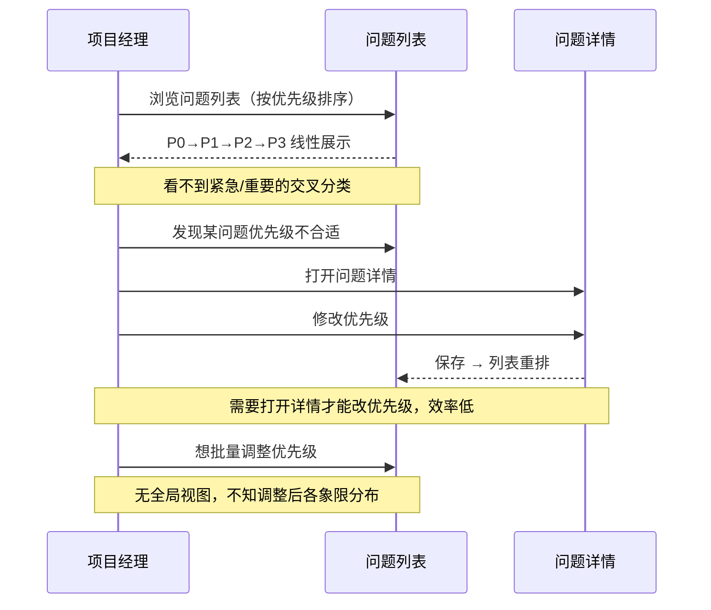
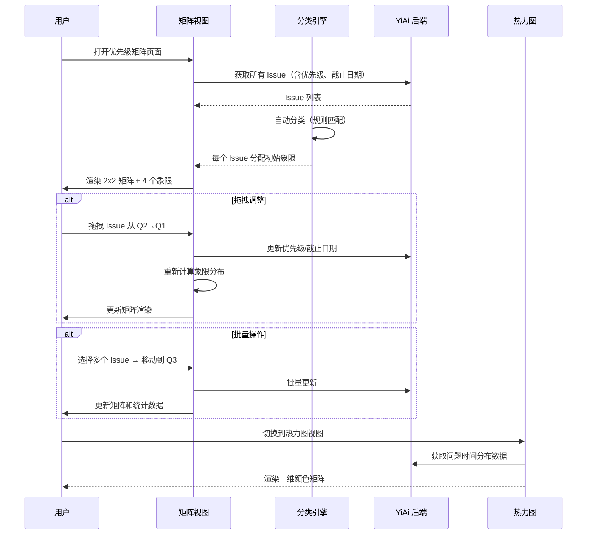
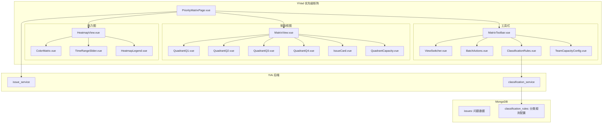
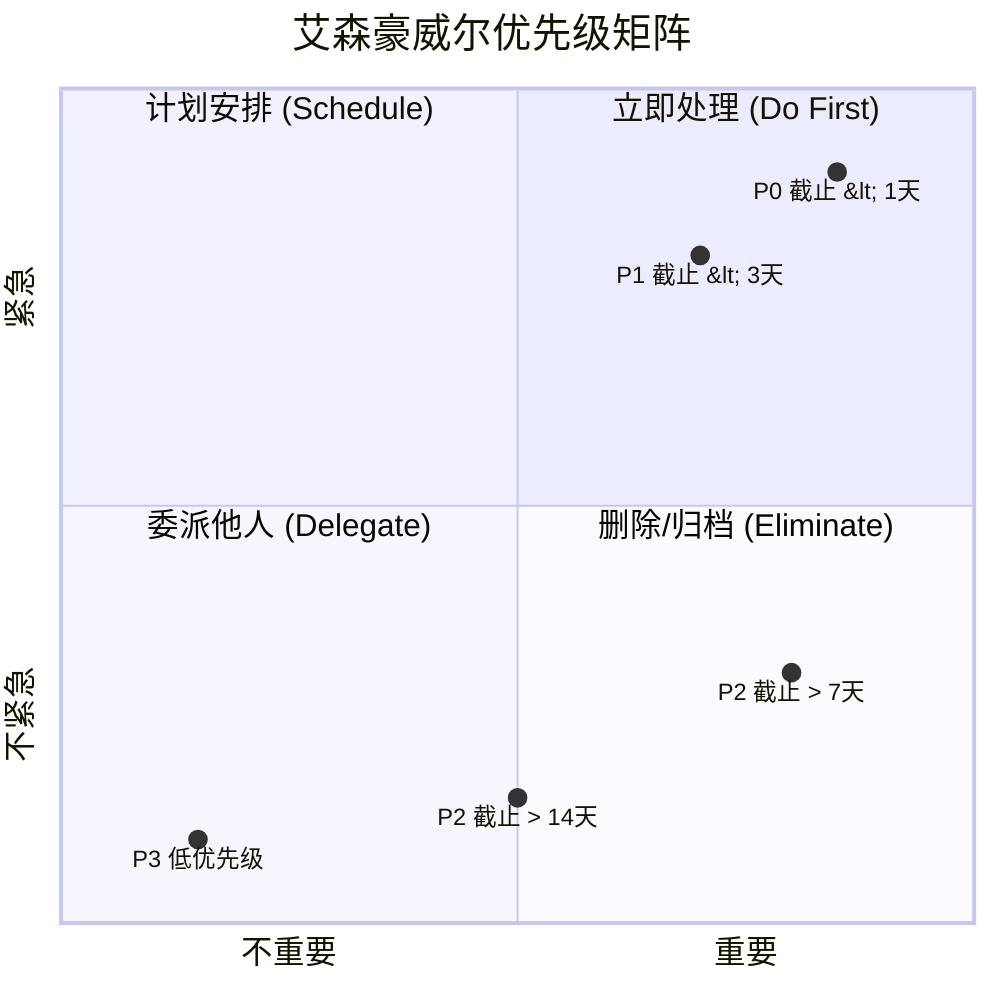

# YV-09-91: 问题分类与优先级矩阵 — 艾森豪威尔矩阵视图(紧急/重要)、象限间拖拽问题、按优先级+截止日期自动分类、象限容量限制、优先级热力图、批量重排优先级

> 需求编号：YV-09-91 · 优先级：P2 · 人天：0.3d · 状态：需求已编写
> 依赖：YV-09-89（状态流转可视化）

## 背景

### 问题陈述

YiVad 当前的问题（Issues）管理使用扁平列表 + 筛选器的方式，用户在查看时只能通过排序和筛选来组织问题。这种模式在问题数量较少时（< 30 条）勉强可用，但随着项目规模增长（> 100 条 Issue），团队面临严重的优先级管理混乱：

1. **优先级判断主观且不一致**：团队成员对 P0/P1/P2/P3 的理解不同——有人把所有问题都标 P0，有人把重要问题标 P3，缺乏统一的优先级框架
2. **紧急与重要混淆**：根据艾森豪威尔原则，紧急（Urgent）和重要（Important）是两个独立维度，但当前扁平优先级将它们混为一谈
3. **优先级变更缺乏可视化**：从列表中拖拽调整优先级不够直观，无法看到全局优先级分布
4. **截止日期与优先级脱节**：临近截止日期的问题不会自动提升优先级，导致过期问题被淹没在列表中
5. **批量重排无上下文**：批量修改优先级时，无法看到每个问题在整体矩阵中的位置
6. **容量感知缺失**：不知道每个优先级象限中有多少问题，是否超出团队处理能力

**核心矛盾**：优先级管理需要二维视角（紧急+重要）和全局视图，但当前扁平列表只提供了线性排序，导致优先级判断失准和资源分配失衡。

### 影响范围

| # | 影响 | 严重程度 | 典型场景 |
|---|------|----------|----------|
| 1 | 优先级判断不一致 | 高 | 5 个团队成员对同一个 Issue 给出 3 种不同优先级 |
| 2 | 紧急但不重要的问题占用资源 | 高 | 有人催的杂事排挤了重要的基础建设 |
| 3 | 过期问题被遗忘 | 中 | 截止日期过了 2 周的 P1 问题和新建 P2 问题混在一起 |
| 4 | 无法感知资源过载 | 中 | 某个象限堆积 30 条问题而团队只有 3 人 |
| 5 | 批量重排无全局视角 | 低 | 把 10 条问题从 P2→P1，但不知道 P1 已有 20 条 |

### 挑战

| 挑战 | 说明 |
|------|------|
| 紧急/重要的量化标准 | 如何定义紧急和重要？截止日期映射到紧急度、优先级标签映射到重要度？ |
| 自动分类算法的准确性 | AI 或规则自动分类的准确率可能不高，需人机协作 |
| 象限容量限制的合理性 | 如何根据团队规模和交付速率设定合理的象限容量？ |
| 拖拽跨象限的 UX | 从列表视图拖拽到矩阵视图的交互复杂性 |
| 热力图的数据刷新 | 优先级热力图需要实时反映数据变化，但频繁重绘会影响性能 |

---

## 一、现状分析

### 1.1 当前优先级管理流程

```
团队管理问题优先级:
  │
  ├─ 创建 Issue 时手动选择优先级
  │   ├─ P0 - 紧急（立即处理）
  │   ├─ P1 - 高（本周内）
  │   ├─ P2 - 中（本月内）
  │   └─ P3 - 低（有空再说）
  │   问题: 选择全凭感觉，无客观标准
  │
  ├─ 列表视图按优先级排序
  │   ├─ P0 在最前
  │   └─ 问题: 无法区分"紧急不重要"和"重要不紧急"
  │
  ├─ 修改单个问题优先级
  │   ├─ 打开详情 → 下拉选择 → 保存
  │   └─ 问题: 无法看到整体优先级分布
  │
  └─ 批量修改优先级
      ├─ 勾选多个 → 批量操作 → 选择新优先级
      └─ 问题: 缺少全局视图，不知每个象限已有多少问题
```

### 1.2 现状能力矩阵

| 能力 | 可用性 | 限制 |
|------|--------|------|
| 优先级字段（P0-P3） | 是 | 单维度，无紧急/重要区分 |
| 截止日期字段 | 是 | 不与优先级联动 |
| 列表排序 | 是 | 仅线性排序 |
| 矩阵视图 | 否 | — |
| 拖拽调整优先级 | 否 | — |
| 自动分类 | 否 | — |
| 象限容量控制 | 否 | — |
| 优先级热力图 | 否 | — |

### 1.3 改造前数据流



### 1.4 根因矩阵

| 症状 | 根因 | 触发条件 | 频率 |
|------|------|----------|------|
| 优先级判断不一致 | 无统一分类框架 | 多人协作为 Issue 分配优先级时 | 高 |
| 紧急/重要混淆 | 单维度优先级 P0-P3 | 同时存在紧急和重要两个维度时 | 高 |
| 过期问题淹没 | 截止日期与优先级不联动 | Issue 超过截止日期时 | 中 |
| 资源分配失衡 | 无象限容量可视化 | 某个象限堆积过多时 | 中 |
| 批量调整盲目 | 无全局分布视图 | 批量修改优先级时 | 中 |

---

## 二、设计决策

### 决策 1：矩阵模型 — 艾森豪威尔 2x2 vs MoSCoW vs RICE

| 选项 | 维度数 | 直观性 | 适用场景 |
|------|--------|--------|----------|
| 艾森豪威尔 2x2（紧急/重要） | 2 | 高 | 通用任务优先级 |
| MoSCoW（Must/Should/Could/Won't） | 1 | 中 | 需求优先级 |
| RICE（Reach/Impact/Confidence/Effort） | 4 | 低 | 产品路线图 |

**选择：艾森豪威尔 2x2 矩阵。** 二维矩阵最直观地区分"紧急"和"重要"——这正是当前单维度 P0-P3 缺失的视角。同时保留 P0-P3 作为重要度参考，截止日期作为紧急度参考，桥接旧的优先级系统到新矩阵。

### 决策 2：紧急/重要的自动分类 — 纯规则 vs ML 模型 vs 规则+手动调整

| 选项 | 准确度 | 实现复杂度 | 可解释性 |
|------|--------|-----------|----------|
| 纯规则映射 | 中（70%） | 低 | 高 |
| ML 模型分类 | 高（85%） | 高 | 低 |
| 规则预分类 + 手动调整 | 中+手动修正 | 中 | 高 |

**选择：规则预分类 + 手动调整。** 初始根据截止日期和优先级标签自动映射到矩阵象限，用户可以拖拽调整。规则透明可解释（如"截止日期 < 3 天 = 紧急"），用户可配置规则参数。ML 方案对于当前数据量过度设计。

### 决策 3：象限容量限制 — 硬限制 vs 软警告 vs 仅可视化

| 选项 | 强制性 | 灵活性 | 实现复杂度 |
|------|--------|--------|-----------|
| 硬限制（某象限满后不能放入） | 高 | 低 | 中 |
| 软警告（超出时警告但不阻止） | 中 | 高 | 中 |
| 仅可视化（显示数量无限制） | 低 | 高 | 低 |

**选择：软警告 + 可视化。** 按团队规模推荐象限容量（如团队 N 人，每象限建议不超过 N*3 条），超出时象限边框变为橙色并显示警告图标。不强制阻止（因为有时确实需要超出），但通过视觉反馈引导合理分配。

### 决策 4：优先级热力图 — 二维颜色矩阵 vs 树图 vs 气泡图

| 选项 | 信息密度 | 实现复杂度 | 数据映射 |
|------|----------|-----------|----------|
| 二维颜色矩阵（x=时间 y=优先级） | 高 | 中 | 直观 |
| 树图 | 中 | 低 | 一般 |
| 气泡图 | 高 | 高 | 一般 |

**选择：二维颜色矩阵。** X 轴为时间维度（本周/本月/本季度），Y 轴为优先级（P0-P3），每个单元格颜色深度表示问题数量。额外维度：颜色（紧急程度）和大小（问题数）。热力图默认显示最近 3 个月数据，支持时间范围滑块调整。

### 设计决策记录

| 决策 | 选项 A | 选项 B | 选项 C | 选择 | 理由 |
|------|--------|--------|--------|------|------|
| 矩阵模型 | 艾森豪威尔 2x2 | MoSCoW | RICE | **艾森豪威尔** | 双维度直观 |
| 自动分类 | 纯规则 | ML | 规则+手动 | **规则+手动** | 透明可控 |
| 容量限制 | 硬限制 | 软警告 | 仅可视化 | **软警告+可视化** | 引导但不强制 |
| 热力图 | 颜色矩阵 | 树图 | 气泡图 | **颜色矩阵** | 信息密度高 |

---

## 三、目标架构

### 3.1 优先级矩阵管理系统



### 3.2 组件结构



### 3.3 艾森豪威尔矩阵象限定义



### 3.4 性能指标

| 指标 | 改造前 | 改造后 |
|------|--------|--------|
| 优先级判断一致性 | 低（凭感觉） | 高（规则驱动+矩阵可视化） |
| 全局优先级视角 | 无（线性列表） | 一屏看清紧急/重要分布 |
| 调整单个优先级 | 3 步（打开详情→改→保存） | 1 步（拖拽） |
| 批量重排 | 盲调（无上下文） | 有矩阵上下文 |
| 容量感知 | 无 | 实时象限容量可视化 |

---

## 四、具体改动

### 4.1 自动分类规则引擎

```typescript
// 改造前：无自动分类逻辑
// src/composables/useClassificationEngine.ts (改造后)

interface ClassificationRule {
  id: string;
  name: string;
  conditions: ClassificationCondition[];
  targetQuadrant: Quadrant;
  priority: number;
}

type Quadrant = 'Q1' | 'Q2' | 'Q3' | 'Q4';

interface ClassificationResult {
  issueId: string;
  quadrant: Quadrant;
  confidence: number; // 0-1
  reasons: string[];
}

class ClassificationEngine {
  // 默认分类规则
  private defaultRules: ClassificationRule[] = [
    {
      id: 'urgent-important',
      name: '紧急且重要',
      conditions: [
        { field: 'priority', operator: 'in', value: ['P0', 'P1'] },
        { field: 'dueDate', operator: 'within', value: 3 }, // 3 天内
        { field: 'status', operator: 'neq', value: 'done' },
      ],
      targetQuadrant: 'Q1',
      priority: 1,
    },
    {
      id: 'important-not-urgent',
      name: '重要不紧急',
      conditions: [
        { field: 'priority', operator: 'in', value: ['P1', 'P2'] },
        { field: 'dueDate', operator: 'after', value: 7 }, // 7 天以后
        { field: 'status', operator: 'neq', value: 'done' },
      ],
      targetQuadrant: 'Q2',
      priority: 2,
    },
    {
      id: 'urgent-not-important',
      name: '紧急不重要',
      conditions: [
        { field: 'priority', operator: 'in', value: ['P2', 'P3'] },
        { field: 'dueDate', operator: 'within', value: 2 },
        { field: 'status', operator: 'neq', value: 'done' },
      ],
      targetQuadrant: 'Q3',
      priority: 3,
    },
    {
      id: 'not-urgent-not-important',
      name: '不紧急不重要（默认象限）',
      conditions: [
        { field: 'status', operator: 'neq', value: 'done' },
      ],
      targetQuadrant: 'Q4',
      priority: 99, // 兜底规则
    },
  ];

  // 分类单个 Issue
  classify(issue: Issue, rules?: ClassificationRule[]): ClassificationResult {
    const activeRules = rules || this.defaultRules;

    for (const rule of activeRules.sort((a, b) => a.priority - b.priority)) {
      const matchResult = this.matchConditions(issue, rule.conditions);
      if (matchResult.matched) {
        return {
          issueId: issue.id,
          quadrant: rule.targetQuadrant,
          confidence: matchResult.confidence,
          reasons: matchResult.reasons,
        };
      }
    }

    // 不应到达此处（default rule 兜底），但作为安全网
    return {
      issueId: issue.id,
      quadrant: 'Q4',
      confidence: 1,
      reasons: ['默认分类（无匹配规则）'],
    };
  }

  // 批量分类
  classifyBatch(issues: Issue[]): ClassificationResult[] {
    return issues.map(issue => this.classify(issue));
  }

  // 条件匹配
  private matchConditions(issue: Issue, conditions: ClassificationCondition[]) {
    let matched = true;
    let confidence = 1;
    const reasons: string[] = [];

    for (const cond of conditions) {
      const fieldValue = issue[cond.field];
      const match = this.evaluateCondition(fieldValue, cond);
      if (!match) {
        matched = false;
        break;
      }
      reasons.push(`${cond.field} ${cond.operator} ${cond.value}`);
    }

    confidence = matched ? reasons.length / conditions.length : 0;
    return { matched, confidence, reasons };
  }

  // 条件评估
  private evaluateCondition(value: any, cond: ClassificationCondition): boolean {
    switch (cond.operator) {
      case 'eq': return value === cond.value;
      case 'neq': return value !== cond.value;
      case 'in': return (cond.value as string[]).includes(value);
      case 'within':
        if (!value) return false; // 无截止日期的跳过时间条件
        const daysDiff = this.daysFromNow(new Date(value));
        return daysDiff <= (cond.value as number);
      case 'after':
        if (!value) return false;
        const remaining = this.daysFromNow(new Date(value));
        return remaining >= (cond.value as number);
      default: return false;
    }
  }

  private daysFromNow(date: Date): number {
    return Math.ceil((date.getTime() - Date.now()) / (1000 * 60 * 60 * 24));
  }
}
```

### 4.2 矩阵视图组件

```typescript
// src/views/issues/PriorityMatrixPage.vue (新增)

// 功能：
// - 页面布局：
//   - 中央：2x2 矩阵（4 个象限）
//   - 顶部：视图切换器（矩阵/热力图/列表）+ 工具栏
//   - 右侧：详情面板（点击 Issue 卡片弹出）
// - 矩阵渲染：
//   - 每个象限：标题 + 描述 + 容量指示器 + Issue 卡片列表
//   - Q1（紧急重要）：红色边框 — "立即处理"
//   - Q2（重要不紧急）：蓝色边框 — "计划安排"
//   - Q3（紧急不重要）：黄色边框 — "委派他人"
//   - Q4（不紧急不重要）：灰色边框 — "删除/归档"
// - Issue 卡片：
//   - 显示标题、优先级标签、截止日期、负责人头像
//   - 颜色表示过期状态（红色=已过期，橙色=即将过期）
//   - 拖拽手柄
// - 拖拽交互：
//   - 卡片可在象限间拖拽
//   - 拖入新象限时自动更新优先级和截止日期提示
//   - 确认对话框（提示即将修改的字段）
```

### 4.3 象限容量管理

```typescript
// src/components/issues/QuadrantCapacity.vue (新增)

// 功能：
// - 容量指示器：
//   - 每个象限顶部显示 "N / 建议最大" 的进度条
//   - N < 80% → 绿色，80-100% → 橙色，> 100% → 红色
// - 容量配置：
//   - 团队规模输入（人数）
//   - 自动计算建议容量 = 人数 × 3（经验公式，可自定义乘数）
//   - 每个象限可单独设置容量上限
// - 超出警告：
//   - 象限边框闪烁橙色
//   - 顶部全局警告条
//   - 拖入超容量象限时弹出确认
```

### 4.4 优先级热力图

```typescript
// src/components/issues/HeatmapView.vue (新增)

// 功能：
// - 二维颜色矩阵：
//   - X 轴：时间维度（本周/本月/本季度/自定义范围）
//   - Y 轴：优先级（P0/P1/P2/P3）
//   - 单元格颜色深度 → 问题数量
//   - 点击单元格 → 展示该分组的问题列表
// - 时间范围滑块：
//   - 预设：1 周 / 1 月 / 3 月 / 6 月 / 1 年
//   - 自定义日期范围
// - 图例：
//   - 颜色梯度（浅蓝→深蓝→红色）
//   - 数值范围标注
// - 趋势线：
//   - 各优先级的问题数量变化趋势（折线图叠加）
```

### 4.5 批量操作工具栏

```typescript
// src/components/issues/BatchActions.vue (新增)

// 功能：
// - 批量选择：
//   - 框选（鼠标拖拽矩阵中的卡片）
//   - Shift 点击连续选择
//   - Ctrl/Cmd 点击多选
// - 批量操作菜单：
//   - 移动到象限（Q1/Q2/Q3/Q4）
//   - 修改优先级（P0-P3）
//   - 修改截止日期（+1天/+3天/+7天/自定义）
//   - 批量指派人
// - 操作预览：
//   - 执行前显示受影响的问题列表和数量
//   - 显示目标象限的容量变化
// - 撤销：
//   - 批量操作后支持撤销（5 秒内）
```

### 4.6 文件变更清单

| 文件 | 操作 | 说明 |
|------|------|------|
| `src/views/issues/PriorityMatrixPage.vue` | 新增 | 优先级矩阵主页面 |
| `src/components/issues/MatrixView.vue` | 新增 | 2x2 矩阵视图容器 |
| `src/components/issues/QuadrantQ1-Q4.vue` | 新增 | 4 个独立象限组件 |
| `src/components/issues/IssueCard.vue` | 新增 | 可拖拽 Issue 卡片 |
| `src/components/issues/QuadrantCapacity.vue` | 新增 | 象限容量指示器 |
| `src/components/issues/HeatmapView.vue` | 新增 | 优先级热力图 |
| `src/components/issues/ColorMatrix.vue` | 新增 | 二维颜色矩阵 |
| `src/components/issues/TimeRangeSlider.vue` | 新增 | 时间范围滑块 |
| `src/components/issues/MatrixToolbar.vue` | 新增 | 工具栏（切换/操作/配置） |
| `src/components/issues/BatchActions.vue` | 新增 | 批量操作菜单 |
| `src/components/issues/ClassificationRules.vue` | 新增 | 分类规则编辑器 |
| `src/composables/useClassificationEngine.ts` | 新增 | 分类引擎逻辑 |
| `src/composables/useMatrixDrag.ts` | 新增 | 矩阵拖拽逻辑 |
| `src/stores/priorityMatrix.ts` | 新增 | 优先级矩阵 Pinia store |
| `src/types/priorityMatrix.ts` | 新增 | 矩阵相关类型定义 |
| `src/router/modules/issues.ts` | 修改 | 添加矩阵页面路由 |
| `tests/unit/ClassificationEngine.test.ts` | 新增 | 分类引擎测试 |
| `tests/unit/PriorityMatrix.test.ts` | 新增 | 矩阵视图测试 |

---

## 五、实施步骤

| 步骤 | 操作 | 路径 | 验证 | 人天 |
|------|------|------|------|------|
| 1 | 实现分类规则引擎 | `src/composables/useClassificationEngine.ts` | 规则匹配和批量分类正确 | 0.04 |
| 2 | 实现优先级矩阵 store | `src/stores/priorityMatrix.ts` | 数据加载和象限分布计算 | 0.03 |
| 3 | 创建矩阵视图（4 个象限） | `MatrixView.vue` + 象限组件 | 象限渲染和容量显示 | 0.06 |
| 4 | 实现拖拽交互 | `src/composables/useMatrixDrag.ts` + `IssueCard.vue` | 拖拽跨象限和更新确认 | 0.05 |
| 5 | 实现热力图视图 | `HeatmapView.vue` + `ColorMatrix.vue` | 颜色矩阵渲染和时间筛选 | 0.04 |
| 6 | 实现批量操作和规则配置 | `BatchActions.vue` + `ClassificationRules.vue` | 批量移动和规则编辑 | 0.04 |
| 7 | 路由集成和测试 | 修改路由 + 测试 | 页面可访问，功能完整 | 0.04 |

**总人天：0.3d**

---

## 六、测试规格

### 场景 1：自动分类 Issue 到象限

**GIVEN** 问题列表包含：
- Issue A: P0, 截止日期明天（1 天后）
- Issue B: P1, 截止日期 10 天后
- Issue C: P3, 截止日期 1 天后
- Issue D: P3, 截止日期 14 天后

**WHEN** 用户打开优先级矩阵页面
**THEN** Issue A 在 Q1（紧急重要——立即处理）
**AND** Issue B 在 Q2（重要不紧急——计划安排）
**AND** Issue C 在 Q3（紧急不重要——委派）
**AND** Issue D 在 Q4（不紧急不重要——归档）

### 场景 2：拖拽跨象限移动

**GIVEN** Issue B 当前在 Q2（重要不紧急）
**WHEN** 用户拖拽 Issue B 到 Q1（立即处理）
**THEN** 弹窗显示变更预览：优先级可能从 P1→P0，确认后执行
**AND** Issue B 移动到 Q1 象限
**AND** Q2 和 Q1 的计数更新
**AND** Issue B 的截止日期不变（保持原始值）

### 场景 3：象限容量警告

**GIVEN** Q1 象限建议容量 9 条，当前已有 8 条
**WHEN** 用户拖入第 9 条 Issue
**THEN** Q1 容量指示器变为绿色（100%）
**WHEN** 用户又拖入第 10 条 Issue
**THEN** Q1 容量指示器变为橙色（> 100%）
**AND** Q1 象限边框显示警告样式
**AND** 页面上方出现全局警告条

### 场景 4：热力图查看优先级分布

**GIVEN** 时间范围为"本月"
**WHEN** 用户打开热力图
**THEN** X 轴显示 4 周，Y 轴显示 P0-P3
**AND** 单元格颜色深度反映问题数量
**AND** P0 第 1 周单元格颜色最深（最多 P0 问题）
**WHEN** 用户调整时间范围为"本季度"
**THEN** X 轴变为 12 周，热力图重新渲染

### 场景 5：批量移动到象限

**GIVEN** Q4 中有 15 条 Issue
**WHEN** 用户选中其中 5 条（Ctrl 点击）
**AND** 选择批量操作 → 移动到 Q3
**THEN** 预览显示受影响 Issue 列表
**AND** 预览显示 Q4→Q3 容量变化（Q4 减少 5，Q3 增加 5）
**WHEN** 确认操作
**THEN** 5 条 Issue 移动到 Q3
**AND** 矩阵更新
**AND** 支持 5 秒内撤销

### 场景 6：自定义分类规则

**GIVEN** 用户打开分类规则编辑器
**WHEN** 创建新规则：
- 条件: priority = P1 AND dueDate 在 7 天内 AND label 包含 "客户"
- 目标: Q1
**AND** 保存规则并刷新分类
**THEN** 符合条件、当前在 Q2 的 Issue 移到 Q1
**AND** 每条移动有置信度标注（条件命中数 / 总条件数）

---

## 七、风险与缓解

| 风险 | 概率 | 影响 | 缓解措施 |
|------|------|------|----------|
| 自动分类不准确 | 中 | 中 | 允许手动拖拽覆盖；规则可配置；提供"分类质量"反馈 |
| 矩阵在移动端显示困难 | 中 | 中 | 小屏幕切换到列表+象限筛选模式 |
| 性能问题（大批量 Issue） | 中 | 中 | 虚拟滚动 Issue 卡片；矩阵渲染使用 CSS Grid 而非绝对定位 |
| 拖拽跨象限卡顿 | 低 | 低 | 使用原生 HTML5 Drag and Drop API 或 pointer events |
| 用户不理解艾森豪威尔矩阵 | 低 | 低 | 首次使用展示引导提示；每个象限有描述文字 |

---

## 八、回滚策略

| 场景 | 回滚操作 | 影响 |
|------|----------|------|
| 矩阵视图性能问题（> 200 条） | 回退到列表视图 + 象限筛选 | 失去矩阵可视化 |
| 自动分类规则冲突 | 禁用自动分类，全部手动 | 用户体验下降 |
| 拖拽误操作率高 | 拖拽需二次确认（可配置开关） | 多一步确认 |
| 完全回滚 | 移除矩阵页面路由 | 功能不可用 |

---

## 九、设计决策记录

### D-01：为什么选择艾森豪威尔矩阵而非 MoSCoW？

MoSCoW 分类（Must/Should/Could/Won't）更适合产品需求优先级排序（一次性的路线图规划），而艾森豪威尔矩阵更适合持续运营中的 Issue 管理（紧急/重要随时间变化的动态分类）。YiVad 的 Issue 管理偏向后者——Bug 的紧急度和重要度随着截止日期和用户反馈动态变化。

### D-02：为什么自动分类使用规则而非 ML？

当前数据量（< 500 Issue）不足以训练可靠的 ML 模型。规则引擎透明可解释——每个分类结果都标注了匹配的规则和置信度。用户可以检查和修改规则，这在团队协作中很重要（规则需要团队共识）。如果未来 Issue 数量超过 5000，可以考虑引入 ML 辅助。

### D-03：为什么象限容量是建议而非强制？

硬限制会带来负面体验——当某个象限确实需要超出容量时（如产品上线前大量 P0 Bug），不让放入会导致用户通过其他方式绕过（如临时改优先级）。软警告在引导合理分配的同时保留了灵活性。

### D-04：为什么热力图选择颜色矩阵而非气泡图？

颜色矩阵可以同时展示时间×优先级×数量三个维度的信息，且视觉解析速度最快——用户一眼就能看到"本周 P0 问题最多"这样的结论。气泡图虽然信息容量相似，但气泡重叠会影响精确判断，且占比（气泡大小）的感知精确度低于颜色梯度。

---

## 十、可观测性

### 指标

| 指标 | 类型 | 说明 |
|------|------|------|
| `yivad.matrix.view` | Counter | 矩阵视图 PV |
| `yivad.matrix.heatmap.view` | Counter | 热力图视图 PV |
| `yivad.matrix.drag` | Counter | 拖拽调整象限次数 |
| `yivad.matrix.batch` | Counter | 批量操作次数 |
| `yivad.matrix.classify.auto` | Counter | 自动分类执行次数 |
| `yivad.matrix.classify.override` | Counter | 手动覆盖分类次数 |
| `yivad.matrix.capacity.warning` | Counter | 容量警告触发次数 |

### 告警

| 告警 | 条件 | 级别 |
|------|------|------|
| Q1 象限超容量 | Q1 Issue 数 > 建议容量 150% | WARNING |
| 自动分类覆盖率高 | 手动覆盖率 > 30%（规则可能不准确） | INFO |
| 分类性能下降 | 单次分类耗时 > 500ms | WARNING |

---

## 十一、代码审查检查清单

- [ ] 四个象限正确渲染（Q1/Q2/Q3/Q4 位置和颜色正确）
- [ ] 自动分类引擎规则匹配逻辑正确
- [ ] 默认规则覆盖所有 Issue（无落入"无匹配"的 Issue）
- [ ] 拖拽跨象限时弹窗确认变更预览
- [ ] 象限容量进度条颜色随比例变化
- [ ] 容量警告在超出时正确触发
- [ ] 热力图单元格颜色映射正确
- [ ] 热力图时间范围滑块联动正确
- [ ] 批量操作预览显示受影响数量
- [ ] 批量操作后支持撤销
- [ ] 分类规则编辑器 CRUD 完整
- [ ] 新规则创建后可测试匹配结果

---

## 回归问题预测

| # | 预测问题 | 原因 | 验证方法 |
|---|---------|------|---------|
| 1 | 删除分类规则中的某条规则后，Issue 被重新分类但新分类结果与旧结果不一致，受影响的 Issue 未在前端突出显示 | 规则删除后触发了自动重分类，但前端未对比重分类前后的差异 | 删除一条规则，验证受影响的 Issue（象限变化的）在列表中高亮标记 |
| 2 | 拖拽 Issue 从 Q4 到 Q1 时，确认对话框显示"优先级将更新"，但实际上后端 API 更新的是优先级字段还是 quadrant 字段需明确，前端可能传错参数 | 拖拽操作需要同时更新优先级的语义表示（P 值或 quadrant 标签），前后端字段映射可能不一致 | 拖拽 Q4→Q1，验证后端 Issue 的优先级字段正确更新，刷新页面后 Issue 仍在 Q1 |
| 3 | 截止日期为空（null）的 Issue 在自动分类时被错误地归类到 Q1 还是 Q4？分类引擎中 within/after 条件对于 null 值的处理可能导致边界 Bug | 分类条件中 `field.value` 为 null 时，`evaluateCondition` 中的逻辑分支可能遗漏 | 创建截止日期为空的 P0 Issue，验证分类结果合理（如 Q2 或按优先级单独处理） |
| 4 | 热力图的时间范围滑块从"本月"切换到"本季度"时，数据量增加 3 倍，前端的颜色映射算法未重新计算导致整个矩阵一片深色 | 颜色映射的数值范围基于初次渲染的数据极值，切换范围后极值变化但色阶未更新 | 切换时间范围后，验证颜色梯度重新归一化（新范围的 min/max 映射到最浅/最深色） |
| 5 | 使用键盘 Ctrl+A 全选矩阵中的所有 Issue 卡片，批量操作试图将 200+ 条 Issue 一次性移动到 Q3，后端 API 超时或返回部分成功 | 批量操作一次性发送 200+ 条更新，可能导致后端处理超时或 MongoDB 写入瓶颈 | 全选 200+ 条 Issue 批量移动，验证前端做了分批处理（每批 50 条）并有进度显示 |
| 6 | 团队规模从 5 人改为 3 人后，所有象限的建议容量降低，但之前警告阈值基于旧容量计算的缓存未失效，导致容量警告在应该触发时未触发 | 容量配置变更后前端缓存了旧的建议容量值 | 修改团队规模后，验证所有象限的容量指示器重新计算，容量警告与配置一致 |

---

## 性能分析

### 优先级矩阵关键操作耗时

| 操作 | 耗时 | 说明 |
|------|------|------|
| Issue 列表加载（200 条） | < 200ms | API 请求 + 反序列化 |
| 自动分类（200 条） | < 50ms | 纯内存条件匹配 |
| 矩阵渲染（200 张卡片） | < 500ms | Vue 组件 + CSS Grid + 虚拟滚动 |
| 拖拽单张卡片 | < 50ms | DOM 更新 + API 调用 |
| 热力图渲染（200 条聚合） | < 100ms | 数据聚合 + Canvas/SVG 绘制 |
| 批量操作（50 条） | < 2s | 分批 API 调用 |

### 数据量预估

| 数据项 | 大小 |
|--------|------|
| 单条 Issue 分类结果 | ~100B |
| 200 条 Issue 的分类缓存 | ~20KB |
| 分类规则配置 | ~5KB |
| 热力图数据（聚合后） | ~10KB |
| 前端内存占用（总计） | < 500KB |

### 对后端的影响

| 操作 | 影响 | 说明 |
|------|------|------|
| 获取 Issue 列表（含分类） | 与现有列表相同 | 复用 data_service.query_documents |
| 批量更新优先级 | 新增端点 | issue_service.batch_update_priority |
| 分类规则 CRUD | 新增集合 | classification_rules |

---

## 相关文档

- [YV-09-89 状态流转可视化](89-需求-状态流转可视化.md)
- [艾森豪威尔矩阵 - Wikipedia](https://en.wikipedia.org/wiki/Time_management#The_Eisenhower_Method)
- [Eisenhower Matrix for Project Management](https://www.productplan.com/glossary/eisenhower-matrix/)

