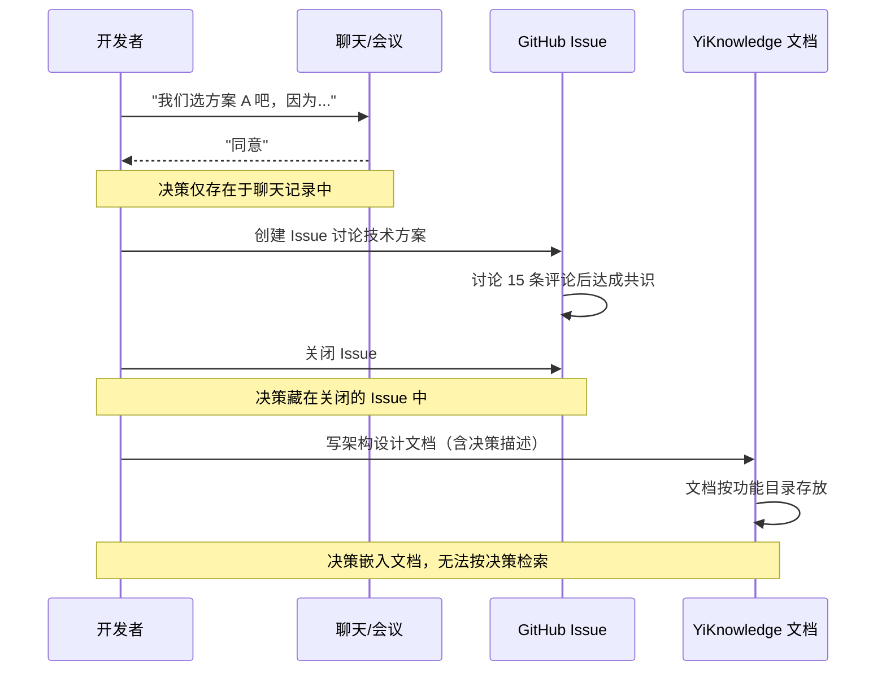
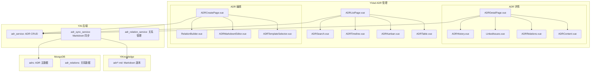
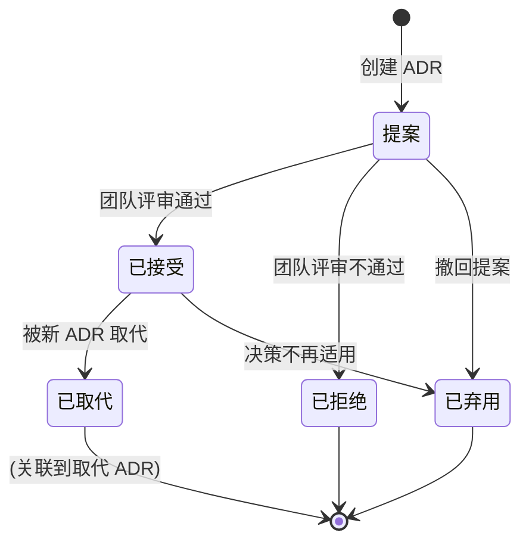

# YV-09-93: 决策记录管理 — ADR 管理、ADR 模板、ADR 状态流转(提案/已接受/已弃用/已取代)、ADR 关联 Issue/项目、ADR 搜索与筛选、ADR 时间线可视化

> 需求编号：YV-09-93 · 优先级：P2 · 人天：0.3d · 状态：需求已编写
> 依赖：YV-09-91（问题分类与优先级矩阵）、YV-09-92（风险登记册）

## 背景

### 问题陈述

在 YrY 单体仓库的持续发展过程中，团队每天在做架构和设计决策：选择哪种技术方案、采用哪种设计模式、决定某个模块的边界等等。然而这些决策缺乏系统化的记录和管理：

1. **决策无存档**：架构决策存在于讨论（聊天记录、会议、代码评审）中，但从未被正式记录。新成员加入团队时，无法了解"为什么这个模块是这样设计的""为什么选择了 A 方案而非 B 方案"
2. **决策上下文丢失**：6 个月后回顾某个技术选择时，当时的约束条件、备选方案、权衡考虑都已遗忘
3. **重复讨论已决定的方案**：因为缺乏决策记录，团队成员反复讨论"我们是不是应该把 X 改成 Y"，而没有意识到这个问题在半年前已经决策过了
4. **决策变更无追踪**：当一个旧决策被新决策取代时，缺乏记录两者关系的方法，导致部分代码仍基于旧决策执行
5. **跨项目决策不一致**：YiVad、YiPet、YiAi 三个项目的技术决策可能互相矛盾，但缺乏跨项目视角的决策审查

**核心矛盾**：团队每天在做决策，但决策知识是口头的、短暂的、不可检索的。需要一套轻量级但系统化的架构决策记录（ADR）管理系统。

### 影响范围

| # | 影响 | 严重程度 | 典型场景 |
|---|------|----------|----------|
| 1 | 决策知识流失 | 高 | 核心开发者离职，带走决策上下文 |
| 2 | 重复讨论 | 高 | 半年后同一问题又被提出讨论 |
| 3 | 新成员理解困难 | 中 | 新人看不懂代码中"奇怪"的设计 |
| 4 | 决策不一致 | 中 | YiVad 和 YiPet 对相同问题做了不同决策 |
| 5 | 技术债务来源不清 | 中 | 不记得当初为什么接受某个技术妥协 |
| 6 | 架构评审无依据 | 低 | 评审时只能凭记忆讨论决策合理性 |

### 挑战

| 挑战 | 说明 |
|------|------|
| 决策记录的动力 | 开发者在编码时通常不会想到要写决策记录，需要低摩擦的工具 |
| ADR 格式标准化 | 如何在保持灵活性的同时确保足够的结构以供检索 |
| 决策取代关系建模 | 一个决策被另一个决策取代时，关系如何建模和可视化 |
| 与 Issue/代码的关联 | 如何将决策与实现它的 Issue 和代码变更关联 |
| 跨项目决策视图 | 同一仓库 3 个项目的决策如何在统一视图中管理 |

---

## 一、现状分析

### 1.1 当前决策管理流程

```
团队做技术决策：
  │
  ├─ 非正式决策
  │   ├─ 聊天中提到："我们之后都用 ECharts 替代 Chart.js 吧"
  │   ├─ 大家同意
  │   ├─ 有人开始用 ECharts 写新图表
  │   └─ 3 个月后新同事问"为什么不用 Chart.js？"
  │       答案："我也不记得谁决定的" ← 决策知识丢失
  │
  ├─ 半正式决策
  │   ├─ GitHub Issue 中讨论技术方案
  │   ├─ 讨论中达成共识
  │   ├─ Issue 关闭
  │   └─ 6 个月后需要查到该决策时：
  │       搜索 300+ 个 Issue 找不到 ← 检索困难
  │
  └─ 正式决策（当前很少）
      ├─ YiKnowledge 中偶尔有架构设计文档
      ├─ 文档中包含决策内容
      └─ 但文档是围绕功能而非决策结构化 ← 决策散落在各处
```

### 1.2 现状能力矩阵

| 能力 | 可用性 | 限制 |
|------|--------|------|
| 决策记录 | 部分（聊天/Issue/文档中） | 分散、非结构化、难检索 |
| 决策模板 | 否 | — |
| 决策状态管理 | 否 | — |
| 决策关联 | 否 | — |
| 决策搜索 | 部分（Issue 搜索） | 只能搜到 Issue 形式的决策 |
| 决策时间线 | 否 | — |
| 取代关系 | 否 | — |

### 1.3 改造前数据流



### 1.4 根因矩阵

| 症状 | 根因 | 触发条件 | 频率 |
|------|------|----------|------|
| 决策无存档 | 无方便的 ADR 记录工具 | 每次做技术决策时 | 高 |
| 决策难检索 | 无结构化决策数据 | 需要查找历史决策时 | 中 |
| 决策上下文丢失 | 仅记录了结论未记录备选和背景 | 6 个月后回顾时 | 高 |
| 决策冲突 | 无跨项目决策视图 | 不同项目做类似决策时 | 中 |
| 重复讨论 | 不知已有决策 | 新人提出已有结论的问题 | 中 |

---

## 二、设计决策

### 决策 1：ADR 存储位置 — YiKnowledge Markdown vs YiVad 数据库 vs 两者同步

| 选项 | 版本控制 | 检索能力 | 可视化 |
|------|----------|----------|--------|
| YiKnowledge Markdown（Git 管理） | 高（Git 历史） | 低（文件搜索） | 无 |
| YiVad 数据库（Web UI 管理） | 中（变更历史） | 高（全文搜索） | 高（时间线/关系图） |
| Markdown + 数据库同步 | 高 | 高 | 高 |

**选择：Markdown + 数据库双向同步。** ADR 的主记录存储在 YiVad 的 MongoDB 中（提供检索和可视化能力），同时每个 ADR 可导出为 YiKnowledge 格式的 Markdown 文件（提交到 Git，提供版本控制和离线查看能力）。YiAi 的知识监视器扫描 Markdown ADR 文件并更新到 RAG 索引。这是一种"数据库为中心、Markdown 为副本"的模式。用户可以通过 Web UI 创建 ADR（自动生成 Markdown），也可以直接写 Markdown 文件（YiAi 监视器扫描后同步到数据库）。

### 决策 2：ADR 模板 — 遵循 Michael Nygard 标准 vs 简化版 vs 自定义模板

| 选项 | 标准化程度 | 填写负担 | 信息完整度 |
|------|-----------|----------|-----------|
| Michael Nygard 格式（标题/状态/背景/决策/后果） | 高 | 中 | 高 |
| 简化版（标题/决策/理由） | 低 | 低 | 低 |
| 可配置模板（用户自定义字段） | 中 | 灵活 | 灵活 |

**选择：Michael Nygard 格式 + 可选简化版。** Nygard 格式是 ADR 的行业标准，包含 Title、Status、Context、Decision、Consequences 五个部分。默认使用此格式（提供模板引导），但允许用户在使用时简化（非必填字段可跳过）。支持项目级别的自定义模板（添加额外字段如"成本影响"、"性能影响"等）。

### 决策 3：ADR 取代关系 — 简单链表 vs DAG vs 版本控制

| 选项 | 表达能力 | 查询复杂度 | 实现复杂度 |
|------|----------|-----------|----------|
| 简单链表（ADR 只有一个前任和继任） | 低 | 低 | 低 |
| DAG（有向无环图，允许多个前任/继任） | 高 | 高 | 高 |
| 版本控制（ADR 有修订历史） | 中 | 中 | 中 |

**选择：DAG + 状态标记。** ADR 可以有一个或多个前任（多个决策合并为一个）、一个或多个继任（一个决策拆分为多个）。但前端可视化为简化版（显示直接前任和继任，展开可看到完整关系图）。同时使用状态标记：`superseded` 表示被取代，`supersedes` 字段指向取代它的 ADR。

### 决策 4：ADR 与 Issue 的关联 — 手动关联 vs 从 Issue 中提取 vs 从 Git Commit 提取

| 选项 | 自动化 | 准确率 | 实现复杂度 |
|------|--------|--------|-----------|
| 手动关联（创建 ADR 时选择 Issue） | 低 | 高 | 低 |
| 从 Issue 标签中提取（标签=ADR） | 中 | 中 | 中 |
| 从 Git Commit message 提取 | 高 | 低 | 高 |

**选择：手动关联 + Issue 标签辅助。** 创建 ADR 时可选关联 Issue（搜索选择）。同时支持在 Issue 中添加 `ADR` 标签后，自动提示"是否为此 Issue 创建 ADR"。Git Commit 自动提取准确率太低，不采纳。

### 设计决策记录

| 决策 | 选项 A | 选项 B | 选项 C | 选择 | 理由 |
|------|--------|--------|--------|------|------|
| 存储位置 | YiK | 数据库 | 双向同步 | **双向同步** | 检索+版本控制兼顾 |
| ADR 模板 | Nygard | 简化 | 自定义 | **Nygard+可选** | 标准化但灵活 |
| 取代关系 | 链表 | DAG | 版本控制 | **DAG+状态** | 完整表达但简化展示 |
| 关联方式 | 手动 | 标签提取 | Commit | **手动+标签** | 准确率优先 |

---

## 三、目标架构

### 3.1 ADR 管理系统架构



### 3.2 ADR 状态流转



### 3.3 性能指标

| 指标 | 改造前 | 改造后 |
|------|--------|--------|
| 查找历史决策 | 15-30min（搜索聊天+Issue） | < 30s（全文搜索） |
| 了解决策上下文 | 依赖当事人记忆 | 结构化 Context/Decision/Consequences |
| 发现过时决策 | 依赖偶然发现 | 自动标记 superseded 状态 |
| 决策知识传承 | 依赖口头传递 | ADR 存档 + Markdown 备份 |

---

## 四、具体改动

### 4.1 ADR 数据模型

```typescript
// 改造前：无 ADR 数据结构
// src/types/adr.ts (改造后)

interface ADR {
  id: string;
  project_id: string;
  number: number;              // ADR 编号（项目内自增，如 ADR-0011）

  // Michael Nygard 标准字段
  title: string;               // 简洁的决策标题（如"使用 ECharts 替代 Chart.js"）
  status: ADRStatus;
  context: string;             // 背景：为什么需要做这个决策？约束条件是什么？
  decision: string;            // 决策内容：我们决定做什么？
  consequences: string;        // 后果：决策带来的正面和负面影响

  // 扩展字段（可选）
  alternatives?: Alternative[]; // 备选方案及评估
  pros?: string[];              // 决策的优点
  cons?: string[];              // 决策的缺点
  cost_impact?: string;         // 成本影响
  performance_impact?: string;  // 性能影响
  custom_fields?: Record<string, string>; // 自定义字段

  // 关系和引用
  supersedes_adr_id?: string;   // 取代了哪个 ADR
  superseded_by_adr_id?: string; // 被哪个 ADR 取代
  related_adr_ids: string[];    // 相关的 ADR
  linked_issue_ids: string[];   // 关联的 Issue
  linked_project_ids: string[]; // 关联的项目

  // 人员和日期
  author_id: string;
  reviewers: string[];          // 参与评审的人
  decided_date?: string;        // 做出决策的日期
  created_at: string;
  updated_at: string;

  // 标签和分类
  domain: ADRDomain;            // 决策领域
  tags: string[];
}

type ADRDomain =
  | 'architecture'     // 架构决策
  | 'technology'       // 技术选型
  | 'design'           // 设计决策
  | 'process'          // 流程决策
  | 'tooling'          // 工具链决策
  | 'data'             // 数据模型决策
  | 'security'         // 安全决策
  | 'other';

type ADRStatus =
  | 'proposed'       // 提案
  | 'accepted'       // 已接受
  | 'rejected'       // 已拒绝
  | 'deprecated'     // 已弃用
  | 'superseded';     // 已取代

interface Alternative {
  name: string;
  description: string;
  pros: string[];
  cons: string[];
  rejected_reason?: string;
}
```

### 4.2 ADR 列表和看板

```typescript
// src/views/adrs/ADRListPage.vue (新增)

// 功能：
// - 列表视图：
//   - 列：编号、标题、状态（彩色标签）、领域、决定日期、作者、取代关系
//   - 排序：按编号 / 决定日期 / 更新时间
//   - 筛选：按状态 / 领域 / 项目 / 作者 / 标签
//   - 搜索：标题、context、decision 全文搜索
// - 看板视图：
//   - 按状态分列：提案 → 已接受 → 已取代/已弃用
//   - 卡片显示：编号 + 标题 + 领域标签 + 日期
//   - 拖拽改变状态（受权限控制）
// - 工具栏：
//   - 新建 ADR
//   - 导出选中 ADR 为 Markdown
//   - 批量变更状态
```

### 4.3 ADR 编辑器（创建/编辑）

```typescript
// src/views/adrs/ADRCreatePage.vue (新增)

// 功能：
// - 模板选择：
//   - 完整 Nygard 格式（含 context/decision/consequences）
//   - 简化格式（仅 decision + rationale）
//   - 自定义模板（项目可配置）
// - 表单字段：
//   - 标题（必填，建议格式"使用 X 替代 Y"）
//   - 状态（新建默认为"提案"）
//   - 领域（下拉选择）
//   - Context 背景描述（Markdown 编辑器）
//   - Decision 决策描述（Markdown 编辑器）
//   - Consequences 后果描述（Markdown 编辑器）
// - 备选方案：
//   - 动态添加/删除备选方案条目
//   - 每个备选：名称 + 描述 + 优点列表 + 缺点列表 + 拒绝理由
// - 关联：
//   - 搜索并选择取代的 ADR（supersedes）
//   - 搜索并选择关联的 Issue
//   - 搜索并选择关联的项目
// - 预览：
//   - 实时预览 Markdown 渲染效果
//   - 预览 ADR 在 YiKnowledge 中的文件格式
```

### 4.4 ADR 详情页

```typescript
// src/views/adrs/ADRDetailPage.vue (新增)

// 功能：
// - ADR 内容渲染：
//   - Markdown 渲染（context/decision/consequences）
//   - 备选方案对比表格
// - 关系面板：
//   - 取代链：← 取代了 ADR-0003 ← 被 ADR-0021 取代 →
//   - 相关 ADR 列表
//   - 关联 Issue 列表（含状态）
// - 操作：
//   - 编辑 ADR
//   - 变更状态（提案→接受/拒绝）
//   - 创建取代 ADR（快速创建新 ADR 并预设 supersedes 关系）
//   - 导出为 Markdown 文件
//   - 导出为 YiKnowledge 格式
// - 变更历史：
//   - ADR 内容变更时间线
//   - 状态变更时间线
```

### 4.5 ADR 时间线可视化

```typescript
// src/components/adrs/ADRTimeline.vue (新增)

// 功能：
// - 时间线视图：
//   - 水平时间轴：显示所有 ADR 按决定日期排列
//   - 每个节点：编号 + 标题缩写 + 状态颜色
//   - 连接线：取代关系用箭头连接
// - 领域分组：
//   - Y 轴按领域分组（架构/技术/设计/流程/工具链/数据/安全）
//   - 每行显示该领域的 ADR 节点
// - 交互：
//   - 缩放时间轴（季/月/周）
//   - 点击节点 → 跳转详情
//   - 悬停节点 → 显示标题和摘要 tooltip
//   - 筛选：按领域/状态/项目
// - 关系图：
//   - 网络图视图：节点=ADR，连线=取代/相关关系
//   - 力导向布局
//   - 节点大小 = 关联 Issue 数量
//   - 节点颜色 = 状态
```

### 4.6 Markdown 同步

```typescript
// src/services/adr-export-service.ts (新增)

// 功能：
// - 导出为 YiKnowledge 格式的 Markdown 文件
// - 格式：
//   ---
//   title: "ADR-0011: 使用 ECharts 替代 Chart.js"
//   status: accepted
//   domain: technology
//   created: 2026-01-15
//   decided: 2026-01-20
//   ---
//   # ADR-0011: 使用 ECharts 替代 Chart.js
//   ## Context
//   ...
//   ## Decision
//   ...
//   ## Consequences
//   ...
//   ## Alternatives
//   ...
// - 导出目标：
//   1. YiKnowledge/projects/yivad/adr/（通过文件读写 API）
//   2. 下载为 .md 文件
// - 导入：
//   - 从 Markdown 文件解析并创建/更新 ADR
//   - 检测 frontmatter 和标准 Nygard 章节
```

### 4.7 文件变更清单

| 文件 | 操作 | 说明 |
|------|------|------|
| `src/views/adrs/ADRListPage.vue` | 新增 | ADR 列表主页面 |
| `src/components/adrs/ADRTable.vue` | 新增 | ADR 列表表格 |
| `src/components/adrs/ADRKanban.vue` | 新增 | ADR 状态看板 |
| `src/components/adrs/ADRTimeline.vue` | 新增 | ADR 时间线可视化 |
| `src/components/adrs/ADRSearch.vue` | 新增 | ADR 高级搜索 |
| `src/views/adrs/ADRDetailPage.vue` | 新增 | ADR 详情页 |
| `src/components/adrs/ADRContent.vue` | 新增 | ADR 内容渲染 |
| `src/components/adrs/ADRRelations.vue` | 新增 | ADR 关系图 |
| `src/components/adrs/ADRCreationPage.vue` | 新增 | ADR 创建/编辑页 |
| `src/components/adrs/ADRTemplateSelector.vue` | 新增 | 模板选择器 |
| `src/components/adrs/ADRMarkdownEditor.vue` | 新增 | ADR Markdown 编辑器 |
| `src/components/adrs/RelationBuilder.vue` | 新增 | 关系构建器 |
| `src/components/adrs/LinkedIssues.vue` | 新增 | 关联 Issue 选择器 |
| `src/services/adr-export-service.ts` | 新增 | ADR Markdown 导出服务 |
| `src/composables/useADR.ts` | 新增 | ADR composable |
| `src/stores/adr.ts` | 新增 | ADR Pinia store |
| `src/types/adr.ts` | 新增 | ADR 类型定义 |
| `src/api/adr.ts` | 新增 | ADR API 封装 |
| `src/router/modules/adrs.ts` | 新增 | ADR 模块路由 |
| `tests/unit/ADRCreate.test.ts` | 新增 | ADR 创建流程测试 |
| `tests/unit/ADRTimeline.test.ts` | 新增 | 时间线渲染测试 |

### 4.8 后端 API

```python
# YiAi/services/adr/adr_service.py (新增)

# adr_service 方法:
# - create_adr(project_id, title, context, decision, consequences, ...) → adr
# - update_adr(id, updates) → adr
# - change_status(id, status, reason?) → adr
# - supersede_adr(id, new_adr_id) → updates both
# - get_adr(id) → adr (含关联详情)
# - list_adrs(filter?) → list[ADR]
# - search_adrs(query) → list[ADR] (全文搜索 context/decision)
# - get_adr_relations(adr_id) → relation graph
# - get_adr_timeline(project_id?) → timeline data
# - export_markdown(id) → markdown string
# - import_markdown(markdown_content) → adr (detect/create/update)

# adr_sync_service (YiAi 知识监视器扩展):
# - scan_yiknowledge_adrs() → 扫描 YiKnowledge/adr/ 目录
# - sync_adr_to_db(adr_file) → 创建/更新数据库 ADR
# - sync_adr_to_file(adr_id) → 导出到 YiKnowledge markdown
```

---

## 五、实施步骤

| 步骤 | 操作 | 路径 | 验证 | 人天 |
|------|------|------|------|------|
| 1 | 实现 ADR 数据模型和 API | `types/adr.ts` + `api/adr.ts` | CRUD 操作正确 | 0.03 |
| 2 | 实现 ADR 列表和看板 | `ADRTable.vue` + `ADRKanban.vue` | 状态看板拖拽 | 0.05 |
| 3 | 实现 ADR 创建编辑器 | `ADRCreationPage.vue` + `ADRMarkdownEditor.vue` | 模板选择和 Markdown 编辑 | 0.06 |
| 4 | 实现 ADR 详情和关系面板 | `ADRDetailPage.vue` + `ADRRelations.vue` | 取代链和相关 ADR 展示 | 0.04 |
| 5 | 实现时间线可视化 | `ADRTimeline.vue` | 水平时间轴和关系连线 | 0.04 |
| 6 | 实现 Markdown 同步 | `adr-export-service.ts` | 导出/导入格式正确 | 0.03 |
| 7 | 实现搜索和整合 | `ADRSearch.vue` + 路由 + 测试 | 全文搜索和页面可用 | 0.05 |

**总人天：0.3d**

---

## 六、测试规格

### 场景 1：创建 ADR

**GIVEN** 用户打开 ADR 创建页面
**WHEN** 选择"Nygard 完整格式"模板
**AND** 填写标题="使用 ECharts 替换 Chart.js"、领域=技术选型
**AND** Context="Chart.js 功能有限，无法满足数据可视化需求"
**AND** Decision="全项目统一使用 ECharts 5.x"
**AND** Consequences="正面：功能增强、社区活跃；负面：包体积增加 200KB"
**AND** 添加备选方案 A：D3.js（拒绝理由：学习曲线太陡）
**AND** 保存
**THEN** ADR 创建成功，状态为"提案"
**AND** 自动分配编号（如 ADR-0021）

### 场景 2：状态流转

**GIVEN** ADR-0021 状态为"提案"
**WHEN** 用户点击"接受"并填写决定日期 2026-01-20
**THEN** 状态变为"已接受"
**AND** 决定日期记录为 2026-01-20
**AND** 时间线中该 ADR 节点颜色从黄色（提案）变为绿色（已接受）

### 场景 3：ADR 取代关系

**GIVEN** ADR-0021（已接受）需要被新方案取代
**WHEN** 在 ADR-0021 详情页点击"创建取代 ADR"
**THEN** 自动打开创建页面，预设 supersedes_adr_id = ADR-0021
**WHEN** 用户填写新 ADR 并保存
**THEN** ADR-0022 创建成功，supersedes_adr_id = ADR-0021
**AND** ADR-0021 状态自动变为"已取代"，superseded_by_adr_id = ADR-0022
**AND** 时间线中显示 ADR-0021 → ADR-0022 取代箭头

### 场景 4：搜索 ADR

**GIVEN** 系统中有 30 条 ADR
**WHEN** 用户搜索"图表"
**THEN** 返回所有标题/context/decision 中包含"图表"的 ADR
**AND** 搜索结果按相关度排序
**WHEN** 用户按领域筛选"技术选型"
**THEN** 仅显示领域为技术选型的 ADR

### 场景 5：时间线可视化

**GIVEN** 项目有 20 条 ADR 分布在 6 个月内
**WHEN** 用户打开时间线视图
**THEN** 水平时间轴按月份显示节点
**AND** 领域按 Y 轴分组
**AND** 取代关系用箭头连接
**AND** 缩放至"月"视图时节点按周分布

### 场景 6：导出 Markdown

**GIVEN** ADR-0021 处于"已接受"状态
**WHEN** 用户点击"导出 Markdown"
**THEN** 生成标准格式的 Markdown 文件
**AND** frontmatter 包含 title/status/domain/created/decided
**AND** 内容包含 Context/Decision/Consequences/Alternatives
**AND** 可选择"下载文件"或"保存到 YiKnowledge"

---

## 七、风险与缓解

| 风险 | 概率 | 影响 | 缓解措施 |
|------|------|------|----------|
| 开发者不习惯写 ADR | 高 | 中 | 从 Issue 快速创建 ADR（降低摩擦）；团队规范要求重要决策必须有 ADR |
| ADR 数量膨胀 | 中 | 低 | 区分重要决策和日常决策；建议仅记录"影响 > 1 人"或"影响 > 1 个模块"的决策 |
| 双向同步冲突 | 中 | 中 | 数据库为权威来源；Markdown 文件的修改需通过 Web UI 或明确知晓冲突解决策略 |
| ADR 质量不高 | 中 | 中 | 提供模板引导和填写示例；Code Review 中检查 ADR 质量 |
| 取代关系环（ADR-A 取代 B，B 取代 A）| 低 | 中 | 创建取代关系时检测环路；单次只会更新一条取代链 |

---

## 八、回滚策略

| 场景 | 回滚操作 | 影响 |
|------|----------|------|
| Markdown 同步数据错误 | 停止自动同步；仅使用数据库作为数据源 | YiKnowledge 副本可能过期 |
| 取代关系图复杂 | 移除关系图视图；仅保留文字链 | 可视化特性丢失 |
| 时间线性能问题 | 限制时间轴显示最近 50 条 ADR | 历史 ADR 不可见 |
| 完全回滚 | 移除 ADR 模块路由 | 功能不可用 |

---

## 九、设计决策记录

### D-01：为什么 ADR 存在数据库中而不是纯 Git 管理？

纯 Git 管理 ADR（如传统的 `docs/adr/` 目录）无法提供：全文搜索、状态看板、时间线可视化、跨项目视图、与 Issue 的关联。数据库存储使这些能力成为可能。同时保留了 Markdown 导出能力（可提交到 Git），获得了两个世界的好处。

### D-02：为什么 Nygard 格式优于纯自由格式？

Nygard 格式的五个部分（Context/Decision/Consequences）确保每个 ADR 都包含最低限度的有用信息。Context 回答"为什么需要做决策"，Decision 回答"做了什么决策"，Consequences 回答"决策带来什么影响"。没有这些部分，ADR 往往退化为一句"我们用 X 替代了 Y"——这就是当前聊天记录的质量。

### D-03：为什么 ADR 取代关系使用 DAG 而非链表？

在实际项目中，可能存在"两个决策合并为一个"（多个前任一个继任）和"一个决策拆分为两个"（一个前任多个继任）的情况。链表（一对一）无法表达这些关系。DAG 提供了完整的表达能力，而前端可以将其简化为用户能理解的视图。

### D-04：为什么 YiKnowledge 的 ADR Markdown 文件被设计为 YiAi 知识监视器的数据源？

YiKnowledge 的知识目录树被 YiAi 的 RAG 引擎索引。将 ADR 的 Markdown 副本放在 YiKnowledge 中意味着：AI 助手可以通过 RAG 检索到团队的架构决策历史，帮助回答"为什么这个模块这样设计"之类的问题。

---

## 十、可观测性

### 指标

| 指标 | 类型 | 说明 |
|------|------|------|
| `yivad.adr.total` | Gauge | ADR 总数 |
| `yivad.adr.by_status` | Gauge | 各状态 ADR 数 |
| `yivad.adr.created` | Counter | 新建 ADR 数 |
| `yivad.adr.accepted` | Counter | 接受的 ADR 数 |
| `yivad.adr.superseded` | Counter | 被取代的 ADR 数 |
| `yivad.adr.exported` | Counter | 导出 Markdown 次数 |
| `yivad.adr.search` | Counter | 搜索次数 |

### 告警

| 告警 | 条件 | 级别 |
|------|------|------|
| 提案积压 | 提案状态 ADR > 10 条且超过 30 天 | WARNING |
| 大量被取代 ADR | superseded 占比 > 30% | INFO |
| 同步冲突 | 同一条 ADR 在 1h 内被数据库和 Markdown 双双更新 | WARNING |

---

## 十一、代码审查检查清单

- [ ] ADR 创建表单包含 Nygard 标准字段
- [ ] 模板选择器正确切换表单字段
- [ ] Markdown 编辑器支持实时预览
- [ ] ADR 编号自动生成（项目内自增）
- [ ] 状态看板按 status 正确分列
- [ ] 状态变更按钮受权限控制
- [ ] 取代关系创建时自动双向关联
- [ ] 取代时自动更新被取代 ADR 的状态
- [ ] 时间线节点位置按日期正确排列
- [ ] 取代关系箭头正确连接节点
- [ ] 搜索支持标题和内容全文匹配
- [ ] 导出 Markdown 格式符合 YiKnowledge 规范
- [ ] 备选方案可动态添加/删除

---

## 回归问题预测

| # | 预测问题 | 原因 | 验证方法 |
|---|---------|------|---------|
| 1 | ADR 从"提案"改为"已接受"时，设置了 decided_date，但用户未填写决定日期（输入框为空），后端将 decided_date 设置为 null，导致该 ADR 在时间线中排在第一位（null 日期排序异常） | 状态变更时前端要求填写决定日期但为非必填，后端也未在状态变更时检查字段完整性 | 从提案改为已接受，留空决定日期，验证提示"已接受的 ADR 需要填写决定日期"或自动取当前日期 |
| 2 | 创建取代 ADR（ADR-0022 取代 ADR-0021）后，删除 ADR-0022，ADR-0021 的 superseded_by_adr_id 仍指向已删除的 ADR-0022 | 删除 ADR 时未级联清理被取代方的取代引用 | 创建取代关系后删除继任 ADR，验证被取代方回到原状态且 superseded_by 被清空 |
| 3 | 从 Issue 创建 ADR 时选择了多个关联 Issue（A, B, C），但保存后只有 Issue A 被关联（数组仅取了第一个元素） | 多选关联 Issue 的组件值传递时，数组被意外展开或只取了第一个 | 从 Issue 选择 3 个关联，验证 ADR 的 linked_issue_ids 包含全部 3 个 |
| 4 | ADR 时间线中超过 50 个节点后，水平时间轴的缩放和拖拽性能下降，节点渲染出现明显延迟 | 时间轴一次性渲染所有节点（包括不可见区域的节点），无虚拟化或可视区域裁剪 | 创建 100 条 ADR，验证时间线缩放和平移流畅（< 60fps），节点仅渲染可视区域 |
| 5 | 导出 Markdown 时备选方案列表为空，导出的 Markdown 中 Alternatives 章节仍包含空表格标题行 | 导出模板未检查 alternatives 数组是否为空，导致生成了无内容的章节 | 创建无备选方案的 ADR，导出 Markdown，验证 Alternatives 章节不存在（而非空表格） |
| 6 | 从 YiKnowledge 导入 ADR Markdown 文件时，frontmatter 的 status 字段值为 "accepted"，但数据库中 ADR 状态枚举值为 "accepted"，未做校验直接写入导致数据库查询按 status 过滤时该 ADR 被遗漏 | 导入时的值映射未处理大小写或空格差异 | 导入 status="accepted"（而非 "accepted"）的 Markdown，验证数据库存储的状态正确为 "accepted" |

---

## 性能分析

### ADR 管理关键操作耗时

| 操作 | 耗时 | 说明 |
|------|------|------|
| ADR 列表加载（50 条） | < 200ms | API 请求 + 渲染 |
| Markdown 预览渲染 | < 100ms | Markdown → HTML 转换 |
| 全文搜索（100 条） | < 200ms | MongoDB text search |
| 时间线渲染（50 个节点） | < 200ms | SVG/Canvas 绘制 |
| 关系图渲染（50 个节点） | < 500ms | 力导向布局计算 |
| Markdown 导出生成 | < 50ms | 模板填充 |

### 数据量预估

| 数据项 | 大小 |
|--------|------|
| 单条 ADR 记录 | ~3-10KB |
| 50 条 ADR（中等项目） | ~150-500KB |
| 单条 ADR Markdown 文件 | ~2-8KB |
| 时间线数据（50 条聚合） | ~20KB |
| 关系图数据 | ~10KB |

### 对后端的影响

| 操作 | 影响 | 说明 |
|------|------|------|
| ADR CRUD | 新增集合 | adrs 集合 |
| 关系管理 | 新增集合 | adr_relations 集合 |
| 全文搜索 | 中等 | MongoDB text index |
| Markdown 同步 | 轻量 | 文件读写 + 知识监视器扩展 |
| 时间线聚合 | 轻量 | MongoDB 查询 |

---

## 相关文档

- [ADR GitHub Organization](https://adr.github.io/)
- [Michael Nygard - Documenting Architecture Decisions](https://cognitect.com/blog/2011/11/15/documenting-architecture-decisions)
- [ThoughtWorks Technology Radar - ADR](https://www.thoughtworks.com/radar/techniques/lightweight-architecture-decision-records)

