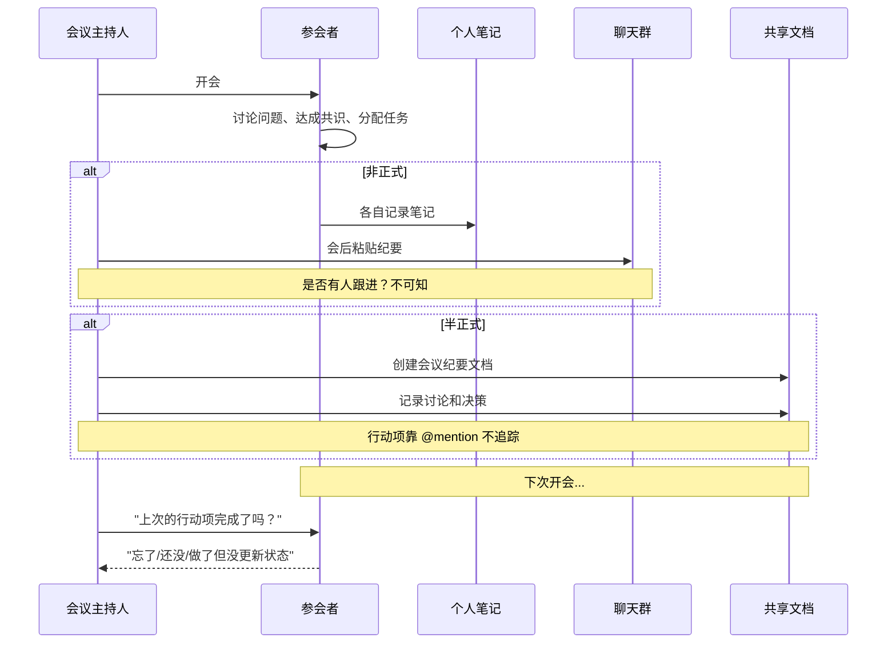
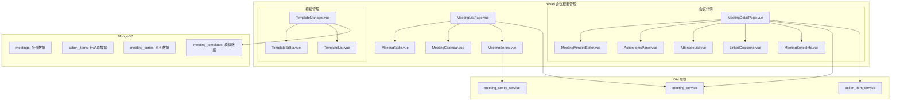
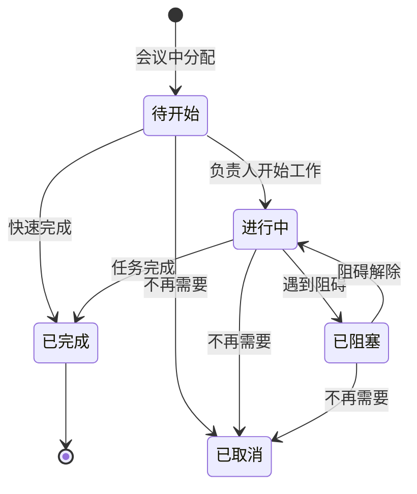
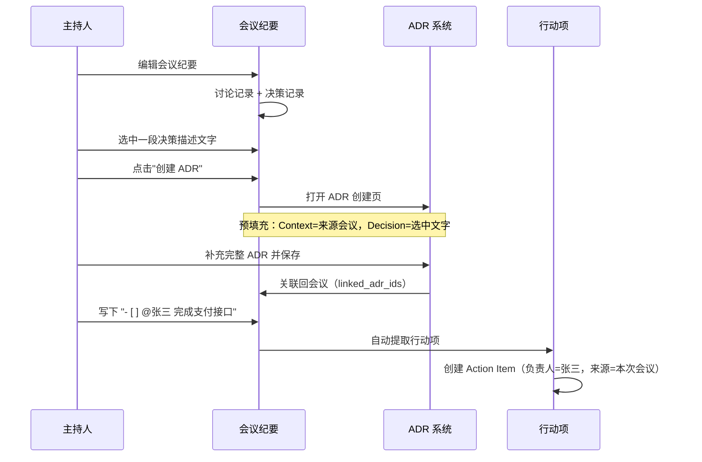

# YV-09-94: 会议纪要管理 — 会议笔记管理、会议日程集成、行动项提取、参会人员追踪、系列会议管理、决策记录、分享会议笔记、会议笔记模板

> 需求编号：YV-09-94 · 优先级：P2 · 人天：0.3d · 状态：需求已编写
> 依赖：YV-09-93（决策记录管理）

## 背景

### 问题陈述

在 YrY 团队的日常协作中，会议是沟通和决策的重要场所——站会、周会、技术评审、架构讨论、1v1 面谈等。然而，会议纪要的管理存在严重的流程断裂：

1. **会议纪要不完整或丢失**：会议中讨论的内容、达成的共识、分配的任务分散在个人笔记、聊天记录中，缺少统一的归档
2. **行动项追踪断裂**：会议中分配的待办事项（Action Items）在会议后往往无人跟进，直到下次开会才发现还没完成
3. **决策未被记录**：会议中做出的技术决策、业务决策没有被记录到 ADR 或项目文档中
4. **参会人员复盘困难**：缺席会议的人无法快速了解会议内容，只能靠口头传递
5. **系列会议关联缺失**：每周站会、双周迭代评审等系列会议之间缺乏关联，无法看到长期讨论的演进
6. **会议效率低**：缺乏模板引导，会议讨论发散，纪要回顾耗时

**核心矛盾**：会议是团队沟通的核心场所，但会议产生的信息（共识、决策、行动项）没有被系统化捕获和追踪，导致会议价值缩水。

### 影响范围

| # | 影响 | 严重程度 | 典型场景 |
|---|------|----------|----------|
| 1 | 行动项追踪断裂 | 高 | 3 次会议连续讨论同一个未完成的 Action Item |
| 2 | 决策未被记录 | 高 | 会议中决定改用新方案，但两周后有人说"没有听说这个决定" |
| 3 | 缺席者信息缺失 | 中 | 请假同事不知道会议中发生了什么，需要逐个沟通 |
| 4 | 会议信息检索困难 | 中 | 搜索"上次讨论的支付方案"找不到对应的会议 |
| 5 | 系列会议无关联 | 中 | 不知道某个问题是第 3 次被讨论了还是第 1 次 |
| 6 | 纪要格式不统一 | 低 | 有的纪要只有一句话，有的写了 2000 字 |

### 挑战

| 挑战 | 说明 |
|------|------|
| 行动项的智能提取 | 如何从自由文本中自动识别和提取行动项（支持手动和自动两种方式） |
| 与日历的集成 | YiVad 没有日历系统，如何集成外部日历 |
| 系列会议的建模 | 如何表示定期会议（每周/每两周）及其关联 |
| 会议与 ADR 的联动 | 会议中的决策如何一键创建为 ADR |
| 多人协作编辑 | 是否需要支持多人同时编辑同一篇纪要 |

---

## 一、现状分析

### 1.1 当前会议纪要管理流程

```
团队管理会议纪要:
  │
  ├─ 非正式纪要
  │   ├─ 某个参会者在自己的笔记应用中记录
  │   ├─ 会后把笔记内容粘贴到聊天群
  │   └─ 聊天记录滚动后消失
  │   问题: 纪要散落在个人笔记和聊天中，不可检索
  │
  ├─ 半正式纪要（共享文档）
  │   ├─ 写入团队共享文档（如语雀/Notion）
  │   ├─ 每次新建文档，格式不统一
  │   └─ 会议之间的关联靠手动添加链接
  │   问题: 脱离 YiVad 系统，不能与 Issue/ADR 联动
  │
  ├─ 行动项追踪
  │   ├─ 纪要中标注 @某人 待办事项
  │   ├─ 下次开会前凭记忆回顾
  │   └─ 经常出现："上次说的那个事情做了吗？""还没"
  │   问题: 行动项无系统追踪
  │
  └─ 决策记录
      ├─ 纪要中记录了决策内容
      ├─ 但没有创建正式的 ADR
      └─ 决策被遗忘在纪要中
      问题: 决策从纪要到 ADR 的转化链路断裂
```

### 1.2 现状能力矩阵

| 能力 | 可用性 | 限制 |
|------|--------|------|
| 会议纪要编辑 | 部分（外部工具） | 脱离 YiVad 系统 |
| 行动项提取和追踪 | 否 | — |
| 参会人员管理 | 部分（手动列表） | 无关联用户系统 |
| 系列会议关联 | 否 | — |
| 会议→ADR 转化 | 否 | — |
| 纪要模板 | 否 | — |
| 纪要分享 | 部分（分享链接） | 依赖外部工具 |
| 会议搜索 | 否 | — |

### 1.3 改造前数据流



### 1.4 根因矩阵

| 症状 | 根因 | 触发条件 | 频率 |
|------|------|----------|------|
| 行动项无人跟踪 | 无系统化的 Action Item 追踪 | 任何分配任务的会议 | 高 |
| 决策无记录 | 无会议→ADR 联动 | 会议中做出技术决策 | 中 |
| 纪要检索不到 | 存储分散且无全文搜索 | 回顾历史会议内容时 | 中 |
| 系列会议断裂 | 无关联建模 | 多期站会/周会 | 中 |
| 缺席信息缺失 | 纪要分享机制不完善 | 有人缺席时 | 中 |

---

## 二、设计决策

### 决策 1：会议数据模型 — 独立 vs 扩展 Issue vs 扩展文档

| 选项 | 专注度 | 检索能力 | 联动能力 |
|------|--------|----------|----------|
| 独立 meetings 集合 | 高 | 高 | 需手动关联 |
| Issue 子类型（type=meeting） | 中 | 中 | 天然关联 Issue |
| 文档子类型 | 低 | 中 | 中 |

**选择：独立 meetings 集合 + 关联映射。** 会议有自己的生命周期和数据结构（时间、地点、参会人员、议程、纪要），不适合作为 Issue 或文档的子类型。通过 `linked_issue_ids` 和 `linked_adr_ids` 字段与 Issue 和 ADR 关联。

### 决策 2：行动项提取方式 — 纯手动 vs Markdown 语法解析 vs NLP 自动提取

| 选项 | 准确率 | 实现复杂度 | 用户体验 |
|------|--------|-----------|---------|
| 纯手动（在 UI 中逐条添加） | 100% | 低 | 中（需额外操作） |
| Markdown 语法解析（如 `- [ ] @张三 完成支付接口`） | 中（需用户遵循语法） | 中 | 高（写纪要时自然标注） |
| NLP 自动提取 | 低（60-70%） | 高 | 高（完全自动化） |

**选择：Markdown 语法解析 + 手动补充。** 用户在 Markdown 纪要中使用 `- [ ] @负责人 任务描述` 语法标记行动项，系统自动解析提取到行动项列表中。同时支持在 UI 中手动添加/编辑行动项。NLP 准确率不够（中文字段下的 NLP 尤其困难），不采纳。

### 决策 3：系列会议建模 — 显式系列实体 vs 标签分组 vs 父会议链接

| 选项 | 关联强度 | 灵活性 | 实现复杂度 |
|------|----------|--------|-----------|
| 显式系列实体（meeting_series 集合） | 高 | 中 | 高 |
| 标签分组（相同的 tag） | 低 | 高 | 低 |
| 父会议链接（linked 关联） | 中 | 高 | 中 |

**选择：父会议链接 + 标签辅助。** 系列会议通过 `series_id` 关联（共享同一个系列 ID），每个系列有名称（如"每周站会"）、频率（周/双周/月）和描述。首次创建会议时可直接创建系列，后续会议选择加入已有系列。同时支持用标签（如 `站会`、`周会`）进行额外分组。

### 决策 4：会议与 ADR 联动 — 手动创建 vs 一键转化 vs 自动监听

| 选项 | 自动化 | 准确性 | 实现复杂度 |
|------|--------|--------|-----------|
| 手动创建 ADR（独立操作） | 低 | 高 | 低 |
| 一键转化（选中纪要内容 → 创建 ADR 并预填充） | 中 | 高 | 中 |
| 自动监听（纪要保存后 AI 识别决策） | 高 | 中 | 高 |

**选择：一键转化 + 关联记录。** 用户在纪要中选中一段决策描述文字，点击"创建 ADR"按钮，自动跳转到 ADR 创建页面并预填充 Context（来源会议标题+日期）、Decision（选中文字）。同时，在会议列表中显示该会议产生了哪些 ADR，在 ADR 详情中显示来源会议。

### 设计决策记录

| 决策 | 选项 A | 选项 B | 选项 C | 选择 | 理由 |
|------|--------|--------|--------|------|------|
| 数据模型 | 独立 | Issue 子类型 | 文档子类型 | **独立+关联** | 专注且灵活 |
| 行动项提取 | 手动 | Markdown 解析 | NLP | **MD+手动** | 准确率 + 自然书写 |
| 系列建模 | 显式实体 | 标签 | 父子链接 | **父子+标签** | 关联清晰 |
| ADR 联动 | 手动 | 一键转化 | 自动 | **一键转化** | 准确且低摩擦 |

---

## 三、目标架构

### 3.1 会议纪要管理系统架构



### 3.2 行动项生命周期



### 3.3 会议→ADR 联动流程



### 3.4 性能指标

| 指标 | 改造前 | 改造后 |
|------|--------|--------|
| 行动项追踪完成率 | < 30%（靠记忆） | > 70%（系统追踪） |
| 决策转化为 ADR | < 5% | > 50%（一键转化） |
| 缺席者信息获取 | 需要逐一询问 | 查看会议纪要即知 |
| 会议历史检索 | 几乎不可检索 | 全文搜索 < 30s |

---

## 四、具体改动

### 4.1 会议数据模型

```typescript
// 改造前：无会议纪要数据结构
// src/types/meeting.ts (改造后)

interface Meeting {
  id: string;
  project_id: string;

  // 基本信息
  title: string;
  type: MeetingType;
  date: string;                // 会议日期
  start_time?: string;         // 开始时间
  end_time?: string;           // 结束时间
  location?: string;           // 地点/链接
  status: MeetingStatus;

  // 系列会议
  series_id?: string;          // 所属系列 ID

  // 参与人员
  host_id: string;             // 主持人
  attendees: Attendee[];       // 参会人员
  absentees?: string[];         // 缺席人员 (user_ids)
  guests?: string[];            // 外部嘉宾

  // 内容
  agenda?: string;              // 议程（Markdown）
  minutes: string;              // 纪要（Markdown）

  // 关联
  linked_issue_ids: string[];
  linked_adr_ids: string[];     // 会议中创建的 ADR
  linked_risk_ids: string[];    // 讨论的风险

  // 元数据
  tags: string[];
  is_private: boolean;         // 是否私密（仅参会人员可见）
  created_by: string;
  created_at: string;
  updated_at: string;
}

type MeetingType =
  | 'standup'        // 站会
  | 'weekly'         // 周会
  | 'review'         // 评审会（代码/设计/架构）
  | 'planning'       // 计划会
  | 'retrospective'  // 复盘会
  | 'one_on_one'     // 1v1 面谈
  | 'brainstorming'  // 头脑风暴
  | 'decision'       // 决策会
  | 'other';

type MeetingStatus =
  | 'scheduled'      // 已安排
  | 'in_progress'    // 进行中
  | 'completed'      // 已完成
  | 'cancelled';     // 已取消

interface Attendee {
  user_id: string;
  role: 'host' | 'participant' | 'note_taker' | 'observer';
  status: 'accepted' | 'tentative' | 'declined';
}

interface ActionItem {
  id: string;
  meeting_id: string;
  description: string;
  assignee_id: string;
  status: ActionItemStatus;
  priority: 'high' | 'medium' | 'low';
  due_date?: string;
  linked_issue_id?: string;     // 转化为 Issue 后关联
  notes?: string;
  created_at: string;
  completed_at?: string;
}

type ActionItemStatus =
  | 'pending'       // 待开始
  | 'in_progress'   // 进行中
  | 'completed'     // 已完成
  | 'blocked'       // 已阻塞
  | 'cancelled';     // 已取消

interface MeetingSeries {
  id: string;
  project_id: string;
  name: string;
  description?: string;
  frequency: 'daily' | 'weekly' | 'biweekly' | 'monthly';
  day_of_week?: number;         // 0-6 (周日-周六)
  time?: string;
  location?: string;
  host_id: string;
  default_attendees: string[];
  is_active: boolean;
  created_at: string;
}

interface MeetingTemplate {
  id: string;
  name: string;
  type: MeetingType;
  content: string;              // Markdown 模板内容
  is_default: boolean;
  project_id?: string;          // 项目特定模板
  created_by: string;
}
```

### 4.2 会议列表和创建

```typescript
// src/views/meetings/MeetingListPage.vue (新增)

// 功能：
// - 会议列表：
//   - 列：标题、类型、日期、时间、状态、参会人数、行动项完成率、系列名称
//   - 排序：按日期/状态/类型
//   - 筛选：按类型/状态/系列/日期范围/参会人员
//   - 搜索：标题和纪要内容全文搜索
// - 创建会议：
//   - 快速创建（基本字段）
//   - 从系列创建（继承系列配置）
//   - 从模板创建（预填充议程结构）
// - 系列视图：
//   - 按系列分组显示会议
//   - 系列的最新会议和统计信息
// - 日历视图（可选）：
//   - 月/周视图
//   - 显示已安排的会议
```

### 4.3 会议纪要编辑器

```typescript
// src/components/meetings/MeetingMinutesEditor.vue (新增)

// 功能：
// - Markdown 编辑器：
//   - 实时预览（左右分栏或切换）
//   - 工具栏：加粗/斜体/标题/列表/代码块/表格
// - 模板插入：
//   - 根据会议类型预加载模板（如站会模板：昨日进展、今日计划、阻塞项）
//   - 可自定义模板
// - 行动项标记：
//   - 实时解析 `- [ ] @用户名 任务描述` 语法
//   - 自动提取到侧边栏行动项列表
//   - 侧边栏可手动添加/编辑/调整行动项
//   - 已完成项在 Markdown 中显示为 `- [x]`
// - 参会人员管理：
//   - 搜索并添加 YiVad 用户
//   - 快速添加（从系列默认参会列表）
//   - 标记角色（主持人/记录人/参与者）
// - @mention 与通知：
//   - 纪要中 @用户名 可触发通知
// - 关联选择：
//   - 搜索并关联 Issue
//   - 从纪要选中文字创建 ADR
```

### 4.4 行动项面板

```typescript
// src/components/meetings/ActionItemsPanel.vue (新增)

// 功能：
// - 行动项列表（本次会议）：
//   - 显示：描述、负责人、优先级、状态、截止日期
//   - 排序：按优先级/状态/截止日期
//   - 过滤：按负责人/状态
// - 行动项操作：
//   - 发送提醒（给行动项负责人）
//   - 转化为 Issue（快速创建并关联）
//   - 更新状态（待开始→进行中→已完成/阻塞）
// - 全局行动项视图：
//   - 跨会议查看某人的所有行动项
//   - 按状态/优先级/会议分组
//   - 显示"我的行动项"仪表盘（当前用户的任务列表）
// - 行动项统计：
//   - 完成率（本次会议 / 全部）
//   - 逾期率
//   - 平均完成时间
```

### 4.5 系列会议管理

```typescript
// src/components/meetings/MeetingSeries.vue (新增)

// 功能：
// - 创建系列：
//   - 名称、频率（日/周/双周/月）、时间、地点
//   - 默认参会人员
//   - 默认模板
//   - 激活/停用
// - 系列列表：
//   - 显示名称、频率、最近一次会议、下次会议、会议总数
// - 从系列创建会议：
//   - 自动填充：标题（系列名称 + 日期）、参会人员、模板
//   - 参会人员可在此次会议中调整（增删）
// - 系列视图：
//   - 显示系列的所有历史会议
//   - 显示系列的行动项趋势（完成率变化）
//   - 显示系列的决策汇总（跨会议的 ADR 列表）
```

### 4.6 模板管理

```typescript
// src/components/meetings/TemplateManager.vue (新增)

// 内置模板：
// - 站会模板：
//   ## 昨日进展 (What did I do yesterday?)
//   - [ ] 
//   ## 今日计划 (What will I do today?)
//   - [ ] 
//   ## 阻塞项 (Are there any blockers?)
//   - [ ] 
//
// - 周会模板：
//   ## 上周回顾
//   ### 关键指标
//   ### 已完成
//   - [ ] 
//   ## 本周计划
//   ### 目标
//   ### 任务
//   - [ ] @负责人 任务描述 (DDL: )
//   ## 风险和阻碍
//   ## 需要讨论的事项
//   ## 决策记录
//
// - 技术评审模板：
//   ## 评审目标
//   ## 方案概述
//   ## 讨论要点
//   ## 决策
//   ## 后续行动
//   - [ ] @负责人 任务
//
// 功能：
// - 模板创建/编辑（Markdown）
// - 模板分类（按会议类型）
// - 设置默认模板（全局/项目/个人）
// - 模板预览
// - 模板导入/导出
```

### 4.7 文件变更清单

| 文件 | 操作 | 说明 |
|------|------|------|
| `src/views/meetings/MeetingListPage.vue` | 新增 | 会议列表主页面 |
| `src/components/meetings/MeetingTable.vue` | 新增 | 会议列表表格 |
| `src/components/meetings/MeetingCalendar.vue` | 新增 | 会议日历视图 |
| `src/components/meetings/MeetingSeries.vue` | 新增 | 系列会议管理 |
| `src/views/meetings/MeetingDetailPage.vue` | 新增 | 会议详情页 |
| `src/components/meetings/MeetingMinutesEditor.vue` | 新增 | 会议纪要 Markdown 编辑器 |
| `src/components/meetings/ActionItemsPanel.vue` | 新增 | 行动项面板 |
| `src/components/meetings/AttendeeList.vue` | 新增 | 参会人员列表 |
| `src/components/meetings/LinkedDecisions.vue` | 新增 | 关联决策展示 |
| `src/components/meetings/TemplateManager.vue` | 新增 | 模板管理器 |
| `src/components/meetings/TemplateEditor.vue` | 新增 | 模板编辑器 |
| `src/composables/useMeetingMinutes.ts` | 新增 | 纪要编辑 composable |
| `src/composables/useActionItems.ts` | 新增 | 行动项管理 composable |
| `src/services/action-item-parser.ts` | 新增 | 行动项 Markdown 解析器 |
| `src/stores/meeting.ts` | 新增 | 会议 Pinia store |
| `src/types/meeting.ts` | 新增 | 会议相关类型定义 |
| `src/api/meeting.ts` | 新增 | 会议 API 封装 |
| `src/router/modules/meetings.ts` | 新增 | 会议模块路由 |
| `tests/unit/ActionItemParser.test.ts` | 新增 | 行动项解析测试 |
| `tests/unit/MeetingMinutes.test.ts` | 新增 | 纪要编辑器测试 |

### 4.8 后端 API

```python
# YiAi/services/meeting/meeting_service.py (新增)

# meeting_service 方法:
# - create_meeting(project_id, title, type, date, ...) → meeting
# - update_meeting(id, updates) → meeting
# - update_minutes(id, minutes_markdown) → meeting (解析行动项)
# - get_meeting(id) → meeting (含行动项、关联 Issue/ADR)
# - list_meetings(filter?) → list[Meeting]
# - search_meetings(query) → list[Meeting] (全文搜索纪要内容)

# action_item_service 方法:
# - extract_action_items(meeting_id, markdown) → list[ActionItem]
# - create_action_item(meeting_id, description, assignee_id, ...) → action_item
# - update_action_item(id, updates) → action_item
# - list_action_items(meeting_id? / assignee_id? / status?) → list[ActionItem]
# - convert_to_issue(action_item_id) → (action_item, issue_id)
# - get_my_action_items(user_id) → list[ActionItem]

# meeting_series_service 方法:
# - create_series(name, freq, ...) → series
# - create_meeting_from_series(series_id, date) → meeting
# - list_series(project_id?) → list[MeetingSeries]
# - update_series(id, updates) → series

# meeting_template_service 方法:
# - create_template(name, type, content, ...) → template
# - list_templates(type? / project_id?) → list[MeetingTemplate]
# - get_default_template(type) → template
```

---

## 五、实施步骤

| 步骤 | 操作 | 路径 | 验证 | 人天 |
|------|------|------|------|------|
| 1 | 实现会议数据模型和 API | `types/meeting.ts` + `api/meeting.ts` | 会议 CRUD 正确 | 0.03 |
| 2 | 实现行动项解析器 | `src/services/action-item-parser.ts` | Markdown 语法解析正确 | 0.02 |
| 3 | 创建会议列表和日历视图 | `MeetingTable.vue` + `MeetingCalendar.vue` | 列表和日历切换 | 0.04 |
| 4 | 实现纪要编辑器 | `MeetingMinutesEditor.vue` + `useMeetingMinutes.ts` | Markdown 编辑+预览+行动项提取 | 0.06 |
| 5 | 实现行动项面板 | `ActionItemsPanel.vue` + `useActionItems.ts` | 行动项追踪和状态管理 | 0.04 |
| 6 | 实现系列会议管理 | `MeetingSeries.vue` | 创建系列和从系列创建会议 | 0.04 |
| 7 | 实现模板管理和 ADR 联动 | `TemplateManager.vue` + `LinkedDecisions.vue` | 模板应用和决策转化 | 0.04 |
| 8 | 集成路由和测试 | 路由 + 测试 | 页面可访问和功能完整 | 0.03 |

**总人天：0.3d**

---

## 六、测试规格

### 场景 1：创建会议并使用模板

**GIVEN** 用户打开创建会议页面
**WHEN** 选择会议类型"站会"，模板自动加载
**AND** 模板包含："昨日进展""今日计划""阻塞项" 三个章节
**THEN** 编辑器中显示模板内容
**AND** 用户可在此基础上填写具体内容

### 场景 2：Markdown 行动项提取

**GIVEN** 会议纪要编辑器中写入：
```
- [ ] @张三 完成支付接口的单元测试
- [ ] @李四 更新API文档 (@王五 协助)
- [x] @赵六 部署到测试环境
```
**WHEN** 系统自动解析 Markdown
**THEN** 行动项侧边栏显示 3 条：
- 待开始：张三 - 完成支付接口的单元测试
- 待开始：李四 - 更新API文档（协助者：王五）
- 已完成：赵六 - 部署到测试环境
**AND** 纪要中已完成项自动变更为 `- [x]`

### 场景 3：行动项转化为 Issue

**GIVEN** 行动项"完成支付接口的单元测试"状态为"待开始"
**WHEN** 用户点击操作菜单"转化为 Issue"
**THEN** 打开 Issue 快速创建表单，标题预填充为行动项描述
**AND** 指派人为行动项负责人（张三）
**AND** 创建后行动项自动关联 Issue ID
**AND** Issue 详情中显示"来源：会议 #1 站会"

### 场景 4：从系列创建会议

**GIVEN** 系列"每周站会"（每周一 9:00，默认参会 5 人）
**WHEN** 用户点击"从系列创建会议"
**THEN** 自动填充：标题="每周站会 2026-01-19"、类型=站会、日期=下周一
**AND** 参会人员自动填充系列默认的 5 人
**AND** 纪要加载站会模板
**WHEN** 用户保存
**THEN** 会议归属于该系列，系列会议计数 +1

### 场景 5：从纪要创建 ADR

**GIVEN** 会议纪要中有决策描述："决定使用 ECharts 替代 Chart.js，因为 Chart.js 不支持大数据量渲染"
**WHEN** 用户选中这段文字，点击"创建 ADR"
**THEN** 打开 ADR 创建页面
**AND** Context 预填充："来源：技术评审会 2026-01-15"
**AND** Decision 预填充："决定使用 ECharts 替代 Chart.js"
**AND** Consequences 提示"请补充决策的影响"
**WHEN** 用户保存 ADR
**THEN** 会议详情中 linked_adr_ids 自动添加该 ADR

### 场景 6：查看我的行动项

**GIVEN** 用户张三在 3 个不同会议中被分配了 5 个行动项
**WHEN** 用户打开"我的行动项"仪表盘
**THEN** 显示 5 个行动项，按优先级和截止日期排序
**AND** 显示统计：完成率 40%（2/5 已完成）
**AND** 高亮显示逾期的行动项（截止日期已过但未完成）

---

## 七、风险与缓解

| 风险 | 概率 | 影响 | 缓解措施 |
|------|------|------|----------|
| 行动项解析误匹配 | 中 | 中 | 仅解析 `- [ ]` 开头的行；支持手动修正；提供解析预览 |
| 导出的 ADR 质量不高 | 中 | 中 | 要求用户在转化时补充 Consequences 和 Alternatives |
| 系列会议和临时会议混淆 | 低 | 低 | 系列会议有明确的 UI 标识（系列标签 + 序号） |
| 较大纪要编辑性能 | 中 | 低 | 纪要长度超过 10000 字符时提示分段；Markdown 渲染使用增量更新 |
| 用户忘记追踪行动项 | 高 | 中 | 发通知提醒；过期行动项升级通知频率 |

---

## 八、回滚策略

| 场景 | 回滚操作 | 影响 |
|------|----------|------|
| 行动项解析器误提取 | 禁用自动解析；仅保留手动添加 | 用户需手动管理行动项 |
| 日历视图性能问题 | 回退到列表视图 | 日历可视化丢失 |
| 系列会议逻辑错误 | 断开系列关联；所有会议变为独立会议 | 历史会议失去系列上下文 |
| 完全回滚 | 移除会议模块路由 | 功能不可用 |

---

## 九、设计决策记录

### D-01：为什么不支持多人实时协作编辑？

YiVad 目前不包含 WebSocket 基础设施，没有实时协作编辑的能力。会议纪要通常是主持人在会后编辑或由记录人单独编辑，多人同时编辑的场景很少。如果需要协作，可以导出 Markdown 到外部协作工具编辑后再导入。未来如果 YiAi 支持 WebSocket，可以考虑添加此功能。

### D-02：为什么行动项使用 `- [ ]` 语法而非自定义语法？

`- [ ]` 是 Markdown 标准的待办列表语法，用户已经很熟悉。配合 `@用户名` 可以自然融入纪要书写流程。不需要用户学习新语法。同时这种语法在 GitHub Markdown、Notion 等平台也都是通用格式，兼容性好。

### D-03：为什么会议和 ADR 的关联不是自动的？

自动从纪要中提取 ADR 需要 NLP 能力来判断哪些文字是"决策"——这对于中文内容准确率不够。一键转化的方式让用户做最终的判断，确保 ADR 质量。同时关联是可回溯的（ADR 知道来自哪个会议，会议知道产出了哪些 ADR）。

### D-04：为什么系列会议和单次会议使用同一数据模型？

系列会议和单次会议的核心数据（标题、时间、参会人员、纪要内容）完全相同。通过 `series_id` 字段区分是否为系列会议，避免维护两套数据模型和 API。系列会议的特有属性（频率、默认参会人员）都存储在系列实体中，单个会议只存储 `series_id` 引用。

---

## 十、可观测性

### 指标

| 指标 | 类型 | 说明 |
|------|------|------|
| `yivad.meeting.total` | Gauge | 会议总数 |
| `yivad.meeting.created` | Counter | 新建会议数 |
| `yivad.meeting.minutes.length` | Histogram | 纪要长度分布 |
| `yivad.meeting.action_item.total` | Gauge | 行动项总数 |
| `yivad.meeting.action_item.completed` | Gauge | 已完成行动项数 |
| `yivad.meeting.action_item.overdue` | Gauge | 逾期行动项数 |
| `yivad.meeting.adr.created` | Counter | 从会议创建的 ADR 数 |

### 告警

| 告警 | 条件 | 级别 |
|------|------|------|
| 行动项逾期率高 | 逾期行动项 > 30% | WARNING |
| 会议无纪要 | 会议状态 completed 但 minutes 为空 | INFO |
| 系列会议中断 | 系列中有 > 3 个连续周期未创建会议 | INFO |

---

## 十一、代码审查检查清单

- [ ] 会议创建表单支持类型选择和时间设置
- [ ] 会议类型选择后自动加载对应模板
- [ ] Markdown 编辑器支持实时预览
- [ ] `- [ ] @用户` 语法正确解析为行动项
- [ ] `- [x]` 语法正确解析为已完成行动项
- [ ] 行动项状态可在侧边栏独立编辑
- [ ] 行动项转化为 Issue 后正确关联
- [ ] 参会人员搜索和添加正确
- [ ] 系列会议创建和从系列创建会议正确
- [ ] 系列会议的默认参会人员正确继承
- [ ] 选中纪要文字创建 ADR 正确预填充
- [ ] ADR 创建后自动关联回会议
- [ ] 模板 CRUD 完整
- [ ] 会议搜索支持全文搜索纪要内容

---

## 回归问题预测

| # | 预测问题 | 原因 | 验证方法 |
|---|---------|------|---------|
| 1 | 行动项解析器将代码块中的 `- [ ]` 也解析为行动项（如纪要中包含 Markdown 示例） | 解析器未排除 code block（``` ```）内的内容 | 在纪要的代码块中写入 `- [ ] test`，验证不被解析为行动项 |
| 2 | 当行动项中的负责人（@用户名）在系统中不存在或已被删除时，行动项创建成功但显示"未知用户"，无法通知和追踪 | 负责人查找失败时未降级处理 | 撰写 `- [ ] @不存在的用户 做某事`，验证行动项显示用户名（灰色/错误提示）或提示负责人不存在 |
| 3 | 会议的时间字段使用日期+时间的组合，但用户在不同时区查看时（如远程协作），时间显示偏差可能导致参会者错过会议 | 前端未使用时区转换，显示的是数据库存储的 UTC 时间 | 会议时间设置为北京时间 9:00，验证在不同浏览器的时区设置下显示的时间本地化正确 |
| 4 | 系列会议下次会议日期计算在跨月边界时出错（如每月 31 日创建的月频会议，2 月无 31 日） | 日期计算使用简单的 day+interval 逻辑，未处理月份边界和不同月份天数 | 创建每月 31 日的月频系列，验证下次会议日期在 2 月时正确回退到 2 月最后一天 |
| 5 | 行动项的负责人和纪要中 @mention 的用户被修改后，已创建的 Action Item 的负责人未同步更新，导致行动项负责人与纪要记录不一致 | Action Item 创建后独立于纪要内容，纪要修改不触发行动项更新 | 保存纪要后再次编辑，修改 `- [ ] @张三 做某事` 为 `- [ ] @李四 做某事`，验证行动项负责人同步更新 |
| 6 | 多个会议的纪要包含相同的行动项描述（如连续 3 次站会都有"部署到测试环境"待办），"我的行动项"视图显示 3 条相同描述的行动项，用户困惑是否为重复 | 行动项按 meeting_id 区分，相同描述不会自动合并 | 创建 3 个不同会议但描述相同的行动项，验证"我的行动项"清晰区分各条（来源会议信息）或提供去重视图 |

---

## 性能分析

### 会议纪要管理关键操作耗时

| 操作 | 耗时 | 说明 |
|------|------|------|
| 会议列表加载（50 条） | < 200ms | API 请求 + 渲染 |
| 纪要 Markdown 解析（5000 字） | < 50ms | 行动项提取 + 渲染 |
| Markdown 实时预览 | < 30ms | Markdown → HTML 转换 |
| 行动项列表加载（100 条） | < 150ms | 含关联 Issue 状态查询 |
| 全文搜索纪要（100 篇） | < 300ms | MongoDB text search |
| 我的行动项仪表盘 | < 200ms | 跨会议聚合查询 |

### 数据量预估

| 数据项 | 大小 |
|--------|------|
| 单条会议记录 | ~5-20KB（含纪要内容） |
| 单条行动项记录 | ~500B |
| 单条系列记录 | ~500B |
| 单条模板记录 | ~2-5KB |
| 100 次会议（含纪要） | ~1-2MB |
| 500 条行动项 | ~250KB |

### 对后端的影响

| 操作 | 影响 | 说明 |
|------|------|------|
| 会议 CRUD | 新增集合 | meetings |
| 行动项管理 | 新增集合 | action_items |
| 系列管理 | 新增集合 | meeting_series |
| 模板管理 | 新增集合 | meeting_templates |
| 纪要全文搜索 | 中等 | MongoDB text index on minutes |
| 行动项聚合查询 | 轻量 | MongoDB aggregation pipeline |

---

## 相关文档

- [YV-09-93 决策记录管理](93-需求-决策记录管理.md)
- [YV-09-91 问题分类与优先级矩阵](91-需求-问题分类与优先级矩阵.md)
- [Meeting Minutes Best Practices](https://www.atlassian.com/team-playbook/plays/meeting-notes)
- [Action Item Tracking](https://en.wikipedia.org/wiki/Action_item)

