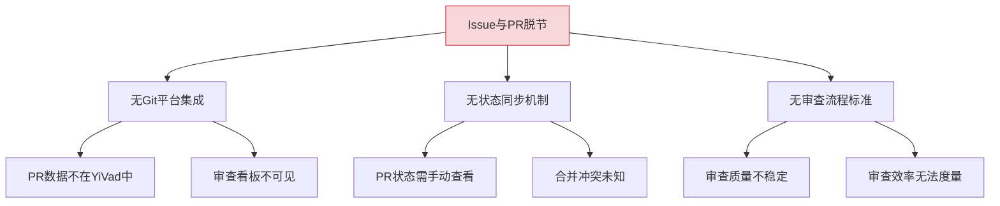
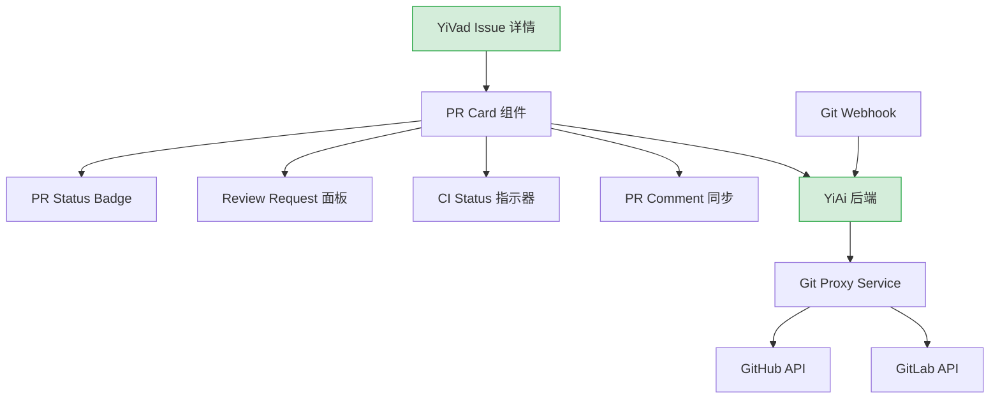
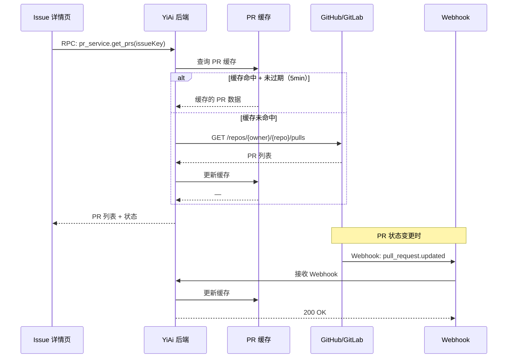

# YV-09-96: 代码审查集成 — GitHub/GitLab PR 集成、审查自动化与审查时间分析

> 需求编号：YV-09-96 · 优先级：P2 · 人天：0.3d · 状态：需求已编写
> 依赖：无硬依赖（可独立开发）

## 背景

### 问题陈述

YiVad 作为项目管理平台，追踪需求、Issue、Bug 的完整生命周期。但代码实现环节的 Pull Request 和代码审查状态当前完全在外部平台（GitHub/GitLab）管理，项目管理者需要在 YiVad 和 Git 平台之间频繁切换来了解开发进度。

1. **Issue 与 PR 脱节**：Issue 上无法看到关联的 PR 状态，不知道代码是否已提交审查
2. **审查请求手动**：需要人工在 GitHub/GitLab 中指定 Reviewer，无法基于规则自动分配
3. **合并状态不透明**：不知道 PR 是否已合并、是否有冲突、CI 是否通过
4. **审查评论分散**：PR 上的 review comments 无法同步到 Issue 讨论中
5. **审查效率无法衡量**：无法统计代码审查的时间消耗和团队效率
6. **审查清单缺失**：没有标准化的代码审查检查清单，审查质量不稳定

**核心矛盾**：开发团队需要在不离开 YiVad 的情况下，了解 PR/审查状态，减少上下文切换。

### 影响范围

| # | 影响 | 严重程度 | 典型场景 |
|---|------|----------|----------|
| 1 | 上下文切换频繁 | 高 | PM 需要打开 GitHub/GitLab 查看 PR 状态 |
| 2 | 审查请求遗漏 | 中 | Reviewer 未及时看到审查请求 |
| 3 | 合并状态不可见 | 中 | Issue 已"开发完成"但实际未合并 |
| 4 | 审查效率无度量 | 低 | 无法优化团队审查流程 |

### 挑战

| 挑战 | 说明 |
|------|------|
| 平台差异 | GitHub 和 GitLab API 不同，需要统一的抽象层 |
| OAuth 认证 | 需要用户授权访问 Git 平台 API |
| PR 状态同步 | PR 状态变化需要及时反映到 YiVad |
| Webhook vs 轮询 | 需要决定状态同步策略 |

---

## 一、现状分析

### 1.1 当前代码审查现状

```
现有功能:
├── Issue 管理
│   ├── Issue 创建/分配/状态流转
│   └── Issue 评论与讨论
├── Git 平台（外部）
│   ├── GitHub PR/Review
│   └── GitLab MR/Review

缺失:
├── Issue ↔ PR 关联            # ❌ 不存在
├── PR 状态卡片（Issue 上）    # ❌ 不存在
├── 审查自动分配               # ❌ 不存在
├── 审查评论同步               # ❌ 不存在
├── 审查检查清单               # ❌ 不存在
└── 审查时间分析               # ❌ 不存在
```

### 1.2 根因分析矩阵



| 根因 | 症状 | 影响 | 优先级 |
|------|------|------|--------|
| 无 API 集成 | PR 数据不可见 | Issue 上的开发进度不完整 | 高 |
| 无同步机制 | PR 状态需手动查询 | PM 上下文切换频繁 | 高 |
| 无审查标准 | 审查质量因人而异 | 缺陷遗漏 | 中 |
| 无效率度量 | 不可优化 | 审查瓶颈无法识别 | 低 |

---

## 二、设计决策

### 决策 1：Git 平台集成方式

| 选项 | 描述 | 优点 | 缺点 |
|------|------|------|------|
| A: 前端直接调用 Git API | YiVad 前端通过 OAuth Token 调用 GitHub/GitLab API | 后端无负担 | Token 暴露前端，CORS 问题 |
| B: 后端代理 + 缓存 | YiAi 后端作为代理，缓存 PR 数据 | 安全，可缓存 | 增加后端负载 |
| C: Webhook 推送 | Git 平台通过 Webhook 推送事件到 YiAi | 实时性最好 | 需要公网可达的 Webhook URL |

**选择：B + C 混合。** 查詢使用后端代理（按需获取 + 缓存），状态变更通过 Webhook 实时推送。首次加载时后端查询 API，后续通过 Webhook 增量更新。

### 决策 2：PR 状态在 Issue 上的展示方式

| 选项 | 描述 | 优点 | 缺点 |
|------|------|------|------|
| A: Issue 详情页内嵌 PR 卡片 | Issue 详情页底部展示关联 PR 列表 | 信息集中 | Issue 详情页变长 |
| B: 独立 PR 标签页 | Issue 详情新增"PR"标签页 | 信息分离 | 多一次点击 |
| C: 侧边栏面板 | 右侧侧边栏展示 PR 状态 | 不干扰主内容 | 空间有限 |

**选择：A（Issue 详情页内嵌 PR 卡片）。** 将关联 PR 以卡片形式嵌入 Issue 详情页的"开发"区域，与 Issue 描述、评论自然衔接。每张卡片显示 PR 标题、状态、Reviewer、CI 状态、合并状态。

### 决策 3：审查自动分配策略

| 选项 | 描述 | 优点 | 缺点 |
|------|------|------|------|
| A: 轮询分配 | 从团队成员中轮询指定 Reviewer | 公平 | 不考虑专业领域 |
| B: 基于文件路径 | 根据修改文件路径匹配 CODEOWNERS | 专业匹配 | 需要维护 CODEOWNERS |
| C: 基于负载 | 分配给当前审查负载最低的成员 | 负载均衡 | 不考虑专业性 |

**选择：B（基于 CODEOWNERS）+ A 兜底。** 优先根据仓库的 CODEOWNERS 文件匹配 Reviewer，无匹配时轮询分配。用户可手动覆盖自动分配结果。

### 决策 4：审查检查清单管理

| 选项 | 描述 | 优点 | 缺点 |
|------|------|------|------|
| A: 硬编码检查项 | 前端固定检查项列表 | 简单 | 不可定制 |
| B: 可配置模板 | 检查清单按项目/团队可配置 | 灵活 | 增加管理复杂度 |
| C: 从 Git 平台同步 | 使用 GitHub/GitLab PR Template | 与平台一致 | 不可二次定制 |

**选择：B（可配置模板）。** 在项目设置中维护审查检查清单模板，创建 PR 时自动应用。支持按文件类型（前端/后端/测试）定义不同的检查清单。

### 设计决策总览

| 决策 | 选项 A | 选项 B | 选择 | 理由 |
|------|--------|--------|------|------|
| Git 集成方式 | 前端直调 | 后端代理 | **后端代理 + Webhook** | 安全 + 实时 |
| PR 展示位置 | 内嵌卡片 | 独立标签页 | **内嵌卡片** | 信息集中，减少点击 |
| 审查分配 | 轮询 | CODEOWNERS | **CODEOWNERS + 轮询** | 专业性优先，公平兜底 |
| 审查检查清单 | 硬编码 | 可配置模板 | **可配置模板** | 适应不同团队需求 |

---

## 三、目标架构

### 3.1 PR 集成架构



### 3.2 PR 状态同步流程



### 3.3 架构决策权衡

| 维度 | 改造前 | 改造后 | 权衡说明 |
|------|--------|--------|----------|
| PR 可见性 | 需打开 Git 平台 | Issue 内嵌 PR 卡片 | 减少上下文切换 |
| 审查分配 | 人工指定 | 自动推荐 + 手动覆盖 | 降低遗漏概率 |
| PR 评论 | 仅 Git 平台可见 | 同步到 Issue | 讨论集中化 |
| 审查效率 | 不可衡量 | 时间分析面板 | 持续改进 |

---

## 四、具体改动

### 4.1 改动总览

| 改动点 | 类型 | 涉及文件 | 预估行数 |
|--------|------|---------|---------|
| PR Card 组件 | 新增 | `components/issue/PrCard.vue` | 100 行 |
| PR List 容器组件 | 新增 | `components/issue/PrList.vue` | 80 行 |
| PR Service（前端） | 新增 | `services/prService.ts` | 60 行 |
| 审查检查清单组件 | 新增 | `components/issue/ReviewChecklist.vue` | 80 行 |
| 审查时间分析图表 | 新增 | `components/charts/ReviewAnalytics.vue` | 100 行 |
| Issue 详情页集成 | 扩展 | `views/issue/detail.vue` | 30 行 |
| 类型定义 | 新增 | `types/pr.ts` | 40 行 |

### 4.2 涉及文件

```
src/
├── components/issue/
│   ├── PrCard.vue                      # 新增：PR 信息卡片
│   ├── PrList.vue                      # 新增：PR 列表容器
│   └── ReviewChecklist.vue             # 新增：审查检查清单
├── components/charts/
│   └── ReviewAnalytics.vue             # 新增：审查时间分析
├── services/
│   └── prService.ts                    # 新增：PR API 服务
├── types/
│   └── pr.ts                           # 新增：PR 类型定义
└── views/issue/
    └── detail.vue                      # 扩展：集成 PR List
```

### 4.3 核心类型定义

```typescript
// types/pr.ts
interface PullRequest {
  id: number;
  number: number;
  title: string;
  state: 'open' | 'closed' | 'merged';
  html_url: string;
  source_branch: string;
  target_branch: string;
  author: GitUser;
  reviewers: ReviewRequest[];
  ci_status: 'pending' | 'success' | 'failure' | 'unknown';
  mergeable: boolean | null;
  created_at: string;
  updated_at: string;
  merged_at: string | null;
}

interface ReviewRequest {
  user: GitUser;
  state: 'pending' | 'approved' | 'changes_requested' | 'commented';
  submitted_at: string | null;
}

interface ReviewChecklistItem {
  id: string;
  category: string;
  description: string;
  checked: boolean;
}

interface ReviewAnalytics {
  avg_time_to_first_review: number;   // 分钟
  avg_time_to_merge: number;          // 分钟
  review_count: number;
  comment_count: number;
  approval_rate: number;
}
```

### 4.4 PR 服务核心逻辑

```typescript
// services/prService.ts
export const prService = {
  async getIssuePrs(issueKey: string): Promise<PullRequest[]> {
    return requestHttp.rpc({
      module_name: 'services.project.pr_service',
      method_name: 'get_issue_prs',
      parameters: { issue_key: issueKey }
    });
  },

  async createReviewRequest(prNumber: number, reviewers: string[]): Promise<void> {
    return requestHttp.rpc({
      module_name: 'services.project.pr_service',
      method_name: 'create_review_request',
      parameters: { pr_number: prNumber, reviewers }
    });
  },

  async getReviewChecklist(projectKey: string): Promise<ReviewChecklistItem[]> {
    return requestHttp.rpc({
      module_name: 'services.project.pr_service',
      method_name: 'get_review_checklist',
      parameters: { project_key: projectKey }
    });
  },

  async getReviewAnalytics(
    projectKey: string, 
    period: { start: string; end: string }
  ): Promise<ReviewAnalytics> {
    return requestHttp.rpc({
      module_name: 'services.project.pr_service',
      method_name: 'get_review_analytics',
      parameters: { project_key: projectKey, period }
    });
  }
};
```

---

## 五、实施步骤

| 步骤 | 内容 | 涉及文件 | 验证方式 | 人天 |
|------|------|---------|---------|------|
| 1 | 类型定义 + PR Service | `types/pr.ts`, `services/prService.ts` | 类型检查通过 | 0.03 |
| 2 | PR Card 组件 | `PrCard.vue` | mock 数据渲染正确 | 0.05 |
| 3 | PR List 容器 | `PrList.vue` | 多 PR 列表渲染 + 空状态 | 0.03 |
| 4 | 审查检查清单组件 | `ReviewChecklist.vue` | 检查项勾选/取消正常 | 0.05 |
| 5 | 审查时间分析图表 | `ReviewAnalytics.vue` | ECharts 图表正确渲染 | 0.05 |
| 6 | Issue 详情页集成 | `detail.vue` | PR 卡片显示在 Issue 详情 | 0.05 |
| 7 | 边界情况 + 加载状态 | 全模块 | 空数据/加载/错误状态处理 | 0.02 |
| 8 | 调试 + 菜单入口 | 路由/菜单 | 审查分析页面可访问 | 0.02 |

**总计：0.3d**

---

## 六、测试规格

### 组件测试：PrCard

#### Scenario: PR 卡片正常渲染
- **GIVEN** PR 状态为 'open'，CI 通过，1 个 Reviewer 待审查
- **WHEN** 渲染 PrCard 组件
- **THEN** 显示 PR 标题、状态标签（绿色 'Open'）、CI 通过图标、Reviewer 头像和状态

#### Scenario: PR 已合并展示
- **GIVEN** PR 状态为 'merged'，merged_at 不为 null
- **WHEN** 渲染 PrCard
- **THEN** 显示紫色 'Merged' 标签和合并时间

### 组件测试：ReviewChecklist

#### Scenario: 检查清单渲染
- **GIVEN** 项目配置了 5 个检查项分属 3 个类别
- **WHEN** 渲染 ReviewChecklist
- **THEN** 按类别分组显示，每项有复选框

#### Scenario: 检查项勾选交互
- **GIVEN** 检查清单中第 1 项未勾选
- **WHEN** 点击该项的复选框
- **THEN** 复选框变为勾选状态，计数更新

### 集成测试：Issue 详情页 PR 集成

#### Scenario: 无关联 PR
- **GIVEN** Issue 无关联 PR
- **WHEN** 查看 Issue 详情
- **THEN** PR 区域显示"暂无关联 PR"空状态 + "创建 PR"提示链接

#### Scenario: 有 3 个关联 PR
- **GIVEN** Issue 关联 3 个 PR（1 open + 1 merged + 1 closed）
- **WHEN** 查看 Issue 详情
- **THEN** 3 张 PR Card 按时间倒序显示，merged 的卡片有合并时间

### 组件测试：ReviewAnalytics

#### Scenario: 审查时间分析图表
- **GIVEN** 过去 30 天有 15 个 PR 的审查数据
- **WHEN** 渲染 ReviewAnalytics
- **THEN** 显示平均首次审查时间、平均合并时间、审批率饼图

---

## 七、风险与缓解

| 风险 | 概率 | 影响 | 等级 | 缓解措施 | 应急预案 |
|------|------|------|------|----------|----------|
| Git API 限流 | 中 | 中 | 中 | 后端缓存 TTL 5 分钟，合并批量查询 | 降级为手动刷新按钮 |
| OAuth Token 过期 | 中 | 高 | 高 | Token 过期前 1 天提示刷新 | 使用只读公共数据 |
| Webhook 接收失败 | 低 | 中 | 低 | 缓存过期后自动重新查询 | 轮询兜底（每 10 分钟） |
| CODEOWNERS 文件格式不标准 | 低 | 低 | 低 | 解析失败时回退到轮询分配 | 手动指定 Reviewer |

---

## 八、回滚策略

| 回滚场景 | 回滚方式 | 影响范围 | 恢复时间 |
|----------|----------|----------|----------|
| PR 集成功能异常 | `git revert` PR 相关提交 | Issue 详情页 PR 区域 | < 1min |
| PR Service 接口不可用 | 前端降级：隐藏 PR 区域，不报错 | Issue 详情页 | < 5min（发布降级版本） |
| Webhook 导致后端异常 | 暂停 Webhook 端点 + 回滚后端代码 | PR 状态不再实时更新 | < 5min |

**回滚验证：**
- 回滚后 Issue 详情页正常显示，PR 区域不报错
- 回滚后 Git 平台功能不受影响
- 回滚后已有 PR 缓存数据可清理

---

## 九、设计决策记录

### D-01: 为什么选择后端代理而非前端直接调用 Git API？

前端直接调用 Git API 意味着 OAuth Token 需要暴露在浏览器中，XSS 攻击可能导致 Token 泄露。后端代理方式下 Token 仅存在于服务端，安全性更高。此外，后端可以添加缓存层，减少对 Git API 的调用频率，降低限流风险。

### D-02: 为什么 PR 卡片内嵌在 Issue 详情而非独立标签页？

PR 状态是 Issue 开发进度的核心指标，与 Issue 描述和状态同等重要。内嵌在详情页中可以一目了然地看到完整开发状态，无需额外点击。如果未来 PR 数量增多（>5），可折叠旧 PR 仅显示最近 3 个。

### D-03: 为什么审查检查清单使用可配置模板而非同步 Git 平台 PR Template？

不同团队有不同的审查标准，YiVad 的检查清单模板支持按项目定制和版本管理。同步 Git 平台 PR Template 虽然减少维护成本，但无法支持以下场景：按文件类型定义的检查项（前端 vs 后端）、审查统计数据（哪些检查项最常被忽略）、模板历史版本对比。

### D-04: 为什么 PR 缓存 TTL 设为 5 分钟而非更短？

GitHub API 对未认证请求限制 60 次/小时，认证请求 5000 次/小时。5 分钟 TTL 意味着每个 Issue 每小时最多查询 12 次，多 Issue 项目也在限流范围内。同时 5 分钟的延迟对项目管理场景可接受，Webhook 可提供实时补充。

---

## 十、可观测性

### 关键指标

| 指标 | 采集方式 | 告警阈值 | 说明 |
|------|---------|---------|------|
| PR 数据加载耗时 | `performance.now()` | P95 > 2000ms | 后端代理 + Git API 延迟 |
| Git API 调用频率 | 后端计数器 | 接近限流阈值 80% | 防止 API 限流 |
| Webhook 接收成功率 | 后端计数器 | < 90% | Webhook 投递可靠性 |
| PR 组件渲染错误率 | `onErrorCaptured` | > 1% | 组件渲染异常 |

### 日志规范

| 日志级别 | 场景 | 示例 |
|---------|------|------|
| `INFO` | PR 数据加载 | `[PR] loaded ${count} PRs for issue ${key}` |
| `WARN` | Git API 接近限流 | `[PR] GitHub API rate limit: ${remaining}/${total}` |
| `ERROR` | Git API 调用失败 | `[PR] API error: ${status}, ${message}` |

---

## 十一、代码审查检查清单

- [ ] PrCard 组件正确处理所有 PR 状态（open/closed/merged）
- [ ] CI 状态指示器正确映射（pending→黄色, success→绿色, failure→红色）
- [ ] Reviewer 头像加载失败时显示初始字母占位
- [ ] ReviewChecklist 支持按类别分组的展开/折叠
- [ ] PR 列表空状态文案友好，引导用户创建 PR
- [ ] `vue-tsc --noEmit` 通过
- [ ] 无 ESLint/Prettier 告警

---

## 回归问题预测

| # | 问题 | 发现场景 | 根因 | 修复方式 |
|---|------|---------|------|---------|
| 1 | PR 数据加载慢导致 Issue 详情页白屏 | 首次加载有 10+ 关联 PR 的 Issue | PR Service 查询未做分页，全部 PR 一起加载 | 默认加载最近 5 个 PR，"查看更多"按钮加载全部 |
| 2 | CI Status 图标在 GitHub Actions 和 GitLab CI 状态名不一致时显示错误 | GitHub PR 的 CI pending 显示为 success | GitHub Actions 的 `status` 字段和 `conclusion` 字段分离，仅看 `status` 可能遗漏 | 统一解析 GitHub/GitLab CI 字段映射表 |
| 3 | Reviewer 已批准但前端未刷新 | Reviewer 在 GitHub 上批准 PR 后 Issue 详情页仍显示"待审查" | Webhook 延迟到达或缓存未过期 | 添加手动刷新按钮 + 缓存 TTL 降至 2 分钟 |
| 4 | 审查检查清单勾选状态不持久 | 刷新页面后检查清单恢复默认 | 勾选状态仅保存在组件 ref 中，未提交后端 | 添加 `saveChecklistState` API，页面加载时恢复 |
| 5 | 多仓库项目的 PR 归属错误 | 项目关联 2 个仓库，Issue A 的 PR 显示属于仓库 B | PR 与 Issue 的关联仅通过 `issue_key` 匹配，未考虑仓库 bound | 后端查询时增加 `repo_filter` 参数 |
| 6 | CODEOWNERS 解析在文件路径有通配符时匹配失败 | `apps/*/src/**` 模式匹配不到文件 | 正则转换为 glob 模式时的边界情况 | 使用成熟的 CODEOWNERS 解析库（如 `codeowners-utils`） |

---

## 性能分析

### 组件渲染性能

| 指标 | 无 PR 集成 | 引入 PR 集成后 | 说明 |
|------|----------|-------------|------|
| Issue 详情页首屏渲染 | ~200ms | ~300ms（+3 PR Card） | 额外加载 PR 数据 |
| PR Card 渲染（单个） | — | ~30ms | 轻量卡片组件 |
| ReviewAnalytics 图表 | — | ~100ms（ECharts） | 数据聚合 + 图表渲染 |

### 内存分析

| 数据结构 | 大小 | 说明 |
|---------|------|------|
| PR 数据（单 Issue，5 PR） | ~8KB | 包含 reviewer 和 ci 状态 |
| 检查清单模板 | ~2KB | 5-15 项检查项 |
| ReviewAnalytics 数据 | ~3KB | 30 天聚合数据 |

### 网络请求分析

| 页面 | 首次加载 API 调用数 | 关键路径请求 | 可并行请求 |
|------|-------------------|-------------|-----------|
| Issue 详情页（有 PR） | 原有 + 1（getIssuePrs） | getIssuePrs | 可与其他 Issue 数据并行 |
| ReviewAnalytics 页面 | 1（getReviewAnalytics） | getReviewAnalytics | — |

---

*PRD 来源: `projects/yivad/requirements/2026-09/00-需求-需求总览.md`*

