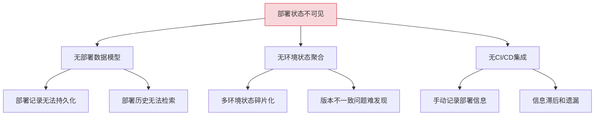
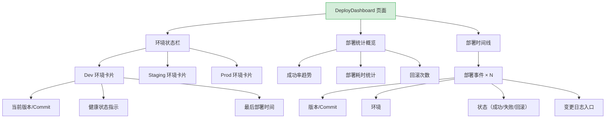
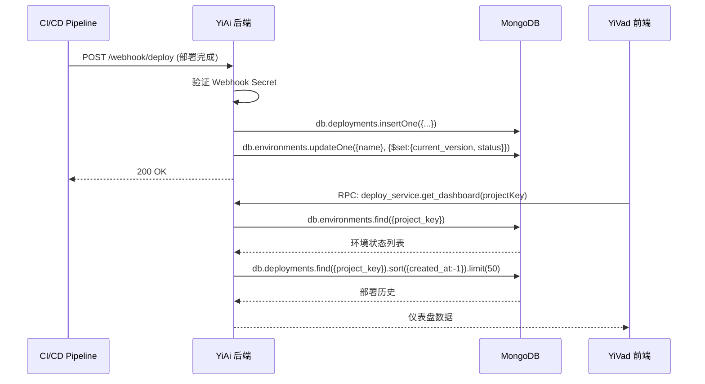

# YV-09-97: 部署追踪面板 — 部署历史、环境状态、部署成功率和变更日志

> 需求编号：YV-09-97 · 优先级：P2 · 人天：0.3d · 状态：需求已编写
> 依赖：YV-09-84（变更日志与发布说明）

## 背景

### 问题陈述

YiVad 项目当前缺少部署维度的可见性。开发团队和运维人员需要了解各环境（开发、预发、生产）的当前部署状态、部署历史和部署质量指标。当前部署信息分散在 CI/CD 工具中，不便于非运维人员查看。

1. **部署状态不可见**：不知道生产环境当前运行的是哪个版本，是否有部署进行中
2. **部署历史碎片化**：部署记录分散在 CI/CD 日志中，难以追溯
3. **环境状态无全局视图**：dev/staging/prod 三环境的软件版本和健康状态无法一目了然
4. **部署成功率未知**：无法统计部署成功率、失败模式和趋势
5. **回滚记录缺失**：回滚操作没有系统化记录，事故复盘缺少数据
6. **变更日志不可见**：每次部署的具体变更内容（Issues/PRs/Commits）无法方便查看

**核心矛盾**：运维有 CI/CD 工具，但其他角色（PM、QA、开发）需要一个简化的部署看板来了解交付状态。

### 影响范围

| # | 影响 | 严重程度 | 典型场景 |
|---|------|----------|----------|
| 1 | 部署状态不透明 | 高 | QA 不知道预发环境是否已部署最新版本 |
| 2 | 回滚无记录 | 中 | 生产出现问题后不知道何时回滚的 |
| 3 | 部署质量无法度量 | 中 | 无法发现部署流程的瓶颈 |
| 4 | 变更追溯困难 | 低 | 生产故障时难以快速定位相关变更 |

### 挑战

| 挑战 | 说明 |
|------|------|
| 部署数据源 | 需要与 CI/CD 系统（GitHub Actions/GitLab CI/Jenkins）对接 |
| 部署定义差异 | 不同团队的"部署"定义可能不同（K8s apply / Docker deploy / 静态文件上传） |
| 实时性 | 部署状态需要准实时更新 |
| 多环境管理 | 不同环境的部署策略和版本可能不同 |

---

## 一、现状分析

### 1.1 当前部署追踪现状

```
现有功能:
├── 变更日志（YV-09-84）
│   ├── 版本发布说明
│   └── 变更记录
├── CI/CD 工具（外部）
│   ├── GitHub Actions / GitLab CI
│   └── 部署日志

缺失:
├── 部署历史时间线              # ❌ 不存在
├── 环境状态面板                # ❌ 不存在
├── 部署成功率统计              # ❌ 不存在
├── 回滚追踪                    # ❌ 不存在
├── 部署耗时指标                # ❌ 不存在
└── 变更日志/部署关联            # ❌ 不存在
```

### 1.2 根因分析矩阵



| 根因 | 症状 | 影响 | 优先级 |
|------|------|------|--------|
| 无部署数据模型 | 部署无结构化记录 | 无法统计和分析 | 高 |
| 无环境聚合 | 多环境状态不可见 | 版本管理混乱 | 高 |
| 无 CI/CD 集成 | 部署信息需手动录入 | 信息滞后 | 中 |

---

## 二、设计决策

### 决策 1：部署数据来源

| 选项 | 描述 | 优点 | 缺点 |
|------|------|------|------|
| A: CI/CD Webhook | 在 CI/CD Pipeline 末尾调用 YiAi Webhook 记录部署 | 自动化，准确 | 需要修改 CI/CD 配置 |
| B: 手动创建 | 用户在 YiVad 中手动记录部署 | 无需集成CI/CD | 依赖人肉操作，易遗漏 |
| C: Git Tag 监听 | 监听 Git Tag 推送事件自动创建部署记录 | 与发布流程一致 | 仅能追踪有 Tag 的部署 |

**选择：A + C 混合。** CI/CD Webhook 作为主要数据源（自动、准确），Git Tag 监听作为兜底（无需修改 CI/CD）。手动创建作为补充（允许记录非自动化部署）。

### 决策 2：环境状态展示方式

| 选项 | 描述 | 优点 | 缺点 |
|------|------|------|------|
| A: 多列看板 | 每环境一列，卡片式展示当前版本和健康状态 | 一目了然 | 环境多时横向滚动 |
| B: 时间线视图 | 按时间轴展示各环境的部署事件 | 历史追溯清晰 | 当前状态不直观 |
| C: 仪表盘 | 顶部环境卡片 + 底部部署时间线 | 当前状态 + 历史兼顾 | 页面较长 |

**选择：C（仪表盘）。** 顶部 3-4 张环境状态卡片（dev/staging/prod），底部部署时间线。当前状态和历史追溯兼顾，信息层次清晰。

### 决策 3：部署成功率计算

| 选项 | 描述 | 优点 | 缺点 |
|------|------|------|------|
| A: 简单比率 | 成功部署数 / 总部署数 | 简单直观 | 无法区分失败原因 |
| B: 加权比率 | 按环境加权（生产权重高） | 更关注关键环境 | 配置复杂 |
| C: 滚动窗口 | 仅统计最近 N 次部署 | 反映近期质量 | 可能忽略长期趋势 |

**选择：C + A 混合。** 默认显示最近 30 次部署的成功率（滚动窗口），页面下方展示全部历史成功率趋势。生产环境部署失败单独高亮标注。

### 决策 4：回滚记录方式

| 选项 | 描述 | 优点 | 缺点 |
|------|------|------|------|
| A: 部署记录关联 | 回滚作为一个部署记录，关联到被回滚的部署 | 数据结构统一 | 回滚与正向部署区分不明显 |
| B: 独立回滚记录 | 回滚有独立的数据模型 | 语义清晰 | 增加数据模型 |
| C: 部署记录状态标记 | 正向部署被标记为 `rolled_back` | 简单 | 丢失回滚操作本身的信息 |

**选择：A（部署记录关联）。** 回滚也是一个部署操作，使用相同的部署记录模型，通过 `rollback_of` 字段关联到被回滚的部署记录。数据模型统一，前端展示时渲染为回滚标记。

### 设计决策总览

| 决策 | 选项 A | 选项 B | 选择 | 理由 |
|------|--------|--------|------|------|
| 数据来源 | CI/CD Webhook | 手动创建 | **Webhook + Git Tag** | 自动化优先，手动兜底 |
| 展示方式 | 多列看板 | 时间线 | **仪表盘** | 当前+历史兼顾 |
| 成功率计算 | 简单比率 | 加权比率 | **滚动窗口 + 全部** | 近期质量 + 长期趋势 |
| 回滚记录 | 关联部署 | 独立模型 | **关联部署** | 数据模型统一 |

---

## 三、目标架构

### 3.1 部署追踪面板布局



### 3.2 部署数据流



### 3.3 架构决策权衡

| 维度 | 改造前 | 改造后 | 权衡说明 |
|------|--------|--------|----------|
| 部署可见性 | 仅 CI/CD 日志 | YiVad 部署面板 | 非运维人员可见 |
| 环境状态 | 手动确认 | 实时环境卡片 | 减少确认成本 |
| 部署质量 | 无度量 | 成功率+耗时+回滚 | 持续改进 |
| 变更追溯 | 单独查看 PR | 部署关联变更 | 故障定位更快 |

---

## 四、具体改动

### 4.1 改动总览

| 改动点 | 类型 | 涉及文件 | 预估行数 |
|--------|------|---------|---------|
| 部署仪表盘页面 | 新增 | `views/deploy/DeployDashboard.vue` | 200 行 |
| 环境状态卡片组件 | 新增 | `components/deploy/EnvStatusCard.vue` | 80 行 |
| 部署时间线组件 | 新增 | `components/deploy/DeployTimeline.vue` | 120 行 |
| 部署统计图表 | 新增 | `components/charts/DeployStats.vue` | 100 行 |
| Deploy Service | 新增 | `services/deployService.ts` | 50 行 |
| 类型定义 | 新增 | `types/deploy.ts` | 40 行 |
| 路由 + 菜单配置 | 扩展 | `routes.ts`, 菜单数据 | 15 行 |

### 4.2 涉及文件

```
src/
├── views/deploy/
│   └── DeployDashboard.vue             # 新增：部署仪表盘主页面
├── components/deploy/
│   ├── EnvStatusCard.vue               # 新增：环境状态卡片
│   └── DeployTimeline.vue              # 新增：部署时间线
├── components/charts/
│   └── DeployStats.vue                 # 新增：部署统计图表
├── services/
│   └── deployService.ts                # 新增：部署 API 服务
└── types/
    └── deploy.ts                       # 新增：部署类型定义
```

### 4.3 核心类型定义

```typescript
// types/deploy.ts
interface Deployment {
  key: string;
  project_key: string;
  environment: 'dev' | 'staging' | 'prod';
  version: string;
  commit_sha: string;
  status: 'success' | 'failed' | 'in_progress' | 'rolled_back';
  duration_seconds: number;
  triggered_by: string;
  rollback_of: string | null;
  change_items: ChangeItem[];
  created_at: string;
}

interface EnvironmentStatus {
  name: 'dev' | 'staging' | 'prod';
  current_version: string;
  current_commit: string;
  health_status: 'healthy' | 'degraded' | 'down' | 'unknown';
  last_deploy_at: string;
  deploy_count_30d: number;
}

interface ChangeItem {
  type: 'issue' | 'pr' | 'commit';
  key: string;
  title: string;
  url: string;
}

interface DeployStats {
  total_deployments: number;
  success_rate: number;
  avg_duration_seconds: number;
  rollback_count: number;
  failure_by_env: Record<string, number>;
  trend: DeployTrendPoint[];
}
```

---

## 五、实施步骤

| 步骤 | 内容 | 涉及文件 | 验证方式 | 人天 |
|------|------|---------|---------|------|
| 1 | 类型定义 + Deploy Service | `types/deploy.ts`, `services/deployService.ts` | 类型检查通过 | 0.03 |
| 2 | 环境状态卡片 | `EnvStatusCard.vue` | 3 环境卡片渲染正确 | 0.05 |
| 3 | 部署时间线组件 | `DeployTimeline.vue` | 时间线渲染 + 展开详情 | 0.08 |
| 4 | 部署统计图表 | `DeployStats.vue` | ECharts 图表正确渲染 | 0.06 |
| 5 | 仪表盘主页面组装 | `DeployDashboard.vue` | 所有组件集成正常 | 0.05 |
| 6 | 路由 + 菜单配置 | `routes.ts`, 菜单 | 页面可访问 | 0.01 |
| 7 | 边界处理 + 空状态 | 全模块 | 空数据/加载/错误状态 | 0.02 |

**总计：0.3d**

---

## 六、测试规格

### 组件测试：EnvStatusCard

#### Scenario: 健康环境卡片
- **GIVEN** 生产环境 `health_status = 'healthy'`，版本 v2.1.0
- **WHEN** 渲染 EnvStatusCard
- **THEN** 显示绿色健康图标、版本号 v2.1.0、最后部署时间

#### Scenario: 异常环境卡片
- **GIVEN** Staging 环境 `health_status = 'degraded'`
- **WHEN** 渲染 EnvStatusCard
- **THEN** 显示黄色警告图标、环境名称旁有警告标记

### 组件测试：DeployTimeline

#### Scenario: 部署时间线渲染
- **GIVEN** 有 5 条部署记录（3 成功 + 1 失败 + 1 回滚）
- **WHEN** 渲染 DeployTimeline
- **THEN** 时间线按时间倒序排列，成功的绿色圆点，失败的红色圆点，回滚的有回滚标记

#### Scenario: 时间线展开变更详情
- **GIVEN** 部署记录包含 3 个 ChangeItem
- **WHEN** 点击部署记录的展开按钮
- **THEN** 展开区域显示 3 个 ChangeItem（Issue/PR/Commit 链接）

### 组件测试：DeployStats

#### Scenario: 部署统计图表
- **GIVEN** 过去 30 天有 20 次部署，成功率 85%
- **WHEN** 渲染 DeployStats
- **THEN** 显示成功率数字（85%）、成功率趋势折线图、按环境分组的失败统计

### 集成测试：部署仪表盘

#### Scenario: 首次加载完整仪表盘
- **GIVEN** 项目有 3 个环境 + 30 条部署记录
- **WHEN** 加载 DeployDashboard
- **THEN** 顶部 3 张环境卡片、中间统计图表、底部时间线全部正确渲染

#### Scenario: 无部署记录
- **GIVEN** 新项目无任何部署记录
- **WHEN** 加载 DeployDashboard
- **THEN** 环境卡片显示"无部署记录"，时间线区域显示引导提示

---

## 七、风险与缓解

| 风险 | 概率 | 影响 | 等级 | 缓解措施 | 应急预案 |
|------|------|------|------|----------|----------|
| CI/CD Webhook 配置遗漏 | 中 | 中 | 中 | 提供 CI/CD 配置模板（GitHub Actions/GitLab CI） | 支持手动创建部署记录 |
| Webhook 安全风险 | 低 | 高 | 中 | Webhook Secret 验证 + IP 白名单 | 临时关闭 Webhook 端点 |
| 部署数据量大导致查询慢 | 中 | 低 | 低 | MongoDB 索引（project_key + created_at），分页加载 | 限制时间线 50 条 |
| 健康状态检测不准 | 中 | 中 | 中 | 提供健康检测 URL 配置，发送 HEAD 请求 | 显示"未知"状态而非错误 |

---

## 八、回滚策略

| 回滚场景 | 回滚方式 | 影响范围 | 恢复时间 |
|----------|----------|----------|----------|
| 部署面板功能异常 | `git revert` 相关提交 | 部署仪表盘页面 | < 1min |
| Webhook 端点被攻击 | 暂停 Webhook 端点，临时仅支持手动创建 | 自动化部署记录 | < 5min |
| 部署数据模型需调整 | 清理 `deployments` 集合，重新导入 | 部署历史丢失 | < 10min |

**回滚验证：**
- 回滚后项目其他功能不受影响
- 回滚后 CI/CD Pipeline 不受影响
- Webhook 端点安全关闭

---

## 九、设计决策记录

### D-01: 为什么不直接嵌入 CI/CD 工具的 iframe 而要做自定义面板？

直接嵌入 CI/CD 工具（如 GitHub Actions 页面）虽然开发成本低，但存在以下问题：需要用户在 YiVad 中重新认证 CI/CD 平台；iframe 无法与 YiVad 交互（如在 Issue 上显示部署状态）；无法聚合多项目/多环境的部署数据。自定义面板可以统一数据模型，将部署信息与 Issue/PR/变更日志关联。

### D-02: 为什么回滚使用关联部署记录而非独立数据模型？

回滚本质上是一次部署操作（将代码从版本 B 回退到版本 A），与正向部署共享相同的属性（目标环境、版本、触发者、耗时）。通过 `rollback_of` 字段关联被回滚的部署，前端可以渲染回滚链（部署 → 回滚）。独立数据模型会增加查询复杂度（需要联合查询两个集合）。

### D-03: 为什么环境健康状态检测仅使用 HEAD 请求？

完整的环境健康检测（如运行集成测试、检查数据库连接、验证第三方服务）复杂度高且执行时间长。HEAD 请求（HTTP 200 = healthy）是最轻量的健康信号，足以反映服务是否在线。深度健康检测属于 APM/监控系统的职责，不在 YiVad 范围内。

### D-04: 为什么部署成功率使用滚动窗口（30 次）而非全部历史？

全部历史成功率对长期项目来说会趋于稳定，对新部署的失败不敏感。滚动窗口（最近 30 次）能更灵敏地反映近期部署质量变化，帮助团队快速发现部署流程中的新问题。全部历史趋势图作为补充，展示长期变化。

---

## 十、可观测性

### 关键指标

| 指标 | 采集方式 | 告警阈值 | 说明 |
|------|---------|---------|------|
| 部署面板加载耗时 | `performance.now()` | P95 > 1500ms | 时间线渲染性能 |
| Webhook 接收延迟 | Webhook 时间戳 vs 接收时间 | > 30s | Webhook 处理延迟 |
| 部署记录创建失败率 | RPC 响应 code != 0 | > 0% | Webhook 处理异常 |
| 环境健康检测失败率 | HEAD 请求失败 | > 10% | 可能是网络问题或服务异常 |

### 日志规范

| 日志级别 | 场景 | 示例 |
|---------|------|------|
| `INFO` | 部署记录创建 | `[Deploy] ${env}: ${version}, status=${status}` |
| `WARN` | 部署失败 | `[Deploy] FAILED: ${env}, reason=${reason}` |
| `ERROR` | Webhook 验证失败 | `[Deploy] webhook secret mismatch` |

---

## 十一、代码审查检查清单

- [ ] EnvStatusCard 正确映射健康状态颜色（healthy→green, degraded→yellow, down→red）
- [ ] DeployTimeline 正确处理回滚部署的视觉区分（回滚标记 + 关联线）
- [ ] DeployStats 图表数据为空时不报错
- [ ] 部署记录展开的 ChangeItems 链接正确（Issue 链接/PR 链接/Commit 链接）
- [ ] `vue-tsc --noEmit` 通过
- [ ] 无 ESLint/Prettier 告警

---

## 回归问题预测

| # | 问题 | 发现场景 | 根因 | 修复方式 |
|---|------|---------|------|---------|
| 1 | 生产环境健康检测 HEAD 请求超时导致面板加载慢 | 生产环境部署在某些 CDN 后面，HEAD 请求耗时 5s+ | 健康检测在加载仪表盘时同步执行，阻塞渲染 | 健康检测异步执行，设置 3s 超时，超时显示 `unknown` |
| 2 | 部署时间线中同时进行多环境部署时顺序错乱 | DevOps 同时对 dev 和 staging 部署 | MongoDB 写入时间戳精度为秒级，同一秒内的 2 次部署排序不确定 | `created_at` 使用毫秒精度，或按 `_id`（单调递增）作为二级排序 |
| 3 | Webhook 重复投递导致同一次部署创建多条记录 | CI/CD 重试机制触发 Webhook 重复调用 | Webhook 幂等性未处理 | 用 `commit_sha + environment` 作为唯一键，`insertOne` 失败时 `updateOne` |
| 4 | 环境卡片在健康检测失败后持续显示 down | 网络抖动导致 1 次 HEAD 请求失败 | 健康检测仅依赖当前请求结果，无容错 | 连续 3 次失败才标记为 down，1 次成功即恢复 healthy |
| 5 | 部署统计图表中部署耗时为 0 时被过滤掉 | 部署记录 `duration_seconds = 0`（数据缺失） | avg_duration 计算中 `filter(d => d.duration > 0)` 过滤后分母减少 | 分离统计：显示"有耗时数据的部署"和"无耗时数据的部署"两个指标 |
| 6 | 部署记录中 change_items 过大导致 MongoDB 文档超过 16MB | 一次部署包含 200+ 个 commits | MongoDB BSON 文档大小限制 | change_items 仅存储摘要（type+key+title），完整列表按需查询 |

---

## 性能分析

### 组件渲染性能

| 指标 | 无部署面板 | 部署仪表盘 | 说明 |
|------|----------|----------|------|
| 首屏渲染 | — | ~250ms（3 环境卡片 + 50 条时间线） | 新增页面 |
| DeployStats 图表 | — | ~80ms（ECharts） | 趋势图 + 饼图 |
| 时间线展开详情 | — | ~30ms | 单条展开 |

### 内存分析

| 数据结构 | 大小 | 说明 |
|---------|------|------|
| 环境状态（3 环境） | ~3KB | 当前版本 + 健康状态 |
| 部署记录（50 条） | ~30KB | 含 change_items |
| 统计聚合数据 | ~5KB | 成功率 + 趋势 |

### 网络请求分析

| 页面 | 首次加载 API 调用数 | 关键路径请求 | 可并行请求 |
|------|-------------------|-------------|-----------|
| DeployDashboard | 1（getDashboard 聚合接口） | getDashboard | — |
| 手动刷新 | 1（同上） | — | — |

### 容量规划

| 场景 | 部署记录数 | 页面渲染 | 内存 | 建议 |
|------|----------|----------|------|------|
| 小型项目 | < 100 | ~200ms | ~20KB | 默认分页 50 条 |
| 中型项目 | 100-500 | ~400ms | ~40KB | 时间线分页 + 环境过滤 |
| 大型项目 | 500+ | ~800ms | ~80KB | 分页 + 日期范围过滤 |

---

*PRD 来源: `projects/yivad/requirements/2026-09/00-需求-需求总览.md`*

