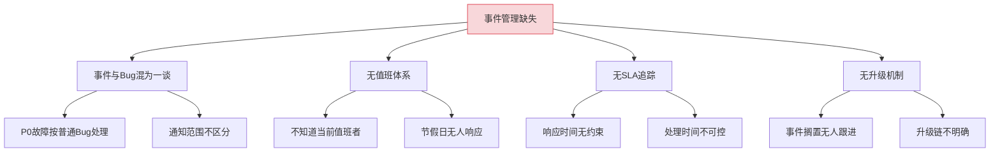
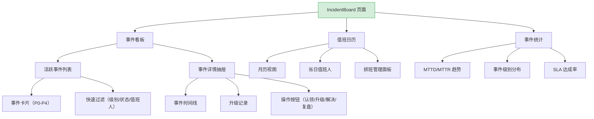
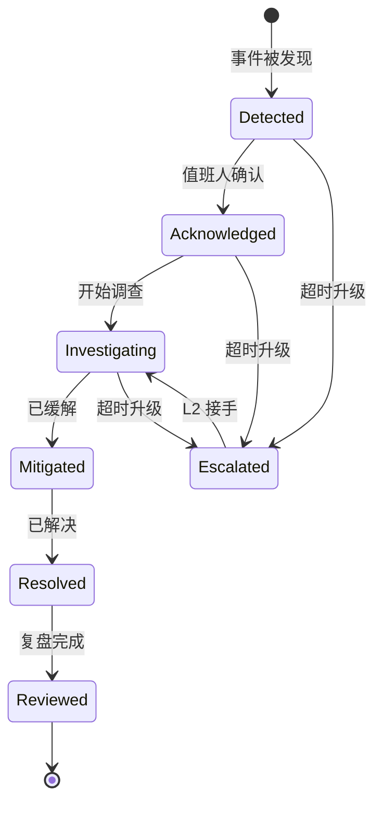

# YV-09-98: 事件管理与值班 — 事件分级、值班日历、升级策略与事件指标

> 需求编号：YV-09-98 · 优先级：P2 · 人天：0.3d · 状态：需求已编写
> 依赖：YV-09-92（风险登记册）、YV-09-93（决策记录管理）

## 背景

### 问题陈述

YiVad 管理项目中的 Bug 和 Issue，但缺少生产环境事件（Incident）的管理能力。当生产环境出现故障时，团队需要：快速创建事件、按严重程度分级、自动通知值班人员、按升级策略逐级上报、事后追溯完整的事件时间线。当前流程完全依赖外部工具（钉钉/企微/飞书）或口头沟通。

1. **事件创建无规范**：P0 级别的生产故障和普通 Bug 混为一谈
2. **值班安排靠记忆**：没有可视化的值班日历，谁值班靠团队记忆
3. **升级策略靠人工**：事件超过一定时间未解决，需要人工判断是否升级和通知谁
4. **事件时间线缺失**：事后复盘时无法还原事件的完整时间线（发现→响应→修复→恢复）
5. **事件指标无法统计**：MTTD（Mean Time to Detect）、MTTR（Mean Time to Resolve）无数据

**核心矛盾**：生产故障需要严肃的管理流程（分级、通知、升级、复盘），但当前 Bug 管理系统不支持事件特有的需求。

### 影响范围

| # | 影响 | 严重程度 | 典型场景 |
|---|------|----------|----------|
| 1 | P0 故障响应慢 | 高 | 无人知晓当前值班者是谁 |
| 2 | 事件升级遗漏 | 高 | 事件超过 SLA 未解决但无自动升级 |
| 3 | 复盘无数据 | 中 | 事件处理时间、操作记录缺失 |
| 4 | 值班安排混乱 | 中 | 节假日/周末无明确值班安排 |
| 5 | 事件通知不及时 | 低 | 依赖人工在群聊中通知 |

### 挑战

| 挑战 | 说明 |
|------|------|
| 事件模型与 Bug 模型的区分 | 事件有时间线、SLA、升级策略，Bug 没有 |
| 值班日历的循环规则 | 需要支持按周/月循环的值班安排 |
| 升级策略的自动触发 | 需要在后端实现定时检查未解决事件的升级条件 |
| 通知渠道集成 | 需要通过企微/钉钉/邮件发送事件通知 |

---

## 一、现状分析

### 1.1 当前事件管理现状

```
现有功能:
├── Bug 管理
│   ├── Bug 创建/分配/状态流转
│   └── Bug 严重级别（severity）
├── 风险登记册（YV-09-92）
│   ├── 风险识别
│   └── 影响评估

缺失:
├── 事件（Incident）实体          # ❌ 不存在
├── 事件分级（P0-P4）             # ❌ Bug 只有 severity 无 priority 级别
├── 值班日历                      # ❌ 不存在
├── 升级策略                      # ❌ 不存在
├── 事件时间线                    # ❌ 不存在
├── MTTD/MTTR 统计                # ❌ 不存在
└── 事后复盘集成                  # ❌ 不存在
```

### 1.2 根因分析矩阵



| 根因 | 症状 | 影响 | 优先级 |
|------|------|------|--------|
| 事件模型缺失 | P0 故障无特殊处理 | 响应速度慢 | 高 |
| 值班体系缺失 | 责任人不可知 | 通知无法触达 | 高 |
| SLA 无追踪 | 处理时间无约束 | 故障持续过长 | 中 |
| 升级无自动化 | 依赖人工判断 | 遗漏风险 | 中 |

---

## 二、设计决策

### 决策 1：事件 vs Bug 的模型关系

| 选项 | 描述 | 优点 | 缺点 |
|------|------|------|------|
| A: 事件是 Bug 的子类型 | 在 Bug 上增加事件特有字段 | 改动最小，复用 Bug 所有功能 | Bug 模型膨胀，语义模糊 |
| B: 事件独立模型 | 全新 `incidents` 集合，与 `bugs` 独立 | 模型清晰，功能定制 | 增加集合和管理复杂度 |
| C: 事件是 Issue 的特殊类型 | Issue 增加 `issue_type=incident` | 复用 Issue 系统 | Issue 模型过于通用 |

**选择：B（事件独立模型）。** 事件与 Bug 的核心差异显著：事件有时间线（发现→响应→修复→恢复）、SLA 约束、升级策略、复盘链接。独立模型避免 Bug 模型膨胀，也为后续事件管理功能（如事件指挥中心）留出空间。

### 决策 2：事件通知渠道

| 选项 | 描述 | 优点 | 缺点 |
|------|------|------|------|
| A: YiVad 站内通知 | 使用 YiVad 现有通知系统 | 无需额外集成 | 非在线时无法收到 |
| B: 企微/钉钉群通知 | 通过企业 IM 群发送通知 | 实时触达 | 需配置 Webhook |
| C: 邮件通知 | 发送邮件到值班人员 | 通用性强 | 实时性差 |

**选择：B（企微通知）+ A（站内通知）兜底。** 企微通知通过 YiAi 已有的企微消息模块实现，实时性最好。站内通知作为兜底（非企微用户可见）。

### 决策 3：值班日历循环规则

| 选项 | 描述 | 优点 | 缺点 |
|------|------|------|------|
| A: 手动排班 | 管理员逐日指定值班人员 | 最灵活 | 维护成本高 |
| B: 周循环 | 按周循环（每周一 A 值班，周二 B 值班） | 简单够用 | 不能处理轮周 |
| C: 轮周 + 手动覆盖 | 默认轮周（A 周/B 周），支持手动覆盖特定日期 | 灵活 + 低维护 | 实现稍复杂 |

**选择：C（轮周 + 手动覆盖）。** 默认使用轮周模式（本周 A 组、下周 B 组），管理员可以手动覆盖特定日期（节假日、调休）。支持导入节假日日历自动填充。

### 决策 4：升级策略触发方式

| 选项 | 描述 | 优点 | 缺点 |
|------|------|------|------|
| A: 定时任务检查 | 后端每 5 分钟检查未解决事件是否超时 | 自动化 | 有延迟（最多 5 分钟） |
| B: 事件创建时设定定时器 | 每个事件设置一个独立的定时器 | 精确 | 大量定时器管理复杂 |
| C: 手动触发 | 仅人工判断升级 | 简单 | 失去自动化价值 |

**选择：A（定时任务检查）。** 5 分钟延迟对事件升级场景可接受。集中管理简单，可在一个定时任务中批量检查所有未解决事件。

### 设计决策总览

| 决策 | 选项 A | 选项 B | 选择 | 理由 |
|------|--------|--------|------|------|
| 事件模型 | Bug 子类型 | 独立模型 | **独立模型** | 事件与 Bug 差异显著 |
| 通知渠道 | 站内通知 | 企微通知 | **企微 + 站内** | 实时 + 兜底 |
| 值班循环 | 手动排班 | 周循环 | **轮周 + 覆盖** | 灵活低维护 |
| 升级触发 | 定时任务 | 定时器 | **定时任务** | 集中管理简单 |

---

## 三、目标架构

### 3.1 事件管理页面布局



### 3.2 事件生命周期



### 3.3 架构决策权衡

| 维度 | 改造前 | 改造后 | 权衡说明 |
|------|--------|--------|----------|
| 事件管理 | 无（与 Bug 混合） | 独立事件看板 | 严肃流程 vs 灵活 Bug 管理 |
| 值班 | 无系统支持 | 值班日历 + 自动通知 | 减少人工协调 |
| 升级 | 人工判断 | 自动超时升级 | 减少遗漏 |
| 指标 | 无 | MTTD/MTTR/SLA | 数据驱动改进 |

---

## 四、具体改动

### 4.1 改动总览

| 改动点 | 类型 | 涉及文件 | 预估行数 |
|--------|------|---------|---------|
| 事件管理页面 | 新增 | `views/incident/IncidentBoard.vue` | 250 行 |
| 事件卡片组件 | 新增 | `components/incident/IncidentCard.vue` | 100 行 |
| 事件时间线组件 | 新增 | `components/incident/IncidentTimeline.vue` | 80 行 |
| 值班日历组件 | 新增 | `components/incident/OnCallCalendar.vue` | 120 行 |
| 事件统计图表 | 新增 | `components/charts/IncidentStats.vue` | 100 行 |
| 事件创建弹窗 | 新增 | `components/incident/IncidentCreateDialog.vue` | 80 行 |
| Incident Service | 新增 | `services/incidentService.ts` | 60 行 |
| 类型定义 | 新增 | `types/incident.ts` | 50 行 |
| 路由 + 菜单配置 | 扩展 | `routes.ts`, 菜单数据 | 15 行 |

### 4.2 涉及文件

```
src/
├── views/incident/
│   └── IncidentBoard.vue               # 新增：事件管理主页面
├── components/incident/
│   ├── IncidentCard.vue                # 新增：事件卡片
│   ├── IncidentTimeline.vue            # 新增：事件时间线
│   ├── OnCallCalendar.vue              # 新增：值班日历
│   └── IncidentCreateDialog.vue        # 新增：事件创建弹窗
├── components/charts/
│   └── IncidentStats.vue               # 新增：事件统计图表
├── services/
│   └── incidentService.ts              # 新增：事件 API 服务
└── types/
    └── incident.ts                     # 新增：事件类型定义
```

### 4.3 核心类型定义

```typescript
// types/incident.ts
type IncidentSeverity = 'P0' | 'P1' | 'P2' | 'P3' | 'P4';
type IncidentStatus = 'detected' | 'acknowledged' | 'investigating' | 'mitigated' | 'resolved' | 'reviewed';
type EscalationLevel = 'L1' | 'L2' | 'L3';

interface Incident {
  key: string;
  project_key: string;
  title: string;
  severity: IncidentSeverity;
  status: IncidentStatus;
  assignee: string;
  escalation_level: EscalationLevel;
  sla_minutes: number;
  detected_at: string;
  acknowledged_at: string | null;
  resolved_at: string | null;
  timeline: IncidentEvent[];
  escalation_history: EscalationRecord[];
  postmortem_link: string | null;
}

interface IncidentEvent {
  timestamp: string;
  action: string;
  operator: string;
  description: string;
  from_status: IncidentStatus | null;
  to_status: IncidentStatus | null;
}

interface OnCallSchedule {
  id: string;
  project_key: string;
  date: string;
  primary: string;
  secondary: string;
  phone: string;
}

interface EscalationPolicy {
  severity: IncidentSeverity;
  acknowledge_timeout_min: number;
  resolve_timeout_min: number;
  escalate_to_level: EscalationLevel;
  notify_roles: string[];
}

interface IncidentMetrics {
  mttd_minutes: number;       // Mean Time to Detect
  mttr_minutes: number;       // Mean Time to Resolve
  mtta_minutes: number;       // Mean Time to Acknowledge
  sla_compliance_rate: number;
  total_incidents: number;
  by_severity: Record<IncidentSeverity, number>;
}
```

### 4.4 关键交互逻辑

```typescript
// 事件状态流转规则
const STATUS_TRANSITIONS: Record<IncidentStatus, IncidentStatus[]> = {
  detected: ['acknowledged'],
  acknowledged: ['investigating', 'escalated'],
  investigating: ['mitigated', 'escalated'],
  mitigated: ['resolved', 'escalated'],
  resolved: ['reviewed'],
  reviewed: [],
};

// 严重级别默认 SLA
const DEFAULT_SLA: Record<IncidentSeverity, { ack: number; resolve: number }> = {
  P0: { ack: 5, resolve: 60 },     // 5分钟确认，60分钟解决
  P1: { ack: 15, resolve: 240 },
  P2: { ack: 30, resolve: 480 },
  P3: { ack: 60, resolve: 1440 },
  P4: { ack: 240, resolve: 4320 },
};

// 升级策略
const DEFAULT_ESCALATION: Record<IncidentSeverity, EscalationLevel[]> = {
  P0: ['L1', 'L2', 'L3'],   // P0 可升级到最高层
  P1: ['L1', 'L2'],          // P1 升级到 L2
  P2: ['L1', 'L2'],          // P2 升级到 L2
  P3: ['L1'],                 // P3 仅 L1
  P4: ['L1'],                 // P4 仅 L1
};
```

---

## 五、实施步骤

| 步骤 | 内容 | 涉及文件 | 验证方式 | 人天 |
|------|------|---------|---------|------|
| 1 | 类型定义 + Incident Service | `types/incident.ts`, `services/incidentService.ts` | 类型检查通过 | 0.04 |
| 2 | 事件卡片组件 | `IncidentCard.vue` | 各严重级别渲染正确 | 0.05 |
| 3 | 事件创建弹窗 | `IncidentCreateDialog.vue` | 表单验证 + 创建成功 | 0.04 |
| 4 | 事件时间线组件 | `IncidentTimeline.vue` | 时间线正确渲染事件流 | 0.04 |
| 5 | 值班日历组件 | `OnCallCalendar.vue` | 月历渲染 + 排班管理 | 0.06 |
| 6 | 事件统计图表 | `IncidentStats.vue` | MTTD/MTTR 图表正确 | 0.04 |
| 7 | 事件看板主页面 | `IncidentBoard.vue` | 所有组件集成正常 | 0.02 |
| 8 | 路由 + 菜单配置 | `routes.ts`, 菜单 | 页面可访问 | 0.01 |

**总计：0.3d**

---

## 六、测试规格

### 组件测试：IncidentCard

#### Scenario: P0 事件卡片渲染
- **GIVEN** 事件 severity=P0，status=investigating，已超 SLA
- **WHEN** 渲染 IncidentCard
- **THEN** 显示红色 P0 标签、SLA 倒计时为负数（红色高亮）、当前状态"调查中"

#### Scenario: 已解决事件卡片
- **GIVEN** 事件 status=resolved，severity=P2
- **WHEN** 渲染 IncidentCard
- **THEN** 显示绿色已解决标签、解决时间

### 组件测试：IncidentTimeline

#### Scenario: 完整事件时间线
- **GIVEN** 事件有 5 个事件点（detected → acknowledged → investigating → mitigated → resolved）
- **WHEN** 渲染 IncidentTimeline
- **THEN** 5 个节点按时间顺序垂直排列，当前状态高亮，已完成状态标记为绿色

#### Scenario: 含升级记录的时间线
- **GIVEN** 事件在 investigating 阶段被升级到 L2
- **WHEN** 渲染 IncidentTimeline
- **THEN** 时间线中显示升级节点（黄色警告图标），升级记录面板可展开

### 组件测试：OnCallCalendar

#### Scenario: 值班日历渲染当前月份
- **GIVEN** 当前月有 4 周排班（A/B 组轮周，每周一确认）
- **WHEN** 渲染 OnCallCalendar
- **THEN** 每个日期显示值班人姓名，今天日期高亮，非工作日有不同的背景色

#### Scenario: 值班日历切换月份
- **GIVEN** 当前显示 9 月
- **WHEN** 点击右箭头切换到 10 月
- **THEN** 日历刷新显示 10 月的排班数据

### 集成测试：IncidentBoard

#### Scenario: 事件看板完整加载
- **GIVEN** 项目有 3 个活跃事件 + 5 个已解决事件 + 当月值班日历
- **WHEN** 加载 IncidentBoard
- **THEN** 活跃事件列表、事件统计图表、值班日历全部正确渲染

#### Scenario: 创建新事件
- **GIVEN** 点击"创建事件"按钮
- **WHEN** 填写表单（P1、标题、描述），提交
- **THEN** 事件创建成功，活跃列表刷新，通知发送给当前值班人

---

## 七、风险与缓解

| 风险 | 概率 | 影响 | 等级 | 缓解措施 | 应急预案 |
|------|------|------|------|----------|----------|
| 企微通知发送失败 | 中 | 高 | 高 | 站内通知兜底，通知失败时记录日志 | 手动电话通知值班人 |
| 值班人变更未及时更新 | 中 | 中 | 中 | 值班日历支持实时编辑，变更时通知受影响方 | 使用兜底联系人 |
| 升级策略误触发 | 低 | 中 | 低 | 升级前 5 分钟预警通知当前处理人 | 手动取消升级 |
| 定时任务故障 | 低 | 高 | 中 | 定时任务健康检查，异常时告警 | 手动检查未解决事件 |

---

## 八、回滚策略

| 回滚场景 | 回滚方式 | 影响范围 | 恢复时间 |
|----------|----------|----------|----------|
| 事件看板功能异常 | `git revert` 相关提交 | 事件管理页面 | < 1min |
| 升级策略定时任务误发 | 暂停定时任务 + 回滚后端代码 | 升级通知 | < 5min |
| 事件数据模型需调整 | 清理 `incidents` 集合，重新导入 | 事件历史 | < 10min |

**回滚验证：**
- 回滚后 Bug 管理系统不受影响
- 回滚后企微消息模块不受影响
- 回滚后值班日历数据可保留

---

## 九、设计决策记录

### D-01: 为什么事件使用独立模型而非复用 Bug 模型？

Bug 的生命周期是"发现→分配→修复→验证→关闭"，关注的是代码缺陷。事件的生命周期是"检测→响应→缓解→解决→复盘"，关注的是服务可用性和响应速度。两者的核心差异在于：事件需要 SLA 约束和自动升级，Bug 不需要；事件有时间线记录（每个操作的时间戳和状态变更），Bug 仅记录状态；事件需要回顾链接，Bug 不需要。独立模型避免在 Bug 模型上堆积条件逻辑。

### D-02: 为什么 P0 事件的 SLA 设为 5 分钟确认 / 60 分钟解决？

参考行业最佳实践和团队现状。5 分钟确认（Acknowledge）意味着事件被检测到后 5 分钟内有人认领并开始处理。60 分钟解决对 P0（核心服务完全不可用）是合理目标。SLA 可按项目自定义，在项目设置中修改。

### D-03: 为什么升级策略使用定时任务检查而非独立定时器？

独立定时器对每个事件设置一个倒计时，事件数量多时需要管理大量定时器，且服务重启后定时器丢失。定时任务（每 5 分钟检查所有活跃事件）更可靠：无状态、易恢复（任务重启后下一次执行即恢复正常）、资源消耗恒定。

### D-04: 为什么值班日历使用轮周模式而非精细化排班？

精细化排班（精确到每天每个人的时间段）维护成本高，且大多数小团队不需要如此精细的排班。轮周模式（本周 A 组值班、下周 B 组）覆盖了 80% 的场景。对于需要精细排班的团队，可通过手动覆盖模式逐日调整。

---

## 十、可观测性

### 关键指标

| 指标 | 采集方式 | 告警阈值 | 说明 |
|------|---------|---------|------|
| MTTD（分钟） | 事件 detected_at - 实际发生时间 | P0 > 1min | 监控告警延迟 |
| MTTR（分钟） | resolved_at - detected_at | P0 > 60min | 超出 SLA |
| MTTA（分钟） | acknowledged_at - detected_at | P0 > 5min | 响应超时 |
| 活跃 P0 事件数 | 实时计数 | > 0 | 有未解决 P0 |
| 升级触发次数 | 定时任务计数器 | 周 > 3 次 | 升级频繁 |

### 日志规范

| 日志级别 | 场景 | 示例 |
|---------|------|------|
| `INFO` | 事件创建 | `[Incident] P1 created: ${title}` |
| `WARN` | SLA 即将超时 | `[Incident] ${key}: SLA ack deadline in 5min` |
| `ERROR` | 事件升级 | `[Incident] ${key}: escalated to L2, ack timeout` |

---

## 十一、代码审查检查清单

- [ ] IncidentCard 正确映射严重级别颜色（P0→红色, P1→橙色, P2→黄色, P3→蓝色, P4→灰色）
- [ ] IncidentTimeline 正确处理空时间线（新创建的事件仅 1 个 detected 事件）
- [ ] OnCallCalendar 正确处理月份切换时的数据加载
- [ ] IncidentCreateDialog 表单验证完整（标题必填、级别必选）
- [ ] SLA 倒计时在超时后正确处理负数显示（红色 + 负数）
- [ ] `vue-tsc --noEmit` 通过
- [ ] 无 ESLint/Prettier 告警

---

## 回归问题预测

| # | 问题 | 发现场景 | 根因 | 修复方式 |
|---|------|---------|------|---------|
| 1 | 事件超时 SLA 但未自动升级 | P0 事件 10 分钟无人确认，未触发升级 | 定时任务的时间判断使用了服务器本地时区，与事件时区不一致 | 统一使用 UTC 时间存储和比较，前端展示时转换时区 |
| 2 | 值班日历跨年时排班数据不连续 | 12 月 31 日后切换到 1 月，排班规则失效 | 轮周规则使用 ISO 周数计算，跨年时 ISO 周数可能回到 1 | 使用绝对周偏移量（从某个基准日期开始计算），避免依赖 ISO 周数 |
| 3 | P0 事件通知发送给了已离职的值班人 | 值班人离职但排班未更新 | 值班日历数据未与人员状态同步 | 排班时校验人员状态（在职/离职），离职人员不可选为值班人 |
| 4 | 事件时间线中 resolved 后又被修改导致状态回退 | 已解决的事件被误操作重新打开 | 状态流转缺少后置守卫 | resolved → 其他状态需要二次确认，且记录操作日志 |
| 5 | MTTD 统计将非工作时间计入 | 周五晚上 10 点的 P3 事件到周一早上 9 点才被确认 | MTTD 按自然时间计算，包含了周末 59 小时 | 提供"工作时间 MTTD"和"自然时间 MTTD"两个指标 |
| 6 | 事件创建时邮件/企微通知触达了错误的 channel | 项目 A 的事件通知发到了项目 B 的群 | Notification channel 配置在项目级别，事件创建时使用了错误的 project_key | 在 IncidentCreateDialog 中显式展示通知渠道预览，确认后再发送 |

---

## 性能分析

### 组件渲染性能

| 指标 | 无事件管理 | 事件看板 | 说明 |
|------|----------|--------|------|
| IncidentBoard 首屏渲染 | — | ~300ms（20 活跃事件 + 日历 + 图表） | 新增页面 |
| IncidentTimeline 渲染 | — | ~50ms（10 个事件点） | 时间线节点渲染 |
| OnCallCalendar 渲染 | — | ~150ms（月历 35 格 + 排班数据） | 日历组件 |

### 内存分析

| 数据结构 | 大小 | 说明 |
|---------|------|------|
| 活跃事件（20 条含时间线） | ~50KB | 含完整事件流 |
| 值班日历（31 天） | ~10KB | 排班数据 |
| 事件统计聚合 | ~5KB | MTTD/MTTR/SLA |

### 网络请求分析

| 页面 | 首次加载 API 调用数 | 关键路径请求 | 可并行请求 |
|------|-------------------|-------------|-----------|
| IncidentBoard | 3（getIncidents + getOnCallSchedule + getIncidentMetrics） | 无依赖 | 可全部并行 |

---

*PRD 来源: `projects/yivad/requirements/2026-09/00-需求-需求总览.md`*

