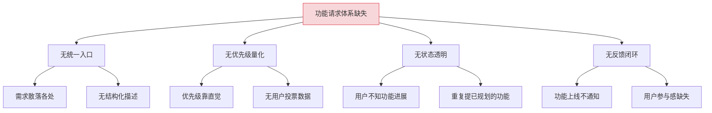
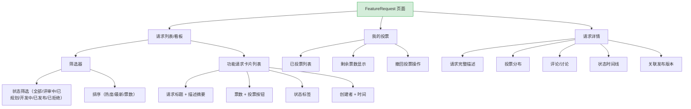
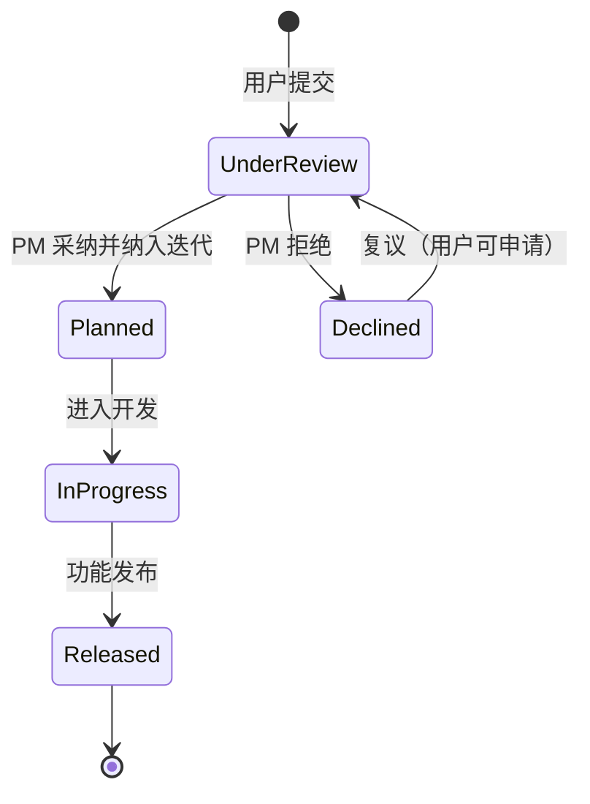

# YV-09-100: 功能请求与投票 — 用户投票、权重体系、功能排名与全生命周期状态追踪

> 需求编号：YV-09-100 · 优先级：P2 · 人天：0.3d · 状态：需求已编写
> 依赖：YV-09-95（迭代规划工具）、YV-09-84（变更日志与发布说明）

## 背景

### 问题陈述

YiVad 作为多项目管理平台，产品功能的优先级判断依赖产品经理的主观经验和少数用户的直接反馈。缺乏系统化的用户需求收集和投票机制，导致：高呼声功能被忽略、小众需求占用资源、功能上线后用户不知情。

1. **功能请求渠道分散**：用户在群聊、私聊、Issue 中提需求，缺乏统一入口
2. **优先级判断主观**：没有量化的用户投票数据支撑优先级排序
3. **投票无限制机制**：如果有投票，无票数限制，少数用户可支配投票结果
4. **功能状态不透明**：用户不知道功能请求是否被采纳、在开发中还是已拒绝
5. **上线无反馈回路**：功能发布后未通知投票用户，反馈回路断裂

**核心矛盾**：用户有表达需求的意愿，但缺少结构化的需求收集和优先级排序工具。

### 影响范围

| # | 影响 | 严重程度 | 典型场景 |
|---|------|----------|----------|
| 1 | 高需求功能被忽略 | 高 | 10 个用户反馈同一需求，但未进入迭代规划 |
| 2 | 资源浪费在低需求功能 | 高 | 仅 1 人需要的功能占了 1 周开发时间 |
| 3 | 用户不知道功能进展 | 中 | 提交了需求后石沉大海 |
| 4 | 少数用户支配优先 | 中 | 1 个用户大量投票扭曲排名 |
| 5 | 反馈回路断裂 | 低 | 功能上线后需求方不知情 |

### 挑战

| 挑战 | 说明 |
|------|------|
| 投票公平性 | 需要防止刷票、平衡不同角色权重 |
| 需求去重 | 多个相似需求需要合并和关联 |
| 状态追踪的及时性 | 功能状态变更需要及时同步给投票用户 |
| 与迭代规划的集成 | 功能请求需要能转化为迭代任务 |

---

## 一、现状分析

### 1.1 当前功能请求现状

```
现有功能:
├── 迭代规划工具（YV-09-95）
│   ├── 迭代创建/管理
│   └── 任务分配
├── 变更日志（YV-09-84）
│   ├── 发布说明
│   └── 版本记录
├── Issue 管理
│   ├── Issue 创建/分配
│   └── 标签分类

缺失:
├── 功能请求看板                   # ❌ 不存在
├── 投票机制                        # ❌ 不存在
├── 功能热度排名                    # ❌ 不存在
├── 功能请求状态追踪                # ❌ 不存在
├── 需求到迭代的转化                # ❌ 不存在
└── 上线反馈通知                    # ❌ 不存在
```

### 1.2 根因分析矩阵



| 根因 | 症状 | 影响 | 优先级 |
|------|------|------|--------|
| 入口分散 | 需求散落各处 | 遗漏高需求 | 高 |
| 优先级主观 | 资源分配失当 | 低效开发 | 高 |
| 状态不透明 | 用户困惑 | 信任下降 | 中 |
| 反馈断裂 | 参与感缺失 | 用户流失 | 中 |

---

## 二、设计决策

### 决策 1：功能请求与 Issue 的关系

| 选项 | 描述 | 优点 | 缺点 |
|------|------|------|------|
| A: 功能请求 = Issue 子类型 | Issue 增加 `issue_type=feature_request` | 复用 Issue 系统 | Issue 模型通用，无投票机制 |
| B: 功能请求独立模块 | 全新 `feature_requests` 集合 | 模型专用 | 增加集合数量 |
| C: 功能请求 = 特殊标签的 Issue | Issue 打 `feature-request` 标签区分 | 最简单 | 无法承载投票逻辑 |

**选择：B（功能请求独立模块）。** 功能请求有独特的属性（投票数、投票分布、角色权重、状态流水线），与通用 Issue 差异大。独立模型避免 Issue 模型膨胀，投票逻辑更清晰。

### 决策 2：投票限制模型

| 选项 | 描述 | 优点 | 缺点 |
|------|------|------|------|
| A: 固定票数 | 每用户 N 票（如 10 票），用完为止 | 简单公平 | 新功能出现时可能已无票 |
| B: 周期性配额 | 每月 N 票，月初重置 | 持续参与 | 月末注册用户票数少 |
| C: 滑动窗口 | 每功能 1 票，总计不限 | 杜绝刷票 | 无法表达强烈需求 |

**选择：A（固定票数）。** 每用户 10 票，支持撤回已投票（票数回收）。用户可对同一功能投 1 票。这与 ProductBoard、Canny 等成熟产品的设计一致。

### 决策 3：投票权重模型

| 选项 | 描述 | 优点 | 缺点 |
|------|------|------|------|
| A: 等权投票 | 所有用户 1 人 1 票 | 最简单 | 管理员意见与普通用户等权 |
| B: 角色加权 | 管理员/PM 票权重 > 普通用户票权重 | 反映真实决策权 | 可能被批评为不民主 |
| C: 活跃度加权 | 根据用户活跃天数计算权重 | 激励活跃用户 | 计算复杂 |

**选择：A（等权投票）。** 功能请求投票的核心目的是收集用户需求的广度，而非深度。管理员的决策权体现在最终是否采纳（status 变更），而非在投票阶段体现。等权投票简单、透明、易解释。

### 决策 4：功能状态与变更日志的关联

| 选项 | 描述 | 优点 | 缺点 |
|------|------|------|------|
| A: 自动关联 | 功能上线后自动从变更日志拉取关联 | 自动化 | 实现复杂 |
| B: 手动关联 | 管理员手动绑定功能请求与发布版本 | 灵活 | 需要人工操作 |
| C: 标签关联 | 通过版本号标签关联 | 简单 | 不精确 |

**选择：B（手动关联）。** 功能请求上线时，管理员手动选择关联的发布版本。关联后自动通知所有投票用户。这确保了关联的准确性。

### 设计决策总览

| 决策 | 选项 A | 选项 B | 选择 | 理由 |
|------|--------|--------|------|------|
| 与 Issue 关系 | Issue 子类型 | 独立模块 | **独立模块** | 投票机制独特 |
| 投票限制 | 固定票数 | 周期性配额 | **固定票数** | 简单公平 |
| 权重模型 | 等权投票 | 角色加权 | **等权投票** | 透明易解释 |
| 变更日志关联 | 自动关联 | 手动关联 | **手动关联** | 准确性优先 |

---

## 三、目标架构

### 3.1 功能请求看板布局



### 3.2 功能请求生命周期



### 3.3 架构决策权衡

| 维度 | 改造前 | 改造后 | 权衡说明 |
|------|--------|--------|----------|
| 需求收集 | 分散（群聊/私聊/Issue） | 统一入口 + 结构化 | 规范化 vs 便利性 |
| 优先级 | 主观判断 | 投票量化 + PM 决策 | 数据驱动 vs 信任直觉 |
| 状态透明 | 用户不知情 | 状态追踪 + 通知 | 透明度 vs 信息噪音 |
| 反馈闭环 | 断裂 | 上线自动通知 | 闭环 vs 实现成本 |

---

## 四、具体改动

### 4.1 改动总览

| 改动点 | 类型 | 涉及文件 | 预估行数 |
|--------|------|---------|---------|
| 功能请求主页面 | 新增 | `views/feedback/FeatureRequest.vue` | 200 行 |
| 请求卡片组件 | 新增 | `components/feature/FRequestCard.vue` | 80 行 |
| 投票按钮组件 | 新增 | `components/feature/VoteButton.vue` | 60 行 |
| 请求详情抽屉 | 新增 | `components/feature/FRequestDetail.vue` | 120 行 |
| 我的投票面板 | 新增 | `components/feature/MyVotes.vue` | 80 行 |
| 请求创建弹窗 | 新增 | `components/feature/FRequestCreate.vue` | 80 行 |
| Feature Service | 新增 | `services/featureService.ts` | 60 行 |
| 类型定义 | 新增 | `types/featureRequest.ts` | 50 行 |
| 路由 + 菜单配置 | 扩展 | `routes.ts`, 菜单数据 | 15 行 |

### 4.2 涉及文件

```
src/
├── views/feedback/
│   └── FeatureRequest.vue              # 新增：功能请求主页面
├── components/feature/
│   ├── FRequestCard.vue                # 新增：请求卡片
│   ├── VoteButton.vue                  # 新增：投票按钮
│   ├── FRequestDetail.vue              # 新增：请求详情抽屉
│   ├── MyVotes.vue                     # 新增：我的投票面板
│   └── FRequestCreate.vue              # 新增：请求创建弹窗
├── services/
│   └── featureService.ts               # 新增：功能请求 API 服务
└── types/
    └── featureRequest.ts               # 新增：功能请求类型定义
```

### 4.3 核心类型定义

```typescript
// types/featureRequest.ts
type FeatureStatus = 'under_review' | 'planned' | 'in_progress' | 'released' | 'declined';
type VoteWeight = 1; // 等权投票：每用户每功能 1 票

interface FeatureRequest {
  key: string;
  project_key: string;
  title: string;
  description: string;
  category: string;
  status: FeatureStatus;
  submitter: string;
  submitted_at: string;
  updated_at: string;
  vote_count: number;
  voters: string[];           // 投票用户 ID 列表
  comments: FeatureComment[];
  status_history: StatusChange[];
  linked_release: string | null;  // 关联发布版本
}

interface FeatureComment {
  id: string;
  user: string;
  content: string;
  created_at: string;
}

interface StatusChange {
  from: FeatureStatus | null;
  to: FeatureStatus;
  changed_by: string;
  changed_at: string;
  reason: string;
}

interface UserVoteInfo {
  user_id: string;
  total_votes: number;        // 总票数配额（默认 10）
  used_votes: number;         // 已使用票数
  voted_requests: string[];   // 已投票的请求 ID 列表
}

interface FeatureRanking {
  key: string;
  title: string;
  status: FeatureStatus;
  vote_count: number;
  rank: number;
  trend: 'up' | 'down' | 'stable';  // 排名趋势
}
```

### 4.4 关键交互逻辑

```typescript
// 投票逻辑
async function vote(featureKey: string, userId: string): Promise<VoteResult> {
  const userInfo = await getUserVoteInfo(userId);

  // 检查是否已投票
  if (userInfo.voted_requests.includes(featureKey)) {
    return { success: false, message: '已投票此功能' };
  }

  // 检查剩余票数
  if (userInfo.used_votes >= userInfo.total_votes) {
    return { success: false, message: '票数已用完，请先撤回其他投票' };
  }

  // 执行投票
  await api.vote(featureKey, userId);
  return { success: true };
}

// 撤回投票
async function unvote(featureKey: string, userId: string): Promise<void> {
  // 不能撤回已发布/已拒绝功能的投票
  const feature = await api.getFeature(featureKey);
  if (feature.status === 'released' || feature.status === 'declined') {
    throw new Error('已发布或已拒绝的功能不能撤回投票');
  }
  await api.unvote(featureKey, userId);
}

// 功能热度排名排序
function rankFeatures(features: FeatureRequest[]): FeatureRanking[] {
  return features
    .sort((a, b) => b.vote_count - a.vote_count)
    .map((f, i) => ({
      key: f.key,
      title: f.title,
      status: f.status,
      vote_count: f.vote_count,
      rank: i + 1,
      trend: calculateTrend(f.key),
    }));
}

// 状态变更通知
function onStatusChange(request: FeatureRequest, newStatus: FeatureStatus): void {
  if (newStatus === 'released') {
    // 通知所有投票用户功能已上线
    request.voters.forEach(userId => {
      notifyUser(userId, `你投票的功能「${request.title}」已上线`);
    });
  } else if (newStatus === 'declined') {
    // 通知投票用户功能被拒绝及原因
    request.voters.forEach(userId => {
      notifyUser(userId, `你投票的功能「${request.title}」未被采纳`);
    });
  }
}
```

---

## 五、实施步骤

| 步骤 | 内容 | 涉及文件 | 验证方式 | 人天 |
|------|------|---------|---------|------|
| 1 | 类型定义 + Feature Service | `types/featureRequest.ts`, `services/featureService.ts` | 类型检查通过 | 0.04 |
| 2 | 投票按钮组件 | `VoteButton.vue` | 投票/撤票交互正常 | 0.03 |
| 3 | 请求卡片组件 | `FRequestCard.vue` | 卡片渲染 + 投票状态 | 0.04 |
| 4 | 请求创建弹窗 | `FRequestCreate.vue` | 表单验证 + 创建成功 | 0.04 |
| 5 | 请求详情抽屉 | `FRequestDetail.vue` | 详情展示 + 状态时间线 | 0.05 |
| 6 | 我的投票面板 | `MyVotes.vue` | 已投票列表 + 剩余票数 | 0.04 |
| 7 | 功能请求主页面 | `FeatureRequest.vue` | 排名列表 + 筛选排序 | 0.05 |
| 8 | 路由 + 菜单配置 | `routes.ts`, 菜单 | 页面可访问 | 0.01 |

**总计：0.3d**

---

## 六、测试规格

### 组件测试：VoteButton

#### Scenario: 未投票时显示投票按钮
- **GIVEN** 用户未对该功能投票，且还有剩余票数
- **WHEN** 渲染 VoteButton
- **THEN** 显示空心投票图标、文字"投票"、按钮可点击

#### Scenario: 已投票时显示已投票状态
- **GIVEN** 用户已对该功能投票
- **WHEN** 渲染 VoteButton
- **THEN** 显示实心投票图标、文字"已投票"、悬停显示"点击撤回"

### 组件测试：FRequestCard

#### Scenario: 高票数功能卡片
- **GIVEN** 功能请求 vote_count=25，status=under_review
- **WHEN** 渲染 FRequestCard
- **THEN** 显示"25 票"、橙色"评审中"标签、投票按钮

#### Scenario: 已发布功能卡片
- **GIVEN** 功能请求 status=released，linked_release="v1.2.0"
- **WHEN** 渲染 FRequestCard
- **THEN** 显示绿色"已发布"标签、关联版本号、投票按钮禁用（不可撤回）

### 组件测试：MyVotes

#### Scenario: 用户的投票列表
- **GIVEN** 用户已投票 3 个功能，还剩 7 票
- **WHEN** 渲染 MyVotes
- **THEN** 显示"3/10 票已使用"，列出 3 个已投票功能，每个可撤回

#### Scenario: 票数用完
- **GIVEN** 用户已投票 10 个功能，剩余 0 票
- **WHEN** 渲染 MyVotes
- **THEN** 显示"10/10 票已用完"，提示"请先撤回其他投票"

### 集成测试：FeatureRequest

#### Scenario: 功能请求完整流程
- **GIVEN** 用户提交功能请求"支持深色模式"
- **WHEN** PM 审核通过（status→planned），开发者完成开发（status→in_progress），发布上线（status→released）
- **THEN** 状态时间线完整记录 4 次变更，所有投票用户收到上线通知

#### Scenario: 热度排名变化
- **GIVEN** 10 个功能请求按票数排名
- **WHEN** 用户给排名第 8 的功能投票
- **THEN** 排名实时更新，该功能可能上升到第 7 位（如果票数超过前一名）

---

## 七、风险与缓解

| 风险 | 概率 | 影响 | 等级 | 缓解措施 | 应急预案 |
|------|------|------|------|----------|----------|
| 刷票行为 | 中 | 中 | 中 | 每功能每用户 1 票，总量 10 票限制 | 管理员可屏蔽用户投票权 |
| 恶意提交垃圾请求 | 低 | 中 | 低 | 提交需通过内容审核 | 管理员可删除垃圾请求 |
| 票数用完但新需求出现 | 中 | 低 | 低 | 支持撤回旧票投新需求 | 管理员可根据反馈调整总票数 |
| 高票功能实际不可行 | 中 | 中 | 中 | PM 最终决策权，declined 时需填写原因 | 定期评审高票需求可行性 |

---

## 八、回滚策略

| 回滚场景 | 回滚方式 | 影响范围 | 恢复时间 |
|----------|----------|----------|----------|
| 功能请求页面异常 | `git revert` 相关提交 | 功能请求页面 | < 1min |
| 投票数据异常 | 从备份恢复投票数据 | 投票记录 | < 5min |
| 通知误发 | 停止通知任务 + 回滚后端 | 用户通知 | < 5min |

**回滚验证：**
- 回滚后迭代规划工具（YV-09-95）不受影响
- 回滚后变更日志（YV-09-84）不受影响
- 回滚后已创建的请求数据保留

---

## 九、设计决策记录

### D-01: 为什么使用固定票数而非无限投票？

无限投票会导致少数活跃用户支配所有功能请求的排名。固定票数（10 票/人）强制用户选择他们认为最重要的功能。这与 ProductBoard、Canny 等产品的设计一致。10 票是经验值，足够用户支持多个功能但又不至于滥用。

### D-02: 为什么等权投票而非角色加权？

功能请求投票的目的是了解用户需求的广度（多少人需要这个功能），而非深度（需要这个功能的人多么重要）。管理员的决策权体现在采纳/拒绝环节，而非投票环节。等权投票结果更透明、更容易向用户解释。

### D-03: 为什么已发布/已拒绝的功能不允许撤回投票？

投票一旦产生了实际效果（功能已发布或已拒绝），撤回投票会破坏历史数据的完整性。如果允许撤回，已发布功能的票数可能变为 0，显得功能无人需要——这与事实不符。锁定已终结状态的投票是业界的标准做法。

### D-04: 为什么功能请求上线后需要通知投票用户？

通知投票用户功能已上线，有两个目的：一是完成反馈闭环（用户知道自己的投票产生了效果），二是激励用户后续继续参与功能请求。没有反馈闭环的投票系统会逐渐失去用户参与。

---

## 十、可观测性

### 关键指标

| 指标 | 采集方式 | 告警阈值 | 说明 |
|------|---------|---------|------|
| 功能请求提交数 | 统计 create 事件 | 月 < 5 | 用户参与度低 |
| 投票参与率 | voted_users / total_users | < 20% | 投票功能使用率低 |
| 请求采纳率 | released / total | < 30% | PM 采纳比例 |
| 请求转化周期 | released_at - submitted_at | > 90 天 | 功能交付周期过长 |
| 票数使用率 | avg(used_votes / total_votes) | < 30% | 用户不熟悉投票功能 |

### 日志规范

| 日志级别 | 场景 | 示例 |
|---------|------|------|
| `INFO` | 功能请求创建 | `[FeatureReq] Created: ${key} by ${user}` |
| `INFO` | 投票操作 | `[FeatureReq] Vote: ${key} by ${user}` |
| `WARN` | 状态变更 | `[FeatureReq] Status: ${key} ${from} → ${to}` |

---

## 十一、代码审查检查清单

- [ ] VoteButton 正确显示投票/已投票/票数用完三种状态
- [ ] FRequestCard 对 5 种状态使用不同的颜色标签
- [ ] FRequestDetail 状态时间线正确显示每次变更
- [ ] FRequestCreate 表单验证完整（标题必填、分类必选）
- [ ] MyVotes 剩余票数计算正确
- [ ] `vue-tsc --noEmit` 通过
- [ ] 无 ESLint/Prettier 告警

---

## 回归问题预测

| # | 问题 | 发现场景 | 根因 | 修复方式 |
|---|------|---------|------|---------|
| 1 | 投票计数与实际投票人不一致 | vote_count=5 但 voters 数组只有 4 人 | 并发投票时计数未使用原子操作 | 后端使用 MongoDB $inc 原子更新 vote_count |
| 2 | 撤回投票后功能排名未实时更新 | 撤回后排名仍是旧排名 | 前端撤销投票后未重新排序 | 撤回投票后重新计算并更新排名 |
| 3 | 已删除的功能请求仍出现在我的投票列表 | 管理员删除某请求后用户仍有投票记录 | 删除操作未清理关联投票数据 | 删除请求时级联清理 voters 中的记录并返还票数 |
| 4 | 功能请求描述过长导致卡片溢出 | 描述超过 500 字时卡片布局错位 | 未做文本截断 | 卡片描述最多显示 2 行，超出显示省略号 + "展开"按钮 |
| 5 | 状态变更通知发送给已离职用户 | 离职用户仍收到功能上线通知 | 未校验用户在职状态 | 发送通知前过滤已离职用户 |
| 6 | 同一用户重复提交相同标题的功能请求 | 用户提交了与已有请求标题 90% 相似的内容 | 未做相似度检测 | 提交时搜索相似标题，提示用户确认是否已有相同请求 |

---

## 性能分析

### 组件渲染性能

| 指标 | 无功能请求 | 功能请求页面 | 说明 |
|------|----------|------------|------|
| FeatureRequest 首屏渲染 | — | ~250ms（50 个请求卡片） | 新增页面 |
| FRequestCard 单卡片渲染 | — | ~5ms | 轻量组件 |
| 排名重新计算 | — | ~10ms（100 条排序） | JS sort |

### 内存分析

| 数据结构 | 大小 | 说明 |
|---------|------|------|
| 功能请求列表（50 条） | ~30KB | 含投票数据 |
| 用户投票信息 | ~2KB | 10 票使用记录 |
| 状态时间线（10 条变更） | ~3KB | 含操作人和原因 |

### 网络请求分析

| 页面 | 首次加载 API 调用数 | 关键路径请求 | 可并行请求 |
|------|-------------------|-------------|-----------|
| FeatureRequest | 3（getFeatureRequests + getUserVotes + getRanking） | getUserVotes 依赖登录状态 | getFeatureRequests 和 getRanking 可并行 |

---

*PRD 来源: `projects/yivad/requirements/2026-09/00-需求-需求总览.md`*

