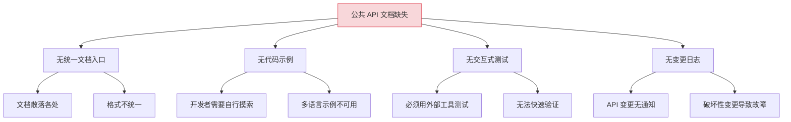
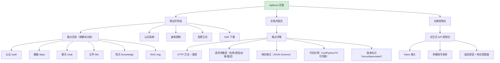
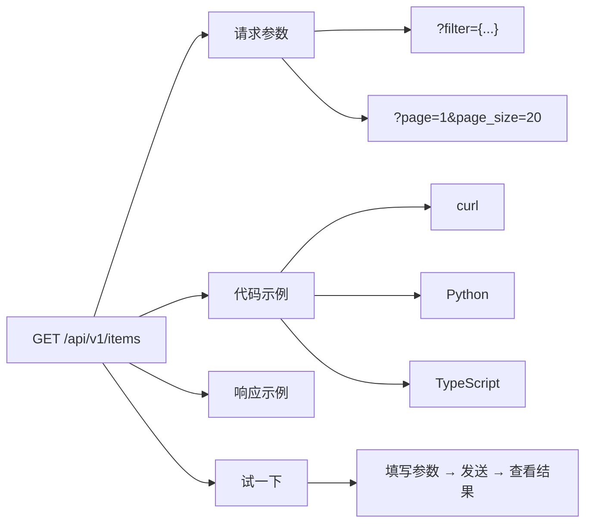

# YV-09-101: 公共 API 文档 — 端点目录、认证指南、代码示例与交互式控制台

> 需求编号：YV-09-101 · 优先级：P2 · 人天：0.3d · 状态：需求已编写
> 依赖：YV-09-60（API 令牌管理）、YV-09-48（API 调试控制台）

## 背景

### 问题陈述

YiVad 管理后台集成了多个项目的 API。外部开发者和内部团队需要调用这些 API 进行集成开发。当前 API 文档以内部 Confluence/飞书文档形式存在，格式不统一、示例缺失、无交互式测试能力。开发者接入新 API 平均需要花费 2-3 小时阅读分散的文档和试错。

1. **文档分散且不统一**：API 文档散落在多个平台，格式各异
2. **代码示例缺失**：大部分端点只有参数说明，无 curl/Python/TypeScript 示例
3. **无交互式测试**：开发者必须用 Postman/cURL 手动构造请求才能测试
4. **认证流程不清晰**：Token 申请、刷新、权限范围散落在不同文档
5. **版本变更无记录**：API 变更后文档未同步更新，开发者踩坑
6. **无 SDK 引导**：没有提供官方 SDK 或推荐第三方 SDK 的链接

**核心矛盾**：API 有调用价值，但文档体验差导致接入成本高、开发者流失。

### 影响范围

| # | 影响 | 严重程度 | 典型场景 |
|---|------|----------|----------|
| 1 | 接入成本高 | 高 | 新开发者花 3 小时找到正确的 API |
| 2 | 文档与实现不一致 | 高 | API 已更新但文档未同步 |
| 3 | 认证流程难理解 | 中 | Token 申请步骤分散在多处 |
| 4 | 无示例导致试错 | 中 | 开发者反复尝试调用失败 |
| 5 | API 变更无通知 | 低 | 破坏性变更后客户端报错 |

### 挑战

| 挑战 | 说明 |
|------|------|
| 文档维护成本 | 手工维护 API 文档容易与实现脱节 |
| 交互式控制台的安全性 | 需要 Token 验证，防止未授权调用 |
| 多语言示例生成 | curl/Python/TypeScript 三种示例需要保持同步 |
| 文档版本与 API 版本对齐 | 文档需要反映特定版本的 API |

---

## 一、现状分析

### 1.1 当前 API 文档现状

```
现有功能:
├── API 调试控制台（YV-09-48）
│   ├── RPC 信封调用
│   └── 请求/响应查看
├── API 令牌管理（YV-09-60）
│   ├── Token 创建/撤销
│   └── 权限范围管理

缺失:
├── 公共 API 文档页面               # ❌ 不存在
├── 端点目录（按模块组织）           # ❌ 不存在
├── 代码示例（curl/Python/TS）      # ❌ 不存在
├── 交互式 API 控制台（可执行）      # ❌ YV-09-48 仅内部调试
├── API 变更日志                     # ❌ 不存在
├── SDK 链接/下载                    # ❌ 不存在
└── 速率限制说明                     # ❌ 不存在
```

### 1.2 根因分析矩阵



| 根因 | 症状 | 影响 | 优先级 |
|------|------|------|--------|
| 无统一入口 | 文档分散 | 查找困难 | 高 |
| 无代码示例 | 试错成本高 | 接入慢 | 高 |
| 无交互测试 | 需外部工具 | 效率低 | 中 |
| 无变更日志 | 变更不透明 | 故障风险 | 中 |

---

## 二、设计决策

### 决策 1：文档内容的来源

| 选项 | 描述 | 优点 | 缺点 |
|------|------|------|------|
| A: 手工维护 | 开发者在管理后台手动编辑 | 完全可控 | 易过时 |
| B: 代码生成 | 从代码注释/装饰器自动生成 | 实时同步 | 需要统一注释规范 |
| C: 混合模式 | API 元数据从代码生成，描述和示例手工补充 | 兼顾同步与丰富 | 开发成本中等 |

**选择：C（混合模式）。** API 元数据（端点路径、参数名、类型、必填项）从后端代码自动获取，人工补充描述文本、代码示例和注意事项。这保证了基础信息不脱节，同时允许丰富的文档内容。

### 决策 2：交互式控制台的实现方式

| 选项 | 描述 | 优点 | 缺点 |
|------|------|------|------|
| A: 嵌入式 Web 控制台 | 页面内嵌代码编辑器和执行器 | 无缝体验 | 开发量大 |
| B: 生成 curl 命令 + 一键复制 | 生成 curl 命令，用户终端执行 | 开发量小 | 用户需有终端 |
| C: 完整浏览器内执行 | 控制台在浏览器内向 API 发请求 | 真正交互式 | CORS 问题 |

**选择：C（完整浏览器内执行）。** 复用 YiVad 已有的 `RequestHttp` 基础设施，在浏览器内直接调用 API 并展示结果。配置 CORS 头支持（如果目标 API 与 YiVad 同域则无 CORS 问题，跨域需后端配置）。

### 决策 3：代码示例的语言覆盖

| 选项 | 描述 | 优点 | 缺点 |
|------|------|------|------|
| A: 仅 curl | 只提供 curl 示例 | 最简单 | 非开发者不友好 |
| B: curl + Python + TypeScript | 三种语言示例 | 覆盖主要场景 | 维护 3 份示例 |
| C: curl + Python + TS + Go + Java | 5 种语言 | 覆盖面广 | 维护成本高 |

**选择：B（curl + Python + TypeScript）。** curl 覆盖命令行用户，Python 覆盖后端开发者，TypeScript 覆盖前端开发者。这三种语言覆盖了 YiVad API 的 95% 使用场景。Go 和 Java 示例可以后续按需添加。

### 决策 4：API 文档的版本管理

| 选项 | 描述 | 优点 | 缺点 |
|------|------|------|------|
| A: 单一最新版 | 只展示最新版本的 API | 简单 | 老用户不兼容 |
| B: 多版本共存 | 每个 API 版本独立文档 | 完整 | 维护量大 |
| C: 版本标记 + 废弃提示 | 最新版为主，标注版本变更 | 平衡 | 部分细节丢失 |

**选择：C（版本标记 + 废弃提示）。** 文档以最新版本为主，端点标注 `since v1.2`（新增）或 `deprecated since v2.0`（废弃）。页面底部提供历史版本链接。

### 设计决策总览

| 决策 | 选项 A | 选项 B | 选择 | 理由 |
|------|--------|--------|------|------|
| 内容来源 | 手工维护 | 代码生成 | **混合模式** | 同步 + 丰富 |
| 控制台实现 | 嵌入式 Web | 浏览器内执行 | **浏览器内执行** | 真正交互式 |
| 语言覆盖 | 仅 curl | curl+Python+TS | **三语言** | 覆盖 95% 场景 |
| 版本管理 | 单版本 | 多版本 | **版本标记** | 平衡成本和完整 |

---

## 三、目标架构

### 3.1 API 文档页面布局



### 3.2 端点详情布局示意



### 3.3 架构决策权衡

| 维度 | 改造前 | 改造后 | 权衡说明 |
|------|--------|--------|----------|
| 文档入口 | 无（散落各处） | 统一 API 文档页 | 集中 vs 分散 |
| 代码示例 | 无 | 三语言标签切换 | 覆盖 vs 维护成本 |
| 交互测试 | 外部工具 | 内嵌控制台 | 便利 vs 开发量 |
| 版本标记 | 无 | since/deprecated | 透明 vs 复杂度 |

---

## 四、具体改动

### 4.1 改动总览

| 改动点 | 类型 | 涉及文件 | 预估行数 |
|--------|------|---------|---------|
| API 文档主页面 | 新增 | `views/api/ApiDocs.vue` | 200 行 |
| 端点详情组件 | 新增 | `components/api/EndpointDetail.vue` | 150 行 |
| 代码示例切换组件 | 新增 | `components/api/CodeSamples.vue` | 80 行 |
| 交互式控制台组件 | 新增 | `components/api/ApiConsole.vue` | 120 行 |
| 侧边栏导航组件 | 新增 | `components/api/ApiSidebar.vue` | 80 行 |
| 变更日志组件 | 新增 | `components/api/ApiChangelog.vue` | 80 行 |
| API Docs Service | 新增 | `services/apiDocsService.ts` | 50 行 |
| 类型定义 | 新增 | `types/apiDocs.ts` | 50 行 |
| 路由 + 菜单配置 | 扩展 | `routes.ts`, 菜单数据 | 15 行 |

### 4.2 涉及文件

```
src/
├── views/api/
│   └── ApiDocs.vue                     # 新增：API 文档主页面
├── components/api/
│   ├── EndpointDetail.vue              # 新增：端点详情
│   ├── CodeSamples.vue                 # 新增：代码示例切换
│   ├── ApiConsole.vue                  # 新增：交互式控制台
│   ├── ApiSidebar.vue                  # 新增：侧边栏导航
│   └── ApiChangelog.vue                # 新增：变更日志
├── services/
│   └── apiDocsService.ts               # 新增：API 文档服务
└── types/
    └── apiDocs.ts                      # 新增：API 文档类型定义
```

### 4.3 核心类型定义

```typescript
// types/apiDocs.ts
type HttpMethod = 'GET' | 'POST' | 'PUT' | 'DELETE' | 'PATCH';
type ApiModule = 'auth' | 'data' | 'chat' | 'file' | 'knowledge' | 'rag';
type ParamLocation = 'query' | 'body' | 'path' | 'header';

interface ApiEndpoint {
  id: string;
  module: ApiModule;
  method: HttpMethod;
  path: string;
  summary: string;
  description: string;
  version_since: string;
  deprecated_since?: string;
  parameters: ApiParameter[];
  request_body?: ApiRequestBody;
  responses: ApiResponse[];
  code_examples: CodeExample[];
  rate_limit?: RateLimitInfo;
}

interface ApiParameter {
  name: string;
  location: ParamLocation;
  type: string;
  required: boolean;
  description: string;
  default?: string;
  example?: string;
}

interface ApiRequestBody {
  content_type: string;
  schema: Record<string, unknown>;
  example: Record<string, unknown>;
}

interface ApiResponse {
  status_code: number;
  description: string;
  schema: Record<string, unknown>;
  example: Record<string, unknown>;
}

interface CodeExample {
  language: 'curl' | 'python' | 'typescript';
  code: string;
  description: string;
}

interface RateLimitInfo {
  requests_per_minute: number;
  requests_per_hour: number;
  burst_limit: number;
}

interface ApiChangelogEntry {
  version: string;
  date: string;
  changes: {
    type: 'added' | 'changed' | 'deprecated' | 'removed' | 'fixed';
    endpoint: string;
    description: string;
    migration_guide?: string;
  }[];
}

interface AuthGuide {
  token_endpoint: string;
  auth_type: 'X-Token' | 'Bearer' | 'OAuth2';
  how_to_get_token: string;
  token_lifetime: string;
  scopes: { name: string; description: string }[];
}
```

### 4.4 关键交互逻辑

```typescript
// 代码示例填充
const CODE_TEMPLATES: Record<string, (endpoint: ApiEndpoint, token: string) => string> = {
  curl: (ep, token) => {
    const params = ep.parameters
      .filter(p => p.location === 'query' && p.required)
      .map(p => `${p.name}=${p.example || 'VALUE'}`)
      .join('&');
    const body = ep.method !== 'GET' && ep.request_body
      ? ` -d '${JSON.stringify(ep.request_body.example)}'`
      : '';
    return `curl -X ${ep.method} "${API_BASE}${ep.path}${params ? '?' + params : ''}" \\
  -H "Content-Type: application/json" \\
  -H "X-Token: ${token || 'YOUR_TOKEN'}"${body}`;
  },

  python: (ep, token) => {
    const paramsStr = ep.parameters
      .filter(p => p.location === 'query' && p.required)
      .map(p => `    "${p.name}": "${p.example || 'value'}",`)
      .join('\n');
    return `import requests

headers = {
    "Content-Type": "application/json",
    "X-Token": "${token || 'YOUR_TOKEN'}",
}
params = {
${paramsStr}
}
response = requests.${ep.method.toLowerCase()}(
    "${API_BASE}${ep.path}",
    headers=headers,
    params=params,
)
print(response.json())`;
  },

  typescript: (ep, token) => {
    return `import { RequestHttp } from '@/services/RequestHttp';

const http = new RequestHttp();
const response = await http.${ep.method.toLowerCase()}('${ep.path}', {
  params: {
    // 请求参数
  },
  headers: {
    'X-Token': '${token || 'YOUR_TOKEN'}',
  },
});
console.log(response.data);`;
  },
};

// 交互式控制台发送请求
async function executeApiCall(
  endpoint: ApiEndpoint,
  params: Record<string, string>,
  token: string,
): Promise<ApiCallResult> {
  const startTime = Date.now();
  try {
    const url = buildUrl(endpoint.path, params);
    const response = await fetch(url, {
      method: endpoint.method,
      headers: {
        'Content-Type': 'application/json',
        'X-Token': token,
      },
      ...(endpoint.method !== 'GET' && { body: JSON.stringify(params) }),
    });
    const data = await response.json();
    return {
      status: response.status,
      duration_ms: Date.now() - startTime,
      headers: Object.fromEntries(response.headers.entries()),
      body: data,
    };
  } catch (error) {
    return {
      status: 0,
      duration_ms: Date.now() - startTime,
      headers: {},
      body: { error: String(error) },
    };
  }
}
```

---

## 五、实施步骤

| 步骤 | 内容 | 涉及文件 | 验证方式 | 人天 |
|------|------|---------|---------|------|
| 1 | 类型定义 + API Docs Service | `types/apiDocs.ts`, `services/apiDocsService.ts` | 类型检查通过 | 0.04 |
| 2 | 代码示例切换组件 | `CodeSamples.vue` | 三种语言切换正确 | 0.04 |
| 3 | 侧边栏导航组件 | `ApiSidebar.vue` | 模块分组 + 搜索正确 | 0.04 |
| 4 | 端点详情组件 | `EndpointDetail.vue` | 参数表/响应/示例渲染 | 0.06 |
| 5 | 交互式控制台组件 | `ApiConsole.vue` | 参数填写 + 发送 + 结果 | 0.05 |
| 6 | 变更日志组件 | `ApiChangelog.vue` | 版本列表 + 变更详情 | 0.03 |
| 7 | API 文档主页面 | `ApiDocs.vue` | 三栏布局 + 路由联动 | 0.03 |
| 8 | 路由 + 菜单配置 | `routes.ts`, 菜单 | 页面可访问 | 0.01 |

**总计：0.3d**

---

## 六、测试规格

### 组件测试：CodeSamples

#### Scenario: curl 示例渲染
- **GIVEN** 端点 `GET /api/v1/items` 有 2 个必需查询参数
- **WHEN** 切换到 curl 标签
- **THEN** 显示完整 curl 命令，包含参数、Header、URL

#### Scenario: Python 示例渲染
- **GIVEN** 端点 `POST /api/v1/items` 有请求体
- **WHEN** 切换到 Python 标签
- **THEN** 显示 `requests.post()` 代码，包含 headers、body

### 组件测试：EndpointDetail

#### Scenario: 端点详情完整渲染
- **GIVEN** 端点有 3 个参数（2 个 query + 1 个 body）、2 个响应（200 + 400）
- **WHEN** 渲染 EndpointDetail
- **THEN** 显示请求参数表（3 行）、响应示例（2 个 tab）、代码示例

#### Scenario: 废弃端点标记
- **GIVEN** 端点 `deprecated_since=v2.0`，替代端点为 `/api/v2/items`
- **WHEN** 渲染 EndpointDetail
- **THEN** 显示黄色"已废弃"标签、替代端点链接

### 组件测试：ApiConsole

#### Scenario: 控制台发送请求并显示结果
- **GIVEN** 用户填写 Token 和参数，点击"发送"
- **WHEN** API 返回 200 + JSON 数据
- **THEN** 显示状态码 200（绿色）、响应时间、格式化的 JSON

#### Scenario: 控制台错误响应
- **GIVEN** 用户填写了错误的参数
- **WHEN** API 返回 400 + error 信息
- **THEN** 显示状态码 400（红色）、错误消息

### 集成测试：ApiDocs

#### Scenario: 浏览端点目录并查看详情
- **GIVEN** 侧边栏显示 5 个模块
- **WHEN** 点击"数据 /data"模块 → 点击"查询文档"
- **THEN** 主内容区显示 `GET /api/v1/documents` 的完整文档

#### Scenario: 搜索端点
- **GIVEN** API 文档有 30 个端点
- **WHEN** 在侧边栏搜索框输入"query"
- **THEN** 过滤显示包含"query"的端点（如 query_documents）

---

## 七、风险与缓解

| 风险 | 概率 | 影响 | 等级 | 缓解措施 | 应急预案 |
|------|------|------|------|----------|----------|
| 文档与代码实现脱节 | 高 | 高 | 高 | 混合模式：元数据自动同步 | 定期审计 API 文档与代码的一致性 |
| 交互式控制台 CORS 问题 | 中 | 中 | 中 | 同域部署优先，跨域配置 CORS 头 | 引导用户使用 curl 复制 |
| Token 在控制台泄露 | 低 | 高 | 中 | Token 仅在浏览器内存中，不持久化 | Token 设置过期时间 |
| API 变更未及时更新文档 | 中 | 中 | 中 | 版本标记 + 变更日志页面 | CI 挂钩检查文档过期 |

---

## 八、回滚策略

| 回滚场景 | 回滚方式 | 影响范围 | 恢复时间 |
|----------|----------|----------|----------|
| API 文档页面异常 | `git revert` 相关提交 | API 文档页面 | < 1min |
| 控制台请求异常 | 临时禁用控制台组件 | API 交互式测试 | < 2min |
| 文档数据异常 | 从备份恢复文档数据 | API 文档内容 | < 5min |

**回滚验证：**
- 回滚后 API 令牌管理（YV-09-60）不受影响
- 回滚后 API 调试控制台（YV-09-48）不受影响
- 回滚后其他页面不受影响

---

## 九、设计决策记录

### D-01: 为什么选择混合模式（代码生成 + 人工补充）？

纯手工维护的文档必然过时。纯代码生成的文档缺乏业务描述和最佳实践。混合模式从代码中自动提取结构信息（参数名、类型、必填），人工补充描述文本和代码示例。这是 Stripe API 文档和 GitHub API 文档的通用做法。

### D-02: 为什么交互式控制台使用浏览器内执行而非 Postman 式工具？

浏览器内执行无需安装外部工具，开发者打开页面即可测试。且可以利用 YiVad 已有的 RequestHttp 拦截器（自动附加 Token、统一错误处理），提供和实际集成一致的体验。

### D-03: 为什么只有三种语言示例（curl/Python/TypeScript）？

这三种语言覆盖了 YiVad API 的主要使用场景：运维通过 curl 调试、后端通过 Python SDK 集成、前端通过 TypeScript 调用。Go 和 Java 示例可以在后续版本中添加，不需要在第一个版本中追求大而全。

### D-04: 为什么使用版本标记（since/deprecated）而非多版本独立页面？

多版本独立页面维护成本随版本数线性增长。版本标记在单一页面中标注变更信息，开发者和维护成本都更低。历史版本信息在变更日志中保留。

---

## 十、可观测性

### 关键指标

| 指标 | 采集方式 | 告警阈值 | 说明 |
|------|---------|---------|------|
| 文档页面 PV | 页面浏览统计 | 月 < 100 | 文档使用率低 |
| 控制台执行次数 | API 调用统计 | 周 < 10 | 控制台未被使用 |
| 示例复制次数 | 点击事件 | - | 了解最常用语言 |
| 文档搜索热门词 | 搜索日志 | - | 了解用户关注点 |
| 废弃端点调用量 | 按 deprecated 标记统计 | > 总调用 10% | 用户未迁移到新端点 |

### 日志规范

| 日志级别 | 场景 | 示例 |
|---------|------|------|
| `INFO` | 页面访问 | `[ApiDocs] Page view: module=${module}` |
| `INFO` | 控制台执行 | `[ApiDocs] Console call: ${method} ${path}` |
| `WARN` | 废弃端点调用 | `[ApiDocs] Deprecated endpoint called: ${path}` |

---

## 十一、代码审查检查清单

- [ ] EndpointDetail 正确处理 method 颜色（GET=绿色, POST=蓝色, DELETE=红色）
- [ ] CodeSamples 三语言切换时不需要重新加载
- [ ] ApiConsole 响应 JSON 使用语法高亮
- [ ] ApiSidebar 搜索功能支持中文和英文
- [ ] 废弃端点使用黄色警告标签
- [ ] `vue-tsc --noEmit` 通过
- [ ] 无 ESLint/Prettier 告警

---

## 回归问题预测

| # | 问题 | 发现场景 | 根因 | 修复方式 |
|---|------|---------|------|---------|
| 1 | 代码示例中的 Token 占位符未替换导致开发者报错 | 用户复制 curl 示例后直接执行 | 示例中使用 `YOUR_TOKEN` 占位符 | 控制台已填写 Token 时，动态替换示例中的 Token 为实际值 |
| 2 | 端点详情页路由为 /api-docs 与同域 API 路径冲突 | 访问 /api-docs 时被后端拦截 | 前端路由与后端 API 路径冲突 | 使用 `/docs/api` 作为文档路径，避免与 `/api/` 前缀冲突 |
| 3 | 交互式控制台跨域请求被浏览器拦截 | 在外部设备上访问 YiVad 时调用 API | CORS 配置缺失 | 后端添加 CORS 中间件，允许 YiVad 域名的请求 |
| 4 | 不含请求体的 GET 端点显示了空请求体示例 | 查看 GET 端点时显示了 `-d '{}'` | 示例生成逻辑未区分 HTTP 方法 | GET 请求不生成 -d 参数 |
| 5 | 废弃端点标记中替代链接为 404 | 点击替代端点链接跳转到不存在的端点 | 替代端点已被删除但标记未更新 | 废弃端点标记中的替代链接需要验证端点是否存在 |
| 6 | 控制台发送超时请求后无反馈 | 大文件下载端点 30 秒无响应 | 无超时处理 | 控制台添加 15 秒超时限制和加载动画 |

---

## 性能分析

### 组件渲染性能

| 指标 | 无 API 文档 | API 文档页面 | 说明 |
|------|----------|------------|------|
| ApiDocs 首屏渲染 | — | ~300ms（三栏布局 + 端点列表） | 新增页面 |
| EndpointDetail 渲染 | — | ~80ms（参数表 + 代码示例） | 单端点详情 |
| ApiConsole 首次加载 | — | ~50ms | 控制台初始化 |

### 内存分析

| 数据结构 | 大小 | 说明 |
|---------|------|------|
| 端点目录（50 个端点） | ~100KB | 含完整文档 |
| 代码示例缓存 | ~30KB | 三语言预生成 |
| 变更日志 | ~20KB | 版本历史 |

### 网络请求分析

| 页面 | 首次加载 API 调用数 | 关键路径请求 | 可并行请求 |
|------|-------------------|-------------|-----------|
| ApiDocs | 2（getEndpoints + getChangelog） | 无依赖 | 可并行 |
| 控制台执行 | 1（实际 API 调用） | 依赖用户填写参数 | - |

---

*PRD 来源: `projects/yivad/requirements/2026-09/00-需求-需求总览.md`*

