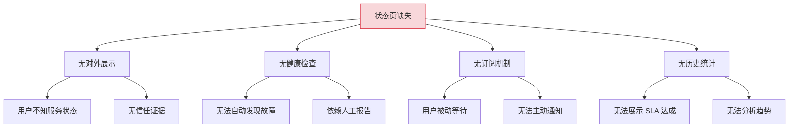
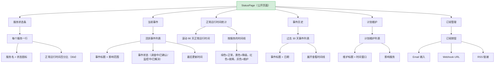
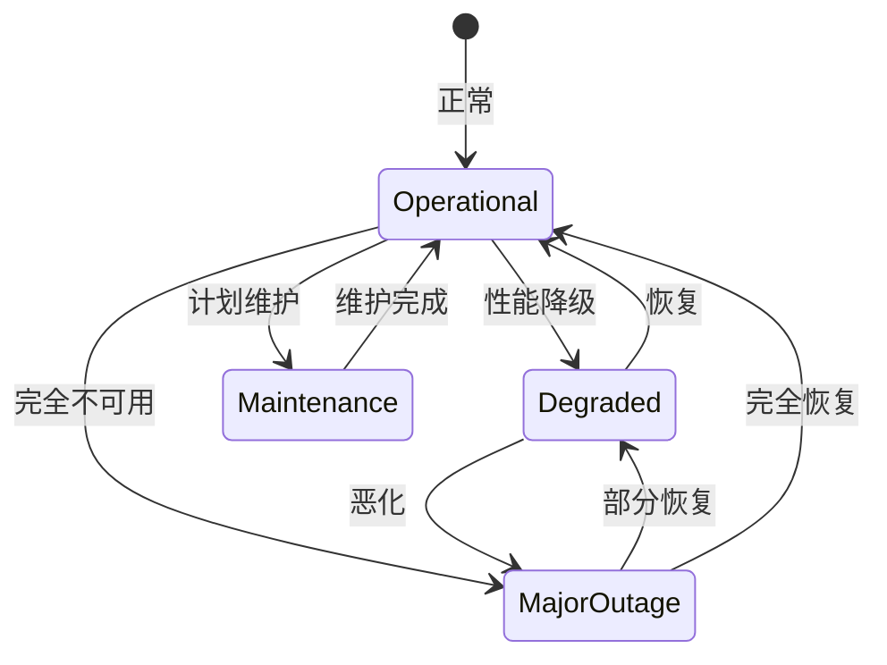

# YV-09-102: 状态页面 — 服务健康指标、事件历史、维护公告与订阅通知

> 需求编号：YV-09-102 · 优先级：P2 · 人天：0.3d · 状态：需求已编写
> 依赖：YV-09-98（事件管理与值班）、YV-09-64（SLA 追踪与违约告警）

## 背景

### 问题陈述

YiVad 管理多个服务和项目，但缺少面向用户的公共状态页面。当服务出现故障时，用户只能通过微信群、邮件或客服了解情况——渠道不及时、信息不权威。团队内部也没有直观的服务健康状态总览。

1. **用户不知道服务是否正常**：服务故障时用户反复刷新、联系客服、在群聊询问
2. **故障信息传递不及时**：内部已知故障但用户 30 分钟甚至数小时后才知晓
3. **无历史事件记录**：用户无法查看服务的历史可用性和过往故障
4. **维护无预告**：计划维护时用户不知道何时服务会中断
5. **无订阅机制**：用户无法订阅服务状态更新通知

**核心矛盾**：服务稳定性的透明度直接影响用户信任，但当前没有任何对外可见的状态展示。

### 影响范围

| # | 影响 | 严重程度 | 典型场景 |
|---|------|----------|----------|
| 1 | 用户信任下降 | 高 | 服务故障时用户困惑和抱怨 |
| 2 | 客服压力增大 | 高 | 故障时客服重复回答相同问题 |
| 3 | 历史可用性不可知 | 中 | 无法向客户展示 SLA 达成率 |
| 4 | 维护无预告 | 中 | 计划维护时用户被突然中断 |
| 5 | 无订阅通知 | 低 | 用户无法主动获取状态更新 |

### 挑战

| 挑战 | 说明 |
|------|------|
| 服务健康检查的实时性 | 需要定期检查各服务的可用性 |
| 事件信息与内部事件系统的对接 | 公共状态页的事件需要选择性披露 |
| 订阅通知的渠道 | 需要支持 Email/Webhook/RSS 多种通知方式 |
| SLA 数据的可视化 | 正常运行时间百分比需要直观展示 |

---

## 一、现状分析

### 1.1 当前服务状态管理现状

```
现有功能:
├── 事件管理与值班（YV-09-98）
│   ├── 事件创建/分级/升级
│   └── 事件时间线
├── SLA 追踪（YV-09-64）
│   ├── SLA 规则
│   └── 违约告警
├── 通知中心（YV-09-27）
│   ├── 站内通知
│   └── 通知偏好

缺失:
├── 公共状态页面                  # ❌ 不存在
├── 服务健康检查自动上报           # ❌ 不存在
├── 事件历史（对外版）             # ❌ 不存在
├── 维护公告                       # ❌ 不存在
├── 正常运行时间统计               # ❌ 不存在
├── 状态订阅（Email/Webhook/RSS）  # ❌ 不存在
└── 事件时间线（对外版）           # ❌ 不存在
```

### 1.2 根因分析矩阵



| 根因 | 症状 | 影响 | 优先级 |
|------|------|------|--------|
| 无对外展示 | 用户困惑 | 信任下降 | 高 |
| 无健康检查 | 发现延迟 | 响应慢 | 高 |
| 无订阅机制 | 被动等待 | 沟通低效 | 中 |
| 无历史统计 | 无法证明 SLA | 客户不信任 | 中 |

---

## 二、设计决策

### 决策 1：状态页面的可见范围

| 选项 | 描述 | 优点 | 缺点 |
|------|------|------|------|
| A: 公开页面 | 无需登录即可查看 | 用户友好 | 可能暴露敏感信息 |
| B: 私有页面 | 需要登录才能查看 | 信息受控 | 用户不便 |
| C: 混合模式 | 概览公开，详情需登录 | 平衡 | 实现稍复杂 |

**选择：A（公开页面）。** 公共状态页的核心价值是降低服务故障时的沟通成本。参考 GitHub Status、AWS Health Dashboard 等行业标准做法，状态页应该是公开的。敏感详情（如内部 root cause）不在此页面展示。

### 决策 2：健康检查方式

| 选项 | 描述 | 优点 | 缺点 |
|------|------|------|------|
| A: 后端定时检查 | YiAi 定时 ping 各服务 | 统一管理 | 后端负载 |
| B: 服务自上报 | 各服务向 YiAi 上报心跳 | 精确 | 服务需要改造 |
| C: 人工标记 | 管理员手动更新服务状态 | 简单 | 不及时 |

**选择：B（服务自上报）为主 + A（定时检查）兜底。** 服务通过心跳接口定期上报健康状态。如果超过 N 倍心跳间隔无上报，后端定时检查主动探测服务可用性。这兼顾了实时性和可靠性。

### 决策 3：事件信息的对外展示粒度

| 选项 | 描述 | 优点 | 缺点 |
|------|------|------|------|
| A: 完整展示 | 所有内部事件的翻译版 | 信息完整 | 可能过于技术化 |
| B: 摘要展示 | 仅展示影响和状态，不展示根因 | 简洁 | 信息不完整 |
| C: 分层展示 | 标题公开，详情可折叠 | 平衡 | 用户可能不在意详情 |

**选择：B（摘要展示）。** 公共状态页面向的是非技术用户。展示"核心 API 响应延迟增加"比"数据库连接池耗尽导致查询超时"更有用。技术细节保留在内部事件系统中。

### 决策 4：订阅通知渠道优先级

| 选项 | 描述 | 优点 | 缺点 |
|------|------|------|------|
| A: 仅 Email | 只支持邮件订阅 | 最简单 | 渠道单一 |
| B: Email + Webhook | 邮件 + Webhook 回调 | 覆盖主要场景 | RSS 用户丢失 |
| C: Email + Webhook + RSS | 三种渠道 | 全覆盖 | 开发量稍大 |

**选择：C（Email + Webhook + RSS）。** 邮件覆盖普通用户，Webhook 覆盖自动化系统（如 Slack/钉钉机器人），RSS 覆盖有 RSS 阅读习惯的技术用户。三种渠道在 0.3d 内均可实现。

### 设计决策总览

| 决策 | 选项 A | 选项 B | 选择 | 理由 |
|------|--------|--------|------|------|
| 可见范围 | 公开页面 | 私有页面 | **公开页面** | 行业标准 |
| 健康检查 | 定时检查 | 服务自上报 | **自上报 + 兜底** | 实时 + 可靠 |
| 展示粒度 | 完整展示 | 摘要展示 | **摘要展示** | 面向非技术用户 |
| 订阅渠道 | 仅 Email | Email+Webhook+RSS | **三种渠道** | 全覆盖 |

---

## 三、目标架构

### 3.1 状态页面布局



### 3.2 服务状态流转



### 3.3 架构决策权衡

| 维度 | 改造前 | 改造后 | 权衡说明 |
|------|--------|--------|----------|
| 状态可见性 | 无（全靠客服） | 公开状态页 | 透明 vs 信息风险 |
| 故障沟通 | 微信群/邮件 | 状态页 + 订阅 | 主动 vs 被动 |
| 健康检查 | 无（靠用户报告） | 自动上报 + 探测 | 自动化 vs 维护成本 |
| 历史可查 | 无 | 90 天时间线 | 透明 vs 存储成本 |

---

## 四、具体改动

### 4.1 改动总览

| 改动点 | 类型 | 涉及文件 | 预估行数 |
|--------|------|---------|---------|
| 状态页主页面 | 新增 | `views/status/StatusPage.vue` | 200 行 |
| 服务状态条组件 | 新增 | `components/status/ServiceStatusBar.vue` | 80 行 |
| 正常运行时间图表 | 新增 | `components/status/UptimeChart.vue` | 100 行 |
| 事件列表组件 | 新增 | `components/status/IncidentList.vue` | 80 行 |
| 维护公告组件 | 新增 | `components/status/MaintenanceBanner.vue` | 60 行 |
| 订阅管理组件 | 新增 | `components/status/SubscriptionMgr.vue` | 100 行 |
| 事件时间线组件 | 新增 | `components/status/IncidentTimeline.vue` | 80 行 |
| Status Service | 新增 | `services/statusService.ts` | 50 行 |
| 类型定义 | 新增 | `types/statusPage.ts` | 50 行 |
| 公开路由 | 扩展 | `routes.ts` | 15 行 |

### 4.2 涉及文件

```
src/
├── views/status/
│   └── StatusPage.vue                  # 新增：状态页主页面（公开）
├── components/status/
│   ├── ServiceStatusBar.vue            # 新增：服务状态条
│   ├── UptimeChart.vue                 # 新增：正常运行时间图表
│   ├── IncidentList.vue                # 新增：事件列表
│   ├── MaintenanceBanner.vue           # 新增：维护公告
│   ├── SubscriptionMgr.vue             # 新增：订阅管理
│   └── IncidentTimeline.vue            # 新增：事件时间线
├── services/
│   └── statusService.ts                # 新增：状态页 API 服务
└── types/
    └── statusPage.ts                   # 新增：状态页类型定义
```

### 4.3 核心类型定义

```typescript
// types/statusPage.ts
type ServiceStatus = 'operational' | 'degraded' | 'major_outage' | 'maintenance';
type IncidentState = 'investigating' | 'identified' | 'monitoring' | 'resolved';

interface ServiceHealth {
  id: string;
  name: string;
  description: string;
  status: ServiceStatus;
  uptime_30d: number;       // 30 天正常运行时间百分比
  uptime_90d: number;       // 90 天正常运行时间百分比
  last_checked_at: string;
  group: string;            // 服务分组（如"核心服务"/"辅助服务"）
}

interface StatusIncident {
  id: string;
  title: string;
  state: IncidentState;
  impact: 'none' | 'degraded' | 'partial' | 'major';
  affected_services: string[];
  created_at: string;
  updated_at: string;
  resolved_at: string | null;
  updates: IncidentUpdate[];
}

interface IncidentUpdate {
  timestamp: string;
  state: IncidentState;
  message: string;
}

interface ScheduledMaintenance {
  id: string;
  title: string;
  description: string;
  scheduled_start: string;
  scheduled_end: string;
  affected_services: string[];
  status: 'scheduled' | 'in_progress' | 'completed' | 'cancelled';
}

interface UptimeDataPoint {
  date: string;
  status: ServiceStatus;
}

interface StatusSubscription {
  id: string;
  type: 'email' | 'webhook' | 'rss';
  target: string;           // email address / webhook URL / RSS feed URL
  services: string[];       // subscribed services (empty = all)
  events: ('incident' | 'maintenance' | 'resolved')[];
  created_at: string;
  verified: boolean;
}

interface StatusPageSummary {
  overall_status: ServiceStatus;
  services: ServiceHealth[];
  active_incidents: StatusIncident[];
  upcoming_maintenances: ScheduledMaintenance[];
  uptime_history: Record<string, UptimeDataPoint[]>;
}
```

### 4.4 关键交互逻辑

```typescript
// 整体状态计算
function computeOverallStatus(services: ServiceHealth[]): ServiceStatus {
  if (services.some(s => s.status === 'major_outage')) {
    return 'major_outage';
  }
  if (services.some(s => s.status === 'degraded')) {
    return 'degraded';
  }
  if (services.some(s => s.status === 'maintenance')) {
    return 'maintenance';
  }
  return 'operational';
}

// 正常运行时间百分比计算
function calculateUptime(
  history: UptimeDataPoint[],
  days: number,
): number {
  const cutoff = new Date();
  cutoff.setDate(cutoff.getDate() - days);

  const relevantPoints = history.filter(
    p => new Date(p.date) >= cutoff
  );

  if (relevantPoints.length === 0) return 100;

  const operationalPoints = relevantPoints.filter(
    p => p.status === 'operational'
  );
  return (operationalPoints.length / relevantPoints.length) * 100;
}

// 状态颜色映射
const STATUS_COLORS: Record<ServiceStatus, string> = {
  operational: '#22c55e',   // 绿色
  degraded: '#f59e0b',      // 黄色/橙色
  major_outage: '#ef4444',  // 红色
  maintenance: '#6366f1',   // 紫色/灰色
};

const STATUS_LABELS: Record<ServiceStatus, string> = {
  operational: '正常运行',
  degraded: '性能降级',
  major_outage: '服务中断',
  maintenance: '计划维护',
};

// 订阅通知发送
async function notifySubscribers(
  incident: StatusIncident,
): Promise<void> {
  const subscriptions = await getSubscriptionsForServices(
    incident.affected_services,
  );

  const emailSubs = subscriptions.filter(s => s.type === 'email');
  const webhookSubs = subscriptions.filter(s => s.type === 'webhook');

  await Promise.all([
    sendEmailNotifications(emailSubs, incident),
    sendWebhookNotifications(webhookSubs, incident),
  ]);

  // RSS 由客户端轮询，无需主动推送
  // 但需要确保 RSS feed 已更新
  await updateRssFeed(incident);
}
```

---

## 五、实施步骤

| 步骤 | 内容 | 涉及文件 | 验证方式 | 人天 |
|------|------|---------|---------|------|
| 1 | 类型定义 + Status Service | `types/statusPage.ts`, `services/statusService.ts` | 类型检查通过 | 0.04 |
| 2 | 服务状态条组件 | `ServiceStatusBar.vue` | 各状态颜色正确 | 0.04 |
| 3 | 正常运行时间图表 | `UptimeChart.vue` | 90 天时间线正确 | 0.05 |
| 4 | 事件列表 + 时间线组件 | `IncidentList.vue`, `IncidentTimeline.vue` | 事件展开/收起正确 | 0.05 |
| 5 | 维护公告组件 | `MaintenanceBanner.vue` | 维护窗口展示正确 | 0.03 |
| 6 | 订阅管理组件 | `SubscriptionMgr.vue` | Email/Webhook/RSS | 0.05 |
| 7 | 状态页主页面 | `StatusPage.vue` | 所有组件集成正常 | 0.03 |
| 8 | 公开路由配置 | `routes.ts` | 无需登录可访问 | 0.01 |

**总计：0.3d**

---

## 六、测试规格

### 组件测试：ServiceStatusBar

#### Scenario: 全部服务正常
- **GIVEN** 3 个服务状态均为 operational
- **WHEN** 渲染 ServiceStatusBar
- **THEN** 3 个服务显示绿色勾号，顶部横幅显示"所有服务正常运行"

#### Scenario: 某服务中断
- **GIVEN** 服务 A 状态为 major_outage，服务 B/C 正常
- **WHEN** 渲染 ServiceStatusBar
- **THEN** 顶部横幅显示红色"部分服务中断"，服务 A 显示红色叉号

### 组件测试：UptimeChart

#### Scenario: 90 天正常运行时间时间线
- **GIVEN** 90 天中 3 天有降级事件
- **WHEN** 渲染 UptimeChart
- **THEN** 90 个格子大部分为绿色，3 个黄色格子对应事件日期，正常运行时间显示 96.7%

#### Scenario: 无历史数据
- **GIVEN** 新服务无历史正常运行时间数据
- **WHEN** 渲染 UptimeChart
- **THEN** 显示"数据收集中"提示，不显示错误

### 组件测试：IncidentList

#### Scenario: 活跃事件列表
- **GIVEN** 2 个活跃事件（1 个 investigating，1 个 monitoring）
- **WHEN** 渲染 IncidentList
- **THEN** 2 个事件卡片，不同状态颜色正确，显示最后更新时间

#### Scenario: 事件展开查看时间线
- **GIVEN** 事件有 4 条更新记录
- **WHEN** 点击事件卡片展开
- **THEN** 显示 4 条更新时间线，按时间倒序排列

### 集成测试：StatusPage

#### Scenario: 公开访问
- **GIVEN** 用户在未登录状态
- **WHEN** 访问 `/status`
- **THEN** 页面正常加载，显示服务状态，无需跳转登录页

#### Scenario: 订阅 Email 通知
- **GIVEN** 用户在订阅面板输入 Email
- **WHEN** 点击"订阅"
- **THEN** 显示"验证邮件已发送"，订阅状态为 pending_verification

---

## 七、风险与缓解

| 风险 | 概率 | 影响 | 等级 | 缓解措施 | 应急预案 |
|------|------|------|------|----------|----------|
| 健康检查误报故障 | 中 | 高 | 高 | 连续 3 次检查失败才标记为故障 | 人工确认后标记 recovered |
| 公开页面暴露敏感信息 | 低 | 高 | 中 | 摘要展示，不包含内部根因 | 紧急下线状态页 |
| 订阅通知发送风暴 | 低 | 中 | 低 | 同一事件 5 分钟内不重复发送通知 | 限制发送队列速率 |
| 状态页自身不可用 | 低 | 中 | 低 | 状态页独立部署或使用 CDN 静态缓存 | 备用静态状态页 |

---

## 八、回滚策略

| 回滚场景 | 回滚方式 | 影响范围 | 恢复时间 |
|----------|----------|----------|----------|
| 状态页功能异常 | `git revert` 相关提交 | 状态页 | < 1min |
| 错误的服务状态信息 | 管理员手动修正状态 | 状态显示 | < 2min |
| 订阅通知误发 | 停止通知服务 + 回滚 | 订阅用户 | < 5min |

**回滚验证：**
- 回滚后事件管理（YV-09-98）不受影响
- 回滚后 SLA 追踪（YV-09-64）不受影响
- 回滚后已有订阅数据保留

---

## 九、设计决策记录

### D-01: 为什么状态页必须是公开的？

公开状态页的价值在于：用户在服务故障时，第一时间访问状态页确认故障范围，而非联系客服或在群聊中询问。私有状态页无法解决这个核心问题。参考 GitHub Status、Cloudflare Status、Slack Status，几乎所有 SaaS 产品的状态页都是公开的。

### D-02: 为什么使用服务自上报而非仅后端定时检查？

后端定时检查有固定间隔（如每分钟一次）。如果服务在两次检查之间出现并恢复的瞬态故障（如 10 秒的服务不可用），定时检查会漏报。服务自上报心跳（如每 10 秒一次）可以捕获更细粒度的故障。定时检查作为兜底，防止服务心跳上报模块故障。

### D-03: 为什么事件信息采用摘要展示而非完整展示？

公共状态页的目标用户是使用服务的客户和开发者，他们关心的是"这个服务现在能用吗"和"什么时候能恢复"，而非"根因是数据库连接池耗尽"。摘要展示保证信息传递高效。内部事件系统保留完整的技术细节供团队内部复盘。

### D-04: 为什么支持 RSS 订阅？

RSS 是最古老但最可靠的内容订阅方式，不需要 Email 验证，不需要 Webhook 配置，不需要第三方服务。技术用户可以将 RSS feed 接入自己的监控系统（如 RSS → Slack Webhook → 群通知）。RSS 实现成本极低（一个 XML 端点），性价比很高。

---

## 十、可观测性

### 关键指标

| 指标 | 采集方式 | 告警阈值 | 说明 |
|------|---------|---------|------|
| 状态页 PV | 页面浏览统计 | - | 故障时 PV 通常暴增 |
| 整体正常运行时间 | 自动计算 | < 99.9% | 月度 SLA |
| 事件解决时间（MTTR） | resolved_at - created_at | > 60min | 对外可见的事件时长 |
| 订阅者数量 | 订阅表计数 | - | 用户参与度 |
| 健康检查成功率 | 检查通过/总检查 | < 95% | 检查系统自身健康 |

### 日志规范

| 日志级别 | 场景 | 示例 |
|---------|------|------|
| `INFO` | 服务状态变更 | `[StatusPage] ${service} status: ${old} → ${new}` |
| `INFO` | 事件创建 | `[StatusPage] Incident created: ${title}` |
| `WARN` | 健康检查失败 | `[StatusPage] Health check failed: ${service}` |

---

## 十一、代码审查检查清单

- [ ] ServiceStatusBar 4 种状态颜色正确（绿/黄/红/紫）
- [ ] UptimeChart 正确处理 0 天/30 天/90 天数据
- [ ] IncidentTimeline 按时间倒序排列更新记录
- [ ] MaintenanceBanner 显示时间窗口（开始-结束）
- [ ] SubscriptionMgr 3 种订阅类型表单验证正确（Email 格式、Webhook URL 格式）
- [ ] 状态页无需登录可访问
- [ ] `vue-tsc --noEmit` 通过
- [ ] 无 ESLint/Prettier 告警

---

## 回归问题预测

| # | 问题 | 发现场景 | 根因 | 修复方式 |
|---|------|---------|------|---------|
| 1 | 正常运行时间百分比计算将维护窗口计为故障 | 统计显示"99.5% 正常运行"但实际是维护 | uptime 计算未区分 maintenance 和 outage | 维护期间不计入故障时间，单独统计维护时间 |
| 2 | 状态页缓存导致故障信息更新延迟 | 用户看到的是 5 分钟前的正常状态 | CDN 或浏览器缓存了状态页 | 状态页设置 no-cache 头，或使用 WebSocket 实时推送状态变化 |
| 3 | Email 订阅验证链接过期导致用户无法完成验证 | 用户在 24 小时后的验证链接失效 | 验证 token 有过期时间 | 提供"重新发送验证邮件"按钮，支持手动触发验证 |
| 4 | Webhook 订阅的 URL 不可达导致大量超时 | 用户配置了内网 Webhook URL | 未验证 Webhook URL 可达性 | 订阅时发送测试 ping 到 Webhook URL，要求返回 200 才能保存 |
| 5 | 正常运行时间图表的 90 天格子在小屏幕上不可读 | 手机屏幕上 90 个格子太小 | 未做移动端适配 | 移动端显示最近 30 天，或使用可滑动的横向滚动 |
| 6 | 多个连续事件导致状态页信息过载 | 同时 5 个事件活跃 | 无优先级排序和折叠 | 按影响程度排序，minor 事件默认折叠，仅显示 major 事件 |

---

## 性能分析

### 组件渲染性能

| 指标 | 无状态页 | 状态页面 | 说明 |
|------|--------|--------|------|
| StatusPage 首屏渲染 | — | ~200ms（服务列表 + 事件列表） | 新增页面 |
| UptimeChart 渲染 | — | ~100ms（90 天 x 多服务） | Canvas/SVG |
| IncidentList 渲染 | — | ~50ms（10 个事件） | 列表渲染 |

### 内存分析

| 数据结构 | 大小 | 说明 |
|---------|------|------|
| 服务健康状态（10 个服务） | ~5KB | 当前状态 |
| 正常运行时间历史（90 天 x 10 服务） | ~50KB | 时间序列 |
| 事件列表（30 天历史） | ~30KB | 含更新时间线 |

### 网络请求分析

| 页面 | 首次加载 API 调用数 | 关键路径请求 | 可并行请求 |
|------|-------------------|-------------|-----------|
| StatusPage | 4（getServices + getIncidents + getUptime + getMaintenances） | 无依赖 | 可全部并行 |

---

*PRD 来源: `projects/yivad/requirements/2026-09/00-需求-需求总览.md`*

