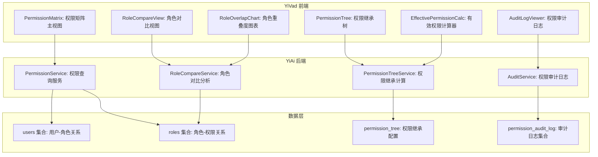
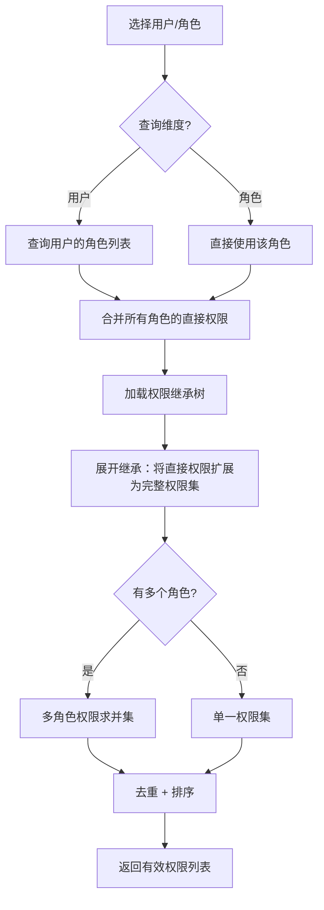

# YV-09-106: 用户角色与权限矩阵 — 权限矩阵可视化、角色-权限网格、角色对比视图、权限继承可视化、有效权限计算器、权限审计日志

> 需求编号：YV-09-106 · 优先级：P2 · 人天：0.3d · 状态：需求已编写
> 依赖：YV-09-50（活动日志与审计追踪，共用审计日志基础设施）、YV-09-62（系统设置管理面板，共用设置页面框架）

## 背景

### 问题陈述

YiVad 拥有一个基于角色的访问控制（RBAC）系统：用户拥有角色，角色拥有权限。但随着系统迭代，权限模型逐渐复杂化——权限之间存在继承关系、角色可能存在冲突、一个用户可能拥有多个角色叠加后的权限组合。当前缺少可视化的权限管理工具，管理员只能通过代码或直接查看数据库来理解"谁有什么权限"。

1. **权限关系不透明**：无法直观回答"角色 X 有权限 Y 吗？"
2. **角色叠加效果不明确**：用户拥有多个角色时的有效权限（union/intersection）不清晰
3. **权限继承关系隐式**：权限"管理用户"可能继承"查看用户"，但在代码中难以追溯
4. **变更历史不可追溯**：谁在什么时间给了谁什么权限——没有审计记录
5. **角色设计不合理时难以发现**：两个角色权限重叠 90%——应该合并，但没有人注意到

**核心矛盾**：RBAC 系统随着时间增长变得复杂，但管理工具没有跟上。需要的不是更多的权限代码，而是让现有权限模型可视化的工具。

### 影响范围

| # | 影响 | 严重程度 | 典型场景 |
|---|------|----------|----------|
| 1 | 权限难以审计 | 高 | 安全审查时需要确认谁有权访问敏感功能 |
| 2 | 角色设计不合理 | 中 | 2 个角色 80% 权限重叠但没有人知道 |
| 3 | 有效权限不清晰 | 高 | 用户问"我为什么不能访问这个？"——管理员也无法快速回答 |
| 4 | 变更历史无追踪 | 中 | 权限被误改后无法追溯责任和时间 |
| 5 | 权限冗余不可见 | 中 | 用户拥有不需要的权限——最小权限原则被违反 |

### 挑战

| 挑战 | 说明 |
|------|------|
| 权限继承计算 | 权限可能有层级关系（A 包含 B），计算有效权限需要展开继承树 |
| 多角色权限合并 | 用户可能拥有多个角色（如 admin + project-lead），有效权限是合并后的集合 |
| 矩阵可视化性能 | 10 个角色 x 50 个权限 = 500 个单元格，DOM 渲染和交互性能 |
| 权限的粒度表示 | 权限可能不只是"有/无"，还可能是"有条件和限制的"（如"仅限自己的项目"） |
| 审计日志的数据量 | 每次权限变更都记录，长期累积的数据量可能很大 |

---

## 一、现状分析

### 1.1 当前权限管理能力

```
现有权限相关功能:
├── YV-09-50 活动日志与审计追踪
│   ├── 活动日志记录用户操作
│   └── 无专门的权限变更日志
├── 权限系统（YiAi auth 模块）
│   ├── 用户 → 角色 → 权限（RBAC）
│   ├── JWT Token 中编码权限
│   └── v-auth 指令实现按钮级权限
├── 系统设置（YV-09-62）
│   ├── 用户管理列表
│   └── 角色分配（基础）

缺失:
├── 权限矩阵可视化                       # ❌ 不存在
├── 角色对比视图                         # ❌ 不存在
├── 权限继承图                           # ❌ 不存在
├── 有效权限计算器                        # ❌ 不存在
├── 角色重叠度分析                        # ❌ 不存在
└── 权限变更审计日志                      # ❌ 不存在
```

### 1.2 管理员权限分析工作流（现状 vs 目标）

```mermaid
graph TD
    subgraph Current["现状：代码+数据库查询"]
        C1[需要了解用户A的权限] --> C2[查看用户角色列表]
        C2 --> C3[去代码中找角色对应的权限定义]
        C3 --> C4{用户有多个角色?}
        C4 -->|是| C5[手动合并权限列表]
        C4 -->|否| C6[得到权限结果]
        C5 --> C6
        C6 --> C7{需要知道谁改的?}
        C7 -->|是| C8[查 Git 历史/问同事]
        C7 -->|否| C9[完成]
        C8 --> C9
    end

    subgraph Target["目标：权限矩阵可视化"]
        T1[打开权限矩阵页面] --> T2[选择角色/用户视角]
        T2 --> T3[权限网格展示]
        T3 --> T4[点击用户 → 展开有效权限]
        T4 --> T5[对比两个角色 → 差异高亮]
        T5 --> T6[查看权限继承树]
        T6 --> T7[查看变更审计日志]
    end

    style Current fill:#f8d7da,stroke:#dc3545
    style Target fill:#d4edda,stroke:#28a745
```



### 1.3 根因矩阵

| 症状 | 根因 | 触发条件 | 频率 |
|------|------|----------|------|
| 权限关系不透明 | 权限定义散落在代码和数据库中 | 安全审计/权限分析 | 高 |
| 有效权限难计算 | 无合并多角色权限的工具 | 排查用户权限问题 | 高 |
| 角色设计不合理 | 无重叠度分析工具 | 新增/修改角色时 | 中 |
| 权限变更无追溯 | 无变更日志 | 权限被误改后查找原因 | 中 |
| 继承关系隐式 | 权限继承仅在代码中表达 | 理解权限层级 | 低 |

---

## 二、设计决策

### 决策 1：权限模型 — 简单位标志 vs 字符串权限 vs 层级权限树

| 选项 | 扩展性 | 粒度 | 权限继承 | 实现复杂度 |
|------|--------|------|---------|-----------|
| 简单位标志（bitmask） | 低（64 个权限） | 粗 | 无 | 低 |
| 字符串权限（如 `user:read`） | 无限 | 细 | 手动编码 | 中 |
| 层级权限树（权限有父子关系） | 无限 | 细 | 自动化 | 高 |

**选择：字符串权限 + 层级树。** YiVad 已有字符串权限（如 `user:read`、`user:write`、`user:delete`）。在现有基础上，增加权限继承树的定义——`user:write` 自动包含 `user:read`，`user:delete` 自动包含 `user:read`。继承关系通过 JSON 配置声明。不需要修改现有的 v-auth 指令和权限验证逻辑。

### 决策 2：矩阵可视化 — HTML Table vs Canvas vs 热力图库

| 选项 | 交互性 | 导出 | 文本显示 | 实现复杂度 |
|------|--------|------|---------|-----------|
| HTML Table（CSS Grid） | 好 | 困难 | 好 | 低 |
| Canvas | 差 | 容易 | 差 | 高 |
| 热力图库（如 heatmap.js） | 中 | 中 | 差 | 中 |

**选择：HTML Table + CSS Grid。** 权限矩阵的核心是"角色 x 权限"的二维表格，每个单元格需要显示：有权限（勾号）、无权限（叉号）、继承权限（灰色勾号）。HTML Table 天然支持文本展示和行/列悬停高亮，交互性好。Canvas/热力图更适合数值密集的矩阵（如基因表达矩阵），不适合文本为主的权限矩阵。

### 决策 3：角色对比 — 并排网格 vs 差异列表 vs Venn 图

| 选项 | 直观性 | 细节程度 | 实现复杂度 |
|------|--------|---------|-----------|
| 并排网格（两个矩阵并排） | 中 | 高 | 低 |
| 差异列表（仅显示不同部分） | 高 | 中 | 低 |
| Venn 图（集合可视化） | 最好（重叠一目了然） | 低（无具体权限列表） | 中 |

**选择：Venn 图摘要 + 差异列表细节。** 用 Venn 图（两个圆交集）直观展示 2 个角色的权限重叠度（如 80% 重叠）。同时差异列表展示 (1) A 有 B 没有、(2) B 有 A 没有、(3) 两者都有。这个组合在"快速判断角色是否冗余"和"查看具体差异"两个场景中都表现良好。

### 决策 4：审计日志粒度 — 仅变更 vs 变更+上下文 vs 全快照

| 选项 | 存储量 | 可追溯性 | 实现复杂度 |
|------|--------|---------|-----------|
| 仅变更（{"role": "admin", "added": true}） | 低 | 中 | 低 |
| 变更+上下文（含操作人和原因） | 中 | 高 | 中 |
| 全快照（每次变更保存完整权限快照） | 高 | 最高 | 高 |

**选择：变更+上下文。** 每条审计日志记录：操作人、操作时间、操作类型（授予/撤销）、目标用户、目标角色/权限、操作原因。这些信息足够满足安全审计和故障排查需求。全快照模式数据量过大且 95% 场景不需要。

### 设计决策总结

| 决策 | 选项 A | 选项 B | 选项 C | 选择 | 理由 |
|------|--------|--------|--------|------|------|
| 权限模型 | 位标志 | 字符串 | 层级树 | **字符串+层级** | 兼容现有 |
| 可视化 | Table | Canvas | 热力图 | **Table** | 交互好 |
| 角色对比 | 并排 | 差异列表 | Venn | **Venn+差异** | 直观+详细 |
| 审计日志 | 仅变更 | +上下文 | 全快照 | **+上下文** | 性价比高 |

---

## 三、目标架构

### 3.1 权限矩阵系统架构



### 3.2 有效权限计算流程



### 3.3 性能指标

| 指标 | 目标值 | 说明 |
|------|--------|------|
| 权限矩阵加载（20 角色 x 100 权限） | < 500ms | 数据查询 + 表渲染 |
| 有效权限计算 | < 100ms | 权限继承展开 |
| 角色对比分析（2 角色） | < 200ms | 差异计算 + Venn 图 |
| 审计日志查询（1000 条，带筛选） | < 500ms | MongoDB 分页查询 |

---

## 四、具体改动

### 4.1 权限矩阵类型定义

```typescript
// YiVad: src/views/permissions/types.ts (新增)

export interface Permission {
  id: string;
  key: string;                  // 权限键（如 "user:read"）
  name: string;                 // 显示名称（如 "查看用户"）
  description: string;
  category: string;             // 权限分类（如 "用户管理"）
  parent?: string;              // 父权限（继承关系的 parent key）
  children?: string[];          // 子权限列表（由后端计算）
}

export interface Role {
  id: string;
  name: string;
  description: string;
  permissions: string[];        // 直接拥有的权限 key 列表
  assignable: boolean;          // 是否可分配给用户
  createdAt: string;
  updatedAt: string;
}

export interface RoleWithEffectivePermissions extends Role {
  effectivePermissions: string[];   // 展开继承后的完整权限
  permissionCount: {
    direct: number;                 // 直接拥有的
    inherited: number;              // 通过继承获得的
    total: number;                  // 合计
  };
}

export interface UserPermissionView {
  userId: string;
  username: string;
  roles: string[];                  // 角色 ID 列表
  roleNames: string[];             // 角色名称列表
  directPermissions: string[];      // 所有角色的直接权限并集
  effectivePermissions: string[];   // 展开继承后的完整权限
  inheritedFrom: Record<string, string[]>; // 权限 key → 来源角色列表
}

export interface RoleComparison {
  roleA: { id: string; name: string };
  roleB: { id: string; name: string };
  overlap: {
    commonPermissions: string[];    // 两者都有
    onlyInA: string[];              // A 有 B 没有
    onlyInB: string[];              // B 有 A 没有
    overlapRate: number;            // 重叠度 = |A ∩ B| / |A ∪ B| × 100%
    totalUnion: number;             // |A ∪ B|
  };
}

export interface PermissionAuditEntry {
  id: string;
  timestamp: string;
  operator: string;                 // 操作人用户名
  operatorId: string;
  targetUser: string;               // 目标用户
  targetUserId: string;
  action: 'grant_role' | 'revoke_role' | 'grant_permission' | 'revoke_permission';
  detail: {
    role?: string;
    permission?: string;
  };
  reason: string;                   // 操作原因
  ipAddress?: string;
}

/** 权限树节点（用于前端渲染树形结构） */
export interface PermissionTreeNode {
  permission: Permission;
  children: PermissionTreeNode[];
}
```

### 4.2 权限矩阵组件

```vue
<!-- YiVad: src/views/permissions/components/PermissionMatrix.vue (新增) -->

<template>
  <div class="permission-matrix">
    <!-- 工具栏 -->
    <div class="matrix-toolbar">
      <div class="view-toggle">
        <button :class="{ active: viewMode === 'role' }" @click="viewMode = 'role'">
          按角色查看
        </button>
        <button :class="{ active: viewMode === 'user' }" @click="viewMode = 'user'">
          按用户查看
        </button>
      </div>
      <div class="matrix-search">
        <input v-model="searchQuery" placeholder="搜索权限/角色..." />
      </div>
      <button @click="exportCSV">导出 CSV</button>
    </div>

    <!-- 角色 → 权限表格 -->
    <div class="matrix-table-wrapper" v-if="viewMode === 'role'">
      <table class="matrix-table">
        <thead>
          <tr>
            <th class="row-header">角色 \ 权限</th>
            <th
              v-for="perm in filteredPermissions"
              :key="perm.key"
              :title="perm.description"
              @click="showPermissionDetail(perm)"
            >
              <div class="perm-header">
                <span class="perm-name">{{ perm.name }}</span>
                <span class="perm-category">{{ perm.category }}</span>
              </div>
            </th>
          </tr>
        </thead>
        <tbody>
          <tr v-for="role in filteredRoles" :key="role.id" @click="selectRole(role)">
            <td class="row-header">
              <div class="role-info">
                <span class="role-name">{{ role.name }}</span>
                <span class="role-count">({{ role.effectivePermissions.length }})</span>
              </div>
            </td>
            <td
              v-for="perm in filteredPermissions"
              :key="perm.key"
              class="matrix-cell"
              :class="getCellClass(role, perm)"
            >
              <span class="cell-icon">
                {{ getCellIcon(role, perm) }}
              </span>
            </td>
          </tr>
        </tbody>
      </table>
    </div>

    <!-- 图例 -->
    <div class="matrix-legend">
      <span class="legend-item"><span class="legend-icon direct"></span> 直接拥有</span>
      <span class="legend-item"><span class="legend-icon inherited"></span> 继承获得</span>
      <span class="legend-item"><span class="legend-icon none"></span> 无权限</span>
    </div>
  </div>
</template>

<script setup lang="ts">
import { ref, computed } from 'vue';
import type { RoleWithEffectivePermissions, Permission } from '../types';

const viewMode = ref<'role' | 'user'>('role');
const searchQuery = ref('');

function getCellClass(role: RoleWithEffectivePermissions, perm: Permission): string {
  if (role.permissions.includes(perm.key)) return 'cell-direct';
  if (role.effectivePermissions.includes(perm.key)) return 'cell-inherited';
  return 'cell-none';
}

function getCellIcon(role: RoleWithEffectivePermissions, perm: Permission): string {
  if (role.permissions.includes(perm.key)) return '✓';
  if (role.effectivePermissions.includes(perm.key)) return '○';
  return '—';
}
</script>
```

### 4.3 后端权限服务

```python
# YiAi: services/perm/matrix_service.py (新增)

from typing import Any

from motor.motor_asyncio import AsyncIOMotorDatabase


class PermissionMatrixService:
    """权限矩阵分析服务"""

    def __init__(self, db: AsyncIOMotorDatabase):
        self.db = db

    async def get_roles_with_effective_permissions(self) -> list[dict[str, Any]]:
        """获取所有角色及其有效权限（含继承展开）"""
        roles = await self.db.roles.find({}).to_list(None)
        permission_tree = await self._load_permission_tree()

        result = []
        for role in roles:
            direct = set(role.get("permissions", []))
            inherited = self._expand_inheritance(direct, permission_tree)
            effective = direct | inherited

            result.append({
                "id": str(role["_id"]),
                "name": role.get("name", ""),
                "description": role.get("description", ""),
                "permissions": list(direct),
                "effectivePermissions": list(effective),
                "assignable": role.get("assignable", True),
                "permissionCount": {
                    "direct": len(direct),
                    "inherited": len(inherited - direct),
                    "total": len(effective),
                },
            })

        return result

    async def get_user_effective_permissions(self, user_id: str) -> dict[str, Any]:
        """获取用户的有效权限（多角色合并 + 继承展开）"""
        user = await self.db.users.find_one({"_id": user_id})
        if not user:
            return {}

        role_ids = user.get("roles", [])
        roles = await self.db.roles.find({"_id": {"$in": role_ids}}).to_list(None)

        permission_tree = await self._load_permission_tree()
        inherited_from: dict[str, list[str]] = {}
        all_direct = set()
        all_effective = set()

        for role in roles:
            role_name = role.get("name", "")
            direct = set(role.get("permissions", []))
            inherited = self._expand_inheritance(direct, permission_tree)
            effective = direct | inherited

            for perm in effective:
                if perm not in inherited_from:
                    inherited_from[perm] = []
                inherited_from[perm].append(role_name)

            all_direct |= direct
            all_effective |= effective

        return {
            "userId": user_id,
            "username": user.get("username", ""),
            "roles": role_ids,
            "roleNames": [r.get("name", "") for r in roles],
            "directPermissions": list(all_direct),
            "effectivePermissions": list(all_effective),
            "inheritedFrom": inherited_from,
        }

    async def compare_roles(self, role_a_id: str, role_b_id: str) -> dict[str, Any]:
        """对比两个角色的权限差异"""
        role_a = await self.db.roles.find_one({"_id": role_a_id})
        role_b = await self.db.roles.find_one({"_id": role_b_id})

        if not role_a or not role_b:
            return {}

        permission_tree = await self._load_permission_tree()

        perms_a = set(role_a.get("permissions", []))
        perms_b = set(role_b.get("permissions", []))

        expanded_a = perms_a | self._expand_inheritance(perms_a, permission_tree)
        expanded_b = perms_b | self._expand_inheritance(perms_b, permission_tree)

        common = expanded_a & expanded_b
        only_a = expanded_a - expanded_b
        only_b = expanded_b - expanded_a
        total_union = expanded_a | expanded_b

        overlap_rate = (len(common) / len(total_union) * 100) if total_union else 0

        return {
            "roleA": {"id": role_a_id, "name": role_a.get("name", "")},
            "roleB": {"id": role_b_id, "name": role_b.get("name", "")},
            "overlap": {
                "commonPermissions": list(common),
                "onlyInA": list(only_a),
                "onlyInB": list(only_b),
                "overlapRate": round(overlap_rate, 1),
                "totalUnion": len(total_union),
            },
        }

    async def _load_permission_tree(self) -> dict[str, set[str]]:
        """加载权限继承树 → {permission_key: {inherited_permissions}}"""
        permissions = await self.db.permissions.find({}).to_list(None) if \
            "permissions" in await self.db.list_collection_names() else []
        tree: dict[str, set[str]] = {}

        for perm in permissions:
            key = perm.get("key", "")
            parent = perm.get("parent")
            if parent:
                if parent not in tree:
                    tree[parent] = set()
                tree[parent].add(key)

        # 递归展开所有继承关系
        expanded: dict[str, set[str]] = {}
        for parent_key in tree:
            expanded[parent_key] = self._collect_all_children(parent_key, tree)

        return expanded

    def _expand_inheritance(
        self, direct_perms: set[str], tree: dict[str, set[str]]
    ) -> set[str]:
        """根据权限继承树展开直接权限为完整权限集"""
        result: set[str] = set()
        for perm in direct_perms:
            if perm in tree:
                result |= tree[perm]
        return result

    def _collect_all_children(
        self, key: str, tree: dict[str, set[str]], visited: set[str] | None = None
    ) -> set[str]:
        """递归收集所有子权限（防止循环引用）"""
        if visited is None:
            visited = set()
        if key in visited:
            return set()
        visited.add(key)

        children: set[str] = set()
        if key in tree:
            for child in tree[key]:
                children.add(child)
                children |= self._collect_all_children(child, tree, visited)
        return children
```

### 4.4 文件变更清单

| 文件 | 操作 | 说明 |
|------|------|------|
| `YiVad: src/views/permissions/types.ts` | 新增 | 权限矩阵类型定义 |
| `YiVad: src/views/permissions/PermissionMatrixPage.vue` | 新增 | 权限矩阵页面 |
| `YiVad: src/views/permissions/components/PermissionMatrix.vue` | 新增 | 权限矩阵表格组件 |
| `YiVad: src/views/permissions/components/RoleCompare.vue` | 新增 | 角色对比视图 |
| `YiVad: src/views/permissions/components/PermissionTree.vue` | 新增 | 权限继承树可视化 |
| `YiVad: src/views/permissions/components/EffectivePermCalc.vue` | 新增 | 有效权限计算器 UI |
| `YiVad: src/views/permissions/components/AuditLogViewer.vue` | 新增 | 权限审计日志查看器 |
| `YiVad: src/views/permissions/components/RoleOverlapChart.vue` | 新增 | 角色重叠度图表 |
| `YiVad: src/router/` | 修改 | 添加权限矩阵路由 |
| `YiAi: services/perm/matrix_service.py` | 新增 | 权限矩阵分析服务 |
| `YiAi: services/perm/audit_service.py` | 新增 | 权限审计日志服务 |

---

## 五、实施步骤

| 步骤 | 操作 | 路径 | 验证 | 人天 |
|------|------|------|------|------|
| 1 | 定义类型 | `src/views/permissions/types.ts` | 类型检查通过 | 0.02 |
| 2 | 实现后端权限矩阵服务 | `YiAi: services/perm/matrix_service.py` | 有效权限展开/角色对比正确 | 0.05 |
| 3 | 实现后端审计日志服务 | `YiAi: services/perm/audit_service.py` | 日志记录+查询 | 0.02 |
| 4 | 实现权限矩阵表格组件 | `src/views/permissions/components/PermissionMatrix.vue` | 表格渲染+排序+筛选 | 0.05 |
| 5 | 实现角色对比视图 | `src/views/permissions/components/RoleCompare.vue` | Venn 图+差异列表 | 0.04 |
| 6 | 实现权限继承树 | `src/views/permissions/components/PermissionTree.vue` | 树形渲染+展开/折叠 | 0.03 |
| 7 | 实现有效权限计算器 UI | `src/views/permissions/components/EffectivePermCalc.vue` | 用户选择→权限展示 | 0.03 |
| 8 | 实现审计日志查看器 | `src/views/permissions/components/AuditLogViewer.vue` | 分页+筛选+时间范围 | 0.03 |
| 9 | 实现重叠度图表 | `src/views/permissions/components/RoleOverlapChart.vue` | ECharts 热力图 | 0.02 |
| 10 | 添加路由和权限（管理员可见） | `src/router/` | 仅管理员角色可访问 | 0.01 |

**总人天：0.3d**

---

## 六、测试规格

### 场景 1：权限矩阵渲染

**GIVEN** 系统有 5 个角色和 20 个权限
**WHEN** 打开权限矩阵页面（按角色查看）
**THEN** 渲染 5 行 x 20 列的网格表
**AND** 每个单元格显示正确的权限状态（✓/○/—）
**AND** 行悬停时高亮整行
**AND** 列悬停时高亮整列

### 场景 2：权限继承展开

**GIVEN** 权限树定义：`user:write` → `user:read`，`user:delete` → `user:read`
**WHEN** 角色 A 拥有 `user:write`（无 `user:read`）
**THEN** 有效权限计算显示：直接 = [`user:write`]，继承 = [`user:read`]
**AND** `user:read` 单元格显示为"继承获得"（○）

### 场景 3：多角色有效权限

**GIVEN** 用户拥有 2 个角色：角色 A 有 `user:read`、角色 B 有 `user:write`
**WHEN** 在有效权限计算器中查询该用户
**THEN** 有效权限 = [`user:read`, `user:write`]（并集）
**AND** `user:read` 来源 = [`角色A`]
**AND** `user:write` 来源 = [`角色B`]

### 场景 4：角色对比

**GIVEN** 角色 Admin: [`user:*`, `project:*`]，角色 Editor: [`project:read`, `project:write`, `content:*`]
**WHEN** 对比 Admin 和 Editor
**THEN** Venn 图显示重叠度为约 20%
**AND** 差异列表显示 "Admin 有 Editor 没有: [`user:*`]"
**AND** "Editor 有 Admin 没有: [`content:*`]"
**AND** "两者都有: [`project:read`, `project:write`]"

### 场景 5：权限审计日志

**GIVEN** 管理员授予用户 Bob "Editor" 角色，原因为 "需要管理内容"
**WHEN** 查看审计日志
**THEN** 日志条目显示：操作人=管理员、目标用户=Bob、操作=授予角色、角色=Editor、原因="需要管理内容"、时间戳正确
**AND** 按用户筛选只看到 Bob 的相关日志

### 场景 6：角色重叠度热力图

**GIVEN** 5 个角色的权限矩阵
**WHEN** 查看角色重叠度图表
**THEN** 展示 5x5 热力图，对角线为 100%
**AND** 任何两个角色的重叠度值显示在对应的 (i, j) 单元格
**AND** 颜色从绿（100%）到红（0%）渐变

---

## 七、风险与缓解

| 风险 | 概率 | 影响 | 缓解措施 |
|------|------|------|----------|
| 权限继承树循环引用 | 低 | 高 | `_collect_all_children` 中使用 `visited` 集合防止循环；继承树配置时前端校验 |
| 大矩阵渲染性能 | 中 | 中 | 虚拟滚动表（仅渲染可见行/列）；分页加载权限分类 |
| 敏感权限信息泄露 | 中 | 高 | 权限矩阵页面仅管理员角色可访问；API 端点需认证 |
| 角色变更后矩阵缓存未更新 | 中 | 低 | 角色 CRUD 操作后主动失效矩阵缓存；矩阵数据标记 TTL |
| 审计日志数据膨胀 | 低 | 低 | 日志保留 90 天；按时间分区；支持归档导出 |

---

## 八、回滚策略

| 场景 | 回滚操作 | 影响 |
|------|----------|------|
| 权限矩阵页面导致前端崩溃 | 移除路由 + 隐藏菜单入口 | 失去矩阵可视化 |
| 权限继承树错误导致有效权限计算错误 | 禁用继承展开功能，仅显示直接权限 | 失去继承可视化 |
| 审计日志写入失败 | 暂存于内存队列，重试 3 次 | 短暂日志丢失 |
| 角色对比服务错误 | 移除对比视图入口 | 失去对比分析 |

---

## 九、设计决策记录

### D-01：为什么选择字符串权限而非位掩码（bitmask）？

位掩码将每个权限映射到一个位（如 bit 0 = user:read, bit 1 = user:write），优点是节省存储空间和快速比较（位运算）。但在 RBAC 管理中，管理员和审计员需要"看到"权限名称而非 bit 位置。字符串权限如 `user:read` 自文档化——不需要查表就知道它的含义。此外，位掩码受整数位数限制（通常 64 位），字符串权限无此限制。存储成本在现代系统中可以忽略不计。

### D-02：为什么权限继承需要递归展开而非仅一级？

权限可能有深层继承关系：`admin:*` → `user:*` → `user:write` → `user:read`。从 `admin:*` 到 `user:read` 需要经过 3 层继承。如果只展开一级，那么拥有 `admin:*` 的角色不会显示拥有 `user:read`——这是不准确的。递归展开保证了"拥有父权限等于拥有所有子权限及其后代"的语义完整性。循环引用通过 visited 集合防护。

### D-03：为什么角色对比使用 Venn 图而不是差异数字？

Venn 图的两个圆相交的视觉化表达是展示"两者重叠"的最直观方式——人类大脑对形状和比例的理解远快于数字。"80% 重叠"这个数字本身没有"两个圆大面积重合"来得直观。在权限管理中，高重叠度（> 80%）可能提示两个角色可以合并，这个发现过程受益于视觉化。

### D-04：为什么审计日志在角色/权限变更时记录操作原因？

权限变更是敏感操作。没有一个记录"为什么"的日志，审计时只能看到"谁在什么时候做了什么"，但无法判断操作是否合理。强制记录操作原因（下拉选择 + 自由文本）既是为审计留痕，也是对操作者的行为约束——要求他们停下来思考变更的合理性。

---

## 十、可观测性

### 指标

| 指标 | 类型 | 说明 |
|------|------|------|
| `yivad.perm.matrix_view_total` | Counter | 权限矩阵页面访问次数 |
| `yivad.perm.compare_total` | Counter | 角色对比执行次数 |
| `yivad.perm.effective_calc_total` | Counter | 有效权限查询次数 |
| `yivad.perm.audit_log_query_total` | Counter | 审计日志查询次数 |
| `yivad.perm.inheritance_depth` | Histogram | 权限继承深度分布 |

### 告警

| 告警 | 条件 | 级别 |
|------|------|------|
| 权限继承深度异常 | 深度 > 5 层 | WARN（可能存在循环引用） |
| 角色权限为空 | 任何角色无任何权限 | INFO |

---

## 十一、代码审查检查清单

- [ ] PermissionMatrixService: 递归展开防止循环引用（visited set）
- [ ] PermissionMatrixService: 权限树中 parent key 不存在时的处理（记录 WARN 但继续）
- [ ] PermissionMatrixService: 多角色合并使用 set union（去重）
- [ ] PermissionMatrix: 大数据量（> 500 单元格）时使用 CSS `will-change: transform` 优化渲染
- [ ] PermissionMatrix: 列头 sticky 定位（横向和纵向滚动时表头固定）
- [ ] RoleCompare: Venn 图的 SVG/CSS 渲染正确性
- [ ] PermissionTree: 树节点展开/折叠动画流畅（`<Transition>` 组件）
- [ ] AuditLogViewer: 分页参数验证（page >= 1, pageSize <= 100）
- [ ] AuditLogViewer: 时间范围筛选的时区处理
- [ ] 权限矩阵页面仅限管理员角色访问（路由守卫）

---

## 回归问题预测

| # | 预测问题 | 原因 | 验证方法 |
|---|---------|------|---------|
| 1 | `_load_permission_tree` 中异步加载 `permissions` 集合，但该集合可能不存在（旧版本数据库没有此集合），`list_collection_names()` 异步检查容易与主流程产生竞态 | 如果 permissions 集合不存在，`tree` 为空，所有角色的 `inherited` 权限为空——静默失败，不报错 | 在 `_load_permission_tree` 中先检查集合是否存在，不存在时返回空字典并记录日志 |
| 2 | 敏感权限信息（如 `admin:*` 权限的详细列表）可能通过 API 响应泄露给非管理员用户 | 矩阵 API 返回所有角色的权限信息，如果路由守卫不完善，非管理员可能通过直接访问 API 获取 | API 端点添加认证和角色检查；返回数据中不包含 `admin:*` 的展开详情（`*` 通配符保持原样） |
| 3 | `_collect_all_children` 可能产生指数级递归——假设树结构为 A→B, A→C, B→D, C→D，D 会被访问两次（不同路径） | 虽然 visited set 防止了无限递归，但 D 被 expand 计算了两次，不影响结果（set union 去重） | 性能可接受（权限树通常 < 200 个节点） |
| 4 | 权限矩阵的"按用户查看"模式下，如果用户数量很大（> 1000），加载所有用户的权限信息会导致页面卡顿 | "按用户查看"需要查询每个用户的角色，再合并权限——用户数多时查询量和计算量都很大 | "按用户查看"模式改为搜索模式——用户输入用户名后异步查询；不一次性加载所有用户 |
| 5 | 角色对比中 Venn 图的渲染依赖计算出的 `overlapRate`，如果 `totalUnion` 为 0（两个角色都没有权限），会产生除零错误 | `overlap_rate = (len(common) / len(total_union) * 100)` 当 `total_union` 为 0 时除零 | Python 中已经有三目运算符保护（`if total_union else 0`），前端也需防御 |
| 6 | 权限矩阵表格使用 `v-for` 渲染所有单元格，当单元格数量大（20 角色 x 100 权限 = 2000 单元格）时，Vue 的响应式系统可能产生性能瓶颈 | 每个单元格的计算（`getCellClass`/`getCellIcon`）在每次依赖变化时重新执行 | 使用 `computed` 预计算整个矩阵的渲染数据（`Array<Array<CellData>>`），而非在每个单元格中独立计算；或使用 `v-memo` |

---

## 性能分析

### 各阶段耗时

| 阶段 | 预估耗时 | 说明 |
|------|----------|------|
| 角色+权限数据加载 | < 100ms | MongoDB 查询 + 权限树构建 |
| 有效权限展开（20 角色） | < 50ms | 递归集合运算 |
| 权限矩阵渲染（20x100 表格） | < 200ms | DOM 创建 + 浏览器布局 |
| 角色对比计算 | < 20ms | 集合交集/差集运算 |
| Venn 图渲染 | < 10ms | SVG circle 渲染 |
| 审计日志查询（分页） | < 100ms | MongoDB find + skip + limit |
| 重叠度热力图（10x10） | < 50ms | ECharts heatmap |

### 体积预估

| 文件 | 大小 | 说明 |
|------|------|------|
| 前端 types | ~4KB | 权限矩阵类型定义 |
| YiAi: matrix_service.py | ~6KB | 权限矩阵分析服务 |
| YiAi: audit_service.py | ~3KB | 审计日志服务 |
| Vue 组件（7 个） | ~18KB | 矩阵 + 对比 + 继承树 + 计算器 + 审计日志 + 重叠度 + 页面 |
| **总计** | **~31KB** | 前端 + 后端 |

