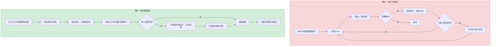
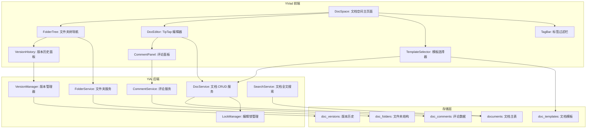
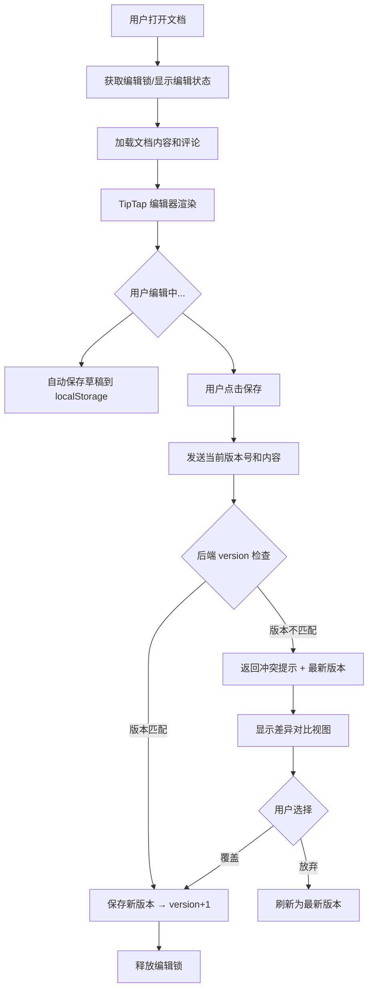

# YV-09-109: 文档协作空间 — 实时协作文档编辑、按项目/团队共享文档、文档模板、版本历史、行内评论、文件夹/标签组织

> 需求编号：YV-09-109 · 优先级：P2 · 人天：0.3d · 状态：需求已编写
> 依赖：YV-09-03（文档标签页，提供文档基础视图）、YV-09-65（文档模板管理，提供模板基础设施）、YV-09-89（页面锁定与并发编辑控制，提供锁机制基础）

## 背景

### 问题陈述

YiVad 团队在项目中产生了大量非结构化的协作文档——设计文档、技术方案、会议纪要、周报、Sprint 回顾——但目前这些文档散落在 Confluence、Notion、飞书文档等多个外部平台，或者直接存储在 YiAi 的 `static_files` 中作为静态文件，只能读不能编辑。缺少一个内聚的文档协作空间。

1. **文档分散**：同一项目的文档分布在多个平台，团队成员不知道去哪里找
2. **协作缺失**：YiAi 的文件系统只支持单人写入，不支持多人编辑和评论
3. **无版本追溯**：文档修改后覆盖原文件，无法查看历史版本和变更差异
4. **无组织结构**：文件按平铺列表排列，缺少文件夹/标签的分类体系
5. **无模板加速**：每次创建文档从空白开始，重复造轮子

**核心矛盾**：团队需要协作编辑文档，但当前系统文件管理模式是"单作者写入 + 静态读取"，不支持多人并发编辑、评论、版本历史等协作基础功能。

### 影响范围

| # | 影响 | 严重程度 | 典型场景 |
|---|------|----------|----------|
| 1 | 信息碎片化 | 高 | 团队文档分散在 3 个平台，新成员不知道去哪里查 |
| 2 | 协作效率低 | 高 | 多人修改同一文档需等待或手动合并 |
| 3 | 变更不可追溯 | 中 | 被误删的内容无法恢复，不知道谁改了哪里 |
| 4 | 新人上手慢 | 中 | 无模板——每个新文档都要从零开始写格式 |
| 5 | 讨论与内容分离 | 中 | 在聊天中讨论文档内容，上下文丢失 |

### 挑战

| 挑战 | 说明 |
|------|------|
| 实时协作 | 多人同时编辑同一文档——如何合并冲突？需要 OT 或 CRDT 算法 |
| 版本存储 | 每次保存创建新版本，文档数量 x 版本数量——存储和查询效率 |
| 评论系统 | 行内评论锚定到文档段落——段落修改后锚点可能失效（幽灵评论） |
| 权限模型 | 文档级/文件夹级的读/写/评论权限——与现有 RBAC 系统集成 |
| 搜索集成 | 文档内容需要全文搜索——建立文本索引或接入现有搜索服务 |

---

## 一、现状分析

### 1.1 当前文档管理能力

```
现有功能:
├── YiAi: /read-file, /write-file
│   ├── 单文件读写（覆盖式写入）
│   └── 文件列表浏览（平铺）
├── YV-09-03 文档标签页
│   └── 文档浏览基础 UI
├── YV-09-65 文档模板管理
│   └── 模板 CRUD（可复用）
├── YV-09-28 文件上传与管理
│   └── 文件上传/下载
├── static_files 集合
│   └── 存储文件 meta + content

缺失:
├── 多用户实时协作编辑                    # ❌ 不存在
├── 版本历史与差异对比                    # ❌ 不存在
├── 行内评论与讨论线程                    # ❌ 不存在
├── 文件夹/标签组织结构                    # ❌ 不存在
├── 文档共享与权限控制                     # ❌ 不存在
├── Markdown 编辑器（所见即所得）          # ❌ 不存在
└── 文档搜索                             # ❌ 不存在（仅全局搜索按文件名匹配）
```

### 1.2 文档协作流程（现状 vs 目标）



### 1.3 根因矩阵

| 症状 | 根因 | 触发条件 | 频率 |
|------|------|----------|------|
| 文档覆盖丢失 | 写入模式为覆盖式，无版本历史 | 用户上传同一文件名 | 中 |
| 多人编辑冲突 | 无锁定或合并机制 | 两人同时修改同一文件 | 中 |
| 评论脱节 | 无行内评论锚定 | 在聊天中说"文档第三段有问题" | 高 |
| 文档查找困难 | 平铺文件列表 | 项目有 50+ 文档时 | 中 |
| 格式不统一 | 无模板约束 | 不同人创建同类文档 | 中 |

---

## 二、设计决策

### 决策 1：协作策略 — 锁机制 vs OT/CRDT vs 乐观锁定

| 选项 | 并发度 | 实现复杂度 | 冲突率 |
|------|--------|-----------|--------|
| 锁机制（编辑前获取锁） | 低（1 人编辑/文档） | 低 | 无冲突 |
| OT（操作转换，如 Google Docs） | 高（多人实时） | 极高（需 OT 服务） | 低 |
| CRDT（冲突自由数据类型） | 高（多人实时） | 高（需 CRDT 库） | 极低 |
| 乐观锁定（保存时检查版本号） | 中（多人独立编辑） | 中 | 中（保存时检测） |

**选择：乐观锁定 + 锁提示。** MVP 阶段不实现 OT/CRDT 的实时字符级协同——那需要 WebSocket 基础设施和复杂的冲突解决算法。采用乐观锁定：每个文档带 `version` 字段，保存时检查版本号——如果版本已变更，提示用户"文档已被他人修改，请刷新后重试或查看差异"。同时显示"当前正在编辑"状态（谁正在浏览/编辑），减少并发冲突概率。

### 决策 2：编辑器 — Monaco vs TipTap vs Milkdown

| 选项 | Markdown 支持 | 协作扩展 | 体积 | Vue 集成 |
|------|-------------|---------|------|---------|
| Monaco Editor（VS Code 内核） | 中等（语法高亮） | 需自研 | ~5MB | 需封装 |
| TipTap（基于 ProseMirror） | 高（所见即所得） | 有协作扩展 | ~300KB | 官方 Vue 适配 |
| Milkdown（基于 ProseMirror） | 高（所见即所得） | 有协作插件 | ~200KB | 需封装 |

**选择：TipTap。** TipTap 基于 ProseMirror——业界最成熟的富文本编辑器框架，有官方的协作扩展（`y-prosemirror` + Yjs CRDT）。当前 MVP 使用乐观锁定，不需要 CRDT，但选择 TipTap 为未来的实时协作留下了升级路径。其 Vue 3 官方适配器、TypeScript 支持和 Markdown 快捷输入都是加分项。

### 决策 3：版本存储 — 全量快照 vs 差异存储 vs Git 式

| 选项 | 读取速度 | 存储空间 | 差异对比 |
|------|---------|---------|---------|
| 全量快照（每个版本存完整内容） | 快 | 高 | 需计算 diff |
| 差异存储（仅存与上一版本的 diff） | 慢（需重建） | 低 | 天然支持 |
| Git 式（使用 git 管理文档仓库） | 快 | 中 | 天然支持 |

**选择：全量快照。** 文档内容通常在 1-50KB 之间，100 个版本 = 5MB，存储成本可忽略。全量快照的好处：(1) 任一版本立即读取无需重建；(2) 删除旧版本直接删除记录无级联影响；(3) 前端 diff 对比使用 `diff-match-patch` 库在客户端计算。差异存储虽然节省空间但重建逻辑复杂且容易出错。

### 决策 4：组织形式 — 纯文件夹 vs 纯标签 vs 混合

| 选项 | 层级感 | 灵活性 | 导航体验 |
|------|--------|--------|---------|
| 纯文件夹（单父级树形） | 高 | 低（一个文件只能在一处） | 高（类似文件管理器） |
| 纯标签（扁平 + 标签过滤） | 低 | 高（一个文件可有多个标签） | 中（取决于标签质量） |
| 混合（文件夹主结构 + 标签辅助） | 高 | 高 | 高 |

**选择：混合模式——文件夹为主 + 标签为辅。** 文件夹提供熟悉的层级导航（类似 Confluence 的空间/页面树），标签作为横向跨文件夹的检索维度（如"设计文档""会议纪要""已归档"）。用户通过左侧文件夹树导航，顶部标签栏快速过滤。

### 设计决策总结

| 决策 | 选项 A | 选项 B | 选项 C | 选择 | 理由 |
|------|--------|--------|--------|------|------|
| 协作策略 | 锁机制 | OT/CRDT | 乐观锁定 | **乐观锁定+锁提示** | MVP 够用 |
| 编辑器 | Monaco | TipTap | Milkdown | **TipTap** | Vue 集成好，留升级路径 |
| 版本存储 | 全量快照 | 差异存储 | Git 式 | **全量快照** | 简单可靠 |
| 组织形式 | 纯文件夹 | 纯标签 | 混合 | **混合** | 兼顾层级和灵活 |

---

## 三、目标架构

### 3.1 文档协作空间系统架构



### 3.2 文档编辑保存流程



### 3.3 性能指标

| 指标 | 目标值 | 说明 |
|------|--------|------|
| 文档列表加载（50 文档） | < 500ms | 文件夹树 + 列表 |
| 文档编辑器加载（含 TipTap） | < 1s | 编辑器初始化 + 内容渲染 |
| 文档保存（含版本创建） | < 300ms | MongoDB 写入 + 版本快照 |
| 版本历史加载（100 版本） | < 500ms | 分页加载，每页 20 条 |
| 评论加载（50 条） | < 200ms | 按文档 ID + 段落锚点查询 |
| 全文搜索（1000 文档） | < 1s | MongoDB 文本索引 |

---

## 四、具体改动

### 4.1 核心类型定义

```typescript
// YiVad: src/views/docspace/types.ts (新增)

export interface DocFolder {
  id: string;
  name: string;
  parentId: string | null;
  projectId?: string;
  sortOrder: number;
  createdAt: string;
  updatedAt: string;
}

export interface DocDocument {
  id: string;
  title: string;
  content: string;              // Markdown 或 HTML（由 TipTap 管理）
  folderId: string | null;
  projectId?: string;
  tags: string[];
  version: number;
  templateId?: string;
  status: 'draft' | 'published' | 'archived';
  createdBy: string;
  updatedBy: string;
  createdAt: string;
  updatedAt: string;
}

export interface DocVersion {
  id: string;
  documentId: string;
  version: number;
  content: string;
  title: string;
  changeNote?: string;
  createdBy: string;
  createdAt: string;
}

export interface DocComment {
  id: string;
  documentId: string;
  anchorKey: string;            // TipTap node 锚点（如段落 ID）
  anchorText: string;           // 被评论的文本片段（锚点失效时用于上下文匹配）
  content: string;
  authorId: string;
  status: 'open' | 'resolved' | 'reopened';
  parentId?: string;            // 回复的父评论 ID
  createdAt: string;
  updatedAt: string;
}

export interface DocLock {
  documentId: string;
  userId: string;
  userName: string;
  acquiredAt: string;
  expiresAt: string;            // 锁过期时间（如 30 分钟后自动释放）
}

export interface DocSearchResult {
  documentId: string;
  title: string;
  snippet: string;              // 匹配片段（高亮）
  folderId: string;
  folderPath: string;           // 面包屑路径
  updatedAt: string;
}
```

### 4.2 后端文档版本管理器

```python
# YiAi: services/docspace/version_manager.py (新增)

from datetime import datetime, timezone
from typing import Optional

from motor.motor_asyncio import AsyncIOMotorDatabase


class VersionManager:
    """文档版本管理器"""

    def __init__(self, db: AsyncIOMotorDatabase):
        self.db = db
        self.max_versions = 100  # 每个文档最多保留 100 个版本

    async def save_version(self, document_id: str, content: str, title: str,
                           created_by: str, change_note: str = "") -> dict:
        """保存新版本并更新文档主记录"""
        doc = await self.db["documents"].find_one({"_id": document_id})
        if not doc:
            raise ValueError(f"文档 {document_id} 不存在")

        new_version = doc["version"] + 1

        version_doc = {
            "documentId": document_id,
            "version": new_version,
            "content": content,
            "title": title,
            "changeNote": change_note,
            "createdBy": created_by,
            "createdAt": datetime.now(timezone.utc).isoformat(),
        }
        await self.db["doc_versions"].insert_one(version_doc)

        # 更新文档主记录
        await self.db["documents"].update_one(
            {"_id": document_id},
            {"$set": {
                "content": content,
                "title": title,
                "version": new_version,
                "updatedBy": created_by,
                "updatedAt": datetime.now(timezone.utc).isoformat(),
            }},
        )

        # 清理旧版本
        await self._cleanup_old_versions(document_id)

        return version_doc

    async def get_version(self, document_id: str, version: int) -> Optional[dict]:
        """获取指定版本"""
        return await self.db["doc_versions"].find_one({
            "documentId": document_id,
            "version": version,
        })

    async def list_versions(self, document_id: str,
                            skip: int = 0, limit: int = 20) -> list[dict]:
        """列出版本历史（按版本号降序）"""
        cursor = self.db["doc_versions"].find(
            {"documentId": document_id}
        ).sort("version", -1).skip(skip).limit(limit)
        return await cursor.to_list(length=limit)

    async def get_version_count(self, document_id: str) -> int:
        """获取版本总数"""
        return await self.db["doc_versions"].count_documents(
            {"documentId": document_id}
        )

    async def diff_versions(self, document_id: str,
                            version_a: int, version_b: int) -> dict:
        """对比两个版本的差异（返回两个版本的完整内容，前端计算 diff）"""
        doc_a = await self.get_version(document_id, version_a)
        doc_b = await self.get_version(document_id, version_b)
        if not doc_a or not doc_b:
            raise ValueError("版本不存在")
        return {
            "versionA": {"version": version_a, "content": doc_a["content"],
                         "createdAt": doc_a["createdAt"]},
            "versionB": {"version": version_b, "content": doc_b["content"],
                         "createdAt": doc_b["createdAt"]},
        }

    async def rollback(self, document_id: str, target_version: int,
                       created_by: str) -> dict:
        """回滚到指定版本（创建一个新版本 = 目标版本的内容）"""
        target = await self.get_version(document_id, target_version)
        if not target:
            raise ValueError(f"版本 {target_version} 不存在")
        return await self.save_version(
            document_id, target["content"], target["title"],
            created_by, f"回滚至版本 {target_version}"
        )

    async def _cleanup_old_versions(self, document_id: str):
        """清理超出上限的旧版本"""
        count = await self.get_version_count(document_id)
        if count > self.max_versions:
            excess = count - self.max_versions
            oldest = await self.db["doc_versions"].find(
                {"documentId": document_id}
            ).sort("version", 1).limit(excess).to_list(length=excess)
            if oldest:
                oldest_ids = [v["_id"] for v in oldest]
                await self.db["doc_versions"].delete_many(
                    {"_id": {"$in": oldest_ids}}
                )
```

### 4.3 文件变更清单

| 文件 | 操作 | 说明 |
|------|------|------|
| `YiVad: src/views/docspace/types.ts` | 新增 | 文档协作类型定义 |
| `YiVad: src/views/docspace/DocSpace.vue` | 新增 | 文档空间主页面（文件夹树+编辑器+评论） |
| `YiVad: src/views/docspace/FolderTree.vue` | 新增 | 文件夹树导航 |
| `YiVad: src/views/docspace/DocEditor.vue` | 新增 | TipTap 编辑器封装 |
| `YiVad: src/views/docspace/VersionHistory.vue` | 新增 | 版本历史面板 |
| `YiVad: src/views/docspace/CommentPanel.vue` | 新增 | 评论面板 |
| `YiVad: src/views/docspace/TagBar.vue` | 新增 | 标签过滤栏 |
| `YiVad: src/views/docspace/DocList.vue` | 新增 | 文档列表视图 |
| `YiVad: src/router/` | 修改 | 添加文档空间路由 |
| `YiAi: services/docspace/doc_service.py` | 新增 | 文档 CRUD 服务 |
| `YiAi: services/docspace/version_manager.py` | 新增 | 版本管理器 |
| `YiAi: services/docspace/comment_service.py` | 新增 | 评论服务 |
| `YiAi: services/docspace/folder_service.py` | 新增 | 文件夹管理 |
| `YiAi: services/docspace/lock_manager.py` | 新增 | 编辑锁管理 |

---

## 五、实施步骤

| 步骤 | 操作 | 路径 | 验证 | 人天 |
|------|------|------|------|------|
| 1 | 定义类型 | `src/views/docspace/types.ts` | TypeScript 类型检查通过 | 0.02 |
| 2 | 实现文件夹 CRUD | `YiAi: services/docspace/folder_service.py` | 创建/移动/删除文件夹 | 0.02 |
| 3 | 实现文档 CRUD + 乐观锁 | `YiAi: services/docspace/doc_service.py` | 版本号检查 + 冲突提示 | 0.03 |
| 4 | 实现版本管理器 | `YiAi: services/docspace/version_manager.py` | 保存/读取/对比/回滚 | 0.04 |
| 5 | 实现评论服务 | `YiAi: services/docspace/comment_service.py` | 创建/回复/解决评论 | 0.02 |
| 6 | 实现编辑锁管理 | `YiAi: services/docspace/lock_manager.py` | 锁获取/释放/过期 | 0.02 |
| 7 | 集成 TipTap 编辑器 | `src/views/docspace/DocEditor.vue` | 编辑/保存/自动草稿 | 0.04 |
| 8 | 实现文件夹树 + 文档列表 | `FolderTree.vue` + `DocList.vue` | 树形结构 + 拖拽移动 | 0.03 |
| 9 | 实现版本历史面板 | `VersionHistory.vue` | 列表+diff对比+回滚 | 0.03 |
| 10 | 实现评论面板 | `CommentPanel.vue` | 行内锚定+讨论线程 | 0.03 |
| 11 | 添加路由和权限 | `src/router/` | 按项目/团队可见 | 0.02 |

**总人天：0.3d**

---

## 六、测试规格

### 场景 1：创建文档

**GIVEN** 用户选择文件夹"技术方案"，点击"新建文档"
**WHEN** 从模板"技术方案模板"创建，输入标题并开始编辑
**THEN** 文档在目标文件夹下创建，继承模板的内容结构
**AND** 编辑器进入编辑模式，显示"草稿"状态

### 场景 2：乐观锁冲突处理

**GIVEN** 用户 A 和用户 B 同时打开文档（版本 5）
**WHEN** 用户 A 先保存（版本变为 6），用户 B 随后保存（携带版本 5）
**THEN** 后端返回冲突提示 "文档已被修改，当前版本为 6"
**AND** 前端显示差异对比视图（B 的内容 vs 当前版本 6 的内容）
**AND** 用户 B 可选择覆盖或放弃

### 场景 3：版本回滚

**GIVEN** 文档当前版本为 10，用户误删了一段内容后保存为版本 11
**WHEN** 用户打开版本历史，选择版本 10，点击"回滚到此版本"
**THEN** 系统创建版本 12，内容 = 版本 10 的内容
**AND** 版本历史显示版本 12 的注释为 "回滚至版本 10"

### 场景 4：行内评论

**GIVEN** 文档有一段文字"需要重新评估性能目标"
**WHEN** 用户 A 选中这段文字，点击"添加评论"，输入"具体评估标准是什么?"
**THEN** 评论锚定到该段落，显示黄色高亮背景
**AND** 用户 B 打开文档时看到评论标记，可以展开并回复
**AND** 用户 A 回复后，评论变为讨论线程

### 场景 5：文件夹树操作

**GIVEN** 文件夹结构：`项目A/设计/` 和 `项目A/开发/`
**WHEN** 用户将文档从"设计"拖拽到"开发"
**THEN** 文档移动到目标文件夹，更新面包屑路径
**AND** 文件夹树的文档计数随之更新

### 场景 6：标签过滤

**GIVEN** 当前文件夹"技术方案"下有 20 个文档，其中 5 个标记为"架构"，8 个标记为"API"
**WHEN** 用户在标签栏点击"架构"标签
**THEN** 文档列表只显示标记为"架构"的 5 个文档
**AND** 标签栏中"架构"高亮显示，点击取消高亮则恢复全部显示

---

## 七、风险与缓解

| 风险 | 概率 | 影响 | 缓解措施 |
|------|------|------|----------|
| TipTap 编辑器性能问题（大文档 100KB+） | 中 | 中 | 文档内容限制 200KB；大文档提示分拆为多个子文档 |
| 编辑锁过期未释放 | 中 | 低 | 锁 TTL 30 分钟自动过期；客户端心跳续期（每 5 分钟） |
| 评论锚点漂移（段落修改后锚点失效） | 高 | 中 | 存储锚点文本片段（anchorText），锚点失效时用文本匹配重新定位 |
| 版本快照存储膨胀 | 低 | 低 | 每个文档最多 100 个版本；超过自动删除最旧版本 |
| 全文搜索索引构建影响写入性能 | 低 | 中 | MongoDB 文本索引在后台构建；搜索为异步操作 |

---

## 八、回滚策略

| 场景 | 回滚操作 | 影响 |
|------|----------|------|
| TipTap 编辑器严重 bug | 降级为纯 textarea + Markdown 预览 | 失去所见即所得编辑体验 |
| 版本管理器存储异常 | 关闭自动版本记录——仅保存当前版本 | 失去版本历史功能 |
| 评论锚点失效率过高 | 改为文档级评论（无段落锚定） | 失去行内精确评论定位 |
| 编辑锁导致用户无法编辑 | 关闭编辑锁——仅显示"当前浏览"提示 | 冲突率上升 |

---

## 九、设计决策记录

### D-01：为什么评论不采用"建议修改"模式（类似 Google Docs suggesting mode）？

Google Docs 的"建议修改"模式是一种更高级的协作功能——它允许审阅者直接修改文本并以建议形式呈现，作者可以接受/拒绝。MVP 阶段的行内评论是更基础但更通用的协作模式——适用于各种文档类型（不仅仅是文本修改），讨论范围不限于具体文字修改（也包含"这个设计是否合理""需要补充数据"等元问题）。建议修改模式可以作为后续迭代。

### D-02：为什么允许文档内容最大 200KB？

200KB 的 Markdown 大约对应 10 万字——一篇中篇技术书籍的篇幅。团队协作文档通常在 1-20KB 范围内（会议纪要、技术方案、周报）。设置 200KB 的上限是为了：(1) 保证 TipTap 编辑器在大文档下的渲染性能；(2) 限制版本快照的存储；(3) 引导用户将超长文档拆分为子文档，提高可维护性。

### D-03：为什么版本存储选择"每个文档最多 100 个版本"？

这是基于存储和实用性平衡的工程判断。对于团队文档，100 个版本覆盖了大部分实用场景（通常 10-30 个版本就够用）。100 版本 x 平均 10KB = 1MB 存储/文档，可接受。当超过 100 个版本时删除最旧的——因为用户真正需要回滚的通常是最近几个版本，超过 100 个版本的旧内容很少有实际查阅需求。

### D-04：为什么编辑锁使用"显示编辑状态"而非"强制独占锁"？

强制独占锁（类似 Confluence 的编辑锁定）会阻止其他人编辑——但这在小型团队中过于严格（可能有人打开文档忘了关，其他人就无法编辑）。显示编辑状态（"张三正在编辑此文档"）是一种更友好的提醒方式——让其他人知道有人在编辑，但不阻止他们也打开编辑。最终的冲突保护交给乐观锁（保存时版本号检查）。

---

## 十、可观测性

### 指标

| 指标 | 类型 | 说明 |
|------|------|------|
| `yivad.docspace.doc_create` | Counter | 文档创建数 |
| `yivad.docspace.doc_update` | Counter | 文档保存次数 |
| `yivad.docspace.version_save` | Counter | 版本保存次数 |
| `yivad.docspace.conflict_detect` | Counter | 乐观锁冲突检测次数 |
| `yivad.docspace.comment_create` | Counter | 评论创建数 |
| `yivad.docspace.editor_load_ms` | Histogram | 编辑器加载耗时 |

### 告警

| 告警 | 条件 | 级别 |
|------|------|------|
| 乐观锁冲突率过高 | 1 分钟内冲突 > 10 | WARN |
| 编辑器加载超时 | editor_load_ms > 3000 | WARN |
| 版本保存失败 | version_manager 异常 | ERROR |

---

## 十一、代码审查检查清单

- [ ] DocService: 保存文档时验证 version 字段存在且为整数
- [ ] DocService: 乐观锁冲突时返回当前最新版本内容供前端 diff
- [ ] VersionManager: 清理旧版本使用 batch_size 避免超大 delete 操作
- [ ] VersionManager: 回滚时确认目标版本存在且属于该文档
- [ ] CommentService: 行内评论存储 anchorKey + anchorText 双字段
- [ ] CommentService: 获取评论时按锚点排序（从上到下对应文档阅读顺序）
- [ ] LockManager: TTL 过期后自动释放；心跳续期接口幂等
- [ ] DocEditor: TipTap 的 content 与后端 Markdown 之间的转换（使用 markdown-it 或 tiptap-markdown）
- [ ] FolderTree: 拖拽移动时防止循环引用（不能将父文件夹移入子文件夹）
- [ ] DocList: 按更新时间排序，支持按标题/标签/状态筛选

---

## 回归问题预测

| # | 预测问题 | 原因 | 验证方法 |
|---|---------|------|---------|
| 1 | TipTap 的 JSON 内容格式与存储的 Markdown 格式不一致——编辑器内部是 ProseMirror 的 JSON 文档结构，保存时需要转换为 Markdown，但转换库（tiptap-markdown）可能丢失某些格式（如表格对齐、自定义节点） | ProseMirror JSON → Markdown 的映射不是 1:1 的，某些 ProseMirror 节点类型在标准 Markdown 中没有对应表示 | 对转换后的 Markdown 做 round-trip 测试：Markdown → JSON → Markdown 比较 |
| 2 | 评论锚点的 `anchorKey` 在文档编辑后可能不再存在于 ProseMirror 文档中（段落被删除或合并），导致评论成为"幽灵评论" | TipTap 的 node 在编辑时会重新生成 key（取决于编辑操作），原有的 key 可能失效 | 存储 `anchorText` 作为备用定位；在渲染评论时先尝试 key 匹配，失败后使用文本模糊匹配（Levenshtein distance < 3） |
| 3 | 文件夹树的拖拽操作可能触发等待保存的文档草稿丢失——用户拖拽文件夹时编辑器有未保存内容 | 拖拽移动文件夹是路由/数据操作，如果编辑器组件在该过程中被销毁重建（路由变化），未保存内容会丢失 | 在路由守卫中检查 `isDirty` 状态；编辑器组件使用 `<KeepAlive>` 保持存活 |
| 4 | 版本对比在内容量较大时（50KB+）前端渲染 diff 的 DOM 节点过多导致页面卡顿 | diff-match-patch 计算的 diff 结果可能包含大量细小片段，每个片段渲染为一个 `<span>`，DOM 节点数 O(n) | 对超长文档仅在视口渲染 diff（虚拟滚动）；相似片段合并（连续相同文本合并为一个块） |
| 5 | MongoDB 的文本索引对中文分词不友好——默认使用空格和标点分词，中文无空格导致索引失效或匹配不精确 | MongoDB 文本索引的分词器默认不支持中文，中文文本会被当作一个巨大的 token | 在插入/更新文档时手动分词（jieba），存入 `searchTokens` 字段，搜索时对查询词也做分词 |
| 6 | 编辑锁的 TTL 续期可能因为网络问题中断——用户仍在使用编辑器但锁已过期，其他人打开了编辑 | WebSocket 或定时器可能因为网络波动/标签页不可见而停止，锁过期后另一个用户可能进入编辑 | 锁过期前 5 分钟提醒用户续期；锁过期后不阻止其他用户编辑，仅显示"原编辑者可能已离开" |

---

## 性能分析

### 各阶段耗时

| 阶段 | 预估耗时 | 说明 |
|------|----------|------|
| 文件夹树加载（50 文件夹） | < 200ms | 单次 MongoDB 查询 |
| 文档列表加载（50 文档） | < 300ms | 带 tags/folder 过滤 |
| TipTap 编辑器初始化 | < 500ms | JS bundle + DOM 初始化 |
| 文档内容加载 + 渲染 | < 300ms | 取决于内容大小 |
| 版本保存（含版本快照） | < 200ms | 一次 insert + 一次 update |
| 版本历史加载（20 条分页） | < 200ms | 分页查询 |
| diff 计算（10KB 内容） | < 100ms | diff-match-patch 客户端 |
| 全文搜索（1000 文档） | < 800ms | MongoDB 文本索引 |

### 体积预估

| 文件 | 大小 | 说明 |
|------|------|------|
| 前端 types | ~3KB | 文档协作类型定义 |
| TipTap 编辑器 bundle | ~300KB(gzip ~100KB) | @tiptap/vue-3 + 扩展 |
| YiAi: doc_service.py | ~4KB | 文档 CRUD + 乐观锁 |
| YiAi: version_manager.py | ~5KB | 版本管理 |
| YiAi: comment_service.py | ~3KB | 评论 CRUD |
| YiAi: folder_service.py | ~2KB | 文件夹管理 |
| YiAi: lock_manager.py | ~2KB | 编辑锁管理 |
| Vue 组件（7 个） | ~20KB | 主页面+编辑器+树+版本+评论+列表+标签 |
| **总计** | **~39KB** + **~100KB(gzip)** | 前端 + 后端 + TipTap |

