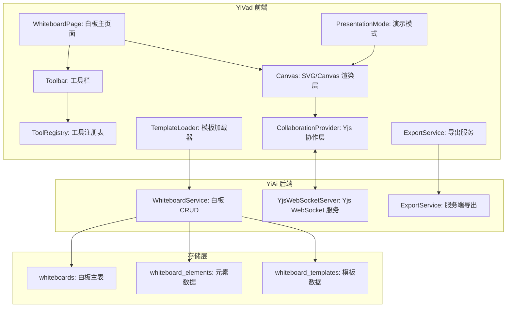

# YV-09-112: 协作白板 — 团队头脑风暴画布、画笔/形状/文本/便签工具、实时多人协作、导出图片/PDF、模板背景、演示模式

> 需求编号：YV-09-112 · 优先级：P2 · 人天：0.3d · 状态：需求已编写
> 依赖：无（可独立实现，但 STS-109 文档协作空间的 WebSocket 基础设施可复用）

## 背景

### 问题陈述

YiVad 团队的远程协作场景中有一个明确的空白——视觉化头脑风暴。当前团队的讨论工具是聊天（文本）+ 文档（结构化），但缺少一个自由形式的视觉协作空间。当团队需要画架构图、头脑风暴功能点子、或者做 Sprint 回顾的情绪图时，不得不切换到 Miro 或 Excalidraw 等外部工具。

1. **视觉协作缺失**：聊天不适合画图——"在用户头像旁边加一个齿轮图标"靠文字描述远不如在白板上画出来
2. **工具碎片化**：架构讨论在 YiVad，画图要到 Miro——上下文切换打断心流
3. **无持久画布**：在外部白板上画的内容无法关联到 YiVad 的项目/Issue
4. **演示困难**：Sprint Review 时需要展示架构变更——目前靠截图贴到 PPT
5. **无模板起点**：每次头脑风暴从空白画布开始，没有常用的模板（SWOT 分析、用户旅程图、回顾模板）

**核心矛盾**：视觉化思考是团队协作的核心需求，但 YiVad 作为团队协作平台缺少视觉协作工具——团队被迫使用外部工具，导致信息碎片化。

### 影响范围

| # | 影响 | 严重程度 | 典型场景 |
|---|------|----------|----------|
| 1 | 工具碎片化 | 高 | Sprint 回顾：Jira 看数据 + Miro 画图 + Confluence 写总结 |
| 2 | 架构讨论低效 | 高 | 在聊天中说"在那个服务右边加一个缓存层"——每个人脑补的画面不同 |
| 3 | 远程白板无集成 | 中 | 外部白板的内容无法关联到 YiVad 的 Issue/项目 |
| 4 | Sprint Review 演示碎片化 | 中 | 架构变更截图 → PPT → 远程共享——流程冗长 |
| 5 | 新人参与度低 | 中 | 语音会议中内向的人不愿意开口——在白板上贴便签可以匿名表达 |

### 挑战

| 挑战 | 说明 |
|------|------|
| Canvas 性能 | 大量图形元素（1000+ 便签/形状）需要在 Canvas 上高效渲染——选择 Canvas API vs SVG vs DOM |
| 实时同步 | 多人同时绘制/移动元素——CRDT 或 OT 算法的选择 |
| 工具丰富度 | 画笔/形状/文本/便签/图片/连线工具——每种工具有不同的交互模式 |
| 导出质量 | 画布可能很大（4000x4000 px）——导出为高质量图片或矢量的平衡 |
| 演示模式的动画 | 演示模式下元素需要有进入动画——与自由编辑模式的冲突 |

---

## 一、现状分析

### 1.1 当前视觉协作能力

```
现有功能:
├── Markdown 文档编辑（YV-09-109）
│   └── 结构化文本协作
├── Mermaid 图表渲染（文档中）
│   └── 代码转图表——架构图、流程图
├── 聊天消息中的图片
│   └── 静态图片分享

缺失:
├── 自由画布（无限/有限画布）                    # ❌ 不存在
├── 画笔/形状/文本/便签工具                       # ❌ 不存在
├── 多人实时协作画布                              # ❌ 不存在
├── 连线/箭头工具                                # ❌ 不存在
├── 白板模板（SWOT、用户旅程、回顾）              # ❌ 不存在
├── 导出为图片/PDF                                # ❌ 不存在
├── 演示模式（逐元素展示）                        # ❌ 不存在
├── 白板关联到项目/Issue                          # ❌ 不存在
├── 历史版本/撤销重做                             # ❌ 不存在
└── 便签投票/表情反馈                             # ❌ 不存在
```

### 1.2 白板协作工作流（现状 vs 目标）

```mermaid
graph TD
    subgraph Current["现状：外部工具"]
        C1[团队成员在 YiVad 聊天讨论] --> C2[某人说"我们画一下"]
        C2 --> C3[分享 Miro/Excalidraw 链接]
        C3 --> C4[团队切换到外部工具]
        C4 --> C5[画完 → 截图]
        C5 --> C6[回到 YiVad 聊天 → 粘贴截图]
        C6 --> C7[截图丢失上下文——过几天找不到]
    end

    subgraph Target["目标：内置白板"]
        T1[在项目/Issue 中创建白板] --> T2[白板在 YiVad 内打开]
        T2 --> T3[选择模板或空白画布]
        T3 --> T4[多人同时绘制/移动/标注]
        T4 --> T5[讨论结束后保存——白板关联到项目]
        T5 --> T6[后续可查看/编辑/导出]
        T6 --> T7[Sprint Review 时进入演示模式展示]
    end

    style Current fill:#f8d7da,stroke:#dc3545
    style Target fill:#d4edda,stroke:#28a745
```

### 1.3 根因矩阵

| 症状 | 根因 | 触发条件 | 频率 |
|------|------|----------|------|
| 画架构图时切换工具 | 无内置画布 | 每一次架构讨论 | 高 |
| 白板内容丢失 | 外部工具的链接失效或权限变更 | 跨 Sprint 回溯架构决策时 | 中 |
| 演示准备耗时 | 截图→粘贴→排版→PPT | Sprint Review 前 | 中 |
| 远程参与者沉默 | 无匿名便签方式 | 远程头脑风暴时 | 中 |
| 白板不关联项目 | 外部工具无集成 | 查找"上次架构讨论的白板"时 | 中 |

---

## 二、设计决策

### 决策 1：渲染引擎 — Canvas 2D vs SVG vs DOM + CSS vs WebGL

| 选项 | 大量元素性能 | 交互复杂度 | 文本渲染质量 | 导出质量 |
|------|------------|-----------|------------|---------|
| Canvas 2D API（原生像素渲染） | 高（10000+ 元素） | 高（需自行实现 hit testing） | 中（文本可读） | 中（位图导出） |
| SVG（矢量 DOM） | 中（1000 元素以内流畅） | 低（原生 DOM 事件） | 高（矢量文本） | 高（矢量导出） |
| DOM + CSS（HTML 元素绝对定位） | 低（500 元素以内） | 极低 | 高 | 中 |
| WebGL（Three.js/PixiJS） | 极高 | 极高 | 低（文本需纹理渲染） | 低 |

**选择：SVG + Canvas 混合。** 交互层使用 SVG——利用原生 DOM 事件处理拖拽/选中/缩放，文本渲染质量好。当元素数量超过阈值（> 500）时，渲染层切换为 Canvas 2D（将 SVG 元素绘制到 Canvas 上），利用 Canvas 的批量像素渲染性能。Excalidraw 使用的就是这种混合方案——交互时用 DOM，导出时用 Canvas。

### 决策 2：实时协作 — CRDT (Yjs) vs OT vs 操作日志广播

| 选项 | 冲突解决 | 离线支持 | 库成熟度 |
|------|---------|---------|---------|
| CRDT / Yjs | 自动（无冲突） | 天然支持 | 高（成熟开源） |
| OT（操作转换） | 需服务端转换 | 困难 | 低（需自研） |
| 操作日志广播（广播鼠标坐标） | 无（最后写入胜） | 不支持 | 极低（自研） |

**选择：Yjs + y-websocket。** Yjs 是成熟的 CRDT 库——自动处理并发冲突、支持离线编辑后自动合并、有 WebSocket 服务端实现。对于白板场景，使用 Yjs 的 `Y.Map` 存储元素数据（每个元素是一个键值对），多人同时创建/移动/删除元素自动合并。`y-websocket` 提供了开箱即用的 WebSocket 协作服务端。

### 决策 3：画布范围 — 无限画布 vs 固定尺寸 vs 混合

| 选项 | 自由度 | 导航难度 | 导出处理 |
|------|--------|---------|---------|
| 无限画布（可任意方向滚动） | 高 | 高（容易迷路） | 需裁剪或选择区域 |
| 固定尺寸（如 1920x1080） | 低 | 低（始终可见） | 简单 |
| 混合（默认 A3，可无限扩展） | 高 | 中（有初始锚点） | 中（选择导出区域） |

**选择：混合——默认 A3 尺寸 (297x420mm)，可无限扩展。** 纯无限画布会导致新用户迷失——不知道从哪里开始。默认 A3 尺寸像一张"纸"——提供心理锚点。用户可以使用拖拽或缩放超出 A3 边界，画布自动扩展。导出时默认导出有内容的包围盒区域，也可指定 A3/A4 固定尺寸。

### 决策 4：白板模板 — 纯客户端 vs 服务端存储 vs 内置模板库

| 选项 | 更新灵活性 | 社区贡献 | 与模板市场的集成 |
|------|-----------|---------|----------------|
| 纯客户端（硬编码 10 个模板） | 低（需发版） | 无 | 无 |
| 服务端存储（从数据库加载模板） | 高 | 中 | 可集成 |
| 内置模板库（服务端 + 客户端缓存） | 高 | 可接入模板市场（YV-09-111） | 可 |

**选择：内置模板库——10 个内置 + 可从市场安装。** 10 个内置模板覆盖常见场景（SWOT、用户旅程、回顾、架构图起点、Sprint 计划、流程图、思维导图、鱼骨图、甘特图草稿、自由画布）。未来与 YV-09-111 模板市场集成——社区可提交白板模板。

### 设计决策总结

| 决策 | 选项 A | 选项 B | 选项 C | 选择 | 理由 |
|------|--------|--------|--------|------|------|
| 渲染引擎 | Canvas 2D | SVG | DOM+CSS | **SVG+Canvas混合** | 交互友好+高性能 |
| 实时协作 | CRDT/Yjs | OT | 操作广播 | **Yjs+y-websocket** | 成熟+开箱即用 |
| 画布范围 | 无限 | 固定 | 混合 | **混合（默认A3）** | 锚点+自由度 |
| 模板方案 | 纯客户端 | 服务端 | 内置+市场 | **内置+市场集成** | 覆盖+可扩展 |

---

## 三、目标架构

### 3.1 协作白板系统架构



### 3.2 宣传模式工作流

```mermaid
graph TD
    A[用户点击"演示模式"] --> B[系统记录当前画布状态]
    B --> C[进入全屏模式]
    C --> D[创建演示帧序列]
    D --> E{帧创建方式}
    E -->|手动| F1[用户逐帧选择可见元素]
    E -->|自动| F2[按元素创建时间排序]
    F1 --> G[每帧: 上一帧 + 新出现的元素]
    F2 --> G
    G --> H[演示开始——逐帧播放]
    H --> I{操作}
    I -->|下一帧| J[显示下一组元素 + 过渡动画]
    I -->|上一帧| K[回到上一帧]
    I -->|退出| L[回到编辑模式]
    J --> I
    K --> I
```

### 3.3 性能指标

| 指标 | 目标值 | 说明 |
|------|--------|------|
| 白板初始化（空白） | < 500ms | Canvas 初始化 + Yjs 连接 + 工具注册 |
| 白板加载（500 元素） | < 1s | 从后端加载 + 渲染到 Canvas |
| 实时同步延迟（同域网） | < 100ms | Yjs WebSocket 传播延迟 |
| 画笔跟随延迟 | < 50ms | mousemove → Canvas 渲染 |
| 导出图片（4000x4000） | < 2s | 服务端 Puppeteer 或客户端 Canvas.toBlob |
| 演示模式切换 | < 200ms | 全屏 + 帧序列初始化 |

---

## 四、具体改动

### 4.1 核心类型定义

```typescript
// YiVad: src/views/whiteboard/types.ts (新增)

export type ToolType =
  | 'select'      // 选择/移动
  | 'pen'         // 画笔
  | 'rectangle'   // 矩形
  | 'ellipse'     // 椭圆
  | 'line'        // 直线
  | 'arrow'       // 箭头
  | 'text'        // 文本
  | 'sticky'      // 便签
  | 'image'       // 图片
  | 'eraser';     // 橡皮擦

export type ElementType = 'pen' | 'rectangle' | 'ellipse' | 'line' | 'arrow' | 'text' | 'sticky' | 'image';

export interface WhiteboardElement {
  id: string;
  type: ElementType;
  x: number;
  y: number;
  width: number;
  height: number;
  rotation: number;        // 度数 0-360
  opacity: number;          // 0-1
  locked: boolean;
  // 样式
  strokeColor: string;
  strokeWidth: number;
  fillColor: string;
  // 类型特定字段
  points?: number[];        // 画笔/折线的点数组
  text?: string;
  fontSize?: number;
  fontFamily?: string;
  imageUrl?: string;
  // 便签特定
  stickyColor?: string;     // 预设色: yellow/pink/blue/green/orange
  // CRDT 元数据
  createdBy: string;
  createdAt: number;
  updatedBy: string;
  updatedAt: number;
}

export interface Whiteboard {
  id: string;
  title: string;
  projectId?: string;
  issueId?: string;
  elements: Record<string, WhiteboardElement>;   // Yjs Y.Map
  canvasWidth: number;           // 默认 2970 (A3 宽 297mm * 10)
  canvasHeight: number;          // 默认 4200 (A3 高 420mm * 10)
  backgroundColor: string;
  templateId?: string;
  collaborators: string[];       // 当前在线用户
  version: number;
  createdBy: string;
  createdAt: string;
  updatedAt: string;
}

export interface ToolConfig {
  type: ToolType;
  icon: string;
  label: string;
  shortcut: string;
  cursor: string;
}

export interface PresentationFrame {
  id: string;
  elementIds: string[];         // 本帧新出现的元素
  note?: string;                // 演讲者备注
  transition: 'fade' | 'slide' | 'none';
}

export type ExportFormat = 'png' | 'jpeg' | 'svg' | 'pdf';
export type ExportScale = 1 | 2 | 3;

export interface ExportOptions {
  format: ExportFormat;
  scale: ExportScale;
  background: boolean;
  region?: 'content' | 'viewport' | 'full';
}

export interface WhiteboardTemplate {
  id: string;
  name: string;
  description: string;
  category: string;
  thumbnailUrl: string;
  elements: WhiteboardElement[];    // 模板预设元素
  canvasWidth: number;
  canvasHeight: number;
}

// 协作状态
export interface CollaborationState {
  connected: boolean;
  users: Map<string, {
    id: string;
    name: string;
    color: string;            // 用户光标颜色
    cursor?: { x: number; y: number };
    selectedElementIds: string[];
  }>;
}
```

### 4.2 白板工具注册表

```typescript
// YiVad: src/views/whiteboard/toolRegistry.ts (新增)

import type { ToolConfig, ToolType } from './types';

export const TOOLS: Record<ToolType, ToolConfig> = {
  select: { type: 'select', icon: 'pointer', label: '选择', shortcut: 'V', cursor: 'default' },
  pen: { type: 'pen', icon: 'pen', label: '画笔', shortcut: 'P', cursor: 'crosshair' },
  rectangle: { type: 'rectangle', icon: 'square', label: '矩形', shortcut: 'R', cursor: 'crosshair' },
  ellipse: { type: 'ellipse', icon: 'circle', label: '椭圆', shortcut: 'E', cursor: 'crosshair' },
  line: { type: 'line', icon: 'minus', label: '直线', shortcut: 'L', cursor: 'crosshair' },
  arrow: { type: 'arrow', icon: 'arrow-right', label: '箭头', shortcut: 'A', cursor: 'crosshair' },
  text: { type: 'text', icon: 'type', label: '文本', shortcut: 'T', cursor: 'text' },
  sticky: { type: 'sticky', icon: 'sticky-note', label: '便签', shortcut: 'S', cursor: 'copy' },
  image: { type: 'image', icon: 'image', label: '图片', shortcut: 'I', cursor: 'copy' },
  eraser: { type: 'eraser', icon: 'eraser', label: '橡皮擦', shortcut: 'D', cursor: 'cell' },
};

export const STICKY_COLORS = [
  { name: '黄色', value: '#FFF3B0' },
  { name: '粉色', value: '#FFD6E0' },
  { name: '蓝色', value: '#D4ECFF' },
  { name: '绿色', value: '#D1F7C4' },
  { name: '橙色', value: '#FFE0B2' },
];

export const BUILTIN_TEMPLATE_IDS = [
  'swot', 'user-journey', 'retrospective', 'architecture',
  'sprint-planning', 'flowchart', 'mindmap', 'fishbone',
  'gantt-draft', 'freeform',
];
```

### 4.3 文件变更清单

| 文件 | 操作 | 说明 |
|------|------|------|
| `YiVad: src/views/whiteboard/types.ts` | 新增 | 白板类型定义 |
| `YiVad: src/views/whiteboard/toolRegistry.ts` | 新增 | 工具注册表 |
| `YiVad: src/views/whiteboard/WhiteboardPage.vue` | 新增 | 白板主页面 |
| `YiVad: src/views/whiteboard/Canvas.vue` | 新增 | SVG/Canvas 渲染组件 |
| `YiVad: src/views/whiteboard/Toolbar.vue` | 新增 | 工具栏组件 |
| `YiVad: src/views/whiteboard/ElementRenderer.vue` | 新增 | 元素渲染器 |
| `YiVad: src/views/whiteboard/ExportDialog.vue` | 新增 | 导出对话框 |
| `YiVad: src/views/whiteboard/PresentationMode.vue` | 新增 | 演示模式组件 |
| `YiVad: src/views/whiteboard/TemplatePicker.vue` | 新增 | 模板选择器 |
| `YiVad: src/composables/useWhiteboardCollaboration.ts` | 新增 | Yjs 协作 composable |
| `YiVad: src/composables/useCanvasTools.ts` | 新增 | 工具交互 composable |
| `YiAi: services/whiteboard/whiteboard_service.py` | 新增 | 白板 CRUD 服务 |
| `YiAi: services/whiteboard/ws_server.py` | 新增 | Yjs WebSocket 服务端 |
| `package.json` | 修改 | 添加 yjs, y-websocket 依赖 |

---

## 五、实施步骤

| 步骤 | 操作 | 路径 | 验证 | 人天 |
|------|------|------|------|------|
| 1 | 定义类型和工具注册表 | `types.ts` + `toolRegistry.ts` | TypeScript 通过 | 0.02 |
| 2 | 实现 Canvas 渲染组件（SVG 模式） | `Canvas.vue` + `ElementRenderer.vue` | 矩形/椭圆/文本渲染 | 0.04 |
| 3 | 实现工具交互 composable | `useCanvasTools.ts` | 选择/移动/创建元素 | 0.04 |
| 4 | 实现工具栏 UI | `Toolbar.vue` | 工具切换 + 快捷键 | 0.02 |
| 5 | 添加 Yjs 协作层 | `useWhiteboardCollaboration.ts` | 多人画面同步 | 0.04 |
| 6 | 实现 Yjs WebSocket 服务 | `ws_server.py` | WebSocket 连接+传播 | 0.03 |
| 7 | 实现白板 CRUD 服务 | `whiteboard_service.py` | 创建/读取/更新/删除 | 0.02 |
| 8 | 实现导出功能 | `ExportDialog.vue` + 后端导出 | PNG/SVG/PDF 导出 | 0.03 |
| 9 | 实现演示模式 | `PresentationMode.vue` | 全屏+帧播放 | 0.03 |
| 10 | 实现模板选择器 | `TemplatePicker.vue` + 10 内置模板 | 模板预览+加载 | 0.02 |

**总人天：0.3d**

---

## 六、测试规格

### 场景 1：创建白板和基本绘制

**GIVEN** 用户在一个项目内点击"新建白板"
**WHEN** 选择"自由画布"模板，使用矩形工具绘制 3 个矩形，使用文本工具添加标题
**THEN** 3 个矩形和 1 个文本显示在画布上，可选中、移动、调整大小
**AND** 白板自动保存到 MongoDB，页面关闭后重新打开内容不变

### 场景 2：多人实时协作

**GIVEN** 用户 A 和用户 B 同时打开同一白板
**WHEN** A 创建一个蓝色便签并拖到画布中央，B 在同一时间创建红色便签
**THEN** 两个便签都出现在双方画布上——A 看到 B 的红色便签，B 看到 A 的蓝色便签
**AND** 每个用户的在线光标显示不同的颜色和名字
**AND** 当 A 选中一个元素时，B 看到该元素显示 A 的颜色边框

### 场景 3：导出为图片

**GIVEN** 白板上有 20 个元素分布在 2000x1500 区域内
**WHEN** 用户点击"导出 → PNG → 2x 缩放"
**THEN** 下载一个 4000x3000 的 PNG 图片，包含所有可见元素
**AND** 背景为白色（非透明），元素按原有颜色和位置渲染
**AND** 如果选择 SVG，则下载矢量格式（可无限缩放）

### 场景 4：演示模式

**GIVEN** 白板上有 5 个元素按时间顺序创建
**WHEN** 用户进入演示模式并选择"按创建顺序自动分帧"
**THEN** 系统创建 5 帧，每帧新增 1 个元素
**AND** 用户按 → 键逐帧播放，每帧带 fade 过渡动画
**AND** 演讲者备注面板显示在屏幕角落（仅自己可见）
**AND** 按 Esc 键退出演示模式回到编辑视图

### 场景 5：使用模板

**GIVEN** 用户打开模板选择器
**WHEN** 选择"SWOT 分析"模板
**THEN** 画布上自动放置：(1) 2x2 网格标题（优势/劣势/机会/威胁）；(2) 4 个便签区域对应每个象限；(3) 中央标题"SWOT 分析"
**AND** 模板元素可自由编辑、移动、删除（非锁定）
**AND** 用户可以在此基础上添加自己的内容

### 场景 6：撤销/重做

**GIVEN** 用户绘制了 5 个矩形，然后删除了第 3 个，又移动了第 4 个
**WHEN** 用户按 Ctrl+Z 3 次
**THEN** 第 1 次：恢复第 4 个矩形的位置
**AND** 第 2 次：恢复被删除的第 3 个矩形
**AND** 第 3 次：删除第 5 个矩形
**AND** 按 Ctrl+Shift+Z 可重做上述操作
**AND** 撤销/重做栈有多用户后缀——A 的撤销不撤销 B 的操作

---

## 七、风险与缓解

| 风险 | 概率 | 影响 | 缓解措施 |
|------|------|------|----------|
| Canvas 大量元素性能下降 | 中 | 高 | 虚拟化渲染——仅渲染视口内元素；500 元素阈值触发 Canvas 模式 |
| WebSocket 连接不稳定 | 中 | 中 | Yjs 自带重连+同步；离线期间编辑在本地暂存，重连后自动合并 |
| 不同浏览器渲染差异 | 中 | 低 | 固定画布坐标系统（px）；导出使用服务端 Puppeteer 统一渲染 |
| 并发编辑冲突（同一元素同时移动） | 中 | 中 | Yjs CRDT 自动解决——最终位置取决于最后提交的操作 |
| Yjs document 过大 | 低 | 中 | 限制元素数量 5000；超过提示用户"考虑拆分为多个白板" |

---

## 八、回滚策略

| 场景 | 回滚操作 | 影响 |
|------|----------|------|
| Yjs WebSocket 服务不可用 | 降级为单人编辑模式——关闭实时协作 | 失去多人协作功能 |
| Canvas 渲染性能问题 | 强制使用 SVG 模式——限制最大元素数 500 | 大画布编辑体验下降 |
| 导出服务器（Puppeteer）异常 | 使用客户端 Canvas.toBlob 导出 | 大画布导出可能内存不足 |
| 演示模式导致白板状态错乱 | 禁用演示模式——用户手动滚动+放大展示 | 失去演示动画 |

---

## 九、设计决策记录

### D-01：为什么选择 Yjs 而非自己实现协作？

自研实时协作有两种路径：OT（操作转换）和 CRDT。OT 的算法复杂度随功能增加而指数级增长——每个新操作类型都需要定义`transform`函数。Yjs 是一个 7 年+的开源项目，有活跃社区和大量实战验证，而且提供了 `y-websocket` 和 `y-indexeddb`（离线存储）等配套生态。直接使用 Yjs 意味着关注点从"实现协作算法"转移到"实现白板功能"。

### D-02：为什么便签有预设颜色而非自由选色？

白色板便签的 5 种预设颜色（黄/粉/蓝/绿/橙）够覆盖 90% 的用况。自由选色会增加颜色选择器 UI 复杂度，且会导致便签颜色过多——失去视觉组织（如"黄色 = 问题，蓝色 = 想法"的约定）。如果需要更多颜色，用户可以使用"形状 + 填充色"来实现任意颜色的矩形。

### D-03：为什么导出默认包含背景而非透明？

团队白板的典型使用场景是嵌入到文档或 PPT 中——白色背景可以无缝融入文档。透明背景在 PNG 导出中会导致暗色主题下不可见。如果用户需要透明背景（如叠放到其他图形上），可以在导出选项中选择"透明背景"。

### D-04：为什么演示模式按创建时间自动分帧而非手动定义帧？

手动帧定义能精确控制演播节奏，但需要额外的编辑操作——用户需要学习"如何定义帧"。自动按创建时间分帧利用了用户在白板上绘制时的自然顺序——通常画草图 → 补细节 → 标注 → 完成——这个顺序本身就是一种演示节奏。特殊场景下用户可以在手动模式中自定义帧。

---

## 十、可观测性

### 指标

| 指标 | 类型 | 说明 |
|------|------|------|
| `whiteboard.created` | Counter | 白板创建数 |
| `whiteboard.sessions` | Counter | 白板打开次数 |
| `whiteboard.collaborators_per_board` | Histogram | 每个白板的协作人数 |
| `whiteboard.elements_per_board` | Histogram | 每个白板的元素数 |
| `whiteboard.export` | Counter | 导出次数（按格式） |
| `whiteboard.canvas_mode` | Counter | Canvas 模式切换次数 |
| `ws.connections` | Gauge | WebSocket 连接数 |

### 告警

| 告警 | 条件 | 级别 |
|------|------|------|
| WebSocket 连接数过高 | 连接 > 200 | WARN |
| 单白板元素数过高 | 元素 > 3000 | INFO |
| Yjs 同步延迟过高 | P99 > 500ms | WARN |

---

## 十一、代码审查检查清单

- [ ] Canvas: SVG 元素使用 `transform` 而非修改 x/y 避免 layout thrashing
- [ ] Canvas: 500 元素阈值触发 Canvas 模式（虚拟化渲染）
- [ ] ElementRenderer: 便签文本自动换行（基于宽度计算）
- [ ] ToolRegistry: 快捷键在输入框聚焦时禁用（防止文本输入冲突）
- [ ] useWhiteboardCollaboration: Yjs provider 连接失败时显示"离线模式"提示
- [ ] useWhiteboardCollaboration: 用户光标位置用 `awareness` 而非同步到 document
- [ ] useCanvasTools: 橡皮擦工具检测与元素包围盒的碰撞
- [ ] ExportDialog: 导出 SVG 时排除隐藏元素和锁定标记
- [ ] PresentationMode: 全屏 API 需要用户手势触发（浏览器限制）
- [ ] TemplatePicker: 10 个内置模板的 SVG 数据嵌入为 base64（不依赖外部资源）
- [ ] WhiteboardPage: 离开页面时保存脏数据（`onBeforeUnload`）
- [ ] ws_server: 配置 CORS 和最大并发连接数

---

## 回归问题预测

| # | 预测问题 | 原因 | 验证方法 |
|---|---------|------|---------|
| 1 | 白板导出图片中文本字体缺失——用户使用了一种仅在本地存在的字体（如"思源黑体"），服务端 Puppeteer 渲染时找不到该字体 | SVG/Canvas 导出在客户端使用本地字体，服务端 Puppeteer 的环境字体集不同 | 导出时嵌入字体 CSS（@import Google Fonts）或限制字体为 web-safe 列表；服务端渲染时用 Noto Sans SC 作为 fallback |
| 2 | Yjs 的 `awareness` 在用户快速切换白板时残留——用户从白板 A 切换到白板 B，但 awareness 还连接到 A 的 room | y-websocket 的 room 切换需要手动调用 `disconnect` 和 `connect`——Vue 组件销毁时可能未正确清理 | 在 `onUnmounted` 中显式调用 `awareness.destroy()` 和 `provider.disconnect()`；使用 `beforeRouteLeave` 导航守卫 |
| 3 | 用户画了一个大矩形在缩放 10% 的画布上，导出 2x 时这个矩形的边框变成锯齿状 | 导出缩放是基于 Canvas 的 `scale()` 方法——缩放因子应用于像素渲染，不是矢量渲染（SVG 模式下） | 导出时使用 SVG 模式（矢量放大）——即使编辑时用 Canvas 渲染，导出也优先用 SVG |
| 4 | 多个用户同时向画布边缘拖拽元素——画布自动扩展的逻辑可能触发多次，导致扩展过度 | 每个用户的操作都会触发"检测元素是否超出边界 → 扩展画布"——如果 A 和 B 的编辑同时到达，可能扩展两次 | 扩展操作使用 Yjs 的 `doc.transact()` 包裹——确保单次事务内只扩展一次；扩展后记录新尺寸，下次检查基于新尺寸 |
| 5 | 演示模式中用户修改了元素——自动生成的帧序列需要重新生成或失效 | 演示帧是快照（存储元素 ID 列表），如果元素被删除/修改了内容——帧渲染的可能是错误的内容 | 进入演示模式后禁止编辑（只读模式）；退出演示模式时提示"帧序列基于进入演示模式时的状态" |
| 6 | 白板模板的 SVG 数据随内置模板硬编码——10 个模板的 SVG 内联数据约 200KB，增加前端 bundle 大小 | 10 个模板每个包含 20-50 个预设元素的完整数据（坐标/样式/文本） | 模板数据懒加载——仅加载当前选中的模板数据（从后端 API 获取）；或使用 JSON 压缩（去空格） |

---

## 性能分析

### 各阶段耗时

| 阶段 | 预估耗时 | 说明 |
|------|----------|------|
| 白板初始化（空白模板） | < 300ms | Canvas + Yjs 初始化 |
| 白板加载（500 元素） | < 800ms | 数据加载 + SVG 渲染 |
| 创建元素（画笔一笔） | < 16ms | SVG 元素插入 |
| 拖拽移动（mousemove） | < 10ms | transform 更新（GPU 加速） |
| Yjs 同步（局域网） | < 50ms | WebSocket round-trip |
| 导出 PNG（4000x4000 2x） | < 2s | 客户端 toBlob 或服务端 Puppeteer |
| 演示模式切换 | < 150ms | requestFullscreen + 帧初始化 |
| 撤销操作 | < 10ms | Yjs undoManager 堆栈操作 |

### 体积预估

| 文件 | 大小 | 说明 |
|------|------|------|
| 前端 types | ~5KB | 白板类型+工具注册表 |
| Canvas.vue + ElementRenderer.vue | ~8KB | 渲染核心 |
| useWhiteboardCollaboration.ts | ~3KB | Yjs 封装 |
| useCanvasTools.ts | ~4KB | 工具交互逻辑 |
| Vue 组件（6 个） | ~15KB | 页面+工具栏+导出+演示+模板 |
| yjs + y-websocket npm 包 | ~150KB(gzip ~40KB) | 协作依赖 |
| YiAi: whiteboard_service.py | ~3KB | CRUD 服务 |
| YiAi: ws_server.py | ~2KB | WebSocket 服务端 |
| 10 个内置模板数据 | ~20KB | 模板元素 JSON |
| **总计** | **~60KB** + **~40KB(gzip)** | 不含 Yjs 的 ~80KB 自研代码 + Yjs ~150KB |

