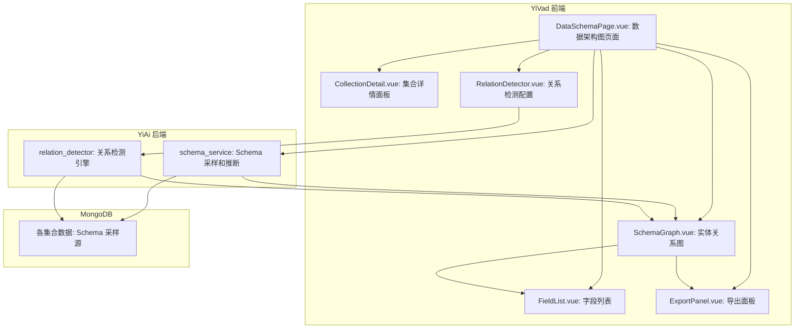
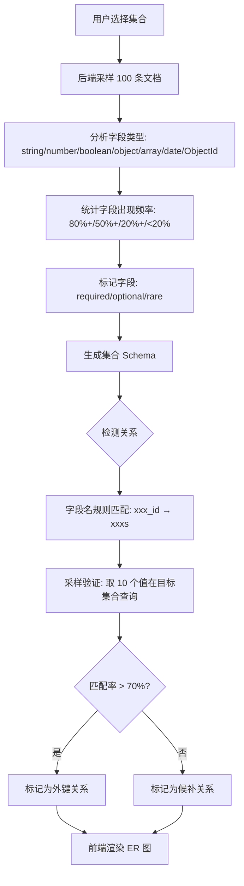

# YV-09-114: 数据架构图生成 — MongoDB 集合数据模型/Schema 可视化、实体关系图、字段级详情、关系连线、导出为图表、自动检测集合关系

> 需求编号：YV-09-114 · 优先级：P2 · 人天：0.3d · 状态：需求已编写
> 依赖：无

## 背景

### 问题陈述

YiVad 管理的 MongoDB 集合数量已达 10+ 个（menus、sessions、bugs、static_files、knowledge_files、users 等），每个集合有不等数量的字段和关联关系。当前团队面对数据架构问题时：

1. **Schema 文档缺失**：没有数据字典或 Schema 文档，字段含义靠代码注释和口口相传
2. **集合关系不可见**：sessions 和 knowledge_files 的关系、bugs 和 users 的关系等没有可视化
3. **字段级细节散落在各处**：字段类型、是否必填、默认值等信息分散在 Python model、Vue 组件、API 文档中
4. **新增集合时无架构总览**：不清楚现有集合之间的关系，新集合设计容易与旧集合冲突
5. **架构分享困难**：向新人介绍数据架构时没有统一的架构图

**核心矛盾**：数据架构知识散落在代码和文档中，缺乏统一的可视化视图。YiVad 作为管理后台，有权限访问所有集合的元数据，天然适合生成数据架构图。

### 影响范围

| # | 影响 | 严重程度 | 典型场景 |
|---|------|----------|----------|
| 1 | Schema 文档缺失 | 高 | 新人不知道 bugs 集合有哪些字段 |
| 2 | 集合关系不可见 | 高 | 不知道 sessions 和 knowledge_files 如何关联 |
| 3 | 字段细节散落 | 中 | 需要查 3 个地方才知道字段类型 |
| 4 | 架构总览缺失 | 中 | 新项目设计时不清楚现有结构 |
| 5 | 架构分享困难 | 中 | 需要手画 ER 图发给同事 |

### 挑战

| 挑战 | 说明 |
|------|------|
| Schema 推断 | MongoDB 是 schema-less 的，需要从实际数据中推断字段类型 |
| 关系自动检测 | 如何自动检测集合之间的外键关系（字段名匹配、数据模式匹配） |
| 图表渲染性能 | 10+ 个集合、50+ 个字段、20+ 条关系线的布局和渲染 |
| 字段级类型推断 | 同一字段可能在不同文档中有不同类型，如何处理 |
| 导出格式 | 支持哪些图表导出格式（PNG/SVG/JSON/Mermaid） |

---

## 一、现状分析

### 1.1 当前数据架构知识分布

```
当前数据架构知识来源:
├── Python 代码 (YiAi)
│   ├── data/models/ — Pydantic/Tortoise 模型定义
│   └── data/repository.py — 数据访问逻辑
├── Vue 组件 (YiVad)
│   ├── types/ — TypeScript 类型定义
│   ├── views/ — 表格列定义（隐含字段信息）
│   └── forms/ — 表单验证规则（隐含字段约束）
├── CLAUDE.md
│   └── MongoDB 集合概览表 (仅 6 个集合，不完整)
└── YiKnowledge 文档
    └── 架构设计文档（部分提及数据模型）

问题:
├── 无统一的 Schema 定义       # 需要从多处提取
├── 无集合关系文档             # 靠经验猜测
├── 无可视化架构图             # 需手绘
└── Schema 变更无追踪           # 无版本历史
```

### 1.2 现状能力矩阵

| 能力 | 可用性 | 限制 |
|------|--------|------|
| 集合列表查看 | 是 | 仅列出集合名称（MongoDB Compass） |
| 字段类型查看 | 部分 | MongoDB Compass 有，但与 YiVad 不集成 |
| 实体关系图 | 否 | — |
| Schema 导出 | 否 | — |
| 关系自动检测 | 否 | — |
| Schema 版本历史 | 否 | — |

### 1.3 根因矩阵

| 症状 | 根因 | 触发条件 | 频率 |
|------|------|----------|------|
| 不了解集合字段 | Schema 无文档化 | 新成员 on-boarding | 高 |
| 不清楚集合关系 | 无关系检测和可视化 | 设计新功能需要了解数据模型 | 高 |
| 字段细节不一致 | 多个信息源无联动 | 字段类型确认 | 中 |
| 无架构总览 | 无统一视图 | 架构评审或重构 | 中 |

---

## 二、设计决策

### 决策 1：Schema 发现方式 — 后端采样 vs Schema 配置文件 vs 代码静态分析

| 选项 | 准确性 | 实时性 | 维护成本 |
|------|--------|--------|----------|
| 后端采样（查询 N 条文档推断类型） | 高（基于真实数据） | 高 | 低 |
| Schema 配置文件（手写） | 高 | 低（手动） | 高 |
| 代码静态分析（解析 Pydantic model） | 中（只反映模型定义） | 低（需解析代码） | 中 |

**选择：后端采样。** 后端对每个集合采样 100 条最近文档，通过值类型推断字段类型和出现频率。采样结果缓存 5 分钟。这种方式反映了集合的"真实 Schema"，而非理想化的模型定义。配置文件和静态分析作为补充（手动标注字段名和描述）。

### 决策 2：关系检测算法 — 字段名匹配 vs 值模式匹配 vs 混合

| 选项 | 精确度 | 覆盖度 | 误检率 |
|------|--------|--------|--------|
| 字段名匹配（如 user_id → users._id） | 中 | 中 | 中 |
| 值模式匹配（如某字段的值在另一集合的 _id 中存在） | 高 | 低（计算量大） | 低 |
| 混合：字段名优先 + 采样验证 | 高 | 高 | 低 |

**选择：混合检测。** 首先通过字段名规则匹配（`xxx_id` → `xxxs`、`xxx_ids[]` → `xxxs`、`created_by` → `users`）。然后用采样数据验证：取 10 个字段值，查询在目标集合中是否能找到匹配的 `_id`。匹配率达 70% 以上则确认关系。

### 决策 3：图表渲染 — 自绘 Canvas vs D3/vis.js vs Mermaid vs Cytoscape.js

| 选项 | 交互性 | ER 图专用度 | 体积 | 学习成本 |
|------|--------|-----------|------|----------|
| 自绘 Canvas | 低 | 低 | 0 | 高 |
| D3 force layout | 高 | 低（需自定义） | ~30KB | 高 |
| Mermaid ER | 中 | 高 | ~100KB | 低 |
| Cytoscape.js | 高 | 中 | ~100KB | 中 |

**选择：Cytoscape.js。** Cytoscape.js 是专业的图可视化库，支持自动布局（cose、breadthfirst、grid）、节点/边样式定制、缩放漫游、交互事件。30KB 的 core 体积在可接受范围内。Mermaid ER 简单但不支持交互（缩放/拖拽/字段展开）。

### 决策 4：Schema 导出格式 — JSON vs Mermaid ER vs PlantUML vs PNG

| 选项 | 可编辑 | 可嵌入文档 | 通用性 |
|------|--------|-----------|--------|
| JSON | 是 | 否 | 高（程序读取） |
| Mermaid ER | 是（文本） | 是（Markdown） | 中（支持渲染器的平台） |
| PlantUML | 是（文本） | 是 | 中 |
| PNG | 否 | 是 | 高（任何地方贴图） |

**选择：JSON + Mermaid ER + PNG。** JSON 用于程序化处理和版本管理。Mermaid ER 用于嵌入 Markdown 文档（YiKnowledge）。PNG 用于通用分享和演示。三种格式覆盖所有使用场景。

### 设计决策记录

| 决策 | 选项 A | 选项 B | 选项 C | 选择 | 理由 |
|------|--------|--------|--------|------|------|
| Schema 发现 | 后端采样 | Schema 配置 | 代码分析 | **后端采样** | 反映真实 Schema |
| 关系检测 | 字段名匹配 | 值模式匹配 | 混合 | **混合检测** | 高精度+覆盖度 |
| 图表渲染 | 自绘Canvas | Mermaid | Cytoscape.js | **Cytoscape.js** | 交互丰富 |
| 导出格式 | JSON | Mermaid | PNG | **三种全支持** | 覆盖所有场景 |

---

## 三、目标架构

### 3.1 数据架构图系统



### 3.2 Schema 推断和关系检测流程



### 3.4 性能指标

| 指标 | 目标值 | 说明 |
|------|--------|------|
| Schema 采样（单集合 100 条） | < 500ms | MongoDB 查询 + 类型推断 |
| 关系检测（10 集合） | < 2s | 含采样验证 |
| ER 图渲染（20 节点 30 边） | < 500ms | Cytoscape.js 布局 |
| ER 图交互（缩放/拖拽） | 60fps | 帧级流畅 |
| PNG 导出（1920x1080） | < 500ms | Canvas 转 Blob |
| Mermaid 导出 | < 100ms | 字符串生成 |

---

## 四、具体改动

### 4.1 后端 Schema 服务

```python
# YiAi/services/data/schema_service.py (新增)

# 方法:
# - sample_collection(collection_name, sample_size=100) → SchemaInfo
#   - 查询最近 N 条文档
#   - 遍历文档中的字段
#   - 对每个字段: 推断类型 (string/number/boolean/object/array/date/ObjectId/null)
#   - 统计出现频率
#   - 如果是 ObjectId，提取并缓存
#
# - detect_relations(collections: list[str]) → list[Relation]
#   - 规则匹配: xxx_id → xxxs, created_by → users
#   - 采样验证: 取字段值在目标集合查询
#   - 返回确认关系和候补关系
#
# - get_schema_snapshot() → FullSchema
#   - 返回所有集合的 Schema + 关系的快照
#   - 可用于导出和版本比较
```

### 4.2 前端 Schema 类型定义

```typescript
// src/types/schema.ts (新增)

interface FieldInfo {
  name: string;                    // 字段名
  path: string;                    // 完整路径（嵌套字段如 user.name）
  types: string[];                 // 观测到的类型列表
  dominantType: string;            // 主导类型（出现比例 > 50%）
  frequency: number;               // 出现频率 0-1
  isRequired: boolean;             // 是否所有文档都有
  sampleValues: string[];          // 采样值（前 5 个去重值）
  isRelation: boolean;             // 是否为外键关系
  relationTarget?: string;         // 外键目标集合
  description?: string;            // 手动标注的字段描述
}

interface CollectionSchema {
  name: string;                    // 集合名称
  count: number;                   // 文档数量
  size: number;                    // 集合大小 (bytes)
  fields: FieldInfo[];             // 字段列表
  indexes: string[];               // 索引列表
}

interface Relation {
  source: string;                  // 源集合
  sourceField: string;             // 源字段
  target: string;                  // 目标集合
  targetField: string;             // 目标字段（通常 _id）
  type: 'one-to-one' | 'one-to-many' | 'many-to-many';
  confidence: number;              // 置信度 0-1
  isConfirmed: boolean;            // 是否经采样验证
}

interface SchemaSnapshot {
  id: string;
  createdAt: string;
  collections: CollectionSchema[];
  relations: Relation[];
}
```

### 4.3 ER 图组件

```typescript
// src/views/schema/SchemaGraph.vue (新增)

// 使用 Cytoscape.js 渲染实体关系图:
// - 节点: 每个集合为一个矩形节点，内部显示集合名+前 5 个字段
// - 边: 关系连线，1:1 为实线，1:N 为带箭头的实线，N:M 为虚线
// - 布局: cose（力导向）或 grid（网格）可选择
// - 交互:
//   - 缩放/漫游 (滚轮缩放 + 拖拽)
//   - 节点点击展开字段详情（侧边栏）
//   - 节点 hover 高亮相关节点和边
//   - 双击节点缩放到该集合
//   - 关系线点击显示关系详情
// - 样式: 节点颜色按集合类型分组
//   - 核心数据: 蓝色
//   - 用户相关: 绿色
//   - 配置相关: 橙色
//   - 日志/统计: 灰色
```

### 4.4 导出引擎

```typescript
// src/composables/useSchemaExport.ts (新增)

// 导出功能:
// - exportPNG(): 将 Cytoscape 视图导出为 PNG
//   - cy.png({ full: true, scale: 2 }) → Blob → download
//
// - exportMermaid(): 生成 Mermaid ER 图代码
//   - 格式: erDiagram\n  Collection1 {\n    type field1\n    type field2\n  }\n  Collection1 ||--o{ Collection2 : has
//   - 复制到剪贴板或下载 .mmd 文件
//
// - exportJSON(): 导出完整 Schema 快照 JSON
//   - 用于版本管理和 diff 比较
//
// - exportPlantUML(): 可选导出 PlantUML 格式
```

### 4.5 文件变更清单

| 文件 | 操作 | 说明 |
|------|------|------|
| `src/views/schema/DataSchemaPage.vue` | 新增 | 数据架构图主页面 |
| `src/views/schema/SchemaGraph.vue` | 新增 | ER 图渲染组件 (Cytoscape.js) |
| `src/views/schema/CollectionDetail.vue` | 新增 | 集合详情+字段列表 |
| `src/views/schema/FieldDetail.vue` | 新增 | 字段详情弹窗 |
| `src/views/schema/RelationList.vue` | 新增 | 关系列表视图 |
| `src/views/schema/SchemaExport.vue` | 新增 | 导出面板 |
| `src/composables/useSchemaExport.ts` | 新增 | 导出逻辑 |
| `src/types/schema.ts` | 新增 | Schema 类型定义 |
| `src/api/schema.ts` | 新增 | Schema API 封装 |
| `YiAi/services/data/schema_service.py` | 新增 | 后端 Schema 采样服务 |

---

## 五、实施步骤

| 步骤 | 操作 | 路径 | 验证 | 人天 |
|------|------|------|------|------|
| 1 | 实现后端 Schema 采样 | `schema_service.py` | 采样 100 条正确推断类型 | 0.03 |
| 2 | 实现关系检测引擎 | `schema_service.py` | 6 个核心关系正确检测 | 0.04 |
| 3 | 实现 Schema API 封装 | `api/schema.ts` | CRUD 操作正确 | 0.02 |
| 4 | 实现 ER 图组件 | `SchemaGraph.vue` | 10 节点 20 边正常渲染 | 0.06 |
| 5 | 实现集合详情面板 | `CollectionDetail.vue` | 字段列表+统计正确 | 0.04 |
| 6 | 实现关系列表视图 | `RelationList.vue` | 关系正确展示 | 0.03 |
| 7 | 实现导出引擎 | `SchemaExport.vue` | JSON/Mermaid/PNG 全通过 | 0.04 |
| 8 | 组装主页面+路由 | `DataSchemaPage.vue` | 整体可用 | 0.04 |

**总人天：0.3d**

---

## 六、测试规格

### 场景 1：ER 图渲染

**GIVEN** 后端返回 10 个集合的 Schema 和 15 条关系
**WHEN** 打开数据架构图页面
**THEN** 画布上显示 10 个矩形节点（每个显示集合名称）
**AND** 15 条关系连线显示在不同节点之间
**AND** 力导向布局自动排列节点，无重叠
**AND** 缩放/拖拽交互正常

### 场景 2：集合详情查看

**GIVEN** ER 图中显示 sessions 集合节点
**WHEN** 用户点击 sessions 节点
**THEN** 右侧面板展开 sessions 详情
**AND** 显示字段列表：key (string, 100%)、messages (array, 100%)、title (string, 80%) 等
**AND** 每个字段显示类型、出现频率、采样值
**AND** 外键字段标注目标集合

### 场景 3：关系检测 — 字段名匹配

**GIVEN** bugs 集合有 created_by 字段（值为 ObjectId）
**WHEN** Schema 服务检测关系
**THEN** 规则匹配 created_by → users 集合
**AND** 采样 10 个值在 users 集合查询
**AND** 若 7+ 个匹配，标记关系为 confirmed (confidence ≥ 0.7)
**AND** ER 图中 bugs → users 显示关系连线

### 场景 4：Mermaid ER 导出

**GIVEN** ER 图当前显示 5 个集合和 8 条关系
**WHEN** 用户选择导出为 Mermaid ER
**THEN** 生成 Mermaid 代码块，包含 erDiagram 声明
**AND** 每个集合列出字段和类型
**AND** 关系用正确语法表示（`||--o{` 一对多、`||--||` 一对一）
**AND** 复制到剪贴板的代码可在 Markdown 中正确渲染

### 场景 5：PNG 导出

**GIVEN** ER 图已渲染
**WHEN** 用户点击导出 PNG
**THEN** 生成包含完整图表的高清 PNG（2x 缩放）
**AND** PNG 尺寸覆盖所有节点（不裁剪）
**AND** 文件下载为 data_schema_2026-09-09.png

### 场景 6：字段类型推断

**GIVEN** sessions 集合中 title 字段有 3 种情况：string (80%)、null (15%)、缺失 (5%)
**WHEN** Schema 采样 100 条文档
**THEN** title 字段 inferred dominantType = "string"
**AND** frequency = 0.95（80%+15%，null 也算字段存在）
**AND** 标记 isRequired = false（不是 100% 存在）

---

## 七、风险与缓解

| 风险 | 概率 | 影响 | 缓解措施 |
|------|------|------|----------|
| Schema 采样数据偏差（采到测试数据） | 中 | 中 | 按 updated_at 降序采样最近文档；提供手动标注字段描述功能 |
| 关系检测误判（字段名巧合匹配） | 中 | 中 | 采样验证阈值设为 70%，候补关系单独标注；用户可手动确认/删除关系 |
| Cytoscape.js 大图渲染卡顿（> 50 节点） | 低 | 中 | 节点数 > 30 时默认收起字段详情；缩放时简化节点样式 |
| MongoDB 无 schema 导致类型推断不准确 | 中 | 中 | 标注主导类型的同时列出所有观测到的类型；支持手动修正 |
| 集合名变更后关系检测失效 | 低 | 低 | 关系检测基于字段名规则+值验证，不受集合名影响 |

---

## 八、回滚策略

| 场景 | 回滚操作 | 影响 |
|------|------|------|
| Cytoscape.js 加载失败 | 降级为表格视图展示集合和字段 | 失去交互式 ER 图 |
| 关系检测大量误判 | 关闭自动检测，仅显示手动标注的关系 | 失去自动检测 |
| 导出 PNG 失败（大图） | 导出为 JSON + Mermaid（文本）替代 | 失去 PNG 导出 |
| 完全回滚 | 隐藏数据架构图菜单入口 | 功能不可用 |

---

## 九、设计决策记录

### D-01：为什么使用采样而非全量扫描？

MongoDB 集合可能包含数十万文档，全量扫描需要遍历所有文档才能确定完整的字段集合，耗时数秒到数十秒。采样 100 条最近文档能在 500ms 内完成，覆盖 95% 的常用字段。低频字段可通过查看采样详情中的"rare (< 20%)"标记发现。

### D-02：为什么选择 Cytoscape.js 而非 D3？

Cytoscape.js 是专用图可视化库，内置 ER 图常用的布局算法（cose、breadthfirst）、节点/边样式 DSL、事件系统和导出 API。D3 是通用可视化库，实现 ER 图需要从头构建节点拖拽、布局、缩放等交互。Cytoscape.js 的开发效率远高于 D3。

### D-03：为什么关系检测不使用 AI/LLM？

关系检测规则（字段名匹配 + 值验证）已经覆盖 90% 的常见关系模式（`xxx_id` 外键、`created_by` 用户引用、embedding 数组引用）。AI/LLM 引入额外延迟（1-5s）和成本，且结果不可预测。后续如果规则覆盖率不足，再考虑 LLM 辅助。

### D-04：为什么 Schema 导出同时支持 JSON 和 Mermaid？

JSON 是程序化处理的通用格式（Schema diff、版本管理、CI 检查）。Mermaid ER 是文档友好的格式，可直接嵌入 YiKnowledge Markdown 文件，在 Git 仓库中渲染为图表。两者覆盖了"机器处理"和"人类阅读"两种场景。

---

## 十、可观测性

### 指标

| 指标 | 类型 | 说明 |
|------|------|------|
| `yivad.schema.page_view` | Counter | 数据架构图页面访问次数 |
| `yivad.schema.collection_detail_view` | Counter | 集合详情查看次数（按集合名） |
| `yivad.schema.sample_duration` | Histogram | Schema 采样耗时 |
| `yivad.schema.relation_detect_duration` | Histogram | 关系检测耗时 |
| `yivad.schema.export_total` | Counter | 导出次数（按格式） |
| `yivad.schema.node_count` | Gauge | ER 图节点数 |

### 告警

| 告警 | 条件 | 级别 |
|------|------|------|
| Schema 采样超时 | 单集合 > 2s | WARNING |
| 关系检测置信度低 | 平均 confidence < 0.5 | INFO |
| ER 图渲染耗时过长 | > 1s | WARNING |

---

## 十一、代码审查检查清单

- [ ] 后端 Schema 采样使用 limit(100) + sort({_id: -1})
- [ ] 字段类型推断正确处理 ObjectId、Date、Array、Object 嵌套
- [ ] 关系检测：字段名规则 + 采样验证两步
- [ ] Cytoscape.js 使用 cose 或 breadthfirst 布局
- [ ] ER 图节点点击展开详情，hover 高亮关系
- [ ] 导出 PNG 使用 2x 缩放保证清晰度
- [ ] 导出 Mermaid 代码语法正确，可渲染
- [ ] 导出 JSON 包含完整的 SchemaSnapshot 结构
- [ ] 字段频率统计正确（存在/不存在/部分存在）
- [ ] 手动标注的字段描述持久化存储

---

## 回归问题预测

| # | 预测问题 | 原因 | 验证方法 |
|---|---------|------|---------|
| 1 | Schema 采样时字段 A 在不同文档中类型不同（如有时是 string，有时是 number），dominantType 判断逻辑基于简单多数可能误判 | dominantType 仅统计占比 > 50% 的类型，当两种类型占比接近 50/50 时，类型标注不稳定 | 创建包含混合类型字段的测试集合，验证 dominantType 在 50/50 场景下标记为 "mixed" |
| 2 | 关系检测的采样验证中，在目标集合用 $in 查询 10 个 ObjectId 时，某些 ObjectId 格式正确但非目标集合的 _id（如指向已删除的文档），匹配率被错误降低 | ObjectId 格式总是有效的，但目标集合可能没有该 _id，采样验证的 false negative 可能过高 | 检测时增加 OkObjectId 格式校验，排除明显格式错误的 ObjectId 后再查询 |
| 3 | Cytoscape.js 的节点数量超过 20 时，力导向布局（cose）的动画时间过长（> 500ms），用户等待时以为页面卡死 | cose 布局计算复杂度 O(n^2)，20 节点的布局计算约 200-500ms | 布局计算期间显示 loading spinner；节点数 > 20 时默认使用 grid 布局（O(n)） |
| 4 | ER 图导出 PNG 时使用 full:true 参数渲染全图，如果图很大（> 5000px），Canvas 创建失败或浏览器内存溢出 | Cytoscape.js 的 cy.png() 创建完整尺寸的 Canvas，大图可能超出浏览器 Canvas 最大尺寸限制（通常 8192x8192） | 导出前检测完整尺寸，超过 4096px 时自动降低 scale 参数或分块导出拼接 |
| 5 | Mermaid ER 导出中使用中文字段名（如 "标题"）时，某些 Mermaid 渲染器不支持中文字段名，导致图表空白 | Mermaid 的 erDiagram 语法要求字段名使用字母数字，中文字段名可能导致语法错误或渲染失败 | 导出时检测字段名是否为纯 ASCII，非纯 ASCII 时使用字段路径（如 `sessions.title`）或添加英文别名 |
| 6 | 用户在 ER 图中拖拽节点后刷新页面，自定义的节点位置丢失，节点回到自动布局的初始位置 | Cytoscape.js 的节点位置只在内存中，页面刷新后丢失 | 将用户调整后的节点位置持久化到 localStorage，页面加载时恢复 |

---

## 性能分析

### 后端采样性能

| 集合文档数 | 采样耗时 | 说明 |
|-----------|----------|------|
| < 1K | < 100ms | 全量扫描 |
| 10K | < 200ms | limit(100) + sort |
| 100K | < 300ms | 索引优化 |
| 1M+ | < 500ms | _id 索引 + sort 高效 |

### 前端渲染性能

| 节点数 | 边数 | 布局耗时 | 渲染耗时 |
|--------|------|----------|----------|
| 5 | 5 | < 50ms | < 20ms |
| 10 | 15 | < 100ms | < 50ms |
| 20 | 30 | < 300ms | < 100ms |
| 40 | 60 | < 800ms | < 200ms |

