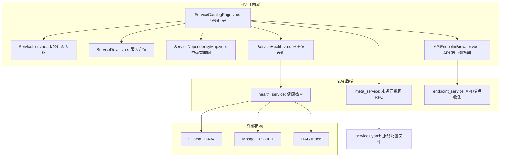
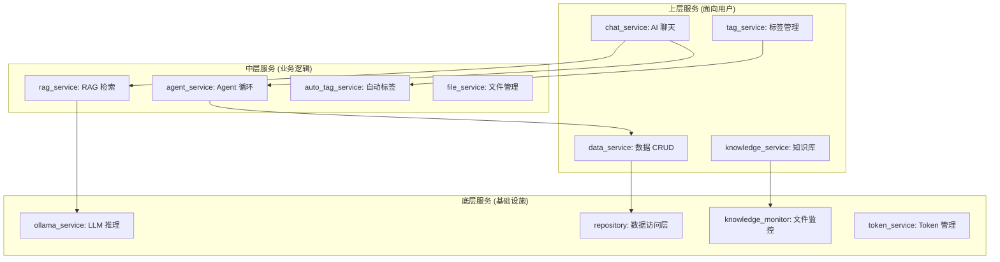

# YV-09-115: 服务目录 — 微服务/API服务目录、服务列表含健康/负责人/版本、服务依赖地图、API端点浏览器、服务文档链接、服务归属追踪

> 需求编号：YV-09-115 · 优先级：P2 · 人天：0.3d · 状态：需求已编写
> 依赖：YV-09-114（数据架构图生成）

## 背景

### 问题陈述

YiAi 后端采用模块化架构（services/ai/、services/data/、services/tag/、domain/auth/ 等 10+ 个服务模块），YiVad 前端也依赖多个后端端点（RPC 信封路由、文件读写端点、知识库端点、RAG 端点等）。当前团队在服务管理上存在以下问题：

1. **服务清单缺失**：没有统一的服务目录，不知道后端有哪些服务模块、各模块的职责边界
2. **服务依赖不透明**：不清楚哪些服务调用哪些服务（如 chat_service 依赖 ollama_service + rag_service）
3. **API 端点分散**：RPC 端点（`services.xxx.method`）、REST 端点（`/read-file`、`/write-file`）、知识库端点（`/knowledge/*`）散落在各处
4. **服务健康不可见**：Ollama 是否在线、MongoDB 是否连接正常、RAG 索引是否就绪——没有统一健康面板
5. **归属缺失**：新成员不知道哪个服务由哪个团队负责，问题应该找谁
6. **服务版本无追踪**：服务模块更新后，没有版本记录和变更日志

**核心矛盾**：服务数量在增长（从 5 个到 10+），但服务治理（清单、依赖、归属、健康）完全依赖人工记忆和文档。

### 影响范围

| # | 影响 | 严重程度 | 典型场景 |
|---|------|----------|----------|
| 1 | 无服务清单 | 高 | 看不到完整的服务列表 |
| 2 | 依赖不可见 | 高 | 修改 ollama_service 不知道影响哪些上游 |
| 3 | API 端点分散 | 中 | 找不到某个特定 RPC 方法的路径 |
| 4 | 健康不可见 | 中 | Ollama 挂了才在聊天错误中发现 |
| 5 | 归属缺失 | 中 | 服务出问题不知道找谁 |
| 6 | 版本无追踪 | 低 | 不知道某个服务何时升级、变更了什么 |

### 挑战

| 挑战 | 说明 |
|------|------|
| 服务发现 | 如何自动发现 YiAi 的所有服务模块 |
| 依赖推断 | 如何从代码中推断服务之间的调用依赖 |
| 健康检测 | 如何检测 Ollama、MongoDB 等外部依赖的健康状态 |
| 端点收集 | 如何收集所有 RPC 方法和 REST 端点的清单 |
| 数据一致性 | 如果手动维护服务元数据（负责人、文档链接），如何保持与代码一致 |

---

## 一、现状分析

### 1.1 当前服务管理现状

```
当前服务知识来源:
├── CLAUDE.md (根目录)
│   └── 项目概况表 (仅列出 YiAi 项目级信息)
├── YiAi 目录结构
│   ├── services/ai/ — chat_service, rag_service, ollama_service...
│   ├── services/data/ — data_service, file_service...
│   ├── services/tag/ — tag_service, auto_tag_service...
│   └── domain/auth/ — auth_service, token_service...
├── YiAi/CLAUDE.md
│   └── 模块边界表 (已列出 4 个模块及其职责)
├── 代码注释和 import 语句
│   └── 服务依赖关系隐含在 import 中
└── 开发者记忆
    └── "Ollama 在 chat_service 里调用"

缺失:
├── 服务目录页面                    # ❌ 无
├── 服务健康仪表盘                  # ❌ 无
├── API 端点浏览器                  # ❌ 无
├── 服务依赖地图                    # ❌ 无
├── 服务归属和联系方式              # ❌ 无
└── 服务版本和变更日志              # ❌ 无
```

### 1.2 YiAi 服务模块清单（手动整理）

```
services/
├── ai/
│   ├── chat_service.py      # AI 聊天服务
│   ├── ollama_service.py    # Ollama LLM 推理
│   ├── rag_service.py       # RAG 检索增强生成
│   └── agent_service.py     # Agent 循环执行
├── data/
│   ├── data_service.py      # 数据 CRUD (MongoDB)
│   ├── file_service.py      # 文件读写
│   └── repository.py        # 数据访问层
├── tag/
│   ├── tag_service.py       # 标签管理
│   └── auto_tag_service.py  # 自动标签规则
├── knowledge/
│   ├── knowledge_service.py # 知识库扫描
│   └── knowledge_monitor.py # 文件变更监控
├── notification/
│   └── wechat_service.py    # 企业微信消息
└── rss/
    └── rss_service.py       # RSS 聚合

domain/
└── auth/
    ├── auth_service.py      # 认证服务
    └── token_service.py     # Token 管理
```

### 1.3 根因矩阵

| 症状 | 根因 | 触发条件 | 频率 |
|------|------|----------|------|
| 无服务清单 | 无服务注册/发现机制 | 新成员了解架构 | 高 |
| 依赖不可见 | 代码 import 依赖未可视化 | 修改底层服务 | 高 |
| API 端点不明 | 端点定义分散在各文件 | 查找特定端点 | 中 |
| 健康不可见 | 无统一健康检查 | 外部依赖故障 | 中 |
| 归属不清 | 无 owner 字段 | 服务出问题找谁 | 中 |

---

## 二、设计决策

### 决策 1：服务元数据来源 — 配置文件 vs 代码注解 vs 代码扫描

| 选项 | 实时性 | 准确性 | 维护成本 |
|------|--------|--------|----------|
| 配置文件（YAML/JSON 手写） | 高（手动更新） | 中（可能过期） | 高 |
| 代码注解（Python decorator 注册） | 高 | 高 | 中（需改造现有代码） |
| 代码扫描（目录结构 + import 分析） | 中（需运行扫描） | 中 | 低 |

**选择：配置文件 + 代码扫描混合。** 服务元数据（名称、描述、负责人、文档链接）使用配置文件（`services.yaml`）手动维护。服务依赖从代码 import 语句自动扫描生成。API 端点通过扫描路由定义自动收集。这样元数据由人维护（保证准确性），依赖和端点由代码自动推断（保证一致性）。

### 决策 2：健康检测 — 主动 ping vs 被动监控 vs 混合

| 选项 | 实时性 | 开销 | 覆盖面 |
|------|--------|------|--------|
| 主动 ping（定时检查 Ollama、MongoDB 连接） | 中（轮询间隔） | 低 | 高 |
| 被动监控（API 调用错误时记录） | 低（事后发现） | 极低 | 中 |
| 混合（定时检查 + 错误记录） | 高 | 低 | 高 |

**选择：混合模式。** 前端打开服务目录页面时触发健康检查（on-demand），后端检查 Ollama、MongoDB 连接状态和 RAG 索引就绪状态。同时后端在每次 API 调用中记录外部依赖的错误（作为被动补充）。页面提供手动刷新按钮。

### 决策 3：服务依赖可视化 — 列表 vs 矩阵 vs 有向图

| 选项 | 可读性 | 关系表达 | 扩展性（> 20 服务） |
|------|--------|----------|-------------------|
| 列表（每服务列出上下游） | 高 | 弱 | 好 |
| 矩阵（N x N 调用矩阵） | 中 | 中 | 好 |
| 有向图（节点+箭头） | 高 | 强 | 中（图复杂时下降） |

**选择：有向图 + 列表表格。** 有向图（复用 YiV-09-114 的 Cytoscape.js 组件）提供直观的依赖关系视图，颜色区分服务层级（底层/中间/上层）。同时提供表格视图（列出每个服务的上游调用方和下游被调用方），方便精确查找。

### 决策 4：API 端点浏览器 — OpenAPI 导入 vs 代码扫描 vs 手动维护

| 选项 | 格式标准化 | 实现复杂度 | 准确性 |
|------|-----------|-----------|--------|
| OpenAPI/Swagger 导入 | 高 | 低（FastAPI 自带） | 高 |
| 代码扫描（解析路由装饰器） | 中 | 中 | 中 |
| 手动维护 | 低 | 低 | 低 |

**选择：代码扫描（解析 FastAPI 路由）。** YiAi 没有生成 OpenAPI schema（未集成 Swagger），但 FastAPI 的路由定义有明确模式：`@router.post('/')`、`@router.get('/read-file')`。扫描路由装饰器和 RPC 注册表可以自动收集所有端点。同时手动补充请求/响应示例。

### 设计决策记录

| 决策 | 选项 A | 选项 B | 选项 C | 选择 | 理由 |
|------|--------|--------|--------|------|------|
| 元数据来源 | 配置文件 | 代码注解 | 代码扫描 | **配置+扫描** | 元数据手写保证准、依赖自动 |
| 健康检测 | 主动ping | 被动监控 | 混合 | **混合** | on-demand + 被动补充 |
| 依赖可视化 | 列表 | 矩阵 | 有向图 | **有向图+列表** | 直观+精确 |
| 端点浏览器 | OpenAPI | 代码扫描 | 手动 | **代码扫描** | 自动化 |

---

## 三、目标架构

### 3.1 服务目录系统架构



### 3.2 服务依赖图分层



### 3.3 性能指标

| 指标 | 目标值 | 说明 |
|------|--------|------|
| 服务目录页面加载 | < 500ms | 元数据 + 依赖数据获取 |
| 健康检查（一次） | < 1s | ping Ollama + MongoDB + 索引 |
| 依赖图渲染（20 节点） | < 300ms | Cytoscape.js 布局 |
| API 端点浏览器搜索 | < 50ms | 前端过滤 |
| 服务元数据更新 | < 100ms | 配置文件修改后刷新 |

---

## 四、具体改动

### 4.1 服务配置文件

```yaml
# YiAi/services.yaml (新增)

services:
  - id: chat_service
    name: AI 聊天服务
    module: services.ai.chat_service
    description: 处理 AI 聊天请求，SSE 流式返回
    owner: 陈铭
    owner_email: chenming@example.com
    version: 1.2.0
    status: active
    health_check: false  # 纯逻辑服务，无外部依赖
    dependencies: [ollama_service, rag_service, tag_service]
    docs_url: YiKnowledge/projects/yiai/specs/chat-service.md
    rpc_methods:
      - chat
      - get_history
      - clear_history

  - id: ollama_service
    name: Ollama LLM 推理服务
    module: services.ai.ollama_service
    description: 封装 Ollama API 调用，管理模型列表和推理
    owner: 陈铭
    owner_email: chenming@example.com
    version: 1.0.0
    status: active
    health_check: true  # 需检测 Ollama 连接
    health_endpoint: http://localhost:11434/api/tags
    dependencies: []
    docs_url: YiKnowledge/projects/yiai/specs/ollama-service.md
    rpc_methods:
      - list_models
      - generate
      - chat
      - embeddings

  - id: data_service
    name: 数据 CRUD 服务
    module: services.data.data_service
    description: MongoDB 数据查询/创建/更新/删除
    owner: 陈铭
    owner_email: chenming@example.com
    version: 1.1.0
    status: active
    health_check: true  # 需检测 MongoDB 连接
    dependencies: [repository]
    docs_url: null
    rpc_methods:
      - query_documents
      - create_document
      - update_document
      - delete_document

  - id: rag_service
    name: RAG 检索增强生成服务
    module: services.ai.rag_service
    description: llama_index 混合检索，向量+关键词
    owner: 陈铭
    owner_email: chenming@example.com
    version: 1.0.0
    status: active
    health_check: true  # 需检测 RAG 索引状态
    dependencies: [ollama_service, knowledge_service]
    docs_url: YiKnowledge/projects/yiai/specs/rag-service.md
    rpc_methods:
      - query
      - retrieve
      - rebuild_index

  - id: tag_service
    name: 标签管理服务
    module: services.tag.tag_service
    description: 标签 CRUD、层级管理、统计分析
    owner: 陈铭
    owner_email: chenming@example.com
    version: 1.0.0
    status: active
    health_check: false
    dependencies: [data_service, auto_tag_service]
    docs_url: null
    rpc_methods:
      - create_tag
      - update_tag
      - merge_tags
      - list_tags
      - get_tag_tree

  - id: repository
    name: 数据访问层
    module: services.data.repository
    description: MongoDB 异步操作封装 (Motor)
    owner: 陈铭
    owner_email: chenming@example.com
    version: 1.0.0
    status: active
    health_check: true  # 检测 MongoDB 连接
    dependencies: []
    docs_url: null
    rpc_methods:
      - find
      - find_one
      - insert_one
      - update_one
      - delete_one
      - aggregate
```

### 4.2 前端类型定义

```typescript
// src/types/service-catalog.ts (新增)

interface ServiceInfo {
  id: string;
  name: string;
  module: string;
  description: string;
  owner: string;
  ownerEmail: string;
  version: string;
  status: 'active' | 'deprecated' | 'maintenance';
  healthCheck: boolean;
  healthEndpoint?: string;
  dependencies: string[];
  docsUrl: string | null;
  rpcMethods: string[];
  category: 'core' | 'data' | 'ai' | 'integration' | 'infrastructure';
}

interface ServiceHealth {
  serviceId: string;
  status: 'healthy' | 'degraded' | 'unhealthy' | 'unknown';
  latency: number;        // 响应延迟 ms
  lastChecked: string;    // ISO 时间
  details: {
    ollama?: { connected: boolean; models: number };
    mongodb?: { connected: boolean; latency: number };
    ragIndex?: { ready: boolean; documentCount: number };
  };
  recentErrors: Array<{
    timestamp: string;
    error: string;
  }>;
}

interface APIEndpoint {
  method: 'GET' | 'POST' | 'PUT' | 'DELETE';
  path: string;
  module: string;
  methodName?: string;     // RPC 方法名
  description: string;
  parameters?: object;
  response?: object;
  example?: {
    request: string;
    response: string;
  };
  category: 'rpc' | 'rest' | 'knowledge' | 'rag' | 'file';
}

interface ServiceDependency {
  sourceId: string;
  targetId: string;
  type: 'calls' | 'depends_on' | 'imports';
}

interface ColumnMetadata {
  fieldName: string;
  fieldType: 'string' | 'number' | 'date' | 'boolean';
  description: string;
  isRequired: boolean;
}
```

### 4.3 文件变更清单

| 文件 | 操作 | 说明 |
|------|------|------|
| `YiAi/services.yaml` | 新增 | 服务元数据配置文件 |
| `YiAi/services/meta/meta_service.py` | 新增 | 服务元数据 RPC 服务 |
| `YiAi/services/health/health_service.py` | 新增 | 健康检查服务 |
| `YiAi/services/meta/endpoint_scanner.py` | 新增 | API 端点扫描器 |
| `src/views/service-catalog/ServiceCatalogPage.vue` | 新增 | 服务目录主页面 |
| `src/views/service-catalog/ServiceList.vue` | 新增 | 服务列表表格 |
| `src/views/service-catalog/ServiceDetail.vue` | 新增 | 服务详情面板 |
| `src/views/service-catalog/ServiceDependencyMap.vue` | 新增 | 服务依赖有向图 |
| `src/views/service-catalog/APIEndpointBrowser.vue` | 新增 | API 端点浏览器 |
| `src/views/service-catalog/ServiceHealth.vue` | 新增 | 健康仪表盘 |
| `src/types/service-catalog.ts` | 新增 | 类型定义 |
| `src/api/service-catalog.ts` | 新增 | API 封装 |

---

## 五、实施步骤

| 步骤 | 操作 | 路径 | 验证 | 人天 |
|------|------|------|------|------|
| 1 | 创建服务配置文件 | `YiAi/services.yaml` | YAML 解析正确 | 0.03 |
| 2 | 实现 meta_service | `services/meta/meta_service.py` | RPC 返回服务列表 | 0.03 |
| 3 | 实现健康检查服务 | `services/health/health_service.py` | ping Ollama+MongoDB+索引 | 0.04 |
| 4 | 实现端点扫描器 | `services/meta/endpoint_scanner.py` | 收集所有 API 端点 | 0.03 |
| 5 | 实现服务列表+详情页 | `ServiceList.vue` + `ServiceDetail.vue` | 正确展示所有服务 | 0.05 |
| 6 | 实现依赖图 | `ServiceDependencyMap.vue` | Cytoscape.js 有向图渲染 | 0.05 |
| 7 | 实现 API 端点浏览器 | `APIEndpointBrowser.vue` | 搜索+分类+示例展示 | 0.04 |
| 8 | 实现健康仪表盘 | `ServiceHealth.vue` | 状态灯+延迟+错误统计 | 0.03 |

**总人天：0.3d**

---

## 六、测试规格

### 场景 1：服务列表查看

**GIVEN** 后端返回 10 个服务的元数据
**WHEN** 打开服务目录页面
**THEN** 表格显示所有 10 个服务（名称、版本、状态、负责人）
**AND** 状态列用彩点标识（绿色 active、黄色 maintenance、灰色 deprecated）
**AND** 可搜索/筛选/排序
**AND** 点击服务行展开详情面板

### 场景 2：服务详情查看

**GIVEN** 用户在服务列表中点击 chat_service
**WHEN** 详情面板展开
**THEN** 显示完整服务信息：模块路径、描述、版本、负责人+邮箱
**AND** 显示依赖列表（ollama_service、rag_service）为可点击链接
**AND** 显示 RPC 方法列表（chat、get_history 等）
**AND** 文档链接可跳转

### 场景 3：健康检查

**GIVEN** Ollama 正常运行、MongoDB 连接正常
**WHEN** 用户查看服务健康面板
**THEN** ollama_service 显示绿色 "healthy"，延迟 < 10ms
**AND** repository 显示绿色 "healthy"，MongoDB 延迟 < 5ms
**AND** 如果 RAG 索引为空，rag_service 显示黄色 "degraded"，提示 "索引文档数为 0"
**AND** 显示上一次检查时间

### 场景 4：服务依赖有向图

**GIVEN** 加载所有服务的依赖关系
**WHEN** 查看依赖图视图
**THEN** 节点按层级排列：底层（ollama、repository）、中层（rag、agent）、上层（chat、data）
**AND** 边显示箭头方向（从调用方到被调用方）
**AND** 点击 chat_service 节点，相关节点和边高亮
**AND** 依赖关系与 services.yaml 一致

### 场景 5：API 端点浏览器

**GIVEN** 后端扫描收集所有 RPC 和 REST 端点
**WHEN** 打开 API 端点浏览器
**THEN** 支持按分类筛选（RPC / REST / Knowledge / RAG / File）
**AND** 支持搜索（按路径、模块名、方法名）
**AND** 每个端点显示 method、path、module、description
**AND** 有示例的端点可展开查看请求/响应示例

### 场景 6：服务过滤和搜索

**GIVEN** 服务列表加载 10 个服务
**WHEN** 在搜索框输入 "Ollama"
**THEN** 表格过滤为仅显示 ollama_service（名称匹配）
**AND** 依赖图为空时支持按 category 筛选：core/data/ai/integration
**AND** 清空搜索恢复显示所有服务

---

## 七、风险与缓解

| 风险 | 概率 | 影响 | 缓解措施 |
|------|------|------|----------|
| services.yaml 配置过期 | 高 | 中 | 代码扫描补充验证依赖关系；配置与代码不一致时标注 warning |
| 健康检查对生产有影响 | 低 | 低 | 仅做轻量 ping，不执行查询操作；检查频率由用户手动触发 |
| 端点扫描误收集（内部方法） | 中 | 低 | 扫描时过滤双下划线开头的方法（__init__、__getattr__） |
| 依赖图在服务增多后混乱 | 低 | 中 | 分层布局（core/infra/business/ui）；支持缩放到具体服务 |

---

## 八、回滚策略

| 场景 | 回滚操作 | 影响 |
|------|------|------|
| services.yaml 格式错误 | 回退到上一版本 YAML | 短暂丢失最新变更 |
| 健康检查导致外部依赖不稳定 | 禁用健康检查功能 | 失去健康状态 |
| 依赖图渲染错误 | 降级为列表视图 | 失去可视化的依赖图 |
| 完全回滚 | 隐藏服务目录菜单入口 | 功能不可用 |

---

## 九、设计决策记录

### D-01：为什么使用 YAML 配置文件而非 Python 代码注解？

YiAi 当前没有使用 Python decorator 注册服务的架构模式。引入 decorator 需要改造所有服务模块的代码，风险和工作量都较大。YAML 配置文件语法简单，非开发人员也可以维护。未来如果服务数量超过 50 个，再考虑迁移到代码注解模式。

### D-02：为什么健康检查是 on-demand 而非定时轮询？

定时轮询会增加服务器负载（每 N 秒 ping 一次），且大部分时间用户不在看服务目录页面。on-demand（页面打开时检查 + 手动刷新）更轻量，用户体验无明显差异。前端页面打开时自动触发检查，结果缓存 30 秒。

### D-03：为什么依赖图按层级排列（三层）？

服务依赖本质上是分层结构：底层是基础设施（Ollama、MongoDB）、中层是业务逻辑（RAG、Agent）、上层是用户接口（Chat、Data）。分层布局符合开发者的心智模型，一眼就能看出服务的重要性和"修改影响范围"（修改底层影响所有上层）。

### D-04：为什么 API 端点浏览器不通过 OpenAPI 生成？

YiAi 当前没有集成 Swagger/OpenAPI（未使用 FastAPI 的自动文档生成）。如果先集成 OpenAPI 再实现端点浏览器，会引入 Sl 额外的依赖和配置工作。代码扫描直接解析路由装饰器即可满足当前需求，且结果与代码完全同步。

---

## 十、可观测性

### 指标

| 指标 | 类型 | 说明 |
|------|------|------|
| `yivad.service_catalog.page_view` | Counter | 页面访问次数 |
| `yivad.service_catalog.detail_view` | Counter | 服务详情查看（按服务名） |
| `yivad.service_catalog.health_check_total` | Counter | 健康检查次数 |
| `yivad.service_catalog.health_status` | Gauge | 健康/不健康服务数 |
| `yivad.service_catalog.endpoint_search_total` | Counter | 端点搜索次数 |
| `yivad.service_catalog.dependency_view_total` | Counter | 依赖图查看次数 |

### 告警

| 告警 | 条件 | 级别 |
|------|------|------|
| 任何服务 health 变 unhealthy | on-demand 检查 | ERROR |
| services.yaml 解析失败 | 加载时 | ERROR |
| Ollama 不可用 | health 检查 | CRITICAL |
| MongoDB 连接超时 | health 检查 > 1s | ERROR |

---

## 十一、代码审查检查清单

- [ ] services.yaml 包含所有 10+ 个服务的元数据
- [ ] meta_service 正确解析 services.yaml 并返回 JSON 格式
- [ ] health_service 使用异步非阻塞检测外部依赖
- [ ] 端点扫描器正确过滤内部方法（__开头）
- [ ] 服务列表支持搜索、筛选、排序
- [ ] 服务详情显示依赖列表（可点击导航）
- [ ] 依赖图使用分层布局（底层/中层/上层）
- [ ] 依赖图中的边带箭头方向
- [ ] API 端点浏览器支持分类筛选
- [ ] 健康仪表盘显示绿色/黄色/红色状态灯
- [ ] 健康检查有 30s 结果缓存

---

## 回归问题预测

| # | 预测问题 | 原因 | 验证方法 |
|---|---------|------|---------|
| 1 | services.yaml 中 dependencies 字段引用的 service id 不存在（拼写错误或已删除），依赖图的边渲染失败或显示断边 | YAML 没有外键校验，依赖关系只靠人工维护 | 后端加载 YAML 时校验所有 dependencies 引用的 id 是否存在，不存在时打 warning 日志并跳过该边 |
| 2 | 后端新增服务模块后未更新 services.yaml，服务目录缺失新服务 | 服务目录依赖手动维护的 YAML，代码添加新模块不需要修改 YAML | 端点扫描器在扫描路由时检测到未注册模块时，在前端显示"发现未注册服务"提示 |
| 3 | 健康检查中 ping MongoDB 使用同步操作（如 pymongo 连接），在 FastAPI 异步环境中阻塞事件循环 | FastAPI 是异步框架，同步 I/O 会阻塞整个事件循环线程 | 使用 motor（异步 MongoDB 驱动）的 server_info() 异步方法进行健康检查 |
| 4 | 依赖有向图中存在循环依赖（A调用B，B调用C，C调用A），Cytoscape.js 的广度优先布局无法处理循环，节点重叠 | 循环依赖在复杂服务中确实存在（如 chat_service → agent_service → chat_service），Cytoscape 默认布局无法区分层级 | 依赖图构建时使用拓扑排序检测循环依赖，标记涉及的边，使用 cose（力导向）替代 breadthfirst 布局 |
| 5 | API 端点浏览器中 RPC 方法的参数/响应示例是手写的，当方法签名变更时示例过期误导用户 | 示例数据是静态手写的，与代码不同步 | 端点浏览器标注示例更新时间和方法版本，当方法版本 > 示例版本时显示"示例可能已过期" |
| 6 | 服务目录页面中服务 docs_url 链接使用了相对路径（如 YiKnowledge/...），在 YiVad 前端中点击该链接时路径解析基于当前页面 URL 而非项目根目录 | Vue Router 的路径解析与静态文件路径解析不同，相对路径在 SPA 中不可靠 | 所有 docs_url 统一使用绝对路径或支持检测（相对路径时自动拼接 YiKnowledge 根路径） |

---

## 性能分析

### 各操作耗时

| 操作 | 耗时 | 说明 |
|------|------|------|
| services.yaml 解析 | < 10ms | YAML 文件加载和解析 |
| 服务列表渲染（10 服务） | < 50ms | 表格组件渲染 |
| 依赖图布局（15 节点） | < 200ms | Cytoscape.js breadthfirst |
| 健康检查（Ollama） | < 200ms | HTTP GET /api/tags |
| 健康检查（MongoDB） | < 100ms | motor server_info() |
| 端点浏览器搜索 | < 20ms | 前端数组过滤 |
| 页面总加载 | < 800ms | 含所有异步数据获取 |

### 数据量预估

| 数据项 | 大小 |
|--------|------|
| services.yaml（12 个服务）| ~5KB |
| 服务元数据 JSON（前端）| ~10KB |
| 健康检查响应 | ~1KB |
| API 端点列表（50 个端点）| ~15KB |
| 依赖关系边（20 条）| ~2KB |

