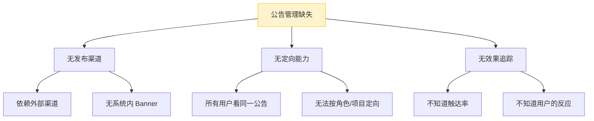
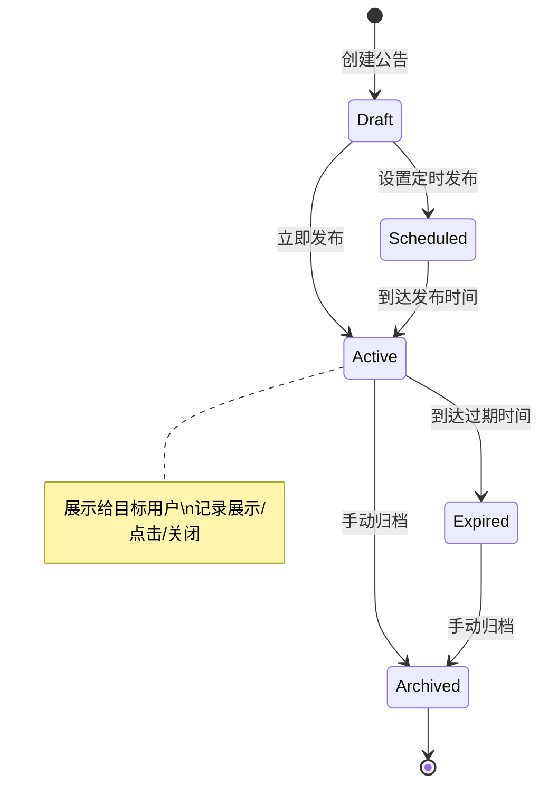
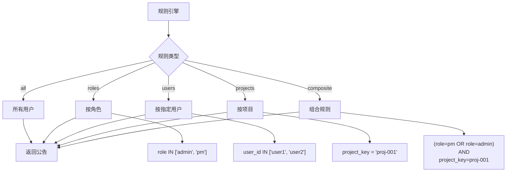
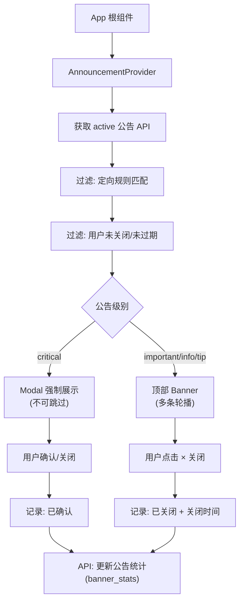

# YV-09-121: 系统公告管理 — 定向公告、定时发布、模板管理、可关闭记忆与分析统计

> 需求编号：YV-09-121 · 优先级：P2 · 人天：0.3d · 状态：需求已编写
> 依赖：YV-09-27（通知中心）、YV-09-56（自定义报告构建器）

## 背景

### 问题陈述

YiVad 作为多用户管理平台，缺少系统级的公告和 Banner 管理能力。当前发布重要通知（维护公告、新功能上线、安全提醒）依赖外部渠道（邮件、群聊），效率低且不可控：

1. **公告无处发布**：系统维护、新功能上线等通知依赖邮件/群聊，用户可能不在群中
2. **无法定向投放**：所有用户看到相同公告，无法按用户/角色/项目定向
3. **无定时发布**：公告需要管理员在特定时间手动操作，无法预约
4. **用户无法关闭**：公告一旦发布永久显示，无法关闭或记住用户偏好
5. **效果无法衡量**：不知道公告被多少人看到、点击、关闭

**核心矛盾**：平台需要有效的内部沟通渠道，但当前缺乏系统级的公告管理能力。

### 影响范围

| # | 影响 | 严重程度 | 典型场景 |
|---|------|----------|----------|
| 1 | 重要通知无法触达 | 高 | 系统维护导致数据丢失，用户不知道 |
| 2 | 非目标用户被骚扰 | 中 | 项目 B 的公告显示给项目 A 的用户 |
| 3 | 公告占据页面空间 | 中 | 长期公告无法关闭，浪费屏幕空间 |
| 4 | 公告效果不明 | 低 | 不知道公告实际触达了多少用户 |

### 挑战

| 挑战 | 说明 |
|------|------|
| 定向精准度 | 按用户/角色/项目组合定向的规则引擎 |
| 关闭记忆持久化 | 用户关闭后在一定时间内不再显示 |
| 定时发布的可靠性 | 预约时间到点准时发布 |
| 与通知中心的集成 | 公告是否需要同时发送通知 |

---

## 一、现状分析

### 1.1 当前公告管理现状

```
现有能力:
├── 通知中心（YV-09-27）
│   ├── 消息列表
│   ├── 已读/未读状态
│   └── 通知偏好设置
├── 系统设置（YV-09-62）
│   └── 基本系统配置
│
缺失:
├── 公告 Banner 组件                    # ❌ 不存在
├── 公告管理后台页面                     # ❌ 不存在
├── 定向投放规则引擎                     # ❌ 不存在
├── 定时发布调度                         # ❌ 不存在
├── 公告模板管理                         # ❌ 不存在
├── 用户关闭记忆 (localStorage)           # ❌ 不存在
├── 公告分析统计                         # ❌ 不存在
└── 公告轮播/优先级                      # ❌ 不存在
```

### 1.2 公告类型

| 类型 | 级别 | 样式 | 可关闭 | 示例 |
|------|------|------|--------|------|
| 紧急通知 | critical | 红色 Banner + 模态 | 否（必须确认） | 系统将于 2 小时后维护 |
| 重要公告 | important | 橙色 Banner | 是 | 新版本 v2.0 已发布 |
| 一般通知 | info | 蓝色 Banner | 是 | 本周五团队分享会 |
| 功能提示 | tip | 绿色 Banner | 是 | 新的搜索过滤器已上线 |
| 成功消息 | success | 绿色 Banner | 是 | 数据迁移完成 |

### 1.3 根因分析矩阵



| 根因 | 症状 | 影响 | 优先级 |
|------|------|------|--------|
| 无发布渠道 | 通知依赖外部 | 触达率低 | 高 |
| 无定向能力 | 所有用户同公告 | 信息骚扰 | 高 |
| 无效果追踪 | 公告效果不明 | 优化无方向 | 中 |

### 1.4 改造前数据流

```
管理员需要发布公告
  → 编辑邮件/群消息
  → 发送到邮件组或群聊
  → 用户可能没看到
  → 无法追踪
  → 重复发布多次
```

---

## 二、设计决策

### 决策 1：公告展示位置

| 选项 | 描述 | 优点 | 缺点 |
|------|------|------|------|
| A: 全局顶部 Banner | 页面顶部固定横幅 | 显眼，不打断 | 占用空间 |
| B: 通知中心内嵌 | 在通知中心中显示 | 不占空间 | 容易被忽略 |
| C: 弹出模态框 | 登录/首页弹出 | 最显眼 | 打断体验 |

**选择：A（全局顶部 Banner） + C（critical 级别时弹出）。** 日常公告使用顶部 Banner（不打断操作），critical 级别（如维护通知）使用模态框强制确认。Banner 可关闭（用户操作后存储关闭状态），同一公告在关闭后 N 天内不再显示。

### 决策 2：关闭记忆存储方式

| 选项 | 描述 | 优点 | 缺点 |
|------|------|------|------|
| A: localStorage | 前端本地存储关闭记录 | 离线可用 | 换设备/浏览器后重新显示 |
| B: 后端存储 | 用户偏好存储在 MongoDB | 跨设备同步 | 需额外 API |
| C: Cookie | 存储在 Cookie 中 | 简单 | 大小限制，用户可清除 |

**选择：B（后端存储）。** 用户在 Chrome 关闭了公告，换到 Firefox 不应该再看到。后端存储（用户偏好集合）确保跨设备一致性。同时前端 localStorage 做第一层缓存（减少 API 调用）。

### 决策 3：定时发布实现

| 选项 | 描述 | 优点 | 缺点 |
|------|------|------|------|
| A: 前端轮询 | 前端定时检查是否有新公告 | 无需后端定时器 | 有时间间隔延迟 |
| B: 后端定时任务 | 后端 apscheduler 定时激活公告 | 精确到秒 | 增加后端复杂度 |
| C: 前端加载时检查 | 每次页面加载时检查 publish_time | 最简单 | 已登录用户看不到新公告 |

**选择：B（后端定时任务）。** 定时发布需要精确到分钟。后端使用 apscheduler 定时检查到期公告并标记为 active。前端每次加载时查询 active 公告并过滤已关闭的。用户已登录期间，通过 SSE 推送或 5 分钟轮询检查新公告。

### 设计决策总览

| 决策 | 选项 A | 选项 B | 选项 C | 选择 | 理由 |
|------|--------|--------|--------|------|------|
| 展示位置 | 全局 Banner | 通知中心 | 模态框 | **Banner+模态** | 按严重级别 |
| 关闭记忆 | localStorage | 后端存储 | Cookie | **后端存储** | 跨设备 |
| 定时发布 | 前端轮询 | 后端定时任务 | 加载时检查 | **后端定时** | 精确性 |

---

## 三、目标架构

### 3.1 公告生命周期



### 3.2 定向规则引擎



### 3.3 前端组件架构



### 3.4 架构决策权衡

| 维度 | 改造前 | 改造后 | 权衡说明 |
|------|--------|--------|----------|
| 发布渠道 | 外部（邮件/群聊） | 系统内 Banner | 可见性 vs 侵入性 |
| 用户选择 | 无 | 可关闭+记忆 | 灵活性 vs 触达率 |
| 定向能力 | 无 | 角色/用户/项目组合 | 精准 vs 复杂度 |
| 效果追踪 | 无 | 展示/点击/关闭统计 | 数据驱动 vs 成本 |

---

## 四、具体改动

### 4.1 改动总览

| 改动点 | 类型 | 涉及文件 | 预估行数 |
|--------|------|---------|---------|
| 全局 Banner 组件 | 新增 | `components/announcement/GlobalBanner.vue` | 100 行 |
| 公告 Provider | 新增 | `composables/useAnnouncement.ts` | 80 行 |
| 公告管理页面 | 新增 | `views/settings/Announcements.vue` | 120 行 |
| 公告创建/编辑表单 | 新增 | `components/announcement/AnnounceForm.vue` | 100 行 |
| 公告列表组件 | 新增 | `components/announcement/AnnounceTable.vue` | 60 行 |
| 公告模板选择器 | 新增 | `components/announcement/TemplateSelector.vue` | 50 行 |
| 定向规则编辑器 | 新增 | `components/announcement/TargetRuleEditor.vue` | 70 行 |
| 公告统计分析 | 新增 | `components/announcement/AnnounceStats.vue` | 60 行 |
| 公告 API 服务 | 新增 | `services/announcementService.ts` | 50 行 |
| 类型定义 | 新增 | `types/announcement.ts` | 60 行 |
| App 根组件集成 | 修改 | `App.vue` | 10 行 |
| 路由 + 菜单配置 | 扩展 | `routes.ts` | 15 行 |

### 4.2 涉及文件

```
src/
├── components/announcement/
│   ├── GlobalBanner.vue              # 新增：全局顶部 Banner 组件
│   ├── AnnounceForm.vue              # 新增：公告创建/编辑表单
│   ├── AnnounceTable.vue             # 新增：公告管理列表
│   ├── TemplateSelector.vue          # 新增：公告模板选择器
│   ├── TargetRuleEditor.vue          # 新增：定向规则编辑器
│   └── AnnounceStats.vue             # 新增：公告统计分析
├── composables/
│   └── useAnnouncement.ts            # 新增：公告状态管理 composable
├── views/settings/
│   └── Announcements.vue             # 新增：公告管理主页面
├── services/
│   └── announcementService.ts        # 新增：公告 API
├── types/
│   └── announcement.ts               # 新增：类型定义
├── App.vue                           # 修改：集成 AnnouncementProvider
└── router/routes.ts                  # 修改：增加公告管理路由
```

### 4.3 核心类型定义

```typescript
// types/announcement.ts

type AnnouncementLevel = 'critical' | 'important' | 'info' | 'tip' | 'success';
type AnnouncementStatus = 'draft' | 'scheduled' | 'active' | 'expired' | 'archived';

type TargetRule =
  | { type: 'all' }
  | { type: 'roles'; roles: string[] }
  | { type: 'users'; user_ids: string[] }
  | { type: 'projects'; project_keys: string[] }
  | { type: 'composite'; operator: 'and' | 'or'; rules: TargetRule[] };

interface Announcement {
  key: string;
  title: string;
  content: string;                       // 支持 Markdown
  level: AnnouncementLevel;
  status: AnnouncementStatus;
  target_rule: TargetRule;               // 定向规则
  publish_at: string | null;             // 定时发布时间
  expire_at: string | null;              // 过期时间
  dismissible: boolean;                  // 是否可关闭
  dismiss_remember_days: number;         // 关闭后几天内不再显示
  template_id: string | null;            // 使用的模板
  created_by: string;
  created_at: string;
  updated_at: string;
  stats: AnnouncementStats;
}

interface AnnouncementStats {
  targeted_users: number;                // 目标用户数
  viewed_count: number;                  // 展示次数
  unique_views: number;                  // 独立用户展示数
  clicked_count: number;                 // 点击次数
  dismissed_count: number;               // 关闭次数
  view_rate: number;                     // 触达率
  click_rate: number;                    // 点击率（点击/展示）
}

interface UserAnnouncementDismiss {
  user_id: string;
  announcement_key: string;
  dismissed_at: string;
  remember_until: string;                // 在此日期前不再显示
}

interface AnnouncementTemplate {
  key: string;
  name: string;
  description: string;
  default_level: AnnouncementLevel;
  default_dismissible: boolean;
  default_remember_days: number;
  content_template: string;              // 带 {{placeholder}} 的模板
  category: string;                      // 分类标签
}
```

### 4.4 核心 Composable

```typescript
// composables/useAnnouncement.ts

import { ref, computed } from 'vue';

export function useAnnouncement() {
  const activeAnnouncements = ref<Announcement[]>([]);
  const currentUserId = ref('');
  const currentUserRoles = ref<string[]>([]);
  const currentProjectKey = ref('');

  /** 获取并过滤当前用户可见的公告 */
  const visibleAnnouncements = computed(() => {
    return activeAnnouncements.value
      .filter(a => matchTargetRule(a.target_rule, {
        user_id: currentUserId.value,
        roles: currentUserRoles.value,
        project_key: currentProjectKey.value,
      }))
      .filter(a => !isDismissed(a.key))
      .sort((a, b) => priorityOrder(a.level) - priorityOrder(b.level));
  });

  const criticalAnnouncement = computed(() =>
    visibleAnnouncements.value.find(a => a.level === 'critical')
  );

  const bannerAnnouncements = computed(() =>
    visibleAnnouncements.value.filter(a => a.level !== 'critical')
  );

  /** 关闭公告并记住 */
  async function dismiss(announcement: Announcement): Promise<void> {
    const rememberUntil = new Date();
    rememberUntil.setDate(rememberUntil.getDate() + announcement.dismiss_remember_days);

    await announcementService.dismiss({
      announcement_key: announcement.key,
      user_id: currentUserId.value,
      remember_until: rememberUntil.toISOString(),
    });

    // 更新统计
    await announcementService.updateStats(announcement.key, 'dismissed');

    // 刷新公告列表
    await fetchAnnouncements();
  }

  /** 记录公告展示 */
  async function trackView(announcementKey: string): Promise<void> {
    await announcementService.updateStats(announcementKey, 'viewed');
  }

  /** 记录公告点击 */
  async function trackClick(announcementKey: string): Promise<void> {
    await announcementService.updateStats(announcementKey, 'clicked');
  }

  return {
    visibleAnnouncements,
    criticalAnnouncement,
    bannerAnnouncements,
    dismiss,
    trackView,
    trackClick,
    fetchAnnouncements,
  };
}
```

---

## 五、实施步骤

| 步骤 | 内容 | 涉及文件 | 验证方式 | 人天 |
|------|------|---------|---------|------|
| 1 | 类型定义 + API 服务 | `types/announcement.ts`, `services/announcementService.ts` | 类型检查通过 | 0.03 |
| 2 | useAnnouncement composable | `composables/useAnnouncement.ts` | 定向过滤逻辑正确 | 0.04 |
| 3 | GlobalBanner Banner 组件 | `GlobalBanner.vue` | 多条轮播、关闭交互 | 0.04 |
| 4 | TargetRuleEditor 定向规则编辑器 | `TargetRuleEditor.vue` | AND/OR 组合规则正确 | 0.04 |
| 5 | AnnounceForm 创建/编辑表单 | `AnnounceForm.vue` | 表单校验+预览 | 0.05 |
| 6 | TemplateSelector 模板选择器 | `TemplateSelector.vue` | 模板内容正确填充 | 0.02 |
| 7 | AnnounceTable + AnnounceStats | `AnnounceTable.vue`, `AnnounceStats.vue` | 列表+统计数据 | 0.03 |
| 8 | 公告管理主页面 | `Announcements.vue` | 完整 CRUD + 状态管理 | 0.04 |
| 9 | App.vue 集成 + 路由配置 | `App.vue`, `routes.ts` | 公告在全局显示 | 0.01 |

**总计：0.3d**

---

## 六、测试规格

### 组件测试：GlobalBanner

#### Scenario: 多条公告轮播
- **Given** 3 条 active Banner 公告（非 critical）
- **When** 渲染 GlobalBanner
- **Then** 显示轮播控件（圆点指示器），默认显示第一条
- **And** 每 5 秒自动切换到下一条

#### Scenario: 用户关闭公告
- **Given** 一条可关闭的 info 公告
- **When** 用户点击关闭按钮 (x)
- **Then** 公告消失，出现"公告已关闭"的短暂提示
- **And** 调用 `dismiss` API 记录关闭状态
- **And** 该公告在 7 天内不再显示

#### Scenario: critical 公告强制展示
- **Given** 一条 critical 级别公告（dismissible=false）
- **When** 渲染公告
- **Then** 显示模态框，无关闭按钮
- **And** 只有"我已了解"确认按钮
- **And** 确认后记录已读但不消失（下次访问仍显示直到过期）

### 组件测试：TargetRuleEditor

#### Scenario: 按角色定向
- **Given** TargetRuleEditor 空白状态
- **When** 选择"按角色" → 勾选 "admin" 和 "pm"
- **Then** 生成的规则为 `{type: 'roles', roles: ['admin', 'pm']}`

#### Scenario: 组合规则
- **Given** TargetRuleEditor
- **When** 选择"组合规则" → 添加子规则"角色=pm" AND "项目=proj-001"
- **Then** 生成的规则为 `{type: 'composite', operator: 'and', rules: [...]}`

### 组件测试：AnnounceForm

#### Scenario: 创建定时发布公告
- **Given** 管理员填写标题、内容、选择"定时发布"、设置时间
- **When** 提交表单
- **Then** 公告状态为 scheduled，publish_at 为设置的时间
- **And** 列表显示该公告的定时状态

#### Scenario: 表单校验
- **Given** 管理员未填写标题
- **When** 提交表单
- **Then** 显示"标题为必填项"的错误提示
- **And** 公告未被创建

---

## 七、风险与缓解

| 风险 | 概率 | 影响 | 等级 | 缓解措施 | 应急预案 |
|------|------|------|------|----------|----------|
| 公告过于频繁导致用户疲劳 | 中 | 中 | 中 | 限制同时活跃公告数（最多 5 条） | 用户可关闭（dismissible） |
| critical 公告影响正常操作 | 低 | 中 | 低 | critical 仅用于紧急情况，滥用需审批 | 管理员可紧急下线公告 |
| 定向规则匹配性能 | 低 | 低 | 低 | 规则在服务端预计算用户可见公告列表 | 前端缓存匹配结果 |
| 定时发布未准时触发 | 低 | 中 | 低 | apscheduler 高精度，失败重试 | 管理员可手动激活 |

---

## 八、回滚策略

| 回滚场景 | 回滚方式 | 影响范围 | 恢复时间 |
|----------|----------|----------|----------|
| Banner 组件异常 | 移除 App.vue 中的 AnnouncementProvider 引用 | 全局公告展示 | < 1min |
| 公告管理页面异常 | `git revert` + 移除路由 | 公告管理功能 | < 1min |
| 定时发布失败 | 手动激活公告 | 待发布公告 | < 1min |

**回滚验证：**
- 回滚后 Banner 不在页面顶部显示
- 回滚后用户正常使用系统（无公告不影响功能）
- 回滚后已发布的公告数据保留

---

## 九、设计决策记录

### D-01: 为什么关闭记忆需要后端存储？

用户可能在多个设备/浏览器上使用 YiVad，如果关闭记忆仅存储在 localStorage，用户在 Chrome 关闭了公告，在 Firefox 上仍会看到。后端存储确保跨设备的一致体验。localStorage 作为第一层缓存（减少 API 调用），在缓存未命中时从后端加载。

### D-02: 为什么 critical 公告不使用 Banner 而是模态框？

critical 级别的公告（如系统维护、数据风险警告）需要确保用户一定看到。Top Banner 可能被用户忽略（视觉盲区），但模态框强制中断用户操作并要求确认，确保 100% 触达。这模仿了 AWS/Azure 等云平台在重大维护时的做法。

### D-03: 为什么限制同时活跃公告数为 5 条？

如果管理员创建了 20 条公告并全部设为 active，页面顶部会被公告 Banner 占满，严重影响用户体验。限制 5 条活跃公告（按优先级和时间排序）在"信息传达"和"用户体验"之间取得平衡。管理员会将过剩的公告调整为 scheduled 或 archived。

### D-04: 为什么定向规则使用简单的 JSON 结构而非规则引擎？

定向需求目前仅涉及 4 个维度（角色、用户、项目、全员）的逻辑组合，使用 JSON 结构（AND/OR + 嵌套）已经足够。不需要引入完整的规则引擎（如 Drools、JsonLogic），避免过度设计。如果未来需要更复杂的条件（如用户属性、行为历史），可以升级。

---

## 十、可观测性

### 关键指标

| 指标 | 采集方式 | 告警阈值 | 说明 |
|------|---------|---------|------|
| 公告触达率 | unique_views / targeted_users | < 50% | 用户没有看到公告 |
| 公告点击率 | clicked / unique_views | — | 公告吸引力 |
| 公告关闭率 | dismissed / unique_views | > 80% | 公告令用户反感 |
| 定时发布成功率 | scheduled_success / total_scheduled | < 95% | 定时任务问题 |
| 活跃公告数 | 当前 active 公告数 | > 5 | 超过限制 |

### 日志规范

| 日志级别 | 场景 | 示例 |
|---------|------|------|
| `INFO` | 公告发布 | `[Announcement] Published: ${key}, level=important, targets=45` |
| `INFO` | 定时激活 | `[Announcement] Scheduled: ${key} activated at ${time}` |
| `WARN` | 关闭率异常 | `[Announcement] High dismiss rate: ${key} dismissed=92%` |
| `INFO` | 用户关闭 | `[Announcement] Dismissed: ${key} by ${user}, remember=7d` |

---

## 十一、代码审查检查清单

- [ ] GlobalBanner 正确处理多条公告轮播（含轮播定时器清理）
- [ ] critical 公告模态框的"我已了解"按钮不会关闭公告（仅记录确认）
- [ ] TargetRuleEditor 的 AND/OR 嵌套规则正确序列化/反序列化
- [ ] useAnnouncement 的定向规则匹配逻辑正确（含边界条件：空角色、无项目）
- [ ] AnnounceForm 正确区分"立即发布"和"定时发布"
- [ ] 用户关闭公告后，remember_until 之前该公告不在 visibleAnnouncements 中
- [ ] 公告统计分析的数据实时更新（view/click/dismiss 事件）
- [ ] `vue-tsc --noEmit` 通过

---

## 回归问题预测

| # | 问题 | 发现场景 | 根因 | 修复方式 |
|---|------|---------|------|---------|
| 1 | 公告轮播定时器未清理 | 离开页面后定时器仍在运行，导致内存泄漏 | `setInterval` 未在 `onUnmounted` 中清除 | 使用 `useIntervalFn`(@vueuse)自动管理生命周期 |
| 2 | 定向规则匹配用户角色时大小写不匹配 | 角色 "Admin" vs "admin" | 未做大小写规范化 | 匹配前统一 `toLowerCase()` |
| 3 | 关闭记忆 API 调用失败导致公告反复出现 | 网络异常时 dismiss 失败，用户刷新后又看到公告 | 未做乐观更新 | dismiss 时先更新本地状态（乐观），API 失败时回滚 |
| 4 | 公告过期时间跨时区问题 | UTC 时间与用户本地时间不一致 | 时间比较时未统一时区 | 统一使用 ISO 8601 UTC 时间，前端显示转本地 |
| 5 | 公告内容 Markdown 渲染 XSS | 管理员在公告中插入 `<script>` 标签 | Markdown 渲染未做 sanitize | 使用 DOMPurify 在渲染前清理 HTML |
| 6 | 多条 critical 公告同时展示 | 2 条 critical 公告同时 active | 未处理 multiple critical 场景 | 同一时间仅展示优先级最高的 critical 公告，其他排队 |

---

## 性能分析

### 组件渲染性能

| 指标 | 无公告 | 有公告 (3 条) | 说明 |
|------|--------|-------------|------|
| GlobalBanner 渲染 | 不渲染 | ~30ms | 轻量 Banner |
| critical Modal 渲染 | 不渲染 | ~50ms | 模态框+遮罩 |
| 公告管理页面首屏 | — | ~200ms | 列表+统计 |

### 网络请求

| 请求 | 频率 | 数据量 | 说明 |
|------|------|--------|------|
| getActiveAnnouncements | 每次页面加载 | ~2KB | 活跃公告列表 |
| getUserDismissals | 每次页面加载 | ~1KB | 用户关闭记录 |
| updateStats (view) | 每公告 1 次 | ~100B | 展示计数 |

### 后端定时任务

| 任务 | 频率 | 开销 | 说明 |
|------|------|------|------|
| 检查到期公告 | 每 60 秒 | < 1ms | 扫描 scheduled 状态且 publish_at <= now |
| 检查过期公告 | 每小时 | < 10ms | 扫描 active 状态且 expire_at <= now |

---

*PRD 来源: `projects/yivad/requirements/2026-09/00-需求-需求总览.md`*

