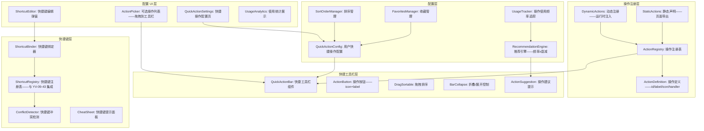

# YV-09-124: 快捷操作配置 — 可配置快捷操作工具栏、用户个性化收藏、拖拽排序、基于使用频率的操作建议、快捷键绑定到操作

> 需求编号：YV-09-124 · 优先级：P2 · 人天：0.3d · 状态：需求已编写
> 依赖：YV-09-43（全局快捷键框架）、YV-09-41（批量操作工具栏）

## 背景

### 问题陈述

YiVad 的每个页面都有 5-15 个操作按钮（新建、导入、导出、批量删除、刷新、筛选等）——分布在页面不同位置——用户需要频繁在不同区域之间移动鼠标：

1. **操作入口分散**：新建按钮在页面顶部、批量操作在选中数据后才出现的浮动条、导出在右上角更多菜单、刷新在表格工具栏——用户需要记住每个操作的位置
2. **高频操作无法固定**：对于某个用户——"导出为 CSV"是每天使用 20 次的高频操作——但每次都需要点击"更多 → 导出 → CSV"三级菜单
3. **低频操作占据快捷位置**：页面顶部的快捷按钮是固定的——无法根据个人使用习惯调整——低频操作占据了宝贵的快捷位置
4. **键盘效率用户被忽视**：习惯键盘操作的用户希望为常用操作绑定快捷键——但当前没有快捷键绑定入口
5. **新操作发现困难**：新增的功能操作隐藏在菜单深处——用户可能不知道存在

**核心矛盾**：不同用户有不同的高频操作——但 YiVad 的操作按钮布局是固定的。快捷操作配置让用户个性化组织自己的操作工具栏——将高频操作提升到触手可及的位置——并通过键盘快捷键加速操作。

### 影响范围

| # | 影响 | 严重程度 | 典型场景 |
|---|------|----------|----------|
| 1 | 鼠标移动距离长——操作效率低 | 高 | 每天 50 次"导出 CSV"——每次移动鼠标到右上角 |
| 2 | 高频操作需要多级菜单 | 高 |"导入数据": 更多 → 导入 → CSV → 选择文件 |
| 3 | 快捷键学习成本高 | 中 | 不同页面快捷键不同——无法统一配置 |
| 4 | 新功能操作发现率低 | 低 | 有用的新功能藏在菜单深处——用户不知道 |

### 挑战

| 挑战 | 说明 |
|------|------|
| 操作注册与发现 | 如何让系统知道"有哪些操作可用于快捷配置"——需要操作注册表机制 |
| 上下文相关操作 | 某些操作仅在特定页面有效——快捷工具栏需要感知页面上下文 |
| 快捷键冲突 | 用户自定义快捷键可能与浏览器/系统快捷键冲突 |
| 拖拽排序的持久化 | 用户调整了工具栏按钮顺序——需要跨设备同步 |

---

## 一、现状分析

### 1.1 当前操作入口分布

```
现有操作入口:
├── 页面顶部工具栏
│   ├── 新建 (固定在左侧)
│   ├── 搜索框 (固定在中间)
│   └── 页面特定操作 (如 Bug 列表的 "看板视图" 切换)
├── 批量操作浮动条
│   ├── 选中数据后从底部浮出
│   ├── 批量删除、批量指派、批量更改状态
│   └── 仅在选择数据时可见——不选则不可见
├── 右上角更多菜单 (···)
│   ├── 导入、导出、刷新、打印
│   └── 三级菜单: 更多 → 导出 → CSV/JSON/Excel
├── 表格行内操作
│   ├── 每行右侧的操作按钮——编辑/删除/查看
│   └── 仅在行 hover 时显示
├── 右键菜单 (YV-09-42)
│   ├── 编辑、删除、复制、移动到
│   └── 数量多——需展开查看
│
缺失:
├── 用户自定义快捷操作工具栏                       # ❌ 无
├── 操作收藏夹 (用户选定高频操作)                   # ❌ 无
├── 拖拽排序工具栏按钮                              # ❌ 无
├── 基于使用频率的操作推荐                           # ❌ 无
├── 操作快捷键自定义绑定                             # ❌ 无
├── 快捷操作配置面板                                # ❌ 无
└── 键盘快捷键提示 (CheatSheet)                     # ❌ 无
```

### 1.2 操作流程（现状 vs 目标）

```mermaid
graph TD
    subgraph Current["现状：固定布局——三级菜单"]
        C1[需要导出 CSV] --> C2[鼠标移动到右上角]
        C2 --> C3[点击 ··· 更多菜单]
        C3 --> C4[在弹出菜单中找到 "导出"]
        C4 --> C5[悬停展开子菜单]
        C5 --> C6[点击 "导出 CSV"]
        C6 --> C7[共 4 次点击——鼠标移动约 30cm]
    end

    subgraph Target["目标：快捷工具栏 + 快捷键"]
        T1[需要导出 CSV] --> T2{方式选择}
        T2 -->|鼠标| T3[快捷工具栏已经显示 "导出CSV" 按钮]
        T3 --> T4[单击——完成——鼠标移动 5cm]
        T2 -->|键盘| T5[按 Ctrl+Shift+E]
        T5 --> T6[弹出格式选择: C=CSV / J=JSON / X=Excel]
        T6 --> T7[按 C——完成——手不离开键盘]
    end

    style Current fill:#f8d7da,stroke:#dc3545
    style Target fill:#d4edda,stroke:#28a745
```

### 1.3 根因矩阵

| 症状 | 根因 | 触发条件 | 频率 |
|------|------|----------|------|
| 高频操作需要多次点击 | 操作位置固定——无法提升到快捷访问 | 每次执行高频操作 | 高 |
| 操作入口位置分散——鼠标移动大 | 各操作在页面不同区域——无集中快捷栏 | 页面操作频繁时 | 高 |
| 键盘用户效率低 | 无自定义快捷键——只能鼠标点击 | 键盘操作用户 | 中 |
| 新操作发现率低 | 操作隐藏在菜单深处——无推荐机制 | 新功能上线后 | 低 |

---

## 二、设计决策

### 决策 1：快捷工具栏位置 — 页面顶部固定 vs 侧边浮动 vs 悬浮球

| 选项 | 可见性 | 屏幕空间 | 实现复杂度 |
|------|--------|---------|-----------|
| 顶部固定栏（紧贴主工具栏下方） | 高 | 占用 ~40px 高度 | 低 |
| 侧边浮动面板（类似浏览器侧边栏） | 中 | 占用 ~200px 宽度 | 中 |
| 悬浮球（类似移动端 FAB） | 中 | 仅 56x56px 圆形 | 中 |

**选择：顶部固定栏（可折叠）。** 顶部固定栏最符合桌面端用户的操作习惯——与浏览器书签栏概念一致。每个按钮尺寸 32x32——一行最多展示 8-10 个。提供折叠/展开按钮——用户不需要时可折叠为单行小图标。侧边浮动面板占用太多水平空间——与 YiVad 的宽表布局冲突。

### 决策 2：操作建议算法 — 基于频率 vs 基于最近使用 vs 混合

| 选项 | 描述 | 优点 | 缺点 |
|------|------|------|------|
| 基于频率（使用次数排序） | 统计每种操作的总使用次数 | 反映长期习惯 | 不适应短期需求变化 |
| 基于最近使用（最近 N 天） | 加权最近 7/14/30 天的使用 | 适应需求变化 | 短期波动可能不准确 |
| 混合（频率 x 时间衰减） | 使用次数 × exp(-λ × 天数) | 综合两者优点 | 计算略复杂 |

**选择：混合（频率 x 时间衰减）。** 使用次数 × 时间衰减（半衰期 14 天）。昨天使用的操作权重高——2 周前使用的操作权重低。这样既反映了长期习惯——又能适应短期需求变化。前端本地计算——无需后端支持。

### 决策 3：操作注册机制 — 静态声明 vs 动态注册 vs 中间件注入

| 选项 | 描述 | 优点 | 缺点 |
|------|------|------|------|
| 静态声明（每个页面 export actions 数组） | 页面组件声明可用操作列表 | 简单——可静态分析 | 操作列表固定 |
| 动态注册（运行时 registerAction） | 任何组件可在 mounted 时注册操作 | 灵活——按需注册 | 难以追踪已注册操作 |
| 中间件注入（路由守卫中注入操作） | 在路由配置中声明操作 | 集中管理 | 操作与页面逻辑分离 |

**选择：静态声明 + 动态注册。** 页面级操作使用静态声明（在页面组件的 `defineActions` 中导出）——可以静态分析。上下文相关操作（如"选中 3 条后出现的批量删除"）使用动态注册——在条件满足时注册——条件不满足时注销。两种方式互补。

### 决策 4：快捷键绑定范围 — 全局 vs 页面级 vs 组件级

| 选项 | 冲突概率 | 可发现性 | 适用场景 |
|------|---------|---------|---------|
| 全局（任何页面都生效） | 高 | 高 | 通用操作: 全局搜索、刷新 |
| 页面级（仅当前页面生效） | 中 | 中 | 页面特定操作: 导出CSV、切换视图 |
| 组件级（仅组件聚焦时生效） | 低 | 低 | 组件特定操作: 表格行导航 |

**选择：全局 + 页面级——默认页面级。** 用户绑定的快捷键默认在当前页面类型（Bug/Issue/Document）下生效——避免不同页面间冲突。全局快捷键（如 Ctrl+K 全局搜索）作为系统保留——用户不可覆盖。如果两个页面级快捷键冲突——提示用户"快捷键 Ctrl+E 在 Bug 列表和 Issue 列表中均绑定——将仅在实际使用页面生效"。

### 设计决策记录

| 决策 | 选项 A | 选项 B | 选项 C | 选择 | 理由 |
|------|--------|--------|--------|------|------|
| 工具栏位置 | 顶部固定 | 侧边浮动 | 悬浮球 | **顶部固定+可折叠** | 桌面端用户习惯 |
| 操作建议 | 频率 | 最近使用 | 混合衰减 | **混合衰减** | 准确+适应变化 |
| 操作注册 | 静态声明 | 动态注册 | 中间件注入 | **静态+动态** | 互补覆盖 |
| 快捷键范围 | 全局 | 页面级 | 组件级 | **全局+页面级** | 避免冲突 |

---

## 三、目标架构

### 3.1 快捷操作系统架构



### 3.2 操作建议流程

```mermaid
graph TD
    A[用户进入页面] --> B[加载该页面的所有可用操作]
    B --> C[加载用户当前快捷工具栏配置]
    C --> D{工具栏有空位?}
    D -->|是| E[获取用户每个操作的使用频率×时间衰减得分]
    D -->|否| F[工具栏已满——不推荐]

    E --> G[取得分 Top 3——但不在工具栏中的操作]
    G --> H{得分 > 推荐阈值?}
    H -->|是| I[在工具栏末尾展示 "推荐添加: 导出CSV, 批量指派"]
    H -->|否| F

    I --> J[用户悬停推荐按钮]
    J --> K[弹出: "您最近频繁使用此操作——点击添加到工具栏"]
    K --> L{用户点击?}
    L -->|添加到工具栏| M[操作加入工具栏——排序到末尾——用户可拖拽调整]
    L -->|忽略| N[推荐隐藏——7 天后再次出现]
```

### 3.3 架构决策权衡

| 维度 | 改造前 | 改造后 | 权衡说明 |
|------|--------|--------|----------|
| 操作可达性 | 固定位置——需多级导航 | 个性化工具栏——一键直达 | 便捷 vs 工具栏占用空间 |
| 操作组织 | 按功能分组布局 | 用户自由排序+收藏 | 个人偏好 vs 统一性 |
| 键盘效率 | 有限——无自定义 | 自定义快捷键绑定 | 效率 vs 快捷键冲突风险 |
| 操作发现 | 被动——隐藏在菜单中 | 主动——推荐高频操作 | 引导 vs 打扰 |

---

## 四、具体改动

### 4.1 改动总览

| 改动点 | 类型 | 涉及文件 | 预估行数 |
|--------|------|---------|---------|
| 操作注册类型定义 | 新增 | `types/actionRegistry.ts` | 50 行 |
| 操作注册表 + 动态注册 | 新增 | `utils/actionRegistry.ts` | 60 行 |
| 快捷工具栏配置类型 | 新增 | `types/quickActionConfig.ts` | 40 行 |
| 快捷操作状态管理 | 新增 | `composables/useQuickActions.ts` | 80 行 |
| 使用频率追踪器 | 新增 | `composables/useActionTracker.ts` | 50 行 |
| 推荐引擎 | 新增 | `utils/recommendationEngine.ts` | 50 行 |
| QuickActionBar 工具栏 | 新增 | `components/quickAction/QuickActionBar.vue` | 80 行 |
| ActionButton 操作按钮 | 新增 | `components/quickAction/ActionButton.vue` | 40 行 |
| QuickActionSettings 配置页 | 新增 | `components/quickAction/QuickActionSettings.vue` | 80 行 |
| ShortcutEditor 快捷键编辑 | 新增 | `components/quickAction/ShortcutEditor.vue` | 60 行 |
| CheatSheet 快捷键面板 | 新增 | `components/quickAction/CheatSheet.vue` | 40 行 |
| 主页布局集成 | 修改 | `layouts/MainLayout.vue` | 20 行 |
| 路由 + 菜单配置 | 扩展 | `routes.ts` | 10 行 |

### 4.2 涉及文件

```
src/
├── components/quickAction/
│   ├── QuickActionBar.vue           # 新增：快捷工具栏 (顶部固定栏)
│   ├── ActionButton.vue             # 新增：单个操作按钮
│   ├── QuickActionSettings.vue      # 新增：快捷操作配置页面
│   ├── ShortcutEditor.vue           # 新增：快捷键编辑弹窗
│   └── CheatSheet.vue               # 新增：快捷键提示面板
├── composables/
│   ├── useQuickActions.ts           # 新增：快捷操作状态管理
│   └── useActionTracker.ts          # 新增：操作使用频率追踪
├── types/
│   ├── actionRegistry.ts            # 新增：操作注册类型
│   └── quickActionConfig.ts         # 新增：快捷工具栏配置类型
├── utils/
│   ├── actionRegistry.ts            # 新增：操作注册表实现
│   └── recommendationEngine.ts      # 新增：推荐引擎
├── layouts/
│   └── MainLayout.vue               # 修改：集成 QuickActionBar
└── router/routes.ts                 # 修改：快捷操作配置路由
```

### 4.3 核心类型定义

```typescript
// types/actionRegistry.ts

export interface ActionDefinition {
  id: string;                        // 唯一标识: "bug.export.csv"
  label: string;                     // 显示标签: "导出CSV"
  icon: string;                      // 图标名称
  description?: string;              // 描述: "将当前筛选的Bug导出为CSV文件"
  handler: () => void | Promise<void>;  // 执行函数
  category: ActionCategory;          // 操作分类
  scope: ActionScope;                // 生效范围
  defaultShortcut?: string;          // 默认快捷键: "Ctrl+Shift+E"
  disabled?: () => boolean;          // 禁用条件
  visible?: () => boolean;           // 可见条件
  badge?: () => string | number | null; // 角标——如未读数
}

export type ActionCategory =
  | 'create'      // 创建类: 新建、导入
  | 'export'      // 导出类: CSV/JSON/Excel
  | 'modify'      // 修改类: 编辑、删除、指派
  | 'view'        // 视图类: 切换视图、刷新、搜索
  | 'navigate'    // 导航类: 返回上级、跳转
  | 'tools';      // 工具类: 打印、统计

export type ActionScope = 'global' | 'page' | 'selection';

// types/quickActionConfig.ts

export interface QuickActionConfig {
  user_id: string;
  items: QuickActionItem[];           // 工具栏按钮列表
  collapsed: boolean;                 // 工具栏是否折叠
  version: number;
  updated_at: string;
}

export interface QuickActionItem {
  actionId: string;                   // 引用 ActionDefinition.id
  position: number;                   // 排序位置 0-based
  addedAt: string;                    // 添加到工具栏的时间
  addedBy: 'manual' | 'recommendation';  // 添加方式
}

export interface ActionUsageRecord {
  actionId: string;
  page: string;                       // 在哪个页面使用的
  timestamp: number;                  // 使用时间戳
  source: 'toolbar' | 'menu' | 'shortcut' | 'context_menu';  // 触发来源
}
```

### 4.4 核心 Composable

```typescript
// composables/useQuickActions.ts

import { ref, computed } from 'vue';
import { useActionTracker } from './useActionTracker';

export function useQuickActions(pageScope: string) {
  const config = ref<QuickActionConfig | null>(null);
  const allActions = ref<ActionDefinition[]>([]);
  const { track, getRecommendations } = useActionTracker();

  /** 获取当前页面可用操作 (静态+动态) */
  const availableActions = computed(() => {
    return allActions.value.filter(a => {
      if (a.scope === 'global') return true;
      if (a.scope === 'page') return a.visible ? a.visible() : true;
      return a.visible ? a.visible() : false;
    });
  });

  /** 工具栏中显示的操作 (已配置且可见的) */
  const toolbarActions = computed(() => {
    if (!config.value) return [];
    return config.value.items
      .sort((a, b) => a.position - b.position)
      .map(item => allActions.value.find(a => a.id === item.actionId))
      .filter(Boolean) as ActionDefinition[];
  });

  /** 推荐操作——不在工具栏中的高频操作 */
  const suggestedActions = computed(() => {
    const toolbarIds = new Set(toolbarActions.value.map(a => a.id));
    const recommendations = getRecommendations(pageScope);
    return recommendations
      .filter(r => !toolbarIds.has(r.actionId))
      .slice(0, 3);
  });

  /** 执行操作并追踪 */
  async function executeAction(actionId: string) {
    const action = allActions.value.find(a => a.id === actionId);
    if (!action || action.disabled?.()) return;
    await action.handler();
    track(actionId, pageScope, 'toolbar');
  }

  /** 添加操作到工具栏 */
  async function addToToolbar(actionId: string) { /* ... */ }

  /** 从工具栏移除操作 */
  async function removeFromToolbar(actionId: string) { /* ... */ }

  /** 拖拽重新排序 */
  async function reorder(newOrder: string[]) { /* ... */ }

  return {
    config, availableActions, toolbarActions, suggestedActions,
    executeAction, addToToolbar, removeFromToolbar, reorder,
  };
}
```

---

## 五、实施步骤

| 步骤 | 内容 | 涉及文件 | 验证方式 | 人天 |
|------|------|---------|---------|------|
| 1 | 操作注册机制+类型定义 | `types/actionRegistry.ts`, `utils/actionRegistry.ts` | 静态声明+动态注册均可用 | 0.04 |
| 2 | 快捷工具栏配置类型+API | `types/quickActionConfig.ts`, `services/quickActionService.ts` | 配置可持久化到后端 | 0.03 |
| 3 | 使用频率追踪器+推荐引擎 | `composables/useActionTracker.ts`, `utils/recommendationEngine.ts` | 追踪准确+推荐得分合理 | 0.04 |
| 4 | QuickActionBar 工具栏 UI | `QuickActionBar.vue`, `ActionButton.vue` | 拖拽排序+折叠+推荐提示 | 0.06 |
| 5 | QuickActionSettings 配置页 | `QuickActionSettings.vue` | 操作选择+排序+收藏管理 | 0.05 |
| 6 | ShortcutEditor + CheatSheet | `ShortcutEditor.vue`, `CheatSheet.vue` | 快捷键绑定+冲突检测+提示面板 | 0.05 |
| 7 | MainLayout 集成 + 路由配置 | `MainLayout.vue`, `routes.ts` | 全局工具栏可见+配置页可访问 | 0.03 |

**总计：0.3d**

---

## 六、测试规格

### 场景 1：添加操作到快捷工具栏

**GIVEN** 用户在 Bug 列表页——快捷工具栏当前有 3 个操作
**WHEN** 点击工具栏右侧的 "+" 按钮——打开操作选择面板
**THEN** 面板列出所有当前页面可用的操作——按分类分组
**AND** 已在工具栏中的操作标记为"已添加"——灰显不可再添加
**WHEN** 用户点击 "导出CSV" 操作旁的 "+ 添加"
**THEN** "导出CSV" 按钮出现在工具栏末尾
**AND** 提示 "导出CSV 已添加到快捷工具栏"

### 场景 2：拖拽排序工具栏按钮

**GIVEN** 工具栏有 4 个按钮: [新建, 导出CSV, 刷新, 导入]
**WHEN** 用户拖拽 "导出CSV" 到"新建"和"刷新"之间
**THEN** 工具栏顺序变为: [新建, 导出CSV, 刷新, 导入]
**AND** 排序自动保存——刷新页面后保持
**AND** 拖拽过程中显示占位符指示目标位置

### 场景 3：操作推荐

**GIVEN** 用户在过去 14 天内使用了"批量指派"操作 25 次——但该操作不在快捷工具栏中
**WHEN** 用户进入 Bug 列表页——工具栏有空位
**THEN** 工具栏末尾显示推荐: "推荐: 批量指派"——带灯泡图标
**WHEN** 用户点击推荐
**THEN** "批量指派" 添加到工具栏
**AND** 推荐消失——改用后不再推荐（已在工具栏中）

### 场景 4：快捷键绑定

**GIVEN** 用户打开了快捷操作配置页
**WHEN** 找到 "导出CSV" 操作——点击"绑定快捷键"
**THEN** 弹出快捷键录制弹窗——提示"按下要绑定的组合键..."
**WHEN** 用户按下 Ctrl+Shift+X
**THEN** 弹窗显示 "Ctrl+Shift+X——未冲突"
**AND** 用户点击确认——快捷键绑定成功
**WHEN** 回到 Bug 列表页——按下 Ctrl+Shift+X
**THEN** 触发导出 CSV 操作

### 场景 5：快捷键冲突检测

**GIVEN**"导出CSV" 已绑定 Ctrl+Shift+E
**WHEN** 用户尝试将 "导出JSON" 也绑定到 Ctrl+Shift+E
**THEN** 系统提示 "Ctrl+Shift+E 已被 '导出CSV' 使用——是否覆盖？"
**AND** 列出冲突详情: "导出CSV" ↔ "导出JSON"
**WHEN** 用户选择覆盖
**THEN**"导出JSON" 绑定 Ctrl+Shift+E——"导出CSV" 快捷键被清除

### 场景 6：快捷工具栏折叠

**GIVEN** 快捷工具栏有 8 个按钮——占用顶部 48px 高度
**WHEN** 用户点击工具栏左侧的折叠按钮
**THEN** 工具栏缩小为一行 24px 高度
**AND** 仅显示操作图标——无文字标签——hover 时显示 tooltip
**WHEN** 用户再次点击折叠按钮——工具栏展开
**THEN** 恢复完整按钮——图标+文字标签

---

## 七、风险与缓解

| 风险 | 概率 | 影响 | 等级 | 缓解措施 | 应急预案 |
|------|------|------|------|----------|----------|
| 快捷工具栏占用过多垂直空间 | 中 | 中 | 中 | 默认折叠——仅展开时占用 48px | 用户可选择隐藏整个工具栏 |
| 快捷键与浏览器/系统快捷键冲突 | 中 | 中 | 中 | 冲突检测——浏览器保留键 (Ctrl+T/Ctrl+W 等) 不可绑定 | 冲突时阻止绑定——建议替代组合键 |
| 操作注册表快速增长——难以维护 | 低 | 低 | 低 | 操作 ID 命名规范: `{module}.{action}.{detail}` — 注册表自动从静态声明收集 | 定期审查未使用操作——清理 |
| 工具栏在不同页面显示不一致的操作 | 中 | 低 | 低 | 页面切换时——仅显示适用于当前页面的操作——不可用的灰显 | 页面级操作在不可用页面自动隐藏 |

---

## 八、回滚策略

| 回滚场景 | 回滚方式 | 影响范围 | 恢复时间 |
|----------|----------|----------|----------|
| QuickActionBar 组件异常 | 移除 MainLayout 中的 QuickActionBar 引用 | 快捷工具栏 | < 1min |
| 快捷键绑定冲突严重 | 禁用自定义快捷键——仅保留系统默认 | 键盘效率降低 | < 1min (特性开关) |
| 操作追踪器异常 | 禁用推荐功能——工具栏仍可用 | 无操作推荐 | < 1min |
| 配置页异常 | `git revert` + 移除路由 | 配置功能不可用——工具栏保持最后配置 | < 1min |

---

## 九、设计决策记录

### D-01：为什么选混合频率衰减而非纯频率统计？

纯频率统计存在惯性——一个操作过去使用很多——最近不用——但仍然排在推荐榜前列。时间衰减（半衰期 14 天）让最近两周的活跃操作权重更高——推荐更反映用户当前的工作模式。例如用户上个月频繁使用"导入"（因为数据迁移项目）——但本月不再导入——纯频率会继续推荐导入——混合衰减则不会。

### D-02：为什么快捷键绑定默认页面级而非全局？

全局快捷键在 YiVad 这种多功能管理平台中极易冲突——"导出CSV"在 Bug 列表和 Issue 列表中含义不同（导出不同集合的数据）。页面级绑定利用页面上下文自动区分——用户无需记住"哪个页面用哪个键"。全局快捷键仅保留给真正的跨页面操作（全局搜索、命令面板、刷新）。

### D-03：为什么操作注册使用 ID 字符串而非 Symbol 或枚举？

操作 ID 格式为 `{module}.{action}.{detail}`——如 `bug.export.csv`——需要可序列化（持久化到后端和 localStorage）。Symbol 不可序列化。枚举需要集中定义——与"动态注册"的设计冲突。字符串 ID 的命名空间约定（点分层次）提供了足够的唯一性保证。

### D-04：为什么工具栏采用可折叠设计而非固定高度？

不同用户对快捷操作的需求差异很大——重度用户可能有 10+ 个快捷按钮——占满一行甚至两行。如果固定高度——要么限制按钮数量——要么挤占页面内容空间。可折叠让用户自己控制空间占用——需要时展开——不需要时折叠为一排小图标。这是 Google Docs 工具栏设计的实践。

---

## 十、可观测性

### 关键指标

| 指标 | 采集方式 | 告警阈值 | 说明 |
|------|---------|---------|------|
| 工具栏使用率 | toolbar_executed / total_actions | < 20% | 工具栏不够有用 |
| 每用户平均快捷操作数 | avg(toolbar_items_per_user) | — | 工具栏配置活跃度 |
| 快捷键使用率 | shortcut_executed / total_actions | — | 键盘用户比例 |
| 推荐接受率 | recommendation_accepted / shown | < 10% | 推荐不够精准 |
| 操作从工具栏移除率 | removed / added | > 50% | 用户添加后不满意 |

### 日志规范

| 日志级别 | 场景 | 示例 |
|---------|------|------|
| `INFO` | 操作执行 | `[QuickAction] Executed: ${actionId} via ${source} on ${page}` |
| `INFO` | 添加到工具栏 | `[QuickAction] Added: ${actionId} to toolbar by ${method}` |
| `WARN` | 快捷键冲突 | `[Shortcut] Conflict: ${key} used by ${actionA} and ${actionB}` |
| `INFO` | 推荐采纳 | `[Recommendation] Accepted: ${actionId} score=${score}` |

---

## 十一、代码审查检查清单

- [ ] ActionRegistry: register/unregister 配对——动态注册需要提供 cleanup 函数
- [ ] ActionRegistry: 同一 actionId 多次注入取最后一次——emit 警告
- [ ] QuickActionBar: 拖拽排序使用 HTML5 Drag & Drop API——或 vuedraggable
- [ ] QuickActionBar: 页面切换时——清理不可用的操作——保留全局操作
- [ ] RecommendationEngine: 时间衰减函数使用指数衰减——半衰期可配置
- [ ] ShortcutEditor: 录制键盘事件时——捕获 keydown 和 keyup 组合
- [ ] ShortcutEditor: 浏览器保留键 (Ctrl+N/T/W/F5 等) 列入黑名单
- [ ] CheatSheet: 快捷键面板按 `?` 键触发——与 GitHub/Jira 习惯一致
- [ ] useActionTracker: 使用记录存储在 localStorage——定期清理 90 天前的记录
- [ ] `vue-tsc --noEmit` 通过

---

## 回归问题预测

| # | 问题 | 发现场景 | 根因 | 修复方式 |
|---|------|---------|------|---------|
| 1 | 工具栏操作在执行前页面已切换——handler 引用了旧页面状态 | 用户点击工具栏按钮——同时页面路由切换 | handler 闭包捕获了旧页面状态 | handler 使用最新状态——或执行前检查当前路由是否匹配操作目标页面 |
| 2 | 拖拽排序在触摸设备上不可用 | 在 iPad 上使用 YiVad——无法拖拽 | HTML5 Drag API 在触摸设备上不可用 | 检测触摸设备——使用 touchstart/touchmove/touchend 模拟拖拽 |
| 3 | 推荐引擎在首次使用时无数据——推荐列表为空 | 新用户首次使用——无使用记录 | 冷启动问题 | 新用户默认推荐系统预设的高频操作列表 (Top 5) |
| 4 | 动态注册的操作在组件销毁后未注销——内存泄漏 | 组件反复挂载/卸载——操作注册表增长 | 缺少自动清理 | 动态注册时返回 unregister 函数——组件 onUnmounted 调用 |
| 5 | 快捷键与输入框中的文字输入冲突 | 用户在 textarea 中输入——按下 Ctrl+E——触发了导出 | 未检查焦点元素——快捷键在输入框中生效 | 焦点在 input/textarea/contenteditable 时——页面级快捷键不触发 |
| 6 | 工具栏按钮的 disabled 条件判断频率过高——性能问题 | 每次渲染都计算 disabled 条件——复杂条件耗时 | 响应式依赖未优化 | disabled 和 visible 函数轻量级——复杂条件使用 computed 缓存 |

---

## 性能分析

### 组件渲染性能

| 指标 | 无工具栏 | 有工具栏 (8 按钮) | 说明 |
|------|---------|-----------------|------|
| QuickActionBar 渲染 | 不渲染 | ~20ms | 8 个 ActionButton |
| ActionButton 单个渲染 | — | ~2ms | 图标+标签+角标 |
| 拖拽排序动画 | — | ~5ms/帧 | requestAnimationFrame |
| CheatSheet 面板 | — | ~30ms | 快捷键列表 |

### 网络请求

| 请求 | 频率 | 数据量 | 说明 |
|------|------|--------|------|
| getQuickActionConfig | 每次页面加载 | ~1KB | 用户工具栏配置 |
| saveQuickActionConfig | 用户调整工具栏时 | ~1KB | 配置变更 |
| getActionUsageStats | 每次页面加载 (可选) | ~5KB | 使用频率数据——本地计算推荐 |

### localStorage 存储

| 数据 | 大小 | 清理策略 |
|------|------|---------|
| 操作使用记录 (90天) | ~10KB (约 200 条) | 超过 90 天自动清理 |
| 工具栏配置缓存 | ~1KB | 与后端同步 |
| 推荐引擎缓存 | ~1KB | 每次重新计算 |

