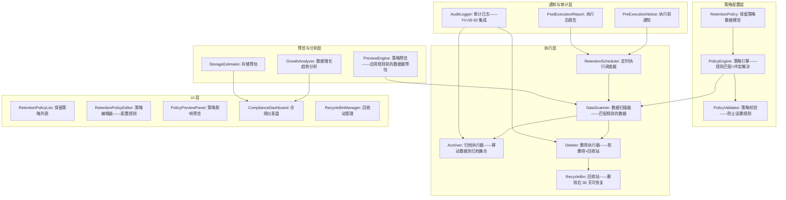
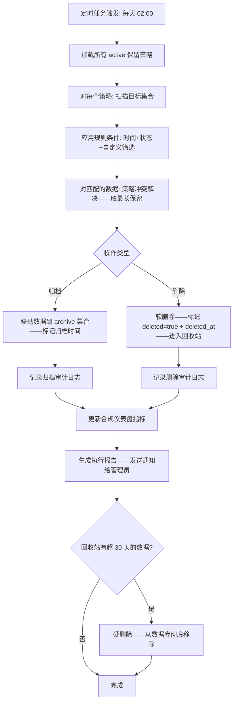

# YV-09-125: 数据保留策略 — 按集合配置数据保留规则、自动归档/删除、保留策略预览、合规仪表盘

> 需求编号：YV-09-125 · 优先级：P2 · 人天：0.3d · 状态：需求已编写
> 依赖：YV-09-50（活动日志与审计追踪）、YV-09-71（数据备份恢复界面）

## 背景

### 问题陈述

YiVad 管理着多个数据集合（Bug、Issue、文档、会话、附件等）——数据持续增长但从未清理：

1. **数据无限增长**：Bug 列表已有 3 年前的已关闭 Bug——占用存储且拖慢查询性能——但从未清理
2. **合规需求**：某些数据有法定保留期限（如审计日志 2 年、用户数据 3 年）——超期需要删除或匿名化——但无机制保证
3. **手动清理不可靠**：依赖管理员手工判断和清理——容易遗漏——可能误删重要数据
4. **无数据生命周期管理**：数据从创建到归档到删除没有自动化流程——全靠人治
5. **存储成本不可见**：不知道每个集合占用多少存储——哪些集合增长最快

**核心矛盾**：数据增长是必然的——但无限保留既不现实（成本）也不合规（安全）。数据保留策略将"靠人记住的清理"转变为"系统保障的自动化保留规则"。

### 影响范围

| # | 影响 | 严重程度 | 典型场景 |
|---|------|----------|----------|
| 1 | 数据库无限制膨胀 | 高 | MongoDB 从 500MB 增长到 5GB——查询越来越慢 |
| 2 | 合规风险——超期保留敏感数据 | 高 | 用户 3 年前删除的数据仍在数据库中 |
| 3 | 查询性能持续下降 | 中 | 全表扫描 10 万条历史 Bug——响应时间从 200ms 到 2s |
| 4 | 备份恢复时间增长 | 中 | MongoDB 备份从 30 秒增加到 5 分钟 |
| 5 | 误删无法恢复 | 低 | 管理员清理时误删了仍需要的数据 |

### 挑战

| 挑战 | 说明 |
|------|------|
| 保留规则的灵活性 | 不同集合有不同的保留需求——需要可配置的规则引擎 |
| 归档 vs 删除 | 有些数据需要归档到冷存储——而非直接删除 |
| 关联数据处理 | 删除一条 Bug 时——关联的评论、附件、活动日志如何处理 |
| 执行时机 | 定时任务——避免在业务高峰期执行 |
| 回滚能力 | 自动删除的数据需要能恢复——至少保留宽限期 |

---

## 一、现状分析

### 1.1 当前数据生命周期管理

```
现有数据管理:
├── 手动清理（当前唯一方式）
│   ├── 管理员登录 MongoDB——手动执行 deleteMany
│   ├── 风险: 误删、遗漏、无审计记录
│   └── 频率: 不定期——通常等到 MongoDB 磁盘告警时才清理
├── 数据备份 (YV-09-71)
│   ├── 手动全量备份——备份包含所有历史数据
│   ├── 备份文件随数据增长不断变大
│   └── 恢复时间长——因为需要恢复所有数据
├── 审计日志 (YV-09-50)
│   ├── 操作日志持续积累——从未清理
│   └── 查询历史日志越来越慢
│
缺失:
├── 数据保留策略配置 (按集合、按条件、按时间)        # ❌ 无
├── 自动归档 (活跃 → 归档 → 冷存储)                   # ❌ 无
├── 自动删除 (超期数据定时清理)                        # ❌ 无
├── 保留策略预览 (应用策略前的数据影响预览)             # ❌ 无
├── 数据增长趋势分析                                   # ❌ 无
├── 合规仪表盘 (各集合保留状态一览)                    # ❌ 无
├── 删除前通知/确认                                    # ❌ 无
└── 过期数据恢复窗口 (删除后 N 天内可恢复)             # ❌ 无
```

### 1.2 数据保留流程（现状 vs 目标）

```mermaid
graph TD
    subgraph Current["现状：手动清理——管理员不定期执行"]
        C1[某天 MongoDB 磁盘使用率 > 80%] --> C2[运维告警]
        C2 --> C3[管理员评估哪些数据可以删除]
        C3 --> C4[手动编写 MongoDB 查询: db.bugs.deleteMany]
        C4 --> C5{查询条件正确?}
        C5 -->|不确定| C6[先备份——执行——祈祷不要误删]
        C5 -->|确定| C7[执行删除]
        C6 --> C7
        C7 --> C8{删除后发现问题?}
        C8 -->|是| C9[从备份恢复——耗时数小时]
        C8 -->|否| C10[完成——下次磁盘告警再重复]
    end

    subgraph Target["目标：自动化保留策略——按规则执行"]
        T1[管理员在保留策略页面配置规则:<br/>"Bug——已关闭超 180 天——归档<br/> Bug——已归档超 365 天——删除"] --> T2[规则保存——定时任务每天凌晨 2:00 执行]
        T2 --> T3[执行前: 发送通知 "明天将归档 1523 条 Bug"]
        T3 --> T4[执行中: 扫描数据——匹配规则——归档/删除]
        T4 --> T5[执行后: 记录审计日志——更新合规仪表盘]
        T5 --> T6[删除的数据进入回收站——30 天内可恢复]
        T6 --> T7[管理员在合规仪表盘查看: 各集合数据量+保留状态]
    end

    style Current fill:#f8d7da,stroke:#dc3545
    style Target fill:#d4edda,stroke:#28a745
```

### 1.3 根因矩阵

| 症状 | 根因 | 触发条件 | 频率 |
|------|------|----------|------|
| 数据库无限膨胀 | 无自动数据清理机制 | 数据持续写入 | 持续 |
| 手动清理有风险 | 依赖人工判断——容易出错 | 每次清理时 | 不定期 |
| 超期保留不合规 | 无保留期限约束和自动执行 | GDPR/个人信息保护法要求 | 持续 |
| 备份恢复缓慢 | 备份包含大量过期数据 | 恢复数据时 | 低频 |
| 存储成本不透明 | 无存储增长趋势和预估 | 预算审批时 | 中 |

---

## 二、设计决策

### 决策 1：保留操作类型 — 仅删除 vs 归档+删除 vs 归档+删除+匿名化

| 选项 | 数据可恢复 | 存储成本 | 实现复杂度 |
|------|----------|---------|-----------|
| 仅删除 | 否 | 最低 | 低 |
| 归档 + 删除（两阶段） | 是（归档阶段） | 中（归档数据仍占用存储） | 中 |
| 归档 + 删除 + 匿名化 | 部分 | 中-低 | 高 |

**选择：归档 + 删除——两阶段。** 第一阶段"归档"：将活跃数据标记为归档状态——移到独立的归档集合——仍可查询但不可修改。第二阶段"删除"：归档数据超过配置时间后——标记为待删除——保留 30 天回收窗口后彻底删除。两阶段给了足够的安全缓冲——避免误删。0.3d 预算内不做匿名化（涉及数据字段级改造）。

### 决策 2：保留规则条件 — 仅时间 vs 时间+状态 vs 时间+状态+自定义

| 选项 | 灵活性 | 配置复杂度 | 适用场景 |
|------|--------|----------|---------|
| 仅时间（创建超过 N 天即处理） | 低 | 低 | 日志类数据 |
| 时间 + 状态（已关闭超 N 天 + 状态=已关闭） | 中 | 中 | 业务数据——如 Bug |
| 时间 + 状态 + 自定义筛选 | 高 | 高 | 复杂业务 |

**选择：时间 + 状态 + 可选自定义筛选。** 基础规则是"数据满足状态条件 + 超过时间阈值"。Bug 集合: 状态=已关闭 + 超过 180 天 → 归档。会话集合: 无活动 + 超过 90 天 → 删除。高级用户可以通过自定义 JSON 筛选条件扩展（如 `{priority: {$in: ['P3', 'P4']}}`）。平衡灵活性和配置复杂度。

### 决策 3：规则执行调度 — 固定时间 vs 手动触发 vs 事件驱动

| 选项 | 自动化程度 | 可控性 | 实现复杂度 |
|------|----------|--------|-----------|
| 固定时间（每天凌晨 2:00） | 高 | 中 | 低（apscheduler cron） |
| 手动触发（管理员点击执行） | 低 | 高 | 低 |
| 事件驱动（数据状态变更时检查） | 最高 | 低 | 高 |

**选择：固定时间（可配置）+ 手动触发。** 默认每天凌晨 2:00 自动执行——业务低峰期。管理员可以在保留策略页面手动触发"立即执行预览"（仅预览——不实际执行）和"立即执行"（确认后执行）。事件驱动在 0.3d 预算内不可行——需要后端 hook 所有数据变更事件。

### 决策 4：策略冲突解决 — 首次匹配 vs 最长保留 vs 手动指定优先级

| 选项 | 描述 | 安全倾向 | 复杂度 |
|------|------|---------|--------|
| 首次匹配（第一条匹配的规则生效） | 规则列表有序——找到即停止 | 取决于规则顺序 | 低 |
| 最长保留（多条匹配选保留最久的） | 保守——最大化数据保留 | 安全（不过度删除） | 中 |
| 手动优先级（每规则指定优先级权重） | 管理员显式管理规则优先级 | 灵活 | 中 |

**选择：最长保留。** 如果一条数据同时匹配两条规则——取保留时间最长的那条。这是保守策略——宁可多保留一阵——也不要过早删除。例如: Bug 匹配"已关闭超 180 天归档"和"创建超 730 天归档"——取 730 天——再保留 550 天。应用优先级高——删除优先级低。

### 设计决策记录

| 决策 | 选项 A | 选项 B | 选项 C | 选择 | 理由 |
|------|--------|--------|--------|------|------|
| 保留操作 | 仅删除 | 归档+删除 | 归档+删除+匿名化 | **归档+删除** | 安全缓冲 |
| 规则条件 | 仅时间 | 时间+状态 | 时间+状态+自定义 | **时间+状态+自定义** | 灵活+可控 |
| 执行调度 | 固定时间 | 手动触发 | 事件驱动 | **定时+手动** | 可控+自动化 |
| 冲突解决 | 首次匹配 | 最长保留 | 手动优先级 | **最长保留** | 安全优先 |

---

## 三、目标架构

### 3.1 数据保留策略系统架构



### 3.2 保留策略执行流程



### 3.3 架构决策权衡

| 维度 | 改造前 | 改造后 | 权衡说明 |
|------|--------|--------|----------|
| 数据清理 | 手动——不定期——有风险 | 自动——按规则——有审计 | 可靠性 vs 执行开销 |
| 合规保证 | 无机制——仅凭记忆 | 规则驱动——到期自动执行 | 合规 vs 灵活性 |
| 数据恢复 | 从备份——耗时长 | 回收站 30 天——秒级恢复 | 恢复速度 vs 存储双倍 |
| 存储可见性 | 无——依赖 MongoDB 监控 | 仪表盘——趋势+预估 | 可见性 vs UI 成本 |

---

## 四、具体改动

### 4.1 改动总览

| 改动点 | 类型 | 涉及文件 | 预估行数 |
|--------|------|---------|---------|
| 保留策略类型定义 | 新增 | `types/retentionPolicy.ts` | 60 行 |
| 保留策略 API 服务 | 新增 | `services/retentionPolicyService.ts` | 50 行 |
| 保留策略 CRUD 状态管理 | 新增 | `composables/useRetentionPolicy.ts` | 80 行 |
| 策略预览引擎 | 新增 | `utils/policyPreview.ts` | 50 行 |
| 保留策略列表页面 | 新增 | `views/settings/RetentionPolicies.vue` | 80 行 |
| 策略编辑器组件 | 新增 | `components/retention/PolicyEditor.vue` | 100 行 |
| 策略预览面板 | 新增 | `components/retention/PolicyPreview.vue` | 60 行 |
| 合规仪表盘 | 新增 | `components/retention/ComplianceDashboard.vue` | 80 行 |
| 回收站管理 | 新增 | `components/retention/RecycleBin.vue` | 60 行 |
| 数据集合类型扩展 | 修改 | `types/data.ts` | 20 行 |
| 路由 + 菜单配置 | 扩展 | `routes.ts` | 15 行 |

### 4.2 涉及文件

```
src/
├── components/retention/
│   ├── PolicyEditor.vue              # 新增：保留策略编辑表单
│   ├── PolicyPreview.vue             # 新增：策略影响预览——数据量+示例
│   ├── ComplianceDashboard.vue       # 新增：合规仪表盘——各集合状态一览
│   └── RecycleBin.vue                # 新增：回收站管理——恢复/永久删除
├── composables/
│   └── useRetentionPolicy.ts         # 新增：保留策略状态管理
├── services/
│   └── retentionPolicyService.ts     # 新增：保留策略 API
├── types/
│   └── retentionPolicy.ts            # 新增：保留策略类型定义
├── utils/
│   └── policyPreview.ts              # 新增：策略影响预览计算
├── views/settings/
│   └── RetentionPolicies.vue         # 新增：保留策略管理主页面
└── router/routes.ts                  # 修改：路由+菜单配置
```

### 4.3 核心类型定义

```typescript
// types/retentionPolicy.ts

export type RetentionAction = 'archive' | 'delete';

export interface RetentionPolicy {
  key: string;
  name: string;                         // 策略名称: "Bug 归档策略"
  description?: string;
  collection: string;                   // 目标集合: "bugs"
  enabled: boolean;                     // 是否启用
  rules: RetentionRule[];

  // 统计
  last_executed_at?: string;
  last_executed_count?: number;         // 上次执行处理的记录数
  total_processed_count: number;        // 累计处理的记录数

  created_at: string;
  updated_at: string;
}

export interface RetentionRule {
  // 时间条件
  field: string;                        // 时间参考字段: "updated_at" / "created_at" / "closed_at"
  days: number;                         // 天数阈值: 180

  // 状态条件 (可选)
  status_field?: string;                // 状态字段: "status"
  status_values?: string[];             // 匹配的状态值: ["closed", "resolved"]

  // 自定义筛选 (可选)
  custom_filter?: Record<string, unknown>;  // MongoDB 查询条件

  // 操作
  action: RetentionAction;              // 归档 或 删除
  archive_days_before_delete?: number;  // 归档后多少天自动删除 (仅 action=archive)
}

export interface PolicyPreviewResult {
  policy_name: string;
  collection: string;
  total_records: number;               // 集合总记录数
  matched_records: number;             // 匹配规则的记录数
  matched_percent: number;             // 匹配百分比
  sample_records: Record<string, unknown>[];  // 匹配的示例记录 (最多 5 条)
  action_breakdown: {                  // 按操作分类
    archive: number;
    delete: number;
  };
  estimated_storage_freed: number;     // 预估释放的存储 (字节)
}

export interface ComplianceDashboardData {
  collections: CollectionRetentionStatus[];
  overall: {
    total_records: number;
    archived_records: number;
    deleted_records: number;
    retention_coverage: number;        // 有保留策略的集合比例
    storage_trend: StorageTrendPoint[];
  };
}

export interface CollectionRetentionStatus {
  collection: string;
  total_records: number;
  active_policies: number;             // 活跃策略数
  archived_count: number;              // 已归档数量
  in_recycle_bin: number;              // 回收站数量
  pending_actions: number;             // 待执行操作数 (下次执行将处理)
  last_cleanup_at?: string;
  growth_rate_per_day: number;         // 每日增长速率
}

export interface StorageTrendPoint {
  date: string;
  total_bytes: number;
  collection_breakdown: Record<string, number>;
}

export interface RecycleBinItem {
  key: string;
  collection: string;
  original_data: Record<string, unknown>;
  deleted_at: string;
  expires_at: string;                  // 回收站过期时间——30 天后
  deleted_by: 'policy' | 'manual';
  policy_name?: string;
}
```

### 4.4 策略编辑器组件

```typescript
// components/retention/PolicyEditor.vue

// 核心功能:
// 1. 选择目标集合: 下拉列出所有 MongoDB 集合
// 2. 添加规则:
//    - 时间字段选择 (created_at / updated_at / closed_at)
//    - 天数输入 (180 / 365 / 730)
//    - 状态字段选择 (可选——如 status)
//    - 状态值多选 (如: closed, resolved, wontfix)
//    - 自定义筛选 (可选——JSON 编辑器)
//    - 操作类型: 归档 / 删除
//    - 如果选归档——额外配置归档后多少天自动删除
// 3. 规则列表展示——支持多条规则
// 4. 实时预览: 点击"预览匹配数据"——调用预览 API
// 5. 冲突提示: 如果多条规则有重叠——显示黄色警告
// 6. 保存策略——启用/禁用开关
```

---

## 五、实施步骤

| 步骤 | 内容 | 涉及文件 | 验证方式 | 人天 |
|------|------|---------|---------|------|
| 1 | 类型定义 + API 服务 | `types/retentionPolicy.ts`, `services/retentionPolicyService.ts` | 类型检查通过 | 0.03 |
| 2 | useRetentionPolicy 状态管理 | `composables/useRetentionPolicy.ts` | CRUD+预览逻辑正确 | 0.04 |
| 3 | PolicyEditor 策略编辑器 | `PolicyEditor.vue` | 规则添加+编辑+预览+保存 | 0.06 |
| 4 | PolicyPreview 影响预览 | `PolicyPreview.vue` + `utils/policyPreview.ts` | 数据量估算+样本展示 | 0.04 |
| 5 | RetentionPolicies 策略列表 | `RetentionPolicies.vue` | 列表+启停+执行记录 | 0.04 |
| 6 | ComplianceDashboard 合规仪表盘 | `ComplianceDashboard.vue` | 各集合状态+趋势图+存储预估 | 0.05 |
| 7 | RecycleBin 回收站 | `RecycleBin.vue` | 恢复+永久删除+到期倒计时 | 0.03 |
| 8 | 路由+菜单配置 | `routes.ts` | 保留策略页面可访问 | 0.01 |

**总计：0.3d**

---

## 六、测试规格

### 场景 1：创建保留策略

**GIVEN** 管理员打开保留策略管理页面
**WHEN** 点击"新建策略"——选择集合 "bugs"
**AND** 添加规则: 时间字段=updated_at, 天数=180, 状态=closed, 操作=归档
**AND** 归档后删除天数=365
**WHEN** 点击"预览匹配数据"
**THEN** 显示 "匹配 1523 条记录——占 bugs 集合的 12%"
**AND** 展示 5 条示例数据——确认为已关闭超过 180 天的 Bug
**WHEN** 点击保存——策略名称 "Bug 关闭 180 天归档"
**THEN** 策略创建成功——列表显示——状态 "启用"

### 场景 2：策略冲突提示

**GIVEN** 已有策略 A: "Bug 创建超 730 天直接删除"
**WHEN** 管理员创建策略 B: "Bug 关闭超 365 天归档——归档后 180 天删除"
**THEN** PolicyValidator 检测到两条规则可能匹配同一条数据
**AND** 显示黄色提示: "策略 B 与策略 A 有重叠——冲突时采用最长保留——即策略 A 的 730 天删除"
**AND** 展示冲突示例——帮助管理员理解

### 场景 3：合规仪表盘

**GIVEN** 系统有 5 个集合——3 个配置了保留策略
**WHEN** 管理员打开合规仪表盘
**THEN** 显示概览: 总记录 12 万条——3/5 集合有保留策略——覆盖率 60%
**AND** 各集合卡片: bugs (策略 2 条, 待归档 1523, 回收站 42)
**AND** 存储趋势图: 最近 30 天 bugs +12MB, sessions +5MB
**AND** 策略状态: 下次执行 2026-09-10 02:00——预计处理 2000+ 条

### 场景 4：回收站恢复数据

**GIVEN** 保留策略 3 天前归档+删除了 500 条已关闭 Bug
**WHEN** 管理员发现部分 Bug 仍有参考价值——不应删除
**THEN** 打开回收站——搜索 "Bug"
**AND** 显示 500 条——按删除时间排序
**WHEN** 批量选择 50 条——点击"恢复"
**THEN** 数据恢复到原集合——状态不变——deleted 标记清除
**AND** 记录恢复审计日志
**WHEN** 其余 450 条在回收站中到期（30 天）
**THEN** 自动硬删除——回收站清空

### 场景 5：策略执行前通知

**GIVEN** 保留策略"会话 90 天无活动删除"——明天凌晨将执行
**WHEN** 距离执行还有 24 小时
**THEN** 系统发送通知给管理员: "明晨 02:00 将执行保留策略——预计删除 3200 条会话记录"
**AND** 通知中包含"临时暂停"按钮——管理员可暂停本次执行
**AND** 通知中包含"查看详情"链接——跳转到策略预览页

### 场景 6：策略执行报告

**GIVEN** 保留策略于凌晨 02:00 执行完成
**WHEN** 管理员登录系统
**THEN** 收到执行报告通知: "保留策略执行完成——归档 1523 条 + 删除 42 条——释放约 85MB"
**AND** 报告中包含: 每个策略的执行详情 (匹配数/成功数/失败数)
**AND** 合规仪表盘更新完毕——显示最新数据

---

## 七、风险与缓解

| 风险 | 概率 | 影响 | 等级 | 缓解措施 | 应急预案 |
|------|------|------|------|----------|----------|
| 规则误删重要数据 | 中 | 高 | 高 | 归档+删除两阶段 + 30天回收站 + 执行前通知 | 从回收站恢复——或从备份恢复 |
| 策略执行时数据库负载过高 | 中 | 中 | 中 | 凌晨 2:00 执行 + 批量操作限制 (每次 1000 条) + rate limit | 执行过程中可暂停——下次继续 |
| 多集合间关联数据删除导致引用断裂 | 低 | 中 | 低 | 删除有外键引用的数据前——检测关联——提示管理员手动处理 | 关联数据也遵循其所在集合的保留策略 |
| 回收站数据量过大——占用大量存储 | 中 | 中 | 中 | 回收站 30 天自动清理——软删除的数据不计入主要集合 | 管理员可手动清空回收站 |

---

## 八、回滚策略

| 回滚场景 | 回滚方式 | 影响范围 | 恢复时间 |
|----------|----------|----------|----------|
| 策略配置页面异常 | `git revert` + 移除路由 | 策略管理功能 | < 1min |
| 自动执行误删数据 | 从回收站批量恢复 | 被删除的数据 | < 5min (恢复操作) |
| 仪表盘数据不准确 | 刷新仪表盘数据缓存——重新计算 | 合规仪表盘 | < 1min |
| 执行调度器异常 | 禁用自动调度——仅保留手动触发 | 自动化暂停 | < 1min (特性开关) |

**回滚验证：**
- 回滚后已配置的保留策略数据保留在 MongoDB——重新启用后可用
- 回滚后已被删除但还在回收站的数据不会丢失
- 回滚后不影响其他功能——保留策略系统独立

---

## 九、设计决策记录

### D-01：为什么采用归档+删除两阶段而非一步到位删除？

一步到位删除的问题是——一旦执行——在管理员发现误删之前数据已经永久消失。两阶段（归档 180 天 → 删除 → 回收站 30 天）提供了长达 210 天的安全缓冲。对于 Bug 数据——180 天内如果需要——可以从归档中快速恢复（秒级）——无需从备份恢复（小时级）。这个时间窗口与企业的数据恢复期望匹配。

### D-02：为什么冲突解决采用"最长保留"而非"规则优先级"？

"最长保留"是安全策略——防止新配置的规则意外缩短数据保留时间导致数据过早删除。规则优先级虽然灵活——但一旦管理员错误配置优先级——可能导致大量数据被提前删除。安全优先于灵活——数据恢复的成本远高于数据多保留几个月的成本。

### D-03：为什么执行时间固定在凌晨 2:00 而非实时触发？

保留策略通常涉及批量数据操作（`deleteMany`/`updateMany` 影响数千条记录）——在业务高峰期执行会显著影响数据库性能。凌晨 2:00 是业务低峰期——用户操作最少。支持管理员调整执行时间（如 SaaS 服务部署在不同时区——需要适配当地低峰期）。

### D-04：为什么合规仪表盘包含存储增长趋势而非仅保留状态？

合规仪表盘不仅服务于数据保留——也服务于容量规划和预算决策。存储增长趋势让管理员预测未来 3/6/12 个月的存储需求——提前申请扩容或调整保留策略。仅展示保留状态（哪些做了归档、哪些需要删除）是操作视角——加上趋势是战略视角——两者都必要。

---

## 十、可观测性

### 关键指标

| 指标 | 采集方式 | 告警阈值 | 说明 |
|------|---------|---------|------|
| 保留策略覆盖率 | 有策略的集合 / 总集合 | < 80% | 存在无保留策略的集合 |
| 回收站数据量 | 回收站记录数 + 总大小 | > 10000 条或 > 500MB | 大量数据在回收站中 |
| 策略执行成功率 | 成功 / 总处理数 | < 99% | 策略执行有问题 |
| 数据增长率 | 每日新增记录数 / 总记录数 | > 5% (异常增长) | 可能存在数据写入异常 |
| 过期未处理数据量 | matched - processed | > 5000 | 策略可能未执行或执行失败 |

### 日志规范

| 日志级别 | 场景 | 示例 |
|---------|------|------|
| `INFO` | 策略执行开始 | `[Retention] Execution started: ${policy_keys}, scheduled_time=${t}` |
| `INFO` | 策略执行完成 | `[Retention] Execution completed: archived=${n1}, deleted=${n2}, freed=${bytes}MB` |
| `WARN` | 大量数据匹配 | `[Retention] High match: policy=${key} matched ${count} records (> threshold)` |
| `ERROR` | 策略执行失败 | `[Retention] Execution failed: policy=${key}, error=${msg}` |
| `INFO` | 回收站恢复 | `[RecycleBin] Restored: ${count} records from ${collection}` |
| `INFO` | 回收站自动清理 | `[RecycleBin] Purged: ${count} expired records` |

---

## 十一、代码审查检查清单

- [ ] PolicyEditor: 规则条件验证——天数 > 0——状态值不能为空——自定义筛选 JSON 合法
- [ ] PolicyEditor: 同一集合的多个规则不能完全相同——给出重复警告
- [ ] PolicyPreview: 预览查询不执行实际归档/删除——使用 explain/count 模式
- [ ] ComplianceDashboard: 存储趋势数据使用 MongoDB 的 dbStats 获取集合大小
- [ ] RecycleBin: 恢复操作验证用户权限——仅管理员可批量恢复
- [ ] RecycleBin: 过期时间倒计时使用相对时间——而非绝对时间——避免时区混淆
- [ ] useRetentionPolicy: 策略更新时——前端乐观更新——API 失败时回滚
- [ ] 所有日期字段统一使用 ISO 8601 UTC——前端展示转为本地时间
- [ ] `vue-tsc --noEmit` 通过

---

## 回归问题预测

| # | 问题 | 发现场景 | 根因 | 修复方式 |
|---|------|---------|------|---------|
| 1 | 自定义筛选 JSON 中的日期格式与 MongoDB 格式不匹配 | 管理员写了 `"created_at": "2024-01-01"` 而非 ISODate | 前端 JSON 编辑器无格式校验——MongoDB 查询无结果 | PolicyEditor 的 JSON 编辑器提供日期选择器辅助——生成正确的 ISODate 格式 |
| 2 | 回收站数据在原集合有唯一索引——恢复时冲突 | Bug key 在回收站期间被新数据占用 | 软删除时保留唯一键——恢复时检测冲突 | 恢复前检测冲突——存在冲突时自动重命名 (追加 "_restored_v1") |
| 3 | 策略执行超时——MongoDB 操作超过默认超时时间 | 一次性处理 10 万条数据——MongoDB cursor timeout | 批量大小过大——数据库操作超时 | 批量限制为 1000 条/批次——批次间间隔 100ms——支持断点续执行 |
| 4 | 合规仪表盘加载了所有集合的统计——首页加载慢 | 页面打开时计算所有集合的数据量——耗时 > 3 秒 | 统计查询未做缓存 | 统计结果缓存 5 分钟——仪表盘展示加载骨架屏——数据异步加载 |
| 5 | 归档数据仍可被 API 查询到——用户困惑数据"还在" | 归档数据在 `bugs_archive` 集合——但前端 API 默认不区分 | 数据查询未区分活跃/归档 | 数据查询 API 默认仅查活跃数据——归档数据需要单独端点 |
| 6 | 多时区团队对执行时间理解不一致 | UTC+8 的管理员设置凌晨 2:00——但 UTC+0 的用户看到的执行报告时间不同 | 时间显示未标注时区 | 所有时间显示明确标注时区——策略编辑器中提供时区选择器 |

---

## 性能分析

### 各操作耗时

| 操作 | 数据量 | 耗时 |
|------|--------|------|
| 策略列表加载 | < 20 条策略 | < 50ms |
| 策略预览 (count 查询) | 集合 10 万条 | < 500ms |
| 合规仪表盘加载 (缓存) | 5 个集合 | < 200ms |
| 回收站列表加载 | 1000 条 | < 100ms |
| 策略执行 (后端定时任务) | 处理 1500 条 | 5-15s (凌晨执行) |
| 数据恢复 (从回收站) | 50 条 | < 2s |

### 存储预估

| 数据 | 大小 |
|------|------|
| 单条保留策略 (JSON) | ~1KB |
| MongoDB 归档集合 (bugs_archive) | 约等于原始 bugs 集合的过期部分 |
| 回收站集合 (软删除标记) | 与原始数据相同 + 2 个字段 (deleted_at, expires_at) |
| 合规仪表盘统计数据 (缓存) | ~5KB |

