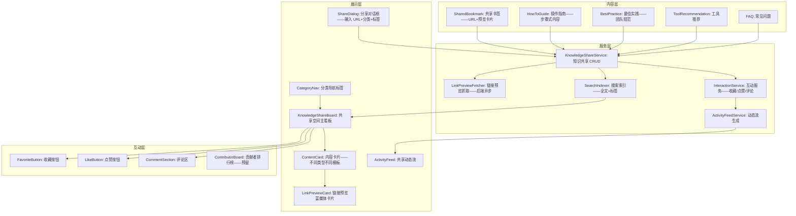

# YV-09-128: 功能实现-知识共享空间 — 团队知识共享中心、共享书签/链接、Wiki 集成、操作指南、最佳实践集、知识共享动态流

> 需求编号：YV-09-128 · 优先级：P2 · 人天：0.3d · 状态：需求已编写
> 依赖：YV-09-85（知识管理面板——提供知识 CRUD 基础设施）、YV-09-27（通知中心——动态流通知）

## 背景

### 问题陈述

团队知识分散在多个平台——没有统一入口来发现、分享和讨论团队集体智慧：

1. **知识孤岛**：重要的技术决策记录在 Slack 里——开发规范在 Confluence——操作指南在个人笔记——每个平台都"有答案"但找不到
2. **新人上手困难**：新成员入职时需要 2 周才能搞清楚"我们要看哪些文档、用哪些工具、遵循哪些规范"——因为知识没有集中导航
3. **最佳实践隐式传播**：有个老员工知道"部署前先跑这个脚本"——但从未写下来——他休假时事故发生了
4. **重复查资料**：每次要用公司 GitLab 镜像地址——都要翻聊天记录——同样的链接被搜了 50 次
5. **知识分享无激励机制**：谁分享了好文章、好工具——没人知道——分享者没有成就感——降低了分享意愿

**核心矛盾**：团队知识天然分散——但搜索行为需要集中。知识共享空间将分散的知识点汇聚到一个可浏览、可搜索、有社交属性的空间——让"别人已经知道的事"不再需要反复询问。

### 影响范围

| # | 影响 | 严重程度 | 典型场景 |
|---|------|----------|----------|
| 1 | 新人 ramp-up 时间长 | 高 | 新同事入职 2 周——还在到处问"这个在哪看" |
| 2 | 知识随人员流失而丢失 | 高 | 老员工离职——带走 3 年的调试技巧——后继无人知道 |
| 3 | 重复查询效率低 | 中 | 同一个部署命令——团队成员在聊天记录里搜了 50 次 |
| 4 | 最佳实践未沉淀 | 中 | 有优化方案——但只有一个人知道——其他人仍在用旧方法 |
| 5 | 分享文化缺失 | 低 | 看到好文章想分享——不知道分享到哪里——算了 |

### 挑战

| 挑战 | 说明 |
|------|------|
| 内容组织 | 书签、Wiki、指南、最佳实践——不同类型内容需要不同的展示模板 |
| 与 YiKnowledge 的关系 | YiVad 的知识共享空间面向团队日常操作——YiKnowledge 面向架构级知识——边界需清晰 |
| 避免信息过载 | 什么都可以分享——但无节制会导致噪音——需要分类和过滤 |
| 内容时效性 | 去年分享的部署命令——今年可能已经废弃——需要标记过期 |
| 激励机制设计 | 分享质量比数量重要——避免为了积分而刷低质量内容 |

---

## 一、现状分析

### 1.1 当前知识共享能力

```
现有相关功能:
├── 知识管理面板 (YV-09-85)
│   ├── 知识文件 CRUD——Markdown 编辑器
│   ├── 偏向"文档管理"——非"社交化共享"
│   └── 无书签、链接、Wiki 集成
├── YiKnowledge (外部知识库)
│   ├── 架构级知识——RAG 可检索
│   ├── 面向全局规范——非团队日常点滴
│   └── 无社交互动——纯知识存储
├── Slack/企业微信聊天记录
│   ├── 大量的"分享链接"——但沉在聊天里
│   └── 无法检索——7 天后就找不到了
├── 通知中心 (YV-09-27)
│   └── 可通知新分享——但无知识流概念

缺失:
├── 共享书签收集                                  # ❌ 无
├── 内部 Wiki (轻量——非 Confluence 重型)          # ❌ 无
├── 操作指南 (How-To) 集中管理                    # ❌ 无
├── 最佳实践集                                    # ❌ 无
├── 知识共享活动流 (谁分享了什么)                  # ❌ 无
├── 收藏/点赞/评论互动                             # ❌ 无
└── 知识贡献者排行榜                               # ❌ 无
```

### 1.2 知识共享流程（现状 vs 目标）

```mermaid
graph TD
    subgraph Current["现状：知识在聊天中流失"]
        C1[张三发现一篇好文章] --> C2[复制链接——贴到 Slack/微信群]
        C2 --> C3[有人看到——打开——关闭]
        C3 --> C4[聊天记录滚动——链接被淹没]
        C4 --> C5[2 周后李四需要这个链接——搜索聊天记录]
        C5 --> C6{找到了?}
        C6 -->|是 20%| C7[运气好——打开使用]
        C6 -->|否 80%| C8[重问——"谁知道那个链接?"——打断 3 个人]
    end

    subgraph Target["目标：知识共享空间——一次分享——永久可用"]
        T1[张三发现一篇好文章] --> T2[打开知识共享空间——点击"分享链接"]
        T2 --> T3[粘贴 URL + 添加描述 + 选择分类 + 打标签]
        T3 --> T4[自动获取: 标题/摘要/缩略图]
        T4 --> T5[发布——出现在共享动态流]
        T5 --> T6[李四打开空间——看到最新分享——收藏]
        T6 --> T7[王五评论: "这个很有用——补充一下第 3 节的注意点"]
        T7 --> T8[3 个月后——新人搜索"部署"——找到这条分享]
    end

    style Current fill:#f8d7da,stroke:#dc3545
    style Target fill:#d4edda,stroke:#28a745
```

### 1.3 根因矩阵

| 症状 | 根因 | 触发条件 | 频率 |
|------|------|----------|------|
| 分享链接在聊天中流失 | 聊天工具为实时沟通设计——非知识存储 | 每次分享链接 | 高频 |
| 新人找不到导航 | 无集中入口——知识分散 | 每次新人入职 | 中 |
| 重复查资料 | 知识未沉淀——每次重新搜索 | 日常工作中 | 中 |
| 最佳实践未显式化 | 无"写下来并分享"的轻量渠道 | 有人发现好东西时 | 中 |
| 分享意愿低 | 无正反馈——分享者无成就感 | 长期 | 低 |

---

## 二、设计决策

### 决策 1：知识共享空间与 YiKnowledge 的关系 — 完全独立 vs 轻量前端+后端复用 vs 深度融合

| 选项 | 内容隔离 | 开发量 | 用户体验 |
|------|----------|--------|---------|
| 完全独立（新建集合+独立 UI） | 清晰 | 高 | 两套系统——用户困惑 |
| 轻量前端——后端复用 YiKnowledge API | 边界模糊 | 中 | 统一体验——但类型混在 |
| 深度融合（YiKnowledge 前端直接嵌入） | 最清晰 | 高 | 统一——但两个知识库的设计目标冲突 |

**选择：轻量前端——共享空间作为 YiVad 内独立的"团队知识"视图。** 底层使用 YiAi 的 knowledge_service 存储——但前端独立于 YiKnowledge 管理界面。YiKnowledge 面向"架构级正式知识"（需求文档、技术规范），共享空间面向"团队日常非正式知识"（书签、操作指南、最佳实践）——通过 `knowledge_type` 字段区分。同一条后端链路——两种前端形态。

### 决策 2：内容类型分类 — 仅 3 类 vs 5 类 vs 无限自定义

| 选项 | 简洁性 | 灵活性 | 推荐使用 |
|------|--------|--------|---------|
| 仅 3 类（书签、指南、最佳实践） | 高 | 低 | 中（3 类可能不够） |
| 5 类（书签、指南、最佳实践、工具推荐、会议纪要） | 中 | 中-高 | 高 |
| 无限自定义分类 | 低 | 极高 | 低（分类爆炸——管理困难） |

**选择：5 类预设——后续可扩展。** 书签（外部链接）、操作指南（How-To）、最佳实践（团队规范）、工具推荐（好用的工具/插件）、常见问题（FAQ）。5 类覆盖 90% 的团队知识需求。预留 `knowledge_type` 字段为枚举——方便后续追加。

### 决策 3：互动功能范围 — 仅浏览 vs 收藏+点赞 vs 完整社交

| 选项 | 互动深度 | 用户粘性 | 开发复杂度 |
|------|----------|---------|-----------|
| 仅浏览（只读——无互动） | 浅（静态页面） | 低 | 低 |
| 收藏+点赞（基本互动） | 中 | 中 | 中 |
| 完整社交（评论+分享+积分+排行榜） | 深 | 高 | 高 |

**选择：收藏+点赞+评论。** 最基本的社交三件套——覆盖了"有用（收藏）、认同（点赞）、讨论（评论）"三个核心互动场景。积分和排行榜在 0.3d 预算内不包含——但预留 `stars_count`、`likes_count`、`comments_count` 字段。所有互动实时反映在知识共享动态流中。

### 决策 4：链接预览机制 — 无预览 vs 前端抓取 vs 后端代理抓取

| 选项 | 展示效果 | 跨域问题 | 实现复杂度 |
|------|----------|---------|-----------|
| 无预览（仅显示 URL） | 差 | 无 | 极低 |
| 前端直接 fetch（受 CSP/CORS 限制——多数站点被拦截） | 不稳定 | 严重 | 低 |
| 后端代理抓取 og:meta——前端展示卡片 | 好 | 无（后端无跨域限制） | 中 |

**选择：后端代理抓取 og:meta + 前端卡片展示。** 用户分享链接时——后端异步抓取目标页面的 `og:title`、`og:description`、`og:image`——生成富媒体预览卡片。后端抓取不受 CORS 限制。失败时降级为纯文本链接。复用 YiAi 已有的 HTTP 客户端基础设施。

### 设计决策记录

| 决策 | 选项 A | 选项 B | 选项 C | 选择 | 理由 |
|------|--------|--------|--------|------|------|
| YiKnowledge 关系 | 完全独立 | 轻量复用 | 深度融合 | **轻量复用** | 统一后端+差异化前端 |
| 内容分类 | 3 类 | 5 类 | 无限自定义 | **5 类** | 覆盖 90%+可扩展 |
| 互动功能 | 仅浏览 | 收藏+点赞 | 完整社交 | **收藏+点赞+评论** | 核心互动三件套 |
| 链接预览 | 无预览 | 前端抓取 | 后端代理 | **后端代理** | 无 CORS 限制 |

---

## 三、目标架构

### 3.1 知识共享空间系统架构



### 3.2 链接分享流程

```mermaid
graph TD
    A[用户点击"分享链接"] --> B[ShareDialog 打开: URL 输入框 + 分类 + 标签]
    B --> C[用户粘贴 URL——失去焦点或点击"获取预览"]
    C --> D[前端调用 API: POST /knowledge/share/preview——body: url]
    D --> E[后端发起 HTTP GET——解析 og:title/description/image]
    E --> F{og:image 存在?}
    F -->|是| G[返回预览卡片数据: title, desc, image, url]
    F -->|否| H[返回纯文本预览: title, desc, url——无图]
    G --> I[前端渲染预览卡片——用户确认]
    H --> I
    I --> J[用户填写: 个人注释——为什么值得分享——选择分类]
    J --> K[点击"分享到空间"]
    K --> L[POST /knowledge/share/create——创建共享条目]
    L --> M[自动生成: 动态流条目 "张三分享了一个链接: XXX"]
    M --> N[返回新条目——插入看板顶部——动态流更新]
```

### 3.3 架构决策权衡

| 维度 | 改造前 | 改造后 | 权衡说明 |
|------|--------|--------|----------|
| 知识组织 | 散落在聊天工具 | 集中分类+标签+搜索 | 组织成本 vs 检索效率 |
| 知识发现 | 被动搜索聊天记录 | 主动浏览+动态流推送 | 发现性 vs 信息过载 |
| 知识留存 | 7 天聊天记录 | 永久存储+标记过期 | 持久化 vs 维护成本 |
| 分享激励 | 无反馈 | 收藏/点赞/评论 | 激励 vs 噪音风险 |

---

## 四、具体改动

### 4.1 改动总览

| 改动点 | 类型 | 涉及文件 | 预估行数 |
|--------|------|---------|---------|
| 知识共享类型定义 | 新增 | `types/knowledgeShare.ts` | 80 行 |
| 知识共享 API 服务 | 新增 | `services/knowledgeShareService.ts` | 70 行 |
| 知识共享状态管理 | 新增 | `composables/useKnowledgeShare.ts` | 90 行 |
| 链接预览工具 | 新增 | `utils/linkPreview.ts` | 40 行 |
| 知识共享主页面 | 新增 | `views/team/KnowledgeShare.vue` | 100 行 |
| 内容卡片组件 | 新增 | `components/knowledge/ContentCard.vue` | 80 行 |
| 链接预览卡片 | 新增 | `components/knowledge/LinkPreviewCard.vue` | 60 行 |
| 分享对话框 | 新增 | `components/knowledge/ShareDialog.vue` | 80 行 |
| 评论区组件 | 新增 | `components/knowledge/CommentSection.vue` | 70 行 |
| 动态流组件 | 新增 | `components/knowledge/ActivityFeed.vue` | 60 行 |
| 分类导航 | 新增 | `components/knowledge/CategoryNav.vue` | 40 行 |
| 路由 + 菜单配置 | 扩展 | `routes.ts` | 15 行 |

### 4.2 涉及文件

```
src/
├── components/knowledge/
│   ├── ContentCard.vue               # 新增：通用内容卡片——根据类型切换模板
│   ├── LinkPreviewCard.vue           # 新增：链接预览富媒体卡片
│   ├── ShareDialog.vue               # 新增：分享对话框——URL+分类+标签+注释
│   ├── CommentSection.vue            # 新增：评论区——列表+发布
│   ├── ActivityFeed.vue              # 新增：知识共享动态流
│   └── CategoryNav.vue               # 新增：分类导航标签
├── composables/
│   └── useKnowledgeShare.ts          # 新增：知识共享状态管理
├── services/
│   └── knowledgeShareService.ts      # 新增：知识共享 API
├── types/
│   └── knowledgeShare.ts             # 新增：知识共享类型定义
├── utils/
│   └── linkPreview.ts                # 新增：链接预览辅助
├── views/team/
│   └── KnowledgeShare.vue            # 新增：知识共享空间主页面
└── router/routes.ts                   # 修改：路由+菜单配置
```

### 4.3 核心类型定义

```typescript
// types/knowledgeShare.ts

export type KnowledgeShareType =
  | 'bookmark'       // 共享书签
  | 'howto'          // 操作指南
  | 'best_practice'  // 最佳实践
  | 'tool'           // 工具推荐
  | 'faq';           // 常见问题

export type KnowledgeShareStatus = 'active' | 'outdated' | 'archived';

export interface KnowledgeShareItem {
  key: string;
  type: KnowledgeShareType;
  title: string;
  description: string;                  // 描述——为什么值得看
  tags: string[];
  author: string;
  authorName: string;

  // 链接类特有 (bookmark, tool)
  url?: string;
  linkPreview?: LinkPreviewData;

  // 内容类特有 (howto, best_practice, faq)
  content?: string;                     // Markdown 内容
  steps?: HowToStep[];                  // 操作指南步骤

  // 互动统计
  favorites_count: number;
  likes_count: number;
  comments_count: number;

  // 用户当前互动状态
  is_favorited?: boolean;
  is_liked?: boolean;

  status: KnowledgeShareStatus;

  created_at: string;
  updated_at: string;
}

export interface LinkPreviewData {
  url: string;
  title: string;
  description: string;
  image_url?: string;
  site_name?: string;
  favicon_url?: string;
  fetched_at: string;
}

export interface HowToStep {
  order: number;
  title: string;
  description: string;
  code_snippet?: string;
  screenshot_url?: string;
}

export interface Comment {
  key: string;
  share_item_key: string;
  author: string;
  authorName: string;
  authorAvatar?: string;
  content: string;
  created_at: string;
  updated_at?: string;
}

export interface ActivityFeedEntry {
  key: string;
  type: 'shared' | 'liked' | 'commented' | 'favorited';
  share_item_key: string;
  share_item_title: string;
  actor: string;
  actorName: string;
  timestamp: string;
  comment_preview?: string;
}

export interface KnowledgeShareFilter {
  type?: KnowledgeShareType;
  tags?: string[];
  status?: KnowledgeShareStatus;
  search?: string;
  sort: 'newest' | 'popular' | 'most_favorited';
}

export const SHARE_TYPE_LABELS: Record<KnowledgeShareType, string> = {
  bookmark: '书签',
  howto: '操作指南',
  best_practice: '最佳实践',
  tool: '工具推荐',
  faq: '常见问题',
};

export const SHARE_TYPE_ICONS: Record<KnowledgeShareType, string> = {
  bookmark: 'ph:bookmark',
  howto: 'ph:list-checks',
  best_practice: 'ph:star',
  tool: 'ph:wrench',
  faq: 'ph:question',
};
```

### 4.4 评论组件逻辑

```typescript
// components/knowledge/CommentSection.vue

// 核心功能:
// 1. 评论列表——时间倒序——每页 10 条
// 2. 每条评论显示: 头像 + 姓名 + 时间 + 内容
// 3. 评论输入框: 支持 Markdown inline（加粗/代码——不支持图片）
// 4. 发布评论: Enter 提交——Shift+Enter 换行
// 5. 实时更新互动计数——发布后自动 +1
// 6. 空状态: "成为第一个评论的人"
// 7. 加载更多: 滚动到底部自动加载
```

---

## 五、实施步骤

| 步骤 | 内容 | 涉及文件 | 验证方式 | 人天 |
|------|------|---------|---------|------|
| 1 | 类型定义 + API 服务 | `types/knowledgeShare.ts`, `services/knowledgeShareService.ts` | 类型检查通过 | 0.03 |
| 2 | useKnowledgeShare 状态管理 | `composables/useKnowledgeShare.ts` | CRUD+筛选+互动状态正确 | 0.04 |
| 3 | CategoryNav + ShareDialog | `CategoryNav.vue`, `ShareDialog.vue`, `utils/linkPreview.ts` | 分类筛选+分享对话+预览 | 0.05 |
| 4 | ContentCard + LinkPreviewCard | `ContentCard.vue`, `LinkPreviewCard.vue` | 5 种类型卡片渲染正确 | 0.05 |
| 5 | CommentSection + ActivityFeed | `CommentSection.vue`, `ActivityFeed.vue` | 评论+动态流功能 | 0.05 |
| 6 | KnowledgeShare 主页面 | `KnowledgeShare.vue` | 完整布局+交互 | 0.05 |
| 7 | 路由 + 菜单配置 | `routes.ts` | 页面可访问 | 0.01 |
| 8 | 搜索+边界处理 | 复用搜索组件 | 全文搜索+空状态+加载 | 0.02 |

**总计：0.3d**

---

## 六、测试规格

### 场景 1：分享外部链接

**GIVEN** 张三发现一篇关于 Vue 3.5 性能优化的好文章
**WHEN** 打开知识共享空间——点击"分享链接"按钮
**THEN** ShareDialog 弹出——输入框自动聚焦
**WHEN** 粘贴 URL "https://example.com/vue3-perf"——失去焦点或点击"获取预览"
**THEN** 显示加载动画——1-2 秒后显示预览卡片
**AND** 卡片包含: 标题 "Vue 3.5 性能优化指南", 描述, 缩略图
**WHEN** 用户选择分类 "书签"——添加标签 "vue, 性能"——输入注释 "第 4 节讲虚拟列表很实用"
**WHEN** 点击"分享到空间"
**THEN** 新条目出现在看板顶部——显示完整预览卡片 + 注释
**AND** 动态流出现 "张三 分享了书签: Vue 3.5 性能优化指南"

### 场景 2：浏览和筛选

**GIVEN** 知识共享空间有 20 条各类内容
**WHEN** 用户打开空间——默认按"最新"排序
**THEN** 显示所有条目——卡片式排列——每行 2-3 个卡片
**WHEN** 点击分类导航"操作指南"
**THEN** 过滤仅显示操作指南类型的条目——3 条
**WHEN** 输入搜索关键词"部署"
**THEN** 搜索标题、描述、标签——显示 2 条结果——高亮匹配文字
**WHEN** 清空筛选——恢复全部显示

### 场景 3：互动——收藏和点赞

**GIVEN** 知识共享空间显示一条"Redis 常用命令"操作指南
**WHEN** 用户点击收藏按钮（星形图标）
**THEN** 星形图标变为实心——收藏数 +1——显示 Toast "已收藏"
**WHEN** 再次点击
**THEN** 取消收藏——图标变回空心——收藏数 -1
**WHEN** 点击点赞按钮（竖起拇指）
**THEN** 图标高亮——点赞数 +1
**AND** 动态流出现 "李四 赞了 操作指南: Redis 常用命令"

### 场景 4：评论互动

**GIVEN** 一条"Git Flow 最佳实践"有 0 条评论
**WHEN** 用户展开评论区——输入 "我们团队用 GitHub Flow 更简单——推荐加上对比"
**WHEN** 点击发布（或 Enter）
**THEN** 评论立即显示在列表中——用户名 + 时间 + 内容
**AND** 评论数更新为 1
**AND** 动态流出现 "王五 评论了 最佳实践: Git Flow 最佳实践"
**WHEN** 另一个用户打开——可以看到这条评论

### 场景 5：标记内容过期

**GIVEN** 一条 6 个月前分享的"CI 部署流程"指南
**WHEN** 作者或管理员发现部署流程已经变化——内容过时
**THEN** 打开条目——点击"标记为过时"
**AND** 卡片顶部显示黄色"内容可能已过时"标签
**AND** 作者收到通知——建议更新或归档
**WHEN** 其他用户浏览时
**THEN** 过时条目默认排在后面——但可搜索到

### 场景 6：内容搜索索引

**GIVEN** 知识共享空间有 50 条内容
**WHEN** 用户在搜索框输入 "Docker compose"
**THEN** 搜索按匹配度排序: 标题完全匹配 > 标签匹配 > 描述匹配 > 内容匹配
**AND** 搜索结果高亮匹配的关键词
**AND** 无匹配: 显示 "未找到相关内容——尝试其他关键词"
**AND** 搜索结果包含不同类型的内容——用类型标签区分

---

## 七、风险与缓解

| 风险 | 概率 | 影响 | 等级 | 缓解措施 | 应急预案 |
|------|------|------|------|----------|----------|
| 外部链接失效——预览抓取超时 | 中 | 低 | 低 | 抓取超时 5 秒——降级为纯文本链接 | 已失效的链接标记"链接可能无效"——用户可手动编辑 |
| 低质量内容涌入——刷屏 | 中 | 中 | 中 | 分享需要填写描述和标签——至少 10 字描述才可发布 | 管理员可归档或删除低质量内容——权限控制 |
| 与 YiKnowledge 内容重复 | 低 | 中 | 低 | 共享空间强调"链接+轻量内容"——YiKnowledge 是"正式 Markdown 文档"——定位差异自然避免重复 | 发现高质量共享内容——可一键"升级为正式知识文档" |
| 评论被滥用——垃圾信息 | 低 | 中 | 低 | 评论仅团队内可见——不公开 | 管理员可删除评论——严重情况下禁用评论功能 |

---

## 八、回滚策略

| 回滚场景 | 回滚方式 | 影响范围 | 恢复时间 |
|----------|----------|----------|----------|
| 页面功能异常 | `git revert` + 移除路由 | 知识共享空间功能 | < 1min |
| 链接预览抓取影响后端性能 | 关闭抓取——仅显示纯文本链接 | 预览卡片 | < 1min（特性开关） |
| 评论功能异常 | 隐藏评论组件——仅保留浏览 | 互动功能 | < 1min |
| 数据模型不符预期 | 回滚前端——后端数据保留 | 新功能 | < 1min |

**回滚验证：**
- 回滚后不影响知识管理面板 (YV-09-85) 功能
- 共享数据保留在 MongoDB——前端恢复后可继续使用
- 评论和互动数据不丢失

---

## 九、设计决策记录

### D-01：为什么不做积分排行榜？

积分排行榜（按分享数/收藏数/评论数排名）是有效的激励工具——但在小团队（< 20 人）中——排名倒数的人可能感到压力——反而降低参与意愿。而且积分系统需要反作弊机制（防止刷分、小号）——0.3d 预算不够。先做收藏/点赞/评论——观察自然互动情况——再决定是否引入积分。

### D-02：为什么链接预览使用后端代理而非前端 fetch？

前端 `fetch(url)` 受浏览器 CORS 策略限制——绝大多数外部站点不允许来自 `localhost:8848` 的跨域请求。后端不受此限制。而且后端可以: 1) 缓存预览数据（同一 URL 不重复抓取）2) 超时控制更可靠 3) 验证 URL 安全性（防止 SSRF 攻击——限制仅抓取 http/https——禁止内网 IP）。

### D-03：为什么内容分类是预设而非自定义标签？

预设 5 类保证了每个分类都有针对性的展示模板（书签有预览卡片、指南有步骤列表、最佳实践有采纳标记）。自定义分类意味着"统一卡片模板"——失去了分类的差异化价值。标签字段已经提供了自定义维度——用户可以用标签补充"部署"、"前端"、"后端"等任意维度。

### D-04：为什么评论使用简单文本而非 Markdown？

评论的核心价值是快速反馈和讨论——不需要标题、列表、代码块等复杂格式。支持完整 Markdown 会增加解析漏洞（XSS 风险）、渲染性能开销和用户学习成本。提供基本的加粗和代码高亮（反引号）——满足 90% 的评论需求。

---

## 十、可观测性

### 关键指标

| 指标 | 采集方式 | 告警阈值 | 说明 |
|------|---------|---------|------|
| 分享创建数 | 操作计数 | 周环比下降 > 50% | 分享活跃度下降 |
| 链接预览抓取成功率 | 成功/总请求 | < 90% | 抓取服务问题 |
| 每日活跃用户数 | 页面访问 | — | 功能使用率 |
| 平均评论数/条目 | 自动计算 | — | 互动深度 |
| 链接失效率 | 定期检查 | > 10% | 内容质量 |

### 日志规范

| 日志级别 | 场景 | 示例 |
|---------|------|------|
| `INFO` | 新分享创建 | `[KnowledgeShare] Created: type=bookmark, author=zhangsan, url=<url>` |
| `INFO` | 链接预览抓取 | `[LinkPreview] Fetched: url=<url>, time=1.2s` |
| `WARN` | 链接抓取超时 | `[LinkPreview] Timeout: url=<url>, time=5.0s` |
| `ERROR` | 链接抓取失败 | `[LinkPreview] Failed: url=<url>, error=connection refused` |
| `INFO` | 互动操作 | `[KnowledgeShare] Interaction: type=like, item=<key>, actor=lisi` |

---

## 十一、代码审查检查清单

- [ ] ShareDialog: URL 格式校验——非空——Https/http 协议——前端基础校验
- [ ] ShareDialog: 描述最少 10 字符——标签至少 1 个
- [ ] LinkPreviewCard: 图片加载失败时——显示占位图标——不破坏卡片布局
- [ ] ContentCard: 5 种类型对应 5 种模板——模板切换不闪屏
- [ ] CommentSection: Markdown 渲染使用 DOMPurify 清洗——防止 XSS
- [ ] ActivityFeed: 动态流随时间更新——不多次渲染同一条目
- [ ] useKnowledgeShare: 加载更多时——isLoading 状态防止重复请求
- [ ] useKnowledgeShare: 互动（收藏/点赞）乐观更新——失败回滚
- [ ] CategoryNav: 显示每个分类的条目数
- [ ] `vue-tsc --noEmit` 通过

---

## 回归问题预测

| # | 问题 | 发现场景 | 根因 | 修复方式 |
|---|------|---------|------|---------|
| 1 | 链接预览抓取 hang 住——页面无响应 | 用户分享一个响应极慢的 URL | 后端抓取无超时或超时过长 | 设置 5 秒超时——并行最多 3 个抓取——超过的直接显示纯文本 |
| 2 | og:image 被 CDN 屏蔽——预览卡片无图 | 特定站点的图片 CDN 有防盗链 | Referer 头未设置正确 | 后端抓取设置 User-Agent 和空 Referer——失败时尝试无图降级 |
| 3 | 评论列表过长导致页面滚动性能问题 | 一条热门内容有 200+ 条评论 | 一次性渲染所有评论 | 评论分页加载——每页 10 条——滚动加载更多 |
| 4 | 搜索中文分词不准确 | 搜索"部署环境"——不匹配"生产环境部署" | 后端使用简单 LIKE 查询——无分词 | 引入 jieba 分词——或使用 MongoDB text index 中文分词 |
| 5 | 标签大小写导致搜索遗漏 | 有人标"Vue"——有人标"vue"——搜索"vue"漏掉了 | 标签存储为原始大小写——搜索区分大小写 | 标签统一存储为小写——搜索自动转小写 |
| 6 | 分享内容与 YiKnowledge 正式文档产生版本分歧 | 共享空间有"API 接口规范v2"——YiKnowledge 有"API 接口规范v3"——新人困惑 | 两个系统内容同步机制缺失 | 在内容卡片上添加提示"查看最新正式版本"——链接到 YiKnowledge 同名文档 |

---

## 性能分析

### 各操作耗时

| 操作 | 数据量 | 耗时 |
|------|--------|------|
| 知识共享主页初始加载 | 20 条 | < 300ms |
| 搜索（全文搜索 100 条） | 100 条 | < 200ms |
| 链接预览抓取（后端） | 1 个 URL | 1-3s（异步） |
| 链接预览卡片渲染 | 1 个卡片 | < 50ms |
| 评论列表加载（10 条） | 10 条 | < 100ms |
| 动态流加载（20 条） | 20 条 | < 150ms |
| 收藏/点赞切换 | 单条操作 | < 100ms |

### 存储预估

| 数据 | 大小 |
|------|------|
| 单条共享条目（无内容） | ~2KB |
| 单条共享条目（含 Markdown 内容） | ~5KB |
| 链接预览缓存（含图片 Base64 缩略图） | ~50KB |
| 单条评论 | ~500B |
| 活动流条目 | ~300B |

