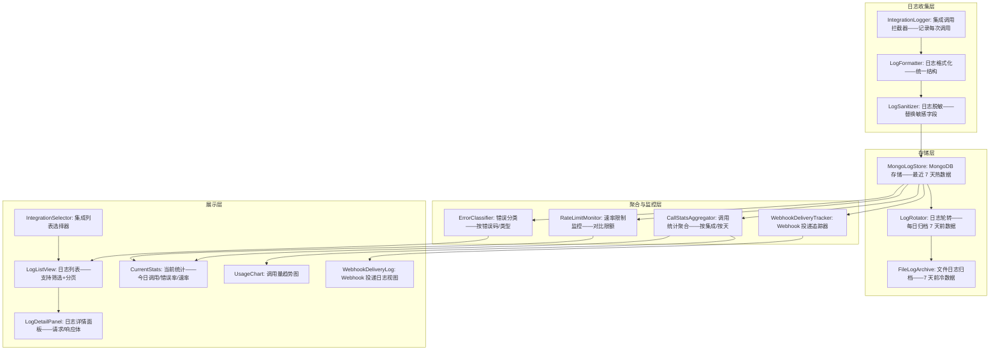

# YV-09-129: 外部集成日志 — 按集成维度的请求/响应日志、错误追踪、速率限制监控、集成使用分析、Webhook 投递日志

> 需求编号：YV-09-129 · 优先级：P2 · 人天：0.3d · 状态：需求已编写
> 依赖：YV-09-67（Webhook 管理界面——提供 Webhook 配置和投递基础设施）、YV-09-67（集成市场——集成注册信息）

## 背景

### 问题陈述

随着 YiVad 对接的外部服务增多（企业微信、飞书、钉钉、GitLab、GitHub、邮件服务、SMS 等），集成日志管理成为运维盲区：

1. **集成调用不可见**：不知道"企业微信机器人今天发了多少条消息"——不知道"GitHub webhook 是否正常推送到"——所有集成调用对运维来说都是黑盒
2. **集成错误无处追踪**：用户反馈"企业微信通知没收到"——排查需要: 1) 登录服务器查日志 2) grep 关键词 3) 分析原因——耗时 15-30 分钟
3. **速率限制被触发**：某个服务调用了企业微信 API 频率过高——被限流——后续消息全部丢失——等发现时已经积压了 200 条未发送通知
4. **Webhook 投递不知状态**：配置了 10 个 webhook——其中 2 个目标 URL 已经失效——但没人知道——数据一直在黑洞中丢失
5. **集成使用分析缺失**：不知道"哪个集成使用最多"——不知道"企业微信 API 每月调用量趋势"——无法合理分配维护资源

**核心矛盾**：外部集成越多——日志越重要——但非集中化的日志查看方式让排查和监控成本线性增长。集成日志面板将分散的调用日志汇聚——提供按集成维度的统一视图——从"grep 日志"到"面板点击"。

### 影响范围

| # | 影响 | 严重程度 | 典型场景 |
|---|------|----------|----------|
| 1 | 集成故障排查耗时长 | 高 | 企业微信通知丢失——排查 30 分钟——发现 token 过期 |
| 2 | 速率限制触发无预警 | 高 | 飞书 API 被限流——200 条消息丢失——用户投诉 |
| 3 | Webhook 失效未发现 | 中 | webhook URL 迁移后——3 天数据丢失——无人知晓 |
| 4 | 集成调用量无统计 | 中 | 不知道 5 个集成中哪个消耗最多——优化方向不明确 |
| 5 | 审计合规风险 | 中 | 需要导出"本月所有企业微信通知"作为审计证据——无集中日志 |

### 挑战

| 挑战 | 说明 |
|------|------|
| 日志量大 | 每天数千条请求——需要后端自动聚合——前端仅展示聚合视图 |
| 多集成格式不统一 | 企业微信、GitHub、邮件——每个集成的请求/响应格式不同——需要统一展示模板 |
| 实时性需求 | 错误告警需要近实时——但不能用 WebSocket（0.3d 预算不够）——轮询 30 秒 |
| 敏感信息脱敏 | 请求/响应体中包含 token、密钥——前端展示需要脱敏 |
| 与系统级日志的关系 | 集成日志是"用户级"可观测性——补充而非替代服务器系统日志 |

---

## 一、现状分析

### 1.1 当前集成日志能力

```
现有集成相关功能:
├── Webhook 管理界面 (YV-09-67)
│   ├── Webhook 配置（URL, secret, events）
│   ├── 启用/禁用管理
│   └── 无投递日志——无成功/失败统计
├── 集成市场 (YV-09-86)
│   ├── 集成注册和配置
│   └── 无调用日志视图
├── API 令牌管理 (YV-09-60)
│   └── 令牌创建和管理——无使用日志
├── 活动日志与审计 (YV-09-50)
│   ├── 通用操作日志——偏向用户操作
│   └── 不涵盖外部 API 调用细节

缺失:
├── 按集成维度的调用日志列表                           # ❌ 无
├── 请求/响应展示（脱敏后）                            # ❌ 无
├── 集成错误分类与追踪                                 # ❌ 无
├── 速率限制监控仪表盘                                 # ❌ 无
├── 集成调用量统计分析                                 # ❌ 无
├── Webhook 投递日志（每次投递的状态+重试）             # ❌ 无
├── 集成错误率告警                                     # ❌ 无
└── 日志导出功能                                       # ❌ 无
```

### 1.2 集成日志查看流程（现状 vs 目标）

```mermaid
graph TD
    subgraph Current["现状：SSH 登录服务器查日志"]
        C1[用户反馈 "企业微信通知没收到"] --> C2[运维 SSH 登录服务器]
        C2 --> C3[cd /var/log/yiAi/]
        C3 --> C4[grep "wechat\|wecom" *.log]
        C4 --> C5{日志量?}
        C5 -->|几百行| C6[逐行阅读——找错误]
        C5 -->|几千行| C7[grep -i error——缩小范围]
        C6 --> C8[发现 token 过期——重新生成]
        C8 --> C9[清理 grep 命令行历史——token 可能泄露]
        C7 --> C8
    end

    subgraph Target["目标：管理面板一键查看"]
        T1[管理员打开 "外部集成日志" 页面] --> T2[左侧: 集成列表——企业微信/飞书/GitHub/邮件...]
        T2 --> T3[点击 "企业微信"]
        T3 --> T4[右侧: 日志列表——最近 200 条调用记录]
        T4 --> T5[筛选: 只看错误——点击错误条目展开详情]
        T5 --> T6[请求体: POST /cgi-bin/message/send——错误: invalid access_token, code=40001]
        T6 --> T7[顶部仪表盘: 今日调用 500 次——错误率 2%——速率限额 40%]
        T7 --> T8[发现 token 过期——直接跳转到集成配置更新 token]
    end

    style Current fill:#f8d7da,stroke:#dc3545
    style Target fill:#d4edda,stroke:#28a745
```

### 1.3 根因矩阵

| 症状 | 根因 | 触发条件 | 频率 |
|------|------|----------|------|
| 集成排查耗时长 | 日志分散在服务器——无 UI 访问 | 每次集成出问题 | 高频 |
| 速率限制触发后才发现 | 无限流上限可视化监控 | API 调用频率高时 | 中 |
| Webhook 失效长时间未知 | 无投递状态追踪和失败告警 | webhook 目标变更时 | 中 |
| 敏感信息 grep 泄露风险 | 排查时可能看到明文的 token/secret | 排查日志时 | 低 |
| 使用趋势不可知 | 无统计聚合 | 评估集成价值和维护优先级时 | 低 |

---

## 二、设计决策

### 决策 1：日志存储策略 — 前端实时查询后端日志 vs MongoDB 持久化 vs 两者结合

| 选项 | 查询速度 | 存储成本 | 历史数据 |
|------|----------|---------|---------|
| 前端实时查询（后端 tail 文件日志——实时返回） | 中 | 低（不额外存储） | 仅近 1-2 小时 |
| MongoDB 持久化存储所有调用日志 | 高 | 高（每天数 MB） | 全量历史 |
| 两者结合（MongoDB 存储最近 7 天——文件日志存储全量） | 高 | 中 | 7 天热数据 + 文件冷数据 |

**选择：两者结合。** MongoDB 存储最近 7 天的调用日志——提供快速查询和聚合。7 天前的日志自动归档到文件系统。前端默认查询最近 24 小时——可通过日期选择器扩大到 7 天。7 天以后的历史——构建冷查询接口（读取文件日志——慢但存在）。

### 决策 2：日志粒度 — 仅记录错误 vs 记录所有调用 vs 抽样记录

| 选项 | 覆盖度 | 存储压力 | 排查能力 |
|------|--------|---------|---------|
| 仅记录错误（错误率 < 5%） | 低 | 极低 | 失败排查——无调用量分析 |
| 记录所有调用 | 100% | 高 | 完整 |
| 抽样记录（正常调用抽样 10%——错误全量） | 高 | 中 | 基本够用——但会丢失特定请求 |

**选择：记录所有调用——保留 7 天。** 调用日志的结构化数据量不大（每条约 1KB）——每天 5000 次调用约 5MB——7 天 35MB——对 MongoDB 完全可接受。全量记录确保: 1) 任何一次调用都可追溯 2) 使用统计准确 3) 审计合规完整。7 天后自动轮转。

### 决策 3：请求响应体展示 — 完整展示 vs 脱敏展示 vs 脱敏+可切换

| 选项 | 安全性 | 调试便利性 | 实现复杂度 |
|------|--------|--------|-----------|
| 完整展示（裸数据——包括 token） | 低（安全风险） | 高 | 低 |
| 脱敏展示（token → ****，key → ****） | 高 | 中（被脱敏的内容不可见） | 中 |
| 脱敏展示 + 管理员"查看原文"（需二次确认） | 最高 | 高 | 中 |

**选择：脱敏展示 + 管理员"查看原文"（需二次确认）。** 默认脱敏: 匹配到 token/key/secret/password/authorization 字段——用 `****` 替代值。管理员可点击"显示原文"——弹出二次确认对话框: "显示敏感信息仅供调试——操作将被审计记录"——确认后临时显示原文 60 秒——超时自动重新脱敏。

### 决策 4：实时性策略 — 轮询 vs WebSocket vs SSE

| 选项 | 实时性 | 服务端复杂度 | 前端实现复杂度 |
|------|--------|------------|-------------|
| 轮询（30 秒一次） | 低（延迟 < 30s） | 低 | 低 |
| WebSocket（推送） | 极高（延迟 < 100ms） | 高 | 中 |
| SSE（服务器推送事件） | 高（延迟 < 1s） | 中 | 中 |

**选择：轮询 30 秒——手动刷新。** 集成日志不是秒级敏感的场景——30 秒延迟足够。页面提供"手动刷新"按钮——紧急排查时可立即刷新。WebSocket/SSE 增加了连接管理复杂度——在 0.3d 预算内不值得。后续如果集成错误告警需求强烈——再引入 SSE 推送。

### 设计决策记录

| 决策 | 选项 A | 选项 B | 选项 C | 选择 | 理由 |
|------|--------|--------|--------|------|------|
| 日志存储 | 实时查询文件 | MongoDB 全量 | 两者结合 | **两者结合** | 热冷分离 |
| 日志粒度 | 仅错误 | 全量 | 抽样 | **全量 7 天** | 完整性+可接受成本 |
| 信息脱敏 | 完整展示 | 脱敏 | 脱敏+可切换 | **脱敏+确认查看** | 安全+调试 |
| 实时性 | 轮询 30s | WebSocket | SSE | **轮询 30s** | 足够+低成本 |

---

## 三、目标架构

### 3.1 外部集成日志系统架构



### 3.2 日志查询流程

```mermaid
graph TD
    A[管理员选择集成: 企业微信] --> B[默认加载最近 24 小时日志]
    B --> C{按状态筛选?}
    C -->|全选| D[加载全部状态]
    C -->|仅错误| E[加载 status>=400 或包含 error 的记录]
    C -->|仅成功| F[加载 status=2xx 的记录]

    D --> G[渲染日志列表: 每条显示时间+状态码+端点+耗时+摘要]
    E --> G
    F --> G

    G --> H{点击某条日志?}
    H -->|是| I[展开详情面板]
    I --> J[左栏: 请求——Method+URL+Headers+Body (脱敏)]
    I --> K[右栏: 响应——Status+Headers+Body (脱敏)]
    I --> L[顶部: 复制请求 CURL / 查看原文(60s) / 导出本条]

    H -->|否| M[继续浏览]

    G --> N{修改日期范围?}
    N -->|昨天| O[重新查询: start=昨天 00:00, end=昨天 23:59]
    N -->|最近 7 天| P[重新查询——分页加载——每页 50 条]
```

### 3.3 架构决策权衡

| 维度 | 改造前 | 改造后 | 权衡说明 |
|------|--------|--------|----------|
| 日志可访问 | SSH+终端+grep | Web UI+筛选+搜索 | 易用性 vs 安全（SSH 更安全） |
| 排查效率 | 15-30 分钟 | < 2 分钟 | 效率提升 vs 开发成本 |
| 速率监控 | 无 | 实时使用率+历史趋势 | 可观测性 vs 存储成本 |
| 信息可见 | 完整（含敏感信息风险） | 脱敏（安全）——可切换 | 安全性 vs 调试便利 |

---

## 四、具体改动

### 4.1 改动总览

| 改动点 | 类型 | 涉及文件 | 预估行数 |
|--------|------|---------|---------|
| 集成日志类型定义 | 新增 | `types/integrationLog.ts` | 70 行 |
| 集成日志 API 服务 | 新增 | `services/integrationLogService.ts` | 80 行 |
| 集成日志状态管理 | 新增 | `composables/useIntegrationLog.ts` | 90 行 |
| 集成日志主页面 | 新增 | `views/monitor/IntegrationLogs.vue` | 100 行 |
| 日志列表组件 | 新增 | `components/integration/LogList.vue` | 80 行 |
| 日志详情面板 | 新增 | `components/integration/LogDetail.vue` | 90 行 |
| 集成统计仪表盘 | 新增 | `components/integration/IntegrationStats.vue` | 70 行 |
| Webhook 投递日志组件 | 新增 | `components/integration/WebhookDeliveryLog.vue` | 60 行 |
| 日志筛选栏 | 新增 | `components/integration/LogFilter.vue` | 50 行 |
| 路由 + 菜单配置 | 扩展 | `routes.ts` | 15 行 |

### 4.2 涉及文件

```
src/
├── components/integration/
│   ├── LogList.vue                   # 新增：日志列表——时间轴样式
│   ├── LogDetail.vue                 # 新增：日志详情——请求/响应双栏
│   ├── IntegrationStats.vue          # 新增：集成统计仪表盘
│   ├── WebhookDeliveryLog.vue        # 新增：Webhook 投递日志
│   └── LogFilter.vue                 # 新增：日志筛选器
├── composables/
│   └── useIntegrationLog.ts          # 新增：集成日志状态管理
├── services/
│   └── integrationLogService.ts      # 新增：集成日志 API
├── types/
│   └── integrationLog.ts             # 新增：集成日志类型定义
├── views/monitor/
│   └── IntegrationLogs.vue           # 新增：集成日志主页面
└── router/routes.ts                   # 修改：路由+菜单配置
```

### 4.3 核心类型定义

```typescript
// types/integrationLog.ts

export type IntegrationName = 'wecom' | 'feishu' | 'dingtalk' | 'github' | 'gitlab' | 'email' | 'sms' | string;

export type LogStatus = 'success' | 'client_error' | 'server_error' | 'timeout' | 'rate_limited';

export interface IntegrationCallLog {
  key: string;
  integration: IntegrationName;        // 集成名称
  integration_label: string;           // 显示名称——"企业微信"
  method: 'GET' | 'POST' | 'PUT' | 'DELETE' | 'PATCH';
  endpoint: string;                    // API 端点——如 /cgi-bin/message/send
  full_url: string;                    // 完整 URL（脱敏后）
  request_headers: Record<string, string>;  // 请求头（已脱敏）
  request_body: string | null;         // 请求体（已脱敏 JSON 字符start）
  response_status: number;             // HTTP 状态码
  response_headers: Record<string, string>;
  response_body: string | null;        // 响应体（已脱敏）
  duration_ms: number;                 // 请求耗时 ms
  error_code?: string;                 // 业务错误码——如 40001
  error_message?: string;             // 错误消息
  status: LogStatus;
  rate_limit_info?: {
    limit: number;                     // 限额
    remaining: number;                 // 剩余
    reset_at: string;                  // 重置时间
  };
  retry_count: number;                 // 重试次数
  created_at: string;
}

export interface IntegrationLogFilter {
  integration?: IntegrationName;
  status?: LogStatus;
  method?: string;
  date_start?: string;                // YYYY-MM-DD
  date_end?: string;
  search?: string;                    // 搜索关键词（URL/error_message）
  page: number;
  page_size: number;
}

export interface IntegrationStats {
  integration: IntegrationName;
  integration_label: string;
  period: { start: string; end: string };

  total_calls: number;
  success_count: number;
  error_count: number;
  timeout_count: number;
  rate_limited_count: number;

  success_rate: number;               // 0.0 - 1.0
  avg_duration_ms: number;
  p95_duration_ms: number;
  p99_duration_ms: number;

  rate_limit_usage_percent: number;   // 当前速率限额使用比例
  top_errors: { error_code: string; count: number; message: string }[];

  daily_breakdown: {                  // 每日调用量趋势
    date: string;
    total: number;
    errors: number;
  }[];
}

export interface WebhookDeliveryRecord {
  key: string;
  webhook_config_key: string;
  webhook_name: string;
  event_type: string;
  target_url: string;
  status: 'delivered' | 'failed' | 'pending' | 'retrying';
  attempt: number;
  max_attempts: number;
  request_body: string | null;
  response_status?: number;
  response_body?: string | null;
  error_message?: string;
  duration_ms: number;
  created_at: string;
  next_retry_at?: string;
}

export interface LogDetailView {
  log: IntegrationCallLog;
  show_sensitive: boolean;            // 是否显示敏感信息
  sensitive_expires_at?: number;      // 敏感信息展示过期时间戳
  curl_command: string;               // 预生成的 CURL 命令（脱敏后）
}

export const INTEGRATION_LABELS: Record<string, string> = {
  wecom: '企业微信',
  feishu: '飞书',
  dingtalk: '钉钉',
  github: 'GitHub',
  gitlab: 'GitLab',
  email: '邮件',
  sms: '短信',
};

export const LOG_STATUS_CONFIG: Record<LogStatus, { label: string; color: string; icon: string }> = {
  success: { label: '成功', color: '#22c55e', icon: 'ph:check-circle' },
  client_error: { label: '客户端错误', color: '#f59e0b', icon: 'ph:warning-circle' },
  server_error: { label: '服务端错误', color: '#ef4444', icon: 'ph:x-circle' },
  timeout: { label: '超时', color: '#f97316', icon: 'ph:clock' },
  rate_limited: { label: '限流', color: '#ec4899', icon: 'ph:prohibit' },
};
```

### 4.4 日志请求/响应脱敏

```typescript
// utils/logSanitizer.ts (前端辅助——后端实际执行脱敏)

// 敏感字段关键词（后端在存储前执行脱敏——前端仅做展示时的二次确认）
const SENSITIVE_KEYWORDS = [
  'token', 'key', 'secret', 'password', 'passwd', 'auth',
  'authorization', 'credential', 'api_key', 'apikey', 'access_token',
];

// 脱敏规则: 匹配敏感字段——保留前 4 后 4 字符——中间用 * 替代
// 如: "sk-abc123def456ghi789" → "sk-a****i789"

// 前端 LogDetail 组件展示逻辑:
// 1. 默认显示脱敏后的请求/响应体
// 2. "显示原文"按钮——点击弹出二次确认
// 3. 确认后调用 API: POST /integration-log/reveal——参数: log_key
//    后端反查存储的原文——返回 60 秒有效期的临时原文
// 4. 60 秒后自动重新脱敏——记录审计日志
```

---

## 五、实施步骤

| 步骤 | 内容 | 涉及文件 | 验证方式 | 人天 |
|------|------|---------|---------|------|
| 1 | 类型定义 + API 服务 | `types/integrationLog.ts`, `services/integrationLogService.ts` | 类型检查通过 | 0.03 |
| 2 | useIntegrationLog 状态管理 | `composables/useIntegrationLog.ts` | 查询+筛选+分页+轮询 | 0.04 |
| 3 | LogFilter + LogList | `LogFilter.vue`, `LogList.vue` | 筛选功能+列表渲染 | 0.05 |
| 4 | LogDetail 详情面板 | `LogDetail.vue` | 请求/响应双栏+脱敏切换 | 0.05 |
| 5 | IntegrationStats 仪表盘 | `IntegrationStats.vue` | 统计图表+速率监控 | 0.05 |
| 6 | WebhookDeliveryLog 投递日志 | `WebhookDeliveryLog.vue` | 投递列表+状态+重试 | 0.03 |
| 7 | IntegrationLogs 主页面 | `IntegrationLogs.vue` | 完整布局 | 0.03 |
| 8 | 路由 + 菜单配置 | `routes.ts` | 页面可访问 | 0.01 |
| 9 | 轮询+性能优化 | 复用已有组件 | 30秒轮询正确 | 0.01 |

**总计：0.3d**

---

## 六、测试规格

### 场景 1：查看集成调用日志

**GIVEN** 系统对接了企业微信、GitHub、邮件 3 个集成
**WHEN** 管理员打开"外部集成日志"页面
**THEN** 左侧集成列表: 企业微信 (今日 532 次调用)、GitHub (89 次)、邮件 (23 次)
**AND** 默认选中第一个集成"企业微信"
**AND** 右侧日志列表: 最近 50 条调用记录——时间倒序
**AND** 每条显示: 时间 + 状态标签(绿/黄/红) + 端点 + 耗时 + 状态码
**WHEN** 点击另一集成"GitHub"
**THEN** 日志列表切换为 GitHub 的调用记录——89 条

### 场景 2：筛选错误日志

**GIVEN** 当前显示企业微信的全部 200 条日志
**WHEN** 点击筛选器——状态选择"仅错误"
**THEN** 列表仅显示状态为 client_error/server_error/timeout 的记录——15 条
**AND** 每行左侧红线标记——错误码高亮——错误消息红色
**WHEN** 点击某条错误 "invalid access_token, code=40001"
**THEN** 展开详情——请求显示: POST /cgi-bin/message/send
**AND** 响应显示: {"errcode": 40001, "errmsg": "invalid access_token"}
**AND** 详情顶部提示: "常见原因: access_token 已过期——建议更新 token"

### 场景 3：脱敏与原文查看

**GIVEN** 展开一条企业微信调用日志详情
**WHEN** 查看请求头——Authorization: Bearer sk-****i789（已脱敏）
**AND** 查看请求体——某字段值显示为 "****"
**WHEN** 管理员点击"显示原文"按钮
**THEN** 弹出确认框: "显示敏感信息仅供调试——操作将被审计记录——原文 60 秒后自动隐藏"
**WHEN** 确认
**THEN** 脱敏内容替换为原文——显示 60 秒倒计时——原文带有红色虚线边框
**AND** 审计日志记录: "admin 于 2026-09-09 10:30 查看了企业微信 API 日志原文"
**WHEN** 60 秒倒计时结束
**THEN** 原文自动替换为脱敏版本

### 场景 4：速率限制监控

**GIVEN** 企业微信 API 限额: 每小时 1000 次
**WHEN** 查看集成统计仪表盘
**THEN** 速率仪表显示: 当前使用 45%——绿色
**AND** 图表显示过去 24 小时每分钟调用量——峰值在 10:00 (300 次/分钟)
**AND** 速率重置时间: 每整点
**WHEN** 当前使用率 > 80%
**THEN** 仪表变为黄色——顶部显示警告: "企业微信 API 调用接近限额 80%——剩余 200 次"
**WHEN** 达到 100%
**THEN** 仪表变为红色——顶部告警——日志中出现 rate_limited 条目

### 场景 5：Webhook 投递日志

**GIVEN** 配置了 3 个 webhook——其中一个目标 URL 已失效返回 404
**WHEN** 切换到"Webhook 投递日志"标签页
**THEN** 显示所有 webhook 最近的投递记录
**AND** 正常 webhook: 状态标签绿色 "已投递 (201)"——耗时 350ms
**AND** 失效 webhook: 状态标签红色 "投递失败 (404)"——重试 2/5 次
**AND** 展开失效记录: 显示每次重试的时间+状态+耗时
**AND** 下次重试时间: 2026-09-09 10:35（指数退避）
**WHEN** 点击"手动重试"
**THEN** 立即触发一次重投——更新日志

### 场景 6：调用量趋势与导出

**GIVEN** 企业微信过去 7 天有调用日志
**WHEN** 查看统计仪表盘的趋势图
**THEN** 7 天柱状图: 周一 500、周二 480、周三 520...周末 50
**AND** 悬停某天: 显示成功/失败/超时细分
**AND** 错误率趋势线: 2.1% → 1.8% → 3.5% (周三异常)
**WHEN** 点击"导出日志"
**THEN** 弹出导出选项: 当前视图（筛选后的记录）/ 最近 7 天全部 / 自定义日期范围
**AND** 格式: JSON / CSV
**AND** 敏感信息自动脱敏——不可逆
**WHEN** 确认导出
**THEN** 下载文件——文件名: integration_logs_wecom_20260902-20260909.csv

---

## 七、风险与缓解

| 风险 | 概率 | 影响 | 等级 | 缓解措施 | 应急预案 |
|------|------|------|------|----------|----------|
| 日志收集增加调用延迟 | 低 | 中 | 低 | 日志记录异步执行——不阻塞实际 API 调用 | 异步日志队列满时——丢弃日志——记录 WARN——不影响调用 |
| MongoDB 日志集合过大 | 中 | 中 | 中 | 7 天自动轮转——创建 TTL 索引——每日清理 7 天前数据 | 手动触发清理——或延长轮转到 3 天 |
| 脱敏遗漏敏感字段 | 低 | 高 | 低 | 后端脱敏引擎使用正则+关键词双重匹配——定期更新关键词列表 | 发现遗漏后立即修复脱敏规则——通知已查看过该日志的管理员 |
| 定时轮询加重数据库负载 | 低 | 低 | 低 | 统计缓存 30 秒——多个用户共享缓存 | 延长轮询到 60 秒——关闭实时自动刷新 |

---

## 八、回滚策略

| 回滚场景 | 回滚方式 | 影响范围 | 恢复时间 |
|----------|----------|----------|----------|
| 前端页面异常 | `git revert` + 移除路由 | 集成日志页面 | < 1min |
| 日志收集导致调用慢 | 关闭后端日志记录——恢复原始调用 | 无（日志仅查看功能受影响） | < 1min（特性开关） |
| MongoDB 日志集合过大 | 执行手动清理——缩短 TTL | 历史日志 | < 5min |
| 脱敏引擎误伤——正常数据也被脱敏 | 修复关键词列表——重新索引 | 已记录的日志 | < 10min |

**回滚验证：**
- 回滚后不影响任何集成的实际调用功能
- 后端日志收集关闭后——API 调用仍正常运行
- 已收集的日志数据保留——不受前端回滚影响

---

## 九、设计决策记录

### D-01：为什么选择 MongoDB 而非 Elasticsearch 存储日志？

Elasticsearch 是日志管理的最佳实践——但 YiVad 项目规模（< 20 人团队——每日 < 10,000 条调用）不需要 ES 的全文搜索引擎。MongoDB 的 TTL 索引 + 简单聚合查询完全能满足当前需求。额外部署和运维 ES 的成本 > 收益。当日志量增长到日均 10 万条时——再迁移到 ES——架构预留了替换 LogStore 实现的接口。

### D-02：为什么脱敏在后端执行而非前端？

前端执行脱敏必须拿到原文——传输过程中可能被中间人截获（浏览器插件、网络代理）。后端脱敏从根本上避免敏感信息离开服务器。即使前端"查看原文"功能——也是后端按需提供临时原文——60 秒过期——最小化暴露窗口。

### D-03：为什么日志保留 7 天而非 30 天或 90 天？

7 天覆盖了最常见的排查场景（本周出问题——本周查日志）。30 天会增加 4 倍的存储和数据管理费用——但 90% 的日志查询在过去 3 天内。7 天后的日志归档到文件系统——README.md 记录——需要时可手动 grep 冷数据。

### D-04：为什么统计仪表盘使用轮询而非 WebSocket？

集成日志不是运维大屏——不需要秒级刷新。30 秒轮询对用户体验没有明显影响（打开页面——数据已有——刷新可以等 30 秒）。WebSocket 的实现复杂度（连接管理、断线重连、后端推送队列）远超轮询——0.3d 预算内不值得。如未来需求升级为监控大屏——可单独添加 WebSocket 支持。

---

## 十、可观测性

### 关键指标

| 指标 | 采集方式 | 告警阈值 | 说明 |
|------|---------|---------|------|
| 各集成错误率 | 每 5 分钟聚合 | > 5% | 集成异常 |
| 速率限制使用率 | 实时更新 | > 80% | 即将限流 |
| 日志收集写入延迟 | 后端计时 | > 100ms | 异步队列积压 |
| Webhook 投递失败率 | 每 webhook 统计 | > 20% | webhook 目标异常 |
| MongoDB 日志集合大小 | dbStats 监控 | > 500MB | 轮转可能失败 |

### 日志规范

| 日志级别 | 场景 | 示例 |
|---------|------|------|
| `INFO` | 日志查询 | `[IntegrationLog] Query: integration=wecom, range=24h, results=152` |
| `WARN` | 脱敏查询原文 | `[IntegrationLog] Sensitive view: log=<key>, user=admin, temporary=true` |
| `INFO` | 日志轮转 | `[LogRotator] Rotated: integration=wecom, deleted=5000, before=20260902` |
| `ERROR` | MongoDB 写入失败 | `[IntegrationLog] Write failed: key=<key>, error=mongodb timeout` |

---

## 十一、代码审查检查清单

- [ ] LogList: 分页加载 50 条——滚动到底部自动加载下一页
- [ ] LogDetail: 脱敏字段使用同一函数——确保前端 aidu 一致性
- [ ] LogDetail: "查看原文"按钮仅管理员可见——权限验证
- [ ] LogDetail: CURL 命令生成时——脱敏 token——不泄露
- [ ] IntegrationStats: 统计缓存 30 秒——多个组件共享
- [ ] WebhookDeliveryLog: 重试次数和下次重试时间正确显示
- [ ] LogFilter: 集成列表动态生成——隐藏 0 条记录的集成
- [ ] useIntegrationLog: 轮询在页面隐藏时暂停——页面可见时恢复
- [ ] 日期选择器限制最大 7 天范围——匹配后端数据保留
- [ ] `vue-tsc --noEmit` 通过

---

## 回归问题预测

| # | 问题 | 发现场景 | 根因 | 修复方式 |
|---|------|---------|------|---------|
| 1 | 新集成未出现在列表中 | 新部署了飞书集成——但日志页面看不到 | 集成列表从已注册集成获取——新集成未同步 | 集成列表动态查询 `/integration/list` 端点——不硬编码 |
| 2 | 脱敏过度——正常数据也脱敏 | email 字段值为 "user@example.com" 被脱敏 | 关键词 "pass" 匹配到 "example" 包含 "pass" 子串 | 脱敏使用完整单词匹配 `/\btoken\b/gi`——不使用子串匹配 |
| 3 | 日志详情页 request_body 太大——页面卡死 | 某次请求 body 为 5MB 的 base64 图片 | 未限制展示大小 | 超过 10KB 的 body 截断展示——显示"内容过大——前 10KB 如下——查看完整请点击" |
| 4 | 统计数据与实际日志不一致 | 统计显示 500 调用——日志列表只有 480 条 | 聚合和列表查库的时间窗口不一致 | 统计标注"最后更新于 HH:MM:SS"——显示具体采样时间 |
| 5 | 日志轮转删除了正在查看的数据 | 管理员查询 7 天前的日志——返回空 | TTL 索引精确到 168 小时——可能删除了"第 7 天 x 小时"的数据 | 轮转保留 7 天 + 2 小时缓冲——查询范围在缓冲边界内不受影响 |
| 6 | Webhook 投递日志与 Webhook 管理页数据不同步 | 管理页显示 webhook 正常——日志页显示投递失败 | 管理页查询配置状态——日志页查询投递记录——数据源不同 | 管理页添加投递状态摘要——直接查询日志表最新 N 条记录 |

---

## 性能分析

### 各操作耗时

| 操作 | 数据量 | 耗时 |
|------|--------|------|
| 集成列表 + 今日统计加载 | < 10 个集成 | < 200ms |
| 日志列表加载（最近 24 小时——50 条） | 50 条 | < 300ms |
| 日志列表加载（最近 7 天——按日期查） | 分页 50 条 | < 500ms |
| 日志详情展开 | 1 条 | < 100ms |
| 脱敏原文请求 | 1 条 | < 200ms |
| 统计图表渲染 | 预聚合数据 | < 200ms |
| Webhook 投递日志 | 50 条 | < 200ms |
| 轮询更新统计 | 1-2KB 数据 | < 100ms |

### 存储预估

| 数据 | 大小 |
|------|------|
| 单条调用日志（含请求/响应体） | ~1KB |
| 每日调用日志总量（5000 条） | ~5MB |
| 7 天热数据总量 | ~35MB |
| 集成统计预聚合数据（缓存） | ~5KB |
| Webhook 投递记录（单条） | ~500B |

