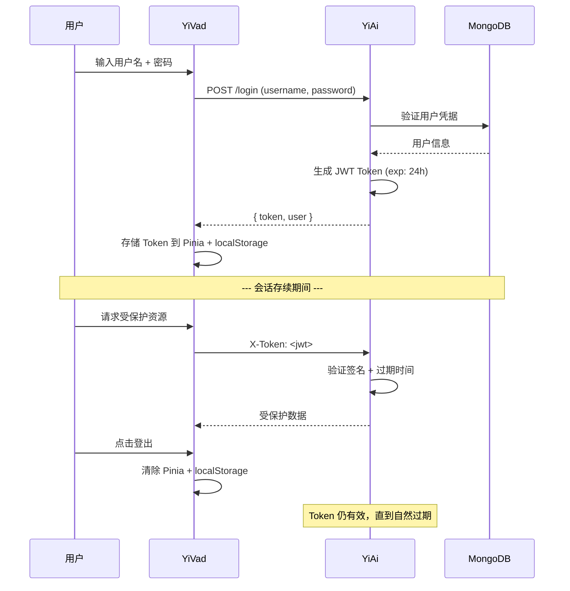
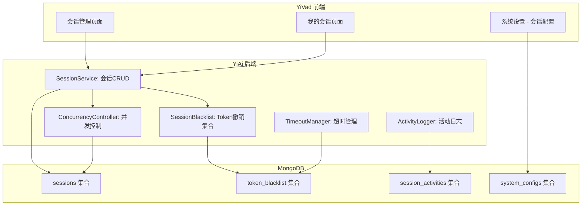
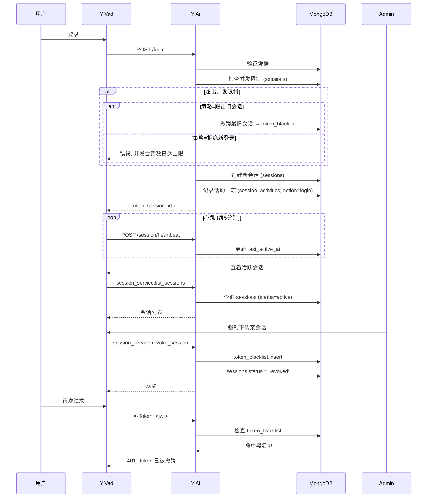

# YV-09-130: 用户会话管理 — 活跃会话查看、强制下线、会话超时配置、并发会话限制

> 需求编号：YV-09-130 · 优先级：P2 · 人天：0.3d · 状态：需求已编写
> 依赖：YV-09-60（API 令牌管理）、YV-09-02（基于角色的权限控制）

## 背景

### 问题陈述

YiVad 作为管理后台，用户登录后产生服务端会话，但当前缺少会话生命周期管理能力。管理员无法查看当前有哪些用户在线、无法强制下线异常会话、无法配置会话超时策略、无法限制同一账号的并发会话数。这导致以下问题：

1. **安全盲区**：员工离职或设备丢失后，其活跃会话可能持续有效，存在数据泄露风险
2. **资源浪费**：长时间闲置的会话占用服务端内存和连接资源
3. **无法审计**：管理员不知道当前有多少活跃用户、哪些设备在访问系统
4. **并发失控**：同一账号可从多台设备同时登录，无法限制并发数
5. **超时不可配**：会话超时时间是硬编码的，无法根据安全策略调整

**核心矛盾**：YiVad 已有认证系统（登录/Token），但缺少会话级别的管理能力。管理员需要可视化地管理所有活跃会话，包括查看、终止、配置超时和限制并发。

### 影响范围

| # | 影响 | 严重程度 | 典型场景 |
|---|------|----------|----------|
| 1 | 无法强制下线异常会话 | 高 | 员工离职后旧会话仍有效 |
| 2 | 无并发会话限制 | 高 | 同一账号被多人共享使用 |
| 3 | 会话超时不可配置 | 中 | 不同安全等级场景需要不同超时策略 |
| 4 | 无会话活动日志 | 中 | 无法追溯会话的创建/销毁/操作记录 |
| 5 | 管理员无法查看在线用户 | 低 | 无法了解系统当前使用情况 |

### 挑战

| 挑战 | 说明 |
|------|------|
| 服务端会话追踪 | YiAi 需要追踪每个 Token 对应的会话状态（IP、设备、最后活跃时间） |
| 强制下线实现 | 需要在服务端维护会话黑名单，强制下线后立即失效 Token |
| 并发检测 | 同一用户多设备登录时需识别并执行并发策略（拒绝/替换/允许） |
| 实时性 | 会话状态变更需要在前端近实时反映 |
| 权限粒度 | 仅管理员可管理所有会话，普通用户仅可管理自己的会话 |

---

## 一、现状分析

### 1.1 当前会话管理现状

```
YiVad 会话管理现状:
├── 登录
│   ├── 用户名 + 密码 → JWT Token
│   └── Token 存储在 Pinia + localStorage
├── Token 验证
│   ├── 每次请求携带 X-Token 头部
│   └── YiAi 验证 Token 签名 + 过期时间
├── 登出
│   ├── 清除前端 Pinia store + localStorage
│   └── Token 在服务端仍有效（直到过期）
└── 会话管理
    ├── 无会话列表页面                # ❌ 不存在
    ├── 无强制下线功能                # ❌ 不存在
    ├── 无会话超时配置                # ❌ 不存在
    ├── 无并发会话限制                # ❌ 不存在
    ├── 无会话活动日志                # ❌ 不存在
    └── 无最后活跃时间追踪            # ❌ 不存在
```

### 1.2 当前会话生命周期



**问题：** Token 签发后完全依赖过期时间，服务端无法主动撤销。登出仅是前端清理，Token 在有效期内仍可被使用。

### 1.3 根因矩阵

| 症状 | 根因 | 触发条件 | 频率 |
|------|------|----------|------|
| 无法强制下线 | Token 无状态，服务端不追踪会话 | 管理员需撤销用户访问权限时 | 中 |
| 无并发控制 | 未记录用户活跃会话数 | 同一账号多设备登录时 | 高 |
| 超时不可配 | 超时时间硬编码在 JWT exp 中 | 不同安全场景需要不同超时 | 低 |
| 无会话可见性 | 未存储会话元数据 | 管理员想了解在线用户时 | 中 |
| 登出不彻底 | 登出仅清理前端状态 | 用户在前端登出后期望 Token 立即失效 | 高 |

---

## 二、设计决策

### 决策 1：会话存储方式 — JWT 黑名单 vs 服务端会话表 vs Redis 会话

| 选项 | 实现复杂度 | 性能 | 持久化 | 水平扩展 |
|------|-----------|------|--------|----------|
| JWT 黑名单（MongoDB） | 低 | 中（每次验证查库） | 是 | 需共享 MongoDB |
| 服务端会话表（MongoDB） | 中 | 中 | 是 | 需共享 MongoDB |
| Redis 集中式会话 | 中 | 高 | 需配置持久化 | 天然支持 |

**选择：JWT 黑名单 + 服务端会话表（MongoDB）。** 保持 JWT 无状态优势，仅在被强制下线时记录到黑名单（撤销集合）。同时维护 `sessions` 集合存储会话元数据（IP、设备、活跃时间），用于管理面板展示。MongoDB 方案符合现有技术栈，无需引入 Redis。

### 决策 2：并发会话策略 — 拒绝新登录 vs 踢出旧会话 vs 允许并发

| 选项 | 用户体验 | 安全性 | 实现复杂度 |
|------|----------|--------|-----------|
| 拒绝新登录 | 差（无法在新设备登录） | 高 | 低 |
| 踢出旧会话（自动下线旧设备） | 中（旧设备被强制下线） | 高 | 中 |
| 允许并发（默认） | 好 | 低 | 低 |

**选择：管理员可配置策略，默认允许并发。** 在系统设置中提供三种策略选择：允许并发（默认）、踢出旧会话（新登录自动下线旧设备）、拒绝新登录（达到上限后禁止新登录）。并发上限可配置（默认 3）。

### 决策 3：会话超时配置粒度 — 全局 vs 按角色 vs 按用户

| 选项 | 灵活性 | 管理复杂度 | 适用场景 |
|------|--------|-----------|----------|
| 全局统一超时 | 低 | 低 | 小型团队 |
| 按角色配置超时 | 中 | 中 | 不同权限级别需要不同超时 |
| 按用户单独配置 | 高 | 高 | 特殊用户需要定制超时 |

**选择：全局默认 + 按角色覆盖。** 系统设置中配置全局默认超时（如 24h），各角色可覆盖（如管理员 4h、普通用户 24h、只读用户 8h）。按用户配置过于复杂，首期不实现。

### 决策 4：会话活动日志存储 — 独立集合 vs sessions 内嵌数组 vs 文件日志

| 选项 | 查询效率 | 存储成本 | 分析能力 |
|------|----------|----------|----------|
| 独立 `session_activities` 集合 | 高（可建索引） | 中 | 高（聚合查询） |
| sessions 内嵌数组 | 中（单文档查询） | 低（受文档大小限制） | 低 |
| 文件日志 | 低（需 grep） | 低 | 低 |

**选择：独立 `session_activities` 集合。** 活动日志量大（每次心跳或操作），内嵌数组会快速膨胀。独立集合支持 TTL 索引自动清理、聚合分析活跃时段。

### 设计决策记录

| 决策 | 选项 A | 选项 B | 选项 C | 选择 | 理由 |
|------|--------|--------|--------|------|------|
| 存储方式 | JWT 黑名单 | 服务端会话表 | Redis 会话 | **JWT 黑名单 + 会话表** | 保持 JWT 优势，MongoDB 无需新依赖 |
| 并发策略 | 拒绝新登录 | 踢出旧会话 | 允许并发 | **管理员可配置** | 灵活适配不同安全需求 |
| 超时粒度 | 全局 | 按角色 | 按用户 | **全局 + 按角色** | 平衡灵活性和复杂度 |
| 活动日志 | 独立集合 | 内嵌数组 | 文件日志 | **独立集合** | 查询效率高，TTL 自动清理 |

---

## 三、目标架构

### 3.1 会话管理架构



### 3.2 会话生命周期（目标）



### 3.3 数据模型

```
sessions 集合:
{
  _id: ObjectId,
  session_id: "sess_abc123",
  user_id: "user_001",
  username: "陈铭",
  token_jti: "jti_xyz",          // JWT unique ID
  ip_address: "192.168.1.100",
  location: "杭州, 浙江",
  device: "Chrome 120 / macOS",
  user_agent: "Mozilla/5.0...",
  login_at: ISODate("2026-09-09T08:00:00Z"),
  last_active_at: ISODate("2026-09-09T10:30:00Z"),
  expires_at: ISODate("2026-09-10T08:00:00Z"),
  status: "active",               // active | idle | revoked | expired
  login_method: "password",       // password | oauth | sso
  metadata: {}
}

token_blacklist 集合:
{
  _id: ObjectId,
  token_jti: "jti_xyz",
  revoked_by: "admin_001",
  revoked_at: ISODate("2026-09-09T11:00:00Z"),
  reason: "用户离职",
  expires_at: ISODate("2026-09-10T08:00:00Z")  // TTL 索引，过期自动删除
}

session_activities 集合:
{
  _id: ObjectId,
  session_id: "sess_abc123",
  user_id: "user_001",
  action: "login",                // login | logout | heartbeat | revoke | timeout | page_view
  ip_address: "192.168.1.100",
  timestamp: ISODate("2026-09-09T08:00:00Z"),
  details: { page: "/dashboard" }
}
```

---

## 四、具体改动

### 4.1 YiAi 后端 — SessionService

```python
# services/auth/session_service.py (新增)

class SessionService:
    """用户会话管理服务"""

    async def create_session(self, user: dict, request: Request) -> dict:
        """登录时创建会话，检查并发限制"""
        # 1. 检查并发限制
        active_count = await self.sessions.count_documents({
            "user_id": user["_id"], "status": "active"
        })
        config = await self.get_concurrency_config()
        if active_count >= config["max_concurrent"]:
            if config["strategy"] == "reject":
                raise BusinessError(4003, "并发会话数已达上限")
            elif config["strategy"] == "kick_oldest":
                await self.revoke_oldest_session(user["_id"])

        # 2. 创建会话
        session = {
            "session_id": f"sess_{uuid4().hex[:12]}",
            "user_id": user["_id"],
            "username": user["username"],
            "token_jti": jti,
            "ip_address": request.client.host,
            "device": parse_device(request.headers.get("User-Agent", "")),
            "login_at": datetime.utcnow(),
            "last_active_at": datetime.utcnow(),
            "expires_at": datetime.utcnow() + timedelta(hours=timeout_hours),
            "status": "active",
        }
        await self.sessions.insert_one(session)
        await self.log_activity(session["session_id"], user["_id"], "login")
        return session

    async def list_sessions(self, filter: dict = None) -> list:
        """列出活跃会话（管理员看全部，普通用户看自己）"""
        query = filter or {}
        query["status"] = {"$in": ["active", "idle"]}
        cursor = self.sessions.find(query).sort("last_active_at", -1)
        return await cursor.to_list(length=100)

    async def revoke_session(self, session_id: str, revoked_by: str, reason: str):
        """强制下线指定会话"""
        session = await self.sessions.find_one({"session_id": session_id})
        if not session:
            raise BusinessError(1002, "会话不存在")

        # 加入黑名单
        await self.token_blacklist.insert_one({
            "token_jti": session["token_jti"],
            "revoked_by": revoked_by,
            "revoked_at": datetime.utcnow(),
            "reason": reason,
            "expires_at": session["expires_at"],
        })

        # 更新会话状态
        await self.sessions.update_one(
            {"session_id": session_id},
            {"$set": {"status": "revoked"}}
        )
        await self.log_activity(session_id, session["user_id"], "revoke",
                               details={"revoked_by": revoked_by, "reason": reason})

    async def revoke_all_user_sessions(self, user_id: str, revoked_by: str):
        """强制下线某用户的所有会话"""
        sessions = await self.sessions.find({
            "user_id": user_id, "status": {"$in": ["active", "idle"]}
        }).to_list(length=100)
        for session in sessions:
            await self.revoke_session(session["session_id"], revoked_by, "批量下线")

    async def heartbeat(self, session_id: str):
        """更新会话心跳"""
        await self.sessions.update_one(
            {"session_id": session_id},
            {"$set": {"last_active_at": datetime.utcnow(), "status": "active"}}
        )

    async def cleanup_expired(self):
        """清理过期会话（定时任务）"""
        await self.sessions.update_many(
            {"expires_at": {"$lt": datetime.utcnow()}, "status": {"$ne": "expired"}},
            {"$set": {"status": "expired"}}
        )
```

### 4.2 YiAi 后端 — Token 验证中间件增强

```python
# middleware/auth.py (修改)

async def verify_token_middleware(request: Request, call_next):
    token = request.headers.get("X-Token")
    if token:
        payload = decode_jwt(token)
        jti = payload.get("jti")

        # 新增: 检查黑名单
        blacklisted = await db.token_blacklist.find_one({"token_jti": jti})
        if blacklisted:
            return JSONResponse({"code": 4001, "message": "Token已被撤销，请重新登录"}, status_code=401)

        # 新增: 更新会话最后活跃时间（异步，不影响请求处理）
        asyncio.create_task(update_session_activity(jti))
```

### 4.3 YiVad 前端 — 会话管理页面

```typescript
// src/views/system/session-management.vue (新增)

// <template>
//   <div class="session-management">
//     <PageHeader title="会话管理" desc="管理所有活跃用户会话">
//       <t-button @click="refresh">刷新</t-button>
//     </PageHeader>
//
//     <!-- 统计卡片 -->
//     <t-row :gutter="16">
//       <t-col :span="4">
//         <StatCard title="活跃会话" :value="activeCount" color="green" />
//       </t-col>
//       <t-col :span="4">
//         <StatCard title="闲置会话" :value="idleCount" color="orange" />
//       </t-col>
//       <t-col :span="4">
//         <StatCard title="今日登录" :value="todayLoginCount" color="blue" />
//       </t-col>
//     </t-row>
//
//     <!-- 会话列表 -->
//     <t-table :data="sessions" :columns="columns" row-key="session_id">
//       <template #status="{ row }">
//         <t-tag :theme="statusTheme[row.status]">{{ row.status }}</t-tag>
//       </template>
//       <template #device="{ row }">
//         <DeviceIcon /> {{ row.device }}
//       </template>
//       <template #last_active="{ row }">
//         {{ formatRelativeTime(row.last_active_at) }}
//       </template>
//       <template #actions="{ row }">
//         <t-popconfirm content="确定强制下线该会话？" @confirm="revokeSession(row)">
//           <t-button theme="danger" size="small" :disabled="row.status === 'expired'">
//             强制下线
//           </t-button>
//         </t-popconfirm>
//       </template>
//     </t-table>
//
//     <!-- 批量操作 -->
//     <BatchActionBar v-if="selectedSessions.length">
//       <t-button theme="danger" @click="batchRevoke">
//         批量下线 ({{ selectedSessions.length }})
//       </t-button>
//     </BatchActionBar>
//   </div>
// </template>
```

### 4.4 YiVad 前端 — 会话配置组件

```typescript
// src/views/system/components/session-config.vue (新增)

// <template>
//   <t-form :data="config" label-width="160px">
//     <t-form-item label="会话超时时间">
//       <t-select v-model="config.global_timeout_hours">
//         <t-option :value="1" label="1 小时" />
//         <t-option :value="4" label="4 小时" />
//         <t-option :value="8" label="8 小时" />
//         <t-option :value="24" label="24 小时（默认）" />
//         <t-option :value="72" label="72 小时" />
//         <t-option :value="168" label="7 天" />
//       </t-select>
//     </t-form-item>
//     <t-form-item label="最大并发会话数">
//       <t-input-number v-model="config.max_concurrent" :min="1" :max="10" />
//       <span class="hint">同一账号可同时登录的设备数上限</span>
//     </t-form-item>
//     <t-form-item label="并发策略">
//       <t-radio-group v-model="config.concurrent_strategy">
//         <t-radio value="allow">允许并发（默认）</t-radio>
//         <t-radio value="kick_oldest">踢出最旧会话</t-radio>
//         <t-radio value="reject">拒绝新登录</t-radio>
//       </t-radio-group>
//     </t-form-item>
//     <t-form-item label="闲置超时">
//       <t-input-number v-model="config.idle_timeout_minutes" :min="5" :max="480" />
//       <span class="hint">分钟，超时后标记为闲置（默认 30 分钟）</span>
//     </t-form-item>
//     <t-form-item label="心跳间隔">
//       <t-input-number v-model="config.heartbeat_interval_minutes" :min="1" :max="30" />
//       <span class="hint">分钟，前端定时发送心跳请求（默认 5 分钟）</span>
//     </t-form-item>
//     <t-form-item>
//       <t-button theme="primary" @click="saveConfig">保存配置</t-button>
//     </t-form-item>
//   </t-form>
// </template>
```

### 4.5 文件变更清单

| 文件 | 操作 | 说明 |
|------|------|------|
| `YiAi/services/auth/session_service.py` | 新增 | 会话管理服务（创建/列表/撤销/心跳） |
| `YiAi/middleware/auth.py` | 修改 | Token 验证增加黑名单检查 + 会话活跃更新 |
| `YiAi/tasks/cleanup.py` | 修改 | 新增过期会话清理任务 |
| `YiVad/src/views/system/session-management.vue` | 新增 | 会话管理页面 |
| `YiVad/src/views/system/components/session-config.vue` | 新增 | 会话配置组件 |
| `YiVad/src/views/user/my-sessions.vue` | 新增 | 我的会话（普通用户查看自己的会话） |
| `YiVad/src/composables/useSessionHeartbeat.ts` | 新增 | 心跳 Composable |
| `YiVad/src/stores/session.ts` | 新增 | 会话状态管理 Pinia store |
| `YiVad/src/router/modules/system.ts` | 修改 | 添加会话管理路由 |
| `YiVad/src/router/modules/user.ts` | 修改 | 添加我的会话路由 |
| `YiAi/tests/test_session_service.py` | 新增 | 会话服务测试 |
| `YiVad/tests/unit/session-management.test.ts` | 新增 | 会话管理页面测试 |

---

## 五、实施步骤

| 步骤 | 操作 | 路径 | 验证 | 人天 |
|------|------|------|------|------|
| 1 | 实现 YiAi SessionService（创建/列表/撤销） | `YiAi/services/auth/session_service.py` | 创建会话、列出会话、撤销会话正常 | 0.05 |
| 2 | 实现 Token 黑名单验证中间件 | `YiAi/middleware/auth.py` | 被撤销 Token 请求返回 401 | 0.03 |
| 3 | 实现会话心跳 + 清理任务 | `YiAi/services/auth/session_service.py` | 心跳更新 last_active，过期会话被清理 | 0.03 |
| 4 | 实现 YiVad 会话管理页面 | `YiVad/src/views/system/session-management.vue` | 列表展示、强制下线、批量操作 | 0.08 |
| 5 | 实现会话配置组件 | `YiVad/src/views/system/components/session-config.vue` | 超时、并发策略配置保存生效 | 0.04 |
| 6 | 实现心跳 Composable + 我的会话页面 | `YiVad/src/composables/useSessionHeartbeat.ts` + `my-sessions.vue` | 心跳正常发送，用户可看自己的会话 | 0.04 |
| 7 | 路由注册 + 集成测试 | `YiVad/src/router/` + 测试文件 | 路由可访问，功能端到端验证 | 0.03 |

**总人天：0.3d**

---

## 六、测试规格

### 场景 1：管理员查看所有活跃会话

**GIVEN** 管理员已登录，系统中有 5 个活跃会话
**WHEN** 管理员访问 `/system/sessions` 页面
**THEN** 应显示 5 个会话，包含用户名、IP、设备、登录时间、最后活跃时间
**AND** 会话按最后活跃时间倒序排列
**AND** 顶部统计卡片显示活跃 5、闲置 0

### 场景 2：管理员强制下线指定会话

**GIVEN** 管理员在会话管理页面，用户张三有一个活跃会话
**WHEN** 管理员点击张三会话的"强制下线"按钮并确认
**THEN** 该会话状态变为 revoked
**AND** 张三的下一次请求返回 401 "Token 已被撤销"
**AND** session_activities 中记录一条 action=revoke 的日志

### 场景 3：并发会话限制 — 拒绝新登录

**GIVEN** 系统配置 max_concurrent=2，strategy=reject，用户李四已有 2 个活跃会话
**WHEN** 李四在第三台设备上尝试登录
**THEN** 登录请求返回错误 "并发会话数已达上限"
**AND** 不可创建第三个会话

### 场景 4：并发会话限制 — 踢出最旧会话

**GIVEN** 系统配置 max_concurrent=2，strategy=kick_oldest，用户王五已有 2 个活跃会话
**WHEN** 王五在第三台设备上登录
**THEN** 最旧的会话被撤销（Token 加入黑名单）
**AND** 新会话创建成功，王五在新设备登录成功
**AND** 旧设备的下一次请求返回 401

### 场景 5：会话超时自动过期

**GIVEN** 用户赵六在 08:00 登录，会话超时配置为 4 小时
**WHEN** 系统定时清理任务在 12:01 执行
**THEN** 赵六的会话状态变为 expired
**AND** 赵六的下一次请求返回 401 "Token 已过期"

### 场景 6：普通用户查看自己的会话

**GIVEN** 普通用户孙七已登录，有 2 个活跃会话
**WHEN** 孙七访问 `/user/my-sessions` 页面
**THEN** 仅显示孙七自己的 2 个会话
**AND** 不显示其他用户的会话
**AND** 可以下线自己的会话

---

## 七、风险与缓解

| 风险 | 概率 | 影响 | 缓解措施 |
|------|------|------|----------|
| Token 黑名单查询降低 API 性能 | 高 | 中 | 黑名单集合建 jti 索引；本地内存缓存热点 jti（5 分钟过期） |
| 心跳请求增加服务器负载 | 高 | 低 | 心跳间隔默认 5 分钟；使用轻量 update（仅更新 last_active_at） |
| session_activities 集合无限增长 | 中 | 中 | 创建 TTL 索引，30 天后自动删除 |
| 并发策略"踢出旧会话"误踢用户 | 低 | 中 | 踢出前在旧设备上显示通知（通过 WebSocket 或轮询），给 30 秒缓冲 |
| 强制下线后 Token 仍可在其他服务使用 | 低 | 低 | Token 黑名单仅为 YiAi 内部机制，使用相同 JWT 的其他服务需同步或使用独立 Token |

---

## 八、回滚策略

| 场景 | 回滚操作 | 影响 |
|------|----------|------|
| 会话管理页面性能问题 | 关闭会话管理页面路由，移除心跳 Composable | 失去会话管理功能，Token 验证恢复为无黑名单模式 |
| 黑名单查询导致 API 大面积超时 | 禁用黑名单查询中间件，恢复纯 JWT 验证 | 强制下线功能失效 |
| 心跳请求导致数据库压力过大 | 调大心跳间隔至 15 分钟或禁用心跳 | 闲置检测精度下降 |
| session_activities 写入性能问题 | 降级为采样写入（仅记录 10% 操作）或禁用活动日志 | 失去会话活动审计能力 |

---

## 九、设计决策记录

### D-01：为什么选择 JWT 黑名单而非完全服务端会话？

完全服务端会话（如 Redis Session）需要每次请求都查询会话状态，失去 JWT 无状态的优势。JWT 黑名单仅在 Token 被撤销时需要查库（绝大多数请求不命中），保持 99%+ 请求的零数据库查询特性。

### D-02：为什么心跳间隔设为 5 分钟？

5 分钟是在"活跃检测精度"和"服务器负载"之间的平衡。1 分钟太频繁（每用户每小时 60 次请求），15 分钟太稀疏（闲置检测延迟大）。5 分钟（每小时 12 次）是可接受的负载。

### D-03：为什么需要独立的 session_activities 集合？

会话活动日志与会话本身生命周期不同。会话可能存活 24 小时，但活动日志需要保留更长时间用于审计和趋势分析。独立集合方便设置不同的 TTL 策略和索引。

### D-04：为什么并发策略默认"允许"而非"拒绝"？

用户体验优先。大多数场景下用户需要在办公室电脑、笔记本和手机上同时登录。拒绝策略过于严格，应由管理员根据安全策略主动配置。

---

## 十、可观测性

### 指标

| 指标 | 类型 | 说明 |
|------|------|------|
| `yivad.session.active_count` | Gauge | 活跃会话数 |
| `yivad.session.idle_count` | Gauge | 闲置会话数 |
| `yivad.session.revoke_count` | Counter | 强制下线次数 |
| `yivad.session.concurrent_reject_count` | Counter | 因并发限制拒绝的登录次数 |
| `yivad.session.heartbeat_latency` | Histogram | 心跳请求延迟 |
| `yivad.token_blacklist.size` | Gauge | 黑名单大小 |

### 告警

| 告警 | 条件 | 级别 |
|------|------|------|
| 活跃会话数异常增长 | 环比增长 > 200% | WARNING |
| 强制下线频率异常 | 5 分钟内 > 50 次下线 | WARNING |
| 并发拒绝频率过高 | 5 分钟内 > 20 次拒绝 | INFO |
| 心跳失败率过高 | 失败/总心跳 > 10% | WARNING |

---

## 十一、代码审查检查清单

- [ ] SessionService 支持创建、列表、撤销、心跳、批量下线
- [ ] Token 验证中间件检查黑名单，命中返回 401
- [ ] 并发检查在登录时执行，按配置策略处理
- [ ] 会话超时基于 expires_at + 定时清理任务
- [ ] 强制下线记录操作人、时间、原因
- [ ] 管理员可查看所有会话，普通用户仅可查看自己的
- [ ] 心跳请求轻量（仅 update last_active_at）
- [ ] session_activities 有 TTL 索引，自动清理旧记录
- [ ] token_blacklist 有 TTL 索引，过期后自动删除
- [ ] 前端心跳在页面隐藏时暂停（使用 Page Visibility API）
- [ ] 前端会话管理页面支持搜索、排序、分页
- [ ] 单元测试覆盖创建、撤销、并发策略、心跳

---

## 回归问题预测

| # | 预测问题 | 原因 | 验证方法 |
|---|---------|------|---------|
| 1 | 强制下线用户后，用户的前端页面仍能正常操作（Pinia store 中的 token 未清除），直到下次刷新页面才跳转登录页 | YiVad 的 RequestHttp 拦截器仅在收到 401 时清除 store，但页面上的非 API 操作（如路由切换）不触发 HTTP 请求，用户以为仍在线 | 管理员强制下线某会话 → 该会话的前端页面执行路由跳转 → 验证跳转前是否弹窗提示"会话已失效" |
| 2 | 心跳请求在浏览器 Tab 后台时仍持续发送，移动端用户切换到其他 App 后心跳耗尽电池 | Page Visibility API 仅在 Tab 完全不可见时触发，部分浏览器的"省电模式"下 Tab 仍被认为可见 | 在 Chrome DevTools Performance 面板中切换到后台 Tab，验证 5 分钟后心跳请求是否停止 |
| 3 | 管理员批量下线后，session_activities 中缺少批量操作日志，审计时无法确定是批量还是单条操作 | 批量下线方法内部循环调用 revoke_session，每次调用记录一条 revoke 日志，但无"批量操作"标记 | 批量下线 5 个会话 → 查询 session_activities → 验证有一条 action=batch_revoke 的汇总日志 |
| 4 | token_blacklist 缺乏 TTL 索引导致集合无限增长，MongoDB 磁盘使用率持续上升 | 开发者在创建集合时遗漏 `expires_at` 字段的 TTL 索引定义 | 插入一条 1 秒后过期的黑名单记录 → 等待 2 秒 → 验证记录已被自动删除 |
| 5 | 用户在新设备登录后，旧设备的并发策略为 kick_oldest，旧设备无任何感知就被强制下线，用户可能丢失未保存的工作 | 前端仅在 API 请求返回 401 时才知道被下线，如果用户正在填写表单但未发起 API 请求，被踢出后表单数据丢失 | 在旧设备上填写表单 → 新设备登录触发 kick_oldest → 验证旧设备在 30 秒内弹出"您的会话已被新设备取代"提示 |
| 6 | 会话管理页面的 last_active_at 与实际活跃时间存在 5 分钟延迟，管理员看到"5 分钟前活跃"的用户实际已经离开 | 心跳间隔为 5 分钟，用户关闭浏览器后心跳停止，但 last_active_at 的差值在心跳窗口内 | 用户 10:00 关闭浏览器 → 管理员 10:03 查看会话管理 → 验证显示"3 分钟前活跃"而非"6 分钟前"（应为闲置标记） |

---

## 性能分析

### 关键操作耗时

| 操作 | 耗时 | 说明 |
|------|------|------|
| 登录（含会话创建） | < 50ms | JWT 生成 10ms + 会话写入 15ms + 黑名单检查 5ms |
| Token 验证（含黑名单检查） | < 20ms | JWT 解码 5ms + jti 索引查询 5ms |
| 心跳更新 | < 10ms | 单字段 update，jti 索引 |
| 强制下线（单会话） | < 30ms | 黑名单写入 + 会话状态更新 + 活动日志 |
| 会话列表查询（100 条） | < 50ms | sessions 集合 user_id + status 复合索引 |
| 批量下线（10 会话） | < 100ms | 10 次黑名单写入 + 1 次批量状态更新 |

### 数据量预估（100 用户规模）

| 集合 | 日均增量 | 保留策略 | 稳态大小 |
|------|----------|----------|----------|
| sessions | ~150 条（含创建/过期） | 状态 expired 后 7 天清理 | ~500 条 |
| token_blacklist | ~10 条（主要是强制下线） | TTL = expires_at | ~100 条 |
| session_activities | ~5,000 条（心跳 + 操作） | TTL 30 天 | ~150,000 条，~50MB |

---

## 相关文档

- [API 令牌管理](../60-需求-API令牌管理.md) — Token 生命周期管理
- [基于角色的权限控制](../../2026-08/02-需求-基于角色的权限控制.md) — 权限粒度
- [安全事件日志](../133-需求-安全事件日志.md) — 会话相关安全事件记录
- [登录历史记录](../131-需求-登录历史记录.md) — 登录记录与设备追踪

*PRD 来源: `projects/yivad/requirements/2026-09/130-需求-用户会话管理.md`*

