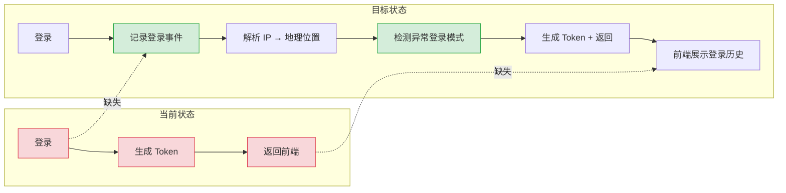
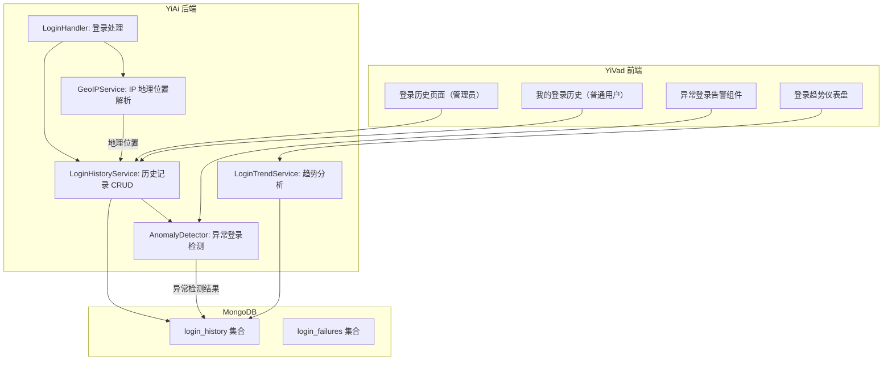
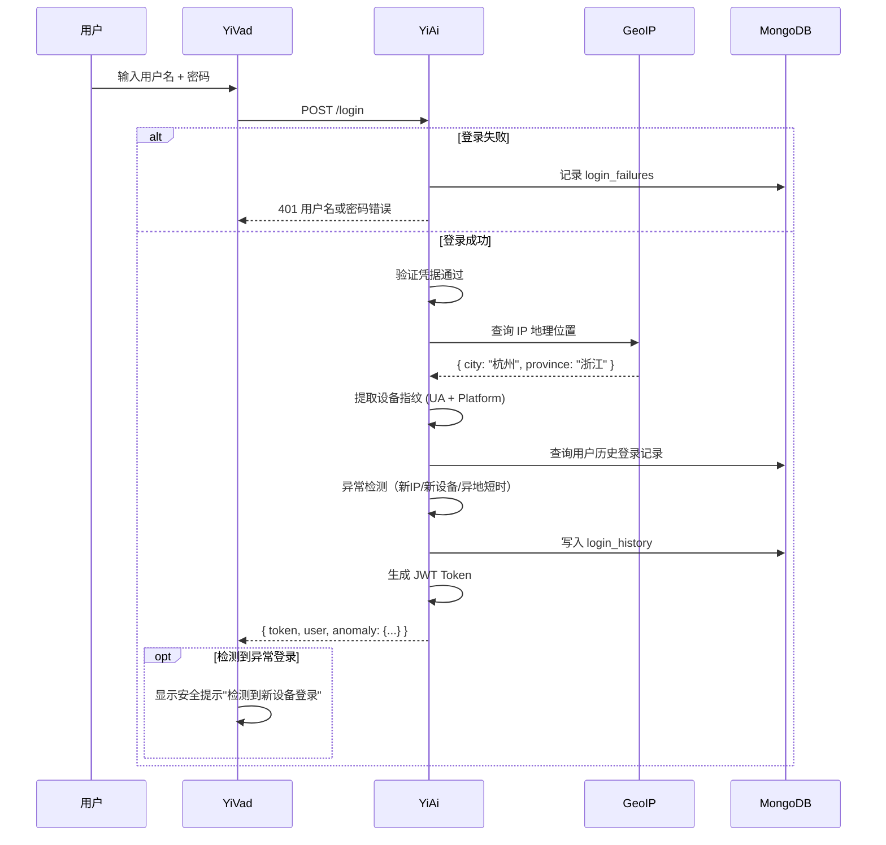

# YV-09-131: 登录历史记录 — 用户登录日志、IP/位置/设备/浏览器记录、异地登录检测、登录趋势分析、导出

> 需求编号：YV-09-131 · 优先级：P2 · 人天：0.3d · 状态：需求已编写
> 依赖：YV-09-130（用户会话管理）、YV-09-60（API 令牌管理）

## 背景

### 问题陈述

YiVad 当前没有登录历史记录功能。管理员和用户都无法追溯登录历史——不知道账号何时从何处登录、是否被他人盗用。这导致以下安全盲区：

1. **无法检测账号盗用**：如果账号被他人从异地/新设备登录，用户和管理员都无法感知
2. **安全审计缺失**：无法回答"某次数据泄露是否与某次异常登录有关"的追溯问题
3. **登录趋势不可见**：管理员无法了解系统使用高峰时段、用户活跃度变化趋势
4. **无登录统计**：无法统计日活登录用户数、登录失败率等基础安全指标
5. **证据链不完整**：发生安全事件后，缺少登录维度的取证数据

**核心矛盾**：有登录功能但没有登录审计。登录只是产生了一个 Token，登录行为本身没有被记录和追溯。

### 影响范围

| # | 影响 | 严重程度 | 典型场景 |
|---|------|----------|----------|
| 1 | 无法检测异常登录 | 高 | 账号在异地被登录，用户无感知 |
| 2 | 安全审计缺失 | 高 | 等保合规要求保留登录日志 |
| 3 | 无登录趋势分析 | 中 | 管理员无法了解系统使用模式 |
| 4 | 无登录失败统计 | 中 | 无法发现暴力破解尝试 |
| 5 | 用户无法自查登录记录 | 低 | 用户怀疑账号异常但无法确认 |

### 挑战

| 挑战 | 说明 |
|------|------|
| IP 地理位置解析 | 需要将 IP 地址转换为可读的地理位置（城市/省份） |
| 设备指纹识别 | 同一设备的不同 User-Agent 需识别为同一设备 |
| 异地检测精度 | 短时间内从不同城市登录的判断阈值设定 |
| 数据量增长 | 每次登录一条记录，长期积累数据量大 |
| 隐私合规 | 记录 IP 和位置信息需符合隐私政策要求 |

---

## 一、现状分析

### 1.1 当前登录流程

```
YiVad 登录流程（当前）:
├── 用户输入用户名 + 密码
├── POST /login → YiAi
├── YiAi 验证凭据 → 生成 JWT Token
├── 返回 { token, user }
├── YiVad 存储 Token 到 Pinia + localStorage
└── 无日志记录              # ❌ 登录行为未被记录

缺失:
├── 登录记录（IP/设备/时间）     # ❌ 不存在
├── 登录失败记录                # ❌ 不存在
├── 异地登录检测                # ❌ 不存在
├── 登录趋势图表                # ❌ 不存在
└── 登录历史导出                # ❌ 不存在
```

### 1.2 登录记录需求对比



### 1.3 根因矩阵

| 症状 | 根因 | 触发条件 | 频率 |
|------|------|----------|------|
| 无法检测账号盗用 | 未记录登录 IP/位置/设备 | 账号被异地登录时 | 低 |
| 安全审计缺失 | 登录行为未持久化 | 每次安全事件追溯时 | 中 |
| 登录趋势不可见 | 无登录数据聚合 | 管理员查看使用报告时 | 低 |
| 无登录失败统计 | 登录失败未记录 | 暴力破解发生时 | 低 |
| 证据链不完整 | 登录维度的数据缺失 | 等保合规检查时 | 低 |

---

## 二、设计决策

### 决策 1：登录日志存储 — 独立集合 vs sessions 内嵌 vs 审计日志复用

| 选项 | 查询效率 | 存储成本 | 与审计日志的关系 |
|------|----------|----------|-----------------|
| 独立 `login_history` 集合 | 高 | 中 | 与审计日志分开，专项查询快 |
| sessions 集合内嵌 | 中 | 低 | 登录与会话耦合，会话过期后丢失 |
| 复用 `audit_logs` 集合 | 中 | 低 | 与通用审计日志混合，查询需过滤 |

**选择：独立 `login_history` 集合。** 登录历史有独立的查询模式（按用户查询、按时间范围、按 IP）、独立的保留策略和独立的前端页面。与通用审计日志分开更清晰。

### 决策 2：IP 地理位置解析 — 在线 API vs 本地数据库 vs 不解析

| 选项 | 精度 | 延迟 | 外部依赖 | 离线可用 |
|------|------|------|----------|----------|
| 在线 API（如 ipapi.co） | 高（城市级） | 100-500ms | 是（网络 + 服务） | 否 |
| 本地 GeoIP 数据库（GeoLite2） | 高（城市级） | < 5ms | 否（定期更新） | 是 |
| 不解析（仅存 IP） | — | 0 | 否 | 是 |

**选择：本地 GeoIP 数据库 + 在线 API 回退。** 使用 GeoLite2 离线数据库（50MB），精度为城市级，延迟 < 5ms。定期更新（每月一次）。如果离线数据库未覆盖，回退到在线 API。

### 决策 3：异常登录检测策略 — 规则引擎 vs ML 模型 vs 简单规则

| 选项 | 检测精度 | 实现复杂度 | 误报率 |
|------|----------|-----------|--------|
| 规则引擎（多条件组合） | 中 | 中 | 中 |
| ML 模型（异常检测） | 高 | 高 | 低 |
| 简单规则（仅异地/新设备） | 低 | 低 | 高 |

**选择：简单规则（首期）+ 规则引擎预留。** 首期实现核心规则：新 IP 登录、新设备登录、异地短时登录（2 小时内不同城市）。规则可配置开关和阈值。后续迭代可升级为规则引擎。

### 决策 4：登录趋势聚合 — 实时聚合 vs 定时预计算 vs 全量查询

| 选项 | 查询速度 | 数据新鲜度 | 实现复杂度 |
|------|----------|-----------|-----------|
| 实时聚合（聚合查询） | 中 | 实时 | 低 |
| 定时预计算（物化视图） | 高 | 延迟 1 小时 | 中 |
| 全量查询（limit + offset） | 低 | 实时 | 低 |

**选择：实时聚合。** 登录数据量不大（100 用户 × 每天 3 次 × 365 天 ≈ 10 万条/年），MongoDB 聚合查询在 100ms 内可完成。无需物化视图的额外复杂度。

### 设计决策记录

| 决策 | 选项 A | 选项 B | 选项 C | 选择 | 理由 |
|------|--------|--------|--------|------|------|
| 存储方式 | 独立集合 | sessions | audit_logs | **独立集合** | 独立查询模式 |
| IP 解析 | 在线 API | 本地 GeoIP | 不解析 | **本地 GeoIP + 在线回退** | 低延迟 + 高可用 |
| 异常检测 | 规则引擎 | ML 模型 | 简单规则 | **简单规则** | 快速上线 |
| 趋势聚合 | 实时聚合 | 预计算 | 全量查询 | **实时聚合** | 数据量小 |

---

## 三、目标架构

### 3.1 登录历史系统架构



### 3.2 登录记录流程（目标）



### 3.3 数据模型

```
login_history 集合:
{
  _id: ObjectId,
  user_id: "user_001",
  username: "陈铭",
  login_at: ISODate("2026-09-09T08:00:00Z"),
  ip_address: "192.168.1.100",
  location: {
    country: "中国",
    province: "浙江",
    city: "杭州",
    isp: "中国电信"
  },
  device: {
    browser: "Chrome",
    browser_version: "120.0",
    os: "macOS",
    os_version: "14.0",
    device_type: "desktop"          // desktop | mobile | tablet
  },
  user_agent: "Mozilla/5.0...",
  login_method: "password",          // password | oauth | sso
  login_result: "success",           // success | failure
  is_anomaly: false,
  anomaly_reasons: [],               // ["new_ip", "new_device", "rapid_location_change"]
  session_id: "sess_abc123",
  metadata: {}
}

login_failures 集合:
{
  _id: ObjectId,
  username: "陈铭",                  // 可能是不存在的用户名
  ip_address: "10.0.0.1",
  attempted_at: ISODate("2026-09-09T08:00:01Z"),
  failure_reason: "invalid_password", // invalid_password | user_not_found | account_locked
  user_agent: "Mozilla/5.0..."
}

索引:
- login_history: { user_id: 1, login_at: -1 }  -- 按用户查询登录历史
- login_history: { ip_address: 1, login_at: -1 }  -- 按 IP 追溯
- login_history: { login_at: -1 }  -- 时间范围查询
- login_failures: { ip_address: 1, attempted_at: -1 }  -- 暴力破解检测
- login_failures: { attempted_at: -1 }  -- 失败趋势
- login_failures: TTL索引: { attempted_at: 1 }, expireAfterSeconds: 7776000  -- 90天清理
```

---

## 四、具体改动

### 4.1 YiAi 后端 — LoginHistoryService

```python
# services/auth/login_history_service.py (新增)

class LoginHistoryService:
    """登录历史记录服务"""

    def __init__(self):
        self.collection = db.login_history
        self.failures = db.login_failures
        self.geoip = GeoIPService()
        self.anomaly = LoginAnomalyDetector()

    async def record_login(self, user: dict, request: Request,
                          login_method: str = "password") -> dict:
        """记录成功登录"""
        ip = request.client.host
        ua = request.headers.get("User-Agent", "")
        location = await self.geoip.lookup(ip)
        device = self.parse_device(ua)

        # 异常检测
        anomalies = await self.anomaly.detect(user["_id"], ip, device)

        record = {
            "user_id": user["_id"],
            "username": user["username"],
            "login_at": datetime.utcnow(),
            "ip_address": ip,
            "location": location,
            "device": device,
            "user_agent": ua,
            "login_method": login_method,
            "login_result": "success",
            "is_anomaly": len(anomalies) > 0,
            "anomaly_reasons": anomalies,
        }
        await self.collection.insert_one(record)
        return record

    async def record_failure(self, username: str, request: Request,
                            reason: str):
        """记录登录失败"""
        await self.failures.insert_one({
            "username": username,
            "ip_address": request.client.host,
            "attempted_at": datetime.utcnow(),
            "failure_reason": reason,
            "user_agent": request.headers.get("User-Agent", ""),
        })

    async def get_user_history(self, user_id: str, limit: int = 50) -> list:
        """获取用户的登录历史"""
        cursor = self.collection.find({"user_id": user_id}) \
            .sort("login_at", -1).limit(limit)
        return await cursor.to_list(length=limit)

    async def get_trend_data(self, days: int = 30) -> dict:
        """获取登录趋势数据"""
        pipeline = [
            {"$match": {"login_at": {"$gte": datetime.utcnow() - timedelta(days=days)}}},
            {"$group": {
                "_id": {"$dateToString": {"format": "%Y-%m-%d", "date": "$login_at"}},
                "count": {"$sum": 1},
                "unique_users": {"$addToSet": "$user_id"},
                "failures": {"$sum": {"$cond": [{"$eq": ["$login_result", "failure"]}, 1, 0]}},
            }},
            {"$sort": {"_id": 1}},
        ]
        result = await self.collection.aggregate(pipeline).to_list(length=days)
        return result

    async def get_failure_rate(self, days: int = 7) -> float:
        """获取登录失败率"""
        total = await self.collection.count_documents({
            "login_at": {"$gte": datetime.utcnow() - timedelta(days=days)}
        })
        failed = await self.collection.count_documents({
            "login_at": {"$gte": datetime.utcnow() - timedelta(days=days)},
            "login_result": "failure"
        })
        return failed / max(total, 1)

    def parse_device(self, ua: str) -> dict:
        """解析 User-Agent 提取设备信息"""
        import re
        browser = "Unknown"
        os = "Unknown"
        # Chrome
        if "Chrome" in ua and "Edg" not in ua:
            browser = "Chrome"
            m = re.search(r'Chrome/(\d+)', ua)
            if m: browser += f" {m.group(1)}"
        # ... 其他浏览器解析
        return {"browser": browser, "os": os, "device_type": "desktop"}
```

### 4.2 异常检测器

```python
# services/auth/login_anomaly_detector.py (新增)

class LoginAnomalyDetector:
    """登录异常检测器"""

    async def detect(self, user_id: str, current_ip: str,
                    current_device: dict) -> list[str]:
        anomalies = []

        # 1. 新 IP 检测
        recent_ips = await self.get_recent_ips(user_id, days=30)
        if current_ip not in recent_ips:
            anomalies.append("new_ip")

        # 2. 新设备检测
        recent_devices = await self.get_recent_devices(user_id, days=30)
        device_key = f"{current_device.get('browser')}_{current_device.get('os')}"
        if device_key not in recent_devices:
            anomalies.append("new_device")

        # 3. 异地短时登录检测
        last_login = await self.get_last_login(user_id)
        if last_login and last_login.get("location"):
            last_city = last_login["location"].get("city")
            # 查询当前 IP 位置
            # 2 小时内不同城市 → 异常
            time_diff = (datetime.utcnow() - last_login["login_at"]).total_seconds()
            if time_diff < 7200:  # 2 小时内
                current_city = (await GeoIPService().lookup(current_ip)).get("city")
                if current_city and last_city and current_city != last_city:
                    anomalies.append("rapid_location_change")

        return anomalies

    async def get_recent_ips(self, user_id: str, days: int) -> set:
        records = await db.login_history.find({
            "user_id": user_id,
            "login_at": {"$gte": datetime.utcnow() - timedelta(days=days)}
        }).to_list(length=100)
        return {r["ip_address"] for r in records}
```

### 4.3 YiVad 前端 — 登录历史页面

```typescript
// src/views/user/login-history.vue (新增)

// <template>
//   <div class="login-history">
//     <PageHeader title="登录历史" desc="查看您账号的所有登录记录">
//       <t-button @click="exportHistory">导出记录</t-button>
//     </PageHeader>
//
//     <!-- 异常登录告警 -->
//     <t-alert v-if="recentAnomalies.length" theme="warning" :close="true">
//       检测到 {{ recentAnomalies.length }} 次异常登录活动，请确认是否为本人操作
//     </t-alert>
//
//     <!-- 登录趋势图 -->
//     <t-card title="登录趋势（近 30 天）">
//       <LineChart :data="trendData" x-field="date" y-field="count" />
//     </t-card>
//
//     <!-- 登录记录列表 -->
//     <t-table :data="loginRecords" :columns="columns" row-key="_id">
//       <template #login_at="{ row }">
//         {{ formatDateTime(row.login_at) }}
//       </template>
//       <template #location="{ row }">
//         <LocationIcon />
//         {{ row.location?.city || '未知' }}, {{ row.location?.province || '' }}
//       </template>
//       <template #device="{ row }">
//         <DeviceIcon :type="row.device?.device_type" />
//         {{ row.device?.browser }} / {{ row.device?.os }}
//       </template>
//       <template #anomaly="{ row }">
//         <t-tag v-if="row.is_anomaly" theme="warning">
//           异常登录
//         </t-tag>
//         <t-tag v-else theme="success">正常</t-tag>
//       </template>
//       <template #details="{ row }">
//         <t-button variant="text" @click="showDetail(row)">详情</t-button>
//       </template>
//     </t-table>
//   </div>
// </template>
```

### 4.4 管理端登录统计仪表盘

```typescript
// src/views/system/login-dashboard.vue (新增)

// <template>
//   <div class="login-dashboard">
//     <t-row :gutter="16">
//       <t-col :span="4">
//         <StatCard title="今日登录" :value="todayLogins" />
//       </t-col>
//       <t-col :span="4">
//         <StatCard title="今日活跃用户" :value="todayUsers" />
//       </t-col>
//       <t-col :span="4">
//         <StatCard title="登录失败率" :value="failureRate + '%'" />
//       </t-col>
//       <t-col :span="4">
//         <StatCard title="异常登录" :value="anomalyCount" theme="warning" />
//       </t-col>
//     </t-row>
//
//     <!-- 图表区域 -->
//     <t-row :gutter="16">
//       <t-col :span="6">
//         <t-card title="登录量趋势">
//           <LineChart :data="loginTrend" />
//         </t-card>
//       </t-col>
//       <t-col :span="6">
//         <t-card title="地理位置分布">
//           <MapChart :data="locationData" />
//         </t-card>
//       </t-col>
//     </t-row>
//   </div>
// </template>
```

### 4.5 文件变更清单

| 文件 | 操作 | 说明 |
|------|------|------|
| `YiAi/services/auth/login_history_service.py` | 新增 | 登录历史记录服务 |
| `YiAi/services/auth/login_anomaly_detector.py` | 新增 | 登录异常检测器 |
| `YiAi/services/auth/geoip_service.py` | 新增 | IP 地理位置解析服务 |
| `YiAi/services/auth/login_handler.py` | 修改 | 登录接口增加记录逻辑 |
| `YiVad/src/views/user/login-history.vue` | 新增 | 登录历史页面（普通用户） |
| `YiVad/src/views/system/login-dashboard.vue` | 新增 | 登录统计仪表盘（管理员） |
| `YiVad/src/views/system/components/login-trend-chart.vue` | 新增 | 登录趋势图表组件 |
| `YiVad/src/views/system/components/anomaly-alert.vue` | 新增 | 异常登录告警组件 |
| `YiVad/src/composables/useLoginHistory.ts` | 新增 | 登录历史 Composable |
| `YiVad/src/router/modules/user.ts` | 修改 | 添加登录历史路由 |
| `YiVad/src/router/modules/system.ts` | 修改 | 添加登录仪表盘路由 |
| `YiAi/tests/test_login_history.py` | 新增 | 登录历史测试 |
| `YiVad/tests/unit/login-history.test.ts` | 新增 | 登录历史页面测试 |

---

## 五、实施步骤

| 步骤 | 操作 | 路径 | 验证 | 人天 |
|------|------|------|------|------|
| 1 | 实现 GeoIPService（GeoLite2 集成） | `YiAi/services/auth/geoip_service.py` | IP → 地理位置解析正常 | 0.04 |
| 2 | 实现 LoginHistoryService（记录 + 查询） | `YiAi/services/auth/login_history_service.py` | 登录记录写入/查询 | 0.04 |
| 3 | 实现 LoginAnomalyDetector（异常检测） | `YiAi/services/auth/login_anomaly_detector.py` | 新IP/新设备/异地检测 | 0.04 |
| 4 | 集成到登录接口 | `YiAi/services/auth/login_handler.py` | 登录时触发记录 + 检测 | 0.02 |
| 5 | 实现 YiVad 登录历史页面 | `YiVad/src/views/user/login-history.vue` | 列表 + 筛选 + 导出 | 0.06 |
| 6 | 实现管理端登录仪表盘 | `YiVad/src/views/system/login-dashboard.vue` | 趋势图 + 地图 + 统计 | 0.06 |
| 7 | 路由注册 + 集成测试 | 路由文件 + 测试文件 | 功能端到端验证 | 0.04 |

**总人天：0.3d**

---

## 六、测试规格

### 场景 1：记录成功登录

**GIVEN** 用户输入正确的用户名和密码
**WHEN** 登录请求成功
**THEN** `login_history` 集合中插入一条记录
**AND** 记录包含 user_id、ip_address、location、device、login_at
**AND** login_result 为 "success"

### 场景 2：检测新 IP 登录

**GIVEN** 用户过去 30 天从 IP 1.1.1.1 登录，当前从 IP 2.2.2.2 登录
**WHEN** 用户登录成功
**THEN** login_history 记录中 is_anomaly 为 true
**AND** anomaly_reasons 包含 "new_ip"
**AND** 前端显示"检测到新 IP 地址登录"告警

### 场景 3：检测新设备登录

**GIVEN** 用户过去 30 天仅在 Chrome/macOS 登录，当前使用 Safari/iOS 登录
**WHEN** 用户登录成功
**THEN** login_history 记录中 is_anomaly 为 true
**AND** anomaly_reasons 包含 "new_device"

### 场景 4：检测异地短时登录

**GIVEN** 用户 1 小时前在杭州登录，当前从北京登录
**WHEN** 用户登录成功
**THEN** anomaly_reasons 包含 "rapid_location_change"
**AND** 前端显示"检测到短时间内异地登录"告警

### 场景 5：查看登录趋势

**GIVEN** 管理员访问登录统计仪表盘
**WHEN** 页面加载完成
**THEN** 显示近 30 天登录量趋势折线图
**AND** 显示今日登录数、活跃用户数、失败率统计卡片
**AND** 显示地理位置分布图

### 场景 6：导出登录历史

**GIVEN** 用户在登录历史页面，筛选了本月的记录
**WHEN** 用户点击"导出记录"按钮
**THEN** 下载一个 CSV 文件，包含登录时间、IP、位置、设备、是否异常
**AND** CSV 文件编码为 UTF-8 with BOM（兼容 Excel）

---

## 七、风险与缓解

| 风险 | 概率 | 影响 | 缓解措施 |
|------|------|------|----------|
| GeoLite2 数据库文件过大 | 低 | 低 | 仅用 Country + City 数据库（~50MB），不用完整版 |
| IP 地理位置精度不足 | 中 | 低 | 精度为城市级即可满足需求；标注"仅供参考" |
| login_history 数据量快速增长 | 中 | 中 | 设置 TTL 索引（1 年自动清理）；提供数据归档脚本 |
| 异常检测误报率高 | 中 | 中 | 仅标记为"疑似异常"，不自动拦截登录 |
| GeoIP 在线 API 不可用 | 低 | 低 | 优先使用本地数据库，在线 API 仅作为回退 |

---

## 八、回滚策略

| 场景 | 回滚操作 | 影响 |
|------|----------|------|
| GeoIP 解析延迟影响登录速度 | 禁用 IP 解析，仅记录原始 IP | 失去地理位置可视化 |
| login_history 写入性能问题 | 改为异步写入（不阻塞登录响应） | 记录可能稍有延迟写入 |
| 异常检测误报导致用户恐慌 | 关闭前端异常告警展示 | 异常检测后端仍运行，仅前端不展示 |
| 登录仪表盘查询超时 | 降级为简易统计页面（无图表） | 失去可视化图表 |

---

## 九、设计决策记录

### D-01：为什么登录历史不与审计日志合并？

登录历史的查询模式独立（按用户 + 按时间）、保留策略独立（1 年）、前端展示独立（专门页面）。与审计日志合并会导致查询需要额外的 type 过滤，且审计日志的保留策略可能不同（更短或更长）。

### D-02：为什么选择 GeoLite2 而非在线 API？

GeoLite2 是 MaxMind 免费的 IP 地理位置数据库，精度为城市级。本地查询 < 5ms，无网络依赖，不受 API 频率限制影响。唯一下载成本为每月更新一次，可自动化。

### D-03：异常检测为什么不做自动拦截？

误报率不可避免。VPN、移动网络切换、出差等正常场景都会触发异常规则。自动拦截会导致合法用户被锁定，比未检测到异常登录的危害更大。首期仅做标记和告警。

### D-04：为什么 login_failures 与 login_history 分开？

登录失败可能没有关联的 user_id（输入不存在的用户名），与 login_history 的数据结构不同。分开存储避免 null 字段和查询复杂度。

---

## 十、可观测性

### 指标

| 指标 | 类型 | 说明 |
|------|------|------|
| `yivad.login.success_count` | Counter | 成功登录次数 |
| `yivad.login.failure_count` | Counter | 失败登录次数 |
| `yivad.login.anomaly_count` | Counter | 异常登录检测次数 |
| `yivad.login.unique_users_daily` | Gauge | 每日活跃登录用户数 |
| `yivad.login.failure_rate` | Gauge | 登录失败率 |
| `yivad.login.geoip_latency` | Histogram | GeoIP 解析延迟 |

### 告警

| 告警 | 条件 | 级别 |
|------|------|------|
| 登录失败率飙升 | 5 分钟内失败率 > 30% | WARNING |
| 单 IP 高频失败登录 | 5 分钟内同一 IP 失败 > 10 次 | WARNING |
| 异常登录激增 | 1 小时内异常 > 50 次 | INFO |
| GeoIP 数据库过期 | 距上次更新 > 45 天 | INFO |

---

## 十一、代码审查检查清单

- [ ] 登录成功时记录 login_history（含 IP、位置、设备）
- [ ] 登录失败时记录 login_failures（含用户名、IP、原因）
- [ ] GeoIP 本地数据库优先，在线 API 为回退
- [ ] 异常检测：新 IP、新设备、异地短时登录
- [ ] 异常登录不自动拦截，仅标记
- [ ] 登录历史页面支持按时间范围筛选
- [ ] 登录趋势图表：折线图 + 地理分布图
- [ ] 导出功能：CSV UTF-8 with BOM
- [ ] login_history 索引：user_id + login_at、ip_address + login_at
- [ ] login_failures TTL 索引：90 天自动清理
- [ ] 管理员可查看所有用户的登录历史
- [ ] 普通用户仅可查看自己的登录历史

---

## 回归问题预测

| # | 预测问题 | 原因 | 验证方法 |
|---|---------|------|---------|
| 1 | GeoLite2 数据库首次下载失败（网络问题或文件过大），导致所有登录请求的 GeoIP 解析超时，登录接口 30 秒后才响应 | 同步下载 GeoLite2 数据库阻塞了 LoginHistoryService 初始化，超时时间默认 30 秒 | 断开网络后重启 YiAi，验证登录接口在 2 秒内返回，位置字段显示"未知"而非超时 |
| 2 | 异常检测中"新 IP"的对比基准为空（新用户首次登录），is_anomaly 被标记为 true，新用户首次登录就收到"异常登录"告警 | 新用户的 recent_ips 为空，current_ip not in [] 恒为 true，触发异常标记 | 创建新用户 → 首次登录 → 验证 is_anomaly 为 false，不触发异常告警 |
| 3 | 登录趋势聚合查询在数据量增大后变慢，login_history 集合扫描全表导致仪表盘页面加载超 5 秒 | 聚合查询中 $group 未使用索引，随着数据增长（10 万+）全表扫描耗时递增 | 插入 10 万条模拟登录记录 → 执行趋势聚合查询 → 验证耗时 < 200ms（通过 login_at 索引） |
| 4 | 用户使用 VPN 切换 IP 后登录，异常检测误报"新 IP"+"异地短时登录"，用户每天收到多条告警 | VPN 出口 IP 频繁变化且地理位置可能显示为其他城市，异常检测规则无法区分 VPN 和真实异地 | 用户使用 VPN 后登录 → 观察是否为每次登录都触发异常 → 考虑增加"常用 IP 段"规则（同一 /24 子网视为同一 IP） |
| 5 | CSV 导出在数据量大时（1000+ 条记录）导致前端卡顿，浏览器主线程被 CSV 字符串拼接阻塞 | 前端一次性生成完整 CSV 字符串（1000 行 × 10 列），字符串拼接操作在主线程执行 | 导出 1000 条登录记录 → 使用 Performance 面板测量卡顿时间 → 超过 200ms 则改为 Web Worker 生成 CSV |
| 6 | 管理员查看"登录统计仪表盘"时，按地理位置分布的统计中，部分登录记录的 location 为 null（GeoIP 解析失败），地图组件报错 | GeoIP 数据库不覆盖某些内网 IP（10.x、172.x、192.168.x），解析结果为 null，地图组件期望非 null 数据 | 使用内网 IP 登录 → 查看登录统计的地理分布 → 验证 null location 的记录被过滤或显示为"未知" |

---

## 性能分析

### 关键操作耗时

| 操作 | 耗时 | 说明 |
|------|------|------|
| 登录（含记录写入） | < 80ms | 正常登录 50ms + 记录写入 15ms + GPSI 解析 5ms |
| IP 地理位置解析（本地） | < 5ms | GeoLite2 内存查询 |
| 异常检测（3 规则） | < 20ms | 3 次 MongoDB 查询（按 user_id 索引） |
| 登录历史查询（50 条） | < 30ms | user_id + login_at 复合索引 |
| 登录趋势聚合（30 天） | < 100ms | login_at 索引 + 聚合管道 |
| CSV 导出（1000 条） | < 500ms | 后端流式生成 + 前端下载 |

### 数据量预估（100 用户规模）

| 数据项 | 日增量 | 年总量 | 存储大小 |
|--------|--------|--------|----------|
| login_history | ~300 条 | ~110,000 条 | ~50MB |
| login_failures | ~50 条 | ~18,000 条 | ~5MB |
| 索引 | — | — | ~10MB |

### 对登录性能的影响

| 新增操作 | 增量耗时 | 说明 |
|----------|----------|------|
| IP 地理位置解析 | +5ms | 本地 GeoLite2 查询 |
| login_history 写入 | +15ms | 异步可降为 0ms |
| 异常检测 | +20ms | 可异步执行 |
| 登录失败记录 | +5ms | login_failures 写入 |

**总计：登录接口增加 0-45ms（可全部异步降为 0ms）**

---

## 相关文档

- [用户会话管理](../130-需求-用户会话管理.md) — 会话级别的活跃追踪
- [API 令牌管理](../60-需求-API令牌管理.md) — Token 生命周期
- [安全事件日志](../133-需求-安全事件日志.md) — 登录相关的安全事件
- [两步验证设置](../132-需求-两步验证设置.md) — 2FA 与登录安全增强

*PRD 来源: `projects/yivad/requirements/2026-09/131-需求-登录历史记录.md`*

