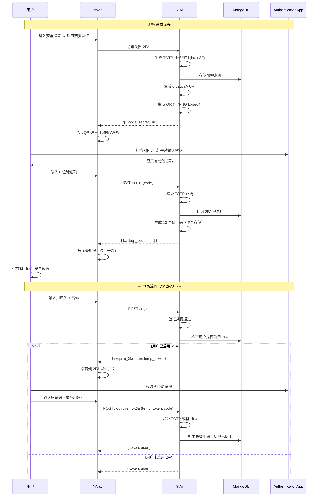
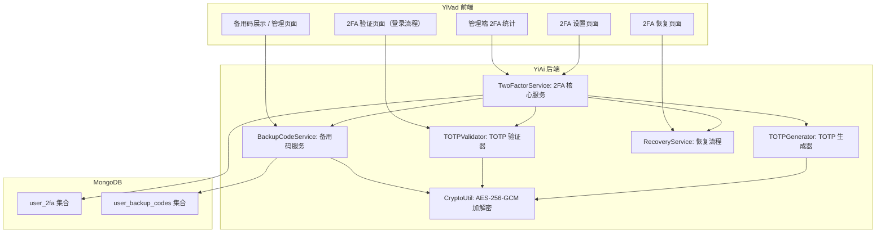

# YV-09-132: 两步验证设置 — TOTP 配置与 QR 码、备用码生成与管理、2FA 恢复流程、2FA 启用统计

> 需求编号：YV-09-132 · 优先级：P2 · 人天：0.3d · 状态：需求已编写
> 依赖：无强依赖，可与用户会话管理、登录历史并行开发

## 背景

### 问题陈述

YiVad 当前仅支持用户名 + 密码的单因素认证。在管理员账号权限较大（可管理用户、数据、系统配置）的场景下，单因素认证的安全性不足。密码泄露或弱密码都可能导致管理员账号被盗用。需要引入两步验证（2FA）作为安全增强层：

1. **密码泄露风险**：管理员密码一旦泄露，攻击者可直接登录系统
2. **无二次确认**：登录后无额外的身份验证步骤
3. **弱密码问题**：部分用户使用弱密码，增加了被暴力破解的风险
4. **合规要求**：等保 2.0 要求重要系统支持双因素认证
5. **无恢复机制**：如果用户丢失手机，需要管理员介入恢复

**核心矛盾**：系统管理员权限较大但认证方式单一，缺乏行业标准的两步验证保护。

### 影响范围

| # | 影响 | 严重程度 | 典型场景 |
|---|------|----------|----------|
| 1 | 管理员账号易被盗用 | 高 | 密码泄露后攻击者直接获得管理员权限 |
| 2 | 不符合安全合规要求 | 高 | 等保检查时缺少双因素认证 |
| 3 | 无备用恢复机制 | 中 | 用户丢失手机后无法登录 |
| 4 | 无法强制 2FA | 中 | 管理员无法要求所有用户启用 2FA |

### 挑战

| 挑战 | 说明 |
|------|------|
| TOTP 时间同步 | 服务端和用户设备的时间偏差需要容差（通常 ±30 秒窗口） |
| 密钥存储安全 | TOTP 种子密钥需要加密存储，不能明文保存在数据库 |
| 备用码安全 | 备用码是一次性使用的恢复凭证，需要安全生成和哈希存储 |
| 恢复流程 | 2FA 设备丢失后，需要有安全的恢复流程，防止社会工程攻击 |
| QR 码生成 | 需要在后端生成标准的 otpauth:// URI |

---

## 一、现状分析

### 1.1 当前认证流程

```
YiVad 认证流程（当前）:
├── 登录
│   ├── 用户输入用户名 + 密码
│   ├── YiAi 验证凭据
│   ├── 生成 JWT Token
│   └── 返回 Token（无二次验证）
├── Token 管理
│   ├── Token 存储在 Pinia + localStorage
│   └── 每次请求携带 X-Token 头部
└── 安全措施
    ├── JWT 签名 + 过期时间
    ├── 无两步验证                    # ❌ 不存在
    ├── 无 TOTP 验证                  # ❌ 不存在
    ├── 无备用码                      # ❌ 不存在
    └── 无恢复流程                    # ❌ 不存在
```

### 1.2 两步验证标准流程



### 1.3 根因矩阵

| 症状 | 根因 | 触发条件 | 频率 |
|------|------|----------|------|
| 单因素认证 | 未实现 2FA | 每次管理员登录 | 高 |
| 无备用验证 | 无备用码机制 | 手机丢失时 | 低 |
| 密钥不安全 | 未加密存储 TOTP 种子 | 数据库泄露时 | 低 |
| 无恢复流程 | 未设计 2FA 恢复流程 | 用户无法访问 2FA 设备时 | 低 |
| 无强制策略 | 未实现 2FA 强制启用 | 安全策略变更时 | 低 |

---

## 二、设计决策

### 决策 1：2FA 验证方式 — TOTP vs SMS vs Email vs 硬件密钥

| 选项 | 安全性 | 依赖 | 成本 | 用户体验 |
|------|--------|------|------|----------|
| TOTP（Google Authenticator） | 高 | 用户安装 App | 零 | 好（扫码即可） |
| SMS 验证码 | 中 | 短信网关 | 高（按条收费） | 好（无需 App） |
| Email 验证码 | 低 | 邮件服务 | 零 | 中（需切换 App） |
| 硬件密钥（WebAuthn） | 最高 | 硬件设备 | 中（设备购买） | 中 |

**选择：TOTP（基于时间的一次性密码）。** TOTP 是行业标准（RFC 6238），支持所有主流身份验证器 App（Google Authenticator、Microsoft Authenticator、Authy、1Password 等），零成本，安全性高，无需网络。

### 决策 2：TOTP 密钥存储 — 明文 vs AES 加密 vs 环境变量加密

| 选项 | 安全性 | 复杂度 | 密钥管理 |
|------|--------|--------|----------|
| 明文存储 | 低 | 低 | 无 |
| AES-256-GCM 加密（应用密钥） | 高 | 中 | 需要管理加密密钥 |
| 环境变量加密 | 中 | 低 | 密钥在环境变量中 |

**选择：AES-256-GCM 加密。** TOTP 种子密钥是敏感凭证，明文存储等同于泄露。使用应用级 AES-256-GCM 加密，加密密钥存储在环境变量 `TOTP_ENCRYPTION_KEY` 中。

### 决策 3：备用码生成策略 — 10 个 vs 5 个 vs 20 个

| 选项 | 数量 | 安全性 | 用户体验 |
|------|------|--------|----------|
| 5 个 | 较少 | 中 | 可能不够用 |
| 10 个 | 适中 | 高 | 足够使用 |
| 20 个 | 较多 | 高 | 管理不便 |

**选择：10 个备用码。** 10 个备用码提供足够的安全余量。每个备用码为 10 位字母数字（如 `ABCD-EFGH-IJ` 格式），SHA-256 哈希后存储。

### 决策 4：2FA 启用策略 — 可选 vs 强制管理员 vs 强制所有用户

| 选项 | 安全性 | 用户体验 | 管理成本 |
|------|--------|----------|----------|
| 可选（默认） | 低 | 好 | 低 |
| 强制管理员 | 中 | 中 | 低（仅管理员受影响） |
| 强制所有用户 | 高 | 差 | 高（需要帮助用户设置） |

**选择：可选（默认）+ 管理员可配置强制策略。** 系统设置中提供三档：可选、强制管理员、强制所有用户。默认可选，由管理员根据安全策略调整。

### 设计决策记录

| 决策 | 选项 A | 选项 B | 选项 C | 选择 | 理由 |
|------|--------|--------|--------|------|------|
| 验证方式 | TOTP | SMS | 硬件密钥 | **TOTP** | 行业标准 + 零成本 |
| 密钥存储 | 明文 | AES-256-GCM | 环境变量 | **AES-256-GCM** | 安全 + 可管理 |
| 备用码数量 | 5 个 | 10 个 | 20 个 | **10 个** | 安全与便利平衡 |
| 启用策略 | 可选 | 强制管理员 | 强制所有 | **可配置** | 灵活适配 |

---

## 三、目标架构

### 3.1 2FA 系统架构



### 3.2 数据模型

```
user_2fa 集合:
{
  _id: ObjectId,
  user_id: "user_001",
  is_enabled: true,
  secret_encrypted: "aes_gcm_base64_encrypted_key",   // AES-256-GCM 加密的种子密钥
  enabled_at: ISODate("2026-09-09T08:00:00Z"),
  last_verified_at: ISODate("2026-09-09T09:30:00Z"),
  backup_codes_remaining: 8,
  created_at: ISODate("2026-09-09T08:00:00Z"),
  updated_at: ISODate("2026-09-09T08:00:00Z")
}

user_backup_codes 集合:
{
  _id: ObjectId,
  user_id: "user_001",
  code_hash: "sha256_hash_of_code",     // 备用码的 SHA-256 哈希
  is_used: false,
  used_at: null,
  created_at: ISODate("2026-09-09T08:00:00Z")
}

索引:
- user_2fa: { user_id: 1 }, unique
- user_backup_codes: { user_id: 1, code_hash: 1 }
- user_backup_codes: { user_id: 1, is_used: 1 }
```

---

## 四、具体改动

### 4.1 YiAi 后端 — TwoFactorService

```python
# services/auth/two_factor_service.py (新增)

class TwoFactorService:
    """两步验证服务"""

    def __init__(self):
        self.collection = db.user_2fa
        self.backup_codes = db.user_backup_codes
        self.crypto = CryptoUtil()
        self.totp = pyotp  # 使用 pyotp 库

    async def setup_2fa(self, user_id: str, username: str) -> dict:
        """开始设置 2FA，返回 QR 码和密钥"""
        # 检查是否已启用
        existing = await self.collection.find_one({"user_id": user_id})
        if existing and existing.get("is_enabled"):
            raise BusinessError(4003, "两步验证已启用，请先禁用后再重新设置")

        # 生成 TOTP 种子
        secret = pyotp.random_base32()

        # 加密存储种子
        encrypted = self.crypto.encrypt(secret)

        # 保存（未启用状态）
        await self.collection.update_one(
            {"user_id": user_id},
            {"$set": {
                "secret_encrypted": encrypted,
                "is_enabled": False,
                "created_at": datetime.utcnow(),
                "updated_at": datetime.utcnow(),
            }},
            upsert=True
        )

        # 生成 otpauth URI 和 QR 码
        issuer = "YiVad"
        uri = pyotp.totp.TOTP(secret).provisioning_uri(
            name=username, issuer_name=issuer
        )
        qr_code = self.generate_qr_code(uri)

        return {
            "secret": secret,
            "uri": uri,
            "qr_code": qr_code,  # base64 PNG
        }

    async def verify_and_enable(self, user_id: str, code: str) -> dict:
        """验证 TOTP 并启用 2FA"""
        record = await self.collection.find_one({"user_id": user_id})
        if not record:
            raise BusinessError(1002, "2FA 设置未初始化")

        # 解密种子
        secret = self.crypto.decrypt(record["secret_encrypted"])

        # 验证 TOTP
        totp = pyotp.TOTP(secret)
        if not totp.verify(code, valid_window=1):
            raise BusinessError(4001, "验证码无效，请重试")

        # 启用 2FA
        await self.collection.update_one(
            {"user_id": user_id},
            {"$set": {
                "is_enabled": True,
                "enabled_at": datetime.utcnow(),
                "updated_at": datetime.utcnow(),
            }}
        )

        # 生成备用码
        backup_codes = await self.generate_backup_codes(user_id)

        return {"backup_codes": backup_codes}

    async def verify_login_2fa(self, user_id: str, code: str) -> bool:
        """登录时验证 2FA（TOTP 或备用码）"""
        record = await self.collection.find_one({"user_id": user_id})
        if not record or not record.get("is_enabled"):
            return True  # 未启用 2FA，直接通过

        # 先尝试 TOTP 验证
        secret = self.crypto.decrypt(record["secret_encrypted"])
        totp = pyotp.TOTP(secret)
        if totp.verify(code, valid_window=1):
            await self.collection.update_one(
                {"user_id": user_id},
                {"$set": {
                    "last_verified_at": datetime.utcnow(),
                    "updated_at": datetime.utcnow(),
                }}
            )
            return True

        # 如果 TOTP 失败，尝试备用码
        code_hash = hashlib.sha256(code.strip().replace("-", "").encode()).hexdigest()
        backup = await self.backup_codes.find_one({
            "user_id": user_id,
            "code_hash": code_hash,
            "is_used": False,
        })
        if backup:
            await self.backup_codes.update_one(
                {"_id": backup["_id"]},
                {"$set": {"is_used": True, "used_at": datetime.utcnow()}}
            )
            # 减少剩余备用码计数
            await self.collection.update_one(
                {"user_id": user_id},
                {"$inc": {"backup_codes_remaining": -1}}
            )
            return True

        return False

    async def generate_backup_codes(self, user_id: str) -> list:
        """生成 10 个备用码（返回明文，仅此一次）"""
        # 删除旧备用码
        await self.backup_codes.delete_many({"user_id": user_id})

        codes = []
        for _ in range(10):
            code = ''.join(secrets.choice(string.ascii_uppercase + string.digits) for _ in range(12))
            formatted = f"{code[:4]}-{code[4:8]}-{code[8:]}"
            codes.append(formatted)

            code_hash = hashlib.sha256(code.encode()).hexdigest()
            await self.backup_codes.insert_one({
                "user_id": user_id,
                "code_hash": code_hash,
                "is_used": False,
                "created_at": datetime.utcnow(),
            })

        await self.collection.update_one(
            {"user_id": user_id},
            {"$set": {"backup_codes_remaining": 10}}
        )

        return codes
```

### 4.2 恢复流程

```python
# services/auth/recovery_service.py (新增)

class RecoveryService:
    """2FA 恢复流程服务"""

    async def initiate_recovery(self, user_id: str, admin_id: str) -> dict:
        """管理员发起 2FA 恢复（重置用户的 2FA）"""
        # 权限检查
        if not await auth_service.is_admin(admin_id):
            raise BusinessError(4002, "仅管理员可执行 2FA 恢复")

        # 记录审计日志
        await audit_service.log({
            "action": "2fa_recovery_initiated",
            "target_user": user_id,
            "initiated_by": admin_id,
            "timestamp": datetime.utcnow(),
        })

        # 禁用用户 2FA
        await db.user_2fa.update_one(
            {"user_id": user_id},
            {"$set": {"is_enabled": False, "updated_at": datetime.utcnow()}}
        )

        # 清除备用码
        await db.user_backup_codes.delete_many({"user_id": user_id})

        return {"message": "2FA 已重置，用户下次登录时需要重新设置"}

    async def recover_by_email(self, user_id: str, recovery_token: str):
        """通过注册邮箱恢复（备用方案）"""
        # 验证恢复 Token（通过邮件发送的一次性链接）
        # 验证通过后同管理员恢复流程
        pass
```

### 4.3 YiVad 前端 — 2FA 设置页面

```typescript
// src/views/user/two-factor-setup.vue (新增)

// <template>
//   <div class="two-factor-setup">
//     <PageHeader title="两步验证" desc="使用身份验证器 App 保护您的账号">
//       <t-tag v-if="isEnabled" theme="success">已启用</t-tag>
//       <t-tag v-else theme="default">未启用</t-tag>
//     </PageHeader>
//
//     <!-- 未启用状态：设置向导 -->
//     <template v-if="!isEnabled && !isSettingUp">
//       <t-card>
//         <h3>为什么要启用两步验证？</h3>
//         <p>两步验证为您的账号增加额外的安全层。即使密码泄露，攻击者也无法登录。</p>
//         <t-button theme="primary" @click="startSetup">开始设置</t-button>
//       </t-card>
//     </template>
//
//     <!-- 设置中：QR 码 + 验证 -->
//     <template v-if="isSettingUp">
//       <t-steps :current="step" :options="steps" />
//
//       <t-card v-if="step === 0" title="第 1 步：扫描 QR 码">
//         <div class="qr-container">
//           
//           <p class="secret-text">或手动输入密钥：{{ secret }}</p>
//         </div>
//         <t-button @click="step = 1">下一步</t-button>
//       </t-card>
//
//       <t-card v-if="step === 1" title="第 2 步：验证验证码">
//         <t-input v-model="verifyCode" placeholder="输入 6 位验证码" maxlength="6" />
//         <t-button theme="primary" @click="verify" :loading="verifying">验证并启用</t-button>
//       </t-card>
//
//       <t-card v-if="step === 2" title="第 3 步：保存备用码">
//         <t-alert theme="warning">
//           请立即保存这些备用码！这是您唯一能看到它们的机会。备用码不会再次显示。
//         </t-alert>
//         <div class="backup-codes">
//           <div v-for="code in backupCodes" class="code-item">{{ code }}</div>
//         </div>
//         <t-button @click="downloadCodes">下载备用码</t-button>
//         <t-button theme="primary" @click="finishSetup">完成设置</t-button>
//       </t-card>
//     </template>
//
//     <!-- 已启用状态：管理 -->
//     <template v-if="isEnabled">
//       <t-card title="两步验证状态">
//         <t-descriptions>
//           <t-descriptions-item label="状态">已启用</t-descriptions-item>
//           <t-descriptions-item label="启用时间">{{ enabledAt }}</t-descriptions-item>
//           <t-descriptions-item label="剩余备用码">{{ remainingCodes }} / 10</t-descriptions-item>
//         </t-descriptions>
//         <t-button @click="regenerateCodes" variant="outline">重新生成备用码</t-button>
//         <t-popconfirm content="确定禁用两步验证？" @confirm="disable2FA">
//           <t-button theme="danger" variant="outline">禁用两步验证</t-button>
//         </t-popconfirm>
//       </t-card>
//     </template>
//   </div>
// </template>
```

### 4.4 文件变更清单

| 文件 | 操作 | 说明 |
|------|------|------|
| `YiAi/services/auth/two_factor_service.py` | 新增 | 2FA 核心服务（设置/验证/备用码） |
| `YiAi/services/auth/recovery_service.py` | 新增 | 2FA 恢复流程服务 |
| `YiAi/services/auth/crypto_util.py` | 新增 | AES-256-GCM 加解密工具 |
| `YiAi/services/auth/login_handler.py` | 修改 | 登录接口增加 2FA 验证步骤 |
| `YiAi/middleware/auth.py` | 修改 | 可选：登录后检查 2FA 完成状态 |
| `YiVad/src/views/user/two-factor-setup.vue` | 新增 | 2FA 设置向导页面 |
| `YiVad/src/views/auth/two-factor-verify.vue` | 新增 | 登录流程中的 2FA 验证页面 |
| `YiVad/src/views/system/two-factor-stats.vue` | 新增 | 管理端 2FA 启用统计页面 |
| `YiVad/src/stores/two-factor.ts` | 新增 | 2FA 状态管理 |
| `YiVad/src/router/modules/user.ts` | 修改 | 添加 2FA 设置路由 |
| `YiVad/src/router/modules/auth.ts` | 修改 | 添加 2FA 验证路由 |
| `YiAi/tests/test_two_factor.py` | 新增 | 2FA 服务测试 |

---

## 五、实施步骤

| 步骤 | 操作 | 路径 | 验证 | 人天 |
|------|------|------|------|------|
| 1 | 实现 AES-256-GCM 加解密工具 | `YiAi/services/auth/crypto_util.py` | 加解密往返正确 | 0.03 |
| 2 | 实现 TwoFactorService（设置 + 验证） | `YiAi/services/auth/two_factor_service.py` | TOTP 生成/验证正确 | 0.05 |
| 3 | 实现备用码生成与验证 | `YiAi/services/auth/two_factor_service.py` | 验码正确 + 一次性使用 | 0.03 |
| 4 | 实现恢复流程 | `YiAi/services/auth/recovery_service.py` | 管理员可重置 2FA | 0.02 |
| 5 | 修改登录接口集成 2FA | `YiAi/services/auth/login_handler.py` | 含 2FA 的完整登录流程 | 0.04 |
| 6 | 实现 YiVad 2FA 设置向导 | `YiVad/src/views/user/two-factor-setup.vue` | QR 码 → 验证 → 备用码 | 0.06 |
| 7 | 实现登录流程 2FA 验证页 + 管理统计 | `YiVad/src/views/auth/two-factor-verify.vue` + stats | 完整登录流程 + 统计 | 0.04 |
| 8 | 路由注册 + 测试 | 路由文件 + 测试文件 | 端到端验证 | 0.03 |

**总人天：0.3d**

---

## 六、测试规格

### 场景 1：设置 2FA

**GIVEN** 用户未启用 2FA
**WHEN** 用户在安全设置页面点击"开始设置两步验证"
**THEN** 系统生成 TOTP 种子密钥 + QR 码
**AND** QR 码显示在页面上（base64 PNG）
**AND** 同时显示手动输入密钥（base32 格式）

### 场景 2：验证并启用 2FA

**GIVEN** 用户已扫描 QR 码，身份验证器 App 中显示 6 位验证码
**WHEN** 用户输入正确的 6 位验证码并提交
**THEN** 2FA 状态变为"已启用"
**AND** 生成 10 个备用码并展示给用户
**AND** 备用码以 `XXXX-XXXX-XXXX` 格式显示

### 场景 3：登录时验证 2FA

**GIVEN** 用户已启用 2FA
**WHEN** 用户输入正确的用户名和密码
**THEN** 返回 `{ require_2fa: true, temp_token }` 而非 JWT
**AND** 前端跳转到 2FA 验证页面
**AND** 用户输入正确的 6 位 TOTP 验证码后获得完整 JWT Token

### 场景 4：使用备用码登录

**GIVEN** 用户已启用 2FA，但手机丢失无法获取 TOTP
**WHEN** 用户在 2FA 验证页面输入一个未使用的备用码
**THEN** 备用码验证通过，返回完整 JWT Token
**AND** 该备用码被标记为已使用，不可再次使用

### 场景 5：管理员强制启用 2FA

**GIVEN** 系统配置中 2FA 策略设为"强制管理员"
**WHEN** 未启用 2FA 的管理员账号登录
**THEN** 登录成功后跳转到 2FA 设置页面
**AND** 在完成 2FA 设置前，其他管理功能不可用

### 场景 6：管理员重置用户 2FA

**GIVEN** 用户已启用 2FA 但丢失了手机和备用码
**WHEN** 管理员在用户管理页面执行"重置 2FA"
**THEN** 用户的 2FA 被禁用
**AND** 用户的备用码被清除
**AND** 审计日志中记录恢复操作（操作人和目标用户）

---

## 七、风险与缓解

| 风险 | 概率 | 影响 | 缓解措施 |
|------|------|------|----------|
| TOTP 时间偏差 | 中 | 中 | valid_window=1（±30 秒），提示用户同步设备时间 |
| 加密密钥泄露 | 低 | 高 | 密钥存储在环境变量，不提交到代码仓库 |
| 备用码被截屏泄露 | 中 | 中 | 展示备用码时添加水印，提示用户不要截屏 |
| 用户丢失备用码 + 手机 | 低 | 高 | 管理员可重置 2FA（需身份验证） |
| pyotp 库安全漏洞 | 低 | 中 | 使用官方维护的 pyotp 库，定期更新 |

---

## 八、回滚策略

| 场景 | 回滚操作 | 影响 |
|------|----------|------|
| 2FA 验证失败率过高 | 临时禁用 2FA 检查，所有用户直接登录 | 失去安全增强 |
| 加密功能异常 | 回退加密存储，临时明文存储（紧急） | 安全降级 |
| QR 码生成失败 | 提供手动输入密钥作为唯一方式 | 用户体验下降 |
| 登录流程异常 | 回退登录接口修改，恢复单因素认证 | 已启用 2FA 的用户也被绕过 |

---

## 九、设计决策记录

### D-01：为什么选择 TOTP 而非 WebAuthn/FIDO2？

WebAuthn 安全性高于 TOTP，但需要硬件支持（安全密钥或平台认证器），用户门槛较高。TOTP 只需要一个手机 App，几乎人人可用。首期用 TOTP 覆盖最大用户群，后续可扩展 WebAuthn。

### D-02：为什么备用码是 10 个而非 5 个？

5 个备用码在日常使用中可能不够（用户可能丢失记录、误删、忘记保存位置）。10 个提供了足够的冗余，同时不会过多导致用户管理困难。

### D-03：为什么不支持通过 Email 自动恢复 2FA？

Email 自动恢复意味着 2FA 降级为 Email 单因素认证（攻击者可以通过攻击 Email 绕过 2FA）。管理员手动恢复虽然流程更慢，但提供了人工审核的安全层。

### D-04：为什么 TOTP 种子密钥需要 AES 加密存储？

TOTP 种子密钥等同于用户的第二因素。如果数据库泄露且种子密钥明文存储，攻击者可以直接生成 TOTP 验证码。AES 加密确保即使数据库泄露，种子密钥也不可用（假设加密密钥未同时泄露）。

---

## 十、可观测性

### 指标

| 指标 | 类型 | 说明 |
|------|------|------|
| `yivad.twofa.enabled_users` | Gauge | 已启用 2FA 的用户数 |
| `yivad.twofa.enabled_rate` | Gauge | 2FA 启用率 |
| `yivad.twofa.verify_count` | Counter | 2FA 验证次数 |
| `yivad.twofa.verify_success_rate` | Gauge | 2FA 验证成功率 |
| `yivad.twofa.backup_code_usage` | Counter | 备用码使用次数 |
| `yivad.twofa.recovery_count` | Counter | 2FA 恢复操作次数 |

### 告警

| 告警 | 条件 | 级别 |
|------|------|------|
| 2FA 验证失败率过高 | 5 分钟内失败率 > 30% | WARNING |
| 备用码使用频率异常 | 1 小时内 > 5 次备用码验证 | WARNING |
| 2FA 恢复操作频率异常 | 1 小时内 > 3 次恢复操作 | INFO |

---

## 十一、代码审查检查清单

- [ ] TOTP 种子密钥使用 AES-256-GCM 加密存储
- [ ] 加密密钥来自环境变量，不硬编码
- [ ] TOTP 验证窗口为 ±1（容差 30 秒）
- [ ] 备用码使用 SHA-256 哈希存储，不存明文
- [ ] 备用码一次性使用，使用后立即标记
- [ ] QR 码生成使用标准 otpauth:// URI 格式
- [ ] 2FA 启用/禁用/恢复操作记录审计日志
- [ ] 强制 2FA 策略可配置（可选/强制管理员/强制所有）
- [ ] 登录流程支持 temp_token 机制（密码验证通过但 2FA 未完成）
- [ ] 管理端可查看 2FA 启用统计
- [ ] 备用码仅展示一次，不持久化到前端
- [ ] 单元测试覆盖 TOTP 生成/验证/备用码/恢复

---

## 回归问题预测

| # | 预测问题 | 原因 | 验证方法 |
|---|---------|------|---------|
| 1 | 用户扫描 QR 码后，身份验证器 App 显示的不是 "YiVad" 而是 "YiVad: null"，因为 username 为空时 provisioning_uri 生成 issuer 异常 | provisioning_uri 的 name 参数来自 username，如果用户名为空字符串或 None，生成的 URI 格式异常 | 使用用户名为空字符串的测试账号设置 2FA → 扫描 QR 码 → 验证 App 中显示正确的服务名称 |
| 2 | TOTP 验证在服务端和客户端时间不同步时失败，用户输入正确的验证码却被拒绝，valid_window=1（±30s）不足以覆盖时差 | 默认 valid_window=1 允许 ±30 秒偏差，但用户设备与服务器时间可能相差 1-2 分钟 | 手动调整系统时间偏移 45 秒 → 获取 TOTP 验证码 → 验证是否通过（valid_window=2 时通过） |
| 3 | 用户重新生成备用码后，旧的备用码文档仍保留在数据库，累计大量 is_used=true 的记录 | regenerate_backup_codes 使用 delete_many 删除旧码，但如果 user_id 索引缺失或操作未执行，旧码累积 | 多次重新生成备用码 → 查询 user_backup_codes 集合 → 验证每次只有 10 条记录（is_used=false） |
| 4 | 管理员禁用用户的 2FA 后，用户在登录时仍需输入 2FA 验证码，因为 is_enabled 字段未实时同步 | user_2fa 的 is_enabled 更新与登录时检查之间存在缓存或不一致 | 管理员禁用用户 2FA → 用户立即尝试登录 → 验证登录时 2FA 被跳过 |
| 5 | 登录流程中使用 temp_token（密码验证后、2FA 前的临时 Token），temp_token 未设置短过期时间，可被重放攻击 | temp_token 需要短过期（如 5 分钟），但如果过期时间过长或未验证，可被截获后在有效期内使用 | 获取 temp_token → 等待 6 分钟 → 使用旧的 temp_token + 有效验证码 → 验证是否返回错误 |
| 6 | QR 码图片以 base64 格式返回（~3KB），但前端在移动端加载大图时解码耗时过长，用户看到的 QR 码有延迟 | base64 PNG 图片大小取决于 QR 码复杂度（otpauth URI 越长图片越大），移动端 CPU 解码 PNG 较慢 | 在移动端（iPhone SE 模拟）打开 2FA 设置 → 测量从点击"开始设置"到 QR 码显示的时间 → 验证 < 500ms |

---

## 性能分析

### 关键操作耗时

| 操作 | 耗时 | 说明 |
|------|------|------|
| 生成 TOTP 种子 + QR 码 | < 30ms | 随机数生成 + QR 码 PNG 生成 |
| TOTP 验证 | < 5ms | HMAC-SHA1 计算 |
| 备用码生成（10 个） | < 20ms | 随机字符串生成 + 哈希 + 批量写入 |
| 备用码验证 | < 10ms | SHA-256 哈希 + 索引查询 |
| AES 加解密 | < 2ms | AES-256-GCM，小数据量 |
| 登录（含 2FA 流程） | < 100ms | 密码验证 50ms + 2FA 验证 5ms + Token 生成 |

---

## 相关文档

- [用户会话管理](../130-需求-用户会话管理.md) — 会话级别的安全增强
- [登录历史记录](../131-需求-登录历史记录.md) — 登录审计与异常检测
- [安全事件日志](../133-需求-安全事件日志.md) — 2FA 相关安全事件
- [基于角色的权限控制](../../2026-08/02-需求-基于角色的权限控制.md) — 管理员权限控制

*PRD 来源: `projects/yivad/requirements/2026-09/132-需求-两步验证设置.md`*

