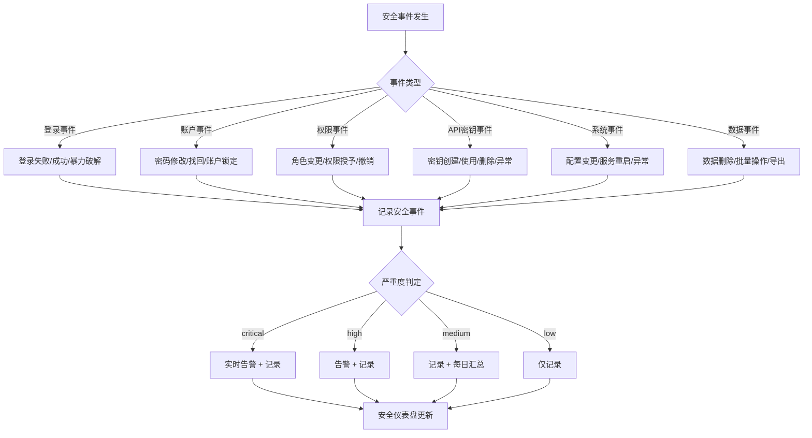
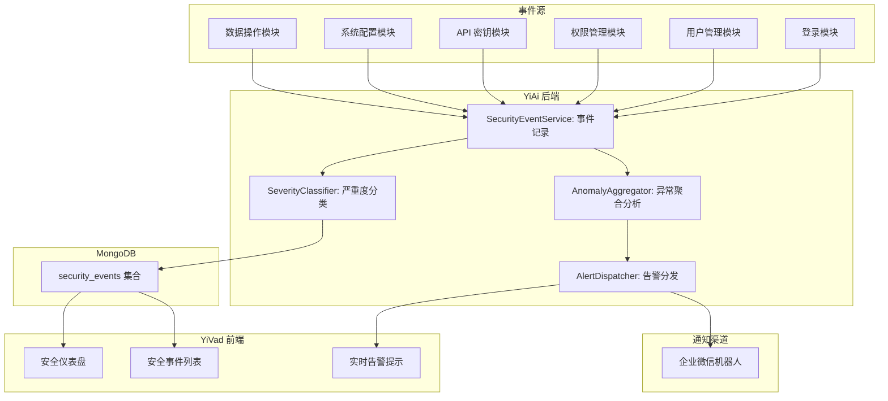

# YV-09-133: 安全事件日志 — 登录失败/密码修改/权限变更/API 密钥使用、严重度分级、实时告警、安全仪表盘

> 需求编号：YV-09-133 · 优先级：P2 · 人天：0.3d · 状态：需求已编写
> 依赖：YV-09-130（用户会话管理）、YV-09-131（登录历史记录）

## 背景

### 问题陈述

YiVad 作为管理后台，涉及大量敏感操作（用户管理、权限变更、数据删除、API 密钥使用等），但当前缺少统一的安全事件日志系统。各类安全相关事件零散存储或根本不记录，导致：

1. **安全事件不可追溯**：发生安全事件后无法确定谁在何时做了什么操作
2. **异常行为检测缺失**：无法自动识别暴力破解、权限滥用等攻击行为
3. **无安全态势可视化**：管理员无法一眼了解系统当前的安全状况
4. **合规审计困难**：等保/ISO 27001 等合规审计要求完整的安全事件日志
5. **告警响应延迟**：安全事件发生后无实时通知机制

**核心矛盾**：系统操作越来越丰富（用户管理、权限管理、数据 CRUD、API 密钥、2FA），但安全事件没有被统一记录、分级和告警。安全态势全盲。

### 影响范围

| # | 影响 | 严重程度 | 典型场景 |
|---|------|----------|----------|
| 1 | 安全事件不可追溯 | 高 | 数据被删除但不知道是谁操作的 |
| 2 | 无法检测暴力破解 | 高 | 攻击者对某个账号持续尝试登录 |
| 3 | 无权限变更审计 | 高 | 不知道谁最近被提升了权限 |
| 4 | API 密钥滥用无法发现 | 中 | 密钥在异常时间/地点被使用 |
| 5 | 无法满足合规审计 | 高 | 等保检查要求完整安全日志 |

### 挑战

| 挑战 | 说明 |
|------|------|
| 事件分类 | 需要定义清晰的安全事件类型和严重度分级 |
| 数据量 | 安全事件日志量可能很大，需要合理的存储和清理策略 |
| 实时告警 | 高严重度事件需要实时通知管理员 |
| 安全仪表盘 | 需要可视化展示安全态势（事件趋势、分布、热点） |
| 与现有审计日志的边界 | 区分安全事件日志和通用操作审计日志 |

---

## 一、现状分析

### 1.1 当前安全事件记录现状

```
YiVad/YiAi 安全事件记录现状:
├── 登录相关
│   ├── 登录成功：无记录                    # ❌
│   ├── 登录失败：无记录                    # ❌
│   └── 暴力破解检测：无                    # ❌
├── 用户管理
│   ├── 创建用户：无记录                    # ❌
│   ├── 删除用户：无记录                    # ❌
│   ├── 密码修改：无记录                    # ❌
│   └── 角色变更：无记录                    # ❌
├── 权限管理
│   ├── 权限授予/撤销：无记录               # ❌
│   └── 管理员权限变更：无记录              # ❌
├── API 密钥
│   ├── 密钥创建：无记录                    # ❌
│   ├── 密钥使用：无记录                    # ❌
│   └── 密钥删除：无记录                    # ❌
└── 系统配置
    ├── 配置变更：无记录                    # ❌
    └── 系统重启：无记录                    # ❌
```

### 1.2 安全事件生命周期



### 1.3 根因矩阵

| 症状 | 根因 | 触发条件 | 频率 |
|------|------|----------|------|
| 安全事件不可追溯 | 未实现安全事件日志系统 | 每次安全事件发生 | 中 |
| 无法检测暴力破解 | 登录失败事件未聚合分析 | 攻击发生时 | 低 |
| 权限变更不透明 | 角色变更未记录日志 | 角色/权限变更时 | 低 |
| API 密钥无审计 | API 密钥使用未记录 | 每次 API 调用 | 高 |
| 无安全态势可视化 | 无安全仪表盘 | 管理员查看时 | 中 |

---

## 二、设计决策

### 决策 1：安全事件存储 — 独立集合 vs 复用 audit_logs vs 混合

| 选项 | 查询效率 | 存储成本 | 与审计日志关系 |
|------|----------|----------|---------------|
| 独立 `security_events` 集合 | 高 | 中 | 与通用审计日志完全分离 |
| 复用 `audit_logs` + type 字段 | 中 | 低 | 混合存储，按类型过滤 |
| 混合（独立 + 审计日志引用） | 中 | 高 | 安全事件引审计日志 |

**选择：独立 `security_events` 集合。** 安全事件有独立的严重度模型、告警逻辑、保留策略和前端展示。与通用审计日志分开避免字段混杂和查询复杂度。

### 决策 2：事件严重度分级 — 3 级 vs 4 级 vs 5 级

| 选项 | 精细度 | 配置复杂度 | 告警策略 |
|------|--------|-----------|----------|
| 3 级（高/中/低） | 低 | 低 | 简单清晰 |
| 4 级（critical/high/medium/low） | 中 | 中 | 参考 PagerDuty 分级 |
| 5 级（再加 info） | 高 | 高 | 过度细分 |

**选择：4 级（critical/high/medium/low）。** 4 级足够表达安全事件的紧急程度，对应不同的告警策略（critical 实时通知、high 告警、medium 每日汇总、low 仅记录）。

### 决策 3：实时告警方式 — WebSocket vs 轮询 vs 邮件/企微

| 选项 | 实时性 | 实现复杂度 | 可靠性 |
|------|--------|-----------|--------|
| WebSocket 推送 | 毫秒级 | 中 | 需处理断连重连 |
| 前端轮询（5s） | 秒级 | 低 | 始终可靠 |
| 邮件/企业微信通知 | 分钟级 | 低 | 邮箱/企微本身可靠 |

**选择：前端轮询（5s）+ 企业微信通知。** 前端仪表盘使用 5 秒轮询获取新事件。critical 级别事件通过企业微信机器人实时推送（YiAi 已有企微推送能力）。

### 决策 4：事件保留策略 — 固定天数 vs 按级别 vs 归档

| 选项 | 存储成本 | 审计合规 | 实现复杂度 |
|------|----------|----------|-----------|
| 固定天数（90 天全部删除） | 低 | 中（可能不满足合规） | 低（TTL 索引） |
| 按级别（critical 1年/其他 90天） | 中 | 高 | 中 |
| 归档到冷存储 | 低 | 高 | 高 |

**选择：按级别保留。** critical 和 high 事件保留 1 年（合规审计需要），medium 保留 90 天，low 保留 30 天。使用 MongoDB TTL 索引按级别设置不同过期时间。

### 设计决策记录

| 决策 | 选项 A | 选项 B | 选项 C | 选择 | 理由 |
|------|--------|--------|--------|------|------|
| 存储方式 | 独立集合 | audit_logs | 混合 | **独立集合** | 独立模型和保留策略 |
| 严重度 | 3 级 | 4 级 | 5 级 | **4 级** | 平衡精细度和复杂度 |
| 告警方式 | WebSocket | 轮询 | 企微 | **轮询 + 企微** | 可靠 + 复用已有能力 |
| 保留策略 | 固定天数 | 按级别 | 归档 | **按级别** | 合规 + 成本可控 |

---

## 三、目标架构

### 3.1 安全事件系统架构



### 3.2 数据模型

```
security_events 集合:
{
  _id: ObjectId,
  event_id: "sec_evt_abc123",
  event_type: "login_failure",    // 事件类型（见类型枚举）
  severity: "high",               // critical | high | medium | low
  actor: {
    user_id: "user_001",
    username: "陈铭",
    ip_address: "192.168.1.100",
    user_agent: "Mozilla/5.0...",
    session_id: "sess_abc"
  },
  target: {                       // 操作目标（可选）
    user_id: "user_002",
    username: "张三",
    resource_type: "user",        // user | role | api_key | config | data
    resource_id: "user_002"
  },
  action: "登录失败",             // 人类可读的操作描述
  details: {                      // 事件具体信息
    reason: "invalid_password",
    attempt_count: 5,
    device: "Chrome / macOS"
  },
  source_module: "auth",          // auth | user_mgmt | permission | api_key | system | data
  timestamp: ISODate("2026-09-09T08:00:00Z"),
  acknowledged: false,            // 管理员是否已确认
  acknowledged_by: null,
  acknowledged_at: null,
  expires_at: ISODate("2027-09-09T08:00:00Z")  // TTL 索引
}

事件类型枚举:
- login_failure          // 登录失败
- login_failure_brute    // 疑似暴力破解
- login_success          // 登录成功
- password_change        // 密码修改
- password_reset         // 密码重置
- account_lockout        // 账户锁定
- role_change            // 角色变更
- permission_grant       // 权限授予
- permission_revoke      // 权限撤销
- admin_privilege_esc    // 管理员权限提升
- api_key_created        // API 密钥创建
- api_key_used           // API 密钥使用
- api_key_deleted        // API 密钥删除
- api_key_anomaly        // API 密钥异常使用
- config_change          // 系统配置变更
- data_bulk_delete       // 批量数据删除
- data_export            // 数据导出
- session_revoke         // 强制下线
- twofa_disabled         // 2FA 被禁用
- twofa_recovery         // 2FA 恢复操作

索引:
- { event_type: 1, timestamp: -1 }           -- 按类型查询
- { severity: 1, timestamp: -1 }             -- 按严重度查询
- { "actor.user_id": 1, timestamp: -1 }      -- 按操作人查询
- { "target.user_id": 1, timestamp: -1 }     -- 按目标用户查询
- { timestamp: -1 }                          -- 时间范围查询
- { expires_at: 1 }, TTL                     -- 自动清理
- { acknowledged: 1, severity: 1 }           -- 未确认高危事件
```

---

## 四、具体改动

### 4.1 YiAi 后端 — SecurityEventService

```python
# services/security/security_event_service.py (新增)

from enum import Enum

class EventType(str, Enum):
    LOGIN_FAILURE = "login_failure"
    LOGIN_FAILURE_BRUTE = "login_failure_brute"
    LOGIN_SUCCESS = "login_success"
    PASSWORD_CHANGE = "password_change"
    PASSWORD_RESET = "password_reset"
    ACCOUNT_LOCKOUT = "account_lockout"
    ROLE_CHANGE = "role_change"
    PERMISSION_GRANT = "permission_grant"
    PERMISSION_REVOKE = "permission_revoke"
    ADMIN_PRIVILEGE_ESC = "admin_privilege_esc"
    API_KEY_CREATED = "api_key_created"
    API_KEY_USED = "api_key_used"
    API_KEY_DELETED = "api_key_deleted"
    API_KEY_ANOMALY = "api_key_anomaly"
    CONFIG_CHANGE = "config_change"
    DATA_BULK_DELETE = "data_bulk_delete"
    DATA_EXPORT = "data_export"
    SESSION_REVOKE = "session_revoke"
    TWOFA_DISABLED = "twofa_disabled"
    TWOFA_RECOVERY = "twofa_recovery"

class Severity(str, Enum):
    CRITICAL = "critical"  # 即时告警（企微）
    HIGH = "high"          # 告警（企微）
    MEDIUM = "medium"      # 每日汇总
    LOW = "low"            # 仅记录

# 事件类型 → 严重度映射
SEVERITY_MAP = {
    EventType.LOGIN_FAILURE_BRUTE: Severity.CRITICAL,
    EventType.ADMIN_PRIVILEGE_ESC: Severity.CRITICAL,
    EventType.API_KEY_ANOMALY: Severity.CRITICAL,
    EventType.DATA_BULK_DELETE: Severity.HIGH,
    EventType.PERMISSION_REVOKE: Severity.HIGH,
    EventType.SESSION_REVOKE: Severity.HIGH,
    EventType.TWOFA_DISABLED: Severity.HIGH,
    EventType.TWOFA_RECOVERY: Severity.HIGH,
    EventType.LOGIN_FAILURE: Severity.MEDIUM,
    EventType.ACCOUNT_LOCKOUT: Severity.MEDIUM,
    EventType.ROLE_CHANGE: Severity.MEDIUM,
    EventType.PASSWORD_CHANGE: Severity.MEDIUM,
    EventType.CONFIG_CHANGE: Severity.MEDIUM,
    EventType.API_KEY_CREATED: Severity.MEDIUM,
    EventType.API_KEY_DELETED: Severity.MEDIUM,
    EventType.LOGIN_SUCCESS: Severity.LOW,
    EventType.API_KEY_USED: Severity.LOW,
    EventType.DATA_EXPORT: Severity.LOW,
    EventType.PASSWORD_RESET: Severity.LOW,
    EventType.PERMISSION_GRANT: Severity.LOW,
}

# 保留天数映射
RETENTION_DAYS = {
    Severity.CRITICAL: 365,
    Severity.HIGH: 365,
    Severity.MEDIUM: 90,
    Severity.LOW: 30,
}

class SecurityEventService:
    """安全事件日志服务"""

    def __init__(self):
        self.collection = db.security_events
        self.alert = AlertDispatcher()

    async def log_event(
        self,
        event_type: EventType,
        actor: dict,
        action: str,
        details: dict = None,
        target: dict = None,
    ) -> dict:
        """记录安全事件"""
        severity = SEVERITY_MAP.get(event_type, Severity.LOW)
        retention = RETENTION_DAYS[severity]

        event = {
            "event_id": f"sec_{uuid4().hex[:12]}",
            "event_type": event_type,
            "severity": severity,
            "actor": actor,
            "target": target,
            "action": action,
            "details": details or {},
            "source_module": self._infer_module(event_type),
            "timestamp": datetime.utcnow(),
            "acknowledged": False,
            "expires_at": datetime.utcnow() + timedelta(days=retention),
        }

        result = await self.collection.insert_one(event)
        event["_id"] = result.inserted_id

        # 触发告警
        if severity in [Severity.CRITICAL, Severity.HIGH]:
            await self.alert.dispatch(event)

        return event

    async def query_events(
        self, filter: dict = None, limit: int = 50, skip: int = 0
    ) -> dict:
        """查询安全事件"""
        query = filter or {}
        total = await self.collection.count_documents(query)
        cursor = self.collection.find(query) \
            .sort("timestamp", -1).skip(skip).limit(limit)
        events = await cursor.to_list(length=limit)
        return {"events": events, "total": total}

    async def get_stats(self, days: int = 7) -> dict:
        """获取安全统计数据"""
        pipeline = [
            {"$match": {"timestamp": {"$gte": datetime.utcnow() - timedelta(days=days)}}},
            {"$group": {
                "_id": "$severity",
                "count": {"$sum": 1},
            }},
        ]
        by_severity = await self.collection.aggregate(pipeline).to_list(length=4)

        # 按事件类型分布
        pipeline_type = [
            {"$match": {"timestamp": {"$gte": datetime.utcnow() - timedelta(days=days)}}},
            {"$group": {
                "_id": "$event_type",
                "count": {"$sum": 1},
            }},
            {"$sort": {"count": -1}},
            {"$limit": 10},
        ]
        by_type = await self.collection.aggregate(pipeline_type).to_list(length=10)

        # 每日趋势
        pipeline_trend = [
            {"$match": {"timestamp": {"$gte": datetime.utcnow() - timedelta(days=days)}}},
            {"$group": {
                "_id": {"$dateToString": {"format": "%Y-%m-%d", "date": "$timestamp"}},
                "total": {"$sum": 1},
                "critical": {"$sum": {"$cond": [{"$eq": ["$severity", "critical"]}, 1, 0]}},
                "high": {"$sum": {"$cond": [{"$eq": ["$severity", "high"]}, 1, 0]}},
            }},
            {"$sort": {"_id": 1}},
        ]
        trend = await self.collection.aggregate(pipeline_trend).to_list(length=days)

        return {
            "by_severity": by_severity,
            "by_type": by_type,
            "trend": trend,
            "unacknowledged_critical": await self.collection.count_documents({
                "severity": "critical",
                "acknowledged": False,
            }),
        }

    def _infer_module(self, event_type: EventType) -> str:
        module_map = {
            "login_": "auth",
            "password_": "auth",
            "account_": "auth",
            "role_": "permission",
            "permission_": "permission",
            "admin_": "permission",
            "api_key_": "api_key",
            "config_": "system",
            "data_": "data",
            "session_": "auth",
            "twofa_": "auth",
        }
        for prefix, module in module_map.items():
            if event_type.startswith(prefix):
                return module
        return "system"
```

### 4.2 暴力破解检测

```python
# services/security/brute_force_detector.py (新增)

class BruteForceDetector:
    """暴力破解检测器"""

    async def check_and_log(self, username: str, ip: str) -> bool:
        """检测并记录暴力破解"""
        # 统计最近 5 分钟内同一 IP 的登录失败次数
        five_min_ago = datetime.utcnow() - timedelta(minutes=5)
        failure_count = await db.security_events.count_documents({
            "event_type": "login_failure",
            "actor.ip_address": ip,
            "timestamp": {"$gte": five_min_ago},
        })

        if failure_count >= 10:
            # 记录暴力破解事件
            await SecurityEventService().log_event(
                event_type=EventType.LOGIN_FAILURE_BRUTE,
                actor={"ip_address": ip},
                action=f"检测到疑似暴力破解：{failure_count} 次失败登录",
                details={
                    "failure_count": failure_count,
                    "target_username": username,
                    "time_window": "5min",
                    "ip_address": ip,
                }
            )
            return True
        return False
```

### 4.3 YiVad 前端 — 安全仪表盘

```typescript
// src/views/system/security-dashboard.vue (新增)

// <template>
//   <div class="security-dashboard">
//     <PageHeader title="安全仪表盘" desc="系统安全态势总览" />
//
//     <!-- 统计卡片 -->
//     <t-row :gutter="16">
//       <t-col :span="4">
//         <StatCard title="CRITICAL 事件（未确认）" :value="unacknowledgedCritical"
//           theme="danger" />
//       </t-col>
//       <t-col :span="4">
//         <StatCard title="今日事件" :value="todayEvents" />
//       </t-col>
//       <t-col :span="4">
//         <StatCard title="暴力破解检测" :value="bruteForceCount" theme="warning" />
//       </t-col>
//       <t-col :span="4">
//         <StatCard title="事件趋势" :value="trendDirection" />
//       </t-col>
//     </t-row>
//
//     <!-- 图表行 -->
//     <t-row :gutter="16">
//       <t-col :span="6">
//         <t-card title="安全事件趋势（7 天）">
//           <StackedBarChart :data="trendData" />
//         </t-card>
//       </t-col>
//       <t-col :span="6">
//         <t-card title="事件类型分布（7 天）">
//           <PieChart :data="typeDistribution" />
//         </t-card>
//       </t-col>
//     </t-row>
//
//     <!-- 事件列表 -->
//     <t-card title="安全事件日志">
//       <t-table :data="events" :columns="columns" row-key="event_id">
//         <template #severity="{ row }">
//           <SeverityBadge :severity="row.severity" />
//         </template>
//         <template #actor="{ row }">
//           {{ row.actor?.username || row.actor?.ip_address || '系统' }}
//         </template>
//         <template #actions="{ row }">
//           <t-button v-if="!row.acknowledged" size="small"
//             @click="acknowledge(row)">确认</t-button>
//         </template>
//       </t-table>
//     </t-card>
//   </div>
// </template>
```

### 4.4 文件变更清单

| 文件 | 操作 | 说明 |
|------|------|------|
| `YiAi/services/security/__init__.py` | 新增 | 安全模块初始化 |
| `YiAi/services/security/security_event_service.py` | 新增 | 安全事件日志服务 |
| `YiAi/services/security/brute_force_detector.py` | 新增 | 暴力破解检测器 |
| `YiAi/services/security/alert_dispatcher.py` | 新增 | 告警分发（企微推送） |
| `YiAi/services/auth/login_handler.py` | 修改 | 登录接口集成安全事件记录 |
| `YiAi/services/auth/user_service.py` | 修改 | 用户操作集成安全事件记录 |
| `YiAi/services/auth/permission_service.py` | 修改 | 权限操作集成安全事件记录 |
| `YiVad/src/views/system/security-dashboard.vue` | 新增 | 安全仪表盘 |
| `YiVad/src/views/system/security-events.vue` | 新增 | 安全事件列表（管理员） |
| `YiVad/src/components/charts/StackedBarChart.vue` | 新增 | 堆叠柱状图组件 |
| `YiVad/src/components/security/SeverityBadge.vue` | 新增 | 严重度标签组件 |
| `YiVad/src/composables/useSecurityEvents.ts` | 新增 | 安全事件 Composable |
| `YiVad/src/router/modules/system.ts` | 修改 | 添加安全仪表盘路由 |
| `YiAi/tests/test_security_events.py` | 新增 | 安全事件测试 |
| `YiVad/tests/unit/security-dashboard.test.ts` | 新增 | 安全仪表盘测试 |

---

## 五、实施步骤

| 步骤 | 操作 | 路径 | 验证 | 人天 |
|------|------|------|------|------|
| 1 | 定义事件类型枚举 + 严重度映射 | `YiAi/services/security/` | 枚举定义完整 | 0.02 |
| 2 | 实现 SecurityEventService（记录/查询/统计） | `YiAi/services/security/security_event_service.py` | 记录、查询、聚合正常 | 0.05 |
| 3 | 实现暴力破解检测 + 告警分发 | `YiAi/services/security/brute_force_detector.py` + `alert_dispatcher.py` | 检测逻辑 + 企微推送 | 0.04 |
| 4 | 集成到各模块（登录/用户/权限/API密钥） | 各模块 handler | 事件在操作时自动记录 | 0.05 |
| 5 | 实现 YiVad 安全仪表盘 | `YiVad/src/views/system/security-dashboard.vue` | 统计卡片 + 趋势图 + 分布图 | 0.06 |
| 6 | 实现安全事件列表 + 确认机制 | `YiVad/src/views/system/security-events.vue` | 列表/筛选/确认 | 0.04 |
| 7 | 路由注册 + 集成测试 | 路由文件 + 测试文件 | 端到端验证 | 0.04 |

**总人天：0.3d**

---

## 六、测试规格

### 场景 1：记录登录失败安全事件

**GIVEN** 用户尝试登录但密码错误
**WHEN** 登录请求返回 401
**THEN** `security_events` 集合中插入一条 login_failure 事件
**AND** severity 为 medium
**AND** 事件包含 actor（IP + User-Agent）和 details（失败原因）

### 场景 2：检测暴力破解

**GIVEN** 同一 IP 在 5 分钟内登录失败 10 次
**WHEN** 第 10 次登录失败
**THEN** 记录一条 login_failure_brute 事件
**AND** severity 为 critical
**AND** 触发企业微信实时告警
**AND** 前端安全仪表盘显示未确认 critical 事件数 +1

### 场景 3：记录权限变更事件

**GIVEN** 管理员将用户张三的角色从"普通用户"提升为"管理员"
**WHEN** 权限变更操作成功
**THEN** 记录一条 admin_privilege_esc 事件
**AND** severity 为 critical
**AND** target 包含被操作用户信息

### 场景 4：查询安全事件

**GIVEN** 系统中有 100 条安全事件
**WHEN** 管理员访问安全事件列表，筛选 severity=critical，时间范围=近 7 天
**THEN** 显示匹配的 critical 事件列表
**AND** 列表包含时间、类型、严重度、操作人、目标、详情
**AND** 支持分页

### 场景 5：安全仪表盘数据聚合

**GIVEN** 近 7 天有 50 条安全事件
**WHEN** 管理员访问安全仪表盘
**THEN** 显示按严重度分布（critical: 3, high: 8, medium: 25, low: 14）
**AND** 显示事件类型 Top 10
**AND** 显示每日趋势折线图
**AND** 显示未确认 critical 事件数

### 场景 6：管理员确认安全事件

**GIVEN** 有一条未确认的 critical 安全事件
**WHEN** 管理员点击"确认"按钮
**THEN** 事件 acknowledged 变为 true
**AND** 记录确认人 username 和确认时间
**AND** 未确认 critical 事件计数 -1

---

## 七、风险与缓解

| 风险 | 概率 | 影响 | 缓解措施 |
|------|------|------|----------|
| security_events 数据量过大 | 高 | 中 | 按严重度 TTL 索引自动清理；low 事件 30 天清理 |
| 告警风暴 | 中 | 中 | 同类事件 5 分钟内去重；同一 IP 告警合并 |
| 暴力破解误报 | 中 | 低 | 阈值可配置（默认 10 次/5 分钟）；仅标记不拦截 |
| 事件记录影响操作性能 | 低 | 低 | 异步记录（fire-and-forget），不阻塞主操作 |
| 企微通知过于频繁 | 中 | 低 | 仅 critical 和 high 告警；每 5 分钟最多推送一次同类型 |

---

## 八、回滚策略

| 场景 | 回滚操作 | 影响 |
|------|----------|------|
| 安全事件记录影响系统性能 | 关闭事件记录，改为仅日志文件输出 | 失去事件查询和聚合能力 |
| 告警推送过于频繁 | 关闭企微告警，保留前端轮询 | 失去实时通知 |
| 安全仪表盘查询超时 | 降级为简易统计（无图表） | 失去可视化 |
| security_events 集合数据异常 | 重新创建集合，重新设置 TTL 索引 | 丢失历史事件 |

---

## 九、设计决策记录

### D-01：为什么 security_events 不与 login_history 合并？

login_history 关注"谁什么时候从哪登录"的统计维度，security_events 关注"安全风险事件"的告警维度。两者的保留策略（login_history 固定 1 年 vs security_events 按严重度）、前端展示（列表 vs 仪表盘）、告警逻辑完全不同。

### D-02：为什么选择 4 级严重度？

3 级（高/中/低）不足以区分"需要立即响应"（critical）和"需要关注"（high）。5 级（加 info）在安全场景中过度细分。4 级是安全行业常见实践（参考 CVSS、PagerDuty）。

### D-03：为什么告警通过企业微信而非独立告警系统？

YiAi 已有成熟的企业微信消息推送能力（YiAi/07-功能实现-企业微信消息推送），复用现有基础设施减少开发成本。后续可扩展邮件、短信等告警渠道。

### D-04：为什么 low 级别事件仅保留 30 天？

low 级别事件（如 login_success、data_export）是正常操作日志，量大且安全风险低。30 天足够覆盖大多数安全问题的追溯窗口。如果需要长期保留，可使用数据导出或归档。

---

## 十、可观测性

### 指标

| 指标 | 类型 | 说明 |
|------|------|------|
| `yivad.security.events_total` | Counter | 安全事件总数（按类型） |
| `yivad.security.events_critical` | Counter | Critical 事件数 |
| `yivad.security.events_unacknowledged` | Gauge | 未确认事件数 |
| `yivad.security.brute_force_detections` | Counter | 暴力破解检测次数 |
| `yivad.security.alert_dispatched` | Counter | 告警推送次数 |
| `yivad.security.event_log_latency` | Histogram | 事件记录延迟 |

### 日志规范

| 级别 | 格式 | 示例 |
|------|------|------|
| INFO | `[Security] event={type} severity={level} actor={user}` | `[Security] event=login_failure severity=medium actor=unknown` |
| WARN | `[Security] brute_force detected ip={ip} count={n}` | `[Security] brute_force detected ip=10.0.0.1 count=12` |
| ERROR | `[Security] alert_dispatch_failed event={id}` | `[Security] alert_dispatch_failed event=sec_abc123` |

---

## 十一、代码审查检查清单

- [ ] 事件类型枚举完整（20 种事件类型）
- [ ] 严重度映射合理（每种事件类型有对应严重度）
- [ ] security_events 集合索引完整（event_type + timestamp 等 6 个索引）
- [ ] 按严重度设置不同的 TTL 过期时间
- [ ] 暴力破解检测：同一 IP 5 分钟内 10 次失败 → critical 事件
- [ ] 关键操作自动记录（登录失败/权限变更/API 密钥操作/配置变更）
- [ ] 告警分发仅对 critical 和 high 事件
- [ ] 安全仪表盘：趋势图 + 分布图 + 未确认事件统计
- [ ] 事件支持确认（acknowledge）机制
- [ ] 事件记录异步执行，不阻塞主操作
- [ ] 查询 API 支持按类型、严重度、时间范围、操作人筛选
- [ ] 单元测试覆盖事件记录、严重度分类、暴力破解检测、告警分发

---

## 回归问题预测

| # | 预测问题 | 原因 | 验证方法 |
|---|---------|------|---------|
| 1 | 安全事件记录采用同步方式（await），高并发场景下（如批量 API 调用）拖慢主操作响应时间 | 开发时为方便验证使用 await 调用 log_event，但安全事件写入 MongoDB 耗时 15-20ms，跟主操作叠加后延迟翻倍 | 使用 Apache Bench 对登录接口压测 100 并发 → 对比有无安全事件记录时的 P99 延迟 → 差异应 < 5ms（异步） |
| 2 | TTL 索引仅在 expires_at 字段上定义，但不同严重度的事件使用不同的 expires_at，TTL 索引正确工作但在极端情况下（如时钟回拨）导致事件被提前删除 | MongoDB TTL 索引依赖服务器时间，如果服务器时间被 NTP 校正回拨（常见于虚拟机重启），TTL 可能错误触发 | 手动插入一条 expires_at=当前时间+365 天的 critical 事件 → 将系统时间调快 366 天 → 验证事件被清理 → 将时间调回 → 验证新插入事件不受影响 |
| 3 | 管理员确认安全事件后，前端未及时更新未确认计数的徽章，其他管理员可能重复确认同一事件 | 安全仪表盘数据通过定时轮询刷新（5s），在两次轮询之间另一管理员确认事件后，当前管理员的页面仍显示旧数据 | 管理员 A 和安全仪表盘 → 管理员 B 在另一浏览器确认事件 → 等待 6 秒 → 验证管理员 A 的仪表盘自动更新未确认计数 |
| 4 | 告警去重逻辑中，5 分钟内同类事件去重使用内存缓存，服务重启后缓存丢失导致同类型告警重复推送 | 去重逻辑使用 Python dict 作为内存缓存，YiAi 热重启后缓存清空，同类型事件再次触发告警 | 触发一次 brute_force 告警 → 等待 1 分钟 → 重启 YiAi → 再次触发同类告警 → 验证不再重复推送（或使用 Redis/数据库持久化去重） |
| 5 | security_events 集合缺少 event_type 复合索引导致安全仪表盘的趋势聚合查询全表扫描，响应时间随数据增长线性上升 | 开发环境数据量小（<100 条），聚合查询 <50ms，未暴露索引缺失问题。生产环境数据量大（10 万+）时查询超时 | 插入 10 万条模拟安全事件 → 执行安全仪表盘趋势聚合查询 → 使用 MongoDB explain() 验证查询使用了索引而非全表扫描 |
| 6 | API 密钥每次使用都记录 security_event（severity=low），高频 API 调用导致 security_events 集合被 low 事件淹没，重要事件被快速滚出 | API 密钥使用频率可能非常高（自动化脚本每分钟数十次），每次记录一条 low 事件，30 天内产生百万级记录 | 模拟每分钟 30 次 API 密钥调用 → 运行 1 小时 → 查询 security_events 集合 → 验证 API_KEY_USED 事件采用采样记录（如每 10 分钟记录一次统计摘要） |

---

## 性能分析

### 关键操作耗时

| 操作 | 耗时 | 说明 |
|------|------|------|
| 记录安全事件（异步） | < 5ms（主操作无感知） | fire-and-forget，不阻塞主线程 |
| 暴力破解检测 | < 10ms | 一次 count_documents 查询 |
| 安全事件查询（50 条） | < 30ms | 复合索引查询 |
| 安全仪表盘聚合（7 天） | < 100ms | 3 个聚合管道 |
| 告警推送（企微） | < 500ms | 网络请求，异步不阻塞 |

### 数据量预估（100 用户规模）

| 事件类型 | 日产量 | 年产量 | 保留期 |
|----------|--------|--------|--------|
| login_success | ~300 | ~110,000 | 30 天(~9,000) |
| login_failure | ~50 | ~18,000 | 90 天(~4,500) |
| API_KEY_USED | ~500 | ~182,000 | 30 天(~15,000) |
| 其他（合计） | ~20 | ~7,200 | 90-365 天 |
| 稳态总计 | — | — | ~30,000 条，~15MB |

---

## 相关文档

- [用户会话管理](../130-需求-用户会话管理.md) — 会话操作的安全事件
- [登录历史记录](../131-需求-登录历史记录.md) — 登录维度的安全审计
- [两步验证设置](../132-需求-两步验证设置.md) — 2FA 相关安全事件
- [基于角色的权限控制](../../2026-08/02-需求-基于角色的权限控制.md) — 权限变更事件源

*PRD 来源: `projects/yivad/requirements/2026-09/133-需求-安全事件日志.md`*

