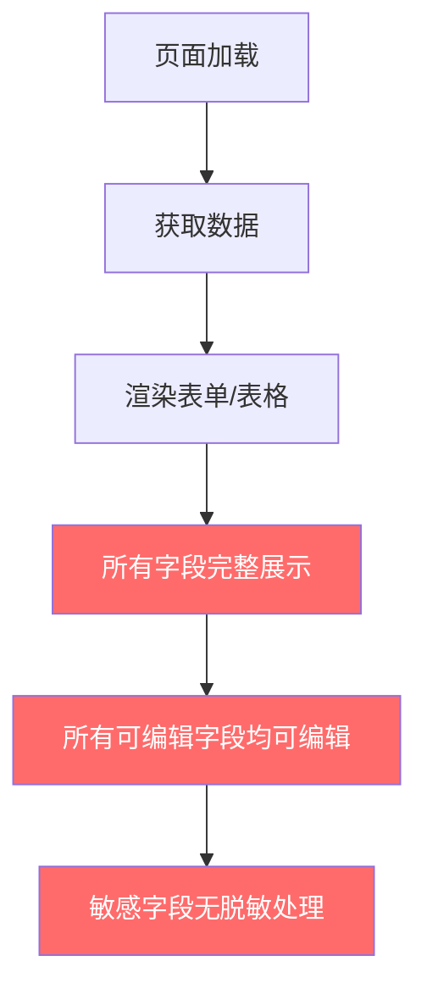
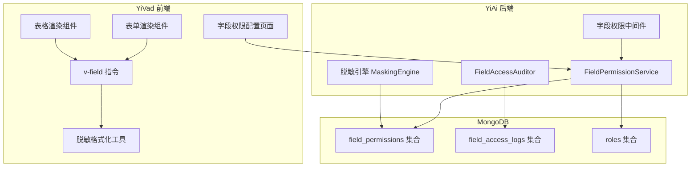
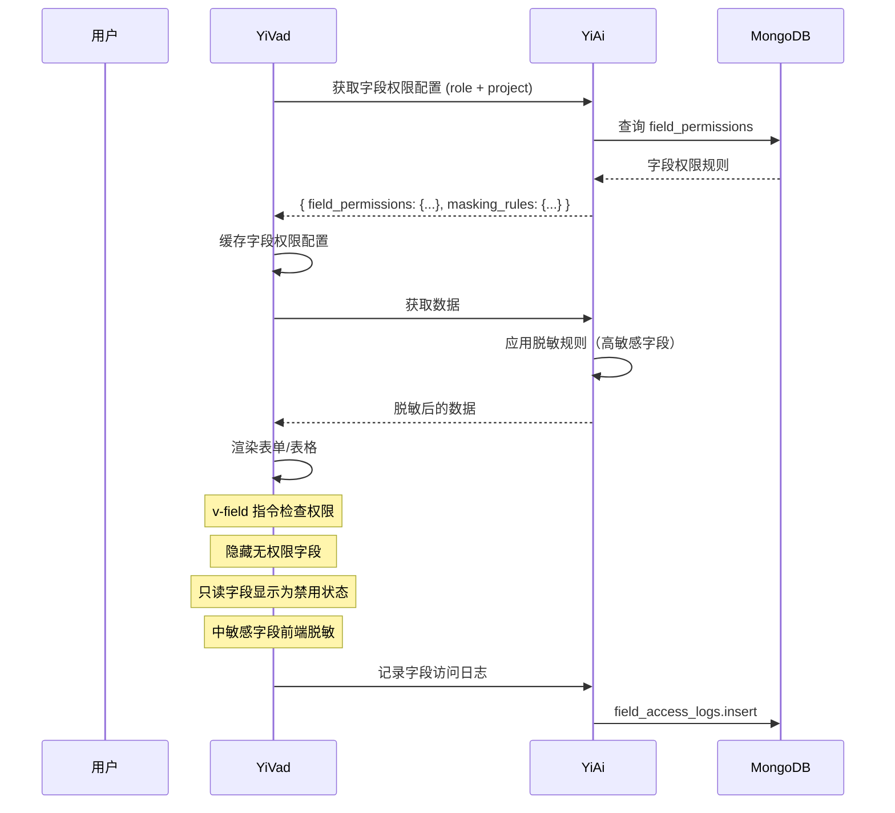

# YV-09-134: 字段级权限控制 — 按角色显隐字段、只读字段、数据脱敏、字段访问审计、项目级字段权限

> 需求编号：YV-09-134 · 优先级：P2 · 人天：0.3d · 状态：需求已编写
> 依赖：YV-09-02（基于角色的权限控制）、YV-09-106（用户角色与权限矩阵）

## 背景

### 问题陈述

YiVad 当前权限控制颗粒度为页面级（路由守卫）和按钮级（`v-auth` 指令），但缺少字段级权限控制。同一数据表单中，不同角色看到的字段集合和编辑权限应该不同，但当前所有角色看到完全相同的表单：

1. **敏感数据裸露**：财务字段（如成本、预算）对所有人可见，包括仅有查看权限的访客角色
2. **误操作风险**：普通成员可编辑仅管理员可修改的字段（如项目状态、优先级调整）
3. **数据泄露隐患**：个人身份信息（PII）如手机号、邮箱在列表和详情中完整展示
4. **无审计追踪**：无法知道谁在什么时候查看了哪个敏感字段
5. **项目差异无法覆盖**：不同项目对同一数据模型的字段权限需求不同，当前无项目级字段权限配置

**核心矛盾**：YiVad 已有页面级和按钮级权限，但数据表单中的字段权限是空白的。角色 A 和角色 B 打开同一个编辑表单，看到的字段应该不同，但当前完全相同。

### 影响范围

| # | 影响 | 严重程度 | 典型场景 |
|---|------|----------|----------|
| 1 | 敏感数据对无权限角色可见 | 高 | 访客角色在 Bug 详情中看到修复成本字段 |
| 2 | 普通成员可编辑管理级字段 | 高 | 开发者修改了项目预算金额 |
| 3 | PII 数据在列表中完整展示 | 高 | 用户手机号在成员列表中明文显示 |
| 4 | 无字段访问审计 | 中 | 无法追溯谁查看了敏感字段 |
| 5 | 不同项目权限需求不同 | 中 | 项目 A 需要隐藏成本字段，项目 B 需要展示 |

### 挑战

| 挑战 | 说明 |
|------|------|
| 字段权限矩阵设计 | 需要同时支持角色维度、项目维度、字段维度的三维权限矩阵 |
| 前端渲染性能 | 每个表单字段都需要权限检查，不能显著影响表单渲染性能 |
| 权限配置 UX | 字段权限配置界面需要直观易用，避免配置错误导致数据丢失 |
| 脱敏规则多样性 | 需要支持多种脱敏模式（部分隐藏、完全隐藏、显示为星号、显示为"无权限"） |
| 与现有权限系统集成 | 需要与页面级权限（路由守卫）和按钮级权限（v-auth）无缝协作 |

---

## 一、现状分析

### 1.1 当前权限控制粒度

```
YiVad 权限控制现状:
├── 页面级权限（路由守卫）
│   ├── 动态路由根据角色加载
│   └── 无权限页面返回 403
├── 按钮级权限（v-auth 指令）
│   ├── 控制按钮的显示/隐藏
│   └── 基于后端返回的权限树
├── 数据级权限
│   ├── data_service 按 user_id 过滤
│   └── 仅限数据查询范围
└── 字段级权限
    ├── 无字段显隐控制               # ❌ 不存在
    ├── 无只读字段控制               # ❌ 不存在
    ├── 无数据脱敏控制               # ❌ 不存在
    ├── 无字段访问审计               # ❌ 不存在
    └── 无项目级字段权限配置         # ❌ 不存在
```

### 1.2 当前字段渲染流程



### 1.3 根因分析矩阵

| 问题 | 根因 | 影响范围 | 解决优先级 |
|------|------|----------|------------|
| 敏感字段全员可见 | 无字段级显隐规则 | 所有包含敏感数据的表单 | P0 |
| 管理字段可被普通用户编辑 | 无只读字段控制 | 所有编辑表单 | P0 |
| PII 数据明文展示 | 无脱敏规则引擎 | 列表页、详情页 | P1 |
| 无法追溯字段访问 | 无字段级审计日志 | 审计合规 | P1 |
| 项目间权限无法差异化 | 无项目级字段权限配置 | 多项目场景 | P2 |

---

## 二、设计决策

### 2.1 方案对比：字段权限实现方式

| 方案 | 描述 | 优点 | 缺点 | 决策 |
|------|------|------|------|------|
| A: 前端指令 | 新增 `v-field` 指令，在模板中声明字段权限 | 实现简单，与 `v-auth` 风格一致 | 权限规则硬编码在模板中，修改需发版 | 不采用 |
| B: 后端返回字段元数据 | 后端在响应中附带 `field_permissions` 元数据 | 权限动态可配，无需发版 | 每次请求额外传输元数据，响应体积增大 | 不采用 |
| C: 前端配置 + 后端校验 | 前端加载字段权限配置（缓存），渲染时过滤；后端提交时二次校验 | 兼顾性能和安全，配置可热更新 | 需维护前后端两套权限逻辑一致性 | **采用** |

### 2.2 方案对比：脱敏规则存储

| 方案 | 描述 | 优点 | 缺点 | 决策 |
|------|------|------|------|------|
| A: 前端脱敏 | 前端根据规则对显示值进行脱敏处理 | 实现简单，不增加后端负载 | 原始数据已传输到前端，存在抓包泄露风险 | 不采用 |
| B: 后端脱敏 | 后端在返回数据前对敏感字段脱敏 | 数据不离开服务端，安全性高 | 增加后端处理开销，列表查询时脱敏影响性能 | 不采用 |
| C: 混合脱敏 | 敏感字段由后端脱敏后返回，前端对中敏感字段脱敏 | 平衡安全性和性能 | 需要明确定义哪些字段后端脱敏 | **采用** |

### 2.3 方案对比：字段权限配置存储位置

| 方案 | 描述 | 优点 | 缺点 | 决策 |
|------|------|------|------|------|
| A: 硬编码在代码中 | 字段权限规则写在常量文件中 | 简单，零配置 | 修改需发版，不支持项目级差异 | 不采用 |
| B: MongoDB 配置集合 | 字段权限配置存储在 `field_permissions` 集合 | 动态可配，支持项目级差异 | 需额外查询，缓存策略需设计 | **采用** |
| C: 嵌入角色定义 | 字段权限作为角色定义的一部分 | 与角色绑定紧密 | 角色定义膨胀，不支持项目级覆盖 | 不采用 |

---

## 三、目标架构

### 3.1 字段权限控制架构



### 3.2 字段渲染流程（目标）



### 3.3 数据模型

```
field_permissions 集合:
{
  _id: ObjectId,
  role_id: "role_admin",           // 角色 ID，* 表示默认规则
  project_id: "proj_001",          // 项目 ID，* 表示全局规则
  collection_name: "bugs",         // 数据集合/表单名称
  field_rules: [
    {
      field_name: "cost",
      visibility: "hidden",        // visible | hidden | readonly
      masking: "full_mask",        // none | partial | full_mask | custom
      masking_pattern: "***",      // 自定义脱敏模式
      editable: false,             // 是否可编辑
      condition: null              // 条件规则（如 owner_only: true）
    },
    {
      field_name: "priority",
      visibility: "readonly",
      masking: "none",
      editable: false,
      condition: null
    },
    {
      field_name: "phone",
      visibility: "visible",
      masking: "partial",
      masking_pattern: "138****1234",
      editable: true,
      condition: null
    }
  ],
  created_at: ISODate("2026-09-09"),
  updated_at: ISODate("2026-09-09")
}

field_access_logs 集合:
{
  _id: ObjectId,
  user_id: "user_001",
  username: "陈铭",
  role_id: "role_member",
  project_id: "proj_001",
  collection_name: "bugs",
  document_id: "bug_abc123",
  field_name: "cost",
  action: "view",                  // view | edit | mask_view
  timestamp: ISODate("2026-09-09T10:30:00Z"),
  ip_address: "192.168.1.100"
}
```

---

## 四、具体改动

### 4.1 YiAi 后端 — FieldPermissionService

```python
# services/auth/field_permission_service.py (新增)

class FieldPermissionService:
    """字段级权限管理服务"""

    def __init__(self):
        self.cache = TTLCache(maxsize=100, ttl=300)  # 5 分钟缓存

    async def get_field_permissions(self, role_id: str, project_id: str,
                                     collection_name: str) -> dict:
        """获取指定角色在指定项目中的字段权限"""
        cache_key = f"{role_id}:{project_id}:{collection_name}"
        if cache_key in self.cache:
            return self.cache[cache_key]

        # 优先级：项目级 > 全局级 > 默认
        rules = await self._load_rules(role_id, project_id, collection_name)
        self.cache[cache_key] = rules
        return rules

    async def _load_rules(self, role_id: str, project_id: str,
                          collection_name: str) -> dict:
        # 1. 先查项目级特定规则
        project_rule = await self.field_permissions.find_one({
            "role_id": role_id, "project_id": project_id,
            "collection_name": collection_name
        })
        if project_rule:
            return project_rule["field_rules"]

        # 2. 再查全局规则（project_id = "*"）
        global_rule = await self.field_permissions.find_one({
            "role_id": role_id, "project_id": "*",
            "collection_name": collection_name
        })
        if global_rule:
            return global_rule["field_rules"]

        # 3. 最后查默认规则（role_id = "*"）
        default_rule = await self.field_permissions.find_one({
            "role_id": "*", "project_id": "*",
            "collection_name": collection_name
        })
        return default_rule["field_rules"] if default_rule else {}

    async def set_field_rules(self, role_id: str, project_id: str,
                               collection_name: str, field_rules: list):
        """设置字段权限规则"""
        await self.field_permissions.update_one(
            {"role_id": role_id, "project_id": project_id,
             "collection_name": collection_name},
            {"$set": {"field_rules": field_rules, "updated_at": datetime.utcnow()}},
            upsert=True
        )
        self.cache.clear()  # 清除缓存

    async def apply_masking(self, data: dict, field_rules: list) -> dict:
        """对数据应用脱敏规则"""
        masked = data.copy()
        for rule in field_rules:
            field_name = rule["field_name"]
            if field_name in masked and rule.get("masking") != "none":
                masked[field_name] = self._mask_value(
                    masked[field_name], rule
                )
        return masked

    def _mask_value(self, value: str, rule: dict) -> str:
        if not value:
            return value
        mode = rule.get("masking", "full_mask")
        pattern = rule.get("masking_pattern")

        if mode == "full_mask":
            return "***"
        elif mode == "partial":
            if pattern:
                return pattern  # 使用预定义模式
            # 默认：保留首尾字符
            if len(value) <= 2:
                return "*" * len(value)
            return value[0] + "*" * (len(value) - 2) + value[-1]
        elif mode == "custom" and pattern:
            return self._apply_custom_mask(value, pattern)
        return value
```

### 4.2 YiAi 后端 — 脱敏引擎

```python
# services/auth/masking_engine.py (新增)

class MaskingEngine:
    """数据脱敏引擎"""

    PRESETS = {
        "phone": {"mode": "partial", "pattern": "{3}****{4}"},
        "email": {"mode": "partial", "pattern": "{2}***@{domain}"},
        "id_card": {"mode": "partial", "pattern": "{6}********{4}"},
        "bank_card": {"mode": "partial", "pattern": "{4}****{4}"},
        "salary": {"mode": "full_mask", "pattern": "***"},
        "address": {"mode": "partial", "pattern": "{province}***"},
    }

    @classmethod
    def mask(cls, value: str, field_type: str, mode: str = None) -> str:
        if not value:
            return value
        preset = cls.PRESETS.get(field_type)
        if not preset:
            return "***" if mode == "full_mask" else value
        return cls._apply_preset(value, preset)

    @classmethod
    def _apply_preset(cls, value: str, preset: dict) -> str:
        mode = preset["mode"]
        if mode == "full_mask":
            return "***"
        elif mode == "partial":
            # 简单实现，实际应解析 pattern 模板
            if len(value) <= 4:
                return value[0] + "*" * (len(value) - 1)
            half = len(value) // 2
            return value[:half-2] + "****" + value[half+2:]
        return value
```

### 4.3 YiAi 后端 — 字段权限中间件

```python
# middleware/field_permission.py (新增)

class FieldPermissionMiddleware:
    """字段权限中间件 — 在数据响应中注入字段权限元数据"""

    async def __call__(self, request: Request, call_next):
        response = await call_next(request)

        # 仅对数据查询接口注入字段权限
        if self._should_inject(request):
            user_role = getattr(request.state, "user_role", None)
            project_id = request.query_params.get("project_id", "*")
            collection = self._extract_collection(request)

            if user_role and collection:
                permissions = await self.field_permission_service \
                    .get_field_permissions(user_role, project_id, collection)
                response.headers["X-Field-Permissions"] = \
                    base64_encode(json.dumps(permissions))

        return response
```

### 4.4 YiVad 前端 — v-field 指令

```typescript
// src/directives/v-field.ts (新增)

import type { Directive } from 'vue';

interface FieldPermission {
  field_name: string;
  visibility: 'visible' | 'hidden' | 'readonly';
  masking: 'none' | 'partial' | 'full_mask' | 'custom';
  masking_pattern?: string;
  editable: boolean;
}

export const vField: Directive<HTMLElement, string> = {
  mounted(el, binding) {
    const fieldName = binding.value;
    const permissions = useFieldPermissionStore().getFieldPermissions(fieldName);

    if (!permissions) return;

    // 隐藏字段
    if (permissions.visibility === 'hidden') {
      el.style.display = 'none';
      return;
    }

    // 只读字段
    if (permissions.visibility === 'readonly' || !permissions.editable) {
      const input = el.querySelector('input, textarea, select') || el;
      if (input instanceof HTMLInputElement || input instanceof HTMLTextAreaElement) {
        input.setAttribute('readonly', 'readonly');
        input.classList.add('field-readonly');
      }
      if (input instanceof HTMLSelectElement) {
        input.setAttribute('disabled', 'disabled');
      }
    }

    // 脱敏字段
    if (permissions.masking !== 'none') {
      el.setAttribute('data-masking', permissions.masking);
      if (permissions.masking_pattern) {
        el.setAttribute('data-masking-pattern', permissions.masking_pattern);
      }
    }
  },

  updated(el, binding) {
    // 同 mounted 逻辑，处理动态字段
    vField.mounted?.(el, binding);
  }
};
```

### 4.5 YiVad 前端 — 字段权限配置页面

```typescript
// src/views/system/field-permission-config.vue (新增)

// <template>
//   <div class="field-permission-config">
//     <PageHeader title="字段权限配置" desc="按角色和项目配置字段的可见性和编辑权限">
//       <t-button @click="addRule">新增规则</t-button>
//     </PageHeader>
//
//     <!-- 筛选条件 -->
//     <t-row :gutter="16" class="filter-bar">
//       <t-col :span="4">
//         <t-select v-model="filterRole" placeholder="选择角色" clearable>
//           <t-option v-for="r in roles" :key="r.id" :value="r.id" :label="r.name" />
//         </t-select>
//       </t-col>
//       <t-col :span="4">
//         <t-select v-model="filterProject" placeholder="选择项目" clearable>
//           <t-option value="*" label="全局（所有项目）" />
//           <t-option v-for="p in projects" :key="p.id" :value="p.id" :label="p.name" />
//         </t-select>
//       </t-col>
//       <t-col :span="4">
//         <t-select v-model="filterCollection" placeholder="选择数据表单" clearable>
//           <t-option v-for="c in collections" :key="c" :value="c" :label="c" />
//         </t-select>
//       </t-col>
//     </t-row>
//
//     <!-- 字段权限矩阵 -->
//     <t-table :data="fieldRules" :columns="matrixColumns" row-key="field_name">
//       <template #visibility="{ row }">
//         <t-select v-model="row.visibility" size="small">
//           <t-option value="visible" label="可见" />
//           <t-option value="hidden" label="隐藏" />
//           <t-option value="readonly" label="只读" />
//         </t-select>
//       </template>
//       <template #masking="{ row }">
//         <t-select v-model="row.masking" size="small">
//           <t-option value="none" label="不脱敏" />
//           <t-option value="partial" label="部分脱敏" />
//           <t-option value="full_mask" label="完全隐藏" />
//         </t-select>
//       </template>
//       <template #editable="{ row }">
//         <t-switch v-model="row.editable" size="small"
//           :disabled="row.visibility === 'hidden'" />
//       </template>
//     </t-table>
//
//     <t-button theme="primary" @click="saveRules">保存配置</t-button>
//   </div>
// </template>
```

### 4.6 YiVad 前端 — useFieldPermission Composable

```typescript
// src/composables/useFieldPermission.ts (新增)

export function useFieldPermission(collectionName: string) {
  const store = useFieldPermissionStore();
  const userStore = useUserStore();
  const route = useRoute();

  const projectId = computed(() => route.params.projectId as string || '*');
  const fieldRules = ref<FieldPermission[]>([]);

  // 加载字段权限配置
  const loadPermissions = async () => {
    fieldRules.value = await store.loadFieldPermissions(
      userStore.currentRole,
      projectId.value,
      collectionName
    );
  };

  // 判断字段是否可见
  const isFieldVisible = (fieldName: string): boolean => {
    const rule = fieldRules.value.find(r => r.field_name === fieldName);
    return !rule || rule.visibility !== 'hidden';
  };

  // 判断字段是否只读
  const isFieldReadonly = (fieldName: string): boolean => {
    const rule = fieldRules.value.find(r => r.field_name === fieldName);
    return rule?.visibility === 'readonly' || rule?.editable === false;
  };

  // 获取字段脱敏配置
  const getMaskingConfig = (fieldName: string) => {
    const rule = fieldRules.value.find(r => r.field_name === fieldName);
    return rule?.masking !== 'none' ? rule : null;
  };

  // 过滤表单字段（仅保留可见字段）
  const filterFormFields = (fields: FormField[]): FormField[] => {
    return fields.filter(f => isFieldVisible(f.name)).map(f => ({
      ...f,
      readonly: isFieldReadonly(f.name) || f.readonly,
      masking: getMaskingConfig(f.name),
    }));
  };

  onMounted(() => loadPermissions());

  return {
    fieldRules,
    isFieldVisible,
    isFieldReadonly,
    getMaskingConfig,
    filterFormFields,
    loadPermissions,
  };
}
```

### 4.7 文件变更清单

| 文件 | 操作 | 说明 |
|------|------|------|
| `YiAi/services/auth/field_permission_service.py` | 新增 | 字段权限管理服务 |
| `YiAi/services/auth/masking_engine.py` | 新增 | 数据脱敏引擎 |
| `YiAi/middleware/field_permission.py` | 新增 | 字段权限中间件 |
| `YiAi/services/auth/field_access_auditor.py` | 新增 | 字段访问审计服务 |
| `YiVad/src/directives/v-field.ts` | 新增 | v-field 指令 |
| `YiVad/src/composables/useFieldPermission.ts` | 新增 | 字段权限 Composable |
| `YiVad/src/stores/fieldPermission.ts` | 新增 | 字段权限 Pinia store |
| `YiVad/src/views/system/field-permission-config.vue` | 新增 | 字段权限配置页面 |
| `YiVad/src/views/system/components/field-audit-log.vue` | 新增 | 字段访问审计日志组件 |
| `YiVad/src/router/modules/system.ts` | 修改 | 添加字段权限配置路由 |
| `YiAi/tests/test_field_permission.py` | 新增 | 字段权限服务测试 |
| `YiVad/tests/unit/v-field.test.ts` | 新增 | v-field 指令测试 |

---

## 五、实施步骤

| 步骤 | 操作 | 路径 | 验证 | 人天 |
|------|------|------|------|------|
| 1 | 实现 YiAi FieldPermissionService（CRUD + 缓存） | `YiAi/services/auth/field_permission_service.py` | 创建、查询、更新、删除字段权限规则正常 | 0.05 |
| 2 | 实现脱敏引擎 MaskingEngine | `YiAi/services/auth/masking_engine.py` | 手机号、邮箱、身份证脱敏正确 | 0.03 |
| 3 | 实现字段权限中间件 + 审计服务 | `YiAi/middleware/field_permission.py` + `field_access_auditor.py` | 数据响应携带字段权限元数据，字段访问日志记录 | 0.04 |
| 4 | 实现 YiVad v-field 指令 | `YiVad/src/directives/v-field.ts` | 隐藏字段 display:none，只读字段 disabled，脱敏字段标记 | 0.04 |
| 5 | 实现 useFieldPermission Composable + Store | `YiVad/src/composables/useFieldPermission.ts` + `stores/fieldPermission.ts` | 权限加载、缓存、字段过滤方法正确 | 0.04 |
| 6 | 实现字段权限配置页面 | `YiVad/src/views/system/field-permission-config.vue` | 按角色/项目/表单配置字段权限，矩阵式编辑 | 0.06 |
| 7 | 路由注册 + 集成测试 | `YiVad/src/router/` + 测试文件 | 配置页面可访问，端到端验证字段权限生效 | 0.04 |

**总人天：0.3d**

---

## 六、测试规格

### 场景 1：管理员配置字段权限规则

**GIVEN** 管理员登录，访问字段权限配置页面
**WHEN** 管理员选择角色"普通成员"、项目"项目 A"、表单"bugs"，设置 cost 字段 visibility=hidden
**THEN** 规则保存成功
**AND** 再次加载该角色 + 项目 + 表单的权限配置时，cost 字段显示为 hidden

### 场景 2：普通成员查看 Bug 表单时敏感字段被隐藏

**GIVEN** 管理员已配置 cost 字段对普通成员隐藏
**WHEN** 普通成员打开项目 A 的 Bug 编辑表单
**THEN** cost 字段不显示（display: none）
**AND** 表单其他字段正常显示
**AND** 提交时 cost 字段值不会被修改（使用原始值）

### 场景 3：只读字段无法编辑

**GIVEN** 管理员已配置 priority 字段对普通成员为 readonly
**WHEN** 普通成员打开 Bug 编辑表单
**THEN** priority 字段显示但输入框为 disabled 状态
**AND** 输入框有 visual indicator（灰色背景、锁图标）

### 场景 4：手机号脱敏展示

**GIVEN** 管理员配置 phone 字段 masking=partial, masking_pattern="138****1234"
**WHEN** 任何角色在成员列表中查看
**THEN** 手机号显示为 "138****1234"
**AND** 详情页同样脱敏显示
**AND** 仅管理员角色可看到完整手机号

### 场景 5：项目级字段权限覆盖全局规则

**GIVEN** 全局规则中 cost 对普通成员 hidden，但项目 B 中 cost 对普通成员 visible
**WHEN** 普通成员在项目 B 中查看 Bug 表单
**THEN** cost 字段可见（项目级规则优先）
**AND** 在项目 A 中 cost 字段仍隐藏

### 场景 6：字段访问审计日志

**GIVEN** 用户查看了一个包含脱敏字段 phone 的成员详情
**WHEN** 管理员查看字段访问审计日志
**THEN** 日志显示用户 ID、字段名 phone、操作类型 mask_view、时间戳
**AND** 可筛选按用户、字段、时间段查看

---

## 七、风险与缓解

| 风险 | 概率 | 影响 | 缓解措施 |
|------|------|------|----------|
| 字段权限配置错误导致关键字段全员隐藏 | 中 | 高 | 配置变更需二次确认；提供"预览"模式查看指定角色的表单效果；保留默认规则回退 |
| 权限检查影响表单渲染性能 | 高 | 中 | 权限配置预加载并缓存（5 分钟 TTL）；v-field 指令使用 requestAnimationFrame 批量处理 |
| 前后端权限规则不一致 | 中 | 高 | 后端提交时强制校验字段权限；前端仅做 UI 隐藏，后端做数据保护 |
| 脱敏后数据无法用于搜索 | 低 | 中 | 脱敏仅影响展示层，搜索和过滤使用原始数据（后端查询） |
| 字段权限配置页面复杂度高 | 中 | 低 | 提供预设模板（只读成员、无权限访客、完全权限管理员）；支持批量复制规则 |

---

## 八、回滚策略

| 场景 | 回滚操作 | 影响 |
|------|----------|------|
| 字段权限配置错误导致大面积功能不可用 | 删除错误的 field_permissions 记录，恢复默认规则（role_id="*"） | 所有字段恢复为全员可见可编辑 |
| v-field 指令导致表单渲染异常 | 移除 v-field 指令注册，表单恢复原始渲染 | 失去字段级权限控制，所有字段可见 |
| 脱敏引擎性能问题 | 关闭后端脱敏，仅保留前端脱敏（降级） | 高敏感数据不脱敏返回前端，安全性降低 |
| 审计日志写入导致数据库压力 | 降级为采样写入（仅记录 10%），或暂停审计日志 | 失去字段访问审计能力 |

---

## 九、设计决策记录

### D-01：为什么选择前端指令 + 后端校验的双重保障？

前端指令提供即时 UI 反馈（隐藏/只读/脱敏），后端校验确保即使前端被绕过（如直接 API 调用），敏感数据也不会被修改或泄露。双重保障是安全基线。

### D-02：为什么脱敏分前后端两层？

高敏感数据（PII、财务数据）必须由后端脱敏，原始数据不离开服务端。中敏感数据（如内部备注）由前端脱敏，减少后端处理开销。分级脱敏在安全性和性能之间取得平衡。

### D-03：为什么字段权限配置采用项目级覆盖全局的设计？

不同项目对同一数据模型的安全需求不同。例如，开源项目的 Bug 成本字段可公开，但内部项目的 Bug 成本字段需对访客隐藏。项目级覆盖全局的优先级设计（项目 > 全局 > 默认）满足差异化需求。

### D-04：为什么使用独立的 field_access_logs 集合而非复用现有审计日志？

字段访问日志的量级远大于操作审计日志。每个用户每打开一个表单可能触发 10+ 条字段访问记录。独立集合可设置更短的 TTL（7 天），避免影响主审计日志的查询性能。

---

## 十、可观测性

### 指标

| 指标 | 类型 | 说明 |
|------|------|------|
| `yivad.field_permission.cache_hit_rate` | Gauge | 字段权限缓存命中率 |
| `yivad.field_permission.rules_count` | Gauge | 字段权限规则总数 |
| `yivad.masking.field_count` | Counter | 脱敏字段处理次数 |
| `yivad.field_access.view_count` | Counter | 字段访问次数（按字段名） |
| `yivad.field_permission.load_latency` | Histogram | 字段权限配置加载延迟 |
| `yivad.field_permission.config_change_count` | Counter | 字段权限配置变更次数 |

### 告警

| 告警 | 条件 | 级别 |
|------|------|------|
| 字段权限缓存命中率过低 | 命中率 < 80% | WARNING |
| 字段权限配置频繁变更 | 5 分钟内 > 10 次变更 | WARNING |
| 脱敏字段处理异常 | 脱敏失败 > 5% | ERROR |
| 审计日志写入失败率过高 | 失败/总写入 > 5% | WARNING |

---

## 十一、代码审查检查清单

- [ ] FieldPermissionService 支持按角色/项目/表单三级查询
- [ ] 权限优先级：项目级 > 全局级 > 默认规则
- [ ] 权限配置缓存 5 分钟，配置变更后清除缓存
- [ ] 脱敏引擎支持 full_mask、partial、custom 三种模式
- [ ] 后端在数据响应中注入字段权限元数据
- [ ] 后端在数据提交时校验字段可编辑性
- [ ] v-field 指令处理 hidden、readonly、masking 三种状态
- [ ] 只读字段有视觉标识（灰色背景、禁用状态、锁图标）
- [ ] 脱敏字段有视觉标识（点状边框、脱敏图标）
- [ ] 字段权限配置页面支持矩阵式编辑
- [ ] 字段权限配置变更记录操作人 + 时间
- [ ] 字段访问日志记录 user_id、字段名、操作类型、时间戳
- [ ] field_access_logs 有 TTL 索引（7 天）
- [ ] 单元测试覆盖权限加载、优先级、脱敏规则、v-field 指令

---

## 回归问题预测

| # | 预测问题 | 原因 | 验证方法 |
|---|---------|------|---------|
| 1 | 配置 hidden 的字段在表单提交时，前端可能发送 undefined 值覆盖后端原有数据 | 表单组件在 v-model 绑定隐藏字段时，值可能变为 undefined，提交时覆盖数据库中的真实值 | 设置 cost 字段 hidden → 打开 Bug 编辑表单 → 修改其他字段 → 提交 → 验证 cost 字段值未被改变 |
| 2 | 字段权限配置加载失败时，前端可能将所有字段隐藏，导致表单完全空白 | 加载权限配置的网络请求失败或超时，useFieldPermission 返回空规则，v-field 指令将所有字段隐藏 | 模拟网络断开 → 打开表单 → 验证降级行为：显示所有字段并提示"权限配置加载失败，使用默认权限" |
| 3 | v-field 指令在动态表格列中不生效，因为表格列渲染在指令 mounted 之后 | TDesign Table 组件的列是动态渲染的，v-field 指令 mounted 时目标 DOM 尚未生成 | 配置 phone 字段脱敏 → 在表格中查看成员列表 → 验证 phone 列正确脱敏（使用 v-field 或改用列模板方式） |
| 4 | 项目级权限覆盖全局后，切换项目时权限规则未刷新，仍显示旧项目的权限配置 | useFieldPermission 在 mounted 时加载一次，切换项目时 projectId 变化但未触发重新加载 | 在项目 A 查看 Bug 表单（cost 隐藏） → 切换到项目 B（cost 应可见） → 验证 cost 字段正确显示 |
| 5 | 脱敏后的字段在导出功能中仍是脱敏状态，导致导出数据不可用 | 导出功能复用数据查询接口，后端已对敏感字段脱敏，导出文件中的手机号显示为 "138****1234" | 配置 phone 脱敏 → 导出成员列表 → 验证导出前提示"敏感字段已脱敏"，或提供"管理员导出原始数据"选项 |
| 6 | 只读字段的 disabled 样式与正常禁用字段混淆，用户无法区分"权限只读"和"业务逻辑只读" | 两种只读都使用相同的 disabled 样式（灰色背景），用户误以为数据有问题 | 查看只读字段 → 验证权限只读字段有锁图标 + tooltip "此字段您无编辑权限"，业务逻辑只读字段仅有灰色背景 |

---

## 性能分析

### 关键操作耗时

| 操作 | 耗时 | 说明 |
|------|------|------|
| 字段权限配置加载（缓存命中） | < 5ms | 内存 TTLCache 读取 |
| 字段权限配置加载（缓存未命中） | < 20ms | MongoDB 索引查询（role_id + project_id + collection_name） |
| v-field 指令处理（单字段） | < 1ms | 纯 DOM 操作 |
| 脱敏处理（单字段） | < 1ms | 字符串替换 |
| 字段权限配置保存 | < 30ms | MongoDB upsert + 缓存清除 |
| 字段访问日志写入（异步） | < 5ms | 异步写入，不阻塞请求 |

### 数据量预估（100 用户规模）

| 集合 | 日均增量 | 保留策略 | 稳态大小 |
|------|----------|----------|----------|
| field_permissions | < 10 条 | 永久保留 | ~200 条（5 角色 x 10 表单 x 4 项目） |
| field_access_logs | ~50,000 条 | TTL 7 天 | ~350,000 条，~100MB |

---

## 相关文档

- [基于角色的权限控制](../../2026-08/02-需求-基于角色的权限控制.md) — 页面级和按钮级权限
- [用户角色与权限矩阵](../106-需求-用户角色与权限矩阵.md) — 角色定义和权限矩阵
- [活动日志与审计追踪](../50-需求-活动日志与审计追踪.md) — 现有审计日志系统
- [数据导出系统](../30-需求-数据导出系统.md) — 导出时的脱敏处理

*PRD 来源: `projects/yivad/requirements/2026-09/134-需求-字段级权限控制.md`*

