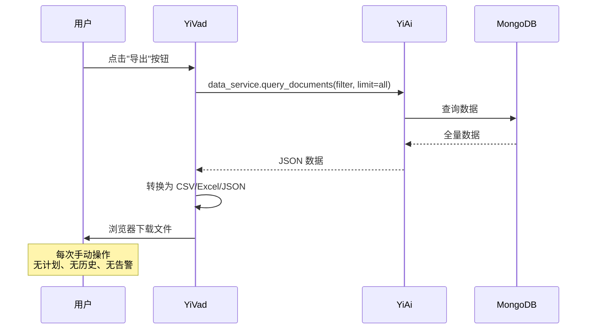
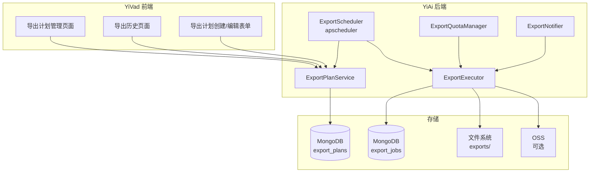
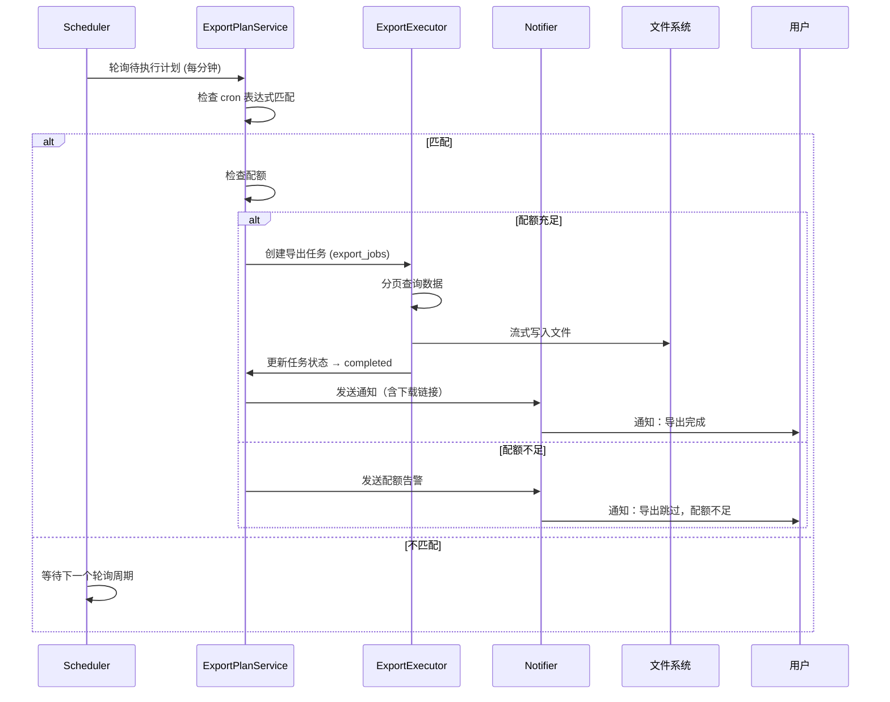

# YV-09-135: 数据导出计划 — 定时导出配置、周期导出任务、导出格式/筛选/目标、导出历史、导出失败告警、导出配额管理

> 需求编号：YV-09-135 · 优先级：P2 · 人天：0.3d · 状态：需求已编写
> 依赖：YV-09-30（数据导出系统）、YV-09-27（通知中心）

## 背景

### 问题陈述

YiVad 已有手动数据导出功能（YV-09-30），但缺少定时自动导出能力。团队需要定期导出项目数据用于周报、月报、审计归档等场景，当前每次都需要手动操作，效率低下且容易遗漏：

1. **重复劳动**：每周一项目经理需要手动导出上周的 Bug 数据生成周报，每次操作 5 分钟，一年浪费 4 小时
2. **容易遗漏**：月度审计数据导出依赖于人工记忆，遗漏后审计合规受影响
3. **无失败通知**：手动导出失败时用户可能不知道，直到需要数据时才发现导出文件为空
4. **无配额管控**：无限制的导出消耗服务器资源，大文件导出可能影响其他用户
5. **无历史追溯**：无法查看"上周的导出是什么时候执行的、结果如何"

**核心矛盾**：手动导出已满足临时需求，但周期性重复导出场景完全没有覆盖。用户需要"配置一次、自动执行"的导出计划能力。

### 影响范围

| # | 影响 | 严重程度 | 典型场景 |
|---|------|----------|----------|
| 1 | 周报/月报数据需手动导出 | 高 | 项目经理每周一上午手动导出一周 Bug 数据 |
| 2 | 审计归档遗漏 | 高 | 财务审计要求月度数据但三个月后才发现缺了两个月 |
| 3 | 导出失败无感知 | 中 | 定时导出因数据量大超时失败，无人知晓 |
| 4 | 大文件导出影响系统 | 中 | 导出 10 万条数据导致 API 响应变慢 |
| 5 | 无法追踪导出历史 | 低 | 想确认"上月的报告发给谁了"但无记录 |

### 挑战

| 挑战 | 说明 |
|------|------|
| 定时调度可靠性 | 需要可靠的定时调度机制，避免单点故障导致任务丢失 |
| 大文件导出性能 | 大量数据导出不能阻塞请求线程，需要异步执行 |
| 导出目标多样性 | 需要支持多种导出目标（下载、邮件、Webhook、OSS） |
| 失败重试与告警 | 导出失败后需要自动重试并通知相关人员 |
| 配额管理与限流 | 控制每个用户/项目的导出频率和数据量 |

---

## 一、现状分析

### 1.1 当前导出能力

```
YiVad 数据导出现状:
├── 手动导出（YV-09-30）
│   ├── 在当前页面点击"导出"按钮
│   ├── 选择格式（CSV / Excel / JSON）
│   ├── 应用当前筛选条件
│   └── 浏览器下载文件
├── 定时导出
│   ├── 无导出计划配置               # ❌ 不存在
│   ├── 无周期执行                   # ❌ 不存在
│   ├── 无导出历史记录               # ❌ 不存在
│   ├── 无失败告警                   # ❌ 不存在
│   └── 无配额管理                   # ❌ 不存在
└── 导出目标
    ├── 仅支持浏览器下载              # ❌ 无邮件/Webhook/OSS
    └── 不支持自动分发               # ❌ 不存在
```

### 1.2 当前导出流程



### 1.3 根因分析矩阵

| 问题 | 根因 | 影响范围 | 解决优先级 |
|------|------|----------|------------|
| 重复手动导出 | 无定时调度机制 | 周报/月报场景 | P0 |
| 导出遗漏 | 无计划管理，依赖人脑 | 审计合规场景 | P0 |
| 失败无通知 | 无导出任务状态追踪 | 所有定时导出场景 | P1 |
| 资源滥用 | 无配额限制 | 大表导出场景 | P1 |
| 历史不可查 | 无导出执行记录 | 审计追溯场景 | P2 |

---

## 二、设计决策

### 2.1 方案对比：定时调度实现方式

| 方案 | 描述 | 优点 | 缺点 | 决策 |
|------|------|------|------|------|
| A: apscheduler 进程内调度 | 在 YiAi 进程内使用 apscheduler 定时执行导出 | 零外部依赖，实现简单 | 进程重启丢失任务状态；多进程部署时重复执行 | 不采用 |
| B: Celery + Redis | 使用 Celery 分布式任务队列 + Redis 作为 broker | 分布式支持好，任务可靠性高 | 引入 Redis 依赖，运维复杂度增加 | 不采用 |
| C: MongoDB 任务队列 + apscheduler | 导出计划存储在 MongoDB，apscheduler 轮询待执行任务 | 复用现有 MongoDB；任务状态持久化；支持故障恢复 | 轮询间隔有调度精度损失（最低 1 分钟） | **采用** |

### 2.2 方案对比：导出目标

| 方案 | 描述 | 优点 | 缺点 | 决策 |
|------|------|------|------|------|
| A: 仅浏览器下载 | 定时导出生成文件后通知用户去下载 | 实现简单，复用现有下载逻辑 | 用户必须在线才能获取文件 | 不采用 |
| B: 邮件附件 | 导出文件作为邮件附件发送 | 用户无需在线，符合周报/月报场景 | 大文件附件有邮件服务器限制 | 不采用 |
| C: 多目标支持 | 支持下载链接（3 天有效）、邮件附件（< 10MB）、Webhook 推送、OSS 存储 | 灵活适配各种场景 | 实现复杂度略高 | **采用** |

### 2.3 方案对比：大文件导出策略

| 方案 | 描述 | 优点 | 缺点 | 决策 |
|------|------|------|------|------|
| A: 同步导出 | 一次性查询所有数据，内存中转 | 简单 | 大表 OOM，阻塞请求线程 | 不采用 |
| B: 分页导出 + 流式写入 | 分页查询 MongoDB，流式写入文件 | 内存占用恒定 | 导出时间与数据量成正比 | **采用** |
| C: MongoDB 原生导出 | 使用 mongoexport 命令行 | 速度快 | 无法应用业务过滤逻辑 | 不采用 |

---

## 三、目标架构

### 3.1 导出计划系统架构



### 3.2 定时导出生命周期



### 3.3 数据模型

```
export_plans 集合:
{
  _id: ObjectId,
  plan_id: "plan_abc123",
  name: "周报 Bug 数据导出",
  description: "每周一 08:00 导出上周所有项目的 Bug 数据",
  owner_id: "user_001",
  owner_name: "陈铭",
  collection_name: "bugs",
  filter: {
    created_at: { $gte: "last_week_start", $lte: "last_week_end" },
    status: { $in: ["open", "in_progress", "resolved"] }
  },
  fields: ["title", "severity", "status", "assignee", "created_at"],
  format: "excel",                    // csv | excel | json
  schedule: {
    type: "weekly",                   // once | hourly | daily | weekly | monthly
    cron: "0 8 * * 1",               // 每周一 08:00
    timezone: "Asia/Shanghai"
  },
  destination: {
    type: "download_link",            // download_link | email | webhook | oss
    config: {
      recipients: ["chenming@example.com"],
      link_expire_hours: 72,
      webhook_url: null,
      oss_path: null
    }
  },
  quota: {
    max_rows: 50000,
    max_file_size_mb: 50
  },
  retry: {
    max_retries: 3,
    retry_delay_minutes: 5
  },
  status: "active",                   // active | paused | deleted
  last_run_at: ISODate("2026-09-02T08:00:00Z"),
  next_run_at: ISODate("2026-09-09T08:00:00Z"),
  created_at: ISODate("2026-09-01"),
  updated_at: ISODate("2026-09-01")
}

export_jobs 集合:
{
  _id: ObjectId,
  job_id: "job_xyz789",
  plan_id: "plan_abc123",
  plan_name: "周报 Bug 数据导出",
  status: "completed",                // pending | running | completed | failed | cancelled
  started_at: ISODate("2026-09-09T08:00:01Z"),
  completed_at: ISODate("2026-09-09T08:02:30Z"),
  duration_seconds: 149,
  row_count: 1523,
  file_size_bytes: 245760,
  file_path: "exports/plan_abc123/job_xyz789.xlsx",
  download_url: "/api/exports/download/job_xyz789",
  error_message: null,
  retry_count: 0,
  notified: true
}
```

---

## 四、具体改动

### 4.1 YiAi 后端 — ExportPlanService

```python
# services/data/export_plan_service.py (新增)

class ExportPlanService:
    """导出计划管理服务"""

    async def create_plan(self, plan_data: dict) -> dict:
        """创建导出计划"""
        plan = {
            "plan_id": f"plan_{uuid4().hex[:12]}",
            **plan_data,
            "status": "active",
            "next_run_at": self._calculate_next_run(plan_data["schedule"]),
            "created_at": datetime.utcnow(),
            "updated_at": datetime.utcnow(),
        }
        await self.export_plans.insert_one(plan)
        return plan

    async def list_plans(self, owner_id: str = None) -> list:
        """列出导出计划"""
        query = {}
        if owner_id:
            query["owner_id"] = owner_id
        cursor = self.export_plans.find(query).sort("created_at", -1)
        return await cursor.to_list(length=100)

    async def update_plan(self, plan_id: str, updates: dict):
        """更新导出计划"""
        updates["updated_at"] = datetime.utcnow()
        if "schedule" in updates:
            updates["next_run_at"] = self._calculate_next_run(updates["schedule"])
        await self.export_plans.update_one(
            {"plan_id": plan_id}, {"$set": updates}
        )

    async def pause_plan(self, plan_id: str):
        """暂停导出计划"""
        await self.export_plans.update_one(
            {"plan_id": plan_id},
            {"$set": {"status": "paused", "updated_at": datetime.utcnow()}}
        )

    async def get_due_plans(self) -> list:
        """获取到期的导出计划（供调度器调用）"""
        now = datetime.utcnow()
        cursor = self.export_plans.find({
            "status": "active",
            "next_run_at": {"$lte": now}
        })
        return await cursor.to_list(length=100)

    def _calculate_next_run(self, schedule: dict) -> datetime:
        """根据 cron 表达式计算下次执行时间"""
        cron = schedule["cron"]
        tz = schedule.get("timezone", "UTC")
        cron_iter = croniter(cron, datetime.now(pytz.timezone(tz)))
        return cron_iter.get_next(datetime)
```

### 4.2 YiAi 后端 — ExportScheduler + ExportExecutor

```python
# services/data/export_scheduler.py (新增)

class ExportScheduler:
    """导出调度器 — 基于 apscheduler 每分钟轮询"""

    def __init__(self):
        self.scheduler = AsyncIOScheduler()
        self.scheduler.add_job(
            self.check_and_execute,
            'interval',
            minutes=1,
            id='export_scheduler'
        )

    async def check_and_execute(self):
        """检查并执行到期导出计划"""
        plans = await self.export_plan_service.get_due_plans()
        for plan in plans:
            # 检查配额
            if not await self.quota_manager.check_quota(plan):
                await self.notifier.notify_quota_exceeded(plan)
                continue

            # 创建异步任务
            asyncio.create_task(self.executor.execute(plan))

    def start(self):
        self.scheduler.start()
```

```python
# services/data/export_executor.py (新增)

class ExportExecutor:
    """导出执行器 — 分页查询 + 流式写入"""

    async def execute(self, plan: dict):
        job = await self._create_job(plan)
        try:
            await self._update_job(job["job_id"], status="running")

            # 分页查询 + 流式写入
            file_path = self._get_file_path(plan, job)
            writer = self._get_writer(plan["format"], file_path)

            page = 0
            page_size = 1000
            total_rows = 0

            while True:
                data = await self._query_page(plan, page, page_size)
                if not data:
                    break
                writer.write_rows(data)
                total_rows += len(data)
                page += 1

                if total_rows >= plan["quota"]["max_rows"]:
                    break

            writer.close()

            # 更新任务状态
            file_size = os.path.getsize(file_path)
            await self._update_job(job["job_id"],
                status="completed",
                row_count=total_rows,
                file_size_bytes=file_size,
                file_path=file_path,
                completed_at=datetime.utcnow()
            )

            # 创建下载链接 + 发送通知
            download_url = await self._generate_download_url(job["job_id"])
            await self.notifier.notify_completed(plan, job, download_url)

            # 更新计划的下次执行时间
            next_run = self.plan_service._calculate_next_run(plan["schedule"])
            await self.export_plans.update_one(
                {"plan_id": plan["plan_id"]},
                {"$set": {"last_run_at": datetime.utcnow(), "next_run_at": next_run}}
            )

        except Exception as e:
            await self._handle_failure(plan, job, e)
```

### 4.3 YiVad 前端 — 导出计划管理页面

```typescript
// src/views/data/export-plans.vue (新增)

// <template>
//   <div class="export-plans">
//     <PageHeader title="导出计划" desc="管理定时数据导出计划">
//       <t-button @click="createPlan">新建导出计划</t-button>
//     </PageHeader>
//
//     <!-- 导出计划列表 -->
//     <t-table :data="plans" :columns="planColumns" row-key="plan_id">
//       <template #name="{ row }">
//         <div class="plan-name">
//           <span>{{ row.name }}</span>
//           <t-tag v-if="row.status === 'paused'" theme="warning">已暂停</t-tag>
//         </div>
//       </template>
//       <template #schedule="{ row }">
//         <div>
//           <t-tag>{{ scheduleLabel(row.schedule.type) }}</t-tag>
//           <span class="cron-text">{{ row.schedule.cron }}</span>
//         </div>
//       </template>
//       <template #last_run="{ row }">
//         {{ row.last_run_at ? formatDateTime(row.last_run_at) : '尚未执行' }}
//       </template>
//       <template #next_run="{ row }">
//         {{ row.next_run_at ? formatDateTime(row.next_run_at) : '—' }}
//       </template>
//       <template #actions="{ row }">
//         <t-space>
//           <t-button size="small" variant="text" @click="executeNow(row)">
//             立即执行
//           </t-button>
//           <t-button size="small" variant="text" @click="editPlan(row)">
//             编辑
//           </t-button>
//           <t-button v-if="row.status === 'active'" size="small"
//             variant="text" theme="warning" @click="pausePlan(row)">
//             暂停
//           </t-button>
//           <t-button v-else size="small" variant="text"
//             theme="success" @click="resumePlan(row)">
//             恢复
//           </t-button>
//           <t-popconfirm content="确定删除？" @confirm="deletePlan(row)">
//             <t-button size="small" variant="text" theme="danger">删除</t-button>
//           </t-popconfirm>
//         </t-space>
//       </template>
//     </t-table>
//   </div>
// </template>
```

### 4.4 YiVad 前端 — 导出计划创建表单

```typescript
// src/views/data/components/export-plan-form.vue (新增)

// <template>
//   <t-dialog v-model:visible="visible" header="创建导出计划" width="640px">
//     <t-form :data="form" label-width="100px">
//       <t-form-item label="计划名称" name="name">
//         <t-input v-model="form.name" placeholder="如：周报 Bug 数据导出" />
//       </t-form-item>
//       <t-form-item label="数据源" name="collection_name">
//         <t-select v-model="form.collection_name">
//           <t-option value="bugs" label="Bug" />
//           <t-option value="sessions" label="会话" />
//           <t-option value="projects" label="项目" />
//         </t-select>
//       </t-form-item>
//       <t-form-item label="筛选条件" name="filter">
//         <FilterBuilder v-model="form.filter" :collection="form.collection_name" />
//       </t-form-item>
//       <t-form-item label="导出字段" name="fields">
//         <t-select v-model="form.fields" multiple placeholder="默认全部字段">
//           <t-option v-for="f in availableFields" :key="f" :value="f" :label="f" />
//         </t-select>
//       </t-form-item>
//       <t-form-item label="导出格式" name="format">
//         <t-radio-group v-model="form.format">
//           <t-radio value="csv">CSV</t-radio>
//           <t-radio value="excel">Excel</t-radio>
//           <t-radio value="json">JSON</t-radio>
//         </t-radio-group>
//       </t-form-item>
//       <t-form-item label="执行频率" name="schedule">
//         <CronInput v-model="form.schedule" />
//       </t-form-item>
//       <t-form-item label="导出目标" name="destination">
//         <t-radio-group v-model="form.destination.type">
//           <t-radio value="download_link">下载链接</t-radio>
//           <t-radio value="email">邮件附件</t-radio>
//         </t-radio-group>
//         <t-input v-if="form.destination.type === 'email'"
//           v-model="form.destination.config.recipients"
//           placeholder="收件人邮箱，多个用逗号分隔" />
//       </t-form-item>
//       <t-form-item label="配额限制" name="quota">
//         <t-input-number v-model="form.quota.max_rows" :min="100" :max="100000"
//           suffix="行" />
//       </t-form-item>
//     </t-form>
//     <template #footer>
//       <t-button @click="visible = false">取消</t-button>
//       <t-button theme="primary" @click="submit">创建</t-button>
//     </template>
//   </t-dialog>
// </template>
```

### 4.5 文件变更清单

| 文件 | 操作 | 说明 |
|------|------|------|
| `YiAi/services/data/export_plan_service.py` | 新增 | 导出计划 CRUD 服务 |
| `YiAi/services/data/export_scheduler.py` | 新增 | 导出调度器（apscheduler 轮询） |
| `YiAi/services/data/export_executor.py` | 新增 | 导出执行器（分页查询 + 流式写入） |
| `YiAi/services/data/export_quota_manager.py` | 新增 | 导出配额管理 |
| `YiAi/services/data/export_notifier.py` | 新增 | 导出通知服务（含告警） |
| `YiAi/main.py` | 修改 | 注册 ExportScheduler 启动 |
| `YiVad/src/views/data/export-plans.vue` | 新增 | 导出计划管理页面 |
| `YiVad/src/views/data/export-history.vue` | 新增 | 导出历史页面 |
| `YiVad/src/views/data/components/export-plan-form.vue` | 新增 | 导出计划创建/编辑表单 |
| `YiVad/src/views/data/components/cron-input.vue` | 新增 | Cron 表达式输入组件 |
| `YiVad/src/views/data/components/filter-builder.vue` | 新增 | 筛选条件构建器（复用） |
| `YiVad/src/composables/useExportPlan.ts` | 新增 | 导出计划 Composable |
| `YiVad/src/router/modules/data.ts` | 修改 | 添加导出计划和历史路由 |
| `YiAi/tests/test_export_plan.py` | 新增 | 导出计划服务测试 |

---

## 五、实施步骤

| 步骤 | 操作 | 路径 | 验证 | 人天 |
|------|------|------|------|------|
| 1 | 实现 ExportPlanService（CRUD + cron 解析） | `YiAi/services/data/export_plan_service.py` | 创建、列表、更新、暂停计划正常 | 0.04 |
| 2 | 实现 ExportScheduler + ExportExecutor | `YiAi/services/data/export_scheduler.py` + `export_executor.py` | 定时触发、分页导出、文件生成 | 0.06 |
| 3 | 实现 ExportQuotaManager + ExportNotifier | `YiAi/services/data/export_quota_manager.py` + `export_notifier.py` | 配额检查、邮件通知发送 | 0.03 |
| 4 | 实现导出计划管理页面 | `YiVad/src/views/data/export-plans.vue` | 列表展示、创建、编辑、暂停/恢复 | 0.06 |
| 5 | 实现导出历史页面 | `YiVad/src/views/data/export-history.vue` | 历史记录列表、下载、重试 | 0.04 |
| 6 | 实现 FilterBuilder + CronInput 组件 | `YiVad/src/views/data/components/` | 筛选条件可视化构建，cron 表达式 UX | 0.04 |
| 7 | 路由注册 + 集成测试 | 路由文件 + 测试文件 | 端到端：创建计划 → 自动执行 → 收到通知 → 下载文件 | 0.03 |

**总人天：0.3d**

---

## 六、测试规格

### 场景 1：创建每周导出计划

**GIVEN** 用户登录，访问导出计划页面
**WHEN** 用户创建导出计划：名称"周报 Bug 导出"、数据源 bugs、格式 Excel、每周一 08:00、下载链接
**THEN** 计划创建成功，状态 active，next_run_at 为下周一 08:00
**AND** 列表中显示该计划

### 场景 2：定时导出自动执行

**GIVEN** 一个 active 状态的周报导出计划，next_run_at 已到
**WHEN** ExportScheduler 轮询检测到该计划
**THEN** 创建 export_jobs 记录，status=running
**AND** 分页查询 bugs 数据，流式写入 Excel 文件
**AND** job status 更新为 completed，包含 row_count、file_size、download_url
**AND** 用户收到通知：导出完成，附下载链接
**AND** 计划的 last_run_at 更新，next_run_at 更新为下周

### 场景 3：导出失败自动重试

**GIVEN** 一个导出计划，max_retries=3，retry_delay=5min
**WHEN** 导出执行时数据库查询超时（第一次尝试失败）
**THEN** job status 为 failed，retry_count=1
**AND** 5 分钟后自动重试
**AND** 如果重试 3 次仍失败，发送失败告警通知用户

### 场景 4：配额不足阻止导出

**GIVEN** 用户本日已导出 8 次（每日配额 10 次），本次导出预计 60,000 行
**WHEN** ExportScheduler 尝试执行，配额检查发现超过 max_rows=50,000
**THEN** 导出被跳过
**AND** 用户收到通知："导出计划'XX'跳过执行，原因：预计数据行数 60,000 超过配额 50,000"

### 场景 5：暂停和恢复导出计划

**GIVEN** 一个 active 状态的导出计划
**WHEN** 用户点击"暂停"
**THEN** 计划 status 变为 paused，不再被调度器执行
**WHEN** 用户点击"恢复"
**THEN** 计划 status 变为 active，next_run_at 重新计算

### 场景 6：查看导出历史并下载文件

**GIVEN** 一个已完成 5 次导出的计划
**WHEN** 用户访问导出历史页面
**THEN** 显示 5 条历史记录，按执行时间倒序
**AND** 每条记录显示执行时间、状态、行数、文件大小
**AND** 已完成的任务可点击下载
**AND** 失败的任务可点击重试

---

## 七、风险与缓解

| 风险 | 概率 | 影响 | 缓解措施 |
|------|------|------|----------|
| apscheduler 进程重启丢失调度状态 | 中 | 中 | 调度状态持久化在 MongoDB export_plans 中；轮询模式不依赖进程内状态 |
| 大文件导出导致内存溢出 | 中 | 高 | 分页查询（每页 1000 行）+ 流式写入；设置 max_rows 硬限制 |
| 多进程部署时重复执行 | 低 | 中 | 导出任务创建时使用 MongoDB 原子操作（findOneAndUpdate + status=pending → running）实现分布式锁 |
| 导出文件占用磁盘空间持续增长 | 高 | 中 | 下载链接 3 天过期后自动删除文件；定时清理任务 |
| Cron 表达式配置错误 | 中 | 低 | 前端 CronInput 提供可视化预览（下次执行时间）；后端验证 cron 有效性 |

---

## 八、回滚策略

| 场景 | 回滚操作 | 影响 |
|------|----------|------|
| 导出调度器异常导致系统负载过高 | 停止 ExportScheduler，暂停所有 active 计划 | 定时导出功能暂停，手动导出仍可用 |
| 导出文件存储空间不足 | 清理历史导出文件，暂停新导出计划 | 历史下载链接失效 |
| 邮件通知服务不可用 | 降级为仅下载链接模式，关闭邮件通知 | 用户需主动查看导出历史 |

---

## 九、设计决策记录

### D-01：为什么选择轮询模式而非事件驱动？

轮询模式（每分钟检查到期计划）比事件驱动（cron 直接触发）更容错。如果服务在计划执行时间点刚好重启，轮询模式会在恢复后检查到"next_run_at < now"并补执行。事件驱动模式下重启期间的计划会丢失。

### D-02：为什么下载链接 3 天过期？

3 天覆盖了大部分使用场景（周一导出，周三前下载完成），同时避免导出文件永久占用磁盘空间。对于需要长期保存的场景，用户可自行存档下载的文件。

### D-03：为什么配额管理不在前端限制而在后端强制？

前端的配额提示容易被绕过（直接 API 调用），后端强制配额在每次导出执行前检查，确保配额限制真正生效。

### D-04：为什么大文件导出不用 mongoexport 而是分页查询？

mongoexport 无法应用 YiAi 的业务过滤逻辑（权限过滤、脱敏规则、关联查询）。分页查询虽然慢一些，但能保证导出数据与用户在页面上看到的一致。

---

## 十、可观测性

### 指标

| 指标 | 类型 | 说明 |
|------|------|------|
| `yivad.export.plan_count` | Gauge | 导出计划总数（按状态分） |
| `yivad.export.job_duration` | Histogram | 导出任务执行耗时 |
| `yivad.export.job_success_rate` | Gauge | 导出成功率 |
| `yivad.export.rows_exported` | Counter | 导出数据行数 |
| `yivad.export.file_size_bytes` | Histogram | 导出文件大小 |
| `yivad.export.quota_exceeded_count` | Counter | 配额超限次数 |

### 告警

| 告警 | 条件 | 级别 |
|------|------|------|
| 导出成功率过低 | 最近 10 次导出成功率 < 70% | WARNING |
| 导出任务执行超时 | 单次导出 > 5 分钟 | WARNING |
| 导出文件过大 | 文件 > 45MB（接近 50MB 限额） | INFO |
| 调度器停止轮询 | 3 分钟内无轮询日志 | ERROR |

---

## 十一、代码审查检查清单

- [ ] ExportPlanService 支持完整的 CRUD 操作
- [ ] ExportScheduler 每分钟轮询检查到期计划
- [ ] ExportExecutor 分页查询（每页 1000 行）+ 流式写入
- [ ] 多进程部署时使用 MongoDB 原子操作防止重复执行
- [ ] 导出失败自动重试（最多 3 次，间隔 5 分钟）
- [ ] ExportQuotaManager 在每次执行前检查配额
- [ ] 下载链接 3 天后自动过期 + 文件清理
- [ ] 通知发送导出完成 / 失败 / 配额超限
- [ ] 前端 CronInput 组件提供可视化预览 + 常用预设
- [ ] 前端 FilterBuilder 支持动态字段选择 + 条件组合
- [ ] 导出历史页面支持按状态筛选 + 下载 + 重试
- [ ] export_jobs 有 TTL 索引（90 天）
- [ ] 单元测试覆盖计划 CRUD、调度触发、失败重试、配额检查

---

## 回归问题预测

| # | 预测问题 | 原因 | 验证方法 |
|---|---------|------|---------|
| 1 | 筛选条件中使用相对时间（如"上周"）时，cron 在周一 08:00 执行，但"上周"的计算基准时间可能因时区问题偏差一天 | Python datetime 的 "last_week" 计算和 cron 的时区可能不一致 | 创建"每周一 08:00 导出上周数据"计划 → 手动触发 → 验证筛选的 created_at 范围确实是上周一到周日 |
| 2 | 导出执行时数据量超过 max_rows，截断导出数据但未在文件中标注"数据已截断"，用户可能误以为数据完整 | 流式写入最后一行后直接关闭文件，无截断提示 | 创建 max_rows=1000 的计划，数据源有 5000 条 → 执行导出 → 验证文件末尾有标注行"数据已截断，仅导出前 1000 行" |
| 3 | 邮件附件超过邮件服务器限制（通常 10-25MB）导致发送失败，但 job status 仍显示 completed | ExportExecutor 成功写入文件并标记 completed，但 ExportNotifier 发送邮件时被 SMTP 服务器拒绝 | 导出 30MB 文件 → 邮件目标 → 验证发送前检查文件大小，超过 10MB 时降级为下载链接 + 邮件通知 |
| 4 | 多个导出计划同时触发（如每月 1 日 00:00），并发分页查询导致 MongoDB 连接池耗尽 | 多个 ExportExecutor 同时分页查询大表，每个占用一个连接 | 创建 10 个计划设置同一 cron → 验证 ExportScheduler 有并发限制（如最多 3 个并发执行，其余排队） |
| 5 | 导出计划被删除后，其历史 export_jobs 记录仍在但 download_url 指向的文件已被清理，用户点击下载时报 404 | 文件清理任务按文件时间清理，不考虑 job 记录是否仍存在 | 删除导出计划 → 清理关联文件 → 验证 export_jobs 记录的 download_url 被标记为 expired |
| 6 | FilterBuilder 构建的筛选条件与后端 data_service 的 filter 参数格式不一致，导致导出数据与页面显示数据不同 | 前端 FilterBuilder 生成的 JSON 格式与后端 filter 参数解析逻辑存在差异 | 在页面查看 bugs 列表（筛选条件=A） → 创建导出计划（相同筛选条件=A） → 对比导出文件行数与页面显示行数是否一致 |

---

## 性能分析

### 关键操作耗时

| 操作 | 耗时 | 说明 |
|------|------|------|
| 导出计划列表查询 | < 20ms | MongoDB 索引查询 |
| 导出调度器轮询 | < 10ms | 查询到期计划（通常 0 条） |
| 分页查询（每页 1000 行） | < 200ms | MongoDB 查询 + 网络传输 |
| 流式写入（1000 行） | < 50ms | openpyxl/xlsxwriter 写入 |
| 邮件通知发送 | < 500ms | SMTP 发送 |
| 导出 10,000 行 Excel | ~5s | 10 页查询 + 写入 |

### 数据量预估（100 用户规模）

| 集合 | 日均增量 | 保留策略 | 稳态大小 |
|------|----------|----------|----------|
| export_plans | < 5 条 | 永久保留 | ~100 条 |
| export_jobs | ~20 条 | TTL 90 天 | ~1,800 条，~5MB |
| 导出文件 | ~10 个 | 下载链接 3 天过期 | ~50 个文件，~500MB |

---

## 相关文档

- [数据导出系统](../30-需求-数据导出系统.md) — 手动导出功能
- [通知中心](../27-需求-通知中心.md) — 通知发送机制
- [API 令牌管理](../60-需求-API令牌管理.md) — 导出 API 认证

*PRD 来源: `projects/yivad/requirements/2026-09/135-需求-数据导出计划.md`*

