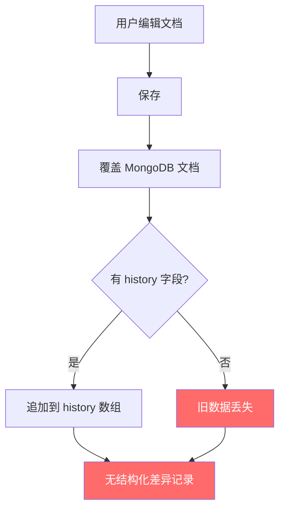
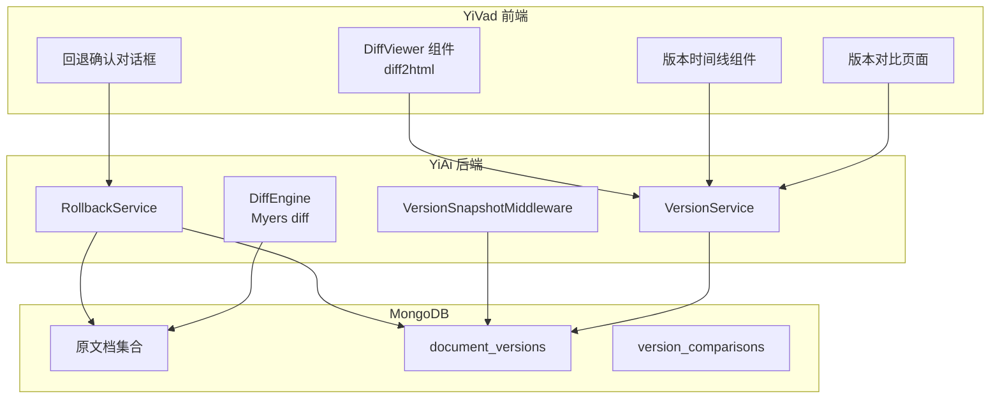
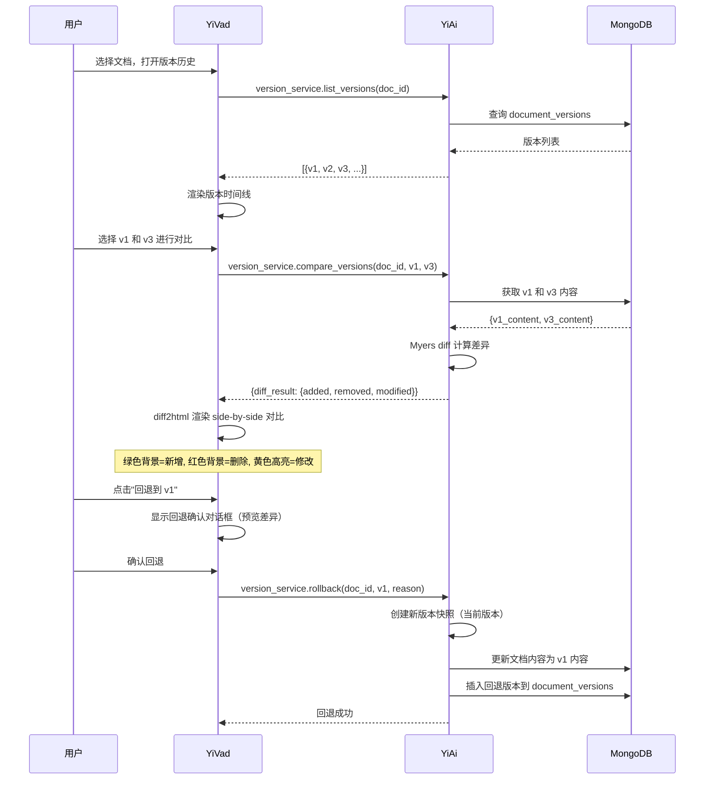

# YV-09-136: 文档版本对比 — 版本并列对比、行内差异高亮、版本时间线、回退到指定版本、变更作者归属

> 需求编号：YV-09-136 · 优先级：P2 · 人天：0.3d · 状态：需求已编写
> 依赖：YV-09-84（变更日志与发布说明）、YV-09-33（撤销重做系统）

## 背景

### 问题陈述

YiVad 管理后台中的文档和配置内容经历频繁修改，但当前缺少版本对比能力。用户想了解"这个字段从 A 改成了 B，是谁在什么时候改的"时，只能逐个查看历史版本来人肉对比：

1. **变更不可视**：只能看到最新版本，不知道上一版本的内容
2. **差异发现困难**：人工对比两个版本费时费力，容易遗漏细微变更
3. **责任无法追溯**：无法快速确定某处变更是谁做的
4. **回退不直观**：想恢复到之前某个版本时，需要手动复制旧内容
5. **协作理解成本高**：审阅者不知道作者改了什么，只能重新完整阅读

**核心矛盾**：YiVad 已有版本存储（MongoDB 文档的修订历史），但缺少版本之间的可视化对比和差异分析工具。用户面对两个版本的全文，需要逐行人眼对比。

### 影响范围

| # | 影响 | 严重程度 | 典型场景 |
|---|------|----------|----------|
| 1 | 变更审查效率低 | 高 | 技术负责人审核设计文档修改，需对比 3 个版本 |
| 2 | 误回退风险 | 高 | 手动复制旧版内容时漏掉或错改其他字段 |
| 3 | 协作冲突发现延迟 | 中 | 多人修改同一文档，直到合并时才发现冲突 |
| 4 | 审计追溯困难 | 中 | 合规审计要求提供"字段 X 从 A 变为 B 的完整变化链" |
| 5 | 新人学习成本高 | 低 | 新成员阅读迭代后的文档，不知道哪些内容是新增的 |

### 挑战

| 挑战 | 说明 |
|------|------|
| 差异算法选择 | 需要高效的文本差异算法（Myers diff），支持大文档 |
| 结构化对比 | YiVad 文档多为结构化数据（JSON/Markdown），需要字段级和内容级双层对比 |
| 行内差异高亮 | 不仅显示哪行变了，还要在行内精确标识变更字符 |
| 版本时间线渲染 | 大量版本时（100+）时间线性能需优化 |
| 回退安全机制 | 回退操作需要保留当前版本作为新版本，而非覆盖 |

---

## 一、现状分析

### 1.1 当前版本管理现状

```
YiVad 文档版本管理现状:
├── 版本存储
│   ├── MongoDB documents 集合（仅最新版本）
│   ├── 部分集合有 history 字段（手动记录）
│   └── 无自动版本快照                      # ❌ 不存在
├── 版本查看
│   ├── 部分页面有"历史记录"面板
│   └── 仅显示修改时间 + 操作人
├── 版本对比
│   ├── 无版本并列对比                      # ❌ 不存在
│   ├── 无行内差异高亮                      # ❌ 不存在
│   ├── 无版本时间线                        # ❌ 不存在
│   └── 无变更作者归属                      # ❌ 部分存在
└── 版本回退
    ├── 无回退到指定版本                    # ❌ 不存在
    └── 仅撤销重做系统（单会话内）          # 局限性大
```

### 1.2 当前版本变更追踪流程



### 1.3 根因分析矩阵

| 问题 | 根因 | 影响范围 | 解决优先级 |
|------|------|----------|------------|
| 无法对比版本差异 | 无差异计算和可视化 | 所有文档编辑场景 | P0 |
| 变更是谁做的不知道 | 版本快照不记录 author | 协作和审计场景 | P0 |
| 回退操作危险 | 无安全的回退机制 | 所有修改场景 | P1 |
| 版本时间线不可用 | 无版本列表 + 时间渲染 | 历史追溯场景 | P1 |
| 无行内高亮 | 差异仅显示行级 | 精细化审查场景 | P2 |

---

## 二、设计决策

### 2.1 方案对比：差异算法

| 方案 | 描述 | 优点 | 缺点 | 决策 |
|------|------|------|------|------|
| A: Myers diff | 经典的 O(ND) 差异算法 | 算法成熟，diff 结果直观 | 大文档（>10000 行）时有性能开销 | **采用** |
| B: Histogram diff | Git 默认的差异算法 | 对移动代码块识别更好 | 实现复杂度高 | 不采用 |
| C: 字符级 Levenshtein | 字符级编辑距离 | 最精细 | 计算成本随文档长度 O(n^2) 增长 | 不采用 |

### 2.2 方案对比：版本存储方式

| 方案 | 描述 | 优点 | 缺点 | 决策 |
|------|------|------|------|------|
| A: 嵌入式 history 数组 | 在文档内嵌 history 数组存储历史版本 | 查询简单，一次查询获取全部 | 文档体积膨胀，影响常规查询性能 | 不采用 |
| B: 独立 versions 集合 | 独立的 document_versions 集合存储所有版本 | 不影响主文档查询性能，可独立索引 | 需要额外集合，版本查询需要两次数据库操作 | **采用** |
| C: Git 仓库存储 | 将文档内容存储在 Git 仓库中 | 免费获得完整的版本控制能力 | 引入 Git 依赖，运维复杂，不适合非文本内容 | 不采用 |

### 2.3 方案对比：前端差异渲染

| 方案 | 描述 | 优点 | 缺点 | 决策 |
|------|------|------|------|------|
| A: 纯 CSS 高亮 | 用 CSS 类标记差异行/字符 | 简单，性能好 | 对行内字符级高亮支持有限 | 不采用 |
| B: diff2html 库 | 使用 diff2html 库渲染 side-by-side 和 line-by-line 模式 | 效果专业，支持行内高亮 | 增加前端依赖（~50KB gzipped） | **采用** |
| C: 自研渲染 | 基于虚拟 DOM 自研 diff 渲染器 | 完全可控 | 开发成本高，效果难以超越 diff2html | 不采用 |

---

## 三、目标架构

### 3.1 版本对比系统架构



### 3.2 版本对比流程



### 3.3 数据模型

```
document_versions 集合:
{
  _id: ObjectId,
  doc_id: "doc_abc123",              // 关联的文档 ID
  collection_name: "design_docs",    // 原集合名称
  version_id: "v_20260909_001",      // 版本标识
  version_number: 5,                 // 版本序号（自增）
  content: { ... },                  // 完整文档内容快照
  content_hash: "sha256_xxx",        // 内容哈希（快速判断是否有变更）
  changed_fields: ["title", "content.body", "status"],  // 变更字段列表
  change_summary: "更新了标题和第三段内容",  // 变更摘要（AI 生成或手动填写）
  author_id: "user_001",
  author_name: "陈铭",
  created_at: ISODate("2026-09-09T10:30:00Z"),
  source: "manual_save",             // manual_save | auto_save | rollback | import
  metadata: {
    change_reason: "根据评审意见修改",
    related_issue: "ISSUE-123"
  }
}

version_comparisons 集合:
{
  _id: ObjectId,
  doc_id: "doc_abc123",
  base_version_id: "v_20260901_001",
  target_version_id: "v_20260909_001",
  diff_summary: {
    lines_added: 15,
    lines_removed: 8,
    lines_modified: 3,
    files_changed: 1
  },
  diff_detail: [ ... ],              // 缓存的 diff 结果（避免重复计算）
  compared_at: ISODate("2026-09-09T10:35:00Z"),
  compared_by: "user_001"
}
```

---

## 四、具体改动

### 4.1 YiAi 后端 — VersionService

```python
# services/data/version_service.py (新增)

import difflib
import hashlib
import json

class VersionService:
    """文档版本管理服务"""

    async def create_version(self, doc_id: str, collection_name: str,
                              content: dict, author_id: str, author_name: str,
                              change_summary: str = None,
                              source: str = "manual_save") -> dict:
        """保存文档时自动创建版本快照"""
        # 获取上一版本
        last_version = await self.document_versions.find_one(
            {"doc_id": doc_id},
            sort=[("version_number", -1)]
        )

        content_hash = hashlib.sha256(
            json.dumps(content, sort_keys=True).encode()
        ).hexdigest()

        # 内容未变化则跳过
        if last_version and last_version["content_hash"] == content_hash:
            return None

        # 计算变更字段
        changed_fields = []
        if last_version:
            changed_fields = self._diff_fields(last_version["content"], content)

        version_number = (last_version["version_number"] + 1) if last_version else 1

        version = {
            "doc_id": doc_id,
            "collection_name": collection_name,
            "version_id": f"v_{datetime.utcnow().strftime('%Y%m%d')}_{version_number:03d}",
            "version_number": version_number,
            "content": content,
            "content_hash": content_hash,
            "changed_fields": changed_fields,
            "change_summary": change_summary,
            "author_id": author_id,
            "author_name": author_name,
            "created_at": datetime.utcnow(),
            "source": source,
        }
        await self.document_versions.insert_one(version)
        return version

    async def list_versions(self, doc_id: str, limit: int = 50) -> list:
        """列出文档的所有版本"""
        cursor = self.document_versions.find(
            {"doc_id": doc_id}
        ).sort("version_number", -1).limit(limit)
        return await cursor.to_list(length=limit)

    async def get_version(self, doc_id: str, version_id: str) -> dict:
        """获取指定版本"""
        return await self.document_versions.find_one({
            "doc_id": doc_id, "version_id": version_id
        })

    async def compare_versions(self, doc_id: str, base_version_id: str,
                                target_version_id: str) -> dict:
        """对比两个版本"""
        base = await self.get_version(doc_id, base_version_id)
        target = await self.get_version(doc_id, target_version_id)

        base_text = json.dumps(base["content"], ensure_ascii=False, indent=2)
        target_text = json.dumps(target["content"], ensure_ascii=False, indent=2)

        # Myers diff
        diff_lines = list(difflib.unified_diff(
            base_text.splitlines(keepends=True),
            target_text.splitlines(keepends=True),
            fromfile=f"v{base['version_number']}",
            tofile=f"v{target['version_number']}",
            lineterm=''
        ))

        # 统计
        added = sum(1 for l in diff_lines if l.startswith('+') and not l.startswith('+++'))
        removed = sum(1 for l in diff_lines if l.startswith('-') and not l.startswith('---'))

        return {
            "base_version": {"id": base_version_id, "number": base["version_number"],
                             "author": base["author_name"], "created_at": base["created_at"]},
            "target_version": {"id": target_version_id, "number": target["version_number"],
                               "author": target["author_name"], "created_at": target["created_at"]},
            "diff_lines": diff_lines,
            "diff_summary": {
                "lines_added": added,
                "lines_removed": removed,
                "changed_fields": target.get("changed_fields", [])
            },
            "unified_diff": '\n'.join(diff_lines)
        }

    def _diff_fields(self, old_content: dict, new_content: dict,
                      prefix: str = "") -> list:
        """递归对比两个 dict，返回变更字段列表"""
        changed = []
        all_keys = set(old_content.keys()) | set(new_content.keys())
        for key in all_keys:
            full_key = f"{prefix}.{key}" if prefix else key
            old_val = old_content.get(key)
            new_val = new_content.get(key)
            if key not in old_content:
                changed.append(f"{full_key} (新增)")
            elif key not in new_content:
                changed.append(f"{full_key} (删除)")
            elif isinstance(old_val, dict) and isinstance(new_val, dict):
                changed.extend(self._diff_fields(old_val, new_val, full_key))
            elif old_val != new_val:
                changed.append(full_key)
        return changed
```

### 4.2 YiAi 后端 — RollbackService

```python
# services/data/rollback_service.py (新增)

class RollbackService:
    """版本回退服务"""

    async def rollback(self, doc_id: str, target_version_id: str,
                        author_id: str, author_name: str,
                        reason: str = None) -> dict:
        """回退文档到指定版本"""
        # 1. 获取目标版本
        target_version = await self.version_service.get_version(
            doc_id, target_version_id
        )
        if not target_version:
            raise BusinessError(1002, "目标版本不存在")

        # 2. 获取当前文档
        collection_name = target_version["collection_name"]
        current_doc = await self.db[collection_name].find_one({"doc_id": doc_id})

        # 3. 创建当前版本的快照（安全措施）
        await self.version_service.create_version(
            doc_id, collection_name, current_doc,
            author_id, author_name,
            change_summary=f"回退前快照：即将回退到 v{target_version['version_number']}",
            source="rollback_snapshot"
        )

        # 4. 应用目标版本的内容
        await self.db[collection_name].update_one(
            {"doc_id": doc_id},
            {"$set": {
                **target_version["content"],
                "updated_at": datetime.utcnow(),
                "updated_by": author_id
            }}
        )

        # 5. 创建回退记录版本
        rollback_version = await self.version_service.create_version(
            doc_id, collection_name, target_version["content"],
            author_id, author_name,
            change_summary=f"回退到 v{target_version['version_number']}：{reason or '无'}",
            source="rollback"
        )

        return {
            "rollback_version": rollback_version,
            "target_version": target_version,
            "message": f"已回退到版本 v{target_version['version_number']}"
        }
```

### 4.3 YiVad 前端 — DiffViewer 组件

```typescript
// src/components/version/DiffViewer.vue (新增)

// <template>
//   <div class="diff-viewer">
//     <!-- 模式切换 -->
//     <t-radio-group v-model="viewMode" class="mode-switcher">
//       <t-radio-button value="side-by-side">并列对比</t-radio-button>
//       <t-radio-button value="line-by-line">行内对比</t-radio-button>
//     </t-radio-group>
//
//     <!-- 差异统计 -->
//     <div class="diff-stats">
//       <t-tag theme="success">+{{ diffSummary.lines_added }} 新增</t-tag>
//       <t-tag theme="danger">-{{ diffSummary.lines_removed }} 删除</t-tag>
//       <span v-if="diffSummary.changed_fields.length">
//         变更字段: {{ diffSummary.changed_fields.join(', ') }}
//       </span>
//     </div>
//
//     <!-- Diff 渲染区域 -->
//     <div ref="diffContainer" class="diff-container" v-html="renderedDiff" />
//
//     <!-- 变更字段快速导航 -->
//     <div class="change-navigator">
//       <div v-for="field in diffSummary.changed_fields" :key="field"
//         class="change-nav-item" @click="scrollToField(field)">
//         {{ field }}
//         <t-icon name="arrow-right" />
//       </div>
//     </div>
//   </div>
// </template>
//
// <script setup lang="ts">
// import { ref, computed, watch } from 'vue';
// import { createPatch } from 'diff';
// import { html } from 'diff2html';
//
// const props = defineProps<{
//   baseContent: string;
//   targetContent: string;
//   baseVersion: string;
//   targetVersion: string;
//   diffSummary: DiffSummary;
// }>();
//
// const viewMode = ref<'side-by-side' | 'line-by-line'>('side-by-side');
//
// const unifiedDiff = computed(() => {
//   return createPatch(
//     'content',
//     props.baseContent,
//     props.targetContent,
//     props.baseVersion,
//     props.targetVersion
//   );
// });
//
// const renderedDiff = computed(() => {
//   return html(unifiedDiff.value, {
//     drawFileList: false,
//     matching: 'lines',
//     outputFormat: viewMode.value,
//     rawTemplates: {},
//   });
// });
// </script>
```

### 4.4 YiVad 前端 — 版本时间线组件

```typescript
// src/components/version/VersionTimeline.vue (新增)

// <template>
//   <div class="version-timeline">
//     <t-timeline>
//       <t-timeline-item
//         v-for="version in versions"
//         :key="version.version_id"
//         :dot-color="getDotColor(version.source)"
//       >
//         <div class="timeline-content"
//           :class="{ selected: selectedVersion === version.version_id }"
//           @click="selectVersion(version.version_id)"
//         >
//           <div class="version-header">
//             <t-tag size="small">v{{ version.version_number }}</t-tag>
//             <span class="author">{{ version.author_name }}</span>
//             <span class="time">{{ formatRelativeTime(version.created_at) }}</span>
//           </div>
//           <div class="change-summary" v-if="version.change_summary">
//             {{ version.change_summary }}
//           </div>
//           <div class="changed-fields" v-if="version.changed_fields.length">
//             <t-tag v-for="field in version.changed_fields.slice(0, 3)"
//               :key="field" size="small" variant="light" theme="primary">
//               {{ field }}
//             </t-tag>
//             <span v-if="version.changed_fields.length > 3" class="more">
//               +{{ version.changed_fields.length - 3 }} 个字段
//             </span>
//           </div>
//           <div class="source-badge">
//             <t-tag size="small" :theme="sourceTheme[version.source]">
//               {{ sourceLabel[version.source] }}
//             </t-tag>
//           </div>
//         </div>
//       </t-timeline-item>
//     </t-timeline>
//   </div>
// </template>
```

### 4.5 文件变更清单

| 文件 | 操作 | 说明 |
|------|------|------|
| `YiAi/services/data/version_service.py` | 新增 | 版本快照创建、列表、对比 |
| `YiAi/services/data/rollback_service.py` | 新增 | 版本回退服务 |
| `YiAi/middleware/version_snapshot.py` | 新增 | 文档保存时自动创建版本快照的中间件 |
| `YiAi/services/data/diff_engine.py` | 新增 | 差异计算引擎 |
| `YiVad/src/components/version/DiffViewer.vue` | 新增 | 版本差异可视化组件 |
| `YiVad/src/components/version/VersionTimeline.vue` | 新增 | 版本时间线组件 |
| `YiVad/src/components/version/RollbackDialog.vue` | 新增 | 回退确认对话框 |
| `YiVad/src/views/doc/version-compare.vue` | 新增 | 版本对比页面 |
| `YiVad/src/composables/useVersionCompare.ts` | 新增 | 版本对比 Composable |
| `YiVad/src/stores/version.ts` | 新增 | 版本状态管理 Pinia store |
| `YiVad/src/router/modules/doc.ts` | 修改 | 添加版本对比路由 |
| `YiAi/tests/test_version_service.py` | 新增 | 版本服务测试 |
| `YiVad/tests/unit/diff-viewer.test.ts` | 新增 | DiffViewer 组件测试 |

---

## 五、实施步骤

| 步骤 | 操作 | 路径 | 验证 | 人天 |
|------|------|------|------|------|
| 1 | 实现 YiAi VersionService（创建版本、列表、对比） | `YiAi/services/data/version_service.py` | 保存文档自动创建版本，列出历史版本 | 0.05 |
| 2 | 实现 YiAi DiffEngine（Myers diff） | `YiAi/services/data/diff_engine.py` | 两个版本对比返回新增/删除/修改行 | 0.03 |
| 3 | 实现 YiAi RollbackService + 版本快照中间件 | `YiAi/services/data/rollback_service.py` + `middleware/version_snapshot.py` | 回退操作前创建快照，回退后内容正确 | 0.04 |
| 4 | 实现 YiVad DiffViewer 组件（diff2html 集成） | `YiVad/src/components/version/DiffViewer.vue` | side-by-side 和 line-by-line 两种模式渲染正确 | 0.06 |
| 5 | 实现 YiVad VersionTimeline 组件 | `YiVad/src/components/version/VersionTimeline.vue` | 版本列表按时间倒序，点击选中高亮 | 0.04 |
| 6 | 实现 YiVad 版本对比页面 + RollbackDialog | `YiVad/src/views/doc/version-compare.vue` + `RollbackDialog.vue` | 选择两个版本对比，回退操作安全执行 | 0.05 |
| 7 | 路由注册 + 集成测试 | 路由文件 + 测试文件 | 端到端：编辑 → 对比 → 回退 | 0.03 |

**总人天：0.3d**

---

## 六、测试规格

### 场景 1：保存文档自动创建版本快照

**GIVEN** 用户编辑一篇设计文档
**WHEN** 用户保存文档（内容有变更）
**THEN** document_versions 中新增一条版本记录
**AND** 版本号递增（如 v1 → v2）
**AND** changed_fields 包含实际变更的字段列表
**AND** author_id 和 author_name 正确记录

### 场景 2：并列对比两个版本差异

**GIVEN** 文档有 v1 和 v5 两个版本
**WHEN** 用户在版本时间线中选择 v1 和 v5 进行对比
**THEN** 左侧显示 v1 内容，右侧显示 v5 内容
**AND** 新增行绿色高亮，删除行红色高亮
**AND** 修改行黄色高亮（行内字符级差异）
**AND** 顶部统计显示 "+15 行新增, -8 行删除"

### 场景 3：行内差异字符级高亮

**GIVEN** v1 中 "项目预计 3 周完成"，v5 中 "项目预计 5 周完成"
**WHEN** 对比 v1 和 v5
**THEN** 该行黄色背景高亮，"3" 被标记为删除（红色），"5" 被标记为新增（绿色）
**AND** 其他未变化字符保持普通样式

### 场景 4：回退文档到指定版本

**GIVEN** 文档当前为 v5，用户想回退到 v3
**WHEN** 用户在版本时间线中选择 v3，点击"回退到此版本"，确认操作
**THEN** 系统先创建当前 v5 的快照（保存为 v6）
**AND** 文档内容更新为 v3 的内容
**AND** 创建回退记录版本 v7，source=rollback，change_summary 包含回退原因
**AND** 通知：文档已回退到 v3

### 场景 5：内容无变化时跳过快照

**GIVEN** 用户打开文档，未做任何修改
**WHEN** 用户点击保存
**THEN** 不创建新版本快照
**AND** content_hash 相同，跳过版本创建

### 场景 6：变更作者归属查询

**GIVEN** 文档有 5 个版本，由 3 个不同作者创建
**WHEN** 用户打开版本时间线
**THEN** 每个版本显示作者头像/姓名和修改时间
**AND** 可按作者筛选版本（如只看陈铭的修改）
**AND** 作者变更统计：陈铭 3 次，李四 1 次，王五 1 次

---

## 七、风险与缓解

| 风险 | 概率 | 影响 | 缓解措施 |
|------|------|------|----------|
| document_versions 集合无限增长 | 高 | 高 | 每个文档保留最近 50 个版本；定时清理旧版本（90 天前的非里程碑版本） |
| 大文档 diff 计算耗时 | 中 | 中 | 缓存 diff 结果（version_comparisons 集合）；大文档（>100KB）异步计算 diff |
| diff2html 前端包体积 | 中 | 低 | 按需加载（dynamic import），仅在版本对比页面加载 |
| 回退操作误执行 | 低 | 高 | 回退前必须二次确认 + 输入回退原因；回退操作记录完整审计日志 |
| 版本快照中间件影响写入性能 | 中 | 低 | 版本创建异步执行（asyncio.create_task），不阻塞保存请求 |

---

## 八、回滚策略

| 场景 | 回滚操作 | 影响 |
|------|----------|------|
| DiffViewer 组件渲染性能问题 | 关闭 diff2html 集成，降级为纯文本 diff 显示 | 失去行内高亮和 side-by-side 模式 |
| document_versions 集合写入性能瓶颈 | 暂停自动版本快照，仅保留手动版本创建 | 失去自动版本追踪，手动保存版本 |
| 回退功能被滥用 | 限制回退权限为管理员 + 文档所有者；添加回退审批流程 | 普通用户无法回退 |
| 版本对比页面加载慢 | 限制一次加载的版本数量（默认 20 个），添加分页 | 早期版本需手动翻页加载 |

---

## 九、设计决策记录

### D-01：为什么每个文档最多保留 50 个历史版本？

在"保留足够历史"和"存储成本"之间平衡。50 个版本足以覆盖大多数文档的完整迭代历史（假设一天 2 次修改，约一个月的历史）。需要更早的版本可通过数据归档策略恢复。

### D-02：为什么选择 diff2html 而非自研渲染？

diff2html 是业界标准的 diff 渲染库，支持 side-by-side 和 line-by-line 两种模式，行内字符级高亮开箱即用。自研同等效果的渲染器预计需要 3-5 天，远超本需求的 0.3 人天。

### D-03：为什么回退操作不直接覆盖而是创建新版本？

保留回退前的状态作为版本快照，确保回退操作可逆（可以再"回退到回退前"）。这符合审计合规要求，所有操作都有记录。

### D-04：为什么 content_hash 用 SHA-256 而非 MD5？

SHA-256 碰撞概率远低于 MD5，对于文档内容去重（判断是否有实际修改）足够安全。虽然 MD5 更快，但文档内容 hash 计算频率不高（仅在保存时），SHA-256 的微小性能损失可接受。

---

## 十、可观测性

### 指标

| 指标 | 类型 | 说明 |
|------|------|------|
| `yivad.version.snapshot_count` | Counter | 版本快照创建数 |
| `yivad.version.diff_duration` | Histogram | diff 计算耗时 |
| `yivad.version.rollback_count` | Counter | 回退操作次数 |
| `yivad.version.collection_size` | Gauge | document_versions 集合总大小 |
| `yivad.version.cache_hit_rate` | Gauge | diff 结果缓存命中率 |
| `yivad.version.no_change_skip_count` | Counter | 无变化跳过次数 |

### 告警

| 告警 | 条件 | 级别 |
|------|------|------|
| document_versions 集合过大 | 集合大小 > 500MB | WARNING |
| diff 计算超时 | diff 计算 > 3 秒 | WARNING |
| 回退操作频率异常 | 5 分钟内 > 10 次回退 | WARNING |
| 版本创建失败率过高 | 失败/总创建 > 5% | ERROR |

---

## 十一、代码审查检查清单

- [ ] VersionService 支持创建版本、列表版本、获取版本、对比版本
- [ ] 内容无变化时跳过版本创建（content_hash 比对）
- [ ] 版本快照中间件在文档保存时自动触发（异步）
- [ ] Myers diff 正确计算文本差异
- [ ] 回退操作前创建当前版本的快照
- [ ] 回退操作记录完整审计日志（操作人、时间、原因）
- [ ] DiffViewer 支持 side-by-side 和 line-by-line 两种模式
- [ ] diff2html 按需加载（dynamic import）
- [ ] 版本时间线按版本号倒序排列
- [ ] 版本对比页面支持选择任意两个版本进行对比
- [ ] 回退确认对话框显示差异预览
- [ ] 每个文档保留最近 50 个版本，旧版本定时清理
- [ ] document_versions 有 doc_id + version_number 复合索引
- [ ] version_comparisons 缓存 diff 结果，避免重复计算
- [ ] 单元测试覆盖版本创建、对比、回退、无变化跳过

---

## 回归问题预测

| # | 预测问题 | 原因 | 验证方法 |
|---|---------|------|---------|
| 1 | 对比两个版本时，JSON 格式化差异（缩进、key 顺序）导致 diff 结果充满噪声，真正的字段变更被淹没在格式差异中 | difflib 按行对比，JSON 序列化时的缩进和 key 顺序差异被识别为行变更 | 保存两份内容相同仅 status 字段从 "draft" 变为 "published" 的版本 → 对比 → 验证 diff 结果仅高亮 status 字段变更 |
| 2 | 回退文档到旧版本后，文档的 updated_at 和 updated_by 字段被旧版本内容覆盖，导致文档元数据不准确 | 回退时直接使用旧版本的完整 content 覆盖当前文档 | 回退文档到 v3 → 检查 MongoDB 中该文档的 updated_at → 验证 updated_at 为回退操作的时间（而非 v3 的时间） |
| 3 | 用户快速连续保存（3 秒内 5 次），每次保存都触发版本创建，产生大量无用版本 | 自动保存 / 草稿恢复机制频繁保存，每次都创建版本快照 | 模拟快速连续保存 5 次 → 检查 document_versions → 验证去重机制将 5 次保存合并为 1-2 个版本（如 30 秒内的连续保存合并） |
| 4 | diff2html 渲染大文档（>5000 行）时浏览器卡顿，DOM 节点过多导致页面无响应 | diff2html 将所有 diff 行渲染为 DOM 节点，大文档导致 10000+ DOM 节点 | 对比 5000 行文档的两个版本 → 打开 Chrome Performance 面板 → 验证渲染时间 < 500ms，使用虚拟滚动或分页渲染 |
| 5 | 版本时间线组件在版本数 > 100 时加载全部版本，初始渲染耗时长且占用大量内存 | VersionTimeline 一次性渲染所有版本的 DOM 节点 | 创建 100 个版本 → 打开版本时间线 → 验证默认仅加载最近 20 个，滚动到底部时自动加载更多（虚拟列表或无限滚动） |
| 6 | 文档被删除后 document_versions 中的版本记录成为孤儿数据，占用存储空间且无归属 | 删除文档时未级联删除其版本记录 | 删除一个文档 → 检查 document_versions → 验证该文档的版本记录被标记为 deleted 或一并清理 |

---

## 性能分析

### 关键操作耗时

| 操作 | 耗时 | 说明 |
|------|------|------|
| 创建版本快照（异步） | < 20ms | MongoDB insert，不阻塞保存请求 |
| 版本列表查询（50 条） | < 30ms | doc_id 索引查询 |
| diff 计算（1000 行） | < 100ms | Python difflib |
| diff 计算（缓存命中） | < 5ms | MongoDB 读取预计算结果 |
| 回退操作 | < 50ms | 版本快照 + 文档更新 |
| diff2html 渲染（500 行） | < 200ms | 前端 DOM 渲染 |

### 数据量预估（100 用户规模）

| 集合 | 日均增量 | 保留策略 | 稳态大小 |
|------|----------|----------|----------|
| document_versions | ~200 条 | 每文档保留 50 个，旧版本定时清理 | ~5,000 条，~50MB |
| version_comparisons | ~50 条 | TTL 30 天 | ~1,500 条，~10MB |

---

## 相关文档

- [变更日志与发布说明](../84-需求-变更日志与发布说明.md) — 版本发布记录
- [撤销重做系统](../33-需求-撤销重做系统.md) — 会话内撤销重做
- [活动日志与审计追踪](../50-需求-活动日志与审计追踪.md) — 操作审计

*PRD 来源: `projects/yivad/requirements/2026-09/136-需求-文档版本对比.md`*

