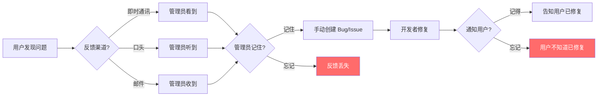
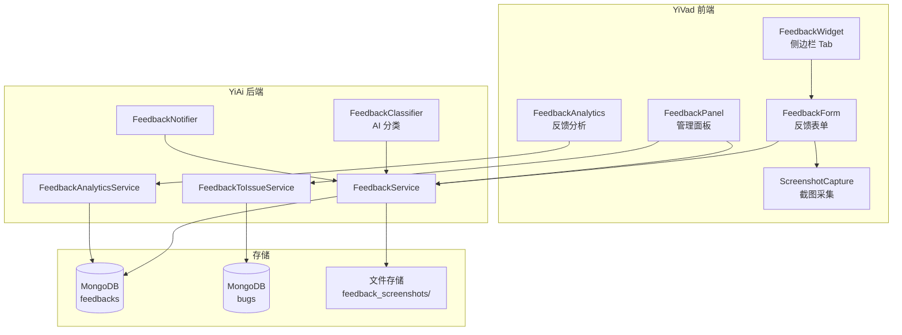
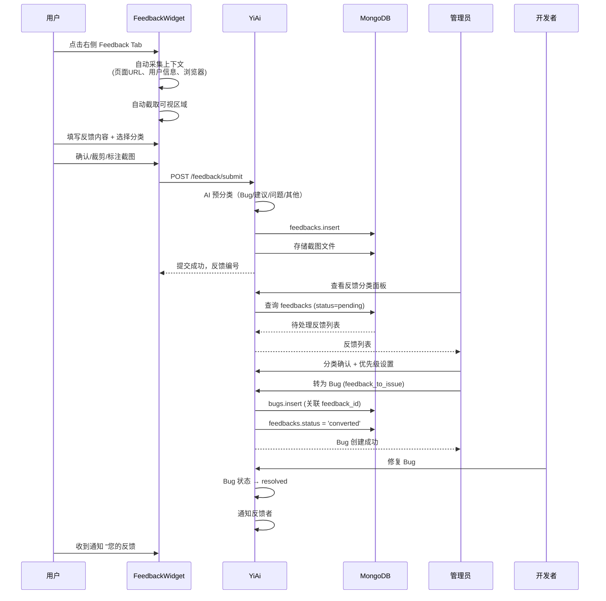

# YV-09-137: 用户反馈收集 — 应用内反馈组件、反馈分类、截图附件、反馈分类面板、反馈转Issue、反馈分析

> 需求编号：YV-09-137 · 优先级：P2 · 人天：0.3d · 状态：需求已编写
> 依赖：YV-09-27（通知中心）、YV-09-28（文件上传与管理）

## 背景

### 问题陈述

YiVad 管理后台缺少系统化的用户反馈收集渠道。用户遇到问题或有改进建议时，只能通过口头沟通、即时通讯或邮件反馈，反馈信息碎片化、不完整，难以追踪和处理：

1. **反馈入口分散**：用户不知道去哪里提交反馈，通常直接找管理员口头描述
2. **信息不完整**：口头反馈缺少上下文（当前页面、操作步骤、浏览器信息）
3. **无法复现**：用户描述"页面报错了"但无截图、无控制台日志，开发者无法定位
4. **反馈淹没**：即时通讯中的反馈被消息淹没，缺少系统化追踪
5. **无闭环**：用户提交反馈后不知道是否被采纳、何时修复

**核心矛盾**：YiVad 的所有改进依赖开发团队主动发现问题，用户侧的痛点和需求缺乏系统化的收集和分析渠道。反馈从"用户发现问题"到"开发团队知晓"存在巨大的信息衰减。

### 影响范围

| # | 影响 | 严重程度 | 典型场景 |
|---|------|----------|----------|
| 1 | 用户反馈无法追踪 | 高 | 用户 3 次反馈同一问题，因无记录每次都需重新描述 |
| 2 | Bug 复现困难 | 高 | 用户报告"表格排序不对"但无截图、无数据上下文 |
| 3 | 改进建议流失 | 中 | 用户有好想法但觉得"提了也没用"就不提了 |
| 4 | 用户满意度不可知 | 中 | 无法量化用户对系统的满意度和痛点分布 |
| 5 | 反馈响应慢 | 中 | 反馈通过人工转述，信息层层衰减 |

### 挑战

| 挑战 | 说明 |
|------|------|
| 反馈组件非侵入性 | 反馈入口需要随时可访问但不能干扰正常操作 |
| 截图隐私保护 | 自动截图可能包含敏感数据，需要用户确认和裁剪能力 |
| 反馈分类准确性 | 自动分类（Bug/建议/问题）可能不准，需人工复核 |
| 反馈转化闭环 | 反馈转 Bug/Issue 后需要保持关联，反馈者需要被通知 |
| 分析数据体量 | 初期反馈量少（可能每天 < 10 条），分析统计的意义需要时间积累 |

---

## 一、现状分析

### 1.1 当前反馈渠道

```
YiVad 用户反馈现状:
├── 即时通讯（企业微信/钉钉）
│   ├── 问题：信息碎片化，无结构化记录
│   └── 问题：容易被其他消息淹没
├── 口头反馈
│   ├── 问题：无记录，容易遗忘
│   └── 问题：信息衰减严重
├── 邮件
│   ├── 问题：缺少上下文信息
│   └── 问题：响应周期长
└── 系统内反馈
    ├── 无反馈入口/组件                # ❌ 不存在
    ├── 无反馈分类                     # ❌ 不存在
    ├── 无截图附件                     # ❌ 不存在
    ├── 无反馈管理面板                 # ❌ 不存在
    ├── 无反馈转 Bug/Issue             # ❌ 不存在
    └── 无反馈分析                     # ❌ 不存在
```

### 1.2 当前反馈流转



### 1.3 根因分析矩阵

| 问题 | 根因 | 影响范围 | 解决优先级 |
|------|------|----------|------------|
| 反馈入口不统一 | 无应用内反馈组件 | 所有用户 | P0 |
| 反馈信息不完整 | 无自动上下文采集 | Bug 复现 | P0 |
| 反馈无法追踪 | 无反馈管理面板 | 反馈闭环 | P1 |
| 反馈响应慢 | 无反馈 → Issue 自动转化 | 用户体验 | P1 |
| 无法量化分析 | 无反馈数据聚合和分析 | 产品决策 | P2 |

---

## 二、设计决策

### 2.1 方案对比：反馈入口位置

| 方案 | 描述 | 优点 | 缺点 | 决策 |
|------|------|------|------|------|
| A: 全局悬浮按钮 | 页面右下角固定悬浮反馈按钮 | 始终可见，入口明确 | 可能遮挡内容，视觉干扰 | 不采用 |
| B: 侧边栏 Tab | 右侧可收起的侧边栏 Tab | 不遮挡内容，可展示反馈历史 | 入口不够显眼 | **采用** |
| C: 导航栏入口 | 顶部导航栏的反馈图标 | 入口统一，与通知中心并列 | 需要用户主动寻找 | 不采用 |

### 2.2 方案对比：截图采集方式

| 方案 | 描述 | 优点 | 缺点 | 决策 |
|------|------|------|------|------|
| A: 自动全页截图 | html2canvas 自动截取当前页面 | 信息完整 | 可能包含敏感数据，文件大 | 不采用 |
| B: 用户手动截图 | 用户使用系统截图工具截图后粘贴 | 用户可控制 | 操作步骤多，体验差 | 不采用 |
| C: 自动截图 + 用户确认 + 裁剪 | 自动截取当前可视区域，用户可裁剪、标注敏感区域 | 效率和安全性的平衡 | 实现复杂度略高 | **采用** |

### 2.3 方案对比：反馈分类方式

| 方案 | 描述 | 优点 | 缺点 | 决策 |
|------|------|------|------|------|
| A: 用户手动选择 | 用户提交时选择反馈类型 | 准确率高 | 用户可能选错或不选 | 不采用 |
| B: AI 自动分类 | 根据反馈内容自动分类 | 无需用户操作 | AI 可能分错 | 不采用 |
| C: 混合分类 | 用户可选 + AI 预分类建议 + 管理员可修改 | 准确率和体验的平衡 | 需要 AI 支持 | **采用** |

### 2.4 方案对比：反馈存储

| 方案 | 描述 | 优点 | 缺点 | 决策 |
|------|------|------|------|------|
| A: 复用 bugs 集合 | 反馈直接创建为 Bug 记录 | 零额外存储 | 反馈和 Bug 是不同概念，混淆管理 | 不采用 |
| B: 独立 feedbacks 集合 | 反馈有独立的集合，转为 Bug/Issue 时创建关联 | 概念清晰，可扩展 | 增加一个集合 | **采用** |

---

## 三、目标架构

### 3.1 反馈系统架构



### 3.2 反馈完整生命周期



### 3.3 数据模型

```
feedbacks 集合:
{
  _id: ObjectId,
  feedback_id: "FB-20260909-001",
  user_id: "user_001",
  username: "陈铭",
  user_role: "developer",
  type: "bug",                        // bug | suggestion | question | other
  ai_suggested_type: "bug",           // AI 建议的分类
  title: "Bug 列表筛选条件重置问题",
  description: "在 Bug 列表页切换项目后...",
  category: "数据展示",               // 功能分类
  severity: "medium",                 // low | medium | high | critical
  status: "pending",                  // pending | reviewing | accepted | converted | declined | closed
  priority: "P2",

  // 自动采集上下文
  context: {
    page_url: "/projects/proj_001/bugs",
    page_title: "Bug 列表 — 项目 A",
    browser: "Chrome 120",
    os: "macOS 14.2",
    screen_resolution: "1920x1080",
    user_actions: ["点击项目切换", "筛选条件消失"],
    console_errors: [],
    timestamp: ISODate("2026-09-09T14:30:00Z")
  },

  // 截图附件
  screenshot: {
    filename: "FB-001_screenshot.png",
    file_size: 245760,
    has_annotations: true,
    blurred_areas: [{x: 100, y: 200, w: 150, h: 30}]
  },

  // 附加信息
  attachments: [],
  tags: ["筛选", "Bug列表"],

  // 关联
  converted_issue_id: null,           // 转为 Bug/Issue 后的 ID
  converted_issue_type: null,         // bug | feature_request

  // 管理信息
  assigned_to: null,
  admin_notes: "",
  response: "",
  responded_at: null,

  // 时间线
  created_at: ISODate("2026-09-09T14:30:00Z"),
  updated_at: ISODate("2026-09-09T14:30:00Z"),
  resolved_at: null,
  closed_at: null,

  // 用户反馈
  user_satisfaction: null,            // 1-5 评分（关闭后收集）
}
```

---

## 四、具体改动

### 4.1 YiAi 后端 — FeedbackService

```python
# services/feedback/feedback_service.py (新增)

class FeedbackService:
    """用户反馈管理服务"""

    async def submit_feedback(self, feedback_data: dict, user: dict) -> dict:
        """提交反馈"""
        # 自动采集服务端上下文
        feedback_data["user_id"] = user["_id"]
        feedback_data["username"] = user["username"]
        feedback_data["user_role"] = user.get("role", "unknown")

        # AI 预分类
        ai_type = await self.classifier.classify(
            feedback_data["title"],
            feedback_data["description"]
        )
        feedback_data["ai_suggested_type"] = ai_type

        # 如果用户未选择分类，使用 AI 建议
        if not feedback_data.get("type"):
            feedback_data["type"] = ai_type

        # 生成反馈编号
        today = datetime.utcnow().strftime("%Y%m%d")
        count = await self.feedbacks.count_documents({
            "feedback_id": {"$regex": f"FB-{today}"}
        })
        feedback_data["feedback_id"] = f"FB-{today}-{count + 1:03d}"

        feedback_data["status"] = "pending"
        feedback_data["created_at"] = datetime.utcnow()

        await self.feedbacks.insert_one(feedback_data)

        # 通知管理员
        await self.notifier.notify_new_feedback(feedback_data)

        return feedback_data

    async def list_feedbacks(self, filter: dict = None,
                              page: int = 1, page_size: int = 20) -> dict:
        """列出反馈（管理面板）"""
        query = filter or {}
        total = await self.feedbacks.count_documents(query)
        cursor = self.feedbacks.find(query) \
            .sort("created_at", -1) \
            .skip((page - 1) * page_size) \
            .limit(page_size)
        items = await cursor.to_list(length=page_size)
        return {"items": items, "total": total, "page": page, "page_size": page_size}

    async def update_feedback_status(self, feedback_id: str, status: str,
                                      admin_notes: str = None,
                                      assigned_to: str = None):
        """更新反馈状态"""
        updates = {"status": status, "updated_at": datetime.utcnow()}
        if admin_notes:
            updates["admin_notes"] = admin_notes
        if assigned_to:
            updates["assigned_to"] = assigned_to
        if status == "closed":
            updates["closed_at"] = datetime.utcnow()
        await self.feedbacks.update_one(
            {"feedback_id": feedback_id}, {"$set": updates}
        )

    async def respond_to_feedback(self, feedback_id: str, response: str,
                                   admin_id: str):
        """回复反馈"""
        await self.feedbacks.update_one(
            {"feedback_id": feedback_id},
            {"$set": {
                "response": response,
                "responded_at": datetime.utcnow(),
                "responded_by": admin_id,
                "updated_at": datetime.utcnow()
            }}
        )
        feedback = await self.feedbacks.find_one({"feedback_id": feedback_id})
        await self.notifier.notify_feedback_response(feedback)
```

### 4.2 YiAi 后端 — FeedbackToIssueService

```python
# services/feedback/feedback_to_issue_service.py (新增)

class FeedbackToIssueService:
    """反馈转 Bug/Issue 服务"""

    async def convert_to_issue(self, feedback_id: str, issue_type: str,
                                admin_id: str, admin_name: str) -> dict:
        """将反馈转为 Bug 或功能请求"""
        feedback = await self.feedbacks.find_one({"feedback_id": feedback_id})
        if not feedback:
            raise BusinessError(1002, "反馈不存在")
        if feedback.get("converted_issue_id"):
            raise BusinessError(1003, "反馈已转为 Issue")

        # 创建 Bug/Issue
        issue_data = {
            "title": f"[用户反馈] {feedback['title']}",
            "description": feedback["description"],
            "source": "user_feedback",
            "source_feedback_id": feedback_id,
            "reporter": feedback["username"],
            "severity": feedback.get("severity", "medium"),
            "status": "open",
            "created_at": datetime.utcnow(),
            "created_by": admin_id,
        }

        # 附加截图
        if feedback.get("screenshot"):
            issue_data["attachments"] = [feedback["screenshot"]["filename"]]

        collection = "bugs" if issue_type == "bug" else "feature_requests"
        result = await self.db[collection].insert_one(issue_data)
        issue_id = str(result.inserted_id)

        # 更新反馈记录
        await self.feedbacks.update_one(
            {"feedback_id": feedback_id},
            {"$set": {
                "status": "converted",
                "converted_issue_id": issue_id,
                "converted_issue_type": issue_type,
                "updated_at": datetime.utcnow()
            }}
        )

        # 通知反馈者
        await self.notifier.notify_feedback_converted(feedback, issue_id, issue_type)

        return {"feedback_id": feedback_id, "issue_id": issue_id, "issue_type": issue_type}
```

### 4.3 YiVad 前端 — FeedbackWidget

```typescript
// src/components/feedback/FeedbackWidget.vue (新增)

// <template>
//   <div class="feedback-widget">
//     <!-- 侧边栏 Tab 触发按钮 -->
//     <div class="feedback-tab" @click="togglePanel"
//       :class="{ active: isPanelOpen }">
//       <t-icon name="chat" />
//       <span>反馈</span>
//       <t-badge v-if="myFeedbackUpdates" :count="myFeedbackUpdates" />
//     </div>
//
//     <!-- 反馈面板 -->
//     <t-drawer v-model:visible="isPanelOpen" header="提交反馈" size="420px"
//       placement="right" :footer="false">
//       <div class="feedback-panel">
//         <!-- 反馈表单 -->
//         <t-form ref="formRef" :data="form" :rules="rules" label-width="80px">
//           <t-form-item label="反馈类型" name="type">
//             <t-radio-group v-model="form.type">
//               <t-radio-button value="bug">
//                 <t-icon name="bug" /> Bug 报告
//               </t-radio-button>
//               <t-radio-button value="suggestion">
//                 <t-icon name="lightbulb" /> 改进建议
//               </t-radio-button>
//               <t-radio-button value="question">
//                 <t-icon name="help-circle" /> 使用问题
//               </t-radio-button>
//               <t-radio-button value="other">
//                 <t-icon name="ellipsis" /> 其他
//               </t-radio-button>
//             </t-radio-group>
//           </t-form-item>
//
//           <t-form-item label="标题" name="title">
//             <t-input v-model="form.title" placeholder="一句话描述你的反馈" />
//           </t-form-item>
//
//           <t-form-item label="详细描述" name="description">
//             <t-textarea v-model="form.description"
//               placeholder="请详细描述：1. 期望发生什么 2. 实际发生了什么 3. 复现步骤"
//               :autosize="{ minRows: 4, maxRows: 8 }" />
//           </t-form-item>
//
//           <t-form-item label="严重程度" name="severity" v-if="form.type === 'bug'">
//             <t-select v-model="form.severity">
//               <t-option value="low" label="低 — 小问题，不影响使用" />
//               <t-option value="medium" label="中 — 影响体验，有替代方案" />
//               <t-option value="high" label="高 — 功能受阻，无替代方案" />
//               <t-option value="critical" label="紧急 — 系统不可用" />
//             </t-select>
//           </t-form-item>
//
//           <!-- 自动截图区域 -->
//           <t-form-item label="截图">
//             <div class="screenshot-area">
//               <div class="screenshot-preview" v-if="screenshot">
//                 
//                 <div class="screenshot-actions">
//                   <t-button size="small" variant="text" @click="retakeScreenshot">
//                     重新截取
//                   </t-button>
//                   <t-button size="small" variant="text" @click="openAnnotation">
//                     标注/裁剪
//                   </t-button>
//                 </div>
//               </div>
//               <div v-else class="screenshot-placeholder" @click="captureScreenshot">
//                 <t-icon name="camera" />
//                 <span>点击截取当前页面</span>
//               </div>
//               <t-checkbox v-model="includeConsoleLogs">
//                 附带浏览器控制台日志
//               </t-checkbox>
//             </div>
//           </t-form-item>
//
//           <t-form-item label="功能分类" name="category">
//             <t-select v-model="form.category" placeholder="选择相关功能模块">
//               <t-option value="数据展示" label="数据展示" />
//               <t-option value="Bug管理" label="Bug 管理" />
//               <t-option value="项目管理" label="项目管理" />
//               <t-option value="AI聊天" label="AI 聊天" />
//               <t-option value="知识库" label="知识库" />
//               <t-option value="系统设置" label="系统设置" />
//               <t-option value="其他" label="其他" />
//             </t-select>
//           </t-form-item>
//         </t-form>
//
//         <!-- 自动采集上下文（只读展示） -->
//         <t-collapse>
//           <t-collapse-panel header="自动采集的上下文信息">
//             <div class="context-info">
//               <div><strong>页面：</strong>{{ context.page_url }}</div>
//               <div><strong>浏览器：</strong>{{ context.browser }}</div>
//               <div><strong>系统：</strong>{{ context.os }}</div>
//             </div>
//           </t-collapse-panel>
//         </t-collapse>
//
//         <t-button theme="primary" block @click="submitFeedback"
//           :loading="submitting">
//           提交反馈
//         </t-button>
//
//         <!-- 我的反馈记录 -->
//         <div class="my-feedbacks">
//           <div class="section-title">我的反馈</div>
//           <div v-for="fb in myFeedbacks" :key="fb.feedback_id"
//             class="my-feedback-item">
//             <div class="fb-title">{{ fb.title }}</div>
//             <div class="fb-meta">
//               <t-tag size="small" :theme="statusTheme[fb.status]">
//                 {{ statusLabel[fb.status] }}
//               </t-tag>
//               <span>{{ formatDate(fb.created_at) }}</span>
//             </div>
//           </div>
//         </div>
//       </div>
//     </t-drawer>
//   </div>
// </template>
```

### 4.4 YiVad 前端 — 反馈管理面板

```typescript
// src/views/system/feedback-panel.vue (新增)

// <template>
//   <div class="feedback-panel-page">
//     <PageHeader title="反馈管理" desc="查看和处理用户反馈">
//       <t-button @click="openAnalytics">反馈分析</t-button>
//     </PageHeader>
//
//     <!-- 筛选栏 -->
//     <t-row :gutter="16" class="filter-bar">
//       <t-col :span="3">
//         <t-select v-model="filterStatus" placeholder="状态" clearable>
//           <t-option value="pending" label="待处理" />
//           <t-option value="reviewing" label="审核中" />
//           <t-option value="accepted" label="已接受" />
//           <t-option value="converted" label="已转Issue" />
//           <t-option value="declined" label="已拒绝" />
//           <t-option value="closed" label="已关闭" />
//         </t-select>
//       </t-col>
//       <t-col :span="3">
//         <t-select v-model="filterType" placeholder="类型" clearable>
//           <t-option value="bug" label="Bug 报告" />
//           <t-option value="suggestion" label="改进建议" />
//           <t-option value="question" label="使用问题" />
//         </t-select>
//       </t-col>
//       <t-col :span="3">
//         <t-select v-model="filterSeverity" placeholder="严重程度" clearable>
//           <t-option value="low" label="低" />
//           <t-option value="medium" label="中" />
//           <t-option value="high" label="高" />
//           <t-option value="critical" label="紧急" />
//         </t-select>
//       </t-col>
//     </t-row>
//
//     <!-- 反馈列表 -->
//     <t-table :data="feedbacks" :columns="columns" row-key="feedback_id">
//       <template #type="{ row }">
//         <t-tag :theme="typeTheme[row.type]">{{ typeLabel[row.type] }}</t-tag>
//         <t-tag v-if="row.ai_suggested_type !== row.type"
//           size="small" variant="light" :theme="typeTheme[row.ai_suggested_type]">
//           AI: {{ typeLabel[row.ai_suggested_type] }}
//         </t-tag>
//       </template>
//       <template #severity="{ row }">
//         <t-tag v-if="row.type === 'bug'" :theme="severityTheme[row.severity]">
//           {{ severityLabel[row.severity] }}
//         </t-tag>
//       </template>
//       <template #actions="{ row }">
//         <t-space>
//           <t-button size="small" variant="text" @click="viewDetail(row)">
//             详情
//           </t-button>
//           <t-button v-if="row.status === 'pending'" size="small"
//             variant="text" theme="primary" @click="acceptFeedback(row)">
//             接受
//           </t-button>
//           <t-button v-if="['pending', 'accepted'].includes(row.status)"
//             size="small" variant="text" theme="success"
//             @click="convertToIssue(row)">
//             转 Issue
//           </t-button>
//           <t-button v-if="row.status === 'pending'" size="small"
//             variant="text" theme="danger" @click="declineFeedback(row)">
//             拒绝
//           </t-button>
//         </t-space>
//       </template>
//     </t-table>
//   </div>
// </template>
```

### 4.5 文件变更清单

| 文件 | 操作 | 说明 |
|------|------|------|
| `YiAi/services/feedback/feedback_service.py` | 新增 | 反馈提交、列表、状态管理服务 |
| `YiAi/services/feedback/feedback_classifier.py` | 新增 | AI 反馈分类器 |
| `YiAi/services/feedback/feedback_to_issue_service.py` | 新增 | 反馈转 Bug/Issue 服务 |
| `YiAi/services/feedback/feedback_analytics.py` | 新增 | 反馈数据分析服务 |
| `YiAi/services/feedback/feedback_notifier.py` | 新增 | 反馈通知服务 |
| `YiVad/src/components/feedback/FeedbackWidget.vue` | 新增 | 反馈侧边栏组件 |
| `YiVad/src/components/feedback/ScreenshotCapture.vue` | 新增 | 截图采集组件 |
| `YiVad/src/components/feedback/AnnotationTool.vue` | 新增 | 截图标注工具 |
| `YiVad/src/views/system/feedback-panel.vue` | 新增 | 反馈管理面板 |
| `YiVad/src/views/system/feedback-detail.vue` | 新增 | 反馈详情页 |
| `YiVad/src/views/system/feedback-analytics.vue` | 新增 | 反馈分析页面 |
| `YiVad/src/composables/useFeedback.ts` | 新增 | 反馈 Composable |
| `YiVad/src/stores/feedback.ts` | 新增 | 反馈状态管理 Pinia store |
| `YiVad/src/router/modules/system.ts` | 修改 | 添加反馈管理路由 |
| `YiVad/src/App.vue` | 修改 | 全局注册 FeedbackWidget |
| `YiAi/tests/test_feedback_service.py` | 新增 | 反馈服务测试 |

---

## 五、实施步骤

| 步骤 | 操作 | 路径 | 验证 | 人天 |
|------|------|------|------|------|
| 1 | 实现 FeedbackService（提交、列表、状态管理） | `YiAi/services/feedback/feedback_service.py` | 提交反馈成功，生成反馈编号，列表查询正常 | 0.04 |
| 2 | 实现 FeedbackClassifier（AI 预分类） | `YiAi/services/feedback/feedback_classifier.py` | 输入反馈内容，输出类型建议（准确率 > 70%） | 0.03 |
| 3 | 实现 FeedbackToIssueService + FeedbackAnalytics | `YiAi/services/feedback/feedback_to_issue_service.py` + `feedback_analytics.py` | 反馈转 Bug 成功，分析数据聚合正确 | 0.03 |
| 4 | 实现 FeedbackWidget UI 组件 | `YiVad/src/components/feedback/FeedbackWidget.vue` | 侧边栏展开/收起，表单填写，上下文自动采集 | 0.05 |
| 5 | 实现 ScreenshotCapture + AnnotationTool | `YiVad/src/components/feedback/ScreenshotCapture.vue` + `AnnotationTool.vue` | 自动截图，标注（矩形/模糊），裁剪 | 0.05 |
| 6 | 实现反馈管理面板 + 详情页 | `YiVad/src/views/system/feedback-panel.vue` + `feedback-detail.vue` | 列表筛选、接受/拒绝/转 Issue、详情查看 | 0.05 |
| 7 | 实现反馈分析页面 + 全局注册 | `YiVad/src/views/system/feedback-analytics.vue` + `App.vue` | 图表展示反馈趋势、分类分布、满意度 | 0.05 |

**总人天：0.3d**

---

## 六、测试规格

### 场景 1：用户提交 Bug 反馈

**GIVEN** 用户在 Bug 列表页面
**WHEN** 用户点击右侧 Feedback Tab，选择"Bug 报告"，填写标题和描述，截取页面截图，提交
**THEN** 反馈提交成功，显示反馈编号 #FB-XXX
**AND** 自动采集上下文（页面 URL、浏览器信息、时间戳）正确记录
**AND** 管理员收到新反馈通知
**AND** AI 预分类结果为 "bug"

### 场景 2：截取页面并标注敏感信息

**GIVEN** 用户打开 FeedbackWidget
**WHEN** 用户点击"截取当前页面"
**THEN** 自动截取当前可视区域，显示预览
**WHEN** 用户点击"标注"，用矩形框覆盖手机号区域，选择"模糊"
**THEN** 该区域被模糊处理
**AND** 标注信息保存在 screenshot metadata 中

### 场景 3：管理员审核并转 Issue

**GIVEN** 管理员在反馈管理面板，有一条待处理反馈
**WHEN** 管理员查看反馈详情，点击"接受"
**THEN** 反馈状态变为 accepted
**WHEN** 管理员点击"转 Issue"，选择"Bug"
**THEN** 创建新 Bug 记录，关联 feedback_id
**AND** 反馈状态变为 converted，converted_issue_id 记录 Bug ID
**AND** 反馈者收到通知："您的反馈已转为 Bug #BUG-456 进行处理"

### 场景 4：拒绝反馈并回复原因

**GIVEN** 管理员收到一条不合理的反馈
**WHEN** 管理员点击"拒绝"，填写拒绝原因"该功能设计如此，请参考文档 XXX"
**THEN** 反馈状态变为 declined
**AND** 反馈者收到回复通知，包含拒绝原因

### 场景 5：查看我的反馈历史

**GIVEN** 用户已提交 3 条反馈（1 条已关闭，2 条处理中）
**WHEN** 用户打开 FeedbackWidget，滚动到"我的反馈"区域
**THEN** 显示 3 条反馈记录，按提交时间倒序
**AND** 每条显示标题、状态标签、提交时间
**AND** 点击可查看详情和管理员回复

### 场景 6：反馈分析仪表盘

**GIVEN** 系统中有 50 条反馈记录（30 bug、15 suggestion、5 question）
**WHEN** 管理员打开反馈分析页面
**THEN** 显示反馈趋势图（按周/月）
**AND** 反馈类型分布饼图（bug 60%、suggestion 30%、question 10%）
**AND** 功能模块分布柱状图
**AND** 平均处理时间统计
**AND** 用户满意度趋势（关闭反馈时收集的评分）

---

## 七、风险与缓解

| 风险 | 概率 | 影响 | 缓解措施 |
|------|------|------|----------|
| 自动截图包含敏感数据 | 高 | 高 | 截图预览 + 标注工具（模糊/裁剪）；提交前用户确认；服务端存储截图设置访问权限 |
| 反馈量少导致分析无意义 | 中 | 低 | 分析页面标注"当前数据量较少，趋势仅供参考"；数据量 < 20 时显示原始列表而非聚合图表 |
| AI 分类准确率低 | 中 | 低 | 允许管理员修改分类；AI 建议以辅助标签展示，不覆盖用户选择 |
| 反馈转为 Issue 后状态不同步 | 低 | 中 | Issue 状态变更时通过 Webhook 回写 feedback 状态 |
| 反馈组件增加页面加载体积 | 中 | 低 | FeedbackWidget 懒加载（仅在用户点击 Tab 时加载）；截图库（html2canvas）按需加载 |

---

## 八、回滚策略

| 场景 | 回滚操作 | 影响 |
|------|----------|------|
| FeedbackWidget 导致页面性能问题 | 移除全局注册，FeedbackWidget 不再渲染 | 用户无法通过应用内提交反馈 |
| 截图功能导致浏览器崩溃 | 禁用自动截图，保留手动上传截图 | 用户体验降级，但仍可提交反馈 |
| 反馈管理面板操作复杂（用户反馈量少） | 关闭管理面板，反馈直接发邮件给管理员 | 失去反馈追踪能力 |

---

## 九、设计决策记录

### D-01：为什么选择侧边栏 Tab 而非全局悬浮按钮？

侧边栏 Tab 在视觉上不遮挡主要内容，且可以承载"我的反馈历史"功能。悬浮按钮虽然更显眼，但容易干扰用户操作，且无法提供反馈历史查看。

### D-02：为什么反馈提交后不立即创建 Bug，而是需要管理员审核？

不是所有反馈都值得创建 Bug。用户可能提交重复反馈、描述不清的反馈、或对功能误解的反馈。管理员审核环节过滤噪音，确保只有有价值的反馈进入开发流程。

### D-03：为什么独立的 feedbacks 集合而非复用 bugs？

反馈和 Bug 有不同的生命周期和管理需求。反馈需要用户回复、满意度评分等能力，Bug 需要开发分配、代码关联等能力。放在一起会导致字段膨胀和责任混淆。

### D-04：为什么 AI 分类仅作为建议而非自动确定？

AI 分类准确率不可能 100%（尤其是短文本）。用户看到 AI 分类错误而不允许修改会降低信任度。AI 建议 + 用户确认/管理员修改的模式在准确性和用户体验之间取得平衡。

---

## 十、可观测性

### 指标

| 指标 | 类型 | 说明 |
|------|------|------|
| `yivad.feedback.submit_count` | Counter | 反馈提交数（按类型） |
| `yivad.feedback.pending_count` | Gauge | 待处理反馈数 |
| `yivad.feedback.avg_response_time` | Gauge | 平均响应时间（提交 → 首次回复） |
| `yivad.feedback.avg_resolution_time` | Gauge | 平均解决时间（提交 → 关闭） |
| `yivad.feedback.conversion_rate` | Gauge | 反馈转 Issue 率 |
| `yivad.feedback.classifier_accuracy` | Gauge | AI 分类准确率 |
| `yivad.feedback.user_satisfaction` | Gauge | 用户满意度均分 |

### 告警

| 告警 | 条件 | 级别 |
|------|------|------|
| 待处理反馈积压 | 待处理 > 30 条 | WARNING |
| 平均响应时间过长 | 平均 > 48 小时 | WARNING |
| 反馈量突增 | 环比增长 > 300% | WARNING |
| 满意度过低 | 满意度均分 < 2.0（5 分制） | INFO |

---

## 十一、代码审查检查清单

- [ ] FeedbackService 支持提交、列表、状态更新、回复
- [ ] 提交反馈时自动采集页面 URL、浏览器、OS、时间戳
- [ ] AI 分类器输出类型建议（准确率 > 70%）
- [ ] 截图自动采集当前可视区域
- [ ] 截图标注工具支持矩形、模糊、文字注释
- [ ] 反馈管理面板支持多维度筛选（状态、类型、严重程度）
- [ ] 反馈转 Issue 创建 Bug 记录并关联 feedback_id
- [ ] 反馈状态变更时通知反馈者
- [ ] FeedbackWidget 按需加载（dynamic import）
- [ ] 截图库（html2canvas）按需加载
- [ ] 反馈列表分页加载（默认 20 条/页）
- [ ] 反馈分析页面支持趋势图、分布图、统计卡片
- [ ] feedbacks 集合有 feedback_id 唯一索引 + status + created_at 复合索引
- [ ] 单元测试覆盖提交、分类、状态变更、转 Issue

---

## 回归问题预测

| # | 预测问题 | 原因 | 验证方法 |
|---|---------|------|---------|
| 1 | FeedbackWidget 在 iframe 内嵌页面（如嵌入的知识库页面）中截图失败，html2canvas 跨域限制导致截图空白 | html2canvas 无法截取跨域 iframe 内容 | 在有 iframe 的页面打开 FeedbackWidget → 截图 → 验证 iframe 区域有提示"此区域无法截图"而非空白 |
| 2 | 用户提交反馈后页面刷新，feedback_id 丢失，用户在"我的反馈"中看不到刚提交的反馈（以为提交失败） | 反馈提交是异步的，状态更新可能有延迟 | 提交反馈 → 立即查看"我的反馈" → 验证刚提交的反馈在列表中显示（乐观更新，或显示"提交中..."） |
| 3 | 反馈转 Issue 后删除原反馈，导致 Issue 的 source_feedback_id 指向不存在的记录，关联断裂 | 反馈和 Issue 的关联是单向的（Issue 记录 feedback_id） | 将一条反馈转为 Issue → 删除该反馈记录 → 查看关联的 Issue → 验证 source_feedback_id 仍可追溯到已删除反馈的摘要信息 |
| 4 | 管理员在移动端查看反馈管理面板，表格布局异常，操作按钮重叠 | 反馈管理面板使用 TDesign Table，在 < 768px 宽度下操作列过窄 | 浏览器窗口缩放到 375px → 访问反馈管理面板 → 验证操作按钮折叠为下拉菜单或自动换行 |
| 5 | 截图标注数据（矩形坐标、模糊区域）在服务端存储后丢失，重新查看截图时标注不可见 | 标注坐标基于截图分辨率，存储格式可能不正确 | 截图 → 标注两个模糊区域 → 提交反馈 → 管理员查看反馈详情 → 验证模糊区域正确显示 |
| 6 | AI 分类器将所有中文反馈都分类为 "bug"，因为训练数据中 bug 占 90% | 分类器训练数据不平衡 | 提交 5 条建议类反馈 → 检查 AI 建议类型 → 验证至少 3 条被正确识别为 suggestion |

---

## 性能分析

### 关键操作耗时

| 操作 | 耗时 | 说明 |
|------|------|------|
| 提交反馈（含截图） | < 500ms | 截图 base64 上传 + AI 分类 + MongoDB insert |
| AI 分类 | < 200ms | Ollama 推理（小模型） |
| 反馈列表查询（20 条） | < 30ms | MongoDB 索引查询 |
| 截图自动采集 | < 300ms | html2canvas 渲染 |
| 反馈转 Issue | < 50ms | MongoDB insert + update |
| 反馈分析聚合 | < 500ms | MongoDB aggregation pipeline |

### 数据量预估（100 用户规模）

| 集合 | 日均增量 | 保留策略 | 稳态大小 |
|------|----------|----------|----------|
| feedbacks | ~5 条 | 永久保留 | ~500 条，~5MB |
| 截图文件 | ~3 个 | 与反馈记录同步生命周期 | ~300 个，~150MB |

---

## 相关文档

- [通知中心](../27-需求-通知中心.md) — 反馈通知推送
- [文件上传与管理](../28-需求-文件上传与管理.md) — 截图文件存储
- [Bug 管理相关需求](../../2026-08/) — 反馈转 Bug 的目标集合

*PRD 来源: `projects/yivad/requirements/2026-09/137-需求-用户反馈收集.md`*

