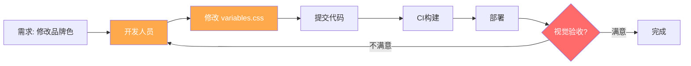
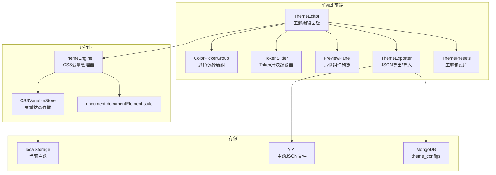
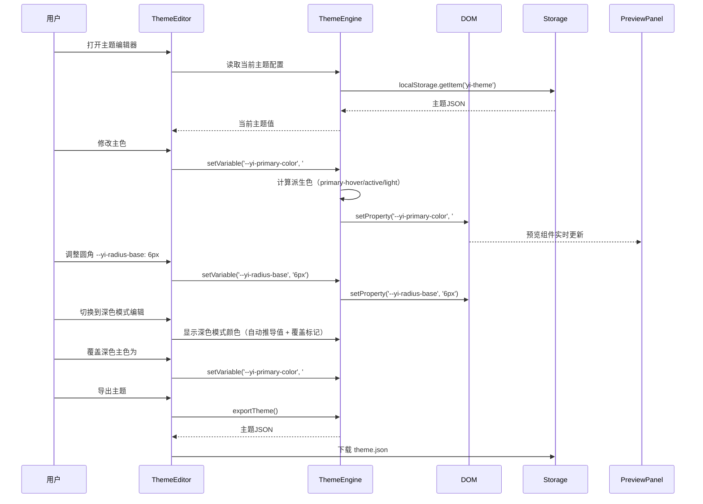

# YV-09-138: 自定义主题编辑器 — 可视化主题编辑器、主色/辅色/强调色、圆角/字号/间距Token、实时预览示例组件、导出导入主题JSON、浅色/深色变体

> 需求编号：YV-09-138 · 优先级：P2 · 人天：0.3d · 状态：需求已编写
> 依赖：YV-09-26（主题系统与暗色模式——共享CSS变量基础设施）、YV-09-32（仪表盘自定义——共享可视化配置面板模式）

## 背景

### 问题陈述

YiVad 管理后台当前使用的是 TDesign 默认主题——所有部署实例视觉风格完全一致。企业客户（尤其是白标场景和内部品牌规范团队）强烈需要将管理后台的视觉风格与企业品牌保持一致：

1. **品牌色无法定制**：企业有自己的品牌主色（如 #1A73E8 Google Blue、#E60012 Toyota Red），但 YiVad 只能使用 TDesign 默认蓝色，与企业内部系统视觉割裂
2. **设计Token固化**：圆角、字号、间距等设计Token硬编码在CSS变量中，用户无法调整——例如金融行业偏好更紧凑的间距，教育行业偏好更大的字号
3. **深色模式不完整**：YV-09-26 实现了深色模式切换，但深色模式的颜色值由系统根据浅色自动生成（`dark:` 变体），无法精细调整——企业可能需要深色模式下特定的品牌色映射
4. **主题无法迁移**：在多环境部署场景（开发/测试/生产），每个环境都需要重新配置主题——缺少一键导出/导入能力
5. **修改需开发介入**：调整一个颜色值需要修改CSS变量文件、重新构建、部署——周期长达数天

**核心矛盾**：YiVad 作为通用管理后台产品，视觉品牌化是toB场景的基本需求——但当前主题系统仅支持系统预设的浅色/深色切换，缺少面向最终用户的可视化主题编辑器。

### 影响范围

| # | 影响 | 严重程度 | 典型场景 |
|---|------|----------|----------|
| 1 | 品牌色无法定制 | 高 | 企业部署后管理后台与企业官网颜色不一致，用户质疑产品专业度 |
| 2 | 设计Token无法调整 | 中 | 大屏展示场景需要更大字号和间距，移动端需要更紧凑布局 |
| 3 | 多环境主题不一致 | 中 | 开发环境配置的主题无法迁移到生产环境，需重新配置 |
| 4 | 主题修改周期长 | 高 | 调整品牌色需要开发介入→改代码→构建→部署→验证，周期 2-3 天 |
| 5 | 深色模式品牌色丢失 | 中 | 深色模式下企业品牌色被系统自动替换，品牌识别度下降 |

### 挑战

| 挑战 | 说明 |
|------|------|
| CSS变量动态注入 | 主题编辑器的修改需要实时反映到页面——要求CSS变量在运行时动态更新，而非构建时固化 |
| 设计Token数量控制 | TDesign 有 100+ CSS变量——全部暴露编辑会让人困惑——需精选核心 Token 并提供合理的范围约束 |
| 深色/浅色联动 | 修改浅色模式的主色后，深色模式的主色如何联动？完全独立（灵活但繁琐）vs 自动推导（方便但不精确）|
| 预览真实性 | 示例组件预览需覆盖表格、表单、按钮、导航等核心场景——确保主题在所有组件上都好看 |
| 主题JSON兼容性 | 导出主题JSON的格式需要稳定——升级YiVad版本后旧主题JSON仍需能正常导入 |

---

## 一、现状分析

### 1.1 当前主题架构

```
YiVad 主题系统现状:
├── YV-09-26 主题系统与暗色模式
│   ├── CSS变量定义 (src/styles/variables.css) ✅
│   ├── 浅色/深色切换 (data-theme="dark") ✅
│   ├── TDesign CSS变量覆盖 ✅
│   └── 持久化用户偏好 (localStorage) ✅
├── 自定义主题编辑器: ❌ 不存在
│
缺失:
├── 可视化颜色选择器——主色/辅色/强调色/功能色         # ❌ 无
├── 设计Token编辑——圆角/字号/间距/阴影               # ❌ 无
├── 实时预览面板——示例组件渲染当前主题效果              # ❌ 无
├── 主题JSON导出/导入——跨环境迁移                     # ❌ 无
├── 深色/浅色独立编辑——或自动推导策略                  # ❌ 无
├── 主题预设库——内置几套企业主题模板                   # ❌ 无
├── CSS变量运行时注入——动态更新document.documentElement.style # ❌ 无
└── 主题修改历史——撤销/重做                           # ❌ 无
```

### 1.2 当前主题修改流程



### 1.3 根因分析矩阵

| 问题 | 根因 | 影响范围 | 解决优先级 |
|------|------|----------|------------|
| 品牌色无法定制 | 主题值硬编码在CSS文件中 | 所有toB客户 | P0 |
| Token无法调整 | 无可视化编辑入口 | 需要紧凑/宽松布局的用户 | P1 |
| 无法跨环境迁移 | 主题无序列化/反序列化机制 | 多环境部署场景 | P1 |
| 修改周期长 | 主题修改需要开发+构建+部署 | 用户体验 | P0 |
| 深色模式不可控 | 深色值自动推导不可干预 | 有品牌规范的客户 | P2 |

---

## 二、设计决策

### 2.1 方案对比：主题编辑方式

| 方案 | 描述 | 优点 | 缺点 | 决策 |
|------|------|------|------|------|
| A: JSON编辑器 | 直接编辑主题JSON对象 | 功能强大，可编辑所有Token | 门槛高，非技术人员无法使用 | 不采用 |
| B: 可视化面板 + JSON高级模式 | 默认可视化面板，提供JSON高级编辑模式 | 易用性和灵活性的平衡 | 开发量稍大 | **采用** |
| C: 仅预设主题选择 | 提供5-10套预设主题供选择 | 零学习成本 | 无法满足个性化需求 | 不采用 |

### 2.2 方案对比：CSS变量运行时注入策略

| 方案 | 描述 | 优点 | 缺点 | 决策 |
|------|------|------|------|------|
| A: 替换整个 `<style>` 标签 | 动态创建/替换包含CSS变量的style标签 | 批量更新，简单直接 | 闪烁风险，无法增量更新 | 不采用 |
| B: CSSStyleDeclaration.setProperty() | 逐个设置 `document.documentElement.style.setProperty()` | 精确控制，无闪烁 | 逐个设置性能略低 | **采用** |
| C: CSSStyleSheet.replaceSync() | 使用 Constructed Stylesheet API | 性能最优 | 浏览器兼容性有限（Safari 16.4+） | 不采用 |

### 2.3 方案对比：深色模式颜色生成策略

| 方案 | 描述 | 优点 | 缺点 | 决策 |
|------|------|------|------|------|
| A: 完全独立编辑 | 浅色和深色模式分别独立编辑所有颜色 | 完全自由，精确控制 | 编辑量大，用户需要配两套色 | 不采用 |
| B: 自动推导（HSL变换） | 深色模式由浅色模式通过HSL变换自动生成 | 零额外编辑 | 品牌色在深色下可能不好看 | 不采用 |
| C: 自动推导 + 可覆盖 | 默认自动推导深色值，但用户可以手动覆盖特定Token | 便捷和精确的平衡 | 实现稍复杂 | **采用** |

### 2.4 方案对比：预览组件选择

| 方案 | 描述 | 优点 | 缺点 | 决策 |
|------|------|------|------|------|
| A: 固定示例页面 | 硬编码一个包含各种组件的预览页面 | 覆盖全面 | 静态，不能交互 | 不采用 |
| B: 实时预览当前页面 | 主题编辑时直接作用于当前页面 | 所见即所得 | 用户需要切换到不同页面查看效果 | 不采用 |
| C: 可交互示例组件集 + 全局实时预览 | 主题面板内嵌示例组件（按钮/表格/表单/导航）+ 同时全局应用主题 | 兼顾局部预览和全局效果 | 开发量稍大 | **采用** |

---

## 三、目标架构

### 3.1 主题编辑器系统架构



### 3.2 主题编辑生命周期



### 3.3 主题数据模型

```typescript
// src/types/theme.ts (新增)

interface ThemeConfig {
  version: string;               // 主题格式版本 "1.0"
  name: string;                  // 主题名称 "企业品牌主题"
  description?: string;
  mode: 'light' | 'dark' | 'both';

  colors: {
    // 品牌色
    primary: ColorToken;         // 主色 + 派生色
    secondary: ColorToken;       // 辅色
    accent: ColorToken;          // 强调色

    // 功能色
    success: string;             // #2BA471
    warning: string;             // #E37318
    danger: string;              // #D54941
    info: string;                // #0052D9

    // 中性色
    neutral: {
      bg: string;
      bgSecondary: string;
      border: string;
      textPrimary: string;
      textSecondary: string;
      textPlaceholder: string;
    };
  };

  // 设计Token
  tokens: {
    radius: {
      small: string;             // 2px
      base: string;              // 6px
      large: string;             // 9px
      round: string;             // 999px
    };
    fontSize: {
      xs: string;                // 10px
      sm: string;                // 12px
      base: string;              // 14px
      md: string;                // 16px
      lg: string;                // 20px
      xl: string;                // 24px
    };
    spacing: {
      xs: string;                // 4px
      sm: string;                // 8px
      base: string;              // 16px
      md: string;                // 24px
      lg: string;                // 32px
      xl: string;                // 48px
    };
    fontFamily: {
      base: string;
      code: string;
    };
  };

  // 深色模式覆盖（仅被覆盖的Token）
  darkOverrides?: Partial<{
    colors: /* 同上 */;
    tokens: /* 同上 */;
  }>;

  metadata: {
    created: string;
    updated: string;
    author: string;
  };
}

interface ColorToken {
  base: string;                  // 基准色
  hover: string;                 // 悬停态
  active: string;                // 激活态
  disabled: string;              // 禁用态
  light: string;                 // 浅色背景（用于tag/alert背景）
}
```

### 3.4 主题预览示例组件清单

```
PreviewPanel 中渲染的示例组件:
├── 按钮组
│   ├── 主要按钮 (primary)
│   ├── 次要按钮 (secondary)
│   ├── 危险按钮 (danger)
│   └── 文字按钮 + 禁用态
├── 表格片段
│   ├── 表头行 + 斑马纹行
│   ├── 悬停行效果
│   └── 选中行效果
├── 表单片段
│   ├── 输入框 (正常/聚焦/错误)
│   ├── 下拉选择
│   └── 复选框/单选框
├── 导航片段
│   ├── 侧边栏菜单项（选中态/悬停态）
│   └── 面包屑
├── 标签/Badge
│   ├── 各颜色Tag (primary/success/warning/danger)
│   └── Badge数字
└── 卡片 + 阴影
    ├── 卡片容器
    └── 阴影层级 (shadow-sm/md/lg)
```

---

## 四、具体改动

### 4.1 YiVad 前端 — ThemeEngine

```typescript
// src/composables/theme/useThemeEngine.ts (新增)

import { ref, watch } from 'vue';
import type { ThemeConfig } from '@/types/theme';

// CSS变量名映射
const VAR_MAP: Record<string, string> = {
  'colors.primary.base': '--yi-primary-color',
  'colors.primary.hover': '--yi-primary-color-hover',
  'colors.primary.active': '--yi-primary-color-active',
  'colors.primary.disabled': '--yi-primary-color-disabled',
  'colors.primary.light': '--yi-primary-color-light',
  'colors.secondary.base': '--yi-secondary-color',
  'colors.accent.base': '--yi-accent-color',
  'colors.success': '--yi-success-color',
  'colors.warning': '--yi-warning-color',
  'colors.danger': '--yi-danger-color',
  'colors.info': '--yi-info-color',
  'tokens.radius.small': '--yi-radius-small',
  'tokens.radius.base': '--yi-radius-base',
  'tokens.radius.large': '--yi-radius-large',
  'tokens.radius.round': '--yi-radius-round',
  'tokens.fontSize.xs': '--yi-font-size-xs',
  'tokens.fontSize.sm': '--yi-font-size-sm',
  'tokens.fontSize.base': '--yi-font-size-base',
  'tokens.fontSize.md': '--yi-font-size-md',
  'tokens.fontSize.lg': '--yi-font-size-lg',
  'tokens.fontSize.xl': '--yi-font-size-xl',
  'tokens.spacing.xs': '--yi-spacing-xs',
  'tokens.spacing.sm': '--yi-spacing-sm',
  'tokens.spacing.base': '--yi-spacing-base',
  'tokens.spacing.md': '--yi-spacing-md',
  'tokens.spacing.lg': '--yi-spacing-lg',
  'tokens.spacing.xl': '--yi-spacing-xl',
};

// 颜色自动派生（HSL 变换）
function deriveColors(hex: string): ColorToken {
  const hsl = hexToHSL(hex);
  return {
    base: hex,
    hover: hslToHex(hsl.h, hsl.s, Math.min(hsl.l * 0.92, 100)),
    active: hslToHex(hsl.h, hsl.s, Math.min(hsl.l * 0.85, 100)),
    disabled: hslToHex(hsl.h, Math.max(hsl.s * 0.3, 0), Math.min(hsl.l * 1.2, 95)),
    light: hslToHex(hsl.h, Math.max(hsl.s * 0.15, 0), Math.min(hsl.l * 1.5, 98)),
  };
}

// 自动生成深色模式颜色
function deriveDarkColor(lightHex: string): string {
  const hsl = hexToHSL(lightHex);
  // 深色模式下提高亮度、降低饱和度
  return hslToHex(
    hsl.h,
    Math.min(hsl.s * 0.7, 70),
    Math.max(100 - hsl.l * 0.5, 40)
  );
}

export function useThemeEngine() {
  const currentTheme = ref<ThemeConfig | null>(null);
  const isDirty = ref(false);
  const history = ref<ThemeConfig[]>([]);  // 撤销栈
  const historyIndex = ref(-1);

  function loadTheme(): ThemeConfig {
    const stored = localStorage.getItem('yi-custom-theme');
    if (stored) {
      try { return JSON.parse(stored); } catch { /* fall through */ }
    }
    return getDefaultTheme();
  }

  function applyTheme(theme: ThemeConfig) {
    const el = document.documentElement;
    const mode = el.getAttribute('data-theme') === 'dark' ? 'dark' : 'light';
    const colors = mode === 'dark' && theme.darkOverrides?.colors
      ? { ...theme.colors, ...theme.darkOverrides.colors }
      : theme.colors;
    const tokens = mode === 'dark' && theme.darkOverrides?.tokens
      ? { ...theme.tokens, ...theme.darkOverrides.tokens }
      : theme.tokens;

    // 扁平化并设置所有CSS变量
    for (const [path, varName] of Object.entries(VAR_MAP)) {
      const value = getNestedValue({ colors, tokens }, path);
      if (value) el.style.setProperty(varName, value);
    }

    // 设置TDesign变量映射
    el.style.setProperty('--td-brand-color', colors.primary.base);
    el.style.setProperty('--td-brand-color-hover', colors.primary.hover);
    el.style.setProperty('--td-brand-color-active', colors.primary.active);
    el.style.setProperty('--td-radius-default', tokens.radius.base);
    el.style.setProperty('--td-font-size-body-medium', tokens.fontSize.base);

    currentTheme.value = theme;
  }

  function setVariable(path: string, value: string, mode?: 'light' | 'dark') {
    if (!currentTheme.value) return;
    // 保存历史用于撤销
    pushHistory();
    // 更新主题配置
    if (mode === 'dark' && currentTheme.value.darkOverrides) {
      setNestedValue(currentTheme.value.darkOverrides, path, value);
    } else {
      setNestedValue(currentTheme.value, path, value);
    }
    // 实时应用
    const varName = VAR_MAP[path];
    if (varName) document.documentElement.style.setProperty(varName, value);
    // 如果修改了base色，自动派生hover/active等
    if (path.endsWith('.base')) {
      const derived = deriveColors(value);
      const prefix = path.replace('.base', '');
      Object.entries(derived).forEach(([key, val]) => {
        if (key === 'base') return;
        const derivedPath = `${prefix}.${key}`;
        if (mode === 'dark' && currentTheme.value?.darkOverrides) {
          setNestedValue(currentTheme.value.darkOverrides, derivedPath, val);
        } else if (currentTheme.value) {
          setNestedValue(currentTheme.value, derivedPath, val);
        }
        const derivedVar = VAR_MAP[derivedPath];
        if (derivedVar) document.documentElement.style.setProperty(derivedVar, val);
      });
    }
    isDirty.value = true;
  }

  function saveTheme() {
    if (!currentTheme.value) return;
    currentTheme.value.metadata.updated = new Date().toISOString();
    localStorage.setItem('yi-custom-theme', JSON.stringify(currentTheme.value));
    isDirty.value = false;
  }

  function exportTheme(): string {
    return JSON.stringify(currentTheme.value, null, 2);
  }

  function importTheme(json: string): { success: boolean; error?: string } {
    try {
      const theme = JSON.parse(json);
      if (!validateTheme(theme)) {
        return { success: false, error: '主题JSON格式无效' };
      }
      applyTheme(theme);
      saveTheme();
      return { success: true };
    } catch (e) {
      return { success: false, error: 'JSON解析失败' };
    }
  }

  function resetToDefault() {
    applyTheme(getDefaultTheme());
    saveTheme();
  }

  function pushHistory() { /* 保存到history数组 */ }
  function undo() { /* 撤销到上一个历史状态 */ }
  function redo() { /* 重做 */ }

  return {
    currentTheme, isDirty,
    loadTheme, applyTheme, setVariable,
    saveTheme, exportTheme, importTheme, resetToDefault,
    undo, redo,
  };
}
```

### 4.2 YiVad 前端 — ThemeEditor 面板

```typescript
// src/views/system/theme-editor.vue (新增)

// <template>
//   <div class="theme-editor-page">
//     <PageHeader title="主题编辑器" desc="可视化自定义管理后台视觉主题">
//       <template #actions>
//         <t-button variant="outline" @click="handleImport">导入主题</t-button>
//         <t-button variant="outline" @click="handleExport">导出JSON</t-button>
//         <t-dropdown :options="presetOptions" @click="handlePreset">
//           <t-button variant="outline">预设主题</t-button>
//         </t-dropdown>
//         <t-button variant="outline" @click="handleReset">恢复默认</t-button>
//         <t-button theme="primary" :disabled="!isDirty" @click="handleSave">保存主题</t-button>
//       </template>
//     </PageHeader>
//
//     <t-row :gutter="24" class="editor-layout">
//       <!-- 左侧：编辑面板 -->
//       <t-col :span="7">
//         <t-tabs v-model="activeTab">
//           <t-tab-panel value="colors" label="颜色">
//             <div class="color-editor">
//               <!-- 品牌色 -->
//               <t-card title="品牌色" size="small">
//                 <ColorTokenEditor
//                   label="主色 (Primary)"
//                   :model-value="theme.colors.primary"
//                   @update:model-value="(v) => updateColor('colors.primary', v)"
//                 />
//                 <ColorTokenEditor
//                   label="辅色 (Secondary)"
//                   :model-value="theme.colors.secondary"
//                   @update:model-value="(v) => updateColor('colors.secondary', v)"
//                 />
//                 <ColorTokenEditor
//                   label="强调色 (Accent)"
//                   :model-value="theme.colors.accent"
//                   @update:model-value="(v) => updateColor('colors.accent', v)"
//                 />
//               </t-card>
//
//               <!-- 功能色 -->
//               <t-card title="功能色" size="small">
//                 <t-row :gutter="16">
//                   <t-col :span="6" v-for="c in functionalColors" :key="c.name">
//                     <div class="color-item">
//                       <label>{{ c.label }}</label>
//                       <t-color-picker v-model="theme.colors[c.name]" @change="onColorChange" />
//                     </div>
//                   </t-col>
//                 </t-row>
//               </t-card>
//
//               <!-- 中性色 -->
//               <t-card title="中性色" size="small">
//                 <t-row :gutter="16">
//                   <t-col :span="6" v-for="n in neutralColors" :key="n.name">
//                     <div class="color-item">
//                       <label>{{ n.label }}</label>
//                       <t-color-picker v-model="theme.colors.neutral[n.name]" @change="onColorChange" />
//                     </div>
//                   </t-col>
//                 </t-row>
//               </t-card>
//             </div>
//           </t-tab-panel>
//
//           <t-tab-panel value="tokens" label="设计Token">
//             <div class="token-editor">
//               <t-card title="圆角 (Border Radius)" size="small">
//                 <TokenSliderGroup
//                   :tokens="theme.tokens.radius"
//                   unit="px" :min="0" :max="24"
//                   @update="(v) => updateTokens('tokens.radius', v)"
//                 />
//               </t-card>
//               <t-card title="字号 (Font Size)" size="small">
//                 <TokenSliderGroup
//                   :tokens="theme.tokens.fontSize"
//                   unit="px" :min="8" :max="48"
//                   @update="(v) => updateTokens('tokens.fontSize', v)"
//                 />
//               </t-card>
//               <t-card title="间距 (Spacing)" size="small">
//                 <TokenSliderGroup
//                   :tokens="theme.tokens.spacing"
//                   unit="px" :min="2" :max="64"
//                   @update="(v) => updateTokens('tokens.spacing', v)"
//                 />
//               </t-card>
//             </div>
//           </t-tab-panel>
//
//           <t-tab-panel value="dark" label="深色模式">
//             <div class="dark-editor">
//               <t-alert theme="info" message="修改深色模式下的颜色覆盖。未修改的Token将自动从浅色模式推导。" />
//               <t-row :gutter="16">
//                 <t-col :span="12" v-for="c in darkOverridableColors" :key="c.name">
//                   <div class="dark-color-pair">
//                     <div class="light-ref">
//                       <span class="label">浅色</span>
//                       <div class="swatch" :style="{ background: getLightColor(c.name) }"></div>
//                       <code>{{ getLightColor(c.name) }}</code>
//                     </div>
//                     <t-icon name="arrow-right" />
//                     <div class="dark-override">
//                       <span class="label">深色</span>
//                       <t-color-picker
//                         :model-value="getDarkOverride(c.name) ?? getAutoDardColor(c.name)"
//                         @change="(v) => setDarkOverride(c.name, v)"
//                       />
//                       <t-tag v-if="getDarkOverride(c.name)" size="small" theme="warning">已覆盖</t-tag>
//                       <t-tag v-else size="small" theme="default">自动</t-tag>
//                     </div>
//                   </div>
//                 </t-col>
//               </t-row>
//             </div>
//           </t-tab-panel>
//         </t-tabs>
//       </t-col>
//
//       <!-- 右侧：实时预览 -->
//       <t-col :span="5">
//         <div class="preview-panel">
//           <h3>实时预览</h3>
//           <t-tabs v-model="previewTab" size="small">
//             <t-tab-panel value="components" label="组件预览">
//               <ComponentPreview />
//             </t-tab-panel>
//             <t-tab-panel value="page" label="页面预览">
//               <t-alert message="主题已全局应用，切换其他页面查看完整效果" />
//             </t-tab-panel>
//           </t-tabs>
//         </div>
//       </t-col>
//     </t-row>
//   </div>
// </template>
```

### 4.3 YiVad 前端 — ComponentPreview 示例组件

```typescript
// src/components/theme/ComponentPreview.vue (新增)

// <template>
//   <div class="component-preview">
//     <!-- 按钮预览 -->
//     <section>
//       <h4>按钮</h4>
//       <t-space>
//         <t-button theme="primary">主要按钮</t-button>
//         <t-button theme="default">次要按钮</t-button>
//         <t-button theme="danger">危险按钮</t-button>
//         <t-button variant="text">文字按钮</t-button>
//         <t-button theme="primary" disabled>禁用态</t-button>
//       </t-space>
//     </section>
//
//     <!-- 表格预览 -->
//     <section>
//       <h4>表格</h4>
//       <t-table :data="sampleTableData" :columns="sampleColumns"
//         row-key="id" size="small" bordered stripe
//         max-height="200" />
//     </section>
//
//     <!-- 表单预览 -->
//     <section>
//       <h4>表单元素</h4>
//       <t-form label-width="80px" size="small">
//         <t-form-item label="名称">
//           <t-input value="示例输入" />
//         </t-form-item>
//         <t-form-item label="状态">
//           <t-select value="active">
//             <t-option value="active" label="激活" />
//             <t-option value="inactive" label="禁用" />
//           </t-select>
//         </t-form-item>
//         <t-form-item label="选项">
//           <t-checkbox checked>选项 A</t-checkbox>
//           <t-checkbox>选项 B</t-checkbox>
//         </t-form-item>
//       </t-form>
//     </section>
//
//     <!-- 标签预览 -->
//     <section>
//       <h4>标签 / Badge</h4>
//       <t-space>
//         <t-tag theme="primary">进行中</t-tag>
//         <t-tag theme="success">已完成</t-tag>
//         <t-tag theme="warning">待审核</t-tag>
//         <t-tag theme="danger">已拒绝</t-tag>
//         <t-badge :count="5">
//           <t-button size="small">消息</t-button>
//         </t-badge>
//       </t-space>
//     </section>
//
//     <!-- 导航预览 -->
//     <section>
//       <h4>侧边栏导航</h4>
//       <div class="nav-preview">
//         <div class="nav-item active">
//           <t-icon name="dashboard" /> 仪表盘
//         </div>
//         <div class="nav-item">
//           <t-icon name="folder" /> 项目
//         </div>
//         <div class="nav-item hover">
//           <t-icon name="setting" /> 设置
//         </div>
//       </div>
//     </section>
//
//     <!-- 卡片预览 -->
//     <section>
//       <h4>卡片阴影</h4>
//       <t-row :gutter="12">
//         <t-col :span="4">
//           <div class="shadow-demo shadow-sm">shadow-sm</div>
//         </t-col>
//         <t-col :span="4">
//           <div class="shadow-demo shadow-md">shadow-md</div>
//         </t-col>
//         <t-col :span="4">
//           <div class="shadow-demo shadow-lg">shadow-lg</div>
//         </t-col>
//       </t-row>
//     </section>
//   </div>
// </template>
//
// <script setup lang="ts">
// const sampleTableData = [
//   { id: 1, name: '项目 Alpha', status: '进行中', progress: 75 },
//   { id: 2, name: '项目 Beta', status: '已完成', progress: 100 },
//   { id: 3, name: '项目 Gamma', status: '待启动', progress: 0 },
// ];
// const sampleColumns = [
//   { colKey: 'name', title: '项目名称', width: 120 },
//   { colKey: 'status', title: '状态', width: 80 },
//   { colKey: 'progress', title: '进度', width: 80 },
// ];
// </script>
```

### 4.4 文件变更清单

| 文件 | 操作 | 说明 |
|------|------|------|
| `YiVad/src/types/theme.ts` | 新增 | ThemeConfig 类型定义 |
| `YiVad/src/composables/theme/useThemeEngine.ts` | 新增 | CSS变量运行时管理器 + 颜色自动派生 |
| `YiVad/src/composables/theme/useThemePresets.ts` | 新增 | 预设主题管理 |
| `YiVad/src/utils/color.ts` | 新增 | hex↔HSL转换、颜色派生算法 |
| `YiVad/src/views/system/theme-editor.vue` | 新增 | 主题编辑器主页面 |
| `YiVad/src/components/theme/ColorTokenEditor.vue` | 新增 | 颜色Token编辑器（base色+派生色预览） |
| `YiVad/src/components/theme/TokenSliderGroup.vue` | 新增 | Token滑块编辑器 |
| `YiVad/src/components/theme/ComponentPreview.vue` | 新增 | 示例组件预览面板 |
| `YiVad/src/components/theme/ThemeImportDialog.vue` | 新增 | 主题导入对话框（JSON粘贴+文件上传） |
| `YiVad/src/components/theme/ColorPickerGroup.vue` | 新增 | 颜色选择器组 |
| `YiVad/src/router/modules/system.ts` | 修改 | 添加主题编辑器路由 |
| `YiVad/src/styles/variables.css` | 修改 | 将硬编码值替换为CSS变量引用 |
| `YiVad/src/main.ts` | 修改 | 启动时从localStorage加载自定义主题 |

---

## 五、实施步骤

| 步骤 | 操作 | 路径 | 验证 | 人天 |
|------|------|------|------|------|
| 1 | 定义 ThemeConfig 类型 + 颜色工具函数 | `src/types/theme.ts` + `src/utils/color.ts` | 类型编译通过，hex↔HSL转换测试通过 | 0.03 |
| 2 | 实现 ThemeEngine composable | `src/composables/theme/useThemeEngine.ts` | 设置CSS变量后页面实时变化，导出/导入JSON正常 | 0.05 |
| 3 | 实现颜色编辑面板 (ColorTokenEditor + ColorPickerGroup) | `src/components/theme/ColorTokenEditor.vue` + `ColorPickerGroup.vue` | 修改主色→自动派生hover/active/disabled/light色→预览实时更新 | 0.05 |
| 4 | 实现 Token 编辑面板 (TokenSliderGroup) | `src/components/theme/TokenSliderGroup.vue` | 拖动圆角/字号/间距滑块→预览实时更新 | 0.04 |
| 5 | 实现 ComponentPreview 示例组件 | `src/components/theme/ComponentPreview.vue` | 所有示例组件渲染正确，主题变更后实时反映 | 0.05 |
| 6 | 实现主题编辑器主页面 + 深色模式编辑 | `src/views/system/theme-editor.vue` | 三个Tab均可用，深色模式覆盖/自动推导正确 | 0.05 |
| 7 | 实现导入/导出、预设主题、路由注册 | 多个文件 | 导出JSON→导入JSON→主题一致；预设主题可切换；路由可访问 | 0.03 |

**总人天：0.3d**

---

## 六、测试规格

### 场景 1：修改主色并预览

**GIVEN** 用户打开主题编辑器
**WHEN** 用户将主色修改为 #E60012（红色）
**THEN** 预览面板中所有主要按钮立即变为红色
**AND** 主色的 hover/active/disabled/light 派生色自动计算
**AND** 页面全局的 primary 色相关组件（Tag、Badge、链接）全部变为红色
**AND** TDesign CSS变量 `--td-brand-color` 同步更新

### 场景 2：调整圆角 Token

**GIVEN** 用户打开设计Token编辑Tab
**WHEN** 用户将 base 圆角从 6px 拖动到 12px
**THEN** 预览面板中的按钮、输入框、卡片圆角明显变圆
**AND** small/large 圆角按比例自动调整（如果设置了比例联动）
**AND** 全局所有使用 `--yi-radius-base` 的组件同步更新

### 场景 3：导出和导入主题

**GIVEN** 用户在开发环境配置了一套主题（主色 #1A73E8, 圆角 8px, 间距 20px）
**WHEN** 用户点击"导出主题"
**THEN** 浏览器下载 `yi-theme-2026-09-09.json`，包含完整主题配置
**WHEN** 用户在另一个浏览器/环境中打开主题编辑器，点击"导入"，选择该JSON文件
**THEN** 导入成功，主题立即应用——颜色和Token与导出时完全一致
**AND** 导入后 localStorage 更新，刷新页面后主题保持

### 场景 4：深色模式品牌色覆盖

**GIVEN** 用户已配置浅色主色为 #1A73E8
**WHEN** 用户切换到深色模式编辑Tab
**THEN** 显示深色主色的自动推导值（如 #8AB4F8）
**AND** 标注为"自动"
**WHEN** 用户手动将深色主色改为 #A0C4FF
**THEN** 标注变为"已覆盖"
**AND** 切换到深色模式时，主色使用 #A0C4FF 而非自动推导值

### 场景 5：预设主题切换

**GIVEN** 用户打开了主题编辑器
**WHEN** 用户点击"预设主题"→选择"Material Design"主题
**THEN** 主题立即切换为 Google Material 风格（主色 #6200EE, 圆角 4px）
**AND** 预览面板更新
**AND** 用户可在预设基础上继续自定义
**AND** isDirty 标记为 true

### 场景 6：恢复默认主题

**GIVEN** 用户已将主题修改得面目全非
**WHEN** 用户点击"恢复默认"
**THEN** 弹出确认对话框
**WHEN** 用户确认
**THEN** 所有颜色和Token恢复为 YiVad 默认值
**AND** localStorage 中自定义主题被清除
**AND** 页面完全恢复为默认样式

---

## 七、风险与缓解

| 风险 | 概率 | 影响 | 缓解措施 |
|------|------|------|----------|
| CSS变量过多导致页面重绘性能下降 | 中 | 中 | 使用 `requestAnimationFrame` 批量更新；限制一次更新不超过 50 个变量 |
| 颜色自动派生算法产生不可用颜色 | 中 | 低 | 提供派生色手动覆盖能力；派生色预览中标注"自动"；极端值（黑/白）特殊处理 |
| 旧版本导出的主题JSON在新版本中不兼容 | 低 | 中 | 主题JSON包含 version 字段；导入时检查版本并做迁移 |
| TDesign 组件不完全受 CSS 变量控制 | 高 | 中 | 梳理 TDesign 的 Less 变量覆盖情况；文档标注哪些组件颜色不可定制 |
| 深色模式自动推导效果不佳 | 高 | 低 | 默认推导只是起点，提供手动覆盖；内置 3 套经过验证的深色预设 |

---

## 八、回滚策略

| 场景 | 回滚操作 | 影响 |
|------|----------|------|
| 主题编辑器导致页面样式错乱 | 路由移除 `/system/theme-editor`，清除 localStorage 中 `yi-custom-theme` | 用户失去主题编辑能力，使用默认主题 |
| 导入非法JSON导致页面崩溃 | 导入时做 schema 验证；非法值不生效，回退到上一有效主题 | 导入功能不可用，当前主题保持 |
| 颜色派生算法产生异常颜色 | 禁用自动派生，要求用户手动设置所有派生色 | 编辑体验下降，需手动配 5 个色阶 |

---

## 九、设计决策记录

### D-01：为什么使用 CSS 变量（Custom Properties）而非动态 `<style>` 注入？

CSS变量是浏览器原生支持的动态样式机制——通过 `element.style.setProperty()` 可精确控制单个变量而无需操作整个样式表。动态 `<style>` 标签替换会导致 FOUC（无样式内容闪烁），而 CSS 变量更新是原子操作。此外，TDesign 本身也使用 CSS 变量，与我们的机制完全兼容。

### D-02：为什么主色只编辑 base 色、派生色自动计算？

手动配置 5 个色阶（base/hover/active/disabled/light）对非设计背景用户非常困难。通过 HSL 色彩空间的数学变换自动生成派生色——hover = 亮度降低 8%，active = 亮度降低 15% 等——既保证了色彩系统的协调性，又降低了使用门槛。同时保留手动覆盖能力——满足专业用户需求。

### D-03：为什么深色模式用"自动推导+可覆盖"而非完全独立编辑？

完全独立编辑意味着用户需要为浅色和深色各配置一套完整颜色（80+ Token）——编辑负担过重。自动推导覆盖 80% 的场景（降低亮度、提高明度即可），剩余 20% 需要精细调整的场景通过覆盖机制解决。

### D-04：为什么预览使用静态示例组件而非用户当前页面？

编辑主题时用户可能在任何页面——如果在 Bug 列表页编辑主题，用户无法看到主题对仪表盘、表单、侧边栏的影响。静态示例组件覆盖了 YiVad 中 80% 的 UI 模式（按钮/表格/表单/导航/标签/卡片）——用户在一个面板中就能评估主题的全局效果。全局实时应用确保用户切换到其他页面时也能看到效果。

---

## 十、可观测性

### 指标

| 指标 | 类型 | 说明 |
|------|------|------|
| `yivad.theme.editor_open_count` | Counter | 主题编辑器打开次数 |
| `yivad.theme.save_count` | Counter | 主题保存次数 |
| `yivad.theme.export_count` | Counter | 主题导出次数 |
| `yivad.theme.import_count` | Counter | 主题导入次数 |
| `yivad.theme.preset_apply_count` | Counter | 预设主题应用次数 |
| `yivad.theme.reset_count` | Counter | 恢复默认次数 |
| `yivad.theme.dark_override_count` | Gauge | 深色模式手动覆盖Token数量 |
| `yivad.theme.dirty_duration` | Histogram | 主题编辑会话时长（打开→保存） |

### 告警

| 告警 | 条件 | 级别 |
|------|------|------|
| 主题导入失败率过高 | 失败率 > 20% | WARNING |
| 主题编辑器崩溃 | 页面 JS 错误 | ERROR |

---

## 十一、代码审查检查清单

- [ ] ThemeConfig 类型定义完整——覆盖颜色、Token、深色覆盖
- [ ] ThemeEngine 支持 load/apply/setVariable/save/export/import/reset
- [ ] 主色修改后自动派生 hover/active/disabled/light
- [ ] Token 编辑器滑块有合理的 min/max 范围（圆角 0-24, 字号 8-48, 间距 2-64）
- [ ] ComponentPreview 覆盖按钮/表格/表单/导航/标签/卡片 6 类组件
- [ ] 深色模式编辑支持自动推导 + 手动覆盖
- [ ] 导出 JSON 包含完整主题配置（含 metadata）
- [ ] 导入 JSON 时做 schema 验证，非法数据不崩溃
- [ ] 预设主题至少包含 3 套（Material、Ant Design、企业蓝）
- [ ] 撤销/重做栈正常工作（最多保留 20 步）
- [ ] CSS 变量更新使用 requestAnimationFrame 批量执行
- [ ] 主题切换不触发页面重新渲染（仅样式变化）
- [ ] localStorage 存储的主题在应用启动时正确加载
- [ ] TDesign CSS 变量正确映射（--td-brand-color 等）

---

## 回归问题预测

| # | 预测问题 | 原因 | 验证方法 |
|---|---------|------|---------|
| 1 | 导入旧版本主题JSON（version: "1.0"，新版本为 "2.0"），部分Token路径变更导致导入后颜色错乱 | 主题JSON schema随版本演进发生变化 | 用 version 1.0 的 JSON 导入 → 验证导入成功且提示"主题已迁移到 2.0 格式" → 检查所有颜色正确 |
| 2 | 用户在深色模式下编辑主题，切换到浅色模式后，深色模式的手动覆盖值被错误应用到浅色模式 | 深浅模式覆盖逻辑混淆——未正确隔离 darkOverrides | 深色模式下覆盖主色 → 切换到浅色模式 → 验证浅色主色仍是原始值 → 切回深色 → 验证覆盖值仍存在 |
| 3 | 修改字号 Token 后，TDesign 表格字号未变化——因为 TDesign 使用了独立的 `--td-font-size-body-medium` 而非我们的 `--yi-font-size-base` | TDesign CSS 变量名与我们的 Token 名不同，映射未覆盖 | 修改 base 字号为 18px → 检查表格单元格字号是否同步变为 18px → 验证映射表覆盖所有 TDesign 字号变量 |
| 4 | 导出主题后清空 localStorage → 刷新页面 → 页面闪烁（先显示默认主题→再切换到自定义主题） | 主题加载在 Vue 挂载之后，存在 FOUC | 自定义主题 → 刷新页面 → 验证页面从第一帧就使用自定义主题（<style> 在 <head> 中同步注入） |
| 5 | 颜色选择器选择纯白色 (#FFFFFF) → 自动派生 disabled 色时 HSL lightness 超过 100% → 产生无效颜色 | HSL 亮度计算未做边界裁剪 | 选择白色主色 → 检查派生色 disabled 的亮度 < 100% → 验证所有派生色都是有效 hex |
| 6 | 小屏设备（1366x768）打开主题编辑器，左右分栏（编辑面板 + 预览面板）挤压过窄，颜色选择器和滑块不可用 | 分栏布局在窄屏下未适配 | 浏览器窗口调至 1366px 宽 → 打开主题编辑器 → 验证预览面板折叠为底部 Tab 或编辑面板占满宽度 |

---

## 性能分析

### 关键操作耗时

| 操作 | 耗时 | 说明 |
|------|------|------|
| 加载主题配置 | < 5ms | 从 localStorage 读取和解析 JSON |
| 应用主题（设置所有CSS变量） | < 10ms | 约 60 个 setProperty 调用，批量执行 |
| 修改单个颜色（含派生色计算） | < 5ms | HSL 转换 + 4-5 个 setProperty |
| 颜色自动派生 | < 1ms | hex→HSL→hex 纯计算 |
| 导出主题 JSON | < 10ms | JSON.stringify 序列化 |
| 导入主题 JSON | < 20ms | JSON.parse + schema 验证 + applyTheme |
| ComponentPreview 渲染 | < 50ms | Vue 组件初次挂载 |

### 数据量预估

| 存储 | 单个大小 | 最大数量 | 说明 |
|------|----------|----------|------|
| localStorage 主题配置 | ~2KB | 1 个 | 当前激活的主题 |
| 导出的 JSON 文件 | ~2KB | — | 按需下载 |
| 撤销历史栈 | ~40KB | 20 步 | 内存中，不持久化 |

---

## 相关文档

- [主题系统与暗色模式](26-需求-主题系统与暗色模式.md) — CSS变量基础设施
- [仪表盘自定义](32-需求-仪表盘自定义.md) — 可视化配置面板模式参考
- [白标与品牌定制](52-需求-白标与品牌定制.md) — toB品牌化需求

*PRD 来源: `projects/yivad/requirements/2026-09/138-需求-自定义主题编辑器.md`*

