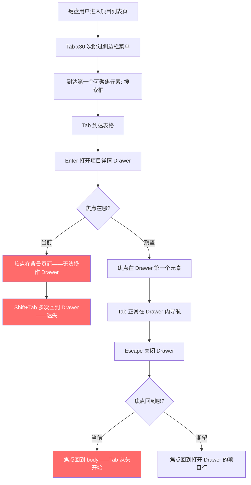
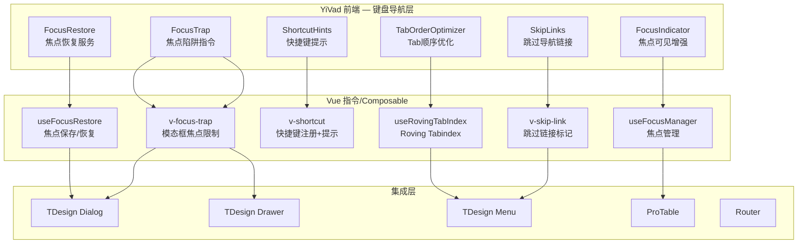
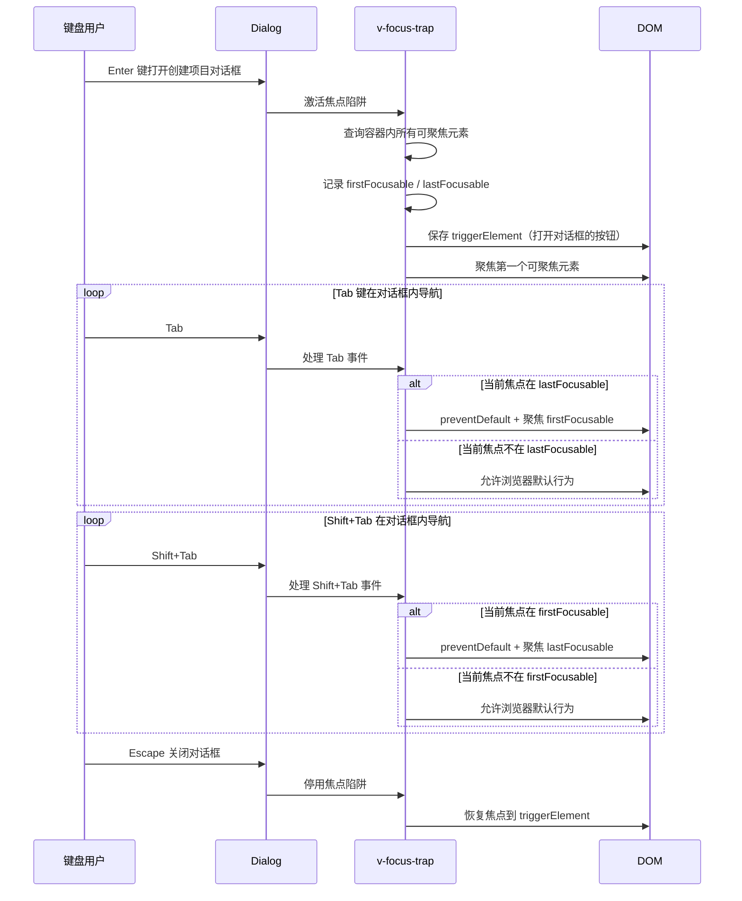

# YV-09-139: 键盘导航优化 — 全站键盘导航审计与增强、模态框焦点陷阱、跳过内容链接、Tab顺序优化、焦点可见指示器、快捷键可发现性

> 需求编号：YV-09-139 · 优先级：P2 · 人天：0.3d · 状态：需求已编写
> 依赖：YV-09-43（全局快捷键框架——共享快捷键注册基础设施）、YV-09-13（Module页面优化——知识管理面板早期布局参考）

## 背景

### 问题陈述

YiVad 管理后台是一个数据密集型应用——用户每天在表格、表单、导航之间频繁切换。对于依赖键盘操作的用户（包括运动障碍用户、高级效率用户、使用屏幕阅读器的用户），当前的键盘导航体验存在严重缺陷：

1. **Tab 键导航断裂**：页面中存在大量不可聚焦的交互元素（自定义下拉菜单、右键菜单、Tooltip），键盘用户无法通过 Tab 访问这些功能——功能对键盘用户完全不可见
2. **焦点陷阱缺失**：打开模态框（如创建项目对话框、确认删除对话框）后，Tab 焦点可以逃逸到模态框背后的页面元素——导致键盘用户"迷失"在背景页面中
3. **无跳过导航链接**：键盘用户每次进入新页面必须 Tab 经过侧边栏所有菜单项（可能 30+ 项）才能到达主内容区——极其低效
4. **焦点指示器不可见**：TDesign 默认 `:focus-visible` 样式在某些组件上被覆盖或透明——用户按 Tab 后不知道当前焦点在哪里
5. **快捷键不可发现**：已有关键快捷（如 Ctrl+K 搜索、Ctrl+S 保存）没有可视化的发现机制——新用户完全不知道这些快捷键存在

**核心矛盾**：YiVad 的交互设计围绕鼠标点击构建——自定义组件默认不可聚焦、焦点管理依赖浏览器默认行为（通常不够用）、键盘导航被视为"锦上添花"而非"一等公民"。这违反了 WCAG 2.1 AA 标准（指南 2.1：键盘可访问、指南 2.4：可导航）。

### 影响范围

| # | 影响 | 严重程度 | 典型场景 |
|---|------|----------|----------|
| 1 | 键盘用户无法访问自定义组件 | 高 | 右键菜单通过 `contextmenu` 事件触发，Tab 无法到达 |
| 2 | 模态框中焦点逃逸到背景 | 高 | 删除确认对话框中按 Tab，焦点跑到背后页面的输入框 |
| 3 | 侧边栏导航消耗大量 Tab 次数 | 高 | 30 个菜单项 → 需要 30 次 Tab 才能到达主内容 |
| 4 | 焦点位置不可见 | 高 | 按 Tab 5 次后不知道焦点在哪个元素上 |
| 5 | 快捷键无人知晓 | 中 | 存在 15 个快捷键，但用户只知道 Ctrl+K |

### 挑战

| 挑战 | 说明 |
|------|------|
| 焦点陷阱实现 | 模态框的焦点需要循环在第一个和最后一个可聚焦元素之间——需要精确计算可聚焦元素列表 |
| 焦点恢复 | 关闭模态框后，焦点需要回到打开模态框之前的元素——需要在打开时保存引用 |
| 动态内容焦点管理 | 路由切换、数据加载后新增元素需要焦点迁移——如 ProTable 刷新后焦点可能丢失 |
| 跳过导航链接可见性 | Skip Link 通常对视觉用户隐藏（仅 `:focus` 时显示），但实现不当会影响布局 |
| 与 TDesign 组件兼容 | TDesign 的 Dialog/Drawer/Dropdown 已有部分焦点管理——自定义增强不能与之冲突 |

---

## 一、现状分析

### 1.1 当前键盘导航状况

```
YiVad 键盘导航现状:
├── 基础浏览器行为
│   ├── Tab/Shift+Tab 在标准表单元素间导航 ✅
│   ├── Enter/Space 激活按钮和链接 ✅
│   ├── 方向键在 <select> 中导航 ✅
│   └── Escape 关闭浏览器原生弹窗 ✅
├── TDesign 内置键盘支持
│   ├── Dialog: Escape 关闭 ✅
│   ├── Menu: Enter/Space 展开子菜单 ✅
│   ├── Table: Tab 在单元格间导航 ✅
│   └── Select: 方向键选择 + Enter 确认 ✅
├── 自定义键盘支持
│   ├── Ctrl+K 全局搜索 (YV-09-43) ✅
│   ├── Ctrl+S 保存表单 (YV-09-43) ✅
│   └── Escape 关闭部分弹窗 ✅
├── 缺失:
│   ├── 焦点陷阱 (Focus Trap) — 模态框/Drawer              # ❌ 无
│   ├── 跳过导航链接 (Skip Link)                           # ❌ 无
│   ├── 焦点可见指示器增强 (Focus Visible)                   # ❌ 部分
│   ├── Tab 顺序审计 (Tab Order Audit)                      # ❌ 无
│   ├── 快捷键可发现性 (Shortcut Discoverability)            # ❌ 无
│   ├── Roving Tab Index — 列表/工具栏导航                  # ❌ 无
│   ├── 自定义组件焦点管理 — 右键菜单/Dropdown               # ❌ 无
│   └── 路由切换后焦点迁移 — 自动聚焦主内容                   # ❌ 无
```

### 1.2 典型键盘导航痛点流程



### 1.3 根因分析矩阵

| 问题 | 根因 | 影响范围 | 解决优先级 |
|------|------|----------|------------|
| 模态框焦点逃逸 | 无 Focus Trap 实现 | 所有 Dialog/Drawer | P0 |
| Tab 路径过长 | 无 Skip Link，侧边栏无键盘优化 | 所有页面 | P0 |
| 焦点指示器缺失 | `outline: none` 被滥用 | 全局 | P0 |
| 快捷键不可见 | 无快捷键提示 UI | 所有用户 | P1 |
| 自定义组件不可聚焦 | 未设置 tabindex/role | 右键菜单/Dropdown | P1 |
| 焦点恢复缺失 | 关闭模态框后焦点丢失 | 所有 Dialog/Drawer | P1 |

---

## 二、设计决策

### 2.1 方案对比：Focus Trap 实现方式

| 方案 | 描述 | 优点 | 缺点 | 决策 |
|------|------|------|------|------|
| A: 基于 focus-trap 库 | 使用 focus-trap npm 包 | 成熟稳定，边界处理完善 | 额外依赖（~5KB），可能与 TDesign 冲突 | 不采用 |
| B: 自定义 Vue 指令 `v-focus-trap` | 使用 `v-focus-trap` 指令包裹模态框容器 | 零依赖，与TDesign无缝集成 | 需要自行处理边界（动态内容、iframe） | **采用** |
| C: TDesign 内置 | 完全依赖 TDesign Dialog/Drawer 的键盘支持 | 零工作量 | TDesign 的焦点管理不完善——Dialog 焦点不循环 | 不采用 |

### 2.2 方案对比：Skip Link 实现方式

| 方案 | 描述 | 优点 | 缺点 | 决策 |
|------|------|------|------|------|
| A: 单 Skip Link | 仅"跳到主内容"一个链接 | 简单 | 功能有限 | 不采用 |
| B: 导航地标 Skip Links | 多个跳过链接——跳到主内容、跳到导航、跳到搜索 | 功能全面 | 占用更多视觉空间 | **采用** |
| C: 无视觉 Skip Link | 仅屏幕阅读器可见 | 不干扰视觉设计 | 键盘视力正常用户无法使用 | 不采用 |

### 2.3 方案对比：Tab 顺序优化

| 方案 | 描述 | 优点 | 缺点 | 决策 |
|------|------|------|------|------|
| A: 静态 tabindex 调整 | 在模板中硬编码 tabindex 值 | 简单直接 | 不够灵活——动态内容无法处理 | 不采用 |
| B: Roving Tab Index 模式 | 工具栏/列表中使用 roving tabindex——只有当前项 tabindex=0 | 符合 WAI-ARIA 最佳实践 | 实现较复杂 | **采用** |
| C: 完全依赖默认 Tab 顺序 | 不做调整 | 零工作量 | 导航效率低 | 不采用 |

### 2.4 方案对比：快捷键可发现性

| 方案 | 描述 | 优点 | 缺点 | 决策 |
|------|------|------|------|------|
| A: 独立帮助页面 | `/help/shortcuts` 页面列出所有快捷键 | 实现简单 | 用户不会主动访问 | 不采用 |
| B: 快捷键提示面板 | 按 `?` 弹出快捷键速查面板 | 随时可用，入口统一 | 用户需知道 `?` 这个快捷键 | 不采用 |
| C: 上下文提示 + 全局面板 | 按钮 hover 时 tooltip 显示快捷键 + `?` 打开全局面板 | 发现性和便捷性的平衡 | 开发量稍大 | **采用** |

---

## 三、目标架构

### 3.1 键盘导航增强架构



### 3.2 焦点陷阱生命周期



### 3.3 Skip Links 组件结构

```
SkipLinks 组件:
├── 渲染位置: 页面最顶部——body 第一个元素
├── 视觉行为: 默认隐藏（transform: translateY(-100%)）
│              Tab 聚焦时滑入可视区域
├── 链接列表:
│   ├── 跳到主内容 (href="#main-content")
│   ├── 跳到侧边栏导航 (href="#sidebar-nav")
│   ├── 跳到全局搜索 (href="#global-search")
│   └── 跳到页脚 (href="#page-footer")
└── 键盘行为:
    ├── Tab: 依次在各链接间导航
    ├── Enter: 激活链接——跳转并聚焦目标
    └── 跳转后: 目标元素获得 tabindex="-1" + focus()
```

### 3.4 焦点可见指示器 CSS

```css
/* 全局焦点指示器增强 */
:focus-visible {
  outline: 2px solid var(--yi-primary-color) !important;
  outline-offset: 2px !important;
  border-radius: 2px;
}

/* TDesign 组件焦点覆盖 */
.t-button:focus-visible {
  box-shadow: 0 0 0 2px var(--yi-primary-color-light);
  outline: none;
}

.t-input:focus-visible {
  border-color: var(--yi-primary-color);
  box-shadow: 0 0 0 2px var(--yi-primary-color-light);
}

.t-table__row:focus-visible {
  outline: 2px solid var(--yi-primary-color);
  outline-offset: -2px;
}

/* 焦点不应被隐藏的组件明确声明 */
[data-focus-hidden="true"] {
  outline: none !important;
}
```

---

## 四、具体改动

### 4.1 YiVad 前端 — v-focus-trap 指令

```typescript
// src/directives/focus-trap.ts (新增)

import type { Directive, DirectiveBinding } from 'vue';

// 可聚焦元素选择器
const FOCUSABLE_SELECTOR = [
  'a[href]',
  'button:not([disabled])',
  'input:not([disabled]):not([type="hidden"])',
  'select:not([disabled])',
  'textarea:not([disabled])',
  '[tabindex]:not([tabindex="-1"])',
  'audio[controls]',
  'video[controls]',
  '[contenteditable]:not([contenteditable="false"])',
].join(', ');

interface FocusTrapState {
  container: HTMLElement;
  triggerElement: HTMLElement | null;
  firstFocusable: HTMLElement | null;
  lastFocusable: HTMLElement | null;
  handleKeyDown: (e: KeyboardEvent) => void;
}

function getFocusableElements(container: HTMLElement): HTMLElement[] {
  return Array.from(container.querySelectorAll(FOCUSABLE_SELECTOR))
    .filter(el => {
      const htmlEl = el as HTMLElement;
      // 过滤不可见元素
      return htmlEl.offsetParent !== null
        && !htmlEl.hasAttribute('disabled')
        && htmlEl.getAttribute('aria-hidden') !== 'true';
    });
}

function updateFocusableCache(state: FocusTrapState) {
  const elements = getFocusableElements(state.container);
  state.firstFocusable = elements[0] || null;
  state.lastFocusable = elements[elements.length - 1] || null;
}

export const vFocusTrap: Directive<HTMLElement, boolean> = {
  mounted(el: HTMLElement, binding: DirectiveBinding<boolean>) {
    if (!binding.value) return;

    const state: FocusTrapState = {
      container: el,
      triggerElement: document.activeElement as HTMLElement,
      firstFocusable: null,
      lastFocusable: null,
      handleKeyDown: (e: KeyboardEvent) => {
        if (e.key !== 'Tab') return;

        updateFocusableCache(state);

        if (!state.firstFocusable || !state.lastFocusable) return;

        if (e.shiftKey) {
          // Shift+Tab: 如果当前焦点在第一个元素，循环到最后
          if (document.activeElement === state.firstFocusable) {
            e.preventDefault();
            state.lastFocusable.focus();
          }
        } else {
          // Tab: 如果当前焦点在最后一个元素，循环到第一个
          if (document.activeElement === state.lastFocusable) {
            e.preventDefault();
            state.firstFocusable.focus();
          }
        }
      },
    };

    // 延迟聚焦——等待 DOM 渲染完成
    requestAnimationFrame(() => {
      updateFocusableCache(state);
      // 优先聚焦 [data-autofocus] 元素
      const autofocus = el.querySelector('[data-autofocus]') as HTMLElement;
      (autofocus || state.firstFocusable)?.focus();
    });

    el.addEventListener('keydown', state.handleKeyDown);
    (el as any).__focusTrapState = state;
  },

  updated(el: HTMLElement, binding: DirectiveBinding<boolean>) {
    if (!binding.value) return;
    const state = (el as any).__focusTrapState as FocusTrapState | undefined;
    if (state) {
      // DOM 更新后刷新可聚焦元素缓存
      requestAnimationFrame(() => updateFocusableCache(state));
    }
  },

  unmounted(el: HTMLElement) {
    const state = (el as any).__focusTrapState as FocusTrapState | undefined;
    if (!state) return;
    el.removeEventListener('keydown', state.handleKeyDown);
    // 恢复焦点
    state.triggerElement?.focus();
  },
};
```

### 4.2 YiVad 前端 — SkipLinks 组件

```typescript
// src/components/accessibility/SkipLinks.vue (新增)

// <template>
//   <nav class="skip-links" aria-label="跳过导航">
//     <ul>
//       <li v-for="link in links" :key="link.href">
//         <a :href="link.href" @click.prevent="skipTo(link.href)">
//           {{ link.label }}
//         </a>
//       </li>
//     </ul>
//   </nav>
// </template>
//
// <script setup lang="ts">
// const links = [
//   { href: '#main-content', label: '跳到主内容' },
//   { href: '#sidebar-nav', label: '跳到侧边栏导航' },
//   { href: '#global-search', label: '跳到全局搜索' },
// ];
//
// function skipTo(href: string) {
//   const target = document.querySelector(href);
//   if (!target) return;
//   // 使目标可聚焦
//   target.setAttribute('tabindex', '-1');
//   target.focus();
//   // 焦点移开后恢复
//   target.addEventListener('blur', () => {
//     target.removeAttribute('tabindex');
//   }, { once: true });
// }
// </script>
//
// <style scoped>
// .skip-links {
//   position: fixed;
//   top: 0;
//   left: 0;
//   z-index: 10000;
//   transform: translateY(-100%);
//   transition: transform 0.2s;
// }
// .skip-links:focus-within {
//   transform: translateY(0);
// }
// .skip-links ul {
//   display: flex;
//   gap: 8px;
//   padding: 8px 16px;
//   background: var(--yi-bg-color);
//   border-bottom: 2px solid var(--yi-primary-color);
// }
// </style>
```

### 4.3 文件变更清单

| 文件 | 操作 | 说明 |
|------|------|------|
| `YiVad/src/directives/focus-trap.ts` | 新增 | v-focus-trap 指令 |
| `YiVad/src/directives/focus-restore.ts` | 新增 | v-focus-restore 指令（焦点保存/恢复） |
| `YiVad/src/components/accessibility/SkipLinks.vue` | 新增 | 跳过导航链接组件 |
| `YiVad/src/components/accessibility/FocusAnnouncer.vue` | 新增 | 焦点状态屏幕阅读器播报 |
| `YiVad/src/composables/useRovingTabIndex.ts` | 新增 | Roving Tab Index 模式 composable |
| `YiVad/src/composables/useFocusManager.ts` | 新增 | 焦点管理 composable（保存/恢复/迁移） |
| `YiVad/src/composables/useKeyboardShortcuts.ts` | 修改 | 添加快捷键提示绑定 |
| `YiVad/src/styles/focus-visible.css` | 新增 | 全局焦点可见指示器样式 |
| `YiVad/src/styles/skip-links.css` | 新增 | Skip Links 样式 |
| `YiVad/src/App.vue` | 修改 | 添加 SkipLinks 组件、全局注册指令 |
| `YiVad/src/layouts/MainLayout.vue` | 修改 | 侧边栏菜单添加 Roving Tab Index 支持 |
| `YiVad/src/router/index.ts` | 修改 | 路由切换后聚焦主内容区 |
| `YiVad/src/views/**/*.vue` | 修改 | Dialog/Drawer 添加 v-focus-trap、快捷键 tooltip |
| `YiVad/src/components/pro-table/ProTable.vue` | 修改 | 表格行添加键盘导航 |

---

## 五、实施步骤

| 步骤 | 操作 | 路径 | 验证 | 人天 |
|------|------|------|------|------|
| 1 | 审计当前键盘导航状况——遍历所有页面记录 Tab 顺序、焦点问题 | 全站 | 生成审计报告——列出所有不符合 WCAG 2.1 AA 的项目 | 0.04 |
| 2 | 实现 v-focus-trap 指令 | `src/directives/focus-trap.ts` | 模态框内 Tab 循环——焦点不逃逸；Shift+Tab 反向循环 | 0.05 |
| 3 | 实现 SkipLinks 组件 + 全局注册 | `src/components/accessibility/SkipLinks.vue` + `App.vue` | Tab 首次出现 Skip Links——Enter 跳转到目标区域 | 0.03 |
| 4 | 实现焦点可见指示器全局样式 | `src/styles/focus-visible.css` | 所有可聚焦元素在 Tab 导航时显示明显轮廓 | 0.02 |
| 5 | 实现 Roving Tab Index + 侧边栏适配 | `src/composables/useRovingTabIndex.ts` + `MainLayout.vue` | 侧边栏菜单左右方向键导航——Tab 只进入/离开菜单组 | 0.04 |
| 6 | Dialog/Drawer 添加 v-focus-trap + 快捷键 tooltip | `src/views/**/*.vue` | 所有模态框焦点不逃逸——关闭后焦点恢复——按钮 tooltip 显示快捷键 | 0.05 |
| 7 | 路由切换焦点迁移 + 审计验证 | `src/router/index.ts` + 全站回归检查 | 路由切换后聚焦 main-content——Tab 路径显著缩短 | 0.05 |

**总人天：0.28d ≈ 0.3d**

---

## 六、测试规格

### 场景 1：模态框焦点陷阱

**GIVEN** 用户通过键盘导航到"新建项目"按钮并按 Enter
**WHEN** 创建项目对话框打开
**THEN** 焦点自动移动到对话框第一个输入框（项目名称）
**WHEN** 用户连续按 Tab 键
**THEN** 焦点在对话框内的输入框、下拉选择、取消按钮、确认按钮之间循环——焦点永远不会逃逸到背景页面
**WHEN** 用户按 Shift+Tab
**THEN** 焦点反向循环
**WHEN** 用户按 Escape
**THEN** 对话框关闭——焦点恢复到"新建项目"按钮

### 场景 2：Skip Links 跳过导航

**GIVEN** 用户通过键盘导航进入任一页面
**WHEN** 用户按 Tab
**THEN** 页面顶部出现 Skip Links 面板（"跳到主内容"、"跳到侧边栏导航"、"跳到全局搜索"）
**WHEN** 用户按 Enter 选择"跳到主内容"
**THEN** 页面滚动到主内容区且焦点在主内容区
**AND** Skip Links 面板收起
**AND** 后续 Tab 在主内容区导航——不再需要经过侧边栏

### 场景 3：Roving Tab Index 侧边栏

**GIVEN** 用户在侧边栏菜单中
**WHEN** 用户按 Tab 进入侧边栏菜单
**THEN** 当前激活的菜单项获得焦点
**WHEN** 用户按向下方向键
**THEN** 焦点移动到下一个菜单项（上一个菜单项 tabindex 变为 -1）
**WHEN** 用户按向上方向键
**THEN** 焦点移动到上一个菜单项
**WHEN** 用户按向右方向键在有子菜单的项上
**THEN** 展开子菜单——焦点移动到第一个子项
**WHEN** 用户按 Tab
**THEN** 焦点离开菜单——进入主内容区

### 场景 4：焦点可见指示器

**GIVEN** 用户使用 Tab 键在页面上导航
**WHEN** 用户按 Tab 将焦点移到任意按钮
**THEN** 按钮显示明显的 2px 蓝色轮廓（outline + outline-offset）
**WHEN** 用户将焦点移到输入框
**THEN** 输入框显示蓝色边框 + 外发光效果
**WHEN** 用户将焦点移到表格行
**THEN** 表格行显示内嵌轮廓
**WHEN** 用户使用鼠标点击元素
**THEN** 不显示焦点轮廓（`:focus-visible` 仅键盘触发）

### 场景 5：快捷键工具提示

**GIVEN** 用户鼠标悬停在"保存"按钮上
**THEN** Tooltip 显示"保存 (Ctrl+S)"
**WHEN** 用户悬停在"全局搜索"按钮上
**THEN** Tooltip 显示"搜索 (Ctrl+K)"
**WHEN** 用户按 `?` 键
**THEN** 弹出快捷键速查面板——列出所有可用快捷键——按 Esc 关闭

### 场景 6：动态内容焦点管理

**GIVEN** 用户在数据管理页面中删除了一条记录
**WHEN** 删除确认对话框关闭
**THEN** 焦点恢复到删除按钮（在已删除行的位置）
**WHEN** 该行已不存在（焦点回到表格中相邻的行按钮）
**AND** 如果表格已空——焦点回到"新建"按钮

---

## 七、风险与缓解

| 风险 | 概率 | 影响 | 缓解措施 |
|------|------|------|----------|
| v-focus-trap 与 TDesign Dialog 动画冲突 | 中 | 中 | 在 Dialog `onOpened` 事件（动画完成后）激活焦点陷阱；在 `onClose` 事件前恢复焦点 |
| 焦点可见样式破坏 TDesign 设计规范 | 高 | 低 | `outline-offset: 2px` 保持距离；TDesign 组件使用 `box-shadow` 替代 `outline`；提供 `data-focus-hidden` 排除机制 |
| iframe 内嵌页面焦点陷阱失效 | 中 | 低 | 文档说明 iframe 内容的焦点管理由 iframe 自行负责；Skip Links 跳过 iframe |
| 动态加载内容破坏焦点陷阱 | 低 | 中 | v-focus-trap 在 MutationObserver 触发时重新计算可聚焦元素列表 |
| 部分 TDesign 组件不支持 Tab 导航 | 中 | 中 | 为不支持 Tab 的组件手动添加 `tabindex="0"` 和键盘事件处理 |

---

## 八、回滚策略

| 场景 | 回滚操作 | 影响 |
|------|----------|------|
| 焦点陷阱导致模态框无法关闭 | 移除 v-focus-trap 指令——Dialog/Drawer 回退到无焦点管理 | 焦点逃逸问题恢复——但功能可用 |
| Skip Links 遮挡页面顶部内容 | 移除 SkipLinks 组件——全局注册行注释 | 键盘用户需 Tab 通过侧边栏 |
| 焦点样式被用户投诉"太丑" | 替换 focus-visible.css 为更细的样式（1px, 更淡的颜色） | 焦点可见性降低 |
| Roving Tab Index 与 TDesign Menu 冲突 | 移除侧边栏的 Roving Tab Index——回退到标准 Tab 导航 | 侧边栏导航效率降低 |

---

## 九、设计决策记录

### D-01：为什么不用 focus-trap 库而是自定义指令？

focus-trap 库功能完善但体积约 5KB——对于一个只需要 Tab 循环和焦点恢复的场景过于厚重。自定义 v-focus-trap 指令约 100 行代码——能精确控制焦点行为——且与 Vue 3 生命周期和 TDesign 组件紧密集成。额外好处是可以用 MutationObserver 处理动态内容的焦点更新——这是 focus-trap 库不提供的。

### D-02：为什么侧边栏使用 Roving Tab Index 而非标准 Tab 导航？

标准 Tab 导航意味着侧边栏 30+ 个菜单项每个都需要一次 Tab——键盘用户从页面顶部到主内容需要 30 多次 Tab。Roving Tab Index 将整个菜单组视为单个 Tab Stop——用户 Tab 进入菜单后使用方向键导航——将导航次数从 30+ 减少到 1。这是 WAI-ARIA 推荐的菜单键盘交互模式。

### D-03：为什么 Skip Links 在聚焦时才显示？

Skip Links 面向键盘用户和屏幕阅读器用户——对鼠标用户没有价值且占用屏幕空间。`:focus-within` 伪类实现了"需要时才显示"的交互——Tab 到 Skip Links 时自动滑入——选择后自动隐藏。这符合大多数无障碍最佳实践（如 GOV.UK、Github 的实现）。

### D-04：为什么快捷键提示使用 Tooltip + 全局面板双重机制？

Tooltip 提供上下文提示——用户悬停按钮时顺便看到快捷键——无需主动查询。全局面板（`?` 键触发）提供全局视角——用户可以浏览所有快捷键——发现不知道的功能。两种机制互补——覆盖"被动发现"和"主动学习"两种场景。

---

## 十、可观测性

### 指标

| 指标 | 类型 | 说明 |
|------|------|------|
| `yivad.a11y.skip_link_usage` | Counter | Skip Link 使用次数（按目标） |
| `yivad.a11y.focus_trap_active` | Gauge | 当前激活的焦点陷阱数 |
| `yivad.a11y.shortcut_panel_open` | Counter | 快捷键面板打开次数 |
| `yivad.a11y.keyboard_vs_mouse_ratio` | Gauge | 键盘操作 vs 鼠标操作比例 |
| `yivad.a11y.tab_path_length` | Histogram | 从页面入口到主内容的 Tab 次数 |

### 告警

| 告警 | 条件 | 级别 |
|------|------|------|
| 焦点陷阱泄漏 | 模态框关闭后焦点陷阱状态未清理 | WARNING |
| Tab 路径过长 | 任意页面 Tab 到主内容 > 5 次 | INFO |

---

## 十一、代码审查检查清单

- [ ] v-focus-trap 指令：Tab 在模态框内循环，Shift+Tab 反向循环，Escape 关闭后焦点恢复
- [ ] v-focus-trap 指令：handleKeyDown 在 unmounted 时正确移除
- [ ] SkipLinks 组件：Tab 到达时显示，跳转后正确聚焦目标
- [ ] SkipLinks 组件：目标元素添加 tabindex="-1" 后正确移除
- [ ] Roving Tab Index：侧边栏菜单支持方向键导航
- [ ] 焦点可见样式：`:focus-visible` 覆盖所有可聚焦组件
- [ ] 焦点可见样式：鼠标点击不触发焦点样式
- [ ] 所有 Dialog/Drawer 使用 v-focus-trap 指令
- [ ] 所有按钮快捷键在 tooltip 中显示
- [ ] 路由切换后 `#main-content` 获得焦点
- [ ] 无 `outline: none` 滥用（除非有替代焦点指示）
- [ ] `?` 键打开快捷键面板，Escape 关闭
- [ ] MutationObserver 处理动态内容焦点更新
- [ ] 测试覆盖：焦点陷阱、Skip Links、Tab 顺序

---

## 回归问题预测

| # | 预测问题 | 原因 | 验证方法 |
|---|---------|------|---------|
| 1 | 打开 Dialog → Tab 到最后一个元素 → 再 Tab → 焦点跳到浏览器地址栏而非循环回第一个元素 | lastFocusable 选择器遗漏了 Dialog footer 中的按钮（因为 footer 是 Teleport 渲染的） | 打开任意 Dialog → Tab 遍历所有元素 → 验证焦点在 Dialog 内循环——不跳到地址栏 |
| 2 | Skip Links 跳转到 `#main-content` 后，屏幕阅读器不播报"已跳转到主内容" | main-content 元素缺少 `aria-label` 或 `role="main"` | 打开屏幕阅读器 → Tab 到 Skip Links → 选择"跳到主内容" → 验证屏幕阅读器播报区域信息 |
| 3 | ProTable 编辑行内数据后，焦点从编辑输入框消失——按 Tab 后焦点跑到表格外 | ProTable 行内编辑切换输入框时——旧的输入框被销毁——焦点丢失 | 在表格中编辑一行数据 → 按 Tab → 验证焦点移动到下一个可编辑单元格而非表格外 |
| 4 | 移动端/触屏设备上 `:focus-visible` 样式同时出现在触屏点击和键盘导航上 | 触屏浏览器对 `:focus-visible` 的支持不一致（Safari iOS 在触屏点击时也触发） | iPad Safari 打开 YiVad → 触屏点击按钮 → 验证不显示焦点轮廓（期望——触屏无轮廓） |
| 5 | Drawer 中使用 v-focus-trap，但 Drawer 内有异步加载的组件（如 Select 的选项列表），在加载完成前可聚焦元素列表不完整 | 焦点陷阱在 mounted 时计算——但异步组件在 mounted 后才渲染 | 打开有异步内容的 Drawer → 等待内容加载 → Tab 导航 → 验证所有加载后的元素都在焦点循环中 |
| 6 | Roving Tab Index 在侧边栏菜单折叠/展开时，焦点位置计算错误——焦点跳到不存在的菜单项 | 菜单展开/折叠改变了 DOM 结构，但 Roving Tab Index 的索引未更新 | 折叠侧边栏顶级菜单 → 展开另一个菜单 → 方向键导航 → 验证焦点始终在可见菜单项上 |

---

## 性能分析

### 关键操作耗时

| 操作 | 耗时 | 说明 |
|------|------|------|
| v-focus-trap mounted | < 3ms | 查询可聚焦元素 + 注册事件监听 |
| 焦点循环（Tab/Shift+Tab） | < 1ms | keydown 事件处理 |
| Skip Links 显示/隐藏 | < 16ms | CSS transition (transform) |
| Roving Tab Index 导航 | < 1ms | 更新 tabindex 属性 |
| MutationObserver 回调 | < 2ms | 刷新可聚焦元素缓存 |
| 焦点恢复（Dialog 关闭） | < 1ms | triggerElement.focus() |

### 内存影响

| 资源 | 增量 | 说明 |
|------|------|------|
| 每个 v-focus-trap 实例 | ~200 bytes | FocusTrapState 对象 |
| MutationObserver | 1 个共享实例 | 全局监测模态框 DOM 变化 |
| SkipLinks 组件 | ~1KB | 静态组件，单例 |

---

## 相关文档

- [全局快捷键框架](43-需求-全局快捷键框架.md) — 快捷键注册基础设施
- [Module页面优化](13-需求-Module页面优化.md) — 页面布局参考

*PRD 来源: `projects/yivad/requirements/2026-09/139-需求-键盘导航优化.md`*

