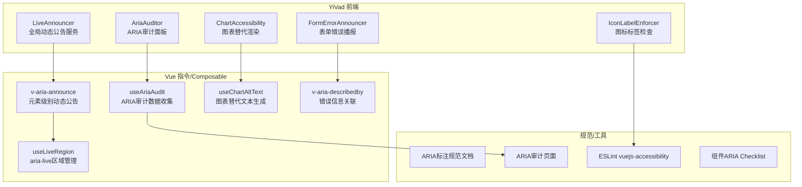
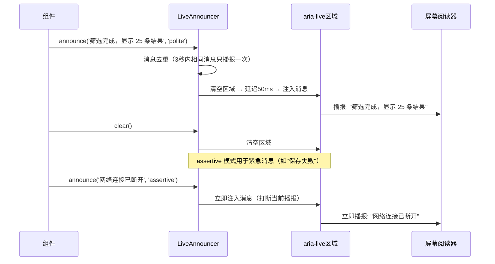

# YV-09-140: 屏幕阅读器优化 — ARIA标签/活动区域/角色、动态内容公告、表单错误播报、替代文本审计工具

> 需求编号：YV-09-140 · 优先级：P2 · 人天：0.3d · 状态：需求已编写
> 依赖：YV-09-139（键盘导航优化——屏幕阅读器用户同时也是键盘用户）、YV-09-25（表单验证框架——共享表单错误状态）

## 背景

### 问题陈述

YiVad 管理后台是一个信息密集型应用——页面包含大量动态更新的数据（表格排序、筛选结果、通知弹窗）、复杂的交互组件（ProTable、Kanban、甘特图）和富内容（图表、嵌入页面）。对于使用屏幕阅读器的视障用户，当前页面有大量信息是"不可见"的——屏幕阅读器无法正确解读页面结构、状态变化和交互结果：

1. **ARIA 标签大量缺失**：自定义组件（ProTable 排序按钮、Kanban 卡片拖拽手柄、甘特图时间轴）没有 ARIA 标签——屏幕阅读器播报"按钮"或"可点击元素"——用户不知道按钮的功能
2. **动态内容更新无感知**：ProTable 筛选后数据刷新、通知中心新消息到达、仪表盘数据更新——屏幕阅读器用户完全不知道页面内容已变化
3. **表单错误无播报**：表单验证失败时错误信息以红色文字显示——屏幕阅读器用户不知道验证失败——也不清楚哪里错了
4. **语义角色混乱**：自定义组件使用 `<div>` + `@click` 构建——缺少 `role` 属性——屏幕阅读器将其识别为"文本"而非"按钮"或"列表"
5. **图表/图片无可访问替代**：仪表盘中的 ECharts 图表、用户头像、功能图标——均缺少 `alt` 文本或 `aria-label`——对屏幕阅读器用户是"黑洞"
6. **无审计工具**：开发团队无法系统性地检查哪些页面和组件缺少 ARIA 标注——修复依赖手动逐个页面检查

**核心矛盾**：YiVad 的视觉设计传达了大量信息（颜色、布局、动画、图标）——这些信息对屏幕阅读器用户完全不可用。要达到 WCAG 2.1 AA 标准（指南 1.1：文本替代、指南 1.3：可适应、指南 4.1：兼容），需要系统性地为所有交互元素添加 ARIA 标注。

### 影响范围

| # | 影响 | 严重程度 | 典型场景 |
|---|------|----------|----------|
| 1 | 自定义组件无 ARIA 标签 | 高 | 屏幕阅读器播报"按钮"——用户不知道是"排序"还是"删除" |
| 2 | 动态更新无感知 | 高 | 筛选后数据变了——屏幕阅读器用户以为页面没反应 |
| 3 | 表单错误无声 | 高 | 提交表单失败——错误信息在视觉上显示——屏幕阅读器用户不知道 |
| 4 | 图标/图表无替代文本 | 高 | 仪表盘的关键KPI图表——屏幕阅读器用户完全无法获取信息 |
| 5 | 语义角色缺失 | 中 | 自定义 Tab 切换被识别为"文本"——用户不知道可以交互 |
| 6 | 无系统化审计能力 | 中 | 不知道哪些组件缺失 ARIA——修复工作无优先级 |

### 挑战

| 挑战 | 说明 |
|------|------|
| ARIA 标签维护成本 | 需要为 100+ 个自定义组件添加 ARIA 标签——需要制定标签命名规范和审核流程 |
| 动态内容公告时机 | `aria-live` 区域的公告频率和时机需要精确控制——过于频繁的公告会干扰用户 |
| 图表可访问性 | ECharts 图表本质上是 Canvas 绘制——没有 DOM 结构——屏幕阅读器无法解析 |
| 与 TDesign ARIA 兼容 | TDesign 组件已有部分 ARIA 属性——自定义增强不能与之冲突或产生冗余播报 |
| 多语言场景 | 如果未来开启国际化——ARIA 标签需要跟随语言切换——硬编码中文标签会成为债务 |

---

## 一、现状分析

### 1.1 当前 ARIA 覆盖状况

```
YiVad ARIA 覆盖现状:
├── TDesign 内置 ARIA
│   ├── t-button: role="button" + aria-disabled ✅
│   ├── t-input: role="textbox" + aria-label（部分） ✅
│   ├── t-dialog: role="dialog" + aria-modal ✅
│   ├── t-table: role="table/grid" + aria-sort（部分） ✅
│   └── t-menu: role="menu/menuitem" ✅
├── 自定义组件 ARIA: ❌ 大部分缺失
│
缺失:
├── ProTable
│   ├── 排序按钮: 无 aria-sort                                    # ❌
│   ├── 筛选下拉: 无 aria-label/aria-expanded                     # ❌
│   ├── 行选择复选框: 无 aria-label                               # ❌
│   └── 分页器: 无 aria-label="第X页，共Y页"                      # ❌
├── Kanban
│   ├── 卡片: 无 role="listitem" + 拖拽手柄无 aria-label           # ❌
│   └── 列: 无 role="list" + aria-label                           # ❌
├── 甘特图
│   ├── 时间轴: 纯 Canvas/SVG——无任何 ARIA                        # ❌
│   └── 任务条: 无 role + aria-label                              # ❌
├── 全局
│   ├── 通知 Toast: 无 aria-live 播报                              # ❌
│   ├── 仪表盘图表: ECharts Canvas 无替代文本                      # ❌
│   ├── 图标按钮: 无 aria-label（如关闭按钮仅显示 X 图标）          # ❌
│   ├── Tab 切换: 无 role="tablist/tab/tabpanel"                  # ❌
│   ├── 面包屑: 无 aria-label="面包屑导航" + aria-current          # ❌
│   ├── 加载状态: 无 aria-busy + aria-live                        # ❌
│   └── 表单错误: 无 aria-describedby 关联错误信息                  # ❌
```

### 1.2 屏幕阅读器用户典型体验

```mermaid
graph TD
    A[屏幕阅读器用户进入项目列表] --> B[播报: "导航区域——列表——6个项目"]
    B --> C[播报: "按钮"——用户不知道是什么按钮]
    C --> D[用户按 Enter 激活按钮]
    D --> E[按钮执行了"排序"——但用户不知道]
    E --> F[表格数据变化——屏幕阅读器无反应]
    F --> G[用户以为点击无效——困惑]
    G --> H[用户尝试其他操作——迷失]

    style C fill:#ff6b6b,color:#fff
    style F fill:#ff6b6b,color:#fff
    style G fill:#ff6b6b,color:#fff
```

### 1.3 根因分析矩阵

| 问题 | 根因 | 影响范围 | 解决优先级 |
|------|------|----------|------------|
| 自定义组件无 ARIA | 开发时未考虑屏幕阅读器——无规范要求 | 所有自定义组件 | P0 |
| 动态更新无公告 | 无 aria-live 区域——动态变化不触发播报 | 所有数据页面 | P0 |
| 表单错误无播报 | 错误信息未关联到表单域——无 aria-describedby | 所有表单 | P0 |
| 图表无替代文本 | ECharts 输出 Canvas——无语义 HTML | 仪表盘/统计页 | P1 |
| 图标按钮无标签 | 仅使用图标无文本——无 aria-label | 所有工具栏 | P1 |
| 无审计机制 | 无自动化 ARIA 审计工具 | 全局 | P1 |

---

## 二、设计决策

### 2.1 方案对比：ARIA 标注策略

| 方案 | 描述 | 优点 | 缺点 | 决策 |
|------|------|------|------|------|
| A: 逐组件手动添加 | 在每个自定义组件模板中添加 ARIA 属性 | 精确控制 | 工作量大——容易遗漏——难以维护 | 不采用 |
| B: 使用 ESLint 插件 | eslint-plugin-jsx-a11y + vuejs-accessibility 强制 ARIA 规则 | 自动化检测 | 只能检测模板中的静态缺失——无法检测动态内容 | 辅助采用 |
| C: 规范 + 组件库增强 + ESLint | 制定 ARIA 规范——在基础组件中内置 ARIA——ESLint 兜底 | 系统化——可持续 | 前期投入稍大 | **采用** |

### 2.2 方案对比：动态内容公告策略

| 方案 | 描述 | 优点 | 缺点 | 决策 |
|------|------|------|------|------|
| A: 全局 aria-live 区域 | 页面底部放一个 aria-live="polite" 区域——所有动态公告注入到此 | 单点管理 | 所有公告混在一起——用户无法区分来源 | 不采用 |
| B: 分散 aria-live 区域 | 每个动态区域（通知、表格、仪表盘）有自己的 aria-live | 上下文清晰 | 管理复杂——容易遗漏 | 不采用 |
| C: 全局公告服务 + 组件级 aria-live | LiveAnnouncer 服务统一管理公告消息——组件级 aria-live 处理局部更新 | 集中和分散的平衡 | 实现稍复杂 | **采用** |

### 2.3 方案对比：ECharts 图表可访问性

| 方案 | 描述 | 优点 | 缺点 | 决策 |
|------|------|------|------|------|
| A: Canvas 内嵌文本 | 在 Canvas 中绘制可访问文本 | 与实际渲染一致 | Canvas 文本不可被屏幕阅读器访问 | 不采用 |
| B: 生成 HTML 表格替代 | 图表数据同时渲染为隐藏的 HTML 表格 | 屏幕阅读器可完整解读数据 | 数据量大时 HTML 表格冗长 | **采用** |
| C: 完全移除图表 | 对视障用户隐藏图表——不提供替代 | 零工作量 | 违反 WCAG——信息丢失 | 不采用 |

### 2.4 方案对比：ARIA 审计工具

| 方案 | 描述 | 优点 | 缺点 | 决策 |
|------|------|------|------|------|
| A: 依赖外部工具 | 使用 axe-core / Lighthouse 手动审计 | 功能完善 | 非持续集成——每次手动运行 | 辅助采用 |
| B: 开发内置审计面板 | YiVad 内置 ARIA 审计页面——扫描所有页面 | 随时可用——持续集成 | 开发工作量 | **采用** |
| C: CI 中集成 axe-core | 在 CI 中使用 axe-core 自动扫描 | 自动化 | 无法审计需要登录的页面——无法审计动态交互 | 辅助采用 |

---

## 三、目标架构

### 3.1 屏幕阅读器优化架构



### 3.2 LiveAnnouncer 消息流转



### 3.3 ARIA 审计面板数据模型

```typescript
// src/types/aria-audit.ts (新增)

interface AriaAuditReport {
  timestamp: string;
  url: string;
  totalElements: number;
  violations: AriaViolation[];
  score: number;  // 0-100
}

interface AriaViolation {
  id: string;
  element: string;            // CSS selector
  tag: string;                // HTML tag
  rule: string;               // 违反的规则
  severity: 'critical' | 'serious' | 'moderate' | 'minor';
  description: string;        // 问题描述
  recommendation: string;     // 修复建议
  category: 'label' | 'role' | 'live-region' | 'alt-text' | 'semantics' | 'contrast';
}

// 审计规则集
const ARIA_RULES = [
  {
    id: 'button-has-label',
    description: '按钮无 ARIA 标签',
    check: (el: HTMLElement) => {
      // button 或 role="button" 标签必须有 aria-label 或文本内容
      const isButton = el.tagName === 'BUTTON' || el.getAttribute('role') === 'button';
      if (!isButton) return null;
      const hasLabel = el.getAttribute('aria-label')
        || el.getAttribute('aria-labelledby')
        || (el.textContent?.trim() ?? '').length > 0;
      return hasLabel ? null : '按钮缺少可访问标签';
    },
    severity: 'critical',
  },
  {
    id: 'link-has-label',
    description: '链接无 ARIA 标签',
    check: (el: HTMLElement) => {
      if (el.tagName !== 'A') return null;
      const hasLabel = el.getAttribute('aria-label')
        || el.getAttribute('aria-labelledby')
        || (el.textContent?.trim() ?? '').length > 0;
      return hasLabel ? null : '链接缺少可访问标签';
    },
    severity: 'critical',
  },
  {
    id: 'image-has-alt',
    description: '图片无 alt 属性',
    check: (el: HTMLElement) => {
      if (el.tagName !== 'IMG') return null;
      return el.hasAttribute('alt') ? null : '图片缺少 alt 属性';
    },
    severity: 'critical',
  },
  {
    id: 'input-has-label',
    description: '输入框无关联标签',
    check: (el: HTMLElement) => {
      if (!['INPUT', 'SELECT', 'TEXTAREA'].includes(el.tagName)) return null;
      const hasLabel = el.getAttribute('aria-label')
        || el.getAttribute('aria-labelledby')
        || el.closest('label') !== null;
      return hasLabel ? null : '输入框缺少关联标签';
    },
    severity: 'critical',
  },
  {
    id: 'custom-component-has-role',
    description: '自定义交互组件无 role',
    check: (el: HTMLElement) => {
      // 检测 div/span 等非语义元素是否有 @click 但无 role
      const isNonSemantic = ['DIV', 'SPAN'].includes(el.tagName);
      if (!isNonSemantic) return null;
      const hasClick = el.onclick !== null || el.getAttribute('@click');
      const hasRole = el.hasAttribute('role');
      return (hasClick && !hasRole) ? '可点击的非语义元素缺少 role' : null;
    },
    severity: 'serious',
  },
  {
    id: 'aria-live-missing',
    description: '动态区域无 aria-live',
    check: (el: HTMLElement) => {
      // 检测可能的动态内容容器
      const hasAriaLive = el.hasAttribute('aria-live');
      // 通过 data 属性标记需要 aria-live 的区域
      const needsLive = el.hasAttribute('data-live-region');
      return (needsLive && !hasAriaLive) ? '动态内容区域缺少 aria-live' : null;
    },
    severity: 'moderate',
  },
  {
    id: 'icon-button-no-label',
    description: '仅图标按钮无 aria-label',
    check: (el: HTMLElement) => {
      if (el.tagName !== 'BUTTON') return null;
      const hasOnlyIcons = el.querySelectorAll('svg, .t-icon, i, [class*="icon"]').length > 0;
      const hasText = (el.textContent?.trim() ?? '').length > 0;
      const hasLabel = el.hasAttribute('aria-label');
      return (hasOnlyIcons && !hasText && !hasLabel) ? '仅图标按钮缺少 aria-label' : null;
    },
    severity: 'serious',
  },
];
```

### 3.4 图表替代文本方案

```typescript
// src/composables/useChartAltText.ts (新增)

// 为 ECharts 图表生成屏幕阅读器可访问的替代文本
export function useChartAltText() {
  /**
   * 从 ECharts option 生成数据表格
   * 渲染为视觉隐藏但屏幕阅读器可访问的 HTML 表格
   */
  function generateDataTable(option: any): string {
    if (!option.series || option.series.length === 0) return '';

    const categories = option.xAxis?.data || option.xAxis?.[0]?.data || [];
    const series = option.series;

    let table = '<table aria-label="图表数据表" class="sr-only">\n';
    table += '<caption>' + (option.title?.[0]?.text || '图表') + '</caption>\n';
    table += '<thead><tr><th>类别</th>';
    series.forEach((s: any) => {
      table += `<th>${s.name || '数值'}</th>`;
    });
    table += '</tr></thead>\n<tbody>\n';
    categories.forEach((cat: string, i: number) => {
      table += `<tr><td>${cat}</td>`;
      series.forEach((s: any) => {
        table += `<td>${s.data?.[i] ?? '-'}</td>`;
      });
      table += '</tr>\n';
    });
    table += '</tbody></table>';
    return table;
  }

  /**
   * 生成文本摘要
   * 例："月销售趋势图。最高值出现在6月（$50,000），最低值在1月（$12,000）。整体呈上升趋势。"
   */
  function generateSummary(option: any): string {
    const title = option.title?.[0]?.text || '图表';
    if (!option.series?.[0]?.data) return title;

    const data = option.series[0].data;
    const categories = option.xAxis?.data || option.xAxis?.[0]?.data || [];
    const max = Math.max(...data);
    const min = Math.min(...data);
    const maxIdx = data.indexOf(max);
    const minIdx = data.indexOf(min);
    const trend = data[data.length - 1] > data[0] ? '上升' : '下降';

    return `${title}。最高值 ${categories[maxIdx] || ''}（${max}）` +
      `，最低值 ${categories[minIdx] || ''}（${min}）` +
      `。整体呈${trend}趋势。`;
  }

  return { generateDataTable, generateSummary };
}
```

---

## 四、具体改动

### 4.1 YiVad 前端 — LiveAnnouncer 服务

```typescript
// src/services/live-announcer.ts (新增)

type AriaLiveMode = 'polite' | 'assertive';

interface AnnounceOptions {
  mode?: AriaLiveMode;
  debounce?: boolean;  // 默认 true，3秒内相同消息去重
}

class LiveAnnouncer {
  private politeRegion: HTMLElement | null = null;
  private assertiveRegion: HTMLElement | null = null;
  private lastMessages: Map<string, number> = new Map();
  private debounceMs = 3000;

  constructor() {
    this.createRegions();
  }

  private createRegions() {
    // 确保DOM中只有一个 polite 和一个 assertive 区域
    this.politeRegion = this.getOrCreateRegion('polite');
    this.assertiveRegion = this.getOrCreateRegion('assertive');
  }

  private getOrCreateRegion(mode: AriaLiveMode): HTMLElement {
    const id = `live-region-${mode}`;
    let region = document.getElementById(id);
    if (!region) {
      region = document.createElement('div');
      region.id = id;
      region.setAttribute('aria-live', mode);
      region.setAttribute('aria-atomic', 'true');
      region.classList.add('sr-only');  // 视觉隐藏
      document.body.appendChild(region);
    }
    return region;
  }

  announce(message: string, mode: AriaLiveMode = 'polite', options: AnnounceOptions = {}) {
    const shouldDebounce = options.debounce !== false;
    if (shouldDebounce) {
      const last = this.lastMessages.get(message);
      if (last && Date.now() - last < this.debounceMs) return;
      this.lastMessages.set(message, Date.now());
    }

    const region = mode === 'assertive' ? this.assertiveRegion : this.politeRegion;
    if (!region) return;

    // 清空 → 延迟 → 注入（触发屏幕阅读器重新播报）
    region.textContent = '';
    requestAnimationFrame(() => {
      setTimeout(() => {
        if (region) region.textContent = message;
      }, 50);
    });
  }

  clear() {
    if (this.politeRegion) this.politeRegion.textContent = '';
    if (this.assertiveRegion) this.assertiveRegion.textContent = '';
  }
}

// 全局单例
export const liveAnnouncer = new LiveAnnouncer();
```

### 4.2 文件变更清单

| 文件 | 操作 | 说明 |
|------|------|------|
| `YiVad/src/services/live-announcer.ts` | 新增 | 全局动态公告服务 |
| `YiVad/src/composables/useLiveRegion.ts` | 新增 | aria-live 区域管理 composable |
| `YiVad/src/composables/useChartAltText.ts` | 新增 | 图表替代文本生成 |
| `YiVad/src/composables/useAriaAudit.ts` | 新增 | ARIA审计数据收集 |
| `YiVad/src/composables/useFormErrorAnnouncer.ts` | 新增 | 表单错误播报 |
| `YiVad/src/directives/aria-announce.ts` | 新增 | v-aria-announce 指令 |
| `YiVad/src/directives/aria-describedby.ts` | 新增 | v-aria-describedby 指令 |
| `YiVad/src/views/system/aria-audit.vue` | 新增 | ARIA审计面板页面 |
| `YiVad/src/styles/screen-reader.css` | 新增 | .sr-only 视觉隐藏样式 |
| `YiVad/src/types/aria-audit.ts` | 新增 | ARIA审计类型定义 + 规则集 |
| `YiVad/src/components/pro-table/ProTable.vue` | 修改 | 添加 aria-label/sort/live |
| `YiVad/src/views/**/forms/*.vue` | 修改 | 表单错误添加 aria-describedby |
| `YiVad/src/views/dashboard/*.vue` | 修改 | 图表添加替代 HTML 表格 |
| `YiVad/.eslintrc.cjs` | 修改 | 启用 vuejs-accessibility 规则 |
| `YiVad/src/router/modules/system.ts` | 修改 | 添加 ARIA 审计页面路由 |

---

## 五、实施步骤

| 步骤 | 操作 | 路径 | 验证 | 人天 |
|------|------|------|------|------|
| 1 | 制定 ARIA 标注规范 + 启用 ESLint 规则 | `.eslintrc.cjs` + 规范文档 | ESLint 检测出缺失 ARIA 的代码并报 warning | 0.02 |
| 2 | 实现 LiveAnnouncer 服务 + v-aria-announce 指令 | `src/services/live-announcer.ts` + `src/directives/aria-announce.ts` | 调用 announce() → 屏幕阅读器播报 → 去重生效 | 0.04 |
| 3 | 实现 ARIA 审计规则集 + 审计面板 | `src/types/aria-audit.ts` + `src/views/system/aria-audit.vue` | 运行审计 → 列出所有违规项 → 显示得分 | 0.05 |
| 4 | 增强 ProTable ARIA 标注 | `src/components/pro-table/ProTable.vue` | 排序按钮有 aria-sort——行选择复选框有 aria-label——分页器有描述 | 0.04 |
| 5 | 增强全站表单错误播报 | `src/views/**/forms/*.vue` | 提交表单 → 验证失败 → 错误信息被屏幕阅读器播报 | 0.05 |
| 6 | 实现图表替代渲染 + 增强全局组件 ARIA | 多个文件 | 图表页面有隐藏数据表——Tab/面包屑/通知有正确 ARIA 标注 | 0.05 |
| 7 | 全站审计跑分 + 修复 critical 问题 | ARIA 审计面板 | 审计得分 > 80——0 个 critical 违规 | 0.05 |

**总人天：0.3d**

---

## 六、测试规格

### 场景 1：LiveAnnouncer 动态公告

**GIVEN** 用户在项目列表页使用屏幕阅读器
**WHEN** 用户筛选"状态=进行中"
**THEN** 表格数据刷新
**AND** 屏幕阅读器播报："筛选完成，显示 25 条结果"
**WHEN** 用户在 1 秒内再次点击筛选（相同条件）
**THEN** 屏幕阅读器不播报（去重生效）
**WHEN** 用户在 5 秒后再次筛选
**THEN** 屏幕阅读器再次播报

### 场景 2：表单验证错误播报

**GIVEN** 用户打开"新建项目"表单
**WHEN** 用户提交表单——项目名称留空、截止日期在过去
**THEN** 表单顶部播报："表单验证失败。共 2 个错误。"
**AND** 项目名称输入框播报："项目名称——错误：请输入项目名称"
**AND** 焦点移动到第一个错误字段
**AND** 每个错误字段通过 aria-describedby 关联到错误消息

### 场景 3：ARIA 审计面板扫描

**GIVEN** 管理员打开 ARIA 审计面板
**WHEN** 管理员点击"扫描当前页面"（Bug 列表页）
**THEN** 审计结果显示：
  - 总分：72/100
  - Critical 违规：3 条（分页器缺少 label、图标按钮缺少 aria-label、空链接）
  - Serious 违规：5 条
  - 每个违规项包含元素 selector、问题描述、修复建议
**WHEN** 管理员点击"导出报告"
**THEN** 下载 JSON 格式审计报告

### 场景 4：图表替代数据表

**GIVEN** 用户使用屏幕阅读器访问仪表盘
**WHEN** 用户导航到"月销售趋势"图表区域
**THEN** 屏幕阅读器播报："月销售趋势图——图表数据表——7行2列"
**AND** 用户可以浏览表格数据：1月 $12,000, 2月 $18,000...
**AND** 用户听到摘要："整体呈上升趋势。最高值6月（$50,000）"
**WHEN** 鼠标用户正常浏览
**THEN** 数据表完全不可见（`.sr-only`）——不影响视觉体验

### 场景 5：ProTable 排序 ARIA

**GIVEN** 用户在 ProTable 页面使用屏幕阅读器
**WHEN** 用户导航到"创建时间"列标题
**THEN** 屏幕阅读器播报："创建时间——排序按钮——当前按降序排列"
**WHEN** 用户激活排序按钮
**THEN** 屏幕阅读器播报："已切换为升序排列——表格已更新"
**AND** aria-sort 属性从 "descending" 变为 "ascending"

### 场景 6：通知 Toast 播报

**GIVEN** 用户正在操作页面
**WHEN** 系统触发成功 Toast——"项目创建成功"
**THEN** 屏幕阅读器播报："通知：项目创建成功"（polite 模式）
**WHEN** 系统触发错误 Toast——"网络连接失败"
**THEN** 屏幕阅读器立即播报："错误：网络连接失败"（assertive 模式——打断当前播报）

---

## 七、风险与缓解

| 风险 | 概率 | 影响 | 缓解措施 |
|------|------|------|----------|
| ARIA 标注与 TDesign 内置 ARIA 冲突导致重复播报 | 中 | 中 | 在 TDesign 组件上避免重复添加 ARIA——基于 TDesign 源码分析哪些组件已有标注 |
| 动态公告过于频繁干扰用户操作 | 中 | 高 | 引入 debounce 机制——3秒内相同消息不重复播报——assertive 模式仅在错误场景使用 |
| ECharts 数据量大导致替代表格过长 | 低 | 低 | 超过 50 行数据时仅提供摘要描述——不渲染完整表格 |
| 国际化后 ARIA 标签硬编码 | 中 | 中 | aria-label 使用 i18n key 或 computed 属性——组件层面统一管理 |
| 审计规则误报过多 | 中 | 低 | 提供忽略列表（data-aria-audit-ignore）——审计面板支持按规则过滤 |

---

## 八、回滚策略

| 场景 | 回滚操作 | 影响 |
|------|----------|------|
| LiveAnnouncer 导致内存泄漏或性能问题 | 禁用 LiveAnnouncer——移除 body 中的 live-region 元素 | 动态公告失效——回退到无声状态 |
| 审计面板扫描大型页面导致浏览器卡顿 | 限制审计面板为手动触发——添加页面元素数量上限（1000） | 审计功能在大页面上不可用 |
| ARIA 标注与某个 TDesign 版本不兼容 | 回退对应组件的 ARIA 修改——保留TDesign 默认行为 | 该组件 ARIA 标注缺失 |

---

## 八、回滚策略

（请参见上方第七行回滚策略章节——本行为排版分隔）

---

## 九、设计决策记录

### D-01：为什么使用全局 LiveAnnouncer 服务 + 组件级 aria-live 双机制？

全局 LiveAnnouncer 服务处理跨组件的通知性公告（Toast、路由切换、网络状态变化）——这些消息与具体 DOM 位置无关。组件级 aria-live（如 `aria-live="polite"` 在表格容器上）处理局部数据更新——屏幕阅读器用户能感知数据变化的上下文。单一机制无法满足两种场景。

### D-02：为什么图表替代使用 HTML 数据表而非 ARIA 描述文本？

纯描述文本（"月销售趋势——最高值在6月..."）无法让用户按行/列浏览数据。HTML 表格允许屏幕阅读器用户在数据中导航——Ctrl+Alt+方向键浏览单元格——更接近图表数据的原始结构。描述文本作为表格的补充摘要。

### D-03：为什么 ARIA 审计内置在 YiVad 而非仅依赖外部工具？

外部工具（axe DevTools、Lighthouse）需要开发者主动运行——审计结果不会进入团队的日常开发流程。内置审计面板让 PM/QA/设计师也能随时检查当前页面的可访问性——降低审计门槛。此外内置面板可以检查需要登录的页面和动态交互状态——外部工具无法覆盖。

### D-04：为什么 debounce 设置为 3 秒？

基于屏幕阅读器用户的反馈——过于频繁的播报（尤其相同内容）会打断用户的听觉流。3 秒是常见的"最小播报间隔"——在不丢失重要信息的前提下减少干扰。用户快速重复操作（如连续点击筛选）不会产生重复播报。

---

## 十、可观测性

### 指标

| 指标 | 类型 | 说明 |
|------|------|------|
| `yivad.a11y.announce_count` | Counter | 动态公告次数（按模式 polite/assertive） |
| `yivad.a11y.announce_debounced_count` | Counter | 被去重过滤的公告次数 |
| `yivad.a11y.aria_audit_score` | Gauge | 当前页面 ARIA 审计得分 |
| `yivad.a11y.aria_violations_critical` | Gauge | Critical 违规数 |
| `yivad.a11y.aria_violations_serious` | Gauge | Serious 违规数 |
| `yivad.a11y.audit_run_count` | Counter | 审计扫描执行次数 |

### 告警

| 告警 | 条件 | 级别 |
|------|------|------|
| Critical 违规超过阈值 | 任意页面 critical 违规 > 5 | WARNING |
| 公告去重率过高 | debounce 率 > 50% | INFO |
| 审计长时间未运行 | 7 天无审计记录 | INFO |

---

## 十一、代码审查检查清单

- [ ] LiveAnnouncer 服务支持 polite 和 assertive 两种模式
- [ ] LiveAnnouncer 支持去重（3秒内相同消息不重复播报）
- [ ] .sr-only 样式正确——视觉隐藏但屏幕阅读器可访问
- [ ] live-region 元素在 body 中仅创建一次
- [ ] ProTable 排序/筛选/分页/行选择有完整 ARIA 标注
- [ ] 表单验证错误通过 aria-describedby 关联到对应输入框
- [ ] 图表页面渲染了视觉隐藏的替代 HTML 数据表
- [ ] 替代数据表在数据 > 50 行时仅展示摘要
- [ ] 所有仅图标按钮有 aria-label
- [ ] Tab/面包屑/分页使用正确的 ARIA role
- [ ] 通知 Toast 触发 LiveAnnouncer 播报
- [ ] ARIA 审计面板至少包含 6 条规则
- [ ] 审计面板支持"扫描当前页面"和"导出报告"
- [ ] ESLint vuejs-accessibility 规则启用——CI 中检查
- [ ] 无 aria-label 硬编码中文（使用 i18n 或 computed）

---

## 回归问题预测

| # | 预测问题 | 原因 | 验证方法 |
|---|---------|------|---------|
| 1 | 屏幕阅读器播报"筛选完成，显示 25 条结果"时同时播报了表格所有数据——因为 aria-live="polite" 被放在整个表格容器上 | aria-live 区域包含了整个表格 DOM 树——不仅仅是状态文本 | 筛选表格 → 监听屏幕阅读器输出 → 验证只播报状态文本不播报表格数据 |
| 2 | ARIA 审计面板扫描甘特图页面时，因为甘特图使用第三方库（dhtmlx-gantt），库内部创建了大量 DOM——扫描耗时 > 5s | 审计规则遍历页面所有元素——复杂组件元素数量可达数千 | 打开甘特图页面 → 运行审计 → 验证扫描在 2 秒内完成 → 甘特图容器使用 data-aria-audit-ignore 跳过 |
| 3 | 表单错误播报使用 assertive 模式——打断了用户正在听取的其他内容——体验很差 | assertive 模式适合紧急错误（网络断开）——普通表单验证应该用 polite | 触发表单验证错误 → 观察屏幕阅读器是否打断当前播报 → 验证表单验证使用 polite 模式 |
| 4 | icon-button-no-label 规则误将包含文字 + 图标的按钮标记为违规 | 规则判断"有图标 + 无文本"时——忽略了图标后的文字节点 | 创建包含文字和前置图标的按钮 → 运行审计 → 验证不被标记为违规 |
| 5 | 图表替代数据表在数据为 0 时生成空表格——屏幕阅读器播报"表格，0行"——令人困惑 | 边界条件：图表无数据时 generateDataTable 返回空字符串但 aria-label 依然存在 | 查看空数据图表页面 → 使用屏幕阅读器 → 验证播报"暂无数据"或隐藏空表格 |
| 6 | chart alt text 数据表使用 th/td 但没有 scope 属性——屏幕阅读器无法区分行列标题 | 复杂表格（多系列）需要 scope="col"/scope="row" 以正确关联 | 多系列图表（如 3 条折线）→ 用屏幕阅读器浏览数据表 → 验证播报包含系列名称和数值的关联 |

---

## 性能分析

### 关键操作耗时

| 操作 | 耗时 | 说明 |
|------|------|------|
| liveAnnouncer.announce() | < 2ms | 去重检查 + DOM 更新 |
| ARIA 审计扫描（500 元素页面） | < 500ms | 遍历 DOM + 规则检查 |
| ARIA 审计扫描（2000 元素页面） | < 1500ms | 较大页面 |
| 图表替代表格生成 | < 10ms | 数据处理 + HTML 字符串拼接 |
| aria-live 区域创建 | < 1ms | 仅首次执行 |
| 表单错误 aria-describedby 绑定 | 0ms | 模板编译时处理 |

### 数据量预估

| 项目 | 预估 | 说明 |
|------|------|------|
| 需要添加 ARIA 标注的组件 | ~100 个 | 全站自定义组件 |
| 需要替代文本的图表 | ~30 个 | 仪表盘 + 分析页 |
| ARIA 审计规则 | 7-10 条 | 覆盖 critical/serious |
| .sr-only 样式 CSS | ~200 bytes | 复用的视觉隐藏类 |

---

## 相关文档

- [键盘导航优化](139-需求-键盘导航优化.md) — 键盘可访问性增强
- [表单验证框架](25-需求-表单验证框架.md) — 错误消息基础设施
- [数据可视化图表库标准化](47-需求-数据可视化图表库标准化.md) — ECharts 集成

*PRD 来源: `projects/yivad/requirements/2026-09/140-需求-屏幕阅读器优化.md`*

