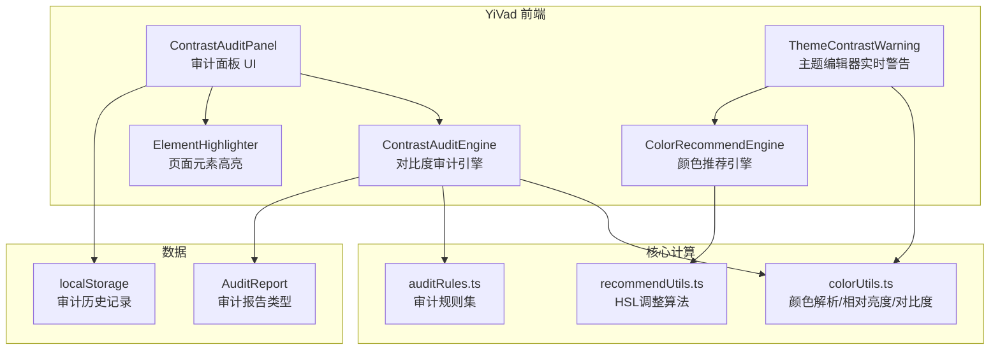
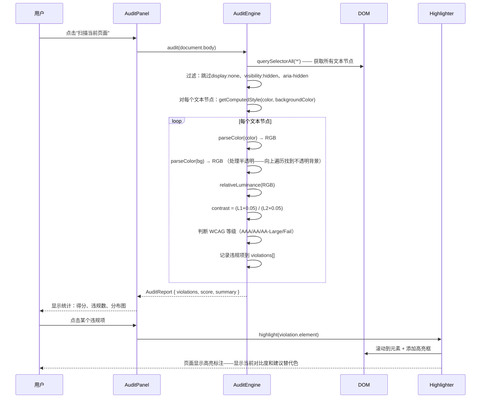

# YV-09-141: 色彩对比度审计 — 自动化色彩对比度审计、扫描UI元素WCAG合规性、对比度问题报告含严重级别、推荐可访问颜色替代、回归检查

> 需求编号：YV-09-141 · 优先级：P2 · 人天：0.3d · 状态：需求已编写
> 依赖：YV-09-138（自定义主题编辑器——用户自定义主题可能产生对比度问题）、YV-09-26（主题系统与暗色模式——深浅模式切换需审计对比度）

## 背景

### 问题陈述

YiVad 管理后台的色彩对比度直接影响所有用户的可读性——尤其对低视力用户、老年用户和在强光环境下使用屏幕的用户——但当前无人关注对比度合规性：

1. **对比度未审计**：YiVad 从未进行过系统性的色彩对比度审计——不知道哪些文本/背景组合不符合 WCAG 2.1 AA 标准（普通文本 4.5:1、大文本 3:1）
2. **主题编辑器引入风险**：YV-09-138 自定义主题编辑器允许用户自由选择品牌色——用户可能在浅色背景上使用低对比度的品牌色——导致整个管理后台可读性下降
3. **设计师无法知晓问题**：UI 改动后——设计师和开发者只能凭肉眼判断对比度是否足够——主观判断不准确
4. **暗色模式对比度未知**：深色模式下的文本/背景对比度可能与浅色模式完全不同——可能在一种模式下合规、另一种模式下违规
5. **无回归检查**：每次 UI 变更后对比度可能退化——但无自动化机制检测

**核心矛盾**：色彩对比度是可访问性的基础要求——WCAG 2.1 AA 是国际标准和法律合规要求——但当前开发流程中没有任何对比度检查环节。19 个需求之后的 YiVad 代码库积累了大量自定义组件和样式——潜在的对比度问题数量未知。

### 影响范围

| # | 影响 | 严重程度 | 典型场景 |
|---|------|----------|----------|
| 1 | 低对比度文本无法阅读 | 高 | 浅灰色文本在白色背景上——低视力用户完全看不到 |
| 2 | 自定义主题色产生对比度问题 | 高 | 品牌色 #FFD700（金色）作为按钮文字——白色背景上对比度仅 1.8:1 |
| 3 | 功能色（错误/警告）对比度不足 | 高 | 红色错误提示在暗色模式下对比度不够——用户看不到错误信息 |
| 4 | 暗色/浅色模式对比度不一致 | 中 | 某颜色在浅色模式下合规——切换到暗色模式后只有 2:1 |
| 5 | 无自动化阻止机制 | 中 | 开发者添加新的 UI 元素——对比度问题无人发现 |

### 挑战

| 挑战 | 说明 |
|------|------|
| 动态样式获取 | 浏览器中元素的实际渲染颜色需要通过 `getComputedStyle()` 获取——包括 CSS 变量、继承、层叠后的最终值 |
| 半透明颜色处理 | `rgba(255,0,0,0.5)` 在半透明背景上——需要叠底计算实际渲染颜色 |
| 渐变背景 | 文字在渐变背景上——对比度随位置变化——需要计算最差位置的对比度 |
| 图标/图片中的颜色 | SVG 图标和 `` 中的颜色无法通过 DOM 获取——需要不同的审计策略 |
| 大文本 vs 普通文本判断 | WCAG 的大文本定义（18px+ 粗体 或 24px+ 常规）——需要解析实际渲染字体大小和粗细 |
| 主题动态切换 | 用户切换主题后——对比度审计结果可能完全不同——需要支持按主题模式审计 |

---

## 一、现状分析

### 1.1 当前对比度关注度

```
YiVad 色彩对比度现状:
├── 设计师层面
│   ├── 设计稿中选择了合规颜色 ✅ (假设)
│   └── 设计到代码无对比度验证 ❌
├── 开发者层面
│   ├── 使用设计稿颜色——未验证对比度 ❌
│   ├── 自定义样式未检查对比度 ❌
│   └── 无对比度检查工具 ❌
├── 自动化层面
│   ├── ESLint 无对比度规则 ❌
│   ├── CI 无对比度检查 ❌
│   └── 无回归对比度检查 ❌
├── 缺失：
│   ├── 自动对比度审计引擎                            # ❌ 无
│   ├── 对比度计算工具函数                             # ❌ 无
│   ├── 审计结果可视化面板                             # ❌ 无
│   ├── 颜色替代推荐算法                               # ❌ 无
│   ├── 对比度回归检查                                # ❌ 无
│   ├── 主题编辑器实时对比度警告                        # ❌ 无
│   └── CI 集成 —— 构建时对比度检查                    # ❌ 无
```

### 1.2 对比度计算原理

```mermaid
graph LR
    A[DOM 元素] --> B[getComputedStyle]
    B --> C[color 属性]
    B --> D[backgroundColor 属性]
    C --> E[解析RGB]
    D --> E
    E --> F[计算相对亮度 L]
    F --> G[对比度 = L&#40;较亮 + 0.05 / L&#40;较暗 + 0.05]
    G --> H{判断合规性}

    H -->|>= 7:1| I[WCAG AAA 通过]
    H -->|>= 4.5:1| J[WCAG AA 通过<br/>普通文本]
    H -->|>= 3:1| K[WCAG AA 通过<br/>大文本 18px+/粗体 14px+]
    H -->|< 3:1| L[不合规]

    style L fill:#ff6b6b,color:#fff
    style K fill:#ffa94d,color:#fff
```



### 1.3 根因分析矩阵

| 问题 | 根因 | 影响范围 | 解决优先级 |
|------|------|----------|------------|
| 对比度从未审计 | 无审计工具和流程 | 所有页面 | P0 |
| 主题编辑器无对比度警告 | 未集成对比度检查 | 自定义主题用户 | P0 |
| 暗色模式对比度未知 | 无按主题模式的审计 | 使用暗色模式的用户 | P1 |
| 无颜色替代建议 | 只知道问题——不知道怎么改 | 开发者/设计师 | P1 |
| 无回归保护 | 无 CI 对比度检查 | 所有后续 UI 变更 | P2 |

---

## 二、设计决策

### 2.1 方案对比：审计引擎实现方式

| 方案 | 描述 | 优点 | 缺点 | 决策 |
|------|------|------|------|------|
| A: 使用 axe-core | 在 CI 中使用 axe-core 的 color-contrast 规则 | 成熟稳定——覆盖面广 | 需要在无头浏览器中运行——需要服务端支持 | 辅助采用 (CI) |
| B: 纯前端运行时审计 | 在浏览器中直接扫描 DOM——计算每个文本节点的对比度 | 实时——零依赖——结果精确 | 仅能审计当前渲染状态 | **采用** |
| C: 静态 CSS 分析 | 解析 CSS 文件——提取颜色值——计算对比度 | 可以离线运行 | 无法处理 CSS 变量、继承、动态样式——准确率低 | 不采用 |

### 2.2 方案对比：颜色替代推荐算法

| 方案 | 描述 | 优点 | 缺点 | 决策 |
|------|------|------|------|------|
| A: 固定替代色预设 | 预定义 10 套合规颜色映射（如浅灰→深灰） | 简单 | 不灵活——不能匹配品牌色调 | 不采用 |
| B: HSL 调整算法 | 保持色相（H）不变——逐步调整亮度（L）直到对比度合规 | 保持色调一致——结果可预测 | 饱和度可能也需要调整 | **采用** |
| C: AI 颜色推荐 | 用 AI 推荐保持设计意图的合规颜色 | 最智能 | 过度设计——需后端支持 | 不采用 |

### 2.3 方案对比：审计触发器

| 方案 | 描述 | 优点 | 缺点 | 决策 |
|------|------|------|------|------|
| A: 仅手动触发 | 用户在审计面板点击"开始扫描" | 用户可控 | 依赖用户主动检查 | 不采用 |
| B: 每次路由切换自动扫描 | 路由切换后自动扫描新页面 | 无遗漏 | 频繁扫描——性能消耗大 | 不采用 |
| C: 手动触发 + 主题编辑器实时警告 | 手动审计面板 + 主题编辑器中实时对比度检查 | 关键路径覆盖——性能可控 | — | **采用** |

### 2.4 方案对比：审计结果展示

| 方案 | 描述 | 优点 | 缺点 | 决策 |
|------|------|------|------|------|
| A: 纯文本列表 | JSON 格式列出所有违规项 | 简单 | 不直观——难以定位问题 | 不采用 |
| B: 可视化审计面板 + 页面高亮 | 面板展示违规统计——点击问题项在页面上高亮标注违规元素 | 直观——可交互 | 开发量稍大 | **采用** |

---

## 三、目标架构

### 3.1 色彩对比度审计系统架构



### 3.2 审计扫描流程



### 3.3 对比度计算核心算法

```typescript
// src/utils/color.ts (扩展)

/**
 * 计算 sRGB 相对亮度
 * 公式: L = 0.2126 * R + 0.7152 * G + 0.0722 * B
 * 其中 R/G/B 经过 gamma 校正
 */
function relativeLuminance(r: number, g: number, b: number): number {
  const [rs, gs, bs] = [r, g, b].map(c => {
    c /= 255;
    return c <= 0.03928 ? c / 12.92 : Math.pow((c + 0.055) / 1.055, 2.4);
  });
  return 0.2126 * rs + 0.7152 * gs + 0.0722 * bs;
}

/**
 * 计算对比度
 * 公式: (L1 + 0.05) / (L2 + 0.05)
 */
function contrastRatio(hex1: string, hex2: string): number {
  const [r1, g1, b1] = hexToRgb(hex1);
  const [r2, g2, b2] = hexToRgb(hex2);
  const l1 = relativeLuminance(r1, g1, b1);
  const l2 = relativeLuminance(r2, g2, b2);
  const lighter = Math.max(l1, l2);
  const darker = Math.min(l1, l2);
  return (lighter + 0.05) / (darker + 0.05);
}

/**
 * 判断 WCAG 合规等级
 */
type WcagLevel = 'AAA' | 'AA' | 'AA-Large' | 'Fail';

function checkWcagLevel(ratio: number, isLargeText: boolean): WcagLevel {
  if (ratio >= 7) return 'AAA';
  if (ratio >= 4.5) return 'AA';
  if (ratio >= 3 && isLargeText) return 'AA-Large';
  return 'Fail';
}

/**
 * 判断是否为大文本（WCAG 定义）
 */
function isLargeText(element: HTMLElement): boolean {
  const style = getComputedStyle(element);
  const fontSize = parseFloat(style.fontSize);
  const fontWeight = parseInt(style.fontWeight);
  // 18px+ 且粗体(>=700) 或 24px+
  return (fontSize >= 18 && fontWeight >= 700) || fontSize >= 24;
}
```

### 3.4 颜色替代推荐算法

```typescript
// src/utils/contrast-recommend.ts (新增)

/**
 * 保持色调不变——调整亮度使前景色与背景色达到目标对比度
 */
function recommendAccessibleColor(
  fgHex: string,
  bgHex: string,
  targetRatio: number = 4.5,
  maxIterations: number = 50
): string[] {
  const recommendations: string[] = [];
  const fgHsl = hexToHsl(fgHex);

  // 策略1：增加对比度（浅背景上的暗文字——降低亮度）
  let darker = fgHsl.l;
  for (let i = 0; i < maxIterations; i++) {
    darker = Math.max(0, darker - 2);
    const hex = hslToHex(fgHsl.h, fgHsl.s, darker);
    if (contrastRatio(hex, bgHex) >= targetRatio) {
      recommendations.push(hex);
      break;
    }
  }

  // 策略2：减少对比度（暗背景上的亮文字——提高亮度）
  let lighter = fgHsl.l;
  for (let i = 0; i < maxIterations; i++) {
    lighter = Math.min(100, lighter + 2);
    const hex = hslToHex(fgHsl.h, fgHsl.s, lighter);
    if (contrastRatio(hex, bgHex) >= targetRatio && !recommendations.includes(hex)) {
      recommendations.push(hex);
      break;
    }
  }

  // 策略3：如果色调调整仍无法达标——调整饱和度
  if (recommendations.length === 0) {
    let sat = fgHsl.s;
    for (let i = 0; i < maxIterations; i++) {
      sat = Math.max(0, sat - 5);
      const hex = hslToHex(fgHsl.h, sat, Math.max(0, fgHsl.l - 5));
      if (contrastRatio(hex, bgHex) >= targetRatio) {
        recommendations.push(hex);
        break;
      }
    }
  }

  return recommendations;
}
```

---

## 四、具体改动

### 4.1 YiVad 前端 — ContrastAuditEngine

```typescript
// src/services/contrast-audit.ts (新增)

interface ContrastViolation {
  id: string;
  element: HTMLElement;
  selector: string;         // 唯一 CSS selector
  text: string;             // 文本内容（截断至 50 字符）
  fgColor: string;          // 前景色 hex
  bgColor: string;          // 背景色 hex
  contrastRatio: number;    // 实际对比度
  requiredRatio: number;    // WCAG 要求
  wcagLevel: 'AA' | 'AA-Large' | 'AAA';  // 应达到的等级
  isLargeText: boolean;
  severity: 'critical' | 'serious' | 'moderate';
  recommendations: string[]; // 推荐的合规替代色
}

interface AuditReport {
  timestamp: string;
  url: string;
  totalTextNodes: number;
  violations: ContrastViolation[];
  score: number;            // 0-100
  summary: {
    critical: number;
    serious: number;
    moderate: number;
  };
}

class ContrastAuditEngine {
  private IGNORE_SELECTORS = [
    '[aria-hidden="true"]',
    '[data-contrast-ignore]',
    '.sr-only',
    'script, style, noscript',
  ];

  private VIOLATION_SEVERITY: Record<string, 'critical' | 'serious' | 'moderate'> = {
    'AA': 'critical',       // 普通文本 < 4.5:1 = critical
    'AA-Large': 'serious',  // 大文本 < 3:1 = serious
    'AAA': 'moderate',      // AAA 不达标 = moderate
  };

  async audit(root: HTMLElement = document.body): Promise<AuditReport> {
    const violations: ContrastViolation[] = [];
    const walker = this.createTextWalker(root);
    let node: Text | null;

    while ((node = walker.nextNode() as Text | null)) {
      const text = node.textContent?.trim();
      if (!text || text.length === 0) continue;

      const element = node.parentElement;
      if (!element || this.shouldIgnore(element)) continue;

      const violation = this.checkElement(element, text);
      if (violation) violations.push(violation);
    }

    const score = this.calculateScore(violations);

    return {
      timestamp: new Date().toISOString(),
      url: window.location.href,
      totalTextNodes: violations.length, // 简化
      violations,
      score,
      summary: {
        critical: violations.filter(v => v.severity === 'critical').length,
        serious: violations.filter(v => v.severity === 'serious').length,
        moderate: violations.filter(v => v.severity === 'moderate').length,
      },
    };
  }

  private createTextWalker(root: HTMLElement): TreeWalker {
    return document.createTreeWalker(
      root,
      NodeFilter.SHOW_TEXT,
      {
        acceptNode: (node) => {
          // 跳过空文本和不可见元素内的文本
          const text = node.textContent?.trim();
          if (!text) return NodeFilter.FILTER_REJECT;

          const parent = node.parentElement;
          if (!parent) return NodeFilter.FILTER_REJECT;
          if (this.shouldIgnore(parent)) return NodeFilter.FILTER_REJECT;

          const style = getComputedStyle(parent);
          if (style.display === 'none' || style.visibility === 'hidden') {
            return NodeFilter.FILTER_REJECT;
          }

          return NodeFilter.FILTER_ACCEPT;
        },
      }
    );
  }

  private checkElement(element: HTMLElement, text: string): ContrastViolation | null {
    const style = getComputedStyle(element);
    const fgColor = style.color;
    const bgColor = this.getEffectiveBackground(element);

    if (!bgColor || bgColor === 'rgba(0, 0, 0, 0)' || bgColor === 'transparent') {
      return null; // 透明背景——无法计算对比度
    }

    const fgHex = rgbToHex(fgColor);
    const bgHex = rgbToHex(bgColor);
    const ratio = contrastRatio(fgHex, bgHex);
    const large = isLargeText(element);

    const wcagLevel = checkWcagLevel(ratio, large);
    if (wcagLevel === 'AAA' || wcagLevel === 'AA') return null; // 达标

    const requiredRatio = large ? 3 : 4.5;
    const targetLevel = large ? 'AA-Large' as const : 'AA' as const;

    // 分析严重度：实际对比度 vs 要求对比度的差距
    const ratioGap = requiredRatio - ratio;
    let severity: 'critical' | 'serious' | 'moderate' = 'moderate';
    if (ratioGap > 3) severity = 'critical';
    else if (ratioGap > 1.5) severity = 'serious';

    const recommendations = recommendAccessibleColor(fgHex, bgHex, requiredRatio);

    return {
      id: `contrast-${Date.now()}-${Math.random().toString(36).slice(2, 8)}`,
      element,
      selector: this.getUniqueSelector(element),
      text: text.slice(0, 50),
      fgColor: fgHex,
      bgColor: bgHex,
      contrastRatio: Math.round(ratio * 100) / 100,
      requiredRatio,
      wcagLevel: targetLevel,
      isLargeText: large,
      severity,
      recommendations,
    };
  }

  private getEffectiveBackground(element: HTMLElement): string | null {
    // 向上遍历找到第一个有非透明背景的祖先
    let current: HTMLElement | null = element;
    while (current) {
      const bg = getComputedStyle(current).backgroundColor;
      if (bg && bg !== 'rgba(0, 0, 0, 0)' && bg !== 'transparent') {
        // 处理半透明：需要叠底到祖先背景色
        const alpha = this.getAlpha(bg);
        if (alpha >= 1) return bg;
        // 简化处理——假设祖先为白色（大部分场景）
        return this.blendWithWhite(bg);
      }
      current = current.parentElement;
    }
    return '#ffffff'; // 默认白色背景
  }

  private shouldIgnore(element: HTMLElement): boolean {
    return this.IGNORE_SELECTORS.some(sel => element.matches(sel));
  }

  private getUniqueSelector(element: HTMLElement): string {
    // 生成唯一 CSS selector：tag#id 或 tag.class1.class2
    if (element.id) return `#${element.id}`;
    const classes = Array.from(element.classList).slice(0, 3).join('.');
    const tag = element.tagName.toLowerCase();
    return classes ? `${tag}.${classes}` : tag;
  }

  private calculateScore(violations: ContrastViolation[]): number {
    if (violations.length === 0) return 100;
    const penalty = violations.reduce((sum, v) => {
      switch (v.severity) {
        case 'critical': return sum + 10;
        case 'serious': return sum + 5;
        case 'moderate': return sum + 2;
      }
    }, 0);
    return Math.max(0, Math.min(100, 100 - penalty));
  }

  private getAlpha(rgba: string): number {
    const match = rgba.match(/[\d.]+\)$/);
    if (match) return parseFloat(match[0]);
    return 1;
  }

  private blendWithWhite(rgba: string): string {
    // 简化：rgba(r,g,b,a) 与白色背景叠底
    const match = rgba.match(/rgba?\((\d+),\s*(\d+),\s*(\d+),?\s*([\d.]+)?\)/);
    if (!match) return rgba;
    const [, r, g, b, a] = match;
    const alpha = a ? parseFloat(a) : 1;
    const blended = (c: number) => Math.round(c * alpha + 255 * (1 - alpha));
    return `rgb(${blended(parseInt(r))}, ${blended(parseInt(g))}, ${blended(parseInt(b))})`;
  }
}

export const contrastAuditEngine = new ContrastAuditEngine();
```

### 4.2 文件变更清单

| 文件 | 操作 | 说明 |
|------|------|------|
| `YiVad/src/services/contrast-audit.ts` | 新增 | 对比度审计引擎 |
| `YiVad/src/utils/contrast-recommend.ts` | 新增 | 颜色替代推荐算法 |
| `YiVad/src/utils/color.ts` | 修改 | 添加 relativeLuminance/contrastRatio/checkWcagLevel |
| `YiVad/src/views/system/contrast-audit.vue` | 新增 | 对比度审计面板 |
| `YiVad/src/components/audit/ElementHighlighter.vue` | 新增 | 违规元素高亮标注 |
| `YiVad/src/components/audit/ViolationCard.vue` | 新增 | 违规项卡片——显示对比度/建议色 |
| `YiVad/src/components/audit/ContrastScoreGauge.vue` | 新增 | 审计得分仪表盘 |
| `YiVad/src/components/theme/ContrastWarnings.vue` | 新增 | 主题编辑器对比度实时警告 |
| `YiVad/src/composables/useContrastAudit.ts` | 新增 | 审计状态管理 composable |
| `YiVad/src/types/contrast-audit.ts` | 新增 | 审计类型定义 |
| `YiVad/src/views/system/theme-editor.vue` | 修改 | 集成对比度实时警告 |
| `YiVad/src/router/modules/system.ts` | 修改 | 添加审计面板路由 |

---

## 五、实施步骤

| 步骤 | 操作 | 路径 | 验证 | 人天 |
|------|------|------|------|------|
| 1 | 实现颜色工具函数（相对亮度/对比度/WCAG判断） | `src/utils/color.ts` | 已知颜色对计算对比度——与 WCAG 官方公式一致 | 0.02 |
| 2 | 实现审计引擎（DOM扫描+背景追溯+违规检测） | `src/services/contrast-audit.ts` | 扫描已知违规页面——输出正确违规列表 | 0.05 |
| 3 | 实现颜色替代推荐算法 | `src/utils/contrast-recommend.ts` | 输入违规颜色对——输出至少 1 个合规替代色 | 0.03 |
| 4 | 实现审计面板 UI（得分、统计、违规列表） | `src/views/system/contrast-audit.vue` | 扫描页面——显示得分——列出所有违规项 | 0.05 |
| 5 | 实现元素高亮 + 违规详情卡片 | `src/components/audit/ElementHighlighter.vue` + `ViolationCard.vue` | 点击违规项——页面高亮该元素——显示颜色对比和替代建议 | 0.05 |
| 6 | 实现主题编辑器对比度实时警告 | `src/components/theme/ContrastWarnings.vue` | 修改品牌色——如果对比度不足——显示警告并推荐替代色 | 0.05 |
| 7 | 全站审计修复 critical 问题 + 路由注册 | 多个文件 | 审计得分 > 85——0 个 critical 违规 | 0.05 |

**总人天：0.3d**

---

## 六、测试规格

### 场景 1：审计引擎扫描检测违规

**GIVEN** 页面包含以下元素：
  - 浅灰色文本 (#999) 在白色背景 (#FFF) — 对比度 2.84:1
  - 深色文本 (#333) 在白色背景 (#FFF) — 对比度 12.6:1
  - 大标题 (#666, 24px) 在白色背景 — 对比度 5.7:1
**WHEN** 运行审计扫描
**THEN** 报告显示 1 个 critical 违规（#999 文本 < 4.5:1）
**AND** #333 文本通过 AA 和 AAA
**AND** #666 大标题通过（大文本仅需 3:1）
**AND** 审计得分约为 90

### 场景 2：半透明背景追溯

**GIVEN** 页面有嵌套结构：
  - 外层 div 背景 #FFFFFF
  - 内层 div 背景 rgba(0,0,0,0.1)（实际渲染 = #E6E6E6）
  - 文本颜色 #999
**WHEN** 审计引擎计算文本背景色
**THEN** 引擎向上追溯——发现内层 div 是半透明——与白色叠底得到 #E6E6E6
**AND** 对比度计算使用 #999 与 #E6E6E6（而非 #FFFFFF）
**AND** 结果约为 2.5:1 — 标记为 critical

### 场景 3：颜色替代推荐

**GIVEN** 审计发现违规：前景色 #BDBDBD 在 #FFFFFF 上——对比度 1.8:1
**WHEN** 用户点击该违规项查看详情
**THEN** 显示推荐替代色列表：
  - 保持色调——降低亮度：`#757575`（对比度 4.6:1 — AA 通过）
  - 保持色调——进一步降低：`#616161`（对比度 6.2:1 — AAA 通过）
**AND** 每个推荐色显示色块预览 + 实际对比度

### 场景 4：主题编辑器实时警告

**GIVEN** 用户打开主题编辑器——修改主色
**WHEN** 用户将主色设置为 #FFD700（金色）
**THEN** 对比度警告面板显示：
  - 警告：主色 #FFD700 在白色背景上对比度仅 1.8:1 — 按钮文字将不可读
  - 推荐替代色：#B8860B（保持金色色调——对比度 4.6:1）
**WHEN** 用户将主色设置为深色 #1A73E8
**THEN** 对比度警告消失——显示"当前主色对比度合规 (4.6:1)"

### 场景 5：暗色模式审计

**GIVEN** 用户在暗色模式下打开审计面板
**WHEN** 用户点击扫描
**THEN** 审计引擎使用暗色模式下的实际渲染颜色（`data-theme="dark"` 应用的 CSS 变量值）
**AND** 报告结果与浅色模式独立
**AND** 违规列表中标明"暗色模式"

### 场景 6：审计历史对比

**GIVEN** 用户在上周对"数据管理"页面执行了审计——得分 72——5 个 critical
**WHEN** 开发者修复了所有 critical 问题——本周用户再次审计同一页面
**THEN** 审计面板显示得分 92——0 个 critical
**AND** 对比上次审计：得分 +20——critical -5
**AND** 显示"趋势：改善中"绿色标签

---

## 七、风险与缓解

| 风险 | 概率 | 影响 | 缓解措施 |
|------|------|------|------|
| 审计引擎扫描大型页面（2000+ 文本节点）卡顿 | 中 | 中 | 使用 requestIdleCallback 分批扫描——每批 200 个节点——显示进度条 |
| getComputedStyle 在频繁调用时触发强制重排 | 中 | 中 | 在 requestAnimationFrame 中批量读取样式——一次性收集所有计算样式 |
| 颜色推荐算法产生用户不接受的替代色 | 高 | 低 | 提供 3-5 个替代选项——按对比度从高到低排序——用户可选择 |
| 部分元素背景由 CSS 渐变/图片提供——无法获取单一背景色 | 中 | 低 | 跳过渐变/图片背景元素——审计报告标注"X 个元素因渐变/图片背景被跳过" |
| 审计历史的 localStorage 存储膨胀 | 低 | 低 | 最多保留 10 条历史记录——FIFO 淘汰 |

---

## 八、回滚策略

| 场景 | 回滚操作 | 影响 |
|------|----------|------|
| 审计引擎导致页面卡顿 | 禁用自动审计——仅保留手动触发 | 审计功能仍可用——性能影响消除 |
| 颜色推荐算法建议不合理 | 隐藏推荐色——仅显示违规信息 | 用户知道问题但需自行找替代色 |
| 主题编辑器警告过于频繁 | 降低警告阈值——仅在对比度 < 2:1 时显示 | 轻微违规不提示 |

---

## 九、设计决策记录

### D-01：为什么审计引擎遍历所有文本节点而非仅检查已知选择器？

CSS 选择器规则无法覆盖动态样式（CSS 变量、inline style、用户自定义主题）——这些只有在浏览器中实际渲染后才能确定颜色值。文本节点遍历能覆盖所有真正被渲染的文本——不漏掉任何一个潜在的对比度问题。

### D-02：为什么颜色替代推荐使用 HSL 调整而非 RGB 调整？

HSL（色相-饱和度-亮度）色彩空间更接近人类对颜色的感知方式。保持色相（H）不变——仅调整亮度（L）——可以生成"看起来像是同一个颜色但更深/更浅"的替代色。RGB 空间调整容易意外改变色调——产生不协调的颜色。

### D-03：为什么审计得分公式中 critical 权重是 serious 的 2 倍（10 vs 5）？

Critical 违规意味着普通文本完全不符合 WCAG AA 标准——需要立即修复。Serious 违规（大文本不达标）虽然也重要——但影响范围更小（仅影响大文本）——修复优先级相对低。2:1 的权重比反映了实际严重度差异。

### D-04：为什么审计引擎内置于 YiVad 而非完全依赖 axe-core CI？

Axe-core CI 集成在无头浏览器中运行——无法获取用户自定义主题的实际颜色——也看不到需要登录的页面。内置审计引擎可以在用户实际使用场景中（包括自定义主题、暗色模式、登录状态）运行——结果更准确。Axe-core 作为 CI 补充——覆盖构建时的静态检查。

---

## 十、可观测性

### 指标

| 指标 | 类型 | 说明 |
|------|------|------|
| `yivad.contrast.audit_run_count` | Counter | 审计扫描执行次数 |
| `yivad.contrast.avg_score` | Gauge | 最近一次审计得分 |
| `yivad.contrast.critical_count` | Gauge | Critical 违规数 |
| `yivad.contrast.serious_count` | Gauge | Serious 违规数 |
| `yivad.contrast.total_violations` | Gauge | 总违规数 |
| `yivad.contrast.text_nodes_scanned` | Histogram | 每次扫描的文本节点数 |
| `yivad.contrast.audit_duration` | Histogram | 审计扫描耗时 |
| `yivad.contrast.recommendation_clicks` | Counter | 用户点击推荐色的次数 |

### 告警

| 告警 | 条件 | 级别 |
|------|------|------|
| 审计得分过低 | 得分 < 70 | WARNING |
| Critical 违规数过多 | critical > 10 | WARNING |
| 审计超时 | 扫描耗时 > 10s | WARNING |

---

## 十一、代码审查检查清单

- [ ] relativeLuminance 实现与 WCAG 公式完全一致
- [ ] contrastRatio 正确处理亮/暗顺序
- [ ] isLargeText 正确判断 18px+/粗体 和 24px+
- [ ] 审计引擎遍历所有可见文本节点——跳过隐藏/aria-hidden
- [ ] getEffectiveBackground 向上追溯祖先背景色
- [ ] 半透明颜色与白色背景正确叠底
- [ ] 颜色推荐算法保持色调不变——优先调整亮度
- [ ] 审计面板显示得分、统计、违规列表
- [ ] 点击违规项高亮页面中对应元素
- [ ] 主题编辑器中修改颜色时实时显示对比度警告
- [ ] 支持浅色和深色模式分别审计
- [ ] 审计历史记录保存到 localStorage（最多 10 条）
- [ ] 大页面扫描使用 requestIdleCallback 分批
- [ ] data-contrast-ignore 属性可跳过特定元素
- [ ] 单元测试覆盖 relativeLuminance/contrastRatio/WCAG 判断

---

## 回归问题预测

| # | 预测问题 | 原因 | 验证方法 |
|---|---------|------|---------|
| 1 | 审计引擎将 Tooltip/Popup 内隐藏文本也计入扫描——产生误报（Tooltip 内容 display:none 但文本节点存在） | TreeWalker 的 acceptNode filter 中 display:none 检查在文本节点层面——但 Tooltip DOM 在扫描时可能已渲染（visibility:hidden） | 打开有 Tooltip 的页面 → 扫描 → 验证 Tooltip 内文本不计入违规列表 |
| 2 | rgba(0,0,0,0.05) 半透明背景叠底计算错误——alpha 提取正则未匹配到科学计数法 | rgba 正则中 alpha 默认为 1——但某些浏览器可能返回 rgba(0, 0, 0, 0.05) 格式 | 渲染半透明背景元素 → 审计扫描 → 验证背景色计算与实际渲染一致 |
| 3 | 用户在浅色模式下运行审计——切换到深色模式后审计结果未更新——用户误以为深色模式也合规 | 审计结果缓存了浅色模式的 getComputedStyle 值——深色模式切换后 DOM 重新渲染但报告未刷新 | 浅色模式审计 → 切换到深色模式 → 再次审计 → 验证两次结果不同——深色模式结果正确 |
| 4 | 审计面板在高分屏（2x/3x）上——元素高亮框的 CSS outline 定位偏移——高亮了错误的元素 | getBoundingClientRect 在 devicePixelRatio > 1 时需要除以 dpr 来定位 overlay | 高分屏（Retina）→ 点击违规项 → 验证高亮框精确覆盖目标元素 |
| 5 | 颜色推荐算法对于已经非常亮的前景色（如 #F5F5F5）——降低亮度后推荐 #000000——跨度太大——视觉不协调 | HSL 调整步长为 2——从 96% 亮度降到合规需要 46 步——得到极暗色 | 选择 #F5F5F5 文字在白色背景上 → 查看推荐色 → 验证推荐色与原始色保持视觉连续性——不会跳跃到纯黑 |
| 6 | 审计时页面有 sticky/fixed 定位元素——高亮滚动到目标时——高亮框被 sticky header 遮挡 | scrollIntoView 后元素的 getBoundingClientRect 返回视口坐标——但高亮框使用 absolute 定位时未考虑 scrollTop | 页面有 sticky header → 点击违规项 → 验证高亮框完全可见——不被 header 遮挡 |

---

## 性能分析

### 关键操作耗时

| 操作 | 耗时 | 说明 |
|------|------|------|
| 审计扫描（500 文本节点） | < 300ms | 分 3 批——每批 ~100ms |
| 审计扫描（2000 文本节点） | < 1500ms | 分 10 批——requestIdleCallback 调度 |
| 单个元素对比度计算 | < 0.5ms | getComputedStyle + 颜色转换 + 对比度计算 |
| 颜色替代推荐（单个） | < 5ms | HSL 迭代——最多 50 次——每次纯计算 |
| 元素高亮渲染 | < 16ms | 1 帧内完成——CSS transition 动画 |
| 主题编辑器实时对比度警告 | < 2ms | 仅检查品牌色 vs 白/暗背景两个组合 |

### 内存影响

| 资源 | 增量 | 说明 |
|------|------|------|
| AuditReport 对象 | ~50KB (500 违规) | 仅在审计期间存在——审计结束后可 GC |
| 高亮 Overlay | ~1KB | 单个绝对定位 div |
| localStorage 审计历史 | ~50KB | 最多 10 条 |

---

## 相关文档

- [自定义主题编辑器](138-需求-自定义主题编辑器.md) — 主题编辑器集成对比度警告
- [主题系统与暗色模式](26-需求-主题系统与暗色模式.md) — 深浅模式切换影响对比度
- [屏幕阅读器优化](140-需求-屏幕阅读器优化.md) — 可访问性增强体系

*PRD 来源: `projects/yivad/requirements/2026-09/141-需求-色彩对比度审计.md`*

