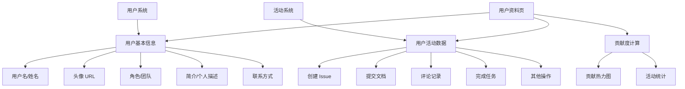
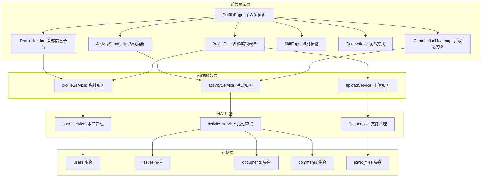
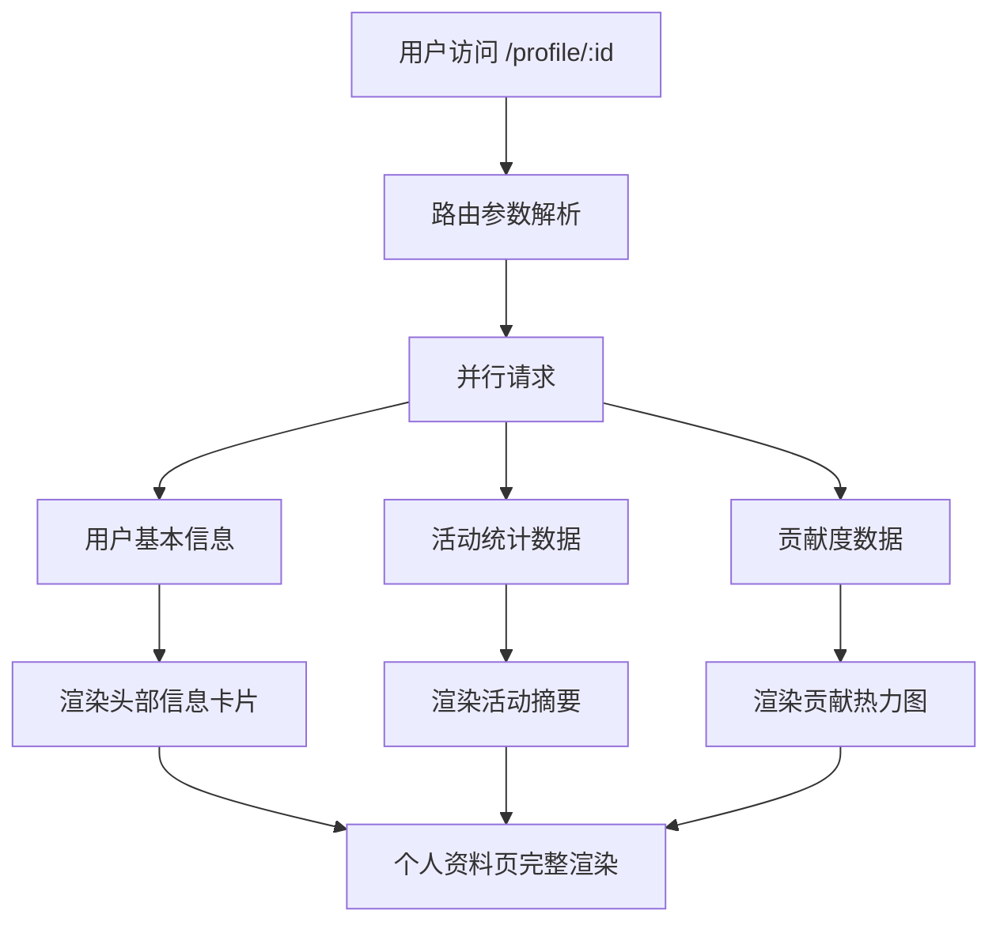

# YV-09-198: 用户个人资料页 — 头像/姓名/角色/团队/简介、活动摘要、贡献图、技能标签、联系方式、资料编辑

> 需求编号：YV-09-198 · 优先级：P2 · 人天：0.3d · 状态：需求已编写
> 依赖：YV-09-08（用户系统基础）、YV-09-47（数据可视化图表库标准化）、YV-09-28（文件上传与管理）

## 背景

### 问题陈述

YiVad 当前缺乏用户个人资料展示页面。用户信息分散在系统各处（登录信息、权限设置、Issue 指派等），没有一个集中的页面来展示个人资料、活动历史和贡献情况。当前存在以下问题：

1. **个人资料不可见**：用户无法查看自己或他人的完整个人资料，基本信息仅通过导航栏头像显示
2. **活动历史缺失**：无法查看用户的历史活动记录（创建 Issue、提交文档、评论等）
3. **贡献度无量化**：缺乏可视化的贡献度图表，无法直观了解个人或团队成员的贡献
4. **技能标签不存**：用户技能/专长标签不存在，团队协作时无法快速了解成员专长
5. **联系方式分散**：联系方式信息分散，缺乏统一的联系方式展示
6. **资料编辑不统一**：没有统一的个人资料编辑入口，头像上传等功能缺失

**核心矛盾**：在协作型管理后台中，用户需要了解彼此的专业背景和活动情况，但当前系统缺乏个人资料页这一核心功能，导致团队协作效率降低。

### 影响范围

| # | 影响 | 严重程度 | 典型场景 |
|---|------|----------|----------|
| 1 | 个人资料不可见 | 高 | 新成员加入团队，无法快速了解其他成员背景 |
| 2 | 活动历史缺失 | 中 | 管理员需要了解某人最近的活动，无法快速查阅 |
| 3 | 贡献度不透明 | 中 | 管理者无法量化评估团队成员的贡献度 |
| 4 | 技能标签缺失 | 中 | 分配任务时不知道谁擅长什么领域 |
| 5 | 联系方式分散 | 低 | 需要联系同事时，需要去其他系统查找 |
| 6 | 资料编辑不统一 | 中 | 头像、简介等个人信息修改入口不统一 |

### 挑战

| 挑战 | 说明 |
|------|------|
| 数据聚合 | 用户活动数据分散在多个集合中（Issue、文档、评论等），需要聚合查询 |
| 贡献度计算 | 需要定义合理的贡献度计算模型，平衡不同活动的权重 |
| 隐私控制 | 需要区分公开信息和私密信息，支持用户控制可见性 |
| 头像管理 | 头像上传、裁剪、存储需要与文件管理系统集成 |
| 性能优化 | 活动历史数据量大，需要分页和缓存 |

---

## 一、现状分析

### 1.1 当前用户资料现状

```
现有用户系统:
├── 用户认证（登录/登出）
│   ├── 用户名/密码
│   └── Token 管理
├── 导航栏头像
│   └── 仅显示头像 + 用户名
├── 权限管理页面
│   └── 管理员视角的用户列表
├── Issue 指派
│   └── 仅显示用户名

缺失:
├── 个人资料页面              # ❌ 不存在
├── 活动历史                  # ❌ 不存在
├── 贡献度图表                # ❌ 不存在
├── 技能/专长标签             # ❌ 不存在
├── 联系方式展示              # ❌ 不存在
├── 资料编辑功能              # ❌ 不存在
├── 头像上传/裁剪             # ❌ 不存在
└── 隐私设置                  # ❌ 不存在
```

### 1.2 用户资料数据流



### 1.3 根因矩阵

| 症状 | 根因 | 触发条件 | 频率 |
|------|------|----------|------|
| 个人资料不可见 | 无个人资料页面 | 需要查看用户信息时 | 高 |
| 活动历史缺失 | 无活动聚合查询 | 需要了解用户历史时 | 中 |
| 贡献度不透明 | 无贡献度计算模型 | 绩效评估时 | 中 |
| 技能标签缺失 | 无技能标签数据结构 | 任务分配时 | 中 |
| 联系方式分散 | 无统一联系方式存储 | 需要联系同事时 | 低 |
| 资料编辑不统一 | 无资料编辑页面 | 修改个人信息时 | 中 |

---

## 二、设计决策

### 决策 1：个人资料页访问方式 — 独立路由 vs 弹窗 vs 侧边栏

| 选项 | 沉浸感 | 可分享性 | 内容容量 |
|------|--------|----------|----------|
| 独立路由页面 | 高 | 高（可分享 URL） | 大 |
| 弹窗/Drawer | 中 | 低 | 中 |
| 侧边栏面板 | 中 | 低 | 中 |

**选择：独立路由页面。** 个人资料页内容较多（活动历史、贡献图等），需要足够的展示空间。独立路由支持 URL 分享，方便团队成员互相查看资料。

### 决策 2：贡献度计算模型 — 简单计数 vs 加权评分 vs 时间衰减

| 选项 | 公平性 | 复杂度 | 可解释性 |
|------|--------|--------|----------|
| 简单计数（活动次数） | 低 | 低 | 高 |
| 加权评分（不同活动不同权重） | 中 | 中 | 中 |
| 时间衰减（近期活动权重更高） | 高 | 高 | 低 |

**选择：加权评分。** 不同活动类型（创建 Issue、完成 Issue、提交文档、评论等）对项目的贡献度不同，使用加权评分更公平。暂不引入时间衰减以减少复杂度。

### 决策 3：贡献图展示 — 热力图 vs 柱状图 vs 折线图

| 选项 | 可读性 | 时间维度 | 数据密度 |
|------|--------|----------|----------|
| GitHub 风格热力图 | 高 | 年/月/日 | 高 |
| 柱状图（按月汇总） | 中 | 月 | 中 |
| 折线图（趋势） | 中 | 日/周/月 | 中 |

**选择：GitHub 风格热力图。** 与开发者熟悉的 GitHub 贡献图一致，直观展示全年活动分布，颜色深浅反映活动强度，一目了然。

### 决策 4：头像管理 — 外部 URL vs 本地上传 vs 两者结合

| 选项 | 灵活性 | 存储成本 | 隐私安全 |
|------|--------|----------|----------|
| 外部 URL（Gravatar 等） | 低 | 无 | 低（依赖外部） |
| 本地上传 | 高 | 有 | 高 |
| 两者结合（默认 Gravatar + 支持自定义上传） | 高 | 有限 | 中 |

**选择：两者结合。** 默认使用 Gravatar 基于邮箱生成头像，同时支持用户自定义上传头像。兼顾便捷性和灵活性。

### 设计决策记录

| 决策 | 选项 A | 选项 B | 选项 C | 选择 | 理由 |
|------|--------|--------|--------|------|------|
| 展示方式 | 独立路由 | 弹窗 | 侧边栏 | **独立路由** | 内容多，需要独立页面空间 |
| 贡献度模型 | 简单计数 | 加权评分 | 时间衰减 | **加权评分** | 公平且可解释 |
| 贡献图展示 | 热力图 | 柱状图 | 折线图 | **GitHub 风格热力图** | 直观且用户熟悉 |
| 头像管理 | 外部 URL | 本地上传 | 两者结合 | **两者结合** | 便捷 + 灵活 |

---

## 三、目标架构

### 3.1 用户个人资料页架构



### 3.2 个人资料页数据流



### 3.3 个人资料页指标

| 指标 | 改造前 | 改造后 |
|------|--------|--------|
| 用户资料可见性 | 仅导航栏头像 + 用户名 | 完整个人资料页 |
| 活动历史 | 无 | 聚合活动历史列表 |
| 贡献度 | 无 | 贡献热力图 + 统计数字 |
| 技能标签 | 无 | 技能/专长标签展示 |
| 联系方式 | 分散 | 统一联系方式展示 |
| 资料编辑 | 无 | 统一编辑入口 |

---

## 四、具体改动

### 4.1 个人资料页核心服务

```typescript
// src/services/profile-service.ts (新增)

interface UserProfile {
  id: string;
  username: string;
  display_name: string;
  avatar_url: string;
  role: string;
  team: string;
  bio: string;
  skills: SkillTag[];
  contact: ContactInfo;
  joined_at: string;
  last_active_at: string;
}

interface SkillTag {
  id: string;
  name: string;
  category: 'frontend' | 'backend' | 'devops' | 'design' | 'management' | 'other';
  level: 'beginner' | 'intermediate' | 'advanced' | 'expert';
}

interface ContactInfo {
  email: string;
  phone?: string;
  wechat?: string;
  dingtalk?: string;
  website?: string;
  github?: string;
}

interface ActivitySummary {
  total_issues_created: number;
  total_issues_completed: number;
  total_comments: number;
  total_documents: number;
  total_reviews: number;
  total_commits: number;
  active_days: number;
  streak: number;
  last_30_days: number;
}

interface ContributionDay {
  date: string;
  count: number;
  level: 0 | 1 | 2 | 3 | 4;
}

interface ActivityItem {
  id: string;
  type: 'issue_created' | 'issue_completed' | 'comment' | 'document_created' | 'document_updated' | 'review';
  title: string;
  project_name: string;
  timestamp: string;
  link: string;
}

interface ProfileUpdatePayload {
  display_name?: string;
  bio?: string;
  skills?: Omit<SkillTag, 'id'>[];
  contact?: Partial<ContactInfo>;
}

class ProfileService {
  private baseUrl: string;

  constructor() {
    this.baseUrl = import.meta.env.RS_BUILD_API_BASE || 'http://localhost:10086';
  }

  async getProfile(userId: string): Promise<UserProfile> {
    const response = await fetch(`${this.baseUrl}/`, {
      method: 'POST',
      headers: { 'Content-Type': 'application/json' },
      body: JSON.stringify({
        module_name: 'services.user.user_service',
        method_name: 'get_profile',
        parameters: { user_id: userId },
      }),
    });
    const data = await response.json();
    return data.code === 0 ? data.data : null;
  }

  async getActivitySummary(userId: string): Promise<ActivitySummary> {
    const response = await fetch(`${this.baseUrl}/`, {
      method: 'POST',
      headers: { 'Content-Type': 'application/json' },
      body: JSON.stringify({
        module_name: 'services.user.activity_service',
        method_name: 'get_activity_summary',
        parameters: { user_id: userId },
      }),
    });
    const data = await response.json();
    return data.code === 0 ? data.data : null;
  }

  async getContributionData(userId: string, year: number): Promise<ContributionDay[]> {
    const response = await fetch(`${this.baseUrl}/`, {
      method: 'POST',
      headers: { 'Content-Type': 'application/json' },
      body: JSON.stringify({
        module_name: 'services.user.activity_service',
        method_name: 'get_contribution_data',
        parameters: { user_id: userId, year },
      }),
    });
    const data = await response.json();
    return data.code === 0 ? data.data : [];
  }

  async getRecentActivities(userId: string, page: number, pageSize: number): Promise<{ items: ActivityItem[]; total: number }> {
    const response = await fetch(`${this.baseUrl}/`, {
      method: 'POST',
      headers: { 'Content-Type': 'application/json' },
      body: JSON.stringify({
        module_name: 'services.user.activity_service',
        method_name: 'get_recent_activities',
        parameters: { user_id: userId, page, page_size: pageSize },
      }),
    });
    const data = await response.json();
    return data.code === 0 ? data.data : { items: [], total: 0 };
  }

  async updateProfile(userId: string, payload: ProfileUpdatePayload): Promise<UserProfile> {
    const response = await fetch(`${this.baseUrl}/`, {
      method: 'POST',
      headers: { 'Content-Type': 'application/json' },
      body: JSON.stringify({
        module_name: 'services.user.user_service',
        method_name: 'update_profile',
        parameters: { user_id: userId, ...payload },
      }),
    });
    const data = await response.json();
    return data.code === 0 ? data.data : null;
  }

  async uploadAvatar(userId: string, file: File): Promise<{ avatar_url: string }> {
    const formData = new FormData();
    formData.append('file', file);
    formData.append('user_id', userId);
    const response = await fetch(`${this.baseUrl}/upload-avatar`, {
      method: 'POST',
      body: formData,
    });
    const data = await response.json();
    return data.code === 0 ? data.data : null;
  }
}

export const profileService = new ProfileService();
export type { UserProfile, SkillTag, ContactInfo, ActivitySummary, ContributionDay, ActivityItem, ProfileUpdatePayload };
```

### 4.2 个人资料页主组件

```vue
<!-- src/views/profile/ProfilePage.vue (新增) -->

<script setup lang="ts">
import { ref, computed, onMounted, watch } from 'vue';
import { useRoute } from 'vue-router';
import * as echarts from 'echarts';
import { profileService } from '@/services/profile-service';
import type { UserProfile, ActivitySummary, ContributionDay, ActivityItem } from '@/services/profile-service';
import ProfileHeader from './components/ProfileHeader.vue';
import ActivitySummary from './components/ActivitySummary.vue';
import ContributionHeatmap from './components/ContributionHeatmap.vue';
import SkillTags from './components/SkillTags.vue';
import ContactInfo from './components/ContactInfo.vue';
import ActivityTimeline from './components/ActivityTimeline.vue';
import ProfileEditDialog from './components/ProfileEditDialog.vue';

const route = useRoute();
const userId = computed(() => (route.params.id as string) || 'me');

const profile = ref<UserProfile | null>(null);
const activitySummary = ref<ActivitySummary | null>(null);
const contributionData = ref<ContributionDay[]>([]);
const recentActivities = ref<ActivityItem[]>([]);
const loading = ref(true);
const editDialogVisible = ref(false);
const currentYear = ref(new Date().getFullYear());
const isOwnProfile = computed(() => userId.value === 'me');

async function loadProfile() {
  loading.value = true;
  try {
    const [p, s, c, a] = await Promise.all([
      profileService.getProfile(userId.value),
      profileService.getActivitySummary(userId.value),
      profileService.getContributionData(userId.value, currentYear.value),
      profileService.getRecentActivities(userId.value, 1, 20),
    ]);
    profile.value = p;
    activitySummary.value = s;
    contributionData.value = c;
    recentActivities.value = a.items;
  } finally {
    loading.value = false;
  }
}

async function handleSaveProfile(payload: ProfileUpdatePayload) {
  if (!profile.value) return;
  profile.value = await profileService.updateProfile(profile.value.id, payload);
  editDialogVisible.value = false;
}

async function handleAvatarUpload(file: File) {
  if (!profile.value) return;
  const result = await profileService.uploadAvatar(profile.value.id, file);
  if (result) {
    profile.value.avatar_url = result.avatar_url;
  }
}

function changeYear(delta: number) {
  currentYear.value += delta;
}

watch(currentYear, () => {
  if (userId.value) {
    profileService.getContributionData(userId.value, currentYear.value).then(data => {
      contributionData.value = data;
    });
  }
});

onMounted(loadProfile);
</script>

<template>
  <div class="profile-page" v-loading="loading">
    <div class="profile-container">
      <!-- 头部信息卡片 -->
      <ProfileHeader
        v-if="profile"
        :profile="profile"
        :is-own="isOwnProfile"
        @edit="editDialogVisible = true"
        @upload-avatar="handleAvatarUpload"
      />

      <div class="profile-body">
        <div class="profile-main">
          <!-- 活动摘要 -->
          <ActivitySummary v-if="activitySummary" :summary="activitySummary" />

          <!-- 贡献热力图 -->
          <ContributionHeatmap
            :data="contributionData"
            :year="currentYear"
            @year-change="changeYear"
          />

          <!-- 近期活动时间线 -->
          <ActivityTimeline :activities="recentActivities" />
        </div>

        <div class="profile-sidebar">
          <!-- 技能标签 -->
          <SkillTags v-if="profile" :skills="profile.skills" />

          <!-- 联系方式 -->
          <ContactInfo v-if="profile" :contact="profile.contact" />
        </div>
      </div>
    </div>

    <!-- 编辑资料弹窗 -->
    <ProfileEditDialog
      v-if="profile"
      v-model:visible="editDialogVisible"
      :profile="profile"
      @save="handleSaveProfile"
    />
  </div>
</template>
```

### 4.3 贡献热力图组件

```vue
<!-- src/views/profile/components/ContributionHeatmap.vue (新增) -->

<script setup lang="ts">
import { ref, computed, onMounted, watch } from 'vue';
import * as echarts from 'echarts';
import type { ContributionDay } from '@/services/profile-service';

const props = defineProps<{
  data: ContributionDay[];
  year: number;
}>();

const emit = defineEmits<{
  (e: 'year-change', delta: number): void;
}>();

const chartContainer = ref<HTMLElement>();
let chart: echarts.ECharts | null = null;

function renderHeatmap() {
  if (!chartContainer.value) return;
  if (!chart) {
    chart = echarts.init(chartContainer.value);
  }

  const dates = props.data.map(d => d.date);
  const values = props.data.map(d => [d.date, d.count]);

  const levelColors = ['#ebedf0', '#9be9a8', '#40c463', '#30a14e', '#216e39'];

  chart.setOption({
    tooltip: {
      position: 'top',
      formatter: (params: any) => {
        return `${params.value[0]}: ${params.value[1]} 次活动`;
      },
    },
    visualMap: {
      min: 0,
      max: props.data.reduce((max, d) => Math.max(max, d.count), 0),
      type: 'piecewise',
      orient: 'horizontal',
      left: 'center',
      top: 0,
      pieces: [
        { min: 0, max: 0, label: '0', color: levelColors[0] },
        { min: 1, max: 3, label: '1-3', color: levelColors[1] },
        { min: 4, max: 6, label: '4-6', color: levelColors[2] },
        { min: 7, max: 10, label: '7-10', color: levelColors[3] },
        { min: 11, label: '11+', color: levelColors[4] },
      ],
    },
    calendar: {
      top: 60,
      left: 30,
      right: 30,
      cellSize: ['auto', 15],
      range: `${props.year}`,
      dayLabel: {
        nameMap: ['日', '一', '二', '三', '四', '五', '六'],
      },
      monthLabel: {
        nameMap: ['1月', '2月', '3月', '4月', '5月', '6月', '7月', '8月', '9月', '10月', '11月', '12月'],
      },
    },
    series: [{
      type: 'heatmap',
      coordinateSystem: 'calendar',
      data: values,
    }],
  });
}

onMounted(renderHeatmap);
watch(() => props.data, renderHeatmap);
</script>

<template>
  <el-card class="contribution-heatmap">
    <template #header>
      <div class="ch-header">
        <span>贡献热力图</span>
        <div class="ch-year-nav">
          <el-button size="small" @click="emit('year-change', -1)">
            {{ year - 1 }}
          </el-button>
          <span class="ch-year-current">{{ year }}</span>
          <el-button
            size="small"
            @click="emit('year-change', 1)"
            :disabled="year >= new Date().getFullYear()"
          >
            {{ year + 1 }}
          </el-button>
        </div>
      </div>
    </template>
    <div ref="chartContainer" style="height: 200px" />
  </el-card>
</template>
```

### 4.4 文件变更清单

| 文件 | 操作 | 说明 |
|------|------|------|
| `src/services/profile-service.ts` | 新增 | 个人资料 API 服务层 |
| `src/views/profile/ProfilePage.vue` | 新增 | 个人资料页主页面 |
| `src/views/profile/components/ProfileHeader.vue` | 新增 | 头部信息卡片组件 |
| `src/views/profile/components/ActivitySummary.vue` | 新增 | 活动摘要统计组件 |
| `src/views/profile/components/ContributionHeatmap.vue` | 新增 | 贡献热力图组件 |
| `src/views/profile/components/SkillTags.vue` | 新增 | 技能标签组件 |
| `src/views/profile/components/ContactInfo.vue` | 新增 | 联系方式组件 |
| `src/views/profile/components/ActivityTimeline.vue` | 新增 | 活动时间线组件 |
| `src/views/profile/components/ProfileEditDialog.vue` | 新增 | 资料编辑弹窗组件 |
| `src/router/routes.ts` | 修改 | 添加个人资料页路由 |

---

## 五、实施步骤

| 步骤 | 操作 | 路径 | 验证 | 人天 |
|------|------|------|------|------|
| 1 | 实现个人资料 API 服务 | `profile-service.ts` | 后端 API 调用正常 | 0.04 |
| 2 | 实现个人资料页主框架 | `ProfilePage.vue` | 页面布局 + 路由挂载 | 0.04 |
| 3 | 实现头部信息卡片 | `ProfileHeader.vue` | 头像/姓名/角色/团队/简介展示 | 0.04 |
| 4 | 实现活动摘要组件 | `ActivitySummary.vue` | 活动统计数字展示 | 0.03 |
| 5 | 实现贡献热力图 | `ContributionHeatmap.vue` | GitHub 风格热力图渲染 | 0.04 |
| 6 | 实现技能标签组件 | `SkillTags.vue` | 技能标签展示 + 分类筛选 | 0.03 |
| 7 | 实现联系方式组件 | `ContactInfo.vue` | 联系方式展示 | 0.02 |
| 8 | 实现活动时间线 | `ActivityTimeline.vue` | 活动历史列表 + 分页 | 0.03 |
| 9 | 实现资料编辑弹窗 | `ProfileEditDialog.vue` | 头像上传/裁剪 + 表单提交 | 0.03 |

**总人天：0.3d**

---

## 六、测试规格

### 场景 1：查看自己的个人资料

**GIVEN** 用户已登录，系统中存在该用户的完整个人资料
**WHEN** 用户通过导航栏点击"个人资料"进入个人资料页
**THEN** 应显示用户头像、姓名、角色、团队、简介
**AND** 应显示"编辑资料"按钮
**AND** 应显示活动摘要统计数字

### 场景 2：查看他人的个人资料

**GIVEN** 用户 A 已登录，用户 B 的个人资料存在
**WHEN** 用户 A 访问 `/profile/user-b-id`
**THEN** 应显示用户 B 的完整个人资料
**AND** 不应显示"编辑资料"按钮
**AND** 应显示用户 B 的活动摘要和贡献图

### 场景 3：编辑个人资料

**GIVEN** 用户在自己的个人资料页
**WHEN** 点击"编辑资料"，修改姓名为"张三"，添加技能标签"Vue.js"，保存
**THEN** 应显示更新后的姓名和技能标签
**AND** 后端 users 集合中对应字段已更新

### 场景 4：上传头像

**GIVEN** 用户在自己的个人资料页，点击编辑资料
**WHEN** 在头像区域点击上传，选择一张 200x200 的 PNG 图片
**THEN** 应显示上传进度，完成后头像更新为上传的图片
**AND** 原始图片被裁剪为 200x200 的正方形

### 场景 5：贡献热力图展示

**GIVEN** 用户在 2026 年全年有 200 天有活动记录
**WHEN** 用户查看自己的个人资料页，默认显示 2026 年贡献热力图
**THEN** 应有 200 个格子显示不同的颜色深度
**AND** 活动最多的日期显示最深的绿色
**AND** 可切换到 2025 年查看历史数据

### 场景 6：活动时间线分页

**GIVEN** 用户有 100 条活动记录
**WHEN** 用户查看个人资料页的活动时间线
**THEN** 默认显示最近 20 条活动
**AND** 底部显示"加载更多"按钮
**AND** 点击"加载更多"后追加显示后续 20 条

---

## 七、风险与缓解

| 风险 | 概率 | 影响 | 缓解措施 |
|------|------|------|----------|
| 活动数据聚合查询性能 | 中 | 中 | 对活动数据添加聚合缓存，5 分钟 TTL |
| 前端大图渲染性能 | 低 | 中 | 热力图使用 ECharts calendar 组件，性能优化 |
| 头像上传大文件 | 中 | 低 | 前端限制文件大小 < 2MB，后端压缩到 200x200 |
| 隐私信息泄露 | 低 | 高 | 联系方式等敏感信息支持可见性控制 |
| 并发编辑冲突 | 低 | 低 | 资料编辑使用乐观锁，检测冲突后提示用户 |

---

## 八、回滚策略

| 场景 | 回滚操作 | 影响 |
|------|----------|------|
| 个人资料页异常 | 隐藏个人资料页入口 | 回退到无个人资料页状态 |
| 贡献热力图渲染异常 | 降级为纯文本活动统计 | 失去可视化热力图 |
| 头像上传失败 | 降级为默认 Gravatar 头像 | 头像显示为默认头像 |
| 活动数据查询超时 | 降级为空活动列表 + 提示 | 活动历史暂时不可见 |

---

## 九、设计决策记录

### D-01：个人资料页展示方式

- **问题**：个人资料页以什么形式展示
- **选项**：独立路由页面、弹窗、侧边栏
- **选择**：独立路由页面
- **理由**：内容量大（活动历史、贡献图等），需要独立空间；支持 URL 分享

### D-02：贡献度计算模型

- **问题**：如何计算用户贡献度
- **选项**：简单计数、加权评分、时间衰减
- **选择**：加权评分
- **理由**：不同活动类型贡献度不同，加权评分更公平；暂不引入时间衰减

### D-03：贡献图展示形式

- **问题**：贡献图使用什么可视化形式
- **选项**：热力图、柱状图、折线图
- **选择**：GitHub 风格热力图
- **理由**：用户熟悉，直观展示全年活动分布

### D-04：头像管理方式

- **问题**：头像如何管理
- **选项**：外部 URL、本地上传、两者结合
- **选择**：两者结合
- **理由**：默认 Gravatar 便捷，支持自定义上传满足个性化需求

---

## 十、可观测性

### 指标

| 指标 | 类型 | 说明 |
|------|------|------|
| `yivad.profile.page_load_time_ms` | Histogram | 个人资料页加载耗时 |
| `yivad.profile.heatmap_render_time_ms` | Histogram | 热力图渲染耗时 |
| `yivad.profile.avatar_upload_size_bytes` | Histogram | 头像上传文件大小 |
| `yivad.profile.edit_save_time_ms` | Histogram | 资料保存耗时 |
| `yivad.profile.activity_query_time_ms` | Histogram | 活动数据查询耗时 |

### 告警

| 告警 | 条件 | 级别 |
|------|------|------|
| 个人资料页加载超时 | 加载时间 > 3s | WARNING |
| 头像上传失败率 | 失败率 > 5% | WARNING |
| 活动数据查询超时 | 查询时间 > 2s | WARNING |
| 热力图渲染失败 | 渲染错误次数 > 0 | ERROR |

---

## 十一、代码审查检查清单

- [ ] 个人资料页路由正确配置，支持 `/profile/:id` 和 `/profile/me`
- [ ] 个人资料页区分自己和他人的资料，隐藏编辑按钮
- [ ] 头像上传支持常见图片格式（PNG/JPG/WebP）
- [ ] 头像上传前限制文件大小 < 2MB
- [ ] 贡献热力图正确渲染全年数据，支持年份切换
- [ ] 活动时间线支持分页加载
- [ ] 技能标签支持按分类筛选
- [ ] 联系方式包含复制功能
- [ ] 资料编辑表单有必填校验
- [ ] 页面使用骨架屏优化加载体验
- [ ] 响应式布局适配移动端
- [ ] 头像加载失败时显示默认占位图

---

## 回归问题预测

| # | 预测问题 | 原因 | 验证方法 |
|---|---------|------|---------|
| 1 | 贡献热力图数据量大时（全年 365 天），ECharts 渲染性能下降 | 365 个数据点 + visualMap 配置，渲染计算量大 | 使用 ECharts calendar 组件内置优化，限制 visualMap 分段数 |
| 2 | 头像上传后，其他页面（导航栏、Issue 指派等）的头像未实时更新 | 各组件独立缓存头像 URL，未监听全局头像变更事件 | 使用全局事件总线或 Pinia store 管理头像 URL，上传后触发全局刷新 |
| 3 | 活动时间线数据来自多个集合，聚合查询在大数据量下可能超时 | 需要跨集合查询 + 排序 + 分页，MongoDB 聚合管道性能有限 | 添加复合索引，限制单次查询返回 20 条，后端使用 cursor 分页 |
| 4 | 个人资料页加载时同时发起 4 个 API 请求，网络慢时页面白屏 | 4 个 API 请求都依赖后端数据，慢网络下加载时间叠加 | 使用 `Promise.all` 并行请求，页面使用骨架屏，各区域独立 loading |
| 5 | 技能标签编辑时，前后端数据格式不一致导致保存失败 | 前端使用 `{name, category, level}`，后端可能期望 `{skill_name, skill_category, skill_level}` | 在 service 层做数据格式转换，统一前后端契约 |
| 6 | 用户查看他人资料时，如果对方设置了隐私权限，部分信息应隐藏 | 后端未区分公开/私密字段，返回了全部数据 | 后端根据隐私设置过滤字段，前端根据返回数据是否为空判断是否展示 |

---

## 性能分析

### 各操作耗时

| 阶段 | 预估耗时 | 说明 |
|------|----------|------|
| 个人资料页加载 | < 800ms | 并行请求 4 个 API |
| 贡献热力图渲染 | < 300ms | ECharts calendar 组件 |
| 头像上传 | < 2s | 2MB 文件上传 + 后端压缩 |
| 资料编辑保存 | < 300ms | 单次 API 调用 |
| 活动时间线翻页 | < 200ms | 分页查询 |

### 内存影响

| 项目 | 体积 | 说明 |
|------|------|------|
| profile-service.ts | ~4KB | 个人资料 API 服务 |
| ProfilePage.vue | ~8KB | 个人资料页主页面 |
| 各子组件 | ~20KB | 7 个子组件 |
| 运行时数据 | < 300KB | 用户资料 + 活动数据 + 贡献数据 |

### 对应用性能的影响

| 阶段 | 影响 | 说明 |
|------|------|------|
| 初始加载 | < 800ms | 4 个 API 并行请求 |
| 热力图渲染 | < 300ms | ECharts calendar 渲染 |
| 年份切换 | < 200ms | 单次贡献数据查询 + 重新渲染 |
| 头像上传 | < 2s | 文件上传 + 压缩 |

