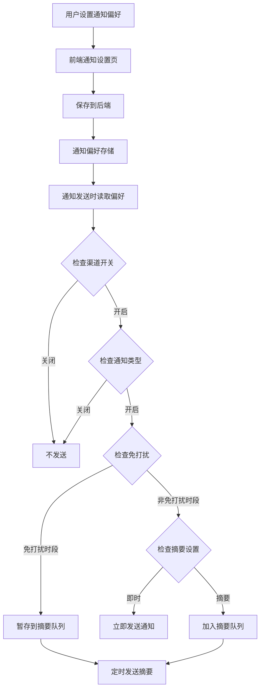
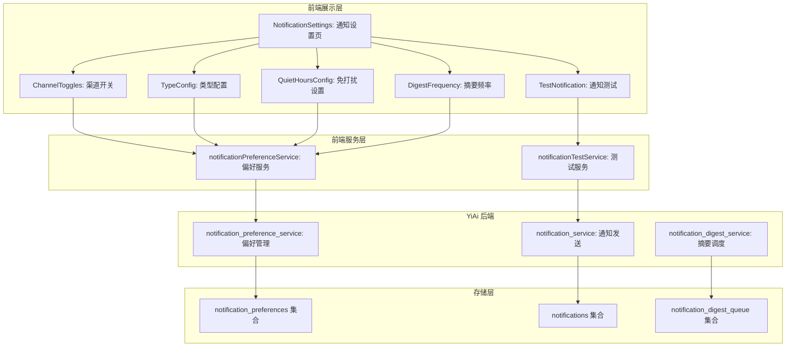
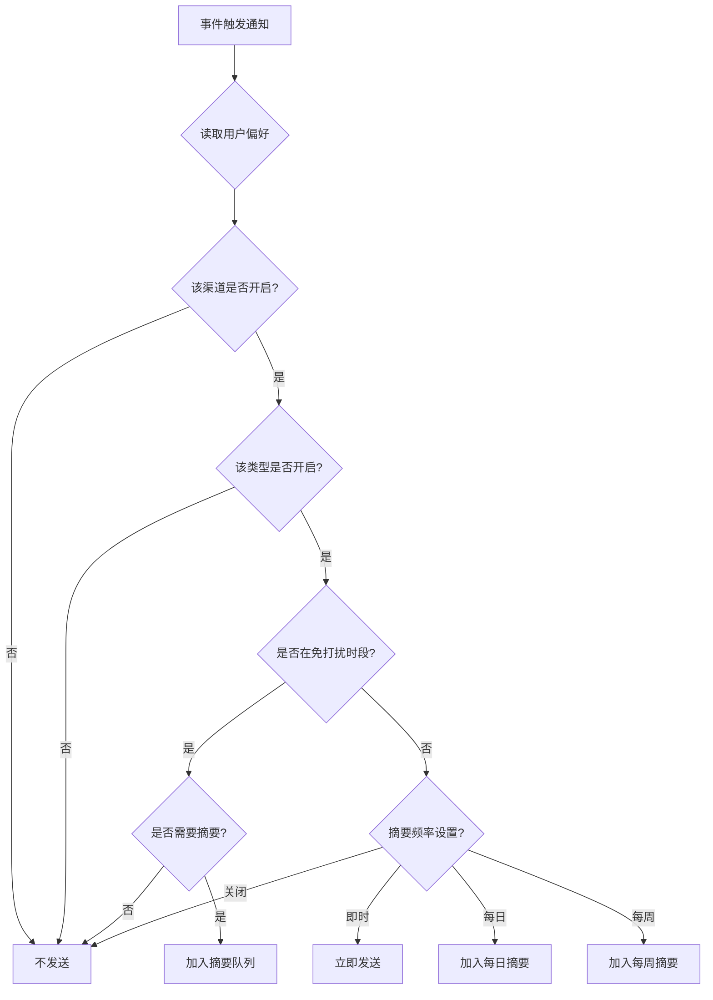

# YV-09-199: 用户通知设置 — 渠道开关、类型配置、免打扰时段、摘要频率、通知测试

> 需求编号：YV-09-199 · 优先级：P2 · 人天：0.3d · 状态：需求已编写
> 依赖：YV-09-27（通知中心）

## 背景

### 问题陈述

YiVad 当前的通知中心（YV-09-27）已实现了通知的接收和展示，但用户无法自主控制通知的接收方式和频率。所有用户面对相同的通知策略，无法根据个人偏好调整。当前存在以下问题：

1. **通知渠道不可选**：用户无法选择通过哪些渠道（站内、邮件、企业微信）接收通知
2. **通知类型无法配置**：所有类型的通知（Issue 更新、评论、系统公告等）统一发送，无法按类型开关
3. **缺乏免打扰时段**：无法设置在特定时间段不接收通知，非工作时间也被打扰
4. **摘要频率不可调**：频繁的通知造成信息过载，用户无法选择接收每日/每周摘要
5. **设置无法验证**：修改通知设置后无法测试是否生效
6. **偏好不同步**：通知偏好在不同设备间不同步

**核心矛盾**：用户对通知频率和渠道有不同偏好，当前的统一通知策略导致部分用户被过度打扰，部分用户错过重要通知。

### 影响范围

| # | 影响 | 严重程度 | 典型场景 |
|---|------|----------|----------|
| 1 | 通知过度打扰 | 高 | 用户每天收到 50+ 条通知，影响正常工作 |
| 2 | 重要通知错过 | 中 | 用户关闭所有通知后，错过紧急 Issue 提醒 |
| 3 | 非工作时间打扰 | 中 | 晚上 10 点收到 Issue 分配通知 |
| 4 | 信息过载 | 中 | 频繁的摘要邮件导致邮箱被通知淹没 |
| 5 | 渠道不匹配 | 低 | 用户习惯用企业微信，但通知只发站内 |
| 6 | 设置无法验证 | 低 | 修改后不确定通知是否生效 |

### 挑战

| 挑战 | 说明 |
|------|------|
| 通知系统解耦 | 需在通知发送链路中插入用户偏好过滤逻辑 |
| 多端同步 | 通知偏好在 Web 端修改后需同步到后端 |
| 免打扰计算 | 需正确处理时区和跨天免打扰时段 |
| 摘要生成 | 定时任务汇总通知，需要后端调度支持 |
| 通知测试 | 需有安全的测试通道，不干扰真实通知流 |

---

## 一、现状分析

### 1.1 当前通知系统现状

```
现有通知系统 (YV-09-27):
├── 通知中心页面
│   ├── 通知列表展示
│   ├── 通知已读/未读状态
│   └── 通知筛选
├── 通知发送
│   ├── 站内通知
│   └── 统一发送策略
├── 通知类型
│   ├── Issue 更新
│   ├── 评论回复
│   ├── @提及
│   └── 系统公告

缺失:
├── 通知渠道选择              # ❌ 不存在
├── 通知类型开关              # ❌ 不存在
├── 免打扰时段设置            # ❌ 不存在
├── 摘要频率配置              # ❌ 不存在
├── 通知测试功能              # ❌ 不存在
├── 通知偏好持久化            # ❌ 不存在
└── 多渠道通知路由            # ❌ 不存在
```

### 1.2 通知设置数据流



### 1.3 根因矩阵

| 症状 | 根因 | 触发条件 | 频率 |
|------|------|----------|------|
| 通知过度打扰 | 无免打扰设置 | 非工作时间收到通知 | 高 |
| 重要通知错过 | 无类型开关 | 用户关闭所有通知 | 中 |
| 信息过载 | 无摘要频率 | 频繁通知堆积 | 中 |
| 渠道不匹配 | 无渠道选择 | 用户期望特定渠道 | 中 |
| 设置不确定 | 无通知测试 | 修改设置后 | 低 |
| 偏好丢失 | 无持久化 | 清除缓存后 | 低 |

---

## 二、设计决策

### 决策 1：通知偏好存储 — 前端 localStorage vs 后端数据库 vs 混合

| 选项 | 多端同步 | 可靠性 | 实现复杂度 |
|------|----------|--------|------------|
| 前端 localStorage | 不支持 | 低（清除缓存丢失） | 低 |
| 后端数据库 | 支持 | 高 | 中 |
| 混合（localStorage 缓存 + 后端同步） | 支持 | 高 | 高 |

**选择：后端数据库。** 通知偏好是多端共享的配置，应以后端为准。前端仅做乐观更新展示，实际生效以后端存储为准。

### 决策 2：免打扰时段 — 全局时段 vs 工作日/周末分开 vs 按天自定义

| 选项 | 灵活性 | 易用性 | 复杂度 |
|------|--------|--------|--------|
| 全局时段（一个时间段） | 低 | 高 | 低 |
| 工作日/周末分开 | 中 | 中 | 中 |
| 按天自定义（周一到周日各自设置） | 高 | 低 | 高 |

**选择：工作日/周末分开。** 大多数用户的需求是工作日夜间免打扰 + 周末全天免打扰，两个时段足以覆盖常见场景，避免过度复杂。

### 决策 3：摘要方式 — 每日摘要 vs 每周摘要 vs 可配置频率

| 选项 | 灵活性 | 时效性 | 复杂度 |
|------|--------|--------|--------|
| 仅每日摘要 | 低 | 中 | 低 |
| 仅每周摘要 | 低 | 低 | 低 |
| 可配置（即时/每日/每周/关闭） | 高 | 高 | 中 |

**选择：可配置频率。** 不同通知类型适合不同频率（紧急 Issue 即时通知，周报每周摘要），支持按类型配置摘要频率。

### 决策 4：通知测试 — 模拟通知 vs 真实测试通道 vs 预览

| 选项 | 真实性 | 安全性 | 用户体验 |
|------|--------|--------|----------|
| 模拟通知（前端 mock） | 低 | 高 | 中 |
| 真实测试通道 | 高 | 中 | 高 |
| 预览（显示将收到的通知样式） | 低 | 高 | 中 |

**选择：真实测试通道。** 发送一条标记为"测试"的真实通知，让用户确认各渠道正常接收。

### 设计决策记录

| 决策 | 选项 A | 选项 B | 选项 C | 选择 | 理由 |
|------|--------|--------|--------|------|------|
| 偏好存储 | localStorage | 后端数据库 | 混合 | **后端数据库** | 多端同步，可靠 |
| 免打扰时段 | 全局时段 | 工作日/周末 | 按天自定义 | **工作日/周末分开** | 覆盖常见需求 |
| 摘要方式 | 每日 | 每周 | 可配置 | **可配置频率** | 灵活适配不同类型 |
| 通知测试 | 模拟 | 真实测试 | 预览 | **真实测试通道** | 真实验证渠道 |

---

## 三、目标架构

### 3.1 通知设置系统架构



### 3.2 通知发送决策流程



### 3.3 通知设置指标

| 指标 | 改造前 | 改造后 |
|------|--------|--------|
| 通知渠道可控性 | 无 | 站内/邮件/企业微信独立开关 |
| 通知类型控制 | 无 | 按 Issue/评论/@提及/系统公告等分类控制 |
| 免打扰 | 不支持 | 工作日/周末独立免打扰时段 |
| 摘要频率 | 无 | 即时/每日/每周/关闭 可选 |
| 通知测试 | 不支持 | 支持发送测试通知 |
| 偏好持久化 | 无 | 后端持久化，多端同步 |

---

## 四、具体改动

### 4.1 通知偏好服务

```typescript
// src/services/notification-preference-service.ts (新增)

interface NotificationChannel {
  id: 'in_app' | 'email' | 'wechat_work';
  name: string;
  description: string;
  enabled: boolean;
  verified: boolean;
}

interface NotificationTypeConfig {
  id: string;
  name: string;
  description: string;
  category: 'issue' | 'comment' | 'system' | 'mention' | 'document';
  channels: Record<string, boolean>;
  digest: 'instant' | 'daily' | 'weekly' | 'off';
}

interface QuietHours {
  enabled: boolean;
  weekday: {
    start: string; // HH:mm
    end: string;   // HH:mm
  };
  weekend: {
    start: string;
    end: string;
  };
  timezone: string;
}

interface DigestConfig {
  daily: {
    enabled: boolean;
    send_time: string; // HH:mm
  };
  weekly: {
    enabled: boolean;
    day_of_week: number; // 0=周日, 1=周一 ...
    send_time: string;
  };
}

interface NotificationPreferences {
  channels: NotificationChannel[];
  type_configs: NotificationTypeConfig[];
  quiet_hours: QuietHours;
  digest: DigestConfig;
  updated_at: string;
}

class NotificationPreferenceService {
  private baseUrl: string;

  constructor() {
    this.baseUrl = import.meta.env.RS_BUILD_API_BASE || 'http://localhost:10086';
  }

  async getPreferences(): Promise<NotificationPreferences> {
    const response = await fetch(`${this.baseUrl}/`, {
      method: 'POST',
      headers: { 'Content-Type': 'application/json' },
      body: JSON.stringify({
        module_name: 'services.notification.preference_service',
        method_name: 'get_preferences',
        parameters: {},
      }),
    });
    const data = await response.json();
    return data.code === 0 ? data.data : null;
  }

  async updatePreferences(preferences: Partial<NotificationPreferences>): Promise<NotificationPreferences> {
    const response = await fetch(`${this.baseUrl}/`, {
      method: 'POST',
      headers: { 'Content-Type': 'application/json' },
      body: JSON.stringify({
        module_name: 'services.notification.preference_service',
        method_name: 'update_preferences',
        parameters: { preferences },
      }),
    });
    const data = await response.json();
    return data.code === 0 ? data.data : null;
  }

  async sendTestNotification(channel: string): Promise<{ success: boolean; message: string }> {
    const response = await fetch(`${this.baseUrl}/`, {
      method: 'POST',
      headers: { 'Content-Type': 'application/json' },
      body: JSON.stringify({
        module_name: 'services.notification.test_service',
        method_name: 'send_test',
        parameters: { channel },
      }),
    });
    const data = await response.json();
    return data.code === 0 ? data.data : { success: false, message: data.message };
  }

  async updateChannel(channelId: string, enabled: boolean): Promise<void> {
    await fetch(`${this.baseUrl}/`, {
      method: 'POST',
      headers: { 'Content-Type': 'application/json' },
      body: JSON.stringify({
        module_name: 'services.notification.preference_service',
        method_name: 'update_channel',
        parameters: { channel_id: channelId, enabled },
      }),
    });
  }

  async updateTypeConfig(typeId: string, config: Partial<NotificationTypeConfig>): Promise<void> {
    await fetch(`${this.baseUrl}/`, {
      method: 'POST',
      headers: { 'Content-Type': 'application/json' },
      body: JSON.stringify({
        module_name: 'services.notification.preference_service',
        method_name: 'update_type_config',
        parameters: { type_id: typeId, config },
      }),
    });
  }
}

export const notificationPreferenceService = new NotificationPreferenceService();
export type { NotificationChannel, NotificationTypeConfig, QuietHours, DigestConfig, NotificationPreferences };
```

### 4.2 通知设置页主组件

```vue
<!-- src/views/settings/NotificationSettings.vue (新增) -->

<script setup lang="ts">
import { ref, onMounted } from 'vue';
import { ElMessage } from 'element-plus';
import { notificationPreferenceService } from '@/services/notification-preference-service';
import type { NotificationPreferences, NotificationChannel, NotificationTypeConfig, QuietHours, DigestConfig } from '@/services/notification-preference-service';
import ChannelToggles from './components/ChannelToggles.vue';
import TypeConfigTable from './components/TypeConfigTable.vue';
import QuietHoursConfig from './components/QuietHoursConfig.vue';
import DigestFrequencyConfig from './components/DigestFrequencyConfig.vue';
import TestNotificationPanel from './components/TestNotificationPanel.vue';

const preferences = ref<NotificationPreferences | null>(null);
const loading = ref(true);
const saving = ref(false);
const activeTab = ref('channels');

async function loadPreferences() {
  loading.value = true;
  try {
    preferences.value = await notificationPreferenceService.getPreferences();
  } finally {
    loading.value = false;
  }
}

async function handleChannelToggle(channel: NotificationChannel) {
  if (!preferences.value) return;
  await notificationPreferenceService.updateChannel(channel.id, channel.enabled);
  ElMessage.success(`${channel.name} ${channel.enabled ? '已开启' : '已关闭'}`);
}

async function handleTypeConfigUpdate(typeId: string, config: Partial<NotificationTypeConfig>) {
  await notificationPreferenceService.updateTypeConfig(typeId, config);
  ElMessage.success('通知类型配置已更新');
}

async function handleQuietHoursSave(quietHours: QuietHours) {
  if (!preferences.value) return;
  saving.value = true;
  try {
    preferences.value.quiet_hours = quietHours;
    await notificationPreferenceService.updatePreferences({ quiet_hours: quietHours });
    ElMessage.success('免打扰时段已保存');
  } finally {
    saving.value = false;
  }
}

async function handleDigestSave(digest: DigestConfig) {
  if (!preferences.value) return;
  saving.value = true;
  try {
    preferences.value.digest = digest;
    await notificationPreferenceService.updatePreferences({ digest });
    ElMessage.success('摘要频率已保存');
  } finally {
    saving.value = false;
  }
}

async function handleTestNotification(channel: string) {
  const result = await notificationPreferenceService.sendTestNotification(channel);
  if (result.success) {
    ElMessage.success(`测试通知已通过 ${channel} 发送`);
  } else {
    ElMessage.error(`发送失败: ${result.message}`);
  }
}

onMounted(loadPreferences);
</script>

<template>
  <div class="notification-settings" v-loading="loading">
    <div class="ns-header">
      <h2>通知设置</h2>
      <p class="ns-description">配置接收通知的渠道、类型和频率</p>
    </div>

    <el-tabs v-model="activeTab">
      <el-tab-pane label="通知渠道" name="channels">
        <ChannelToggles
          v-if="preferences"
          :channels="preferences.channels"
          @toggle="handleChannelToggle"
        />
      </el-tab-pane>

      <el-tab-pane label="通知类型" name="types">
        <TypeConfigTable
          v-if="preferences"
          :type-configs="preferences.type_configs"
          :channels="preferences.channels"
          @update="handleTypeConfigUpdate"
        />
      </el-tab-pane>

      <el-tab-pane label="免打扰" name="quiet-hours">
        <QuietHoursConfig
          v-if="preferences"
          :quiet-hours="preferences.quiet_hours"
          :saving="saving"
          @save="handleQuietHoursSave"
        />
      </el-tab-pane>

      <el-tab-pane label="摘要频率" name="digest">
        <DigestFrequencyConfig
          v-if="preferences"
          :digest="preferences.digest"
          :saving="saving"
          @save="handleDigestSave"
        />
      </el-tab-pane>

      <el-tab-pane label="测试通知" name="test">
        <TestNotificationPanel
          v-if="preferences"
          :channels="preferences.channels"
          @test="handleTestNotification"
        />
      </el-tab-pane>
    </el-tabs>
  </div>
</template>
```

### 4.3 文件变更清单

| 文件 | 操作 | 说明 |
|------|------|------|
| `src/services/notification-preference-service.ts` | 新增 | 通知偏好 API 服务层 |
| `src/views/settings/NotificationSettings.vue` | 新增 | 通知设置主页面 |
| `src/views/settings/components/ChannelToggles.vue` | 新增 | 渠道开关组件 |
| `src/views/settings/components/TypeConfigTable.vue` | 新增 | 类型配置表格组件 |
| `src/views/settings/components/QuietHoursConfig.vue` | 新增 | 免打扰时段配置组件 |
| `src/views/settings/components/DigestFrequencyConfig.vue` | 新增 | 摘要频率配置组件 |
| `src/views/settings/components/TestNotificationPanel.vue` | 新增 | 测试通知面板组件 |
| `src/router/routes.ts` | 修改 | 添加通知设置路由 |

---

## 五、实施步骤

| 步骤 | 操作 | 路径 | 验证 | 人天 |
|------|------|------|------|------|
| 1 | 实现通知偏好 API 服务 | `notification-preference-service.ts` | 偏好 CURD API 调用正常 | 0.04 |
| 2 | 实现通知设置主页面框架 | `NotificationSettings.vue` | 页面布局 + Tab 切换 | 0.04 |
| 3 | 实现渠道开关组件 | `ChannelToggles.vue` | 开关切换 + 状态持久化 | 0.03 |
| 4 | 实现类型配置表格 | `TypeConfigTable.vue` | 按类型配置渠道和摘要 | 0.04 |
| 5 | 实现免打扰时段配置 | `QuietHoursConfig.vue` | 时间选择 + 工作日/周末分开 | 0.04 |
| 6 | 实现摘要频率配置 | `DigestFrequencyConfig.vue` | 每日/每周摘要时间设置 | 0.03 |
| 7 | 实现通知测试面板 | `TestNotificationPanel.vue` | 发送测试通知 + 结果反馈 | 0.04 |
| 8 | 添加路由和导航入口 | `routes.ts` | 从设置菜单访问通知设置 | 0.04 |

**总人天：0.3d**

---

## 六、测试规格

### 场景 1：开启/关闭通知渠道

**GIVEN** 用户在通知设置页面，站内通知当前开启，邮件通知关闭
**WHEN** 用户点击邮件通知的开关将其开启
**THEN** 邮件通知开关变为开启状态，后端偏好已更新
**AND** 后续通知将同时通过站内和邮件发送

### 场景 2：配置通知类型

**GIVEN** 用户在通知类型表格中，Issue 更新当前渠道为站内通知
**WHEN** 用户将 Issue 更新的邮件渠道也勾选上，摘要频率设置为"每日摘要"
**THEN** Issue 更新将同时发送站内和邮件通知，邮件通知以每日摘要形式发送

### 场景 3：设置免打扰时段

**GIVEN** 用户设置工作日晚间免打扰 22:00-08:00，周末全天免打扰
**WHEN** 系统在周一 23:00 触发一条通知
**THEN** 该通知不立即发送，被加入摘要队列
**AND** 在第二天 08:00 后通过每日摘要发送

### 场景 4：配置每日摘要

**GIVEN** 用户设置每日摘要发送时间为 09:00
**WHEN** 前一天有 5 条配置为"每日摘要"的通知被加入队列
**THEN** 在当天 09:00，用户收到一封包含 5 条通知摘要的邮件
**AND** 摘要邮件包含通知类型、标题、时间、快捷操作链接

### 场景 5：发送测试通知

**GIVEN** 用户开启了邮件通知渠道
**WHEN** 用户在测试面板选择"邮件"渠道，点击"发送测试通知"
**THEN** 后端发送一条测试邮件到用户邮箱
**AND** 前端显示"测试通知已发送"成功提示
**AND** 如果邮件发送失败，显示具体错误信息

### 场景 6：保存通知偏好

**GIVEN** 用户修改了多项通知设置（渠道、类型、免打扰、摘要）
**WHEN** 用户切换页面或刷新
**THEN** 所有设置保持修改后的状态
**AND** 多端登录时，其他端读取到相同的偏好设置

---

## 七、风险与缓解

| 风险 | 概率 | 影响 | 缓解措施 |
|------|------|------|----------|
| 通知偏好查询失败导致通知发送逻辑异常 | 低 | 高 | 查询失败时使用默认偏好（全渠道开启、即时通知） |
| 免打扰时段判断受时区影响 | 中 | 中 | 后端统一使用 UTC 存储，前端根据用户时区转换 |
| 摘要生成定时任务失败 | 中 | 中 | 添加任务失败重试机制（3 次），失败后记录日志 |
| 通知偏好数据量大导致查询慢 | 低 | 低 | 偏好数据量小（每个用户一条文档），添加用户索引 |
| 通知测试被误认为真实通知 | 低 | 低 | 测试通知标题明确标注 [测试]，内容包含测试标识 |

---

## 八、回滚策略

| 场景 | 回滚操作 | 影响 |
|------|----------|------|
| 偏好查询异常 | 回退到默认偏好（全渠道开启、即时通知） | 用户收到过多通知 |
| 免打扰判断异常 | 暂停免打扰功能，所有通知即时发送 | 非工作时间被通知打扰 |
| 摘要生成异常 | 降级为即时发送所有通知 | 通知频率增加 |
| 通知设置页异常 | 隐藏通知设置入口 | 用户无法调整偏好 |

---

## 九、设计决策记录

### D-01：通知偏好存储位置

- **问题**：通知偏好存储在前端还是后端
- **选项**：localStorage、后端数据库、混合
- **选择**：后端数据库
- **理由**：多端同步需要，以后端为准保证可靠性

### D-02：免打扰时段设计

- **问题**：免打扰时段如何设计
- **选项**：全局时段、工作日/周末分开、按天自定义
- **选择**：工作日/周末分开
- **理由**：覆盖主流需求（夜间免打扰 + 周末免打扰），避免过度复杂

### D-03：摘要方式

- **问题**：摘要通知的频率如何设置
- **选项**：每日、每周、可配置
- **选择**：可配置频率
- **理由**：不同通知类型适合不同频率，按类型配置更灵活

### D-04：通知测试方式

- **问题**：如何验证通知设置是否生效
- **选项**：模拟通知、真实测试通道、预览
- **选择**：真实测试通道
- **理由**：真实验证各渠道是否正常工作

---

## 十、可观测性

### 指标

| 指标 | 类型 | 说明 |
|------|------|------|
| `yivad.notification.pref_load_time_ms` | Histogram | 通知偏好加载耗时 |
| `yivad.notification.pref_save_time_ms` | Histogram | 通知偏好保存耗时 |
| `yivad.notification.test_success_rate` | Gauge | 测试通知成功率 |
| `yivad.notification.channel_enabled_ratio` | Gauge | 各渠道开启比例 |
| `yivad.notification.quiet_hours_active` | Gauge | 当前是否在免打扰时段 |

### 告警

| 告警 | 条件 | 级别 |
|------|------|------|
| 偏好查询失败 | 查询失败率 > 1% | WARNING |
| 摘要生成延迟 | 摘要发送延迟 > 30 分钟 | WARNING |
| 通知测试持续失败 | 测试失败率 > 10% | WARNING |
| 偏好保存失败 | 保存失败次数 > 5 次/小时 | ERROR |

---

## 十一、代码审查检查清单

- [ ] 通知渠道开关支持独立控制
- [ ] 通知类型配置支持按渠道和摘要频率设置
- [ ] 免打扰时段支持工作日/周末独立配置
- [ ] 免打扰时段正确处理跨天情况(如 22:00-08:00)
- [ ] 摘要频率支持即时/每日/每周/关闭四种选项
- [ ] 通知测试功能为每种渠道提供独立测试按钮
- [ ] 测试通知明确标注为[测试]，与真实通知区分
- [ ] 偏好修改后即时保存到后端，不需要手动保存按钮
- [ ] 偏好加载失败时使用合理的默认值
- [ ] 时区信息正确显示和转换
- [ ] 表单校验完整（时间格式、必填项等）

---

## 回归问题预测

| # | 预测问题 | 原因 | 验证方法 |
|---|---------|------|---------|
| 1 | 修改通知偏好后，其他已登录的端未实时更新 | 偏好数据无推送更新机制 | 其他端在通知发送时重新读取偏好，或添加 WebSocket 推送偏好变更事件 |
| 2 | 免打扰时段跨天配置（22:00-08:00）时，时间比较逻辑错误 | 前端时间选择器仅支持同一天内的时间范围 | 前端校验时允许 end < start 表示跨天，后端使用正确的日期比较 |
| 3 | 关闭所有通知渠道后，用户收不到任何通知，包括系统重要公告 | 用户将全部渠道关闭，系统无强制通知通道 | 系统公告类型通知不受渠道开关限制，始终通过站内通知发送 |
| 4 | 摘要定时任务在发送摘要时，如果摘要内容为空（无排队通知），仍发送空邮件 | 定时任务未检查队列是否为空 | 发送前检查摘要队列，无排队通知时跳过本次发送 |
| 5 | 用户设置每日摘要 09:00，但实际在 09:30 才收到，延迟 30 分钟 | 定时任务调度精度不足或任务堆积 | 使用精确调度（分钟级），添加任务执行时间监控 |
| 6 | 通知测试功能发送的测试邮件被邮件服务商识别为垃圾邮件 | 测试邮件内容简单，缺乏正式邮件格式 | 测试邮件使用正式邮件模板，包含标准邮件头和签名 |

---

## 性能分析

### 各操作耗时

| 阶段 | 预估耗时 | 说明 |
|------|----------|------|
| 通知偏好加载 | < 200ms | 单文档查询，数据量小 |
| 通知偏好保存 | < 300ms | 单文档更新 |
| 通知测试发送 | < 2s | 实际发送测试通知到目标渠道 |
| 摘要生成 | < 5s | 批量处理摘要队列 |

### 内存影响

| 项目 | 体积 | 说明 |
|------|------|------|
| notification-preference-service.ts | ~4KB | 通知偏好 API 服务 |
| NotificationSettings.vue | ~6KB | 通知设置主页面 |
| 各子组件 | ~15KB | 5 个子组件 |
| 运行时数据 | < 50KB | 通知偏好数据量小 |

### 对应用性能的影响

| 阶段 | 影响 | 说明 |
|------|------|------|
| 偏好加载 | < 200ms | 单文档查询，可缓存 |
| 偏好保存 | < 300ms | 即时保存，无阻塞感 |
| 测试通知 | < 2s | 异步发送，不阻塞页面 |
| 摘要调度 | 后台执行 | 定时任务，不影响前端 |

