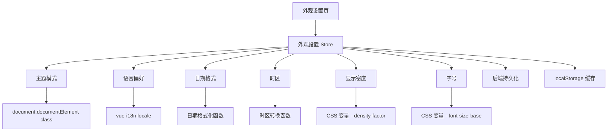
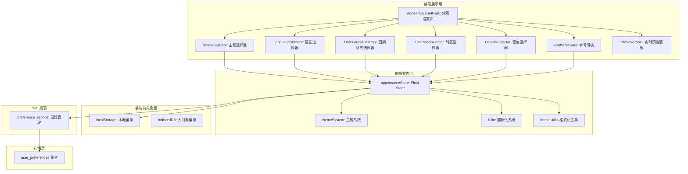
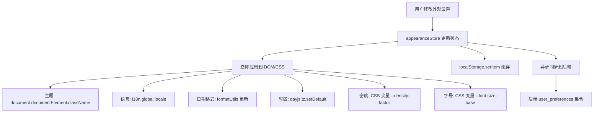

# YV-09-200: 用户外观设置 — 主题(亮色/暗色/自动)、语言、日期格式、时区、密度(舒适/紧凑)、字号

> 需求编号：YV-09-200 · 优先级：P2 · 人天：0.3d · 状态：需求已编写
> 依赖：YV-09-03（暗色主题切换）、YV-09-04（国际化）、YV-09-26（主题系统与暗色模式）

## 背景

### 问题陈述

YiVad 目前已支持暗色主题切换（YV-09-03）和国际化（YV-09-04），但外观设置分散在系统各处，缺乏统一的用户外观偏好管理页面。用户无法在一个集中的页面管理所有视觉偏好。当前存在以下问题：

1. **设置分散**：主题切换在导航栏、语言切换在底部、其他外观设置不存在
2. **缺乏自动主题**：仅支持手动切换亮色/暗色，不支持跟随系统自动切换
3. **日期格式固定**：日期格式硬编码为 YYYY-MM-DD，不支持用户偏好（如 DD/MM/YYYY）
4. **时区不支持**：时间显示以服务器时区为准，不支持用户时区设置
5. **显示密度不可调**：界面间距固定，不支持紧凑模式以适应更多内容
6. **字号不可调**：默认字号不支持调整，对视力不佳用户不友好

**核心矛盾**：不同用户对视觉体验有不同偏好，而当前系统缺乏统一的外观设置入口和个性化选项，导致部分用户使用体验不佳。

### 影响范围

| # | 影响 | 严重程度 | 典型场景 |
|---|------|----------|----------|
| 1 | 设置分散 | 中 | 用户需要到不同位置修改主题和语言 |
| 2 | 缺少自动主题 | 低 | macOS 切换到暗色模式后，应用仍是亮色 |
| 3 | 日期格式混淆 | 中 | 国际团队中，美式和中式日期格式混用 |
| 4 | 时区混乱 | 中 | 查看 Issue 时间时，不清楚是哪个时区 |
| 5 | 密度不适 | 中 | 大屏用户希望更紧凑，小屏用户希望更舒适 |
| 6 | 字号固定 | 低 | 老年用户或视力不佳用户阅读困难 |

### 挑战

| 挑战 | 说明 |
|------|------|
| 设置持久化 | 外观设置需要跨设备同步 + 本地快速恢复 |
| 实时生效 | 修改外观设置后需即时反映到整个应用 |
| CSS 变量体系 | 密度和字号需要基于 CSS 变量实现全局调整 |
| 时区一致性 | 所有时间显示需统一使用用户时区转换 |
| 向后兼容 | 新增默认值不改变现有用户体验 |

---

## 一、现状分析

### 1.1 当前外观设置现状

```
现有外观设置:
├── 主题切换 (YV-09-03)
│   ├── 导航栏主题切换按钮
│   ├── 亮色/暗色手动切换
│   └── 通过 Pinia store 管理
├── 国际化 (YV-09-04)
│   ├── 中文/英文切换
│   ├── 底部语言选择器
│   └── vue-i18n 实现
├── CSS 变量体系 (YV-09-26)
│   ├── 主题色彩变量
│   └── 间距/字号变量

缺失:
├── 自动主题(跟随系统)        # ❌ 不存在
├── 日期格式偏好              # ❌ 不存在
├── 时区设置                  # ❌ 不存在
├── 显示密度选择              # ❌ 不存在
├── 字号调整                  # ❌ 不存在
├── 统一外观设置页面          # ❌ 不存在
└── 外观设置预览              # ❌ 不存在
```

### 1.2 外观设置数据流



### 1.3 根因矩阵

| 症状 | 根因 | 触发条件 | 频率 |
|------|------|----------|------|
| 主题不跟随系统 | 无自动主题模式 | 系统主题变更时 | 中 |
| 日期格式混淆 | 无日期格式偏好 | 查看日期时 | 高 |
| 时间不明确 | 无时区设置 | 跨时区协作时 | 中 |
| 界面太密集/太稀疏 | 无密度选项 | 不同屏幕/偏好 | 中 |
| 字号不合适 | 无字号调整 | 视力不佳时 | 低 |
| 设置不统一 | 无集中设置页 | 修改多个外观选项时 | 中 |

---

## 二、设计决策

### 决策 1：主题模式 — 仅手动 vs 手动 + 自动 vs 手动 + 自动 + 定时计划

| 选项 | 灵活性 | 复杂度 | 用户体验 |
|------|--------|--------|----------|
| 仅手动（亮色/暗色） | 低 | 低 | 中 |
| 手动 + 自动（跟随系统） | 中 | 中 | 高 |
| 手动 + 自动 + 定时计划（如 18:00 自动暗色） | 高 | 高 | 高 |

**选择：手动 + 自动。** 跟随系统主题是主流需求（macOS/iOS/Android 均支持），定时计划使用场景有限，暂不引入过多复杂度。

### 决策 2：日期格式 — 预设模板 vs 自由格式 vs 按区域预设

| 选项 | 灵活性 | 易用性 | 覆盖范围 |
|------|--------|--------|----------|
| 预设模板（YYYY-MM-DD, DD/MM/YYYY, MM/DD/YYYY） | 中 | 高 | 中 |
| 自由格式（用户自定义格式字符串） | 高 | 低 | 高 |
| 按区域预设（中文=YYYY-MM-DD, 英文=MM/DD/YYYY） | 低 | 高 | 低 |

**选择：预设模板 + 语言联动默认值。** 提供 5 种常用日期格式模板，默认值根据语言自动选择（中文=YYYY-MM-DD，英文=MM/DD/YYYY），用户可覆盖。

### 决策 3：显示密度实现 — 固定倍率 vs CSS 变量缩放 vs 组件级控制

| 选项 | 一致性 | 实现难度 | 精细化控制 |
|------|--------|----------|------------|
| 固定倍率（0.8x/1.0x/1.2x） | 高 | 低 | 低 |
| CSS 变量缩放 | 高 | 中 | 中 |
| 组件级独立控制 | 低 | 高 | 高 |

**选择：CSS 变量缩放。** 使用 `--density-factor` CSS 变量统一控制间距、内边距，所有组件自动响应，保持一致。

### 决策 4：外观设置存储 — 仅 localStorage vs 仅后端 vs localStorage + 后端同步

| 选项 | 首屏速度 | 跨设备同步 | 离线可用 |
|------|----------|------------|----------|
| 仅 localStorage | 快（无需网络） | 不支持 | 是 |
| 仅后端 | 慢（需网络） | 支持 | 否 |
| localStorage + 后端同步 | 快 | 支持 | 是 |

**选择：localStorage + 后端同步。** 首屏使用 localStorage 立即恢复（避免闪烁），后台静默同步到后端。localStorage 作为缓存，后端作为唯一数据源。

### 设计决策记录

| 决策 | 选项 A | 选项 B | 选项 C | 选择 | 理由 |
|------|--------|--------|--------|------|------|
| 主题模式 | 仅手动 | 手动+自动 | 手动+自动+定时 | **手动+自动** | 跟随系统是主流需求 |
| 日期格式 | 预设模板 | 自由格式 | 按区域预设 | **预设+联动** | 简单实用 |
| 密度实现 | 固定倍率 | CSS 变量 | 组件级 | **CSS 变量** | 全局一致 |
| 设置存储 | localStorage | 后端 | localStorage+后端 | **localStorage+后端** | 快速 + 同步 |

---

## 三、目标架构

### 3.1 外观设置系统架构



### 3.2 外观设置生效流程



### 3.3 外观设置指标

| 指标 | 改造前 | 改造后 |
|------|--------|--------|
| 主题模式 | 亮色/暗色手动 | 亮色/暗色/自动 |
| 语言切换入口 | 分散（导航栏+底部） | 统一外观设置页 |
| 日期格式 | 固定 YYYY-MM-DD | 5 种预设格式可选 |
| 时区 | 不支持 | 标准时区列表选择 |
| 显示密度 | 固定 | 舒适/标准/紧凑 三种 |
| 字号调整 | 不支持 | 12-20px 范围滑块 |

---

## 四、具体改动

### 4.1 外观设置 Store

```typescript
// src/stores/appearance.ts (修改)

import { defineStore } from 'pinia';
import { ref, watch } from 'vue';
import { useI18n } from 'vue-i18n';

export type ThemeMode = 'light' | 'dark' | 'auto';
export type DateFormat = 'YYYY-MM-DD' | 'DD/MM/YYYY' | 'MM/DD/YYYY' | 'YYYY年MM月DD日' | 'DD.MM.YYYY';
export type Density = 'comfortable' | 'standard' | 'compact';

interface AppearanceState {
  theme: ThemeMode;
  locale: string;
  dateFormat: DateFormat;
  timezone: string;
  density: Density;
  fontSize: number;
}

export const useAppearanceStore = defineStore('appearance', () => {
  const theme = ref<ThemeMode>('auto');
  const locale = ref<string>('zh-CN');
  const dateFormat = ref<DateFormat>('YYYY-MM-DD');
  const timezone = ref<string>(Intl.DateTimeFormat().resolvedOptions().timeZone);
  const density = ref<Density>('standard');
  const fontSize = ref<number>(14);

  // 从 localStorage 初始化
  function initFromCache() {
    const cached = localStorage.getItem('appearance_settings');
    if (cached) {
      try {
        const parsed = JSON.parse(cached) as Partial<AppearanceState>;
        if (parsed.theme) theme.value = parsed.theme;
        if (parsed.locale) locale.value = parsed.locale;
        if (parsed.dateFormat) dateFormat.value = parsed.dateFormat;
        if (parsed.timezone) timezone.value = parsed.timezone;
        if (parsed.density) density.value = parsed.density;
        if (parsed.fontSize) fontSize.value = parsed.fontSize;
      } catch { /* ignore parse errors */ }
    }
  }

  // 应用到 DOM
  function applyTheme() {
    const root = document.documentElement;
    root.classList.remove('theme-light', 'theme-dark');
    if (theme.value === 'auto') {
      const prefersDark = window.matchMedia('(prefers-color-scheme: dark)').matches;
      root.classList.add(prefersDark ? 'theme-dark' : 'theme-light');
    } else {
      root.classList.add(`theme-${theme.value}`);
    }
  }

  function applyDensity() {
    const factors: Record<Density, number> = { comfortable: 1.2, standard: 1.0, compact: 0.8 };
    document.documentElement.style.setProperty('--density-factor', String(factors[density.value]));
  }

  function applyFontSize() {
    document.documentElement.style.setProperty('--font-size-base', `${fontSize.value}px`);
  }

  // 监听系统主题变化
  function watchSystemTheme() {
    const mediaQuery = window.matchMedia('(prefers-color-scheme: dark)');
    mediaQuery.addEventListener('change', () => {
      if (theme.value === 'auto') applyTheme();
    });
  }

  // 持久化到 localStorage
  function persistToLocal() {
    localStorage.setItem('appearance_settings', JSON.stringify({
      theme: theme.value,
      locale: locale.value,
      dateFormat: dateFormat.value,
      timezone: timezone.value,
      density: density.value,
      fontSize: fontSize.value,
    }));
  }

  // 同步到后端
  async function syncToBackend() {
    const baseUrl = import.meta.env.RS_BUILD_API_BASE || 'http://localhost:10086';
    await fetch(`${baseUrl}/`, {
      method: 'POST',
      headers: { 'Content-Type': 'application/json' },
      body: JSON.stringify({
        module_name: 'services.user.preference_service',
        method_name: 'update_appearance',
        parameters: {
          theme: theme.value,
          locale: locale.value,
          date_format: dateFormat.value,
          timezone: timezone.value,
          density: density.value,
          font_size: fontSize.value,
        },
      }),
    });
  }

  // 监听所有变更，自动应用 + 持久化
  const allRefs = [theme, locale, dateFormat, timezone, density, fontSize];
  allRefs.forEach(ref => {
    watch(ref, () => {
      applyTheme();
      applyDensity();
      applyFontSize();
      persistToLocal();
      syncToBackend();
    });
  });

  initFromCache();
  applyTheme();
  applyDensity();
  applyFontSize();
  watchSystemTheme();

  return { theme, locale, dateFormat, timezone, density, fontSize };
});
```

### 4.2 外观设置页面

```vue
<!-- src/views/settings/AppearanceSettings.vue (新增) -->

<script setup lang="ts">
import { computed } from 'vue';
import { useAppearanceStore } from '@/stores/appearance';
import type { ThemeMode, DateFormat, Density } from '@/stores/appearance';
import ThemeSelector from './components/ThemeSelector.vue';
import LanguageSelector from './components/LanguageSelector.vue';
import DateFormatSelector from './components/DateFormatSelector.vue';
import TimezoneSelector from './components/TimezoneSelector.vue';
import DensitySelector from './components/DensitySelector.vue';
import FontSizeSlider from './components/FontSizeSlider.vue';
import PreviewPanel from './components/PreviewPanel.vue';

const store = useAppearanceStore();

const theme = computed({
  get: () => store.theme,
  set: (v: ThemeMode) => { store.theme = v; },
});
const locale = computed({
  get: () => store.locale,
  set: (v: string) => { store.locale = v; },
});
const dateFormat = computed({
  get: () => store.dateFormat,
  set: (v: DateFormat) => { store.dateFormat = v; },
});
const timezone = computed({
  get: () => store.timezone,
  set: (v: string) => { store.timezone = v; },
});
const density = computed({
  get: () => store.density,
  set: (v: Density) => { store.density = v; },
});
const fontSize = computed({
  get: () => store.fontSize,
  set: (v: number) => { store.fontSize = v; },
});
</script>

<template>
  <div class="appearance-settings">
    <div class="as-header">
      <h2>外观设置</h2>
      <p class="as-description">自定义界面的视觉外观，所有修改即时生效</p>
    </div>

    <div class="as-content">
      <div class="as-settings">
        <el-card class="as-section">
          <template #header><span>主题模式</span></template>
          <ThemeSelector v-model="theme" />
        </el-card>

        <el-card class="as-section">
          <template #header><span>语言</span></template>
          <LanguageSelector v-model="locale" />
        </el-card>

        <el-card class="as-section">
          <template #header><span>日期格式</span></template>
          <DateFormatSelector v-model="dateFormat" />
        </el-card>

        <el-card class="as-section">
          <template #header><span>时区</span></template>
          <TimezoneSelector v-model="timezone" />
        </el-card>

        <el-card class="as-section">
          <template #header><span>显示密度</span></template>
          <DensitySelector v-model="density" />
        </el-card>

        <el-card class="as-section">
          <template #header><span>字号</span></template>
          <FontSizeSlider v-model="fontSize" />
        </el-card>
      </div>

      <div class="as-preview">
        <PreviewPanel />
      </div>
    </div>
  </div>
</template>
```

### 4.3 文件变更清单

| 文件 | 操作 | 说明 |
|------|------|------|
| `src/stores/appearance.ts` | 新增 | 外观设置 Pinia Store |
| `src/views/settings/AppearanceSettings.vue` | 新增 | 外观设置主页面 |
| `src/views/settings/components/ThemeSelector.vue` | 新增 | 主题选择器（亮色/暗色/自动） |
| `src/views/settings/components/LanguageSelector.vue` | 新增 | 语言选择器 |
| `src/views/settings/components/DateFormatSelector.vue` | 新增 | 日期格式选择器 |
| `src/views/settings/components/TimezoneSelector.vue` | 新增 | 时区选择器 |
| `src/views/settings/components/DensitySelector.vue` | 新增 | 密度选择器 |
| `src/views/settings/components/FontSizeSlider.vue` | 新增 | 字号滑块组件 |
| `src/views/settings/components/PreviewPanel.vue` | 新增 | 实时预览面板 |
| `src/router/routes.ts` | 修改 | 添加外观设置路由 |
| `src/styles/variables.css` | 修改 | 添加 --density-factor, --font-size-base CSS 变量 |

---

## 五、实施步骤

| 步骤 | 操作 | 路径 | 验证 | 人天 |
|------|------|------|------|------|
| 1 | 实现外观设置 Store | `stores/appearance.ts` | 状态管理 + localStorage 持久化 | 0.05 |
| 2 | 添加 CSS 变量体系 | `variables.css` | 密度/字号变量全局生效 | 0.03 |
| 3 | 实现外观设置主页面框架 | `AppearanceSettings.vue` | 双栏布局 + 实时预览 | 0.04 |
| 4 | 实现主题选择器 | `ThemeSelector.vue` | 亮色/暗色/自动三种模式 | 0.04 |
| 5 | 实现语言选择器 | `LanguageSelector.vue` | 语言切换即时生效 | 0.03 |
| 6 | 实现日期格式选择器 | `DateFormatSelector.vue` | 5 种格式模板 | 0.03 |
| 7 | 实现时区选择器 | `TimezoneSelector.vue` | IANA 时区列表搜索 | 0.03 |
| 8 | 实现密度选择器 | `DensitySelector.vue` | 舒适/标准/紧凑三种模式 | 0.02 |
| 9 | 实现字号滑块 + 预览面板 | `FontSizeSlider.vue` + `PreviewPanel.vue` | 字号调整 + 实时预览 | 0.03 |

**总人天：0.3d**

---

## 六、测试规格

### 场景 1：切换主题模式

**GIVEN** 当前主题为亮色模式
**WHEN** 用户在外观设置中选择"暗色"
**THEN** 整个应用即时切换为暗色主题，所有组件颜色变化
**AND** 刷新页面后，主题保持暗色模式

### 场景 2：自动主题跟随系统

**GIVEN** 系统当前为亮色模式，用户选择"自动"主题
**WHEN** 用户在 macOS 设置中将系统外观切换为暗色
**THEN** YiVad 自动切换为暗色主题
**AND** 导航栏中主题图标显示为"自动"状态

### 场景 3：切换日期格式

**GIVEN** 用户日期格式为 YYYY-MM-DD
**WHEN** 用户选择 DD/MM/YYYY 格式
**THEN** 所有页面中的日期显示即时变更为 DD/MM/YYYY 格式
**AND** Issue 创建时间从"2026-09-09"变为"09/09/2026"

### 场景 4：切换时区

**GIVEN** 用户时区为 Asia/Shanghai (UTC+8)
**WHEN** 用户切换时区为 America/New_York (UTC-5)
**THEN** 所有时间显示根据新时区转换
**AND** Issue 创建时间从"14:00"变为"01:00"

### 场景 5：切换显示密度

**GIVEN** 当前密度为标准模式
**WHEN** 用户选择"紧凑"密度
**THEN** 所有组件间距减小约 20%，表格行高减小
**AND** 同一页面可显示更多内容

### 场景 6：调整字号

**GIVEN** 当前字号为 14px
**WHEN** 用户拖动字号滑块到 18px
**THEN** 所有文字大小同比放大
**AND** 预览面板实时显示字号效果

---

## 七、风险与缓解

| 风险 | 概率 | 影响 | 缓解措施 |
|------|------|------|----------|
| 自动主题监听不兼容旧浏览器 | 低 | 低 | 使用 `matchMedia` API，不支持的浏览器降级为手动模式 |
| CSS 变量缩放导致布局异常 | 中 | 中 | 仅对 padding/gap/font-size 应用缩放，不影响 width/height |
| 时区数据量大导致选择器卡顿 | 低 | 中 | 使用虚拟滚动 + 搜索过滤优化时区选择器 |
| localStorage 缓存与后端数据不一致 | 中 | 低 | 以后端为准，前端在启动时从后端拉取最新数据覆盖缓存 |
| 字号过大导致 UI 溢出 | 中 | 中 | 限制字号范围为 12-20px，超出范围截断 |

---

## 八、回滚策略

| 场景 | 回滚操作 | 影响 |
|------|----------|------|
| 外观设置 Store 异常 | 回退到硬编码默认值 | 用户自定义外观丢失 |
| CSS 变量异常 | 移除 CSS 变量引用，使用硬编码值 | 密度/字号功能不可用 |
| 预览面板渲染异常 | 隐藏预览面板 | 用户无法预览效果 |
| localStorage 读取失败 | 使用内存默认值，提示用户重新设置 | 设置暂时丢失 |

---

## 九、设计决策记录

### D-01：主题模式选择

- **问题**：主题模式支持哪些选项
- **选项**：仅手动、手动+自动、手动+自动+定时
- **选择**：手动+自动
- **理由**：跟随系统主题是主流需求，定时计划使用场景有限

### D-02：日期格式选择方式

- **问题**：日期格式如何提供给用户选择
- **选项**：预设模板、自由格式、按区域预设
- **选择**：预设模板 + 语言联动
- **理由**：模板降低使用门槛，语言联动提供智能默认值

### D-03：显示密度实现方式

- **问题**：如何实现显示密度的全局控制
- **选项**：固定倍率、CSS 变量、组件级控制
- **选择**：CSS 变量缩放
- **理由**：全局一致性高，所有组件自动响应，无需逐个修改

### D-04：外观设置存储策略

- **问题**：外观设置存储在哪里
- **选项**：localStorage、后端、localStorage+后端
- **选择**：localStorage + 后端同步
- **理由**：首屏快速恢复避免闪烁，后端同步支持多设备

---

## 十、可观测性

### 指标

| 指标 | 类型 | 说明 |
|------|------|------|
| `yivad.appearance.theme_mode` | Gauge | 当前主题模式分布 |
| `yivad.appearance.locale` | Gauge | 当前语言分布 |
| `yivad.appearance.density` | Gauge | 当前密度分布 |
| `yivad.appearance.font_size_avg` | Gauge | 平均字号 |
| `yivad.appearance.sync_time_ms` | Histogram | 外观设置同步耗时 |

### 告警

| 告警 | 条件 | 级别 |
|------|------|------|
| 外观设置同步连续失败 | 连续 5 次同步失败 | WARNING |
| localStorage 写入失败 | 写入失败次数 > 0 | ERROR |
| CSS 变量应用异常 | 检测到变量值超出范围 | WARNING |

---

## 十一、代码审查检查清单

- [ ] 主题切换即时生效，不闪烁白屏
- [ ] 自动主题正确监听系统主题变化
- [ ] 语言切换后所有硬编码文本已通过 i18n 处理
- [ ] 日期格式切换全局生效（表格、详情页、时间线等）
- [ ] 时区选择器支持搜索过滤
- [ ] 密度切换正确应用 CSS 变量
- [ ] 字号滑块范围限制 12-20px
- [ ] 预览面板实时反映当前设置
- [ ] localStorage 缓存和后端同步互不阻塞
- [ ] 刷新页面后设置不丢失
- [ ] 初始化时无样式闪烁（使用 SSR/骨架屏或内联样式）

---

## 回归问题预测

| # | 预测问题 | 原因 | 验证方法 |
|---|---------|------|---------|
| 1 | 自动主题模式下，初始加载时出现亮色闪烁再切换到暗色 | localStorage 读取在 JS 执行阶段，CSS 先以默认样式渲染 | 在 `<head>` 中内联 `<script>` 读取 localStorage 并在 `<html>` 上提前设置 class |
| 2 | 日期格式切换后，部分组件（第三方库日期选择器）未跟随变化 | 第三方组件使用内部日期格式化逻辑，不读取全局格式 | 封装日期格式化 composable，所有日期显示统一通过该 composable |
| 3 | 紧凑模式下，部分固定宽度的组件元素溢出 | 固定宽度的组件未使用相对单位 | 审查所有固定宽度组件，关键区域使用 min-width + flex 布局 |
| 4 | 字号设置为 12px 时，表格排序图标、下拉箭头等图标太小看不清 | 图标尺寸使用 font-size 相对单位（em），随字号缩放 | 图标使用固定像素尺寸或设置最小尺寸阈值 |
| 5 | 时区切换后，相对时间显示（如"3 小时前"）计算错误 | 相对时间基于当前时间计算，受时区影响 | 统一使用 UTC 时间计算相对时间，仅绝对时间显示受时区影响 |
| 6 | 多个 Tab 同时打开时，一个 Tab 修改外观设置，其他 Tab 未同步 | localStorage 无跨 Tab 通信机制 | 监听 `storage` 事件，其他 Tab 收到事件后更新 Store |

---

## 性能分析

### 各操作耗时

| 阶段 | 预估耗时 | 说明 |
|------|----------|------|
| 外观设置初始化 | < 50ms | 读取 localStorage，同步操作 |
| 主题切换 | < 30ms | CSS 变量 + class 切换 |
| 语言切换 | < 100ms | vue-i18n locale 切换 + 重渲染 |
| 密度切换 | < 30ms | CSS 变量更新 |
| 设置同步到后端 | < 300ms | 异步，不阻塞 UI |

### 内存影响

| 项目 | 体积 | 说明 |
|------|------|------|
| appearance.ts (Pinia Store) | ~5KB | 外观设置状态管理 |
| AppearanceSettings.vue | ~6KB | 外观设置主页面 |
| 各子组件 | ~15KB | 7 个子组件 |
| 运行时数据 | < 10KB | 外观设置数据量极小 |

### 对应用性能的影响

| 阶段 | 影响 | 说明 |
|------|------|------|
| 初始化 | < 50ms | localStorage 同步读取，无网络请求 |
| 切换操作 | < 30ms | CSS 变量 + class 切换，浏览器原生操作 |
| 后端同步 | 异步 | 不阻塞前端操作，失败不影响功能 |
| 跨 Tab 同步 | < 10ms | storage 事件处理 |

