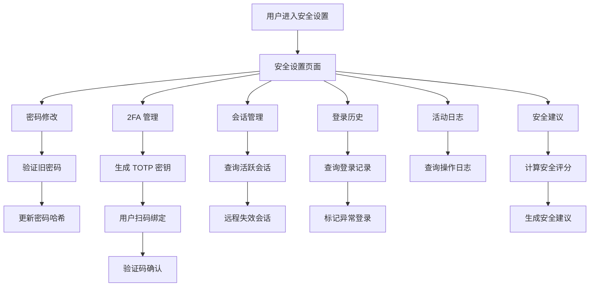
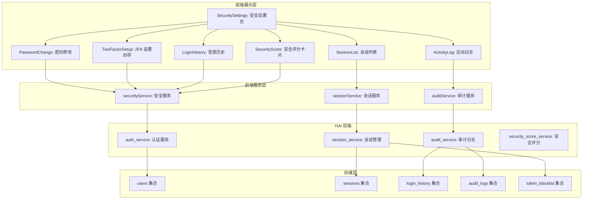
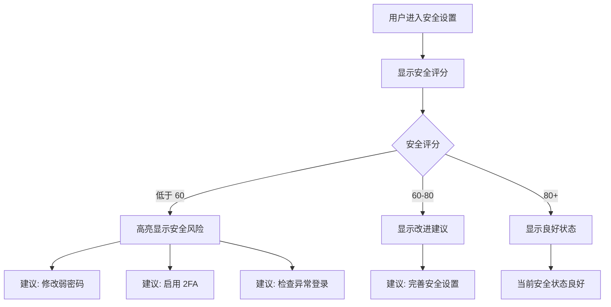

# YV-09-201: 用户安全设置 — 密码修改、双因素认证、会话管理、登录历史、活动日志、安全建议

> 需求编号：YV-09-201 · 优先级：P2 · 人天：0.3d · 状态：需求已编写
> 依赖：YV-09-08（用户系统基础）、YV-09-50（活动日志与审计追踪）

## 背景

### 问题陈述

YiVad 当前的用户系统仅支持基本的登录/登出功能，缺乏用户自主安全管理的入口。用户无法修改密码、管理活动会话、查看登录历史，也无法获取系统安全建议。当前存在以下问题：

1. **密码无法修改**：用户无法自主修改密码，需联系管理员操作
2. **无双因素认证**：仅靠用户名/密码认证，安全性不足
3. **会话管理缺失**：无法查看和管理当前活动会话，无法远程登出其他设备
4. **登录历史不明**：无法查看账户的登录历史，无法发现异常登录
5. **活动日志不可见**：无法查看账户的操作记录
6. **安全建议缺乏**：系统不提供个性化安全建议

**核心矛盾**：用户需要自主管理账户安全，但当前系统缺乏安全设置功能，导致用户依赖管理员操作，且无法及时发现安全风险。

### 影响范围

| # | 影响 | 严重程度 | 典型场景 |
|---|------|----------|----------|
| 1 | 密码无法自主修改 | 高 | 用户密码泄露后无法及时修改 |
| 2 | 认证安全性不足 | 高 | 无 2FA 保护，密码泄露即账户失控 |
| 3 | 无法管理多设备会话 | 中 | 用户在公共电脑登录后无法远程登出 |
| 4 | 异常登录无法发现 | 高 | 账户被异地登录，用户无法知晓 |
| 5 | 操作记录不可查 | 中 | 怀疑账户被操作后无法确认 |
| 6 | 安全风险不知情 | 中 | 弱密码、无 2FA 等风险无提示 |

### 挑战

| 挑战 | 说明 |
|------|------|
| 2FA 实现 | 需要集成 TOTP 算法、生成/验证动态码 |
| 会话追踪 | 需要后端维护会话列表，支持远程失效 |
| 登录历史 | 需记录 IP、设备、地理位置等信息 |
| 安全评分 | 需要定义安全评分模型和风险检测规则 |
| 敏感操作 | 密码修改、2FA 管理、会话失效等操作需额外验证 |

---

## 一、现状分析

### 1.1 当前安全系统现状

```
现有用户系统:
├── 用户认证（登录/登出）
│   ├── 用户名/密码登录
│   ├── JWT Token 管理
│   └── Token 过期自动刷新
├── 权限管理（RBAC）
│   └── 管理员分配角色和权限

缺失:
├── 密码修改功能              # ❌ 不存在
├── 双因素认证（2FA）        # ❌ 不存在
├── 会话管理                  # ❌ 不存在
├── 登录历史查看              # ❌ 不存在
├── 账户活动日志              # ❌ 不存在
├── 安全建议/评分             # ❌ 不存在
├── 异地登录告警              # ❌ 不存在
└── 安全事件通知              # ❌ 不存在
```

### 1.2 安全设置数据流



### 1.3 根因矩阵

| 症状 | 根因 | 触发条件 | 频率 |
|------|------|----------|------|
| 密码无法修改 | 无密码修改功能 | 密码泄露/忘记时 | 中 |
| 账户安全性不足 | 无 2FA | 密码泄露时 | 高 |
| 无法管理会话 | 无会话管理 | 多设备登录时 | 中 |
| 异常登录未发现 | 无登录历史 | 账户被入侵时 | 高 |
| 操作不可追溯 | 无活动日志 | 安全审计时 | 中 |
| 安全风险不知情 | 无安全建议 | 始终存在 | 中 |

---

## 二、设计决策

### 决策 1：2FA 实现方式 — TOTP vs SMS vs 邮件验证码

| 选项 | 安全性 | 用户体验 | 成本 |
|------|--------|----------|------|
| TOTP (Google Authenticator) | 高 | 中（需安装 App） | 无 |
| SMS 验证码 | 中 | 高 | 有（短信费用） |
| 邮件验证码 | 低 | 高 | 无 |

**选择：TOTP。** 安全性最高，无额外成本。用户使用 Google Authenticator 或类似 App 扫码绑定。作为可选增强功能，不强制启用。

### 决策 2：会话管理 — Token 黑名单 vs 会话表 vs 结合

| 选项 | 实时性 | 存储成本 | 实现复杂度 |
|------|--------|----------|------------|
| Token 黑名单 | 中（需维护黑名单） | 低 | 低 |
| 会话表（每次请求查表） | 高 | 中 | 中 |
| 结合（黑名单 + JWT 短期过期） | 高 | 低 | 中 |

**选择：Token 黑名单 + JWT 短期过期。** JWT 有效期设为 30 分钟，配合 refresh token。远程失效时将 JWT jti 加入黑名单（过期后自动清理）。

### 决策 3：登录历史展示 — 简单列表 vs 地图可视化 vs 带安全评分的列表

| 选项 | 信息密度 | 直观性 | 复杂度 |
|------|----------|--------|--------|
| 简单列表（IP、时间、设备） | 中 | 中 | 低 |
| 地图可视化（登录位置） | 高 | 高 | 高 |
| 带安全评分的列表（标注异常） | 高 | 高 | 中 |

**选择：带安全评分的列表。** 列表清晰展示登录信息，同时标注异常登录（新 IP、异地、异常时段），支持安全评分。

### 决策 4：2FA 恢复码 — 一次性恢复码 vs 备用邮箱 vs 管理员重置

| 选项 | 安全性 | 自助性 | 复杂度 |
|------|--------|--------|--------|
| 一次性恢复码（8 组 10 位） | 高 | 高 | 低 |
| 备用邮箱验证 | 中 | 中 | 中 |
| 管理员手动重置 | 中 | 低 | 低 |

**选择：一次性恢复码 + 管理员重置。** 用户启用 2FA 时生成 8 组恢复码，每码一次性使用。恢复码用尽后可联系管理员重置。

### 设计决策记录

| 决策 | 选项 A | 选项 B | 选项 C | 选择 | 理由 |
|------|--------|--------|--------|------|------|
| 2FA 方式 | TOTP | SMS | 邮件 | **TOTP** | 安全 + 零成本 |
| 会话管理 | 黑名单 | 会话表 | 结合 | **黑名单+短期JWT** | 简单高效 |
| 登录历史 | 简单列表 | 地图 | 带评分列表 | **带评分列表** | 实用不复杂 |
| 2FA 恢复 | 恢复码 | 备用邮箱 | 管理员重置 | **恢复码+管理员** | 自助 + 兜底 |

---

## 三、目标架构

### 3.1 用户安全设置架构



### 3.2 安全设置操作流程



### 3.3 安全设置指标

| 指标 | 改造前 | 改造后 |
|------|--------|--------|
| 密码修改 | 不支持 | 验证旧密码后修改新密码 |
| 双因素认证 | 不支持 | TOTP 扫码绑定/解绑 |
| 会话管理 | 不支持 | 查看/失效活跃会话 |
| 登录历史 | 不支持 | 带异常标注的登录列表 |
| 活动日志 | 不支持 | 用户级操作日志 |
| 安全建议 | 不支持 | 基于评分模型的安全建议 |

---

## 四、具体改动

### 4.1 安全服务层

```typescript
// src/services/security-service.ts (新增)

interface SecurityScore {
  total: number;            // 0-100
  dimensions: {
    password_strength: number;
    two_factor: number;
    session_health: number;
    login_anomalies: number;
    recent_activity: number;
  };
  recommendations: SecurityRecommendation[];
}

interface SecurityRecommendation {
  id: string;
  title: string;
  description: string;
  severity: 'critical' | 'warning' | 'info';
  action: string;
  action_link: string;
}

interface UserSession {
  id: string;
  device: string;
  browser: string;
  os: string;
  ip: string;
  location: string;
  created_at: string;
  last_active_at: string;
  is_current: boolean;
}

interface LoginRecord {
  id: string;
  timestamp: string;
  ip: string;
  location: string;
  device: string;
  browser: string;
  success: boolean;
  is_anomaly: boolean;
  anomaly_reason?: string;
}

interface ActivityLogEntry {
  id: string;
  timestamp: string;
  action: string;
  resource: string;
  detail: string;
  ip: string;
}

class SecurityService {
  private baseUrl: string;

  constructor() {
    this.baseUrl = import.meta.env.RS_BUILD_API_BASE || 'http://localhost:10086';
  }

  async changePassword(oldPassword: string, newPassword: string): Promise<{ success: boolean; message: string }> {
    const response = await fetch(`${this.baseUrl}/`, {
      method: 'POST',
      headers: { 'Content-Type': 'application/json' },
      body: JSON.stringify({
        module_name: 'services.auth.auth_service',
        method_name: 'change_password',
        parameters: { old_password: oldPassword, new_password: newPassword },
      }),
    });
    const data = await response.json();
    return { success: data.code === 0, message: data.message };
  }

  async getSecurityScore(): Promise<SecurityScore> {
    const response = await fetch(`${this.baseUrl}/`, {
      method: 'POST',
      headers: { 'Content-Type': 'application/json' },
      body: JSON.stringify({
        module_name: 'services.auth.security_service',
        method_name: 'get_security_score',
        parameters: {},
      }),
    });
    const data = await response.json();
    return data.code === 0 ? data.data : null;
  }

  async setup2FA(): Promise<{ secret: string; qr_code_url: string }> {
    const response = await fetch(`${this.baseUrl}/`, {
      method: 'POST',
      headers: { 'Content-Type': 'application/json' },
      body: JSON.stringify({
        module_name: 'services.auth.two_factor_service',
        method_name: 'setup_2fa',
        parameters: {},
      }),
    });
    const data = await response.json();
    return data.code === 0 ? data.data : null;
  }

  async verify2FA(token: string): Promise<{ success: boolean; recovery_codes: string[] }> {
    const response = await fetch(`${this.baseUrl}/`, {
      method: 'POST',
      headers: { 'Content-Type': 'application/json' },
      body: JSON.stringify({
        module_name: 'services.auth.two_factor_service',
        method_name: 'verify_and_enable_2fa',
        parameters: { token },
      }),
    });
    const data = await response.json();
    return data.code === 0 ? data.data : null;
  }

  async disable2FA(password: string, token: string): Promise<boolean> {
    const response = await fetch(`${this.baseUrl}/`, {
      method: 'POST',
      headers: { 'Content-Type': 'application/json' },
      body: JSON.stringify({
        module_name: 'services.auth.two_factor_service',
        method_name: 'disable_2fa',
        parameters: { password, token },
      }),
    });
    const data = await response.json();
    return data.code === 0;
  }

  async getSessions(): Promise<UserSession[]> {
    const response = await fetch(`${this.baseUrl}/`, {
      method: 'POST',
      headers: { 'Content-Type': 'application/json' },
      body: JSON.stringify({
        module_name: 'services.auth.session_service',
        method_name: 'get_sessions',
        parameters: {},
      }),
    });
    const data = await response.json();
    return data.code === 0 ? data.data : [];
  }

  async revokeSession(sessionId: string): Promise<boolean> {
    const response = await fetch(`${this.baseUrl}/`, {
      method: 'POST',
      headers: { 'Content-Type': 'application/json' },
      body: JSON.stringify({
        module_name: 'services.auth.session_service',
        method_name: 'revoke_session',
        parameters: { session_id: sessionId },
      }),
    });
    const data = await response.json();
    return data.code === 0;
  }

  async revokeAllOtherSessions(): Promise<boolean> {
    const response = await fetch(`${this.baseUrl}/`, {
      method: 'POST',
      headers: { 'Content-Type': 'application/json' },
      body: JSON.stringify({
        module_name: 'services.auth.session_service',
        method_name: 'revoke_all_other_sessions',
        parameters: {},
      }),
    });
    const data = await response.json();
    return data.code === 0;
  }

  async getLoginHistory(page: number, pageSize: number): Promise<{ items: LoginRecord[]; total: number }> {
    const response = await fetch(`${this.baseUrl}/`, {
      method: 'POST',
      headers: { 'Content-Type': 'application/json' },
      body: JSON.stringify({
        module_name: 'services.auth.security_service',
        method_name: 'get_login_history',
        parameters: { page, page_size: pageSize },
      }),
    });
    const data = await response.json();
    return data.code === 0 ? data.data : { items: [], total: 0 };
  }

  async getActivityLog(page: number, pageSize: number): Promise<{ items: ActivityLogEntry[]; total: number }> {
    const response = await fetch(`${this.baseUrl}/`, {
      method: 'POST',
      headers: { 'Content-Type': 'application/json' },
      body: JSON.stringify({
        module_name: 'services.audit.audit_service',
        method_name: 'get_user_activity_log',
        parameters: { page, page_size: pageSize },
      }),
    });
    const data = await response.json();
    return data.code === 0 ? data.data : { items: [], total: 0 };
  }
}

export const securityService = new SecurityService();
export type { SecurityScore, SecurityRecommendation, UserSession, LoginRecord, ActivityLogEntry };
```

### 4.2 安全设置主页面

```vue
<!-- src/views/settings/SecuritySettings.vue (新增) -->

<script setup lang="ts">
import { ref, onMounted } from 'vue';
import { ElMessage, ElMessageBox } from 'element-plus';
import { securityService } from '@/services/security-service';
import type { SecurityScore, UserSession, LoginRecord, ActivityLogEntry } from '@/services/security-service';
import PasswordChange from './components/PasswordChange.vue';
import TwoFactorSetup from './components/TwoFactorSetup.vue';
import SessionList from './components/SessionList.vue';
import LoginHistory from './components/LoginHistory.vue';
import ActivityLog from './components/ActivityLog.vue';
import SecurityScoreCard from './components/SecurityScoreCard.vue';

const activeTab = ref('overview');
const securityScore = ref<SecurityScore | null>(null);
const sessions = ref<UserSession[]>([]);
const loginHistory = ref<LoginRecord[]>([]);
const activityLog = ref<ActivityLogEntry[]>([]);
const loading = ref(true);

async function loadSecurityData() {
  loading.value = true;
  try {
    const [score, sess, logins, activities] = await Promise.all([
      securityService.getSecurityScore(),
      securityService.getSessions(),
      securityService.getLoginHistory(1, 10),
      securityService.getActivityLog(1, 20),
    ]);
    securityScore.value = score;
    sessions.value = sess;
    loginHistory.value = logins.items;
    activityLog.value = activities.items;
  } finally {
    loading.value = false;
  }
}

async function handlePasswordChange(oldPassword: string, newPassword: string) {
  const result = await securityService.changePassword(oldPassword, newPassword);
  if (result.success) {
    ElMessage.success('密码修改成功，请使用新密码重新登录');
  } else {
    ElMessage.error(result.message || '密码修改失败');
  }
}

async function handleRevokeSession(sessionId: string) {
  await ElMessageBox.confirm('确定要退出该设备的登录吗？', '确认操作', { type: 'warning' });
  const success = await securityService.revokeSession(sessionId);
  if (success) {
    ElMessage.success('会话已失效');
    sessions.value = await securityService.getSessions();
  }
}

async function handleRevokeAllOther() {
  await ElMessageBox.confirm('将退出除当前设备外的所有会话，确定继续？', '确认操作', { type: 'warning' });
  const success = await securityService.revokeAllOtherSessions();
  if (success) {
    ElMessage.success('其他设备已全部退出');
    sessions.value = await securityService.getSessions();
  }
}

onMounted(loadSecurityData);
</script>

<template>
  <div class="security-settings" v-loading="loading">
    <div class="ss-header">
      <h2>安全设置</h2>
      <p class="ss-description">管理账户安全，保护您的数据</p>
    </div>

    <!-- 安全评分卡片 -->
    <SecurityScoreCard v-if="securityScore" :score="securityScore" />

    <el-tabs v-model="activeTab">
      <el-tab-pane label="修改密码" name="password">
        <PasswordChange @change="handlePasswordChange" />
      </el-tab-pane>

      <el-tab-pane label="双因素认证" name="2fa">
        <TwoFactorSetup />
      </el-tab-pane>

      <el-tab-pane label="会话管理" name="sessions">
        <SessionList
          :sessions="sessions"
          @revoke="handleRevokeSession"
          @revoke-all="handleRevokeAllOther"
        />
      </el-tab-pane>

      <el-tab-pane label="登录历史" name="login-history">
        <LoginHistory :records="loginHistory" />
      </el-tab-pane>

      <el-tab-pane label="活动日志" name="activity-log">
        <ActivityLog :entries="activityLog" />
      </el-tab-pane>
    </el-tabs>
  </div>
</template>
```

### 4.3 文件变更清单

| 文件 | 操作 | 说明 |
|------|------|------|
| `src/services/security-service.ts` | 新增 | 安全相关 API 服务层 |
| `src/views/settings/SecuritySettings.vue` | 新增 | 安全设置主页面 |
| `src/views/settings/components/SecurityScoreCard.vue` | 新增 | 安全评分卡片组件 |
| `src/views/settings/components/PasswordChange.vue` | 新增 | 密码修改表单组件 |
| `src/views/settings/components/TwoFactorSetup.vue` | 新增 | 2FA 设置向导组件 |
| `src/views/settings/components/SessionList.vue` | 新增 | 会话列表组件 |
| `src/views/settings/components/LoginHistory.vue` | 新增 | 登录历史表格组件 |
| `src/views/settings/components/ActivityLog.vue` | 新增 | 活动日志表格组件 |
| `src/router/routes.ts` | 修改 | 添加安全设置路由 |

---

## 五、实施步骤

| 步骤 | 操作 | 路径 | 验证 | 人天 |
|------|------|------|------|------|
| 1 | 实现安全 API 服务 | `security-service.ts` | 密码修改/2FA/会话/历史 API | 0.04 |
| 2 | 实现安全设置主页面 | `SecuritySettings.vue` | Tab 切换 + 安全评分展示 | 0.04 |
| 3 | 实现安全评分卡片 | `SecurityScoreCard.vue` | 多维度评分 + 建议列表 | 0.03 |
| 4 | 实现密码修改表单 | `PasswordChange.vue` | 旧密码验证 + 新密码强度校验 | 0.04 |
| 5 | 实现 2FA 设置向导 | `TwoFactorSetup.vue` | QR 码展示 + 验证码确认 + 恢复码 | 0.04 |
| 6 | 实现会话管理组件 | `SessionList.vue` | 会话列表 + 单个/批量失效 | 0.04 |
| 7 | 实现登录历史表格 | `LoginHistory.vue` | 分页列表 + 异常标注 | 0.03 |
| 8 | 实现活动日志表格 | `ActivityLog.vue` | 分页列表 + 操作类型筛选 | 0.04 |

**总人天：0.3d**

---

## 六、测试规格

### 场景 1：修改密码

**GIVEN** 用户已登录，当前密码为 "OldPass123"
**WHEN** 用户输入旧密码 "OldPass123"，新密码 "NewPass456!"，确认新密码 "NewPass456!"，点击修改
**THEN** 密码修改成功，显示成功提示
**AND** 用户被强制登出，需使用新密码重新登录

### 场景 2：错误旧密码

**GIVEN** 用户已登录，当前密码为 "OldPass123"
**WHEN** 用户输入旧密码 "WrongPassword"，点击修改
**THEN** 显示"旧密码错误"提示，密码不会修改

### 场景 3：启用双因素认证

**GIVEN** 用户当前未启用 2FA
**WHEN** 用户在 2FA 标签页点击"启用"，扫描 QR 码，输入 6 位动态验证码
**THEN** 2FA 启用成功，显示 8 组恢复码
**AND** 提示用户妥善保存恢复码

### 场景 4：远程失效会话

**GIVEN** 用户在不同设备上有 3 个活跃会话
**WHEN** 用户在会话列表中点击某个非当前会话的"退出"按钮，确认操作
**THEN** 该会话被标记为失效
**AND** 该设备的用户下次请求时被强制登出

### 场景 5：查看登录历史

**GIVEN** 用户账户在过去 30 天有 50 条登录记录
**WHEN** 用户切换到"登录历史"标签页
**THEN** 默认显示最近 10 条登录记录
**AND** 异常登录（新 IP、异地）以红色高亮标记
**AND** 支持翻页查看更多记录

### 场景 6：安全评分与建议

**GIVEN** 用户：弱密码（评分 20）、未启用 2FA（评分 0）、有异地登录记录
**WHEN** 用户进入安全设置页面
**THEN** 安全总评分低于 60，显示为红色警告色
**AND** 安全建议列表显示"建议修改强密码"、"建议启用双因素认证"、"检测到异地登录"

---

## 七、风险与缓解

| 风险 | 概率 | 影响 | 缓解措施 |
|------|------|------|----------|
| 2FA 密钥泄露 | 低 | 高 | 密钥仅在设置时展示一次，加密存储 |
| 恢复码丢失 | 中 | 中 | 提供管理员重置 2FA 的后备机制 |
| 旧密码验证过程被截获 | 低 | 高 | 全站 HTTPS，密码传输使用 TLS 加密 |
| 批量失效会话误操作 | 低 | 中 | 当前设备不可失效，批量操作需二次确认 |
| 活动日志数据过大 | 中 | 低 | 日志保留 90 天，自动清理过期数据 |

---

## 八、回滚策略

| 场景 | 回滚操作 | 影响 |
|------|----------|------|
| 密码修改功能异常 | 暂时关闭密码修改入口 | 用户无法自主修改密码 |
| 2FA 认证异常 | 降级为仅密码认证 | 2FA 保护暂时失效 |
| 会话管理错误 | 隐藏会话管理标签页 | 无法管理多设备会话 |
| 登录历史查询超时 | 降级为仅显示最近 5 条 | 历史数据不完整 |

---

## 九、设计决策记录

### D-01：2FA 实现方式

- **问题**：双因素认证使用什么方式
- **选项**：TOTP、SMS、邮件验证码
- **选择**：TOTP（Google Authenticator 兼容）
- **理由**：安全性最高，零成本，用户仅需安装免费 App

### D-02：会话管理策略

- **问题**：如何管理多设备会话
- **选项**：Token 黑名单、会话表、结合
- **选择**：Token 黑名单 + JWT 短期过期
- **理由**：JWT 短期过期减少黑名单体积，远程失效即时生效

### D-03：登录历史展示

- **问题**：登录历史如何展示
- **选项**：简单列表、地图可视化、带评分的列表
- **选择**：带安全评分的列表
- **理由**：实用性强，异常登录一目了然

### D-04：2FA 恢复机制

- **问题**：用户丢失 2FA 设备后如何恢复
- **选项**：恢复码、备用邮箱、管理员重置
- **选择**：恢复码 + 管理员重置
- **理由**：恢复码提供自助恢复，管理员重置作为最终兜底

---

## 十、可观测性

### 指标

| 指标 | 类型 | 说明 |
|------|------|------|
| `yivad.security.2fa_enabled_users` | Gauge | 已启用 2FA 的用户数 |
| `yivad.security.password_change_count` | Counter | 密码修改次数 |
| `yivad.security.session_revoke_count` | Counter | 会话失效次数 |
| `yivad.security.anomaly_login_count` | Counter | 异常登录检测次数 |
| `yivad.security.avg_security_score` | Gauge | 全局平均安全评分 |

### 告警

| 告警 | 条件 | 级别 |
|------|------|------|
| 异常登录激增 | 1 小时内异常登录 > 10 次 | CRITICAL |
| 密码修改频率异常 | 1 小时内同一用户修改 > 3 次 | WARNING |
| 批量会话失效 | 一次请求失效 > 5 个会话 | WARNING |
| 2FA 验证失败激增 | 5 分钟内失败 > 5 次 | WARNING |

---

## 十一、代码审查检查清单

- [ ] 密码修改需验证旧密码
- [ ] 新密码强度校验（最小 8 位，含大小写字母、数字、特殊字符）
- [ ] 2FA QR 码正确显示，扫码后验证通过
- [ ] 2FA 恢复码仅展示一次，不会再次查看
- [ ] 恢复码使用后标记为已使用
- [ ] 会话管理中当前设备会话不可退出
- [ ] 批量退出其他会话需二次确认
- [ ] 登录历史异常记录以红色高亮
- [ ] 活动日志支持时间范围筛选
- [ ] 安全评分卡片正确反映各维度评分
- [ ] 安全建议按严重程度排序
- [ ] 所有敏感操作（密码修改、2FA 禁用）需二次验证

---

## 回归问题预测

| # | 预测问题 | 原因 | 验证方法 |
|---|---------|------|---------|
| 1 | 密码修改后，用户当前持有的 JWT 仍然有效，无需重新登录 | JWT 是无状态 Token，后端不主动失效旧 Token | 密码修改后，后端将当前 JWT jti 加入黑名单，强制用户重新登录 |
| 2 | 2FA 启用后，用户在其他设备登录时需要输入 2FA 验证码，但验证码输入框未正确对接后端验证 | 登录流程未增加 2FA 步骤 | 登录接口增加 `require_2fa` 响应字段，前端检测到后展示 2FA 输入步骤 |
| 3 | 远程失效会话后，被失效的设备下次请求返回 401，但前端未正确处理，停留在当前页面 | 前端 401 拦截器未正确重定向到登录页 | 确认 `RequestHttp` 拦截器正确处理 401 响应，清除 Token 并重定向 |
| 4 | 登录历史记录按时间倒序排列，但分页时新的登录记录插入导致分页偏移 | 插入新记录后分页数据重复或遗漏 | 使用基于游标（cursor）的分页，用最后一条记录的 ID 和时间作为分页锚点 |
| 5 | 安全评分计算依赖多个数据源（密码强度、2FA 状态、登录异常），其中某个数据查询超时导致总分异常 | 后端评分接口串行查询各数据源 | 使用 `asyncio.gather` 并行查询，单个查询超时使用默认值并记录日志 |
| 6 | TOTP 密钥生成后，用户扫码绑定了但未完成验证，密钥残留 | 未确认的 TOTP 密钥未清理 | 密钥仅临时存储（5 分钟 TTL），验证确认后才持久化到用户文档 |

---

## 性能分析

### 各操作耗时

| 阶段 | 预估耗时 | 说明 |
|------|----------|------|
| 安全评分加载 | < 500ms | 并行查询 5 个数据源 |
| 密码修改 | < 300ms | 验证旧密码 + 更新哈希 |
| 2FA 密钥生成 | < 100ms | 本地生成 TOTP 密钥 |
| 会话列表加载 | < 200ms | 查询当前用户的活跃会话 |
| 登录历史加载 | < 300ms | 分页查询 + IP 地理位置解析 |

### 内存影响

| 项目 | 体积 | 说明 |
|------|------|------|
| security-service.ts | ~5KB | 安全 API 服务 |
| SecuritySettings.vue | ~7KB | 安全设置主页面 |
| 各子组件 | ~18KB | 6 个子组件 |
| 运行时数据 | < 200KB | 会话 + 登录历史 + 活动日志 |

### 对应用性能的影响

| 阶段 | 影响 | 说明 |
|------|------|------|
| 安全设置页加载 | < 1s | 4 个 API 并行请求 |
| 密码修改 | < 300ms | 无需额外验证 |
| 2FA 操作 | < 200ms | 本地 TOTP 计算 |
| 会话失效 | < 200ms | 写入黑名单 |

