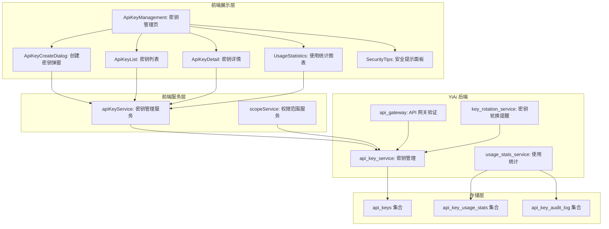
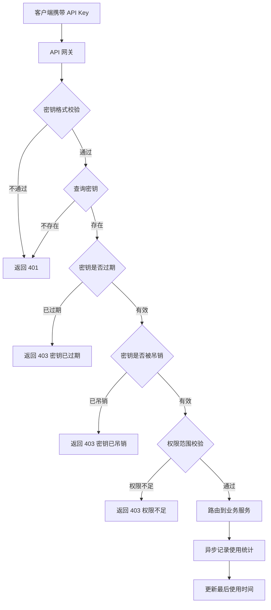

# YV-09-202: 用户API密钥管理 — 创建/查看/吊销密钥、权限范围、最后使用时间、使用统计、安全提示

> 需求编号：YV-09-202 · 优先级：P2 · 人天：0.3d · 状态：需求已编写
> 依赖：YV-09-60（API令牌管理）、YV-09-201（用户安全设置）

## 背景

### 问题陈述

YiVad 目前已实现系统级 API 令牌管理（YV-09-60），但仅面向管理员操作，普通用户无法自主管理个人的 API 密钥。随着平台开放 API 给第三方集成和自动化脚本使用，用户需要创建和管理自己的 API 密钥。当前存在以下问题：

1. **个人密钥不可管理**：用户无法创建、查看、吊销自己的 API 密钥
2. **权限范围不精细**：无细粒度 scope 控制，密钥拥有全部权限
3. **使用情况不可见**：无法查看密钥的最后使用时间和调用统计
4. **安全风险不透明**：密钥暴露风险不提示，泄露后无及时发现机制
5. **密钥生命周期不清晰**：无过期策略，长期不用的密钥依然有效
6. **安全最佳实践缺乏**：用户不了解 API 密钥的安全使用规范

**核心矛盾**：随着平台 API 化推进，用户需要 API 密钥进行自动化集成，但当前缺乏用户级的密钥管理功能，导致所有 API 调用依赖管理员分发的系统级令牌，存在安全和管理隐患。

### 影响范围

| # | 影响 | 严重程度 | 典型场景 |
|---|------|----------|----------|
| 1 | 无法自主管理密钥 | 高 | 用户需要 API 密钥集成 CI/CD，需找管理员 |
| 2 | 权限粒度不足 | 中 | 只读集成却拥有写入权限 |
| 3 | 使用情况不透明 | 中 | 密钥被滥用但用户不知情 |
| 4 | 安全风险 | 高 | 密钥硬编码在代码中泄露到 Git 仓库 |
| 5 | 密钥长期不用 | 中 | 已废弃的集成密钥仍然有效 |
| 6 | 安全认知不足 | 低 | 用户不了解密钥安全管理规范 |

### 挑战

| 挑战 | 说明 |
|------|------|
| 密钥安全存储 | 密钥需哈希存储（类似密码），仅创建时展示一次明文 |
| 权限范围设计 | 需要定义细粒度 scope 模型，与现有 RBAC 系统对接 |
| 使用统计 | 需要在 API 网关层记录每次密钥调用的元数据 |
| 密钥泄露检测 | 需要检测密钥在公开仓库的泄露情况 |
| 向后兼容 | 不影响现有系统级 API 令牌的管理流程 |

---

## 一、现状分析

### 1.1 当前 API 令牌管理现状

```
现有系统 (YV-09-60):
├── 管理员 API 令牌管理
│   ├── 创建系统级令牌
│   ├── 令牌列表查看
│   ├── 吊销令牌
│   └── 令牌权限配置

缺失:
├── 用户个人密钥管理          # ❌ 不存在
├── 密钥权限范围 (scope)      # ❌ 不存在
├── 最后使用时间追踪          # ❌ 不存在
├── 调用统计                  # ❌ 不存在
├── 密钥过期策略              # ❌ 不存在
├── 安全风险提示              # ❌ 不存在
├── 密钥泄露检测              # ❌ 不存在
└── 密钥创建向导              # ❌ 不存在
```

### 1.2 API 密钥管理数据流

```mermaid
graph TD
    A[用户创建 API 密钥] --> B[密钥创建向导]
    B --> C1[命名密钥]
    B --> C2[选择权限范围]
    B --> C3[设置过期时间]
    C1 --> D[后端生成密钥]
    C2 --> D
    C3 --> D
    D --> E[密钥哈希存储]
    D --> F[返回明文密钥(仅一次)]
    F --> G[用户复制保存]
    G --> H[密钥使用]
    H --> I[API 网关验证]
    I --> J[记录使用统计]
    J --> K[更新最后使用时间]
```

### 1.3 根因矩阵

| 症状 | 根因 | 触发条件 | 频率 |
|------|------|----------|------|
| 无法自主管理 | 无用户级密钥管理 | 需要 API 集成时 | 高 |
| 权限过大 | 无 scope 控制 | 创建密钥时 | 中 |
| 使用情况不明 | 无调用统计 | 集成运行一段时间后 | 中 |
| 密钥泄露 | 无泄密检测+安全提示 | 密钥硬编码到代码 | 中 |
| 废弃密钥有效 | 无过期/吊销 | 集成停用后 | 中 |
| 安全管理不当 | 无最佳实践引导 | 用户首次使用 API | 低 |

---

## 二、设计决策

### 决策 1：密钥权限模型 — 全部权限 vs 预定义 Scope vs 自定义组合

| 选项 | 安全性 | 灵活性 | 复杂度 |
|------|--------|--------|--------|
| 全部权限（等同于用户权限） | 低 | 低 | 低 |
| 预定义 Scope（read/write/admin） | 中 | 中 | 中 |
| 自定义组合（模块:操作 自由组合） | 高 | 高 | 高 |

**选择：预定义 Scope 模板 + 可选粒度。** 提供常用 Scope 模板（只读、读写、仅 Issue、仅文档），同时支持高级用户自定义组合具体权限。

### 决策 2：密钥过期策略 — 永不过期 vs 强制过期 vs 可选过期

| 选项 | 安全性 | 用户体验 | 维护成本 |
|------|--------|----------|----------|
| 永不过期 | 低 | 高 | 低 |
| 强制过期（如 90 天） | 高 | 低 | 中 |
| 可选过期（默认推荐 90 天） | 高 | 高 | 中 |

**选择：可选过期，默认推荐 90 天。** 给用户自主权，但默认引导设置合理过期时间。到期前 7 天提醒续期。

### 决策 3：密钥展示格式 — 纯文本 vs 分段展示 vs 仅复制按钮

| 选项 | 安全性 | 易用性 | 风险 |
|------|--------|--------|------|
| 纯文本完整展示 | 低 | 高 | 屏幕截图泄露 |
| 分段展示（默认隐藏部分字符） | 中 | 中 | 可完整复制 |
| 仅复制按钮（不显示明文） | 高 | 低 | 操作不直观 |

**选择：创建时完整展示 + 之后仅显示前缀和末 4 位。** 创建时一次性展示完整密钥（带醒目的安全警告），之后列表仅显示 `sk-****...****abcd` 格式。

### 决策 4：密钥使用统计 — 仅计数 vs 详细日志 vs 采样统计

| 选项 | 信息量 | 存储成本 | 性能影响 |
|------|--------|----------|----------|
| 仅调用计数 | 低 | 低 | 极低 |
| 详细日志（每次调用记录） | 高 | 高 | 中 |
| 采样统计（按小时聚合） | 中 | 中 | 低 |

**选择：按小时聚合统计 + 近 24 小时详细日志。** 聚合数据节省存储，同时保留近 24 小时详细日志用于排查问题。

### 设计决策记录

| 决策 | 选项 A | 选项 B | 选项 C | 选择 | 理由 |
|------|--------|--------|--------|------|------|
| 权限模型 | 全部权限 | 预定义Scope | 自定义组合 | **模板+自定义** | 兼容易用和灵活 |
| 过期策略 | 永不过期 | 强制过期 | 可选过期 | **可选过期** | 默认推荐 90 天 |
| 展示格式 | 纯文本 | 分段 | 仅复制 | **创建完整+后续部分** | 安全且易用 |
| 使用统计 | 计数 | 详细日志 | 采样 | **聚合+24h详细** | 平衡存储和可用性 |

---

## 三、目标架构

### 3.1 API 密钥管理系统架构



### 3.2 API 密钥使用流程



### 3.3 API 密钥管理指标

| 指标 | 改造前 | 改造后 |
|------|--------|--------|
| 用户可管理密钥 | 否 | 创建/查看/吊销个人密钥 |
| 权限粒度 | 全或无 | 预定义模板 + 自定义 scope |
| 使用可见性 | 无 | 调用次数 + 最后使用时间 + 错误率 |
| 过期管理 | 无 | 可选过期 + 7 天前提醒 |
| 安全提示 | 无 | 创建时安全指引 + 泄露风险提醒 |

---

## 四、具体改动

### 4.1 API 密钥服务层

```typescript
// src/services/api-key-service.ts (新增)

interface ApiKeyScope {
  module: string;
  operations: string[]; // ['read', 'write', 'delete']
}

interface ScopeTemplate {
  id: string;
  name: string;
  description: string;
  scopes: ApiKeyScope[];
}

interface ApiKey {
  id: string;
  name: string;
  prefix: string;        // sk-xxxxxxxx
  last_four: string;     // xxxx
  scopes: ApiKeyScope[];
  scope_template_id?: string;
  created_at: string;
  expires_at?: string;
  last_used_at?: string;
  revoked_at?: string;
  status: 'active' | 'expired' | 'revoked';
}

interface ApiKeyCreateResponse {
  id: string;
  name: string;
  key: string;           // 完整密钥,仅此一次
  prefix: string;
  scopes: ApiKeyScope[];
  expires_at?: string;
  created_at: string;
}

interface UsageStat {
  date: string;          // 日期 (YYYY-MM-DD)
  hourly_breakdown: {
    hour: number;
    request_count: number;
    error_count: number;
    avg_latency_ms: number;
  }[];
  total_requests: number;
  total_errors: number;
  error_rate: number;
}

interface KeySecurityTip {
  id: string;
  title: string;
  description: string;
  severity: 'danger' | 'warning' | 'info';
}

class ApiKeyService {
  private baseUrl: string;

  constructor() {
    this.baseUrl = import.meta.env.RS_BUILD_API_BASE || 'http://localhost:10086';
  }

  async getScopeTemplates(): Promise<ScopeTemplate[]> {
    const response = await fetch(`${this.baseUrl}/`, {
      method: 'POST',
      headers: { 'Content-Type': 'application/json' },
      body: JSON.stringify({
        module_name: 'services.auth.api_key_service',
        method_name: 'get_scope_templates',
        parameters: {},
      }),
    });
    const data = await response.json();
    return data.code === 0 ? data.data : [];
  }

  async createApiKey(name: string, scopes: ApiKeyScope[], expiresInDays?: number): Promise<ApiKeyCreateResponse> {
    const response = await fetch(`${this.baseUrl}/`, {
      method: 'POST',
      headers: { 'Content-Type': 'application/json' },
      body: JSON.stringify({
        module_name: 'services.auth.api_key_service',
        method_name: 'create_api_key',
        parameters: { name, scopes, expires_in_days: expiresInDays || 90 },
      }),
    });
    const data = await response.json();
    return data.code === 0 ? data.data : null;
  }

  async getApiKeys(): Promise<ApiKey[]> {
    const response = await fetch(`${this.baseUrl}/`, {
      method: 'POST',
      headers: { 'Content-Type': 'application/json' },
      body: JSON.stringify({
        module_name: 'services.auth.api_key_service',
        method_name: 'get_api_keys',
        parameters: {},
      }),
    });
    const data = await response.json();
    return data.code === 0 ? data.data : [];
  }

  async revokeApiKey(keyId: string): Promise<boolean> {
    const response = await fetch(`${this.baseUrl}/`, {
      method: 'POST',
      headers: { 'Content-Type': 'application/json' },
      body: JSON.stringify({
        module_name: 'services.auth.api_key_service',
        method_name: 'revoke_api_key',
        parameters: { key_id: keyId },
      }),
    });
    const data = await response.json();
    return data.code === 0;
  }

  async getKeyUsage(keyId: string, days: number): Promise<UsageStat[]> {
    const response = await fetch(`${this.baseUrl}/`, {
      method: 'POST',
      headers: { 'Content-Type': 'application/json' },
      body: JSON.stringify({
        module_name: 'services.auth.api_key_service',
        method_name: 'get_key_usage',
        parameters: { key_id: keyId, days },
      }),
    });
    const data = await response.json();
    return data.code === 0 ? data.data : [];
  }

  async getSecurityTips(): Promise<KeySecurityTip[]> {
    const response = await fetch(`${this.baseUrl}/`, {
      method: 'POST',
      headers: { 'Content-Type': 'application/json' },
      body: JSON.stringify({
        module_name: 'services.auth.api_key_service',
        method_name: 'get_security_tips',
        parameters: {},
      }),
    });
    const data = await response.json();
    return data.code === 0 ? data.data : [];
  }
}

export const apiKeyService = new ApiKeyService();
export type { ApiKeyScope, ScopeTemplate, ApiKey, ApiKeyCreateResponse, UsageStat, KeySecurityTip };
```

### 4.2 API 密钥管理页面

```vue
<!-- src/views/settings/ApiKeyManagement.vue (新增) -->

<script setup lang="ts">
import { ref, onMounted } from 'vue';
import { ElMessage, ElMessageBox } from 'element-plus';
import { apiKeyService } from '@/services/api-key-service';
import type { ApiKey, ApiKeyCreateResponse, ScopeTemplate, KeySecurityTip } from '@/services/api-key-service';
import * as echarts from 'echarts';
import ApiKeyCreateDialog from './components/ApiKeyCreateDialog.vue';
import ApiKeyDetailDialog from './components/ApiKeyDetailDialog.vue';
import SecurityTipsPanel from './components/SecurityTipsPanel.vue';

const keys = ref<ApiKey[]>([]);
const scopeTemplates = ref<ScopeTemplate[]>([]);
const securityTips = ref<KeySecurityTip[]>([]);
const loading = ref(true);
const createDialogVisible = ref(false);
const detailKey = ref<ApiKey | null>(null);
const newKeyResult = ref<ApiKeyCreateResponse | null>(null);

async function loadData() {
  loading.value = true;
  try {
    const [k, t, s] = await Promise.all([
      apiKeyService.getApiKeys(),
      apiKeyService.getScopeTemplates(),
      apiKeyService.getSecurityTips(),
    ]);
    keys.value = k;
    scopeTemplates.value = t;
    securityTips.value = s;
  } finally {
    loading.value = false;
  }
}

async function handleCreateKey(payload: { name: string; scopes: ScopeTemplate; expiresInDays: number }) {
  const result = await apiKeyService.createApiKey(payload.name, payload.scopes.scopes, payload.expiresInDays);
  if (result) {
    newKeyResult.value = result;
    await loadData();
  }
}

function handleCopyKey() {
  if (!newKeyResult.value) return;
  navigator.clipboard.writeText(newKeyResult.value.key).then(() => {
    ElMessage.success('密钥已复制到剪贴板，请妥善保存');
  });
}

function handleDismissNewKey() {
  newKeyResult.value = null;
  createDialogVisible.value = false;
}

async function handleRevokeKey(key: ApiKey) {
  const confirmMsg = `确定要吊销密钥 "${key.name}" (${key.prefix}...${key.last_four}) 吗？此操作不可撤销。`;
  await ElMessageBox.confirm(confirmMsg, '吊销密钥', { type: 'warning', confirmButtonText: '确认吊销' });
  const success = await apiKeyService.revokeApiKey(key.id);
  if (success) {
    ElMessage.success('密钥已吊销');
    await loadData();
  }
}

function handleShowDetail(key: ApiKey) {
  detailKey.value = key;
}

onMounted(loadData);
</script>

<template>
  <div class="api-key-management" v-loading="loading">
    <div class="akm-header">
      <div>
        <h2>API 密钥管理</h2>
        <p class="akm-description">管理您的个人 API 密钥，用于自动化脚本和第三方集成</p>
      </div>
      <el-button type="primary" @click="createDialogVisible = true">
        + 创建密钥
      </el-button>
    </div>

    <!-- 安全提示 -->
    <SecurityTipsPanel :tips="securityTips" />

    <!-- 新创建的密钥展示 -->
    <el-alert
      v-if="newKeyResult"
      type="warning"
      :closable="true"
      @close="handleDismissNewKey"
      title="密钥创建成功！请立即保存以下密钥，关闭后将无法再次查看完整密钥"
    >
      <div class="new-key-display">
        <code class="new-key-value">{{ newKeyResult.key }}</code>
        <el-button type="primary" size="small" @click="handleCopyKey">复制密钥</el-button>
      </div>
      <div class="new-key-meta">
        <span>名称: {{ newKeyResult.name }}</span>
        <span v-if="newKeyResult.expires_at">过期时间: {{ newKeyResult.expires_at }}</span>
      </div>
    </el-alert>

    <!-- 密钥列表 -->
    <el-table :data="keys" style="margin-top: 16px" empty-text="暂无 API 密钥">
      <el-table-column prop="name" label="名称" min-width="150" />
      <el-table-column label="密钥" min-width="200">
        <template #default="{ row }">
          <code>{{ row.prefix }}...{{ row.last_four }}</code>
        </template>
      </el-table-column>
      <el-table-column label="权限范围" min-width="180">
        <template #default="{ row }">
          <el-tag
            v-for="scope in row.scopes"
            :key="scope.module"
            size="small"
            style="margin-right: 4px"
          >
            {{ scope.module }}: {{ scope.operations.join(', ') }}
          </el-tag>
        </template>
      </el-table-column>
      <el-table-column label="状态" width="100">
        <template #default="{ row }">
          <el-tag :type="row.status === 'active' ? 'success' : row.status === 'expired' ? 'warning' : 'info'">
            {{ { active: '活跃', expired: '已过期', revoked: '已吊销' }[row.status] }}
          </el-tag>
        </template>
      </el-table-column>
      <el-table-column prop="last_used_at" label="最后使用" width="160">
        <template #default="{ row }">
          {{ row.last_used_at || '从未使用' }}
        </template>
      </el-table-column>
      <el-table-column label="操作" width="200" fixed="right">
        <template #default="{ row }">
          <el-button size="small" @click="handleShowDetail(row)">详情</el-button>
          <el-button
            v-if="row.status === 'active'"
            size="small"
            type="danger"
            @click="handleRevokeKey(row)"
          >
            吊销
          </el-button>
        </template>
      </el-table-column>
    </el-table>

    <!-- 创建密钥弹窗 -->
    <ApiKeyCreateDialog
      v-model:visible="createDialogVisible"
      :templates="scopeTemplates"
      @create="handleCreateKey"
    />

    <!-- 密钥详情弹窗 -->
    <ApiKeyDetailDialog
      v-if="detailKey"
      v-model:visible="!!detailKey"
      :api-key="detailKey"
      @close="detailKey = null"
    />
  </div>
</template>
```

### 4.3 文件变更清单

| 文件 | 操作 | 说明 |
|------|------|------|
| `src/services/api-key-service.ts` | 新增 | API 密钥管理服务层 |
| `src/views/settings/ApiKeyManagement.vue` | 新增 | 密钥管理主页面 |
| `src/views/settings/components/ApiKeyCreateDialog.vue` | 新增 | 创建密钥弹窗 |
| `src/views/settings/components/ApiKeyDetailDialog.vue` | 新增 | 密钥详情 + 使用统计弹窗 |
| `src/views/settings/components/SecurityTipsPanel.vue` | 新增 | 安全提示面板 |
| `src/views/settings/components/ScopeSelector.vue` | 新增 | 权限范围选择器 |
| `src/router/routes.ts` | 修改 | 添加 API 密钥管理路由 |

---

## 五、实施步骤

| 步骤 | 操作 | 路径 | 验证 | 人天 |
|------|------|------|------|------|
| 1 | 实现 API 密钥服务层 | `api-key-service.ts` | 密钥 CRUD + 统计 API | 0.04 |
| 2 | 实现密钥管理主页面 | `ApiKeyManagement.vue` | 密钥列表 + 创建按钮 | 0.04 |
| 3 | 实现创建密钥弹窗 | `ApiKeyCreateDialog.vue` | 命名 + 选 scope + 设过期 | 0.04 |
| 4 | 实现权限范围选择器 | `ScopeSelector.vue` | 模板选择 + 模块/操作勾选 | 0.04 |
| 5 | 实现创建成功展示 | `ApiKeyManagement.vue` | 一次性展示完整密钥 + 复制 | 0.03 |
| 6 | 实现密钥详情弹窗 | `ApiKeyDetailDialog.vue` | 使用统计图表 + 元信息 | 0.04 |
| 7 | 实现安全提示面板 | `SecurityTipsPanel.vue` | 安全建议列表 | 0.03 |
| 8 | 实现吊销确认 | `ApiKeyManagement.vue` | 二次确认 + 不可撤销提示 | 0.04 |

**总人天：0.3d**

---

## 六、测试规格

### 场景 1：创建 API 密钥

**GIVEN** 用户在 API 密钥管理页面
**WHEN** 点击"创建密钥"，输入名称"My CI Key"，选择"只读"权限模板，过期时间 90 天，点击创建
**THEN** 显示密钥创建成功，完整密钥以 `sk-` 开头展示
**AND** 密钥列表新增一条记录，状态为"活跃"

### 场景 2：复制和保存密钥

**GIVEN** 刚创建了一个密钥，完整密钥显示在 Warning Alert 中
**WHEN** 用户点击"复制密钥"按钮
**THEN** 密钥复制到剪贴板，显示成功提示
**AND** 用户关闭 Alert 后，列表中仅显示密钥前缀和末 4 位，不再显示完整密钥

### 场景 3：查看密钥详情和使用统计

**GIVEN** 密钥已创建 30 天，有使用记录
**WHEN** 用户在密钥列表中点击"详情"
**THEN** 弹窗显示密钥元信息（名称、状态、创建时间、过期时间）
**AND** 显示近 30 天调用次数折线图
**AND** 显示总调用次数、错误率、平均延迟

### 场景 4：吊销密钥

**GIVEN** 密钥状态为"活跃"
**WHEN** 用户点击"吊销"，在确认对话框中确认
**THEN** 密钥状态变为"已吊销"，使用该密钥的后续请求返回 403
**AND** 列表状态显示为"已吊销"

### 场景 5：密钥过期提醒

**GIVEN** 密钥过期时间距今还有 7 天
**WHEN** 用户进入密钥管理页面
**THEN** 该密钥行显示黄色"即将过期"标记
**AND** 安全提示面板显示"您有 1 个密钥即将过期，请及时更新"

### 场景 6：权限范围选择

**GIVEN** 用户在创建密钥弹窗中
**WHEN** 先选择"只读"模板（范围 = 所有模块:read），然后切换到"自定义"
**THEN** 显示所有模块和操作的复选框
**AND** 已勾选的复选框继承自"只读"模板（所有模块 read 已勾选）
**AND** 用户可自行调整勾选，增加或减少权限

---

## 七、风险与缓解

| 风险 | 概率 | 影响 | 缓解措施 |
|------|------|------|----------|
| 密钥泄露 | 中 | 高 | 密钥哈希存储，创建时一次性展示；泄露检测 API 集成 |
| 权限范围配置错误 | 低 | 中 | 使用预定义模板降低错误概率；自定义权限时显示权限说明 |
| 使用统计查询超时 | 低 | 低 | 聚合数据缓存 5 分钟；近 24h 详细日志限制返回 1000 条 |
| 密钥数量过多 | 低 | 低 | 限制每个用户最多 20 个活跃密钥 |
| 旧密钥兼容 | 低 | 中 | 新密钥使用 `sk-` 前缀区分，旧系统级令牌保持不变 |

---

## 八、回滚策略

| 场景 | 回滚操作 | 影响 |
|------|----------|------|
| 密钥管理页异常 | 隐藏密钥管理入口 | 用户无法管理个人密钥 |
| 创建密钥功能异常 | 禁用创建按钮 | 无法创建新密钥 |
| 权限验证异常 | 降级为使用用户全权限 | 密钥权限范围失效 |
| 使用统计异常 | 隐藏统计图表，仅显示基本元信息 | 使用情况不可见 |

---

## 九、设计决策记录

### D-01：密钥权限模型

- **问题**：API 密钥的权限范围如何设计
- **选项**：全部权限、预定义 Scope、自定义组合
- **选择**：预定义模板 + 自定义组合
- **理由**：模板降低使用门槛，自定义满足高级需求

### D-02：密钥过期策略

- **问题**：API 密钥是否需要过期
- **选项**：永不过期、强制过期、可选过期
- **选择**：可选过期，默认推荐 90 天
- **理由**：安全性 > 便利性，但给用户自主权

### D-03：密钥展示格式

- **问题**：密钥如何展示给用户
- **选项**：纯文本、分段隐藏、仅复制
- **选择**：创建时完整展示 + 之后仅前缀和末 4 位
- **理由**：安全（防截图泄露）且易用（创建时可复制）

### D-04：使用统计粒度

- **问题**：密钥使用统计的粒度如何设计
- **选项**：仅计数、详细日志、采样统计
- **选择**：按小时聚合 + 近 24h 详细日志
- **理由**：聚合节省存储，详细日志用于排障

---

## 十、可观测性

### 指标

| 指标 | 类型 | 说明 |
|------|------|------|
| `yivad.apikey.total_active_keys` | Gauge | 活跃密钥总数 |
| `yivad.apikey.create_count` | Counter | 密钥创建次数 |
| `yivad.apikey.revoke_count` | Counter | 密钥吊销次数 |
| `yivad.apikey.auth_success_rate` | Gauge | 密钥认证成功率 |
| `yivad.apikey.expiring_soon_count` | Gauge | 即将过期密钥数 |

### 告警

| 告警 | 条件 | 级别 |
|------|------|------|
| 密钥认证失败率升高 | 失败率 > 10% | WARNING |
| 单个密钥调用激增 | 5 分钟内调用 > 1000 次 | WARNING |
| 密钥泄露检测命中 | 在公开仓库检测到密钥 | CRITICAL |
| 大量密钥即将过期 | 即将过期密钥 > 50 | INFO |

---

## 十一、代码审查检查清单

- [ ] 密钥使用哈希存储，创建时仅展示一次明文
- [ ] 密钥前缀格式统一为 `sk-` + 随机字符
- [ ] 权限范围选择器支持模板和自定义两种模式
- [ ] 密钥过期前 7 天有提醒通知
- [ ] 吊销密钥需二次确认
- [ ] 吊销操作记录到审计日志
- [ ] 使用统计图表使用 ECharts 渲染
- [ ] 安全提示面板在页面顶部显眼位置
- [ ] 密钥列表支持分页（超过 10 个密钥时）
- [ ] 复制密钥按钮使用 Clipboard API
- [ ] 创建密钥弹窗有关闭前确认（防止误关闭丢失密钥）
- [ ] 空状态设计（无密钥时引导创建）

---

## 回归问题预测

| # | 预测问题 | 原因 | 验证方法 |
|---|---------|------|---------|
| 1 | 用户创建密钥后误关闭弹窗，未保存密钥明文，导致无法找回 | 密钥仅在创建时展示一次，无二次查看机制 | 关闭弹窗时检测是否有未保存的新密钥，弹窗提醒"关闭后将无法再次查看密钥" |
| 2 | API 网关中密钥验证增加查询成本，高并发下 MongoDB 查询成为瓶颈 | 每次 API 请求都需查询 api_keys 集合验证密钥 | 对活跃密钥信息添加 Redis 缓存（TTL 5 分钟），减少 MongoDB 查询 |
| 3 | 密钥权限范围与用户 RBAC 权限冲突，密钥权限大于用户权限 | scope 校验未与用户实际权限做交集 | 密钥权限校验时取密钥 scope 与用户 RBAC 权限的交集，以较小的为准 |
| 4 | 使用统计的按小时聚合任务近实时但非实时，用户查看时可能有 1 小时延迟 | 聚合任务每小时执行一次 | 近 24 小时使用详细日志模式提供实时数据，聚合数据仅用于历史图表 |
| 5 | 密钥名字使用中文时，后端存储和查询存在编码问题 | MongoDB 文档 key 使用中文可能存在排序问题 | 密钥名称使用 UTF-8 编码存储，确保前后端编码一致 |
| 6 | 用户在不同设备创建密钥后，本地时间与服务器时间不一致导致过期时间混淆 | 前端使用本地时间，后端使用 UTC | 前端展示时统一转换为用户时区，过期判断以后端 UTC 时间为准 |

---

## 性能分析

### 各操作耗时

| 阶段 | 预估耗时 | 说明 |
|------|----------|------|
| 密钥列表加载 | < 200ms | 单用户查询，数据量小 |
| 创建密钥 | < 300ms | 密钥生成 + 哈希 + 存储 |
| 使用统计查询 | < 500ms | 聚合数据 + 近 24h 详细日志 |
| 密钥验证 | < 50ms | Redis 缓存命中 |

### 内存影响

| 项目 | 体积 | 说明 |
|------|------|------|
| api-key-service.ts | ~4KB | API 密钥服务 |
| ApiKeyManagement.vue | ~8KB | 密钥管理主页面 |
| 各子组件 | ~12KB | 4 个子组件 |
| 运行时数据 | < 100KB | 密钥列表 + 统计图表数据 |

### 对应用性能的影响

| 阶段 | 影响 | 说明 |
|------|------|------|
| 页面加载 | < 500ms | 3 个 API 并行请求 |
| 创建密钥 | < 300ms | 单次 API 调用 |
| 统计查询 | < 500ms | 缓存优化 |
| API 验证 | < 50ms | Redis 缓存，不影响前端 |

