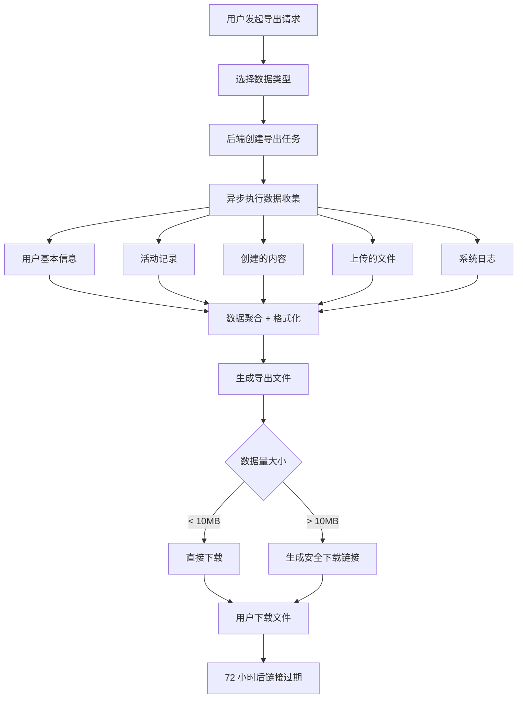
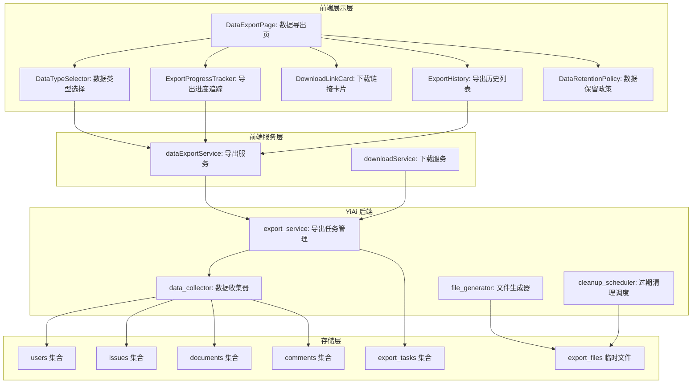
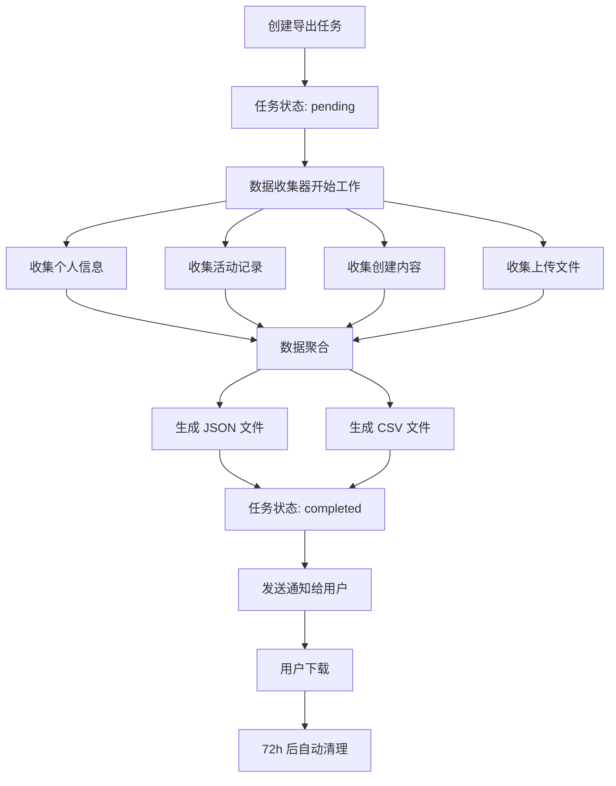

# YV-09-203: 用户数据导出 — 数据类型选择、GDPR合规导出、导出进度、带过期时间的下载链接、导出历史

> 需求编号：YV-09-203 · 优先级：P2 · 人天：0.3d · 状态：需求已编写
> 依赖：YV-09-59（数据导入导出中心）、YV-09-204（用户账号删除）

## 背景

### 问题陈述

YiVad 当前不支持用户自主导出个人数据。随着数据隐私法规（如 GDPR、个人信息保护法）的合规要求日益增强，以及用户对自己数据所有权意识的提升，提供个人数据导出功能已成为必要。当前存在以下问题：

1. **数据不可导出**：用户无法获取自己在平台上的数据副本
2. **法规合规风险**：不符合 GDPR 第 20 条（数据可携权）和《个人信息保护法》第 45 条要求
3. **数据类型不透明**：用户不清楚平台存储了哪些个人数据
4. **导出无进度反馈**：大数据量导出时用户不知道进度
5. **下载链接不安全**：无过期机制，导出文件可能被未授权访问
6. **无导出历史**：无法追踪和管理以往的导出请求

**核心矛盾**：法律规定用户有权获取个人数据副本，但当前系统完全不支持数据导出，存在合规风险和用户信任问题。

### 影响范围

| # | 影响 | 严重程度 | 典型场景 |
|---|------|----------|----------|
| 1 | 无法导出数据 | 高 | 用户离职前需要带走个人数据 |
| 2 | GDPR 合规风险 | 高 | 欧盟用户请求数据导出，无法响应 |
| 3 | 数据类型不透明 | 中 | 用户不知道平台收集了哪些数据 |
| 4 | 导出体验差 | 中 | 大文件导出无进度反馈，用户焦虑等待 |
| 5 | 安全隐患 | 中 | 导出文件无过期时间，可被长期访问 |
| 6 | 无法追溯 | 低 | 无法确认某次导出是否已完成 |

### 挑战

| 挑战 | 说明 |
|------|------|
| 数据范围确定 | 需要定义"个人数据"的边界，区分用户数据和企业数据 |
| 大数据量导出 | 数据量可能很大（活动日志、文件等），需要异步处理 |
| 格式标准化 | 导出格式需要可读且通用（JSON/CSV） |
| 安全下载 | 导出文件需要安全的临时下载链接 |
| 法规合规 | 需满足 GDPR 可携权和《个人信息保护法》可复制权要求 |

---

## 一、现状分析

### 1.1 当前数据导出系统现状

```
现有系统 (YV-09-59):
├── 数据导入导出中心
│   ├── 表格数据导出（Excel/CSV）
│   ├── 项目数据导入
│   └── 批量操作支持

缺失:
├── 用户个人数据导出          # ❌ 不存在
├── 数据类型选择              # ❌ 不存在
├── GDPR 合规说明             # ❌ 不存在
├── 异步导出 + 进度追踪       # ❌ 不存在
├── 安全下载链接              # ❌ 不存在
├── 导出历史管理              # ❌ 不存在
├── 数据保留政策展示          # ❌ 不存在
└── 导出请求确认邮件          # ❌ 不存在
```

### 1.2 数据导出数据流



### 1.3 根因矩阵

| 症状 | 根因 | 触发条件 | 频率 |
|------|------|----------|------|
| 无法导出数据 | 无数据导出功能 | 用户请求数据时 | 中 |
| GDPR 不合规 | 无数据可携权响应机制 | 监管审计时 | 高 |
| 数据类型不明 | 无数据清单展示 | 用户不知道平台存储了什么 | 中 |
| 导出焦虑 | 无进度追踪 | 大数据量导出时 | 中 |
| 下载不安全 | 无链接过期机制 | 导出链接泄露 | 低 |
| 无法追溯 | 无导出历史 | 需要确认历史导出时 | 低 |

---

## 二、设计决策

### 决策 1：导出触发方式 — 同步下载 vs 异步任务 vs 两者结合

| 选项 | 用户体验 | 支持大数据 | 复杂度 |
|------|----------|------------|--------|
| 同步下载（等待完成后下载） | 差（长时间等待） | 否 | 低 |
| 异步任务（后台执行，完成后通知） | 好 | 是 | 中 |
| 两者结合（小数据同步，大数据异步） | 最好 | 是 | 高 |

**选择：两者结合。** 数据量 < 10MB 时同步返回（即时体验），> 10MB 时异步处理（避免超时）。减少复杂度同时保证体验。

### 决策 2：导出文件格式 — 仅 JSON vs 仅 CSV vs 多格式可选

| 选项 | 机器可读性 | 人类可读性 | 结构化 |
|------|------------|------------|--------|
| 仅 JSON | 高 | 中 | 高 |
| 仅 CSV | 中 | 高 | 低 |
| 多格式可选（JSON + CSV + PDF） | 最高 | 最高 | 中 |

**选择：JSON + CSV 可选。** JSON 满足机器可读性和结构化数据需求，CSV 满足人类在 Excel 中查看的需求。PDF 导出复杂度高且需求有限。

### 决策 3：下载链接安全 — 无保护 vs Token 鉴权 vs 一次性链接

| 选项 | 安全性 | 易用性 | 实现复杂度 |
|------|--------|--------|------------|
| 无保护（任何人可下载） | 低 | 高 | 低 |
| Token 鉴权（需登录验证） | 高 | 低 | 中 |
| 一次性链接（随机 URL + 过期） | 中 | 高 | 中 |

**选择：Token 鉴权 + 过期时间。** 下载链接需用户 Token 验证，防止未授权访问。链接 72 小时后自动失效。不采用一次性链接因为下载可能中断需要重试。

### 决策 4：导出文件存储 — 临时文件 vs 永久存储 vs 按需生成

| 选项 | 存储成本 | 下载速度 | 合规性 |
|------|----------|----------|--------|
| 临时文件（72h 后删除） | 低 | 快 | 高 |
| 永久存储（用户可随时下载） | 高 | 快 | 低（数据冗余） |
| 按需生成（每次下载重新生成） | 无 | 慢 | 高 |

**选择：临时文件 72h 后自动删除。** 平衡存储成本和下载速度，过期自动清理满足数据最小化原则。

### 设计决策记录

| 决策 | 选项 A | 选项 B | 选项 C | 选择 | 理由 |
|------|--------|--------|--------|------|------|
| 导出方式 | 同步 | 异步 | 两者结合 | **两者结合** | 小数据即时，大数据异步 |
| 文件格式 | JSON | CSV | 多格式 | **JSON+CSV** | 兼顾机器和人类可读 |
| 下载安全 | 无保护 | Token鉴权 | 一次性链接 | **Token+过期** | 安全检查 + 重试友好 |
| 文件存储 | 临时 | 永久 | 按需 | **临时72h** | 存储成本低，合规 |

---

## 三、目标架构

### 3.1 数据导出系统架构



### 3.2 数据导出异步任务流程



### 3.3 数据导出指标

| 指标 | 改造前 | 改造后 |
|------|--------|--------|
| 个人数据导出 | 不支持 | 选择类型后异步导出 |
| GDPR 合规 | 不满足 | 满足可携权要求 |
| 导出进度 | 无 | 实时进度追踪 |
| 下载安全 | 无 | Token 鉴权 + 72h 过期 |
| 导出历史 | 无 | 完整导出记录 |
| 数据透明度 | 无 | 数据清单 + 保留政策 |

---

## 四、具体改动

### 4.1 数据导出服务层

```typescript
// src/services/data-export-service.ts (新增)

interface ExportableDataType {
  id: string;
  name: string;
  description: string;
  estimated_size: string;
  selected: boolean;
  required: boolean; // GDPR 必需项不可取消
}

interface ExportTask {
  id: string;
  status: 'pending' | 'processing' | 'completed' | 'failed' | 'expired';
  data_types: string[];
  format: 'json' | 'csv' | 'both';
  created_at: string;
  completed_at?: string;
  file_size?: number;
  download_url?: string;
  expires_at?: string;
  progress: number;    // 0-100
  error_message?: string;
}

interface ExportRequest {
  data_types: string[];
  format: 'json' | 'csv' | 'both';
}

class DataExportService {
  private baseUrl: string;

  constructor() {
    this.baseUrl = import.meta.env.RS_BUILD_API_BASE || 'http://localhost:10086';
  }

  async getExportableDataTypes(): Promise<ExportableDataType[]> {
    const response = await fetch(`${this.baseUrl}/`, {
      method: 'POST',
      headers: { 'Content-Type': 'application/json' },
      body: JSON.stringify({
        module_name: 'services.user.data_export_service',
        method_name: 'get_exportable_data_types',
        parameters: {},
      }),
    });
    const data = await response.json();
    return data.code === 0 ? data.data : [];
  }

  async requestExport(request: ExportRequest): Promise<ExportTask> {
    const response = await fetch(`${this.baseUrl}/`, {
      method: 'POST',
      headers: { 'Content-Type': 'application/json' },
      body: JSON.stringify({
        module_name: 'services.user.data_export_service',
        method_name: 'request_export',
        parameters: request,
      }),
    });
    const data = await response.json();
    return data.code === 0 ? data.data : null;
  }

  async getExportStatus(taskId: string): Promise<ExportTask> {
    const response = await fetch(`${this.baseUrl}/`, {
      method: 'POST',
      headers: { 'Content-Type': 'application/json' },
      body: JSON.stringify({
        module_name: 'services.user.data_export_service',
        method_name: 'get_export_status',
        parameters: { task_id: taskId },
      }),
    });
    const data = await response.json();
    return data.code === 0 ? data.data : null;
  }

  async getExportHistory(): Promise<ExportTask[]> {
    const response = await fetch(`${this.baseUrl}/`, {
      method: 'POST',
      headers: { 'Content-Type': 'application/json' },
      body: JSON.stringify({
        module_name: 'services.user.data_export_service',
        method_name: 'get_export_history',
        parameters: {},
      }),
    });
    const data = await response.json();
    return data.code === 0 ? data.data : [];
  }

  getDownloadUrl(taskId: string): string {
    const token = localStorage.getItem('token') || '';
    return `${this.baseUrl}/export/download/${taskId}?token=${encodeURIComponent(token)}`;
  }
}

export const dataExportService = new DataExportService();
export type { ExportableDataType, ExportTask, ExportRequest };
```

### 4.2 数据导出页面

```vue
<!-- src/views/settings/DataExportPage.vue (新增) -->

<script setup lang="ts">
import { ref, onMounted, onUnmounted } from 'vue';
import { ElMessage } from 'element-plus';
import { dataExportService } from '@/services/data-export-service';
import type { ExportableDataType, ExportTask } from '@/services/data-export-service';
import DataTypeSelector from './components/DataTypeSelector.vue';
import ExportProgressTracker from './components/ExportProgressTracker.vue';
import DownloadLinkCard from './components/DownloadLinkCard.vue';
import ExportHistory from './components/ExportHistory.vue';
import DataRetentionPolicy from './components/DataRetentionPolicy.vue';

const dataTypes = ref<ExportableDataType[]>([]);
const exportHistory = ref<ExportTask[]>([]);
const currentTask = ref<ExportTask | null>(null);
const pollingTimer = ref<ReturnType<typeof setInterval> | null>(null);

async function loadData() {
  const [types, history] = await Promise.all([
    dataExportService.getExportableDataTypes(),
    dataExportService.getExportHistory(),
  ]);
  dataTypes.value = types;
  exportHistory.value = history;
}

async function handleRequestExport(format: 'json' | 'csv' | 'both') {
  const selectedTypes = dataTypes.value.filter(t => t.selected).map(t => t.id);
  if (selectedTypes.length === 0) {
    ElMessage.warning('请至少选择一种数据类型');
    return;
  }

  const task = await dataExportService.requestExport({
    data_types: selectedTypes,
    format,
  });

  if (task) {
    currentTask.value = task;
    startPolling(task.id);
    ElMessage.success('导出任务已创建，正在准备您的数据...');
  }
}

function startPolling(taskId: string) {
  stopPolling();
  pollingTimer.value = setInterval(async () => {
    const status = await dataExportService.getExportStatus(taskId);
    if (!status) return;
    currentTask.value = status;

    if (status.status === 'completed' || status.status === 'failed') {
      stopPolling();
      if (status.status === 'completed') {
        ElMessage.success('数据导出完成');
        exportHistory.value = await dataExportService.getExportHistory();
      } else {
        ElMessage.error(`导出失败: ${status.error_message || '未知错误'}`);
      }
    }
  }, 2000);
}

function stopPolling() {
  if (pollingTimer.value) {
    clearInterval(pollingTimer.value);
    pollingTimer.value = null;
  }
}

function handleDownload(task: ExportTask) {
  if (task.download_url) {
    window.open(dataExportService.getDownloadUrl(task.id), '_blank');
  }
}

onMounted(loadData);
onUnmounted(stopPolling);
</script>

<template>
  <div class="data-export-page">
    <div class="dep-header">
      <h2>数据导出</h2>
      <p class="dep-description">
        根据 GDPR（通用数据保护条例）和《个人信息保护法》，您有权获取个人数据的电子副本。
        请选择需要导出的数据类型，我们将为您准备下载文件。
      </p>
    </div>

    <!-- GDPR 合规说明 -->
    <DataRetentionPolicy />

    <!-- 导出进度追踪 -->
    <ExportProgressTracker v-if="currentTask && currentTask.status === 'processing'" :task="currentTask" />

    <!-- 下载链接卡片 -->
    <DownloadLinkCard
      v-if="currentTask && currentTask.status === 'completed'"
      :task="currentTask"
      @download="handleDownload"
    />

    <!-- 数据类型选择 -->
    <el-card class="dep-section">
      <template #header><span>选择导出数据类型</span></template>
      <DataTypeSelector :data-types="dataTypes" />
      <div class="dep-actions">
        <el-button type="primary" @click="handleRequestExport('json')">
          导出 JSON 格式
        </el-button>
        <el-button type="primary" @click="handleRequestExport('csv')">
          导出 CSV 格式
        </el-button>
        <el-button type="primary" @click="handleRequestExport('both')">
          导出 JSON + CSV
        </el-button>
      </div>
    </el-card>

    <!-- 导出历史 -->
    <ExportHistory :history="exportHistory" @download="handleDownload" />
  </div>
</template>
```

### 4.3 文件变更清单

| 文件 | 操作 | 说明 |
|------|------|------|
| `src/services/data-export-service.ts` | 新增 | 数据导出服务层 |
| `src/views/settings/DataExportPage.vue` | 新增 | 数据导出主页面 |
| `src/views/settings/components/DataTypeSelector.vue` | 新增 | 数据类型多选组件 |
| `src/views/settings/components/ExportProgressTracker.vue` | 新增 | 导出进度追踪组件 |
| `src/views/settings/components/DownloadLinkCard.vue` | 新增 | 下载链接卡片组件 |
| `src/views/settings/components/ExportHistory.vue` | 新增 | 导出历史列表组件 |
| `src/views/settings/components/DataRetentionPolicy.vue` | 新增 | 数据保留政策展示 |
| `src/router/routes.ts` | 修改 | 添加数据导出路由 |

---

## 五、实施步骤

| 步骤 | 操作 | 路径 | 验证 | 人天 |
|------|------|------|------|------|
| 1 | 实现数据导出服务层 | `data-export-service.ts` | 导出请求 + 状态查询 + 历史 API | 0.04 |
| 2 | 实现数据导出主页面 | `DataExportPage.vue` | GDPR 说明 + 类型选择 + 历史列表 | 0.04 |
| 3 | 实现数据类型选择器 | `DataTypeSelector.vue` | 多选复选框 + 必需项锁定 | 0.03 |
| 4 | 实现导出进度追踪 | `ExportProgressTracker.vue` | 轮询状态 + 进度条 + 步骤展示 | 0.04 |
| 5 | 实现下载链接卡片 | `DownloadLinkCard.vue` | Token 鉴权 URL + 过期倒计时 | 0.04 |
| 6 | 实现导出历史列表 | `ExportHistory.vue` | 历史记录 + 状态标签 + 重新下载 | 0.04 |
| 7 | 实现数据保留政策 | `DataRetentionPolicy.vue` | 各数据类型保留期限说明 | 0.04 |
| 8 | 实现异步任务轮询 | `DataExportPage.vue` | 2 秒轮询 + 完成/失败处理 | 0.03 |

**总人天：0.3d**

---

## 六、测试规格

### 场景 1：请求导出个人数据

**GIVEN** 用户在数据导出页面
**WHEN** 勾选"个人资料"和"活动记录"两种数据类型，选择 JSON 格式，点击"导出 JSON 格式"
**THEN** 后端创建导出任务，前端显示任务状态为 pending/processing
**AND** 进度条从 0 开始逐步增长

### 场景 2：导出进度追踪

**GIVEN** 导出任务正在处理中，后端返回进度 65%
**WHEN** 前端轮询获取状态（每 2 秒）
**THEN** 进度条显示 65%
**AND** 当前步骤显示"正在收集活动记录..."
**AND** 已完成步骤显示绿色勾号

### 场景 3：导出完成下载

**GIVEN** 导出任务已完成，生成 5MB 的 JSON 文件
**WHEN** 下载链接卡片显示，用户点击"下载文件"
**THEN** 浏览器开始下载导出的 JSON 文件
**AND** 文件名格式为 `data-export-{日期}-{用户}.json`

### 场景 4：下载链接过期

**GIVEN** 导出文件在 72 小时前生成
**WHEN** 用户尝试通过历史记录中的下载链接下载
**THEN** 后端返回文件已过期，前端显示"下载链接已过期，请重新发起导出"

### 场景 5：查看导出历史

**GIVEN** 用户过去完成过 3 次数据导出
**WHEN** 用户滚动到"导出历史"区域
**THEN** 显示 3 条导出记录，每条包含导出时间、数据类型、格式、文件大小、状态
**AND** 未过期的记录显示下载按钮

### 场景 6：GDPR 合规说明

**GIVEN** 用户首次进入数据导出页面
**WHEN** 页面加载完成
**THEN** 顶部显示 GDPR 合规说明，包含法律依据（GDPR 第 20 条、《个保法》第 45 条）
**AND** 数据保留政策表格展示各数据类型的保留期限
**AND** 注明导出后数据不会从系统中删除

---

## 七、风险与缓解

| 风险 | 概率 | 影响 | 缓解措施 |
|------|------|------|----------|
| 大数据量导出超时 | 中 | 中 | 10MB 以下同步返回，以上异步处理 |
| 导出文件包含敏感数据 | 低 | 高 | 导出前按用户权限过滤数据，不导出他人数据 |
| 下载链接被未授权访问 | 中 | 高 | Token 鉴权 + 72h 过期 + 仅限导出用户本人下载 |
| 导出任务长时间不清理 | 低 | 低 | 定时任务每日清理 72h 前的导出文件 |
| 并发导出请求压垮服务器 | 低 | 中 | 限制每用户同时只能有 1 个活跃导出任务 |

---

## 八、回滚策略

| 场景 | 回滚操作 | 影响 |
|------|----------|------|
| 导出页面异常 | 隐藏数据导出入口 | 用户无法导出数据 |
| 异步任务队列异常 | 降级为仅同步导出（限制 10MB） | 大数据量导出不可用 |
| 下载服务异常 | 暂时关闭下载功能 | 已生成的导出文件无法下载 |
| 过期清理误删 | 暂停清理任务 | 临时文件积累 |

---

## 九、设计决策记录

### D-01：导出触发方式

- **问题**：数据导出采用同步还是异步方式
- **选项**：同步、异步、两者结合
- **选择**：两者结合（< 10MB 同步，>= 10MB 异步）
- **理由**：小数据即时体验，大数据避免超时

### D-02：导出文件格式

- **问题**：导出文件支持什么格式
- **选项**：JSON、CSV、多格式
- **选择**：JSON + CSV 可选
- **理由**：JSON 适合机器处理和导入其他系统，CSV 适合 Excel 查看

### D-03：下载链接安全

- **问题**：如何保证下载链接安全
- **选项**：无保护、Token 鉴权、一次性链接
- **选择**：Token 鉴权 + 72h 过期
- **理由**：安全检查 + 下载失败可重试

### D-04：导出文件存储

- **问题**：导出文件存储策略
- **选项**：临时、永久、按需生成
- **选择**：临时 72h 后自动删除
- **理由**：降低存储成本，满足数据最小化原则

---

## 十、可观测性

### 指标

| 指标 | 类型 | 说明 |
|------|------|------|
| `yivad.export.request_count` | Counter | 导出请求次数 |
| `yivad.export.completed_count` | Counter | 导出完成次数 |
| `yivad.export.failed_count` | Counter | 导出失败次数 |
| `yivad.export.avg_duration_seconds` | Gauge | 平均导出耗时 |
| `yivad.export.avg_file_size_bytes` | Gauge | 平均导出文件大小 |

### 告警

| 告警 | 条件 | 级别 |
|------|------|------|
| 导出任务持续失败 | 失败率 > 20% | WARNING |
| 导出耗时过长 | 单任务耗时 > 10 分钟 | WARNING |
| 过期文件清理失败 | 清理任务连续 3 次失败 | WARNING |
| 磁盘空间不足 | 导出目录可用空间 < 1GB | CRITICAL |

---

## 十一、代码审查检查清单

- [ ] GDPR 合规说明在页面顶部显眼位置
- [ ] 数据类型选择展示必需项和可选项，必需项不可取消
- [ ] 导出进度追踪每 2 秒轮询一次，完成/失败后停止
- [ ] 进度条显示百分比和当前处理步骤
- [ ] 下载链接使用 Token 鉴权，URL 中包含 token 参数
- [ ] 下载链接过期后显示明确提示
- [ ] 导出历史按时间倒序显示
- [ ] 数据保留政策表格展示各类型数据的保留期限
- [ ] 限制每用户同时只有 1 个活跃导出任务
- [ ] 导出文件命名包含用户标识和日期
- [ ] 页面卸载时清除轮询定时器
- [ ] 导出失败时显示具体错误原因

---

## 回归问题预测

| # | 预测问题 | 原因 | 验证方法 |
|---|---------|------|---------|
| 1 | 大数据量导出时（> 100MB），文件生成时间过长，用户反复发起新导出 | 用户不知道当前有导出任务在进行 | 创建导出前检查是否有未完成的导出任务，有则提示用户等待 |
| 2 | 下载链接中的 Token 在 30 分钟后过期，用户点击下载时返回 401 | JWT Token 本身有过期时间，可能与导出链接 72h 不匹配 | 下载链接的鉴权使用独立的下载 Token（有效期 72h），而非用户登录 JWT |
| 3 | 导出 CSV 格式时，某些文本字段包含逗号和换行符，导致 CSV 解析错误 | CSV 格式对特殊字符（逗号、换行、引号）敏感 | 导出时对字段值做 CSV 转义处理，使用双引号包裹并转义内部引号 |
| 4 | 活动日志数据量巨大（> 10 万条），导出 JSON 文件超过 100MB，下载缓慢 | 用户全选数据类型导致导出体积过大 | 在数据类型选择时显示预估数据量，超过 50MB 的类型给予提示 |
| 5 | 用户误关闭浏览器标签页，导出任务仍在后端运行，完成后用户不知情 | 前端轮询中断，用户收不到完成通知 | 导出完成后发送站内通知和邮件通知（如果用户开启），告知下载链接 |
| 6 | 并发导出请求来自同一用户的不同设备，后端未做限制，产生多个导出任务 | 前端未检查是否已有活跃导出，后端也未限制 | 后端检查用户是否有 pending/processing 状态的导出任务，有则返回已有任务 |

---

## 性能分析

### 各操作耗时

| 阶段 | 预估耗时 | 说明 |
|------|----------|------|
| 数据类型列表加载 | < 200ms | 静态配置，可缓存 |
| 小数据导出（< 10MB） | < 3s | 同步收集 + 生成文件 |
| 大数据导出（10-100MB） | 30s-5min | 异步处理，取决于数据量 |
| 导出历史查询 | < 200ms | 单用户查询，数据量小 |
| 状态轮询 | < 100ms/次 | 每 2 秒一次 |

### 内存影响

| 项目 | 体积 | 说明 |
|------|------|------|
| data-export-service.ts | ~3KB | 导出服务 |
| DataExportPage.vue | ~7KB | 导出主页面 |
| 各子组件 | ~15KB | 5 个子组件 |
| 运行时数据 | < 100KB | 数据类型列表 + 导出历史 |

### 对应用性能的影响

| 阶段 | 影响 | 说明 |
|------|------|------|
| 页面加载 | < 500ms | 2 个 API 请求 |
| 导出请求 | 异步 | 不阻塞页面操作 |
| 状态轮询 | 极低 | 2 秒间隔，轻量查询 |
| 文件下载 | 取决于文件大小 | 浏览器原生下载，不占用前端资源 |

