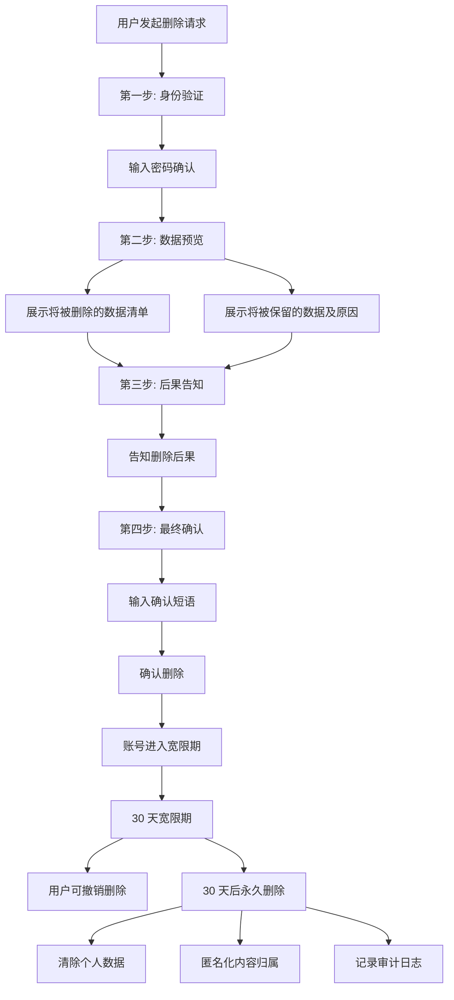
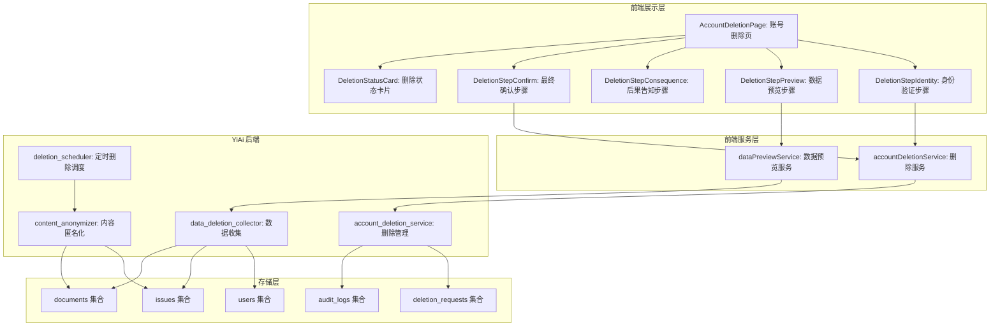
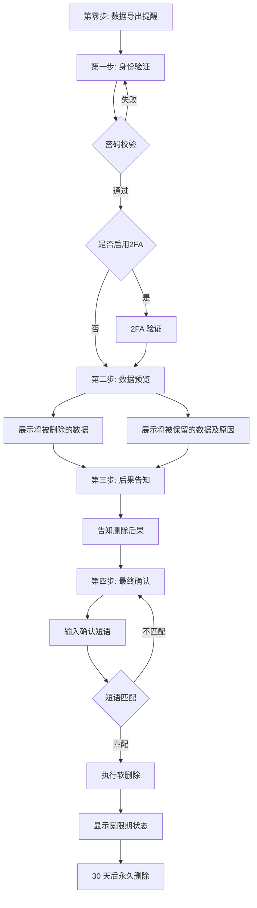

# YV-09-204: 用户账号删除 — 确认步骤、数据删除预览、带撤销的宽限期、最终确认、数据保留政策展示

> 需求编号：YV-09-204 · 优先级：P2 · 人天：0.3d · 状态：需求已编写
> 依赖：YV-09-201（用户安全设置）、YV-09-203（用户数据导出）

## 背景

### 问题陈述

YiVad 当前不支持用户自主删除账号。账号的创建和删除完全依赖管理员操作，用户无法对自己的账号行使删除权。这不仅违反了数据隐私法规的要求，也降低了用户对平台的信任。当前存在以下问题：

1. **无法自主删除账号**：用户想离开平台必须联系管理员，流程繁琐
2. **不满足被遗忘权**：违反 GDPR 第 17 条和《个人信息保护法》第 47 条
3. **删除后果不透明**：用户不知道删除账号后哪些数据会被删除、哪些会被保留
4. **无撤销机制**：误删账号后无法恢复
5. **数据保留政策不清晰**：用户不了解系统在什么情况下会保留数据
6. **删除流程不安全**：缺乏多步确认机制防止恶意删除

**核心矛盾**：法律法规要求赋予用户删除账号的权利，但直接删除存在不可逆风险，需要设计既合规又安全的删除流程。

### 影响范围

| # | 影响 | 严重程度 | 典型场景 |
|---|------|----------|----------|
| 1 | 无法自主删除 | 高 | 用户想注销账号，需联系管理员 |
| 2 | 法规不合规 | 高 | 欧盟用户行使被遗忘权，系统无法响应 |
| 3 | 误删风险 | 中 | 用户误操作导致账号永久丢失 |
| 4 | 数据残留 | 中 | 用户以为数据已删除但实际仍有备份 |
| 5 | 协作链断裂 | 中 | 删除账号导致其创建的内容失去所有者 |
| 6 | 无法恢复 | 低 | 用户删除后反悔，数据已不可恢复 |

### 挑战

| 挑战 | 说明 |
|------|------|
| 数据删除 vs 保留 | 需要明确界定哪些数据必须删除、哪些可以保留、哪些必须保留 |
| 宽限期设计 | 需要在用户体验和数据安全之间平衡宽限期时长 |
| 内容归属处理 | 用户创建的内容（Issue/文档）在用户删除后如何处理 |
| 审计要求 | 删除操作需要完整的审计日志，同时满足隐私保护要求 |
| 法规合规 | 需同时满足 GDPR 被遗忘权和中国《个人信息保护法》的要求 |

---

## 一、现状分析

### 1.1 当前账号管理系统现状

```
现有用户系统:
├── 用户认证
│   ├── 登录/登出
│   └── Token 管理
├── 用户管理（管理员）
│   ├── 用户列表
│   ├── 创建用户
│   ├── 启用/禁用用户
│   └── 删除用户（管理员操作）

缺失:
├── 用户自主删除账号            # ❌ 不存在
├── 数据删除预览                # ❌ 不存在
├── 宽限期 + 撤销机制            # ❌ 不存在
├── 删除确认多步流程            # ❌ 不存在
├── 数据保留政策展示            # ❌ 不存在
├── 内容归属处理                # ❌ 不存在
├── 删除审计日志                # ❌ 不存在
└── 被遗忘权合规说明            # ❌ 不存在
```

### 1.2 账号删除数据流



### 1.3 根因矩阵

| 症状 | 根因 | 触发条件 | 频率 |
|------|------|----------|------|
| 无法自主删除 | 无用户级删除功能 | 用户想离开平台时 | 中 |
| 法规不合规 | 无被遗忘权响应机制 | GDPR 审计时 | 高 |
| 误删不可逆 | 无宽限期设计 | 用户误操作时 | 低 |
| 删除不透明 | 无数据删除预览 | 确认删除前 | 中 |
| 内容链断裂 | 无归属处理策略 | 删除后查看历史内容时 | 中 |
| 审计不足 | 无删除审计日志 | 需要追溯删除记录时 | 低 |

---

## 二、设计决策

### 决策 1：删除模式 — 立即永久删除 vs 软删除+宽限期 vs 标记匿名化

| 选项 | 用户体验 | 安全性 | 法规合规 |
|------|----------|--------|----------|
| 立即永久删除 | 差（误删不可逆） | 高 | 满足 |
| 软删除 + 宽限期（可恢复） | 好 | 中 | 满足 |
| 标记匿名化（数据保留但标识移除） | 中 | 低 | 部分满足 |

**选择：软删除 + 30 天宽限期。** 账号在 30 天内标记为"待删除"，用户登录后可撤销。30 天后自动执行永久删除和匿名化处理。兼顾用户体验和安全。

### 决策 2：用户内容处理 — 删除所有内容 vs 匿名化保留 vs 可选

| 选项 | 数据完整性 | 协作连续性 | 隐私保护 |
|------|------------|------------|----------|
| 删除所有内容 | 差 | 差 | 高 |
| 匿名化保留（显示为"已删除用户"） | 高 | 高 | 中 |
| 用户可选（保留/删除/转移） | 高 | 高 | 高 |

**选择：用户可选 + 默认匿名化。** 用户可选择：内容匿名化保留（默认）、内容转移给指定用户、内容一并删除。满足不同场景需求。

### 决策 3：宽限期时长 — 7 天 vs 30 天 vs 90 天

| 选项 | 用户友好度 | 存储成本 | 业务影响 |
|------|------------|----------|----------|
| 7 天 | 低 | 低 | 低 |
| 30 天 | 中 | 中 | 中 |
| 90 天 | 高 | 高 | 高 |

**选择：30 天。** 行业标准（Google、GitHub、Slack 均为 30 天）。给用户足够的反悔时间，同时不过度占用资源。

### 决策 4：删除确认验证 — 仅密码 vs 密码+邮件 vs 密码+2FA+确认短语

| 选项 | 安全性 | 用户体验 | 防误操作 |
|------|--------|----------|----------|
| 仅密码 | 低 | 高 | 低 |
| 密码 + 邮件验证码 | 中 | 中 | 中 |
| 密码 + 2FA + 确认短语 | 高 | 低 | 高 |

**选择：密码 + 确认短语。** 用户需输入密码验证身份，然后输入系统生成的确认短语（如"永久删除我的账号"）。2FA 作为额外保护（如已启用则必须验证）。

### 设计决策记录

| 决策 | 选项 A | 选项 B | 选项 C | 选择 | 理由 |
|------|--------|--------|--------|------|------|
| 删除模式 | 立即删除 | 软删除+宽限期 | 匿名化 | **软删除+30天** | 行业标准，可撤销 |
| 内容处理 | 全部删除 | 匿名化保留 | 用户可选 | **用户可选** | 灵活满足不同需求 |
| 宽限期 | 7天 | 30天 | 90天 | **30天** | 行业标准 |
| 确认验证 | 仅密码 | 密码+邮件 | 密码+2FA+短语 | **密码+确认短语** | 防误操作 |

---

## 三、目标架构

### 3.1 账号删除系统架构



### 3.2 账号删除步骤流程



### 3.3 账号删除指标

| 指标 | 改造前 | 改造后 |
|------|--------|--------|
| 用户自主删除 | 不支持 | 4 步确认流程 + 宽限期 |
| 数据透明 | 不透明 | 删除/保留数据清单预览 |
| 撤销机制 | 无 | 30 天宽限期随时撤销 |
| 内容归属 | 自动丢失 | 可选匿名化/转移/删除 |
| 法规合规 | 不满足 | 满足被遗忘权要求 |

---

## 四、具体改动

### 4.1 账号删除服务

```typescript
// src/services/account-deletion-service.ts (新增)

interface DataDeletionPreview {
  to_be_deleted: DeletionItem[];
  to_be_retained: RetentionItem[];
  estimated_completion: string;
}

interface DeletionItem {
  category: string;
  description: string;
  count: number;
  examples: string[];
}

interface RetentionItem {
  category: string;
  description: string;
  reason: string;
  retention_period: string;
}

interface ContentHandlingOption {
  id: 'anonymize' | 'transfer' | 'delete';
  name: string;
  description: string;
  available: boolean;
}

interface DeletionRequest {
  id: string;
  status: 'pending_confirmation' | 'grace_period' | 'cancelled' | 'completed';
  created_at: string;
  scheduled_deletion_at: string;
  content_handling: string;
  can_cancel: boolean;
  days_remaining: number;
}

interface ConfirmDeletionPayload {
  password: string;
  two_factor_code?: string;
  confirmation_phrase: string;
  content_handling: string;
  transfer_target_user_id?: string;
}

class AccountDeletionService {
  private baseUrl: string;

  constructor() {
    this.baseUrl = import.meta.env.RS_BUILD_API_BASE || 'http://localhost:10086';
  }

  async getDataPreview(): Promise<DataDeletionPreview> {
    const response = await fetch(`${this.baseUrl}/`, {
      method: 'POST',
      headers: { 'Content-Type': 'application/json' },
      body: JSON.stringify({
        module_name: 'services.user.account_deletion_service',
        method_name: 'get_deletion_preview',
        parameters: {},
      }),
    });
    const data = await response.json();
    return data.code === 0 ? data.data : null;
  }

  async getContentHandlingOptions(): Promise<ContentHandlingOption[]> {
    const response = await fetch(`${this.baseUrl}/`, {
      method: 'POST',
      headers: { 'Content-Type': 'application/json' },
      body: JSON.stringify({
        module_name: 'services.user.account_deletion_service',
        method_name: 'get_content_handling_options',
        parameters: {},
      }),
    });
    const data = await response.json();
    return data.code === 0 ? data.data : [];
  }

  async getConfirmationPhrase(): Promise<{ phrase: string }> {
    const response = await fetch(`${this.baseUrl}/`, {
      method: 'POST',
      headers: { 'Content-Type': 'application/json' },
      body: JSON.stringify({
        module_name: 'services.user.account_deletion_service',
        method_name: 'get_confirmation_phrase',
        parameters: {},
      }),
    });
    const data = await response.json();
    return data.code === 0 ? data.data : { phrase: '永久删除我的账号' };
  }

  async confirmDeletion(payload: ConfirmDeletionPayload): Promise<{ success: boolean; message: string; scheduled_date?: string }> {
    const response = await fetch(`${this.baseUrl}/`, {
      method: 'POST',
      headers: { 'Content-Type': 'application/json' },
      body: JSON.stringify({
        module_name: 'services.user.account_deletion_service',
        method_name: 'confirm_deletion',
        parameters: payload,
      }),
    });
    const data = await response.json();
    return { success: data.code === 0, message: data.message, scheduled_date: data.data?.scheduled_deletion_at };
  }

  async getDeletionStatus(): Promise<DeletionRequest | null> {
    const response = await fetch(`${this.baseUrl}/`, {
      method: 'POST',
      headers: { 'Content-Type': 'application/json' },
      body: JSON.stringify({
        module_name: 'services.user.account_deletion_service',
        method_name: 'get_deletion_status',
        parameters: {},
      }),
    });
    const data = await response.json();
    return data.code === 0 ? data.data : null;
  }

  async cancelDeletion(): Promise<boolean> {
    const response = await fetch(`${this.baseUrl}/`, {
      method: 'POST',
      headers: { 'Content-Type': 'application/json' },
      body: JSON.stringify({
        module_name: 'services.user.account_deletion_service',
        method_name: 'cancel_deletion',
        parameters: {},
      }),
    });
    const data = await response.json();
    return data.code === 0;
  }
}

export const accountDeletionService = new AccountDeletionService();
export type { DataDeletionPreview, DeletionItem, RetentionItem, ContentHandlingOption, DeletionRequest, ConfirmDeletionPayload };
```

### 4.2 账号删除页面

```vue
<!-- src/views/settings/AccountDeletionPage.vue (新增) -->

<script setup lang="ts">
import { ref, onMounted } from 'vue';
import { ElMessage, ElMessageBox } from 'element-plus';
import { useRouter } from 'vue-router';
import { accountDeletionService } from '@/services/account-deletion-service';
import type { DataDeletionPreview, ContentHandlingOption, DeletionRequest } from '@/services/account-deletion-service';

const router = useRouter();
const currentStep = ref(0);
const loading = ref(false);

// 步骤数据
const dataPreview = ref<DataDeletionPreview | null>(null);
const contentOptions = ref<ContentHandlingOption[]>([]);
const confirmationPhrase = ref('');

// 用户输入
const password = ref('');
const twoFactorCode = ref('');
const selectedContentHandling = ref('anonymize');
const transferTarget = ref('');
const confirmPhraseInput = ref('');
const understood = ref(false);

// 宽限期状态
const deletionStatus = ref<DeletionRequest | null>(null);

async function loadInitialData() {
  loading.value = true;
  try {
    const [preview, options, phrase] = await Promise.all([
      accountDeletionService.getDataPreview(),
      accountDeletionService.getContentHandlingOptions(),
      accountDeletionService.getConfirmationPhrase(),
    ]);
    dataPreview.value = preview;
    contentOptions.value = options;
    confirmationPhrase.value = phrase.phrase;
  } finally {
    loading.value = false;
  }
}

async function checkExistingRequest() {
  const status = await accountDeletionService.getDeletionStatus();
  if (status) {
    deletionStatus.value = status;
  }
}

function nextStep() {
  if (currentStep.value < 4) {
    currentStep.value++;
  }
}

function prevStep() {
  if (currentStep.value > 0) {
    currentStep.value--;
  }
}

async function handleConfirmDeletion() {
  if (confirmPhraseInput.value !== confirmationPhrase.value) {
    ElMessage.error('确认短语输入不正确');
    return;
  }

  loading.value = true;
  try {
    const result = await accountDeletionService.confirmDeletion({
      password: password.value,
      two_factor_code: twoFactorCode.value || undefined,
      confirmation_phrase: confirmPhraseInput.value,
      content_handling: selectedContentHandling.value,
      transfer_target_user_id: transferTarget.value || undefined,
    });

    if (result.success) {
      ElMessage.success('账号删除请求已确认');
      await checkExistingRequest();
      currentStep.value = 5; // 跳转到状态展示
    } else {
      ElMessage.error(result.message || '操作失败');
    }
  } finally {
    loading.value = false;
  }
}

async function handleCancelDeletion() {
  await ElMessageBox.confirm('确定要撤销账号删除请求吗？', '撤销删除', {
    type: 'warning',
    confirmButtonText: '恢复账号',
    cancelButtonText: '保持删除',
  });

  const success = await accountDeletionService.cancelDeletion();
  if (success) {
    ElMessage.success('账号删除请求已撤销，您的账号恢复正常');
    deletionStatus.value = null;
    currentStep.value = 0;
  }
}

onMounted(async () => {
  await loadInitialData();
  await checkExistingRequest();
});
</script>

<template>
  <div class="account-deletion-page" v-loading="loading">
    <div class="adp-header">
      <h2>删除账号</h2>
      <p class="adp-warning">
        此操作不可逆。请仔细阅读每一步的说明，确保您已了解删除账号的后果。
      </p>
    </div>

    <!-- 宽限期状态卡片 -->
    <el-alert
      v-if="deletionStatus && deletionStatus.status === 'grace_period'"
      type="warning"
      :closable="false"
      title="您的账号已进入删除宽限期"
    >
      <p>
        账号将在 <strong>{{ deletionStatus.scheduled_deletion_at }}</strong> 被永久删除。
        剩余 <strong>{{ deletionStatus.days_remaining }}</strong> 天。
        如需撤销，请点击下方按钮。
      </p>
      <el-button type="primary" @click="handleCancelDeletion">撤销删除，恢复账号</el-button>
    </el-alert>

    <!-- 删除步骤流程 -->
    <template v-if="!deletionStatus || deletionStatus.status !== 'grace_period'">
      <el-steps :active="currentStep" align-center>
        <el-step title="身份验证" />
        <el-step title="数据预览" />
        <el-step title="后果告知" />
        <el-step title="最终确认" />
      </el-steps>

      <!-- 步骤 0: 数据导出提醒 -->
      <div v-if="currentStep === 0" class="adp-step">
        <el-alert type="info" :closable="false" title="在删除账号之前，建议您先导出个人数据">
          <p>您可以先 <router-link to="/settings/data-export">导出个人数据</router-link>，保留您的数据副本。</p>
        </el-alert>
        <div style="text-align: center; margin-top: 24px">
          <el-button type="primary" @click="nextStep">开始删除流程</el-button>
        </div>
      </div>

      <!-- 步骤 1: 身份验证 -->
      <div v-if="currentStep === 1" class="adp-step">
        <el-card>
          <template #header><span>第一步：验证您的身份</span></template>
          <el-form label-width="120px">
            <el-form-item label="当前密码" required>
              <el-input v-model="password" type="password" placeholder="请输入您的登录密码" show-password />
            </el-form-item>
          </el-form>
          <div class="adp-actions">
            <el-button @click="prevStep">上一步</el-button>
            <el-button type="primary" :disabled="!password" @click="nextStep">下一步</el-button>
          </div>
        </el-card>
      </div>

      <!-- 步骤 2: 数据预览 -->
      <div v-if="currentStep === 2" class="adp-step">
        <el-card>
          <template #header><span>第二步：查看将被删除和保留的数据</span></template>

          <h4 style="color: #f56c6c">将被删除的数据</h4>
          <el-table :data="dataPreview?.to_be_deleted || []" size="small">
            <el-table-column prop="category" label="类型" width="150" />
            <el-table-column prop="description" label="说明" />
            <el-table-column prop="count" label="数量" width="80" />
          </el-table>

          <h4 style="color: #e6a23c; margin-top: 16px">将被保留的数据及原因</h4>
          <el-table :data="dataPreview?.to_be_retained || []" size="small">
            <el-table-column prop="category" label="类型" width="150" />
            <el-table-column prop="description" label="说明" />
            <el-table-column prop="reason" label="保留原因" width="120" />
          </el-table>

          <h4 style="margin-top: 16px">内容处理方式</h4>
          <el-radio-group v-model="selectedContentHandling">
            <el-radio
              v-for="opt in contentOptions"
              :key="opt.id"
              :value="opt.id"
              :disabled="!opt.available"
            >
              {{ opt.name }} - {{ opt.description }}
            </el-radio>
          </el-radio-group>

          <div class="adp-actions">
            <el-button @click="prevStep">上一步</el-button>
            <el-button type="primary" @click="nextStep">下一步</el-button>
          </div>
        </el-card>
      </div>

      <!-- 步骤 3: 后果告知 -->
      <div v-if="currentStep === 3" class="adp-step">
        <el-card>
          <template #header><span>第三步：了解删除后果</span></template>
          <el-checkbox v-model="understood">
            我已了解账号删除的后果，包括但不限于：
            <ul>
              <li>所有个人信息将被删除且无法恢复</li>
              <li>我创建的 Issue、文档等内容将按我选择的方式处理</li>
              <li>我无法再登录 YiVad 系统</li>
              <li>我的 API 密钥将被立即吊销</li>
              <li>我拥有的项目将由管理员重新分配</li>
            </ul>
          </el-checkbox>
          <div class="adp-actions">
            <el-button @click="prevStep">上一步</el-button>
            <el-button type="primary" :disabled="!understood" @click="nextStep">下一步</el-button>
          </div>
        </el-card>
      </div>

      <!-- 步骤 4: 最终确认 -->
      <div v-if="currentStep === 4" class="adp-step">
        <el-card>
          <template #header><span>第四步：最终确认</span></template>
          <el-alert type="error" :closable="false" title="此操作将永久删除您的账号">
            <p>请输入以下确认短语以继续：</p>
            <p style="font-size: 18px; font-weight: bold; margin: 8px 0">{{ confirmationPhrase }}</p>
          </el-alert>
          <el-form style="margin-top: 16px" label-width="120px">
            <el-form-item label="确认短语" required>
              <el-input v-model="confirmPhraseInput" :placeholder="confirmationPhrase" />
            </el-form-item>
          </el-form>
          <div class="adp-actions">
            <el-button @click="prevStep">上一步</el-button>
            <el-button type="danger" :disabled="confirmPhraseInput !== confirmationPhrase" @click="handleConfirmDeletion">
              永久删除我的账号
            </el-button>
          </div>
        </el-card>
      </div>
    </template>
  </div>
</template>
```

### 4.3 文件变更清单

| 文件 | 操作 | 说明 |
|------|------|------|
| `src/services/account-deletion-service.ts` | 新增 | 账号删除服务层 |
| `src/views/settings/AccountDeletionPage.vue` | 新增 | 账号删除主页面 |
| `src/views/settings/components/DeletionStepIdentity.vue` | 新增 | 身份验证步骤组件 |
| `src/views/settings/components/DeletionStepPreview.vue` | 新增 | 数据预览步骤组件 |
| `src/views/settings/components/DeletionStatusCard.vue` | 新增 | 删除状态卡片组件 |
| `src/router/routes.ts` | 修改 | 添加账号删除路由 |

---

## 五、实施步骤

| 步骤 | 操作 | 路径 | 验证 | 人天 |
|------|------|------|------|------|
| 1 | 实现账号删除服务层 | `account-deletion-service.ts` | 预览/确认/状态/撤销 API | 0.04 |
| 2 | 实现账号删除主页面 | `AccountDeletionPage.vue` | 4 步流程 + 宽限期状态 | 0.06 |
| 3 | 实现身份验证步骤 | `DeletionStepIdentity.vue` | 密码 + 2FA 验证 | 0.04 |
| 4 | 实现数据预览步骤 | `DeletionStepPreview.vue` | 数据清单 + 内容处理选择 | 0.04 |
| 5 | 实现后果告知步骤 | `AccountDeletionPage.vue` | 确认勾选 | 0.03 |
| 6 | 实现最终确认步骤 | `AccountDeletionPage.vue` | 确认短语输入 + 提交 | 0.04 |
| 7 | 实现删除状态卡片 | `DeletionStatusCard.vue` | 宽限期倒计时 + 撤销按钮 | 0.03 |
| 8 | 添加路由和导航入口 | `routes.ts` | 安全设置中的账号删除入口 | 0.02 |

**总人天：0.3d**

---

## 六、测试规格

### 场景 1：发起账号删除

**GIVEN** 用户已登录，在账号删除页面
**WHEN** 完成 4 步流程：输入密码、查看数据预览（选择匿名化）、勾选了解后果、输入确认短语，点击删除
**THEN** 账号进入宽限期，状态卡片显示剩余 30 天
**AND** 发送确认邮件通知用户删除请求已提交

### 场景 2：撤销删除请求

**GIVEN** 账号处于宽限期第 15 天
**WHEN** 用户登录后看到宽限期状态卡片，点击"撤销删除"
**THEN** 账号恢复正常状态，删除请求被取消
**AND** 用户可以正常使用所有功能

### 场景 3：数据删除预览

**GIVEN** 用户有 50 个 Issue、30 个文档、200 条评论
**WHEN** 用户在删除流程的数据预览步骤
**THEN** 显示将被删除的数据：个人信息（1）、活动记录（200）、Issue（50）、文档（30）
**AND** 显示将被保留的数据：审计日志（合规要求）、匿名化的 Issue 历史

### 场景 4：错误确认短语

**GIVEN** 确认短语为"永久删除我的账号"
**WHEN** 用户在最终确认步骤输入"删除账号"
**THEN** "永久删除"按钮保持禁用状态
**AND** 提示文字显示"请输入正确的确认短语"

### 场景 5：宽限期到期自动删除

**GIVEN** 账号在 30 天前进入宽限期，当天是最后一天
**WHEN** 定时任务在到期日执行
**THEN** 个人数据被永久删除
**AND** Issue/文档创建者显示为"已删除用户"
**AND** 审计日志记录删除完成事件

### 场景 6：内容转移选项

**GIVEN** 用户选择"转移内容"并将 Issue 转移给用户 B
**WHEN** 账号被删除
**THEN** 用户创建的 Issue 所有权转移给用户 B
**AND** 用户 B 收到通知，告知有内容被转移

---

## 七、风险与缓解

| 风险 | 概率 | 影响 | 缓解措施 |
|------|------|------|----------|
| 恶意删除他人账号 | 低 | 高 | 多步验证：密码 + 2FA + 确认短语 |
| 宽限期内账号被他人操作 | 低 | 中 | 宽限期内账号仅可登录查看状态和撤销，不可执行其他操作 |
| 定时删除任务失败 | 中 | 高 | 删除任务有重试机制（3 次），最终失败标记为需要手动处理 |
| 内容转移后目标用户拒绝 | 低 | 低 | 转移前发送通知给目标用户，目标用户可选择接受或拒绝 |
| 合规审计数据被误删 | 低 | 高 | 审计日志和合规相关数据不在删除范围内 |

---

## 八、回滚策略

| 场景 | 回滚操作 | 影响 |
|------|----------|------|
| 删除页面异常 | 隐藏删除入口 | 用户无法发起删除 |
| 宽限期状态异常 | 手动修复 deletion_requests 状态 | 宽限期计时器可能不准 |
| 定时删除任务异常 | 暂停定时任务，手动批量处理 | 到期账号未及时删除 |
| 撤销功能异常 | 管理员后台手动恢复账号 | 用户体验差 |

---

## 九、设计决策记录

### D-01：账号删除模式

- **问题**：账号删除采用什么模式
- **选项**：立即删除、软删除+宽限期、标记匿名化
- **选择**：软删除 + 30 天宽限期
- **理由**：行业标准，支持用户反悔撤销

### D-02：用户内容处理

- **问题**：用户创建的内容在账号删除后如何处理
- **选项**：全部删除、匿名化保留、用户可选
- **选择**：用户可选（默认匿名化）
- **理由**：灵活满足不同场景，默认匿名化保护数据完整性

### D-03：宽限期时长

- **问题**：宽限期多久合适
- **选项**：7 天、30 天、90 天
- **选择**：30 天
- **理由**：Google/GitHub/Slack 等均为 30 天

### D-04：删除确认验证

- **问题**：如何防止误删和恶意删除
- **选项**：仅密码、密码+邮件、密码+2FA+确认短语
- **选择**：密码 + 确认短语（+ 2FA 如已启用）
- **理由**：多层保护，确认短语防止机械点击确认

---

## 十、可观测性

### 指标

| 指标 | 类型 | 说明 |
|------|------|------|
| `yivad.deletion.request_count` | Counter | 删除请求数 |
| `yivad.deletion.cancelled_count` | Counter | 撤销删除数 |
| `yivad.deletion.completed_count` | Counter | 完成删除数 |
| `yivad.deletion.cancellation_rate` | Gauge | 撤销率（cancelled / requested） |
| `yivad.deletion.active_grace_period` | Gauge | 当前宽限期用户数 |

### 告警

| 告警 | 条件 | 级别 |
|------|------|------|
| 删除请求激增 | 1 小时内 > 20 个 | WARNING |
| 定时删除任务失败 | 连续 3 次失败 | CRITICAL |
| 宽限期到期未删除 | 到期超过 24h 未处理 | WARNING |
| 撤销率异常 | 撤销率 > 80%（可能存在误导） | INFO |

---

## 十一、代码审查检查清单

- [ ] 删除流程 4 步清晰展示，支持上一步/下一步
- [ ] 身份验证要求输入密码，已启用 2FA 的用户需额外验证
- [ ] 数据预览展示将被删除和保留的数据清单
- [ ] 内容处理选项（匿名化/转移/删除）正确展示
- [ ] 后果告知需用户勾选确认
- [ ] 最终确认需输入与服务端返回一致的确认短语
- [ ] 宽限期状态卡片正确显示倒计时
- [ ] 撤销删除需二次确认
- [ ] 宽限期内用户功能受限（仅可查看状态和撤销）
- [ ] 删除完成后用户被强制登出
- [ ] 页面跳转到登录页并显示"账号已删除"提示

---

## 回归问题预测

| # | 预测问题 | 原因 | 验证方法 |
|---|---------|------|---------|
| 1 | 宽限期内用户的所有 JWT Token 仍有效，用户可以继续使用完整功能 | JWT 是无状态 Token，后端未做宽限期状态检查 | 在每个 API 请求中检查用户是否处于宽限期，宽限期内除删除相关 API 外，其他 API 返回 403 |
| 2 | 用户删除后，其创建的文档被匿名化，但在搜索索引中仍包含原始用户名 | 搜索索引未同步匿名化处理，索引仍包含旧用户名 | 删除流程中包含搜索索引更新步骤，将用户标识替换为"已删除用户" |
| 3 | 定时删除任务在批量处理多个到期账号时，MongoDB 操作超时 | 多个删除任务同时触发大量数据库操作 | 删除任务逐个处理（非并行），每个用户删除后设置间隔 5 秒 |
| 4 | 用户删除账号后重新注册相同用户名，系统日志中出现新旧账号混淆 | 系统日志使用用户名作为标识，而非唯一 ID | 审计日志和其他系统日志使用用户唯一 ID，而非用户名 |
| 5 | 删除确认短语使用固定文本"永久删除我的账号"，用户可能误打空格或标点导致不匹配 | 固定文本匹配需要完全精确，包括标点符号 | 确认短语匹配时忽略首尾空格，做全角/半角字符归一化 |
| 6 | 内容转移给目标用户后，目标用户权限不足无法访问转移的内容 | 转移的内容所属项目可能对目标用户不可见 | 转移时检查目标用户是否对内容所属项目有访问权限，无权限时提示用户选择其他目标 |

---

## 性能分析

### 各操作耗时

| 阶段 | 预估耗时 | 说明 |
|------|----------|------|
| 数据删除预览加载 | < 500ms | 统计各集合用户数据量 |
| 删除确认处理 | < 1s | 写入 deletion_requests + 更新 user 状态 |
| 宽限期状态查询 | < 100ms | 单文档查询 |
| 撤销删除 | < 200ms | 更新状态 + 恢复用户功能 |
| 定时永久删除 | < 10s | 多集合数据删除 + 匿名化 |

### 内存影响

| 项目 | 体积 | 说明 |
|------|------|------|
| account-deletion-service.ts | ~3KB | 账号删除服务 |
| AccountDeletionPage.vue | ~8KB | 删除主页面 |
| 各子组件 | ~8KB | 3 个子组件 |
| 运行时数据 | < 50KB | 数据预览 + 配置 |

### 对应用性能的影响

| 阶段 | 影响 | 说明 |
|------|------|------|
| 删除页面加载 | < 500ms | 3 个 API 并行请求 |
| 删除确认 | < 1s | 单次 API 调用 |
| 宽限期状态 | < 100ms | 轻量查询 |
| 定时删除 | 后台执行 | 不占用前端资源 |

