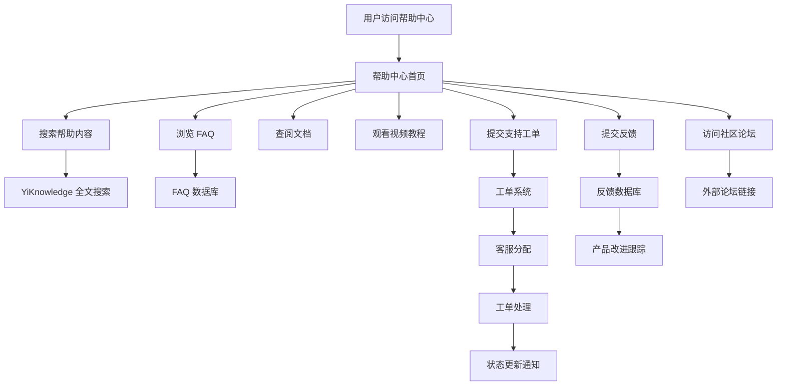

# YV-09-205: 用户帮助与支持 — FAQ、文档链接、视频教程、支持工单、工单跟踪、反馈提交、社区论坛

> 需求编号：YV-09-205 · 优先级：P2 · 人天：0.3d · 状态：需求已编写
> 依赖：YiKnowledge（知识库数据源）、YV-09-27（通知中心）

## 背景

### 问题陈述

YiVad 当前缺乏集中的帮助与支持入口。用户在使用过程中遇到问题时，只能通过非正式渠道（口头询问、即时通讯）寻求帮助，效率低下且问题解答无法沉淀。同时也缺乏结构化的用户反馈收集渠道。当前存在以下问题：

1. **无帮助中心**：用户遇到问题找不到统一的自助帮助入口
2. **FAQ 缺失**：常见问题没有文档化，反复回答相同问题
3. **文档分散**：产品文档分散在多个位置（YiKnowledge、README、代码注释），用户难以找到
4. **无支持工单**：用户遇到问题无法正式提交工单，无法跟踪处理进度
5. **反馈渠道单一**：缺乏结构化的反馈提交机制，用户建议难以收集和分析
6. **社区交流缺失**：用户之间无法互相帮助，知识无法共享

**核心矛盾**：随着用户数量增长，非正式的支持方式难以扩展，缺乏自助式帮助机制导致支持效率低下，同时用户反馈无法有效收集和改进产品。

### 影响范围

| # | 影响 | 严重程度 | 典型场景 |
|---|------|----------|----------|
| 1 | 自助服务缺失 | 高 | 新用户不知道如何使用某功能，找不到帮助文档 |
| 2 | 常见问题反复回答 | 中 | 同一个问题被 10 个用户反复询问 |
| 3 | 文档查找困难 | 中 | 用户需要查阅 API 文档，不知道在哪里找 |
| 4 | 问题无法跟踪 | 高 | 用户报告 Bug 后，不知道处理进度 |
| 5 | 反馈无法收集 | 中 | 用户有好建议但无处提交 |
| 6 | 知识无法共享 | 低 | 用户 A 知道某问题的解决方案，但用户 B 无法获知 |

### 挑战

| 挑战 | 说明 |
|------|------|
| 知识库集成 | 需要与 YiKnowledge 集成，自动同步 FAQ 和文档 |
| 工单系统 | 需要实现简单的工单生命周期管理（创建、分配、处理、关闭） |
| 搜索体验 | 帮助内容需要高效的全文搜索 |
| 内容维护 | FaQ 和文档内容需要持续更新维护 |
| 权限控制 | 工单系统需要区分普通用户查看和客服/管理员处理权限 |

---

## 一、现状分析

### 1.1 当前帮助与支持现状

```
现有帮助资源 (分散):
├── YiKnowledge 知识库
│   ├── 项目架构文档
│   ├── 开发工作流
│   └── 仅在 IDE 中可用
├── README 文件
│   └── 仅开发环境可见
├── 代码注释
│   └── 仅开发人员可见
├── Bug 追踪（YiVad 内）
│   └── 仅在 Bug 管理页面

缺失:
├── 统一帮助中心入口          # ❌ 不存在
├── FAQ 页面                  # ❌ 不存在
├── 产品文档聚合              # ❌ 不存在
├── 视频教程                  # ❌ 不存在
├── 支持工单系统              # ❌ 不存在
├── 工单状态跟踪              # ❌ 不存在
├── 反馈提交表单              # ❌ 不存在
├── 社区论坛                  # ❌ 不存在
└── 帮助内容搜索              # ❌ 不存在
```

### 1.2 帮助与支持系统数据流



### 1.3 根因矩阵

| 症状 | 根因 | 触发条件 | 频率 |
|------|------|----------|------|
| 无自助帮助 | 无帮助中心 | 用户遇到问题时 | 高 |
| FAQ 缺失 | 常见问题未文档化 | 新用户上手时 | 高 |
| 文档分散 | 无统一文档入口 | 需要查阅文档时 | 中 |
| 问题无跟踪 | 无工单系统 | 报告 Bug/问题后 | 中 |
| 反馈无收集 | 无反馈渠道 | 用户有建议时 | 中 |
| 知识无法共享 | 无社区/论坛 | 用户互助时 | 低 |

---

## 二、设计决策

### 决策 1：帮助中心内容源 — 静态页面 vs 后端动态 vs CMS 集成

| 选项 | 灵活性 | 维护成本 | 搜索体验 |
|------|--------|----------|----------|
| 静态页面（硬编码在 Vue 组件中） | 低 | 高（需发版更新） | 无 |
| 后端动态（从 YiKnowledge 数据库读取） | 中 | 低 | 好 |
| CMS 集成（独立内容管理系统） | 高 | 中 | 好 |

**选择：后端动态（YiKnowledge 数据源）。** FaQ 和文档内容存储在 YiKnowledge markdown 文件中，由 YiAi 知识监视器扫描到 MongoDB。帮助中心从后端 API 读取内容，更新内容只需修改 markdown 文件。

### 决策 2：工单系统 — 自建轻量工单 vs 集成外部工单 vs 复用 Issue 系统

| 选项 | 开发成本 | 功能完整度 | 集成度 |
|------|----------|------------|--------|
| 自建轻量工单（在 YiVad + YiAi 内实现） | 中 | 中 | 高 |
| 集成外部工单（如 Jira Service Management） | 低 | 高 | 中 |
| 复用现有 Issue 系统（添加类型=支持工单） | 低 | 中 | 高 |

**选择：复用 Issue 系统 + 增强。** 在现有 Issue 系统中添加"支持工单"类型，复用已有的状态流转和通知机制。前台用户可见工单列表（仅自己的工单），管理员可见全部工单。

### 决策 3：FAQ 组织结构 — 平铺列表 vs 分类折叠 vs 搜索驱动

| 选项 | 浏览效率 | 信息架构 | 实现复杂度 |
|------|----------|----------|------------|
| 平铺列表 | 低 | 差 | 低 |
| 分类折叠（Accordion） | 高 | 好 | 中 |
| 搜索驱动（仅搜索框，无列表） | 低 | 差 | 中 |

**选择：分类折叠 + 搜索。** 左侧分类导航（支持按模块筛选），右侧 FAQ 折叠面板。顶部搜索框支持全文搜索。兼顾浏览和搜索两种用户行为。

### 决策 4：反馈类型 — 仅自由文本 vs 结构化模板 vs 两者结合

| 选项 | 数据可利用度 | 提交门槛 | 覆盖范围 |
|------|--------------|----------|----------|
| 仅自由文本 | 低（难以分析） | 低 | 高 |
| 结构化模板（Bug报告/功能建议/改进意见） | 高 | 中 | 中 |
| 两者结合（结构化字段 + 自由描述） | 高 | 中 | 高 |

**选择：两者结合。** 先选择反馈类型（Bug 报告/功能建议/体验反馈/其他），根据类型展示结构化字段，最后提供自由文本描述。分类便于后续数据分析。

### 设计决策记录

| 决策 | 选项 A | 选项 B | 选项 C | 选择 | 理由 |
|------|--------|--------|--------|------|------|
| 内容源 | 静态页面 | 后端动态 | CMS集成 | **后端动态(YiKnowledge)** | 复用现有数据，低维护 |
| 工单系统 | 自建 | 外部集成 | 复用Issue | **复用Issue+增强** | 开发成本低 |
| FAQ结构 | 平铺 | 分类折叠 | 搜索驱动 | **分类折叠+搜索** | 浏览+搜索兼顾 |
| 反馈类型 | 自由文本 | 结构化 | 两者结合 | **两者结合** | 可分析+低门槛 |

---

## 三、目标架构

### 3.1 帮助与支持系统架构

```mermaid
graph TD
    subgraph "前端展示层"
        A1[HelpCenter: 帮助中心首页]
        A2[FaqPage: FAQ 页面]
        A3[DocumentationPage: 文档页面]
        A4[VideoTutorials: 视频教程]
        A5[TicketCreate: 创建工单]
        A6[TicketList: 我的工单]
        A7[TicketDetail: 工单详情]
        A8[FeedbackForm: 反馈表单]
        A9[SearchHelp: 帮助搜索]
    end

    subgraph "前端服务层"
        B1[helpService: 帮助服务]
        B2[ticketService: 工单服务]
        B3[feedbackService: 反馈服务]
    end

    subgraph "YiAi 后端"
        C1[help_service: 帮助内容]
        C2[ticket_service: 工单管理(复用Issue)]
        C3[feedback_service: 反馈收集]
        C4[knowledge_service: 知识库服务]
    end

    subgraph "存储层"
        D1[knowledge_files 集合]
        D2[issues 集合(工单)]
        D3[feedbacks 集合]
        D4[static_files 集合]
    end

    A1 --> A9
    A1 --> A2
    A1 --> A3
    A1 --> A4
    A1 --> A5
    A1 --> A6
    A1 --> A8
    A2 --> B1
    A3 --> B1
    A9 --> B1
    A5 --> B2
    A6 --> B2
    A7 --> B2
    A8 --> B3
    B1 --> C1
    B2 --> C2
    B3 --> C3
    C1 --> C4
    C4 --> D1
    C2 --> D2
    C3 --> D3
```

### 3.2 帮助中心页面结构

```mermaid
graph TD
    A[帮助中心首页] --> B[搜索框(置顶)]
    A --> C[快速入口卡片]
    C --> C1[FAQ 常见问题]
    C --> C2[产品文档]
    C --> C3[视频教程]
    C --> C4[提交工单]
    C --> C5[提交反馈]
    C --> C6[社区论坛]
    A --> D[热门 FAQ (Top 10)]
    A --> E[最近更新文档]
    A --> F[工单状态概览]
```

### 3.3 帮助与支持指标

| 指标 | 改造前 | 改造后 |
|------|--------|--------|
| 帮助入口 | 无统一入口 | 帮助中心首页 |
| FAQ | 不存在 | 分类折叠 + 搜索 |
| 文档 | 分散在多处 | 统一文档页面（YiKnowledge 驱动） |
| 视频教程 | 不存在 | 外部链接嵌入 |
| 支持工单 | 不支持 | 创建/查看/跟踪工单 |
| 反馈提交 | 不支持 | 结构化反馈表单 |
| 社区 | 不存在 | 论坛链接跳转 |

---

## 四、具体改动

### 4.1 帮助与支持服务层

```typescript
// src/services/help-service.ts (新增)

interface FaqCategory {
  id: string;
  name: string;
  icon: string;
  description: string;
}

interface FaqItem {
  id: string;
  category_id: string;
  question: string;
  answer: string;      // Markdown 格式
  tags: string[];
  helpful_count: number;
  view_count: number;
  order: number;
}

interface HelpDocument {
  id: string;
  title: string;
  description: string;
  path: string;
  category: string;
  tags: string[];
  updated_at: string;
}

interface VideoTutorial {
  id: string;
  title: string;
  description: string;
  url: string;
  platform: 'youtube' | 'bilibili' | 'internal';
  duration: string;
  thumbnail_url: string;
  category: string;
}

interface SupportTicket {
  id: string;
  type: 'bug' | 'question' | 'feature_request' | 'account' | 'other';
  title: string;
  description: string;
  priority: 'low' | 'medium' | 'high' | 'urgent';
  status: 'open' | 'in_progress' | 'waiting_user' | 'resolved' | 'closed';
  created_at: string;
  updated_at: string;
  resolved_at?: string;
  assignee?: string;
  comments: TicketComment[];
  attachments: string[];
}

interface TicketComment {
  id: string;
  author: string;
  content: string;
  created_at: string;
  is_staff: boolean;
}

interface FeedbackSubmission {
  type: 'bug_report' | 'feature_request' | 'experience' | 'other';
  title: string;
  description: string;
  steps_to_reproduce?: string;
  expected_behavior?: string;
  actual_behavior?: string;
  severity?: 'critical' | 'major' | 'minor' | 'suggestion';
  screenshot_urls?: string[];
  contact_email?: string;
}

class HelpService {
  private baseUrl: string;

  constructor() {
    this.baseUrl = import.meta.env.RS_BUILD_API_BASE || 'http://localhost:10086';
  }

  // FAQ 相关
  async getFaqCategories(): Promise<FaqCategory[]> {
    const response = await fetch(`${this.baseUrl}/`, {
      method: 'POST',
      headers: { 'Content-Type': 'application/json' },
      body: JSON.stringify({
        module_name: 'services.help.help_service',
        method_name: 'get_faq_categories',
        parameters: {},
      }),
    });
    const data = await response.json();
    return data.code === 0 ? data.data : [];
  }

  async getFaqList(categoryId?: string): Promise<FaqItem[]> {
    const response = await fetch(`${this.baseUrl}/`, {
      method: 'POST',
      headers: { 'Content-Type': 'application/json' },
      body: JSON.stringify({
        module_name: 'services.help.help_service',
        method_name: 'get_faq_list',
        parameters: { category_id: categoryId },
      }),
    });
    const data = await response.json();
    return data.code === 0 ? data.data : [];
  }

  async searchHelp(query: string): Promise<{ faqs: FaqItem[]; documents: HelpDocument[] }> {
    const response = await fetch(`${this.baseUrl}/`, {
      method: 'POST',
      headers: { 'Content-Type': 'application/json' },
      body: JSON.stringify({
        module_name: 'services.help.help_service',
        method_name: 'search_help',
        parameters: { filter: query },
      }),
    });
    const data = await response.json();
    return data.code === 0 ? data.data : { faqs: [], documents: [] };
  }

  async recordFaqHelpful(faqId: string): Promise<void> {
    await fetch(`${this.baseUrl}/`, {
      method: 'POST',
      headers: { 'Content-Type': 'application/json' },
      body: JSON.stringify({
        module_name: 'services.help.help_service',
        method_name: 'record_faq_helpful',
        parameters: { faq_id: faqId },
      }),
    });
  }

  // 文档相关
  async getDocumentation(category?: string): Promise<HelpDocument[]> {
    const response = await fetch(`${this.baseUrl}/`, {
      method: 'POST',
      headers: { 'Content-Type': 'application/json' },
      body: JSON.stringify({
        module_name: 'services.help.help_service',
        method_name: 'get_documentation',
        parameters: { category },
      }),
    });
    const data = await response.json();
    return data.code === 0 ? data.data : [];
  }

  async getDocumentContent(docId: string): Promise<string> {
    const response = await fetch(`${this.baseUrl}/`, {
      method: 'POST',
      headers: { 'Content-Type': 'application/json' },
      body: JSON.stringify({
        module_name: 'services.help.help_service',
        method_name: 'get_document_content',
        parameters: { document_id: docId },
      }),
    });
    const data = await response.json();
    return data.code === 0 ? data.data : '';
  }

  // 视频教程
  async getVideoTutorials(): Promise<VideoTutorial[]> {
    const response = await fetch(`${this.baseUrl}/`, {
      method: 'POST',
      headers: { 'Content-Type': 'application/json' },
      body: JSON.stringify({
        module_name: 'services.help.help_service',
        method_name: 'get_video_tutorials',
        parameters: {},
      }),
    });
    const data = await response.json();
    return data.code === 0 ? data.data : [];
  }

  // 工单相关
  async createTicket(ticket: Omit<SupportTicket, 'id' | 'status' | 'created_at' | 'updated_at' | 'comments'>): Promise<SupportTicket> {
    const response = await fetch(`${this.baseUrl}/`, {
      method: 'POST',
      headers: { 'Content-Type': 'application/json' },
      body: JSON.stringify({
        module_name: 'services.help.ticket_service',
        method_name: 'create_ticket',
        parameters: ticket,
      }),
    });
    const data = await response.json();
    return data.code === 0 ? data.data : null;
  }

  async getMyTickets(): Promise<SupportTicket[]> {
    const response = await fetch(`${this.baseUrl}/`, {
      method: 'POST',
      headers: { 'Content-Type': 'application/json' },
      body: JSON.stringify({
        module_name: 'services.help.ticket_service',
        method_name: 'get_my_tickets',
        parameters: {},
      }),
    });
    const data = await response.json();
    return data.code === 0 ? data.data : [];
  }

  async getTicketDetail(ticketId: string): Promise<SupportTicket> {
    const response = await fetch(`${this.baseUrl}/`, {
      method: 'POST',
      headers: { 'Content-Type': 'application/json' },
      body: JSON.stringify({
        module_name: 'services.help.ticket_service',
        method_name: 'get_ticket_detail',
        parameters: { ticket_id: ticketId },
      }),
    });
    const data = await response.json();
    return data.code === 0 ? data.data : null;
  }

  async addTicketComment(ticketId: string, content: string): Promise<TicketComment> {
    const response = await fetch(`${this.baseUrl}/`, {
      method: 'POST',
      headers: { 'Content-Type': 'application/json' },
      body: JSON.stringify({
        module_name: 'services.help.ticket_service',
        method_name: 'add_ticket_comment',
        parameters: { ticket_id: ticketId, content },
      }),
    });
    const data = await response.json();
    return data.code === 0 ? data.data : null;
  }

  // 反馈相关
  async submitFeedback(feedback: FeedbackSubmission): Promise<{ id: string }> {
    const response = await fetch(`${this.baseUrl}/`, {
      method: 'POST',
      headers: { 'Content-Type': 'application/json' },
      body: JSON.stringify({
        module_name: 'services.help.feedback_service',
        method_name: 'submit_feedback',
        parameters: feedback,
      }),
    });
    const data = await response.json();
    return data.code === 0 ? data.data : null;
  }
}

export const helpService = new HelpService();
export type { FaqCategory, FaqItem, HelpDocument, VideoTutorial, SupportTicket, TicketComment, FeedbackSubmission };
```

### 4.2 帮助中心主页面

```vue
<!-- src/views/help/HelpCenter.vue (新增) -->

<script setup lang="ts">
import { ref, onMounted } from 'vue';
import { useRouter } from 'vue-router';
import { helpService } from '@/services/help-service';
import type { FaqCategory, FaqItem, HelpDocument } from '@/services/help-service';
import FaqAccordion from './components/FaqAccordion.vue';
import TicketStatusOverview from './components/TicketStatusOverview.vue';
import HelpSearchBar from './components/HelpSearchBar.vue';

const router = useRouter();
const faqCategories = ref<FaqCategory[]>([]);
const hotFaqs = ref<FaqItem[]>([]);
const recentDocuments = ref<HelpDocument[]>([]);

async function loadData() {
  const [categories, allFaqs, docs] = await Promise.all([
    helpService.getFaqCategories(),
    helpService.getFaqList(),
    helpService.getDocumentation(),
  ]);
  faqCategories.value = categories;
  hotFaqs.value = allFaqs.slice(0, 10);
  recentDocuments.value = docs.slice(0, 5);
}

function handleSearch(query: string) {
  router.push({ name: 'HelpSearch', query: { q: query } });
}

function navigateTo(path: string) {
  router.push(path);
}

onMounted(loadData);
</script>

<template>
  <div class="help-center">
    <div class="hc-hero">
      <h1>帮助中心</h1>
      <p class="hc-subtitle">查找答案、提交工单或给我们反馈</p>
      <HelpSearchBar @search="handleSearch" />
    </div>

    <!-- 快速入口 -->
    <div class="hc-quick-links">
      <el-card
        v-for="link in [
          { icon: 'QuestionFilled', title: '常见问题', desc: '快速找到答案', path: '/help/faq' },
          { icon: 'Document', title: '产品文档', desc: '详细使用指南', path: '/help/docs' },
          { icon: 'VideoPlay', title: '视频教程', desc: '观看操作演示', path: '/help/videos' },
          { icon: 'Tickets', title: '提交工单', desc: '获取技术支持', path: '/help/tickets/create' },
          { icon: 'Edit', title: '提交反馈', desc: '帮助我们改进', path: '/help/feedback' },
          { icon: 'ChatRound', title: '社区论坛', desc: '用户互助交流', path: '', external: 'https://github.com/orgs/YrY/discussions' },
        ]"
        :key="link.path"
        class="hc-link-card"
        @click="link.path ? navigateTo(link.path) : window.open(link.external, '_blank')"
      >
        <el-icon :size="32"><component :is="link.icon" /></el-icon>
        <h3>{{ link.title }}</h3>
        <p>{{ link.desc }}</p>
      </el-card>
    </div>

    <!-- 热门 FAQ -->
    <el-card class="hc-section">
      <template #header>
        <div class="hc-section-header">
          <span>热门问题</span>
          <el-button text type="primary" @click="navigateTo('/help/faq')">查看全部 →</el-button>
        </div>
      </template>
      <FaqAccordion :items="hotFaqs" />
    </el-card>

    <!-- 工单状态 + 最近文档 -->
    <div class="hc-bottom-row">
      <TicketStatusOverview />
      <el-card class="hc-section">
        <template #header>
          <div class="hc-section-header">
            <span>最近更新文档</span>
            <el-button text type="primary" @click="navigateTo('/help/docs')">查看全部 →</el-button>
          </div>
        </template>
        <ul class="hc-doc-list">
          <li v-for="doc in recentDocuments" :key="doc.id" @click="navigateTo(`/help/docs/${doc.id}`)">
            <span class="doc-title">{{ doc.title }}</span>
            <span class="doc-date">{{ doc.updated_at }}</span>
          </li>
          <li v-if="recentDocuments.length === 0" class="hc-empty">暂无文档</li>
        </ul>
      </el-card>
    </div>
  </div>
</template>
```

### 4.3 文件变更清单

| 文件 | 操作 | 说明 |
|------|------|------|
| `src/services/help-service.ts` | 新增 | 帮助中心服务层 |
| `src/views/help/HelpCenter.vue` | 新增 | 帮助中心首页 |
| `src/views/help/FaqPage.vue` | 新增 | FAQ 页面 |
| `src/views/help/DocumentationPage.vue` | 新增 | 文档页面 |
| `src/views/help/VideoTutorialsPage.vue` | 新增 | 视频教程页面 |
| `src/views/help/TicketCreate.vue` | 新增 | 创建工单页面 |
| `src/views/help/TicketList.vue` | 新增 | 我的工单列表 |
| `src/views/help/TicketDetail.vue` | 新增 | 工单详情页面 |
| `src/views/help/FeedbackForm.vue` | 新增 | 反馈提交表单 |
| `src/views/help/components/HelpSearchBar.vue` | 新增 | 帮助搜索栏 |
| `src/views/help/components/FaqAccordion.vue` | 新增 | FAQ 折叠面板 |
| `src/views/help/components/TicketStatusOverview.vue` | 新增 | 工单状态概览 |
| `src/router/routes.ts` | 修改 | 添加帮助中心路由 |

---

## 五、实施步骤

| 步骤 | 操作 | 路径 | 验证 | 人天 |
|------|------|------|------|------|
| 1 | 实现帮助服务层 | `help-service.ts` | FAQ/文档/工单/反馈 API | 0.04 |
| 2 | 实现帮助中心首页 | `HelpCenter.vue` | 搜索 + 快速入口 + 热门FAQ + 工单概览 | 0.05 |
| 3 | 实现 FAQ 分类折叠页面 | `FaqPage.vue` + `FaqAccordion.vue` | 分类筛选 + 折叠展开 + 有帮助评分 | 0.04 |
| 4 | 实现文档页面 | `DocumentationPage.vue` | 分类列表 + Markdown 渲染 | 0.04 |
| 5 | 实现视频教程页面 | `VideoTutorialsPage.vue` | 外部视频嵌入 + 分类 | 0.03 |
| 6 | 实现工单创建 + 列表 + 详情 | `TicketCreate.vue` + `TicketList.vue` + `TicketDetail.vue` | 创建表单 + 列表 + 评论 | 0.04 |
| 7 | 实现反馈表单 | `FeedbackForm.vue` | 结构化字段 + 截图上传 | 0.04 |
| 8 | 添加路由配置 | `routes.ts` | 帮助中心路由完整配置 | 0.02 |

**总人天：0.3d**

---

## 六、测试规格

### 场景 1：搜索帮助内容

**GIVEN** 帮助中心首页已加载
**WHEN** 用户在搜索框输入"如何创建 Issue"
**THEN** 显示匹配的 FAQ 项和文档列表
**AND** 搜索结果按相关度排序，FAQ 优先

### 场景 2：浏览 FAQ

**GIVEN** 用户在 FAQ 页面
**WHEN** 选择分类"Issue 管理"
**THEN** 显示该分类下的所有 FAQ 项，以折叠面板形式展示
**AND** 点击某条 FAQ，展开显示答案

### 场景 3：FAQ 有帮助评分

**GIVEN** 用户查看 FAQ"如何删除 Issue"
**WHEN** 用户点击"有帮助"按钮
**THEN** 该 FAQ 的有帮助计数 +1
**AND** 按钮变为已点击状态，防止重复投票

### 场景 4：创建支持工单

**GIVEN** 用户遇到一个 Bug
**WHEN** 用户进入"提交工单"，选择类型"Bug 报告"，填写标题、描述、优先级，点击提交
**THEN** 工单创建成功，状态为"待处理"
**AND** "我的工单"列表中新增一条记录

### 场景 5：查看工单详情和评论

**GIVEN** 用户有一张状态为"处理中"的工单
**WHEN** 用户进入工单详情页
**THEN** 显示工单完整信息（标题、描述、状态、优先级、创建时间）
**AND** 显示管理员/客服的评论
**AND** 用户可添加新评论

### 场景 6：提交反馈

**GIVEN** 用户有一个功能建议
**WHEN** 用户进入"提交反馈"，选择类型"功能建议"，填写标题和详细描述，点击提交
**THEN** 反馈提交成功，显示感谢信息
**AND** 后端 feedbacks 集合新增一条记录

---

## 七、风险与缓解

| 风险 | 概率 | 影响 | 缓解措施 |
|------|------|------|----------|
| FAQ 内容过时未更新 | 高 | 中 | 与 YiKnowledge 同步，定期审核 FAQ 内容 |
| 工单处理响应慢 | 中 | 中 | 设置工单 SLA（如 24h 首次响应），超时自动升级 |
| 帮助搜索性能差 | 中 | 低 | 使用 MongoDB 文本索引，对 FAQ 和文档建立搜索索引 |
| 视频教程外链失效 | 低 | 低 | 定期检查外链有效性，失效时标记并通知维护者 |
| 反馈数据积压不处理 | 中 | 低 | 设置反馈定期回顾机制，每月整理反馈数据 |

---

## 八、回滚策略

| 场景 | 回滚操作 | 影响 |
|------|----------|------|
| 帮助中心页面异常 | 隐藏帮助中心入口 | 用户无法自助查帮助 |
| FAQ 数据异常 | 降级为静态 FAQ 内容 | 内容可能过时 |
| 工单系统异常 | 隐藏工单入口，引导用户通过其他渠道联系 | 无法在线提交工单 |
| 反馈表单异常 | 隐藏反馈入口 | 无法收集用户反馈 |

---

## 九、设计决策记录

### D-01：帮助内容数据源

- **问题**：帮助中心的内容从哪里来
- **选项**：静态页面、后端动态(YiKnowledge)、CMS 集成
- **选择**：后端动态（YiKnowledge 数据源）
- **理由**：复用现有 YiKnowledge 基础设施，内容更新无需发版

### D-02：工单系统实现

- **问题**：支持工单系统如何实现
- **选项**：自建轻量工单、集成外部、复用 Issue 系统
- **选择**：复用 Issue 系统 + 增强
- **理由**：开发成本低，复用现有状态流转和通知

### D-03：FAQ 组织方式

- **问题**：FAQ 如何组织和展示
- **选项**：平铺列表、分类折叠、搜索驱动
- **选择**：分类折叠 + 搜索
- **理由**：兼顾浏览和搜索两种用户行为

### D-04：反馈表单设计

- **问题**：用户反馈如何收集
- **选项**：自由文本、结构化模板、两者结合
- **选择**：两者结合（结构化字段 + 自由描述）
- **理由**：结构化便于分析，自由描述降低门槛

---

## 十、可观测性

### 指标

| 指标 | 类型 | 说明 |
|------|------|------|
| `yivad.help.faq_views` | Counter | FAQ 浏览次数 |
| `yivad.help.faq_helpful_rate` | Gauge | FAQ 有帮助率 |
| `yivad.help.tickets_created` | Counter | 工单创建数 |
| `yivad.help.tickets_resolved` | Counter | 工单解决数 |
| `yivad.help.avg_resolution_time_hours` | Gauge | 平均工单解决时间 |
| `yivad.help.feedback_count` | Counter | 反馈提交数 |
| `yivad.help.search_count` | Counter | 帮助搜索次数 |

### 告警

| 告警 | 条件 | 级别 |
|------|------|------|
| 工单积压 | 未解决工单 > 50 | WARNING |
| 工单处理超时 | 工单超过 72h 未响应 | WARNING |
| FAQ 有帮助率下降 | 7 天平均 < 60% | INFO |
| 搜索无结果率高 | 无结果率 > 30% | INFO |

---

## 十一、代码审查检查清单

- [ ] 帮助中心首页包含搜索框、快速入口、热门 FAQ、工单状态和最近文档
- [ ] FAQ 页面支持分类筛选和折叠展开
- [ ] 文档页面支持 Markdown 渲染
- [ ] 帮助搜索支持全文搜索 FAQ 和文档
- [ ] 工单创建表单包含完整的必填字段校验
- [ ] 我的工单列表正确显示工单状态
- [ ] 工单详情页支持用户和管理员评论
- [ ] 反馈表单根据反馈类型展示不同的结构化字段
- [ ] 社区论坛链接正确跳转（新标签页打开）
- [ ] 空状态设计（无 FAQ、无工单、无反馈时的引导）
- [ ] 响应式布局适配移动端
- [ ] 帮助中心入口在导航栏显眼位置

---

## 回归问题预测

| # | 预测问题 | 原因 | 验证方法 |
|---|---------|------|---------|
| 1 | 帮助搜索返回的文档链接指向不存在的页面 | YiKnowledge 中的文档路径与前端路由不匹配 | 建立文档路径到前端路由的映射表，搜索返回时附带前端路由 |
| 2 | FAQ 的"有帮助"按钮被恶意脚本刷票 | 无验证码或频率限制 | 同一用户对同一 FAQ 只能投一次（使用用户 ID + FAQ ID 唯一索引） |
| 3 | Markdown 文档中包含的图片链接失效 | 图片使用相对路径，在帮助中心渲染时路径错误 | 文档中的相对路径自动转换为绝对路径（基于 YiKnowledge 文件路径） |
| 4 | 工单系统复用 Issue 系统后，普通用户的工单出现在项目 Issue 列表中 | 工单和 Issue 共享同一集合，筛选条件不足 | 在 Issue 列表中过滤帮助工单类型（`type !== 'support_ticket'`），工单页面仅显示 `type === 'support_ticket'` |
| 5 | 用户提交工单后长时间无管理员响应，工单自动关闭 | 缺少自动关闭规则 | 工单 72h 无响应自动升级为较高优先级，7 天无响应发送催促通知 |
| 6 | 视频教程使用 bilibili/YouTube 外链，企业内网用户无法访问 | 企业网络限制外部视频平台 | 支持上传内部视频到 static_files，优先使用内部链接 |

---

## 性能分析

### 各操作耗时

| 阶段 | 预估耗时 | 说明 |
|------|----------|------|
| 帮助中心首页加载 | < 500ms | 3 个 API 并行请求 |
| FAQ 分类列表加载 | < 300ms | 按分类查询 |
| 帮助内容搜索 | < 500ms | MongoDB 文本索引搜索 |
| 文档内容加载 | < 300ms | Markdown 文件读取 |
| 工单创建 | < 300ms | Issue 创建 |

### 内存影响

| 项目 | 体积 | 说明 |
|------|------|------|
| help-service.ts | ~5KB | 帮助中心服务 |
| HelpCenter.vue | ~6KB | 帮助中心首页 |
| 各子页面和组件 | ~25KB | 8 个页面和组件 |
| 运行时数据 | < 200KB | FAQ + 文档列表 + 工单列表 |

### 对应用性能的影响

| 阶段 | 影响 | 说明 |
|------|------|------|
| 帮助中心首页 | < 500ms | 3 个并行请求 |
| FAQ 页面 | < 300ms | 按需加载分类 |
| 文档渲染 | < 200ms | Markdown 渲染 |
| 工单操作 | < 300ms | 单次 API 调用 |
| 帮助搜索 | < 500ms | 搜索引擎查询 |

