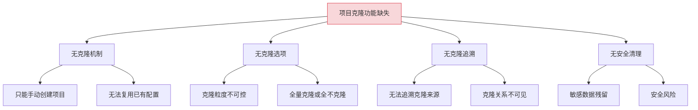
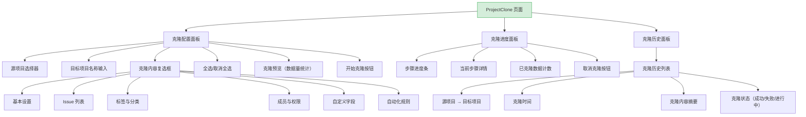
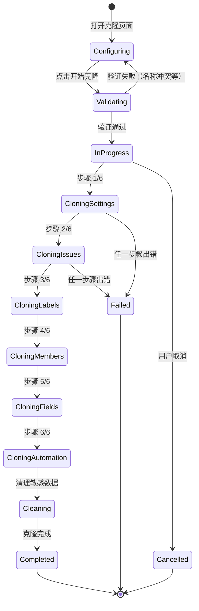

# YV-09-226: 项目克隆复制 — 深度克隆项目、克隆选项配置、克隆进度与历史管理

> 需求编号：YV-09-226 · 优先级：P2 · 人天：0.3d · 状态：需求已编写
> 依赖：YV-09-218（项目归档与恢复）、YV-09-72（项目模板与快速创建）

## 背景

### 问题陈述

YiVad 管理多个项目，团队经常需要基于现有项目创建新项目（如新版本迭代、客户定制分支、A/B 实验分支）。当前只能通过手动创建新项目后逐项复制配置，效率低下且容易遗漏。

1. **无项目克隆功能**：无法基于现有项目快速创建副本
2. **克隆粒度不可控**：无法选择克隆哪些内容（全部 or 部分）
3. **克隆进度不可见**：大量数据克隆时无进度反馈
4. **克隆历史不可追溯**：无法查看项目从哪个源项目克隆而来
5. **克隆后清理不彻底**：克隆后可能残留源项目特定数据（如 Webhook URL、集成密钥）

**核心矛盾**：团队需要快速复制项目结构和配置，但当前只能手动重建，耗时且易出错。

### 影响范围

| # | 影响 | 严重程度 | 典型场景 |
|---|------|----------|----------|
| 1 | 新建项目效率低下 | 高 | 从零手动创建与已有项目类似的新项目，耗时 30 分钟以上 |
| 2 | 克隆内容遗漏 | 高 | 遗漏自定义字段配置导致新项目数据不完整 |
| 3 | 敏感数据泄露 | 高 | 克隆时未清理 Webhook 密钥/集成 Token |
| 4 | 克隆来源不可追溯 | 中 | 无法追溯某项目是从哪个模板/项目衍生而来 |
| 5 | 克隆进度无反馈 | 低 | 大量数据克隆时用户等待焦虑 |

### 挑战

| 挑战 | 说明 |
|------|------|
| 克隆内容的选择性 | 不同场景需要克隆不同内容（全部配置 / 仅工作流 / 仅成员） |
| 敏感数据清理 | 克隆后必须自动清理源项目的敏感配置（密钥、Token、Webhook） |
| 数据一致性 | 克隆过程中的数据关联必须保持完整（如 Issue 与标签的关联） |
| 大量数据克隆的性能 | 项目包含数百个 Issue 时，克隆操作不能阻塞 UI |

---

## 一、现状分析

### 1.1 当前项目创建流程

```
现有功能:
├── 项目模板与快速创建（YV-09-72）
│   ├── 基于模板创建项目
│   └── 预设项目配置
├── 项目归档与恢复（YV-09-218）
│   ├── 项目归档
│   └── 项目恢复

缺失:
├── 项目克隆功能                   # ❌ 不存在
├── 克隆选项选择界面                # ❌ 不存在
├── 克隆进度展示                    # ❌ 不存在
├── 克隆后自动清理                  # ❌ 不存在
├── 克隆历史记录                    # ❌ 不存在
└── 克隆预览                        # ❌ 不存在
```

### 1.2 根因分析矩阵



| 根因 | 症状 | 影响 | 优先级 |
|------|------|------|--------|
| 克隆机制缺失 | 手动重建项目 | 效率低下 | 高 |
| 克隆选项缺失 | 无法选择性克隆 | 灵活性差 | 高 |
| 克隆追溯缺失 | 来源不明 | 管理混乱 | 中 |
| 安全清理缺失 | 敏感数据残留 | 安全风险 | 高 |

---

## 二、设计决策

### 决策 1：克隆内容的粒度

| 选项 | 描述 | 优点 | 缺点 |
|------|------|------|------|
| A: 全量克隆 | 克隆所有内容 | 简单，不遗漏 | 部分场景不需要所有内容 |
| B: 分类选择 | 勾选克隆哪些分类 | 灵活可控 | 界面稍复杂 |
| C: 逐项选择 | 逐个选择克隆内容 | 最精细 | 操作繁琐，0.3d 不够 |

**选择：B（分类选择）。** 提供 6 个分类复选框（基本设置、Issue、标签、成员、自定义字段、自动化规则），用户可按需勾选。全量克隆按钮作为快捷操作。

### 决策 2：克隆后敏感数据清理策略

| 选项 | 描述 | 优点 | 缺点 |
|------|------|------|------|
| A: 自动清理全部 | 克隆后自动清空所有敏感配置 | 安全 | 用户需手动重新配置 |
| B: 保留并告警 | 保留敏感数据但给出安全告警 | 保留配置 | 安全风险 |
| C: 选择性清理 | 允许用户勾选清理哪些敏感数据 | 灵活 | 增加复杂度 |

**选择：A（自动清理全部）。** 敏感数据（Webhook URL、集成密钥、API Token）克隆后自动清空，确保安全。同时在新项目详情页提供"配置向导"引导用户重新配置。

### 决策 3：克隆进度展示方式

| 选项 | 描述 | 优点 | 缺点 |
|------|------|------|------|
| A: 模态进度条 | 弹出模态框展示进度 | 阻止其他操作 | 强制等待 |
| B: 后台任务 + 通知 | 后台执行，完成后通知 | 不阻塞 | 用户无法感知进度 |
| C: 页面内进度条 | 页面内嵌进度条 | 可感知进度 | 离开页面则丢失 |

**选择：C（页面内进度条）+ B（后台任务）兜底。** 主要展示页面内进度条，用户可继续浏览其他页面，通过通知中心获知完成。进度条包含当前步骤（共 N 步骤）、已克隆数据量。

### 决策 4：克隆历史记录方式

| 选项 | 描述 | 优点 | 缺点 |
|------|------|------|------|
| A: 项目详情内展示 | 在项目设置页展示克隆来源 | 与项目关联紧密 | 无法全局查看 |
| B: 独立克隆历史页 | 独立页面展示所有克隆记录 | 全局可查 | 需要额外页面 |
| C: 项目血缘图 | 可视化展示项目克隆关系 | 直观 | 开发成本高 |

**选择：A（项目详情内展示）+ B（独立克隆历史页）。** 项目设置页展示"克隆来源"和"克隆至"关系，独立页面提供全局克隆历史查询。血缘图作为后续迭代方向。

### 设计决策总览

| 决策 | 选项 A | 选项 B | 选择 | 理由 |
|------|--------|--------|------|------|
| 克隆粒度 | 全量克隆 | 分类选择 | **分类选择** | 灵活可控 |
| 敏感数据清理 | 自动全部清理 | 保留并告警 | **自动全部清理** | 安全优先 |
| 进度展示 | 模态进度条 | 后台任务 | **页面内 + 通知** | 不阻塞操作 |
| 历史记录 | 项目详情内 | 独立页面 | **两者结合** | 兼顾关联与全局 |

---

## 三、目标架构

### 3.1 项目克隆页面布局



### 3.2 克隆流程状态机



### 3.3 架构决策权衡

| 维度 | 改造前 | 改造后 | 权衡说明 |
|------|--------|--------|----------|
| 项目创建 | 手动 + 模板 | 手动 + 模板 + 克隆 | 更多创建方式，效率更高 |
| 克隆粒度 | 不可控 | 分类选择 | 灵活性 vs 界面复杂度 |
| 敏感数据 | 无自动清理 | 自动清理 | 安全 vs 少许配置工作 |
| 克隆追溯 | 无 | 项目详情 + 历史页 | 可追溯 vs 存储成本 |

---

## 四、具体改动

### 4.1 改动总览

| 改动点 | 类型 | 涉及文件 | 预估行数 |
|--------|------|---------|---------|
| 项目克隆主页面 | 新增 | `views/project/ProjectClone.vue` | 180 行 |
| 克隆配置面板组件 | 新增 | `components/project/CloneConfigPanel.vue` | 120 行 |
| 克隆进度组件 | 新增 | `components/project/CloneProgress.vue` | 80 行 |
| 克隆历史组件 | 新增 | `components/project/CloneHistory.vue` | 100 行 |
| 克隆预览组件 | 新增 | `components/project/ClonePreview.vue` | 60 行 |
| 克隆数据量统计组件 | 新增 | `components/project/CloneDataStats.vue` | 50 行 |
| ProjectClone Service | 新增 | `services/projectCloneService.ts` | 60 行 |
| 类型定义 | 新增 | `types/projectClone.ts` | 50 行 |
| 路由 + 菜单配置 | 扩展 | `routes.ts`，菜单数据 | 15 行 |

### 4.2 涉及文件

```
src/
├── views/project/
│   └── ProjectClone.vue                  # 新增：项目克隆主页面
├── components/project/
│   ├── CloneConfigPanel.vue              # 新增：克隆配置面板
│   ├── CloneProgress.vue                 # 新增：克隆进度
│   ├── CloneHistory.vue                  # 新增：克隆历史
│   ├── ClonePreview.vue                  # 新增：克隆预览
│   └── CloneDataStats.vue                # 新增：数据量统计
├── services/
│   └── projectCloneService.ts            # 新增：克隆 API 服务
└── types/
    └── projectClone.ts                   # 新增：克隆类型定义
```

### 4.3 核心类型定义

```typescript
// types/projectClone.ts

type CloneCategory = 'settings' | 'issues' | 'labels' | 'members' | 'custom_fields' | 'automation';
type CloneStatus = 'configuring' | 'validating' | 'in_progress' | 'completed' | 'failed' | 'cancelled';
type CloneStep = 'settings' | 'issues' | 'labels' | 'members' | 'custom_fields' | 'automation' | 'cleaning';

interface CloneConfig {
  source_project_key: string;
  target_project_name: string;
  target_project_key: string;
  categories: CloneCategory[];
  clone_issues_with_comments: boolean;
  clone_issues_with_attachments: boolean;
  prefix_issue_keys: boolean;           // 是否给 Issue 键添加前缀
  assign_members_roles: boolean;         // 是否复制成员角色
  dry_run: boolean;                      // 预览模式
}

interface CloneDataStats {
  settings_count: number;
  issues_count: number;
  labels_count: number;
  members_count: number;
  custom_fields_count: number;
  automation_rules_count: number;
  total_items: number;
  estimated_time_seconds: number;
}

interface CloneProgress {
  clone_id: string;
  status: CloneStatus;
  current_step: CloneStep;
  total_steps: number;
  completed_steps: number;
  items_processed: number;
  total_items: number;
  step_details: CloneStepDetail[];
  started_at: string;
  elapsed_seconds: number;
}

interface CloneStepDetail {
  step: CloneStep;
  status: 'pending' | 'in_progress' | 'completed' | 'failed' | 'skipped';
  items_processed: number;
  total_items: number;
  errors: string[];
}

interface CloneHistoryRecord {
  id: string;
  source_project_key: string;
  source_project_name: string;
  target_project_key: string;
  target_project_name: string;
  categories: CloneCategory[];
  status: CloneStatus;
  cloned_by: string;
  cloned_at: string;
  completed_at: string | null;
  items_cloned: number;
  duration_seconds: number;
}

interface ClonePreview {
  config: CloneConfig;
  stats: CloneDataStats;
  warnings: string[];
  errors: string[];
}
```

### 4.4 关键交互逻辑

```typescript
// 克隆分类复选框配置
const CLONE_CATEGORY_OPTIONS: { key: CloneCategory; label: string; description: string; default: boolean }[] = [
  {
    key: 'settings',
    label: '基本设置',
    description: '项目名称、描述、可见性、默认分支等基本配置',
    default: true,
  },
  {
    key: 'issues',
    label: 'Issue 列表',
    description: '所有 Issue 及其评论、附件（可选）',
    default: true,
  },
  {
    key: 'labels',
    label: '标签与分类',
    description: '项目标签、状态定义、优先级配置',
    default: true,
  },
  {
    key: 'members',
    label: '成员与权限',
    description: '项目成员列表及其角色分配',
    default: false,
  },
  {
    key: 'custom_fields',
    label: '自定义字段',
    description: 'Issue 自定义字段定义和配置',
    default: true,
  },
  {
    key: 'automation',
    label: '自动化规则',
    description: '项目自动化规则和 Webhook 配置（密钥自动清空）',
    default: false,
  },
];

// 敏感数据清理清单
const SENSITIVE_FIELDS_TO_CLEAR = [
  'webhook_url',
  'webhook_secret',
  'integration_token',
  'api_key',
  'oauth_client_secret',
  'deploy_key',
  'notification_webhook',
];

// 克隆前验证
function validateCloneConfig(config: CloneConfig): string[] {
  const errors: string[] = [];
  if (!config.source_project_key) errors.push('请选择源项目');
  if (!config.target_project_name) errors.push('请输入目标项目名称');
  if (!config.target_project_key) errors.push('请输入目标项目标识');
  if (config.categories.length === 0) errors.push('请至少选择一项克隆内容');
  if (config.target_project_key === config.source_project_key) errors.push('目标项目标识不能与源项目相同');
  return errors;
}
```

---

## 五、实施步骤

| 步骤 | 内容 | 涉及文件 | 验证方式 | 人天 |
|------|------|---------|---------|------|
| 1 | 类型定义 + Clone Service | `types/projectClone.ts`, `services/projectCloneService.ts` | 类型检查通过 | 0.04 |
| 2 | 克隆数据量统计组件 | `CloneDataStats.vue` | 统计数据正确展示 | 0.03 |
| 3 | 克隆预览组件 | `ClonePreview.vue` | 预览数据正确 | 0.03 |
| 4 | 克隆配置面板组件 | `CloneConfigPanel.vue` | 复选框交互正常 | 0.05 |
| 5 | 克隆进度组件 | `CloneProgress.vue` | 多步骤进度正确 | 0.04 |
| 6 | 克隆历史组件 | `CloneHistory.vue` | 历史记录正确展示 | 0.04 |
| 7 | 项目克隆主页面 | `ProjectClone.vue` | 所有组件集成正常 | 0.06 |
| 8 | 路由 + 菜单配置 | `routes.ts`，菜单 | 页面可访问 | 0.01 |

**总计：0.3d**

---

## 六、测试规格

### 组件测试：CloneConfigPanel

#### Scenario: 全选和取消全选
- **GIVEN** 克隆配置面板渲染，6 个分类复选框
- **WHEN** 点击"全选"按钮
- **THEN** 所有 6 个复选框被勾选
- **WHEN** 点击"取消全选"按钮
- **THEN** 所有复选框取消勾选

#### Scenario: 至少选择一项的校验
- **GIVEN** 所有复选框取消勾选
- **WHEN** 点击"开始克隆"按钮
- **THEN** 显示错误提示"请至少选择一项克隆内容"

### 组件测试：CloneProgress

#### Scenario: 多步骤进度展示
- **GIVEN** 克隆正在执行，当前步骤为"克隆 Issue"
- **WHEN** 渲染 CloneProgress
- **THEN** 显示 6 个步骤，第 1 步完成，第 2 步进行中，第 3-6 步待处理
- **THEN** 显示"已处理 45/120 条 Issue"

#### Scenario: 克隆失败状态
- **GIVEN** 克隆在第 3 步（标签）失败
- **WHEN** 渲染 CloneProgress
- **THEN** 第 1-2 步显示完成，第 3 步显示失败并展示错误信息
- **THEN** 显示"重试"和"取消"按钮

### 组件测试：CloneHistory

#### Scenario: 克隆历史列表展示
- **GIVEN** 有 3 条克隆历史记录
- **WHEN** 渲染 CloneHistory
- **THEN** 每条记录显示源项目名称、目标项目名称、克隆时间、内容摘要、状态
- **THEN** 点击目标项目名称可跳转到项目详情页

### 集成测试：ProjectClone

#### Scenario: 完整克隆流程
- **GIVEN** 选择源项目"前端团队"，勾选"基本设置"和"Issue 列表"
- **WHEN** 输入目标项目名称"前端团队 v2"，点击"开始克隆"
- **THEN** 显示进度条，6 个步骤依次完成
- **THEN** 克隆完成后显示成功提示，跳转到新项目详情页

#### Scenario: 克隆预览
- **GIVEN** 选择源项目并勾选克隆内容
- **WHEN** 点击"预览克隆"
- **THEN** 显示将被克隆的数据量统计（Issue 数量、标签数量等）
- **THEN** 显示预估时间

---

## 七、风险与缓解

| 风险 | 概率 | 影响 | 等级 | 缓解措施 | 应急预案 |
|------|------|------|------|----------|----------|
| 大量数据克隆超时 | 中 | 中 | 中 | 分批处理，单次最多 500 条，支持断点续传 | 用户可减少克隆内容或分批克隆 |
| 目标项目名称冲突 | 中 | 低 | 低 | 克隆前检查目标项目名称是否已存在 | 提示用户修改名称 |
| 敏感数据未完全清理 | 低 | 高 | 中 | 维护敏感字段清单，克隆后自动遍历清理 | 克隆完成后展示清理清单供用户确认 |
| 克隆中途取消导致数据不一致 | 低 | 中 | 低 | 克隆在事务中执行，取消时回滚 | 提供"清理半成品"按钮 |

---

## 八、回滚策略

| 回滚场景 | 回滚方式 | 影响范围 | 恢复时间 |
|----------|----------|----------|----------|
| 克隆功能异常 | `git revert` 相关提交 | 克隆页面 | < 1min |
| 克隆产生脏数据 | 删除目标项目 + 还原代码 | 目标项目 | < 3min |
| 克隆历史数据异常 | 从备份恢复克隆历史 | 克隆历史 | < 5min |

**回滚验证：**
- 回滚后项目创建（YV-09-72）不受影响
- 回滚后项目归档与恢复（YV-09-218）不受影响
- 回滚后已创建的克隆目标项目保留（由用户决定是否删除）

---

## 九、设计决策记录

### D-01: 为什么选择分类选择而非全量克隆？

全量克隆虽然简单，但不同场景对克隆内容的需求差异很大。例如：创建 A/B 实验分支时只需要克隆 Issue 和标签，不需要克隆成员；创建客户定制分支时需要克隆所有内容但排除自动化规则。分类选择覆盖 95% 的场景，仅增加少许 UI 复杂度。

### D-02: 为什么敏感数据选择自动全部清理？

安全优先原则。克隆后的项目是一个全新的独立项目，不应继承源项目的密钥和 Token。如果保留，存在两个风险：(1) 误用源项目的密钥；(2) 新项目修改密钥后影响源项目。自动清理清单由开发团队维护，确保覆盖所有敏感字段。

### D-03: 为什么克隆进度使用页面内进度条而非后台任务？

0.3d 预算下，页面内进度条是最简单的实现方式。后台任务需要额外的任务队列和通知机制，开发成本较高。页面内进度条通过轮询（每 2 秒查询克隆进度）实现，用户离开页面时通过通知中心告知完成。

### D-04: 为什么克隆的 Issue 键默认添加前缀？

避免两个项目中的 Issue 键冲突。例如源项目 Issue 键为 `PROJ-001`，克隆后变为 `PROJ-V2-001`。添加前缀是可选项，用户可在克隆配置中关闭。关闭后 Issue 键从 1 开始重新编号。

---

## 十、可观测性

### 关键指标

| 指标 | 采集方式 | 告警阈值 | 说明 |
|------|---------|---------|------|
| 克隆成功率 | 统计 completed / total | < 90% | 克隆功能稳定性 |
| 克隆平均耗时 | 统计 duration_seconds | > 120s | 大数据量克隆性能 |
| 克隆取消率 | 统计 cancelled / total | > 30% | 用户可能不满意克隆配置 |
| 敏感数据清理覆盖率 | 代码审查 | 100% | 所有敏感字段必须被清理 |
| 克隆后项目活跃度 | 克隆后 7 天内有无 Issue 活动 | < 50% | 克隆后项目是否被使用 |

### 日志规范

| 日志级别 | 场景 | 示例 |
|---------|------|------|
| `INFO` | 克隆开始 | `[ProjectClone] Clone started: ${source} → ${target}` |
| `INFO` | 克隆完成 | `[ProjectClone] Clone completed: ${id}, ${count} items` |
| `WARN` | 敏感数据清理 | `[ProjectClone] Cleared sensitive fields: ${fields}` |
| `ERROR` | 克隆失败 | `[ProjectClone] Clone failed at step=${step}: ${error}` |

---

## 十一、代码审查检查清单

- [ ] CloneConfigPanel 至少选择一项的校验正确
- [ ] CloneProgress 6 个步骤的状态流转正确
- [ ] 敏感数据清理清单覆盖所有已知敏感字段
- [ ] 克隆预览数据量统计正确
- [ ] 目标项目名称冲突检测正确
- [ ] 克隆失败时状态正确切换为 failed
- [ ] 克隆取消时已处理数据正确回滚
- [ ] `vue-tsc --noEmit` 通过
- [ ] 无 ESLint/Prettier 告警

---

## 回归问题预测

| # | 问题 | 发现场景 | 根因 | 修复方式 |
|---|------|---------|------|---------|
| 1 | 克隆后 Issue 编号与源项目冲突 | 两个项目都有 `PROJ-001` | 未启用前缀或前缀策略不当 | 默认启用前缀，冲突时提示用户 |
| 2 | 克隆后成员角色与源项目不完全一致 | 克隆时成员被移除或权限变更 | 成员克隆时未同步角色变更 | 克隆时检查成员最新角色，提示差异 |
| 3 | 大量 Issue 克隆耗时过长导致超时 | 克隆 500+ Issue 的项目 | 单次请求处理过多数据 | 分批处理，显示进度，支持断点续传 |
| 4 | 克隆后自动化规则引用不存在的 Issue 类型 | 克隆时未克隆对应的自定义字段 | 自动化规则依赖未克隆的数据 | 克隆前检查依赖关系，提示用户补全 |
| 5 | 用户取消克隆后部分数据已写入 | 取消时正在写入 Issue | 取消操作非原子性 | 取消时回滚已写入数据，或标记为删除 |
| 6 | 克隆预览与实际克隆结果不一致 | 预览显示 100 条 Issue，实际克隆 120 条 | 预览和克隆之间源项目有新数据 | 预览时加时间戳，克隆时提示差异 |

---

## 性能分析

### 组件渲染性能

| 指标 | 无克隆功能 | 项目克隆页面 | 说明 |
|------|----------|------------|------|
| ProjectClone 首屏渲染 | — | ~180ms（配置面板 + 历史列表） | 新增页面 |
| CloneConfigPanel 渲染 | — | ~60ms（6 个复选框 + 预览） | 配置面板 |
| CloneProgress 更新 | — | ~10ms（轮询间隔 2s） | 进度条更新 |

### 内存分析

| 数据结构 | 大小 | 说明 |
|---------|------|------|
| 克隆配置 | ~2KB | 含 6 个分类选项 |
| 克隆进度数据 | ~5KB | 含 6 个步骤详情 |
| 克隆历史（100 条） | ~150KB | 分页加载，每页 20 条 |

### 网络请求分析

| 页面 | 首次加载 API 调用数 | 关键路径请求 | 可并行请求 |
|------|-------------------|-------------|-----------|
| ProjectClone | 3（getProjects + getCloneHistory + getClonePreview） | 无依赖 | 可全部并行 |
| 克隆进行中 | 1（轮询 getCloneProgress） | 每 2s 轮询 | 无 |
| 克隆完成 | 1（getCloneResult） | 无依赖 | 无 |

---

*PRD 来源: `projects/yivad/requirements/2026-09/00-需求-需求总览.md`*

