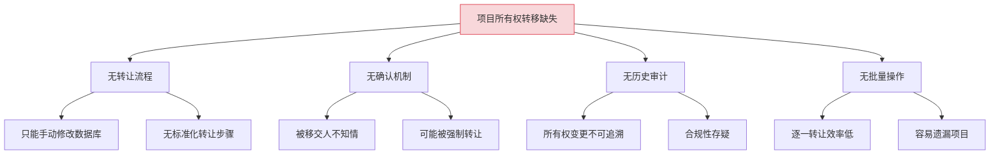
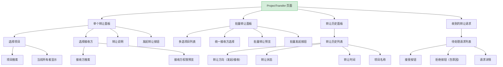
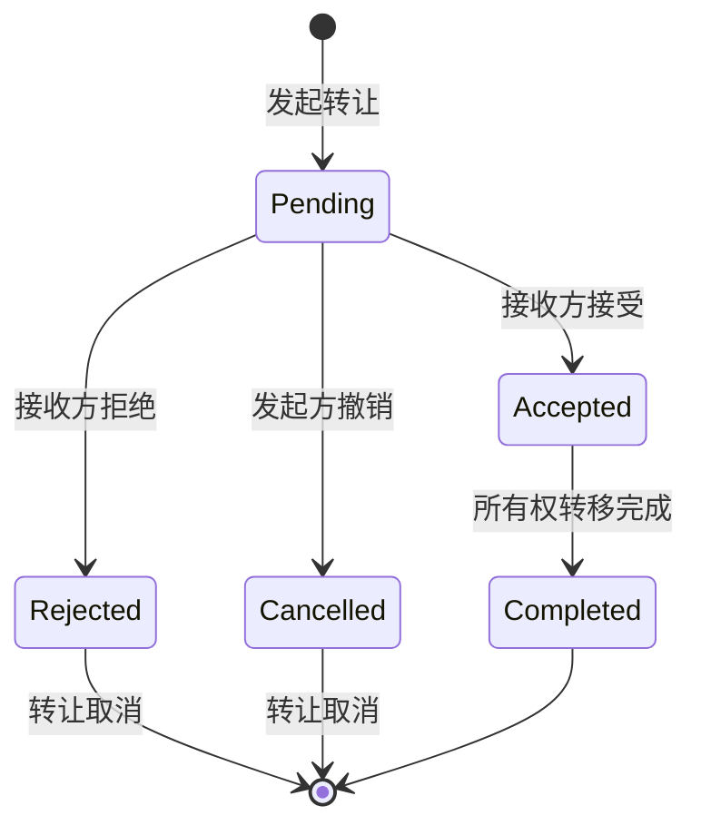

# YV-09-227: 项目移交转让 — 项目所有权转移、转让流程、转让历史与审计日志

> 需求编号：YV-09-227 · 优先级：P2 · 人天：0.3d · 状态：需求已编写
> 依赖：YV-09-220（项目成员邀请）、YV-09-50（活动日志与审计追踪）

## 背景

### 问题陈述

YiVad 中每个项目有一个所有者（Owner），负责项目的最终决策。当项目负责人离职、转岗或组织架构调整时，需要将项目所有权移交给其他成员。当前缺乏正式的移交流程，只能通过管理员手动修改数据库，存在权限失控和数据安全风险。

1. **无正式移交流程**：项目所有权转移无标准化流程，靠管理员手动操作
2. **无接受/拒绝机制**：被移交人无法确认是否接受转让
3. **无转让历史**：无法追溯所有权变更记录
4. **无批量转让**：负责人离职时需逐一移交多个项目
5. **无审计日志**：所有权变更无审计记录，合规性存疑

**核心矛盾**：项目所有权是最重要的权限之一，但当前转移缺乏正式的流程和审计机制。

### 影响范围

| # | 影响 | 严重程度 | 典型场景 |
|---|------|----------|----------|
| 1 | 所有权转移无流程保障 | 高 | 负责人离职后项目无人管理 |
| 2 | 被移交人不知情 | 高 | 突然被赋予项目所有权，不知如何管理 |
| 3 | 转移历史不透明 | 中 | 无法追溯项目所有权变更历史 |
| 4 | 批量移交效率低 | 中 | 负责人管理 10+ 项目，逐一移交耗时长 |
| 5 | 合规审计缺失 | 中 | 无法证明所有权转移经过了正式流程 |

### 挑战

| 挑战 | 说明 |
|------|------|
| 双向确认机制 | 转让需要发起方和接收方双方确认，避免单方面强制转让 |
| 转让期间权限管理 | 转让过程中项目的管理权限如何过渡 |
| 批量转让的一致性 | 批量转让多个项目时，部分成功部分失败的处理 |
| 转让撤销 | 转让发起后但未被接受前，发起方应能撤销 |

---

## 一、现状分析

### 1.1 当前项目所有权管理

```
现有功能:
├── 项目成员邀请（YV-09-220）
│   ├── 邀请成员加入项目
│   └── 设置成员角色
├── 活动日志与审计追踪（YV-09-50）
│   ├── 操作日志记录
│   └── 审计查询

缺失:
├── 项目所有权转让流程            # ❌ 不存在
├── 转让接受/拒绝机制             # ❌ 不存在
├── 转让历史记录                  # ❌ 不存在
├── 批量转让功能                  # ❌ 不存在
├── 转让审计日志                  # ❌ 不存在
├── 转让通知                      # ❌ 不存在
└── 转让撤销                      # ❌ 不存在
```

### 1.2 根因分析矩阵



| 根因 | 症状 | 影响 | 优先级 |
|------|------|------|--------|
| 转让流程缺失 | 手动操作数据库 | 安全风险 | 高 |
| 确认机制缺失 | 强制转让 | 权限失控 | 高 |
| 历史审计缺失 | 不可追溯 | 合规风险 | 中 |
| 批量操作缺失 | 逐一转让 | 效率低下 | 中 |

---

## 二、设计决策

### 决策 1：转让流程的确认机制

| 选项 | 描述 | 优点 | 缺点 |
|------|------|------|------|
| A: 单向转让 | 管理员直接修改所有者 | 简单 | 被移交人不知情 |
| B: 邀请-接受 | 发起转让邀请，接收方接受后生效 | 双向确认 | 流程较长 |
| C: 三级审批 | 发起 → 接收方确认 → 管理员审批 | 最安全 | 流程过长，0.3d 不够 |

**选择：B（邀请-接受）。** 转让发起后，接收方收到通知，可选择接受或拒绝。在接收方接受前，发起方可撤销转让。接收方拒绝时，转让自动取消。这是最符合实际场景的平衡方案。

### 决策 2：转让期间权限过渡

| 选项 | 描述 | 优点 | 缺点 |
|------|------|------|------|
| A: 立即转移 | 转让发起后立即生效 | 无过渡期 | 接收方可能未准备好 |
| B: 接受后转移 | 接收方接受后立即生效 | 接收方确认 | 发起方可能在等待期间无法管理 |
| C: 接受后 + 过渡期 | 接受后有 N 天过渡期，期间双方均为 Owner | 有缓冲 | 双 Owner 可能导致冲突 |

**选择：B（接受后转移）。** 转让发起后，发起方仍为 Owner 可正常管理项目。接收方接受后，所有权立即转移，发起方自动降级为 Admin。这样确保项目始终有明确的管理者。

### 决策 3：批量转让的失败处理

| 选项 | 描述 | 优点 | 缺点 |
|------|------|------|------|
| A: 全部或全不 | 任一失败则全部回滚 | 数据一致 | 一个失败导致全部失败 |
| B: 部分成功 | 成功的继续，失败的跳过 | 部分完成 | 需要用户处理失败项 |
| C: 队列重试 | 失败项自动重试 | 自动处理 | 开发成本高 |

**选择：B（部分成功）。** 批量转让时，每个项目独立处理。成功项完成转让，失败项显示错误原因（如"接收方不是该项目的成员"）。用户可修复后重新发起失败项的转让。

### 决策 4：审计日志的粒度

| 选项 | 描述 | 优点 | 缺点 |
|------|------|------|------|
| A: 仅记录转让完成 | 只记录最终转让结果 | 简单 | 无法追溯流程细节 |
| B: 记录完整流程 | 记录发起、接受、拒绝、撤销等所有步骤 | 完整可追溯 | 存储成本稍高 |
| C: 记录 + 快照 | 记录所有步骤 + 转让前项目状态快照 | 可恢复 | 存储成本高 |

**选择：B（记录完整流程）。** 审计日志记录转让的每个步骤：发起（含发起人、接收人、项目、时间）、接受/拒绝（含时间、原因）、撤销（含时间、原因）。不记录项目状态快照，因为项目数据本身有版本历史。

### 设计决策总览

| 决策 | 选项 A | 选项 B | 选择 | 理由 |
|------|--------|--------|------|------|
| 确认机制 | 单向转让 | 邀请-接受 | **邀请-接受** | 双向确认 |
| 权限过渡 | 立即转移 | 接受后转移 | **接受后转移** | 明确管理权 |
| 批量失败处理 | 全部或全不 | 部分成功 | **部分成功** | 独立处理 |
| 审计粒度 | 仅结果 | 完整流程 | **完整流程** | 可追溯 |

---

## 三、目标架构

### 3.1 项目转让页面布局



### 3.2 转让流程状态机



### 3.3 架构决策权衡

| 维度 | 改造前 | 改造后 | 权衡说明 |
|------|--------|--------|----------|
| 所有权转移 | 手动改数据库 | 邀请-接受流程 | 安全 vs 效率 |
| 批量转让 | 不支持 | 部分成功策略 | 一致性 vs 灵活性 |
| 审计日志 | 无 | 完整流程记录 | 可追溯 vs 存储成本 |
| 通知机制 | 无 | 站内通知 | 及时性 vs 通知负担 |

---

## 四、具体改动

### 4.1 改动总览

| 改动点 | 类型 | 涉及文件 | 预估行数 |
|--------|------|---------|---------|
| 项目转让主页面 | 新增 | `views/project/ProjectTransfer.vue` | 180 行 |
| 单个转让面板组件 | 新增 | `components/project/TransferPanel.vue` | 120 行 |
| 批量转让组件 | 新增 | `components/project/BulkTransfer.vue` | 100 行 |
| 转让历史组件 | 新增 | `components/project/TransferHistory.vue` | 100 行 |
| 转让请求列表组件 | 新增 | `components/project/TransferRequests.vue` | 80 行 |
| 转让进度组件 | 新增 | `components/project/TransferProgress.vue` | 60 行 |
| ProjectTransfer Service | 新增 | `services/projectTransferService.ts` | 60 行 |
| 类型定义 | 新增 | `types/projectTransfer.ts` | 50 行 |
| 路由 + 菜单配置 | 扩展 | `routes.ts`，菜单数据 | 15 行 |

### 4.2 涉及文件

```
src/
├── views/project/
│   └── ProjectTransfer.vue               # 新增：项目转让主页面
├── components/project/
│   ├── TransferPanel.vue                 # 新增：单个转让面板
│   ├── BulkTransfer.vue                  # 新增：批量转让
│   ├── TransferHistory.vue               # 新增：转让历史
│   ├── TransferRequests.vue              # 新增：转让请求列表
│   └── TransferProgress.vue              # 新增：转让进度
├── services/
│   └── projectTransferService.ts         # 新增：转让 API 服务
└── types/
    └── projectTransfer.ts                # 新增：转让类型定义
```

### 4.3 核心类型定义

```typescript
// types/projectTransfer.ts

type TransferStatus = 'pending' | 'accepted' | 'rejected' | 'cancelled' | 'completed' | 'failed';
type TransferDirection = 'outgoing' | 'incoming';

interface TransferRequest {
  id: string;
  project_key: string;
  project_name: string;
  from_user: string;
  from_user_name: string;
  to_user: string;
  to_user_name: string;
  status: TransferStatus;
  reason: string;
  rejection_reason?: string;
  initiated_at: string;
  responded_at?: string;
  completed_at?: string;
  cancelled_at?: string;
  cancelled_by?: string;
}

interface BulkTransferRequest {
  id: string;
  project_keys: string[];
  to_user: string;
  to_user_name: string;
  reason: string;
  status: 'pending' | 'processing' | 'completed' | 'partial_failed' | 'failed';
  items: BulkTransferItem[];
  initiated_at: string;
  completed_at?: string;
}

interface BulkTransferItem {
  project_key: string;
  project_name: string;
  status: TransferStatus;
  error?: string;
  transfer_id?: string;
}

interface TransferAuditLog {
  id: string;
  transfer_id: string;
  action: 'initiated' | 'accepted' | 'rejected' | 'cancelled' | 'completed';
  actor: string;
  actor_name: string;
  timestamp: string;
  details: string;
  previous_owner?: string;
  new_owner?: string;
}

interface TransferPreview {
  project_key: string;
  project_name: string;
  current_owner: string;
  target_user: string;
  target_user_is_member: boolean;
  target_user_role: string;
  warnings: string[];
}
```

### 4.4 关键交互逻辑

```typescript
// 转让前校验
function validateTransfer(
  projectKey: string,
  fromUser: string,
  toUser: string
): { valid: boolean; errors: string[] } {
  const errors: string[] = [];

  if (!projectKey) errors.push('请选择要转让的项目');
  if (!toUser) errors.push('请选择接收方');
  if (fromUser === toUser) errors.push('不能将项目转让给自己');
  if (toUser === projectKey) errors.push('接收方无效');

  return { valid: errors.length === 0, errors };
}

// 批量转让预处理
function prepareBulkTransfer(
  projectKeys: string[],
  toUser: string
): { valid: boolean; previews: TransferPreview[]; errors: string[] } {
  const previews: TransferPreview[] = [];
  const errors: string[] = [];

  for (const key of projectKeys) {
    const preview = getTransferPreview(key, toUser);
    previews.push(preview);
    if (preview.warnings.length > 0) {
      errors.push(`${preview.project_name}: ${preview.warnings.join(', ')}`);
    }
  }

  return { valid: errors.length === 0, previews, errors };
}

// 转让状态流转
const TRANSFER_STATE_TRANSITIONS: Record<TransferStatus, TransferStatus[]> = {
  pending: ['accepted', 'rejected', 'cancelled'],
  accepted: ['completed'],
  rejected: [],
  cancelled: [],
  completed: [],
  failed: [],
};
```

---

## 五、实施步骤

| 步骤 | 内容 | 涉及文件 | 验证方式 | 人天 |
|------|------|---------|---------|------|
| 1 | 类型定义 + Transfer Service | `types/projectTransfer.ts`, `services/projectTransferService.ts` | 类型检查通过 | 0.04 |
| 2 | 单个转让面板组件 | `TransferPanel.vue` | 转让发起流程正常 | 0.05 |
| 3 | 批量转让组件 | `BulkTransfer.vue` | 批量选择和预览正常 | 0.04 |
| 4 | 转让请求列表组件 | `TransferRequests.vue` | 接受/拒绝交互正常 | 0.04 |
| 5 | 转让进度组件 | `TransferProgress.vue` | 批量进度正确 | 0.03 |
| 6 | 转让历史组件 | `TransferHistory.vue` | 历史记录正确展示 | 0.04 |
| 7 | 项目转让主页面 | `ProjectTransfer.vue` | 所有组件集成正常 | 0.05 |
| 8 | 路由 + 菜单配置 | `routes.ts`，菜单 | 页面可访问 | 0.01 |

**总计：0.3d**

---

## 六、测试规格

### 组件测试：TransferPanel

#### Scenario: 正常发起转让
- **GIVEN** 当前用户是项目"A"的 Owner
- **WHEN** 选择项目"A"，选择接收方"李四"，点击"发起转让"
- **THEN** 显示成功提示"转让请求已发送"，接收方"李四"收到通知

#### Scenario: 非 Owner 发起转让被拒绝
- **GIVEN** 当前用户是项目"A"的 Admin（非 Owner）
- **WHEN** 尝试发起转让
- **THEN** 显示错误提示"仅项目所有者可以发起转让"

### 组件测试：TransferRequests

#### Scenario: 接收方接受转让
- **GIVEN** 接收方有一条待处理的转让请求
- **WHEN** 点击"接受"按钮
- **THEN** 项目所有权转移，原 Owner 降级为 Admin，接收方成为 Owner
- **THEN** 转让状态变为"completed"

#### Scenario: 接收方拒绝转让
- **GIVEN** 接收方有一条待处理的转让请求
- **WHEN** 点击"拒绝"，输入拒绝原因"当前工作负载已满"
- **THEN** 转让状态变为"rejected"，发起方收到通知

### 组件测试：BulkTransfer

#### Scenario: 批量转让部分成功
- **GIVEN** 批量转让 3 个项目，其中 1 个项目的接收方不是成员
- **WHEN** 发起批量转让
- **THEN** 2 个项目转让成功，1 个失败并显示错误"接收方不是项目成员"
- **THEN** 批量转让状态为"partial_failed"

### 集成测试：ProjectTransfer

#### Scenario: 完整转让流程
- **GIVEN** 发起方发起转让，接收方接受
- **WHEN** 所有权转移完成
- **THEN** 转让历史显示完整记录
- **THEN** 审计日志记录所有步骤
- **THEN** 项目详情页的 Owner 字段更新

---

## 七、风险与缓解

| 风险 | 概率 | 影响 | 等级 | 缓解措施 | 应急预案 |
|------|------|------|------|----------|----------|
| 接收方拒绝后项目无人管理 | 低 | 高 | 中 | 允许发起方重新选择接收方 | 管理员可强制指定 Owner |
| 批量转让部分失败导致混淆 | 中 | 低 | 低 | 详细展示每个项目的转让结果 | 失败项目可单独重新发起 |
| 转让期间项目权限混乱 | 低 | 中 | 低 | 接受前原 Owner 权限不变 | 管理员可临时冻结项目 |
| 转让通知未送达 | 低 | 中 | 低 | 站内通知 + 邮件通知双重保障 | 接收方在转让页面可见待处理请求 |

---

## 八、回滚策略

| 回滚场景 | 回滚方式 | 影响范围 | 恢复时间 |
|----------|----------|----------|----------|
| 转让功能异常 | `git revert` 相关提交 | 转让页面 | < 1min |
| 误转让项目 | 管理员手动恢复 Owner | 单个项目 | < 2min |
| 转让历史数据异常 | 从备份恢复转让历史 | 转让历史 | < 5min |

**回滚验证：**
- 回滚后项目成员邀请（YV-09-220）不受影响
- 回滚后活动日志（YV-09-50）不受影响
- 回滚后已完成的转让结果保留（由用户决定是否恢复）

---

## 九、设计决策记录

### D-01: 为什么选择邀请-接受而非单向转让？

项目所有权是最高权限，强制转让可能导致接收方被动承担管理责任。邀请-接受机制确保：(1) 接收方知情并同意；(2) 发起方在接收方拒绝时可重新选择；(3) 转让过程可追溯、可审计。这是组织管理的基本要求。

### D-02: 为什么接受后立即转移而非设置过渡期？

过渡期（双 Owner）虽然提供缓冲，但可能导致权限冲突（两个 Owner 同时修改配置）。立即转移 + 原 Owner 降级为 Admin 的方案更清晰：新 Owner 拥有完整权限，原 Owner 保留 Admin 权限可继续参与项目管理。

### D-03: 为什么批量转让选择部分成功而非全部或全不？

全部或全不策略在批量转让中过于严格。例如转让 10 个项目，其中 1 个因接收方不是成员而失败，会导致全部 10 个转让失败。部分成功策略允许用户快速完成大部分转让，失败项单独处理。

### D-04: 为什么审计日志记录完整流程而非仅记录结果？

所有权转移是重要的合规事件。完整的审计日志记录（发起、接受、拒绝、撤销）确保：(1) 可追溯转让决策过程；(2) 可审计是否有违规转让；(3) 满足合规要求（如 SOX、ISO 27001）。

---

## 十、可观测性

### 关键指标

| 指标 | 采集方式 | 告警阈值 | 说明 |
|------|---------|---------|------|
| 转让成功率 | 统计 completed / total | < 80% | 转让流程是否顺畅 |
| 转让拒绝率 | 统计 rejected / total | > 50% | 接收方意愿问题 |
| 转让平均耗时 | accepted_at - initiated_at | > 7d | 转让流程效率 |
| 批量转让失败率 | 统计 failed_items / total_items | > 20% | 批量转让稳定性 |
| 撤销率 | 统计 cancelled / total | > 30% | 发起方后悔率 |

### 日志规范

| 日志级别 | 场景 | 示例 |
|---------|------|------|
| `INFO` | 转让发起 | `[Transfer] Transfer initiated: ${project} → ${to_user}` |
| `INFO` | 转让完成 | `[Transfer] Transfer completed: ${project}, owner ${from} → ${to}` |
| `WARN` | 转让拒绝 | `[Transfer] Transfer rejected: ${project}, reason: ${reason}` |
| `ERROR` | 转让失败 | `[Transfer] Transfer failed: ${project}, error: ${error}` |

---

## 十一、代码审查检查清单

- [ ] TransferPanel 校验非 Owner 不能发起转让
- [ ] TransferRequests 接受/拒绝按钮正确切换状态
- [ ] 批量转让部分失败时的错误展示正确
- [ ] 转让撤销后状态正确变为 cancelled
- [ ] 接收方拒绝时原因必填校验
- [ ] 转让完成后原 Owner 角色正确降级
- [ ] 审计日志记录完整（发起、接受/拒绝、撤销、完成）
- [ ] `vue-tsc --noEmit` 通过
- [ ] 无 ESLint/Prettier 告警

---

## 回归问题预测

| # | 问题 | 发现场景 | 根因 | 修复方式 |
|---|------|---------|------|---------|
| 1 | 转让后原 Owner 权限未正确降级 | 转让完成后原 Owner 仍为 Owner | 角色更新逻辑遗漏 | 转让完成后强制更新原 Owner 角色为 Admin |
| 2 | 接收方在转让期间被移出项目 | 转让 pending 时接收方被项目移除 | 无前置检查 | 转让前检查接收方是否仍是成员，转让期间锁定成员列表 |
| 3 | 同一项目同时发起多个转让 | 两个 Owner 同时发起转让 | 无并发控制 | 项目转让状态检查，pending 时禁止新转让 |
| 4 | 批量转让中接收方被删除 | 批量转让时接收方账号被删除 | 无账号状态检查 | 转让前检查接收方账号状态，异常时提示 |
| 5 | 转让通知未送达导致接收方不知情 | 接收方未登录期间收到转让通知 | 通知依赖在线状态 | 转让请求在"收到的转让请求"面板中持久显示 |
| 6 | 转让后项目权限缓存未更新 | 转让完成后用户权限仍显示旧值 | 权限缓存未刷新 | 转让完成后强制刷新权限缓存 |

---

## 性能分析

### 组件渲染性能

| 指标 | 无转让功能 | 项目转让页面 | 说明 |
|------|----------|------------|------|
| ProjectTransfer 首屏渲染 | — | ~150ms（转让面板 + 请求列表） | 新增页面 |
| TransferPanel 渲染 | — | ~60ms（项目搜索 + 用户搜索） | 转让面板 |
| BulkTransfer 渲染 | — | ~80ms（多选项目列表） | 批量转让 |

### 内存分析

| 数据结构 | 大小 | 说明 |
|---------|------|------|
| 单个转让请求 | ~3KB | 含项目信息和用户信息 |
| 批量转让请求（10 项目） | ~15KB | 含 10 个项目的转让项 |
| 转让历史（100 条） | ~120KB | 分页加载，每页 20 条 |

### 网络请求分析

| 页面 | 首次加载 API 调用数 | 关键路径请求 | 可并行请求 |
|------|-------------------|-------------|-----------|
| ProjectTransfer | 4（getMyProjects + getTransferRequests + getTransferHistory + getUsers） | 无依赖 | 可全部并行 |
| 批量转让 | 2（getBulkTransferPreview + submitBulkTransfer） | 预览依赖项目列表 | 预览 → 提交 |

---

*PRD 来源: `projects/yivad/requirements/2026-09/00-需求-需求总览.md`*

