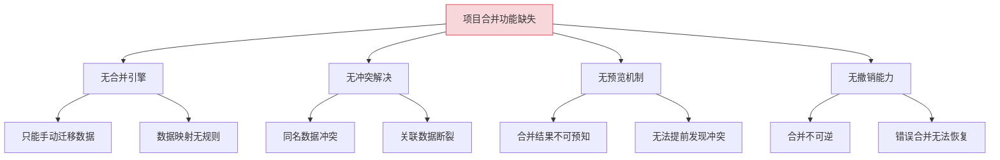
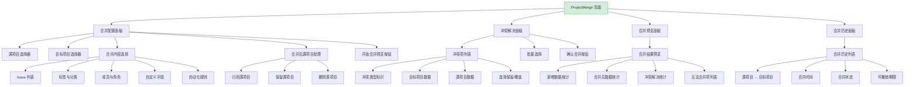
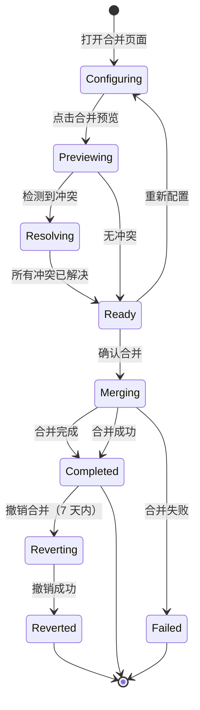

# YV-09-228: 项目合并 — 双项目合并、冲突解决、合并预览与撤销合并

> 需求编号：YV-09-228 · 优先级：P2 · 人天：0.3d · 状态：需求已编写
> 依赖：YV-09-226（项目克隆复制）、YV-09-119（项目对比视图）

## 背景

### 问题陈述

YiVad 管理中，团队有时会因组织调整或项目重组需要将两个项目合并为一个。例如：两个小团队合并后，各自的项目需要合并；或者分拆的项目需要重新合并。当前缺乏项目合并功能，只能通过手动导出/导入数据的方式实现，耗时且易出错。

1. **无项目合并功能**：两个项目合并只能手动操作
2. **数据冲突无处理**：两个项目可能有同名 Issue、标签、成员等冲突
3. **合并无预览**：无法在合并前预览合并结果
4. **合并不可逆**：合并后无法撤销回到合并前状态
5. **数据映射无规则**：合并时数据如何映射（ID 重编、关联更新）无标准化

**核心矛盾**：项目合并是组织调整的常见需求，但当前缺乏安全、可预览、可撤销的合并工具。

### 影响范围

| # | 影响 | 严重程度 | 典型场景 |
|---|------|----------|----------|
| 1 | 手动合并耗时且易出错 | 高 | 合并两个 50+ Issue 的项目需 2 小时以上 |
| 2 | 数据冲突导致数据丢失 | 高 | 同名 Issue 被覆盖，评论丢失 |
| 3 | 合并结果不可预知 | 中 | 合并后才发现数据冲突，但已无法回退 |
| 4 | 关联数据断裂 | 中 | Issue 引用的标签、成员在合并后失效 |
| 5 | 无合并历史记录 | 低 | 无法追溯合并前后的数据变化 |

### 挑战

| 挑战 | 说明 |
|------|------|
| 冲突解决策略 | 同名 Issue、标签、成员等冲突如何解决 |
| 数据关联完整性 | 合并后 Issue 与标签、成员、自定义字段的关联必须保持正确 |
| 合并预览准确性 | 预览结果必须与实际合并结果一致 |
| 撤销合并的复杂性 | 合并涉及大量数据写入，撤销需要完整的数据快照 |

---

## 一、现状分析

### 1.1 当前项目合并能力

```
现有功能:
├── 项目对比视图（YV-09-119）
│   ├── 两个项目对比展示
│   └── 差异高亮
├── 项目克隆复制（YV-09-226）
│   ├── 项目克隆
│   └── 克隆历史

缺失:
├── 项目合并功能                   # ❌ 不存在
├── 冲突检测与解决界面              # ❌ 不存在
├── 合并预览                        # ❌ 不存在
├── 合并撤销                        # ❌ 不存在
├── 数据映射规则                    # ❌ 不存在
├── 合并历史记录                    # ❌ 不存在
└── 合并后数据完整性检查            # ❌ 不存在
```

### 1.2 根因分析矩阵



| 根因 | 症状 | 影响 | 优先级 |
|------|------|------|--------|
| 合并引擎缺失 | 手动迁移数据 | 效率低下 | 高 |
| 冲突解决缺失 | 数据冲突丢失 | 数据安全 | 高 |
| 预览机制缺失 | 结果不可预知 | 决策困难 | 中 |
| 撤销能力缺失 | 不可逆操作 | 风险高 | 高 |

---

## 二、设计决策

### 决策 1：合并策略

| 选项 | 描述 | 优点 | 缺点 |
|------|------|------|------|
| A: 源→目标合并 | 将源项目合并到目标项目 | 目标项目保留 | 源项目数据需要迁移 |
| B: 双向合并 | 两个项目合并为新项目 | 平等 | 复杂度翻倍 |
| C: 选择合并 | 按类型选择合并方向 | 灵活 | 用户困惑 |

**选择：A（源→目标合并）。** 指定一个源项目和一个目标项目，将源项目的数据合并到目标项目中。目标项目保留其原有数据，源项目的数据作为新数据加入。合并后源项目归档（可选）。这是最清晰、最易理解的合并方式。

### 决策 2：冲突解决策略

| 选项 | 描述 | 优点 | 缺点 |
|------|------|------|------|
| A: 目标优先 | 冲突时保留目标项目数据 | 简单 | 可能丢失源项目信息 |
| B: 源优先 | 冲突时用源项目数据覆盖 | 简单 | 可能丢失目标项目信息 |
| C: 手动逐项选择 | 每个冲突项由用户选择保留哪个 | 精确 | 操作繁琐（大量冲突时） |
| D: 自动合并 + 手动确认 | 同名自动合并，冲突手动确认 | 平衡 | 实现稍复杂 |

**选择：D（自动合并 + 手动确认）。** 同名但不冲突的数据（如不同 Issue 键）自动合并。冲突数据（如同名标签、同名 Issue 键）在冲突解决界面中展示，由用户逐项选择保留目标项目数据还是源项目数据。

### 决策 3：合并后数据映射

| 选项 | 描述 | 优点 | 缺点 |
|------|------|------|------|
| A: 保持原 ID | 源项目数据保留原 ID，加前缀 | 可追溯来源 | ID 长度增加 |
| B: 重新编号 | 源项目数据按目标项目规则重新编号 | 统一规范 | 丢失来源信息 |
| C: 混合策略 | Issue 加前缀，标签等合并 | 平衡 | 规则稍复杂 |

**选择：C（混合策略）。** Issue 添加源项目前缀（如 `SRC-001` → `SRC-001`，在目标项目中唯一）。标签、成员、自定义字段同名则合并，不同名则直接添加。自动化规则保留但 Webhook 密钥清空。

### 决策 4：合并撤销机制

| 选项 | 描述 | 优点 | 缺点 |
|------|------|------|------|
| A: 数据快照 | 合并前创建完整数据快照 | 可完整恢复 | 存储成本高 |
| B: 记录差分 | 记录合并操作的差分日志 | 存储成本低 | 恢复复杂 |
| C: 7天内可撤销 | 合并后 7 天内可撤销 | 有时间窗口 | 7 天后无法撤销 |

**选择：C（7 天内可撤销）。** 合并后 7 天内，用户可撤销合并，恢复到合并前状态。撤销操作通过记录合并时的数据差分实现。7 天后差分数据自动清理，不可撤销。

### 设计决策总览

| 决策 | 选项 A | 选项 B | 选择 | 理由 |
|------|--------|--------|------|------|
| 合并策略 | 源→目标 | 双向合并 | **源→目标** | 语义清晰 |
| 冲突解决 | 目标优先 | 源优先 | **自动合并 + 手动** | 精确可控 |
| 数据映射 | 保持原 ID | 重新编号 | **混合策略** | 兼顾追溯与规范 |
| 撤销机制 | 数据快照 | 记录差分 | **7 天内可撤销** | 安全 + 成本平衡 |

---

## 三、目标架构

### 3.1 项目合并页面布局



### 3.2 合并流程状态机



### 3.3 架构决策权衡

| 维度 | 改造前 | 改造后 | 权衡说明 |
|------|--------|--------|----------|
| 项目合并 | 手动迁移 | 引导式合并 | 效率 vs 开发成本 |
| 冲突解决 | 无 | 手动逐项选择 | 精确 vs 操作繁琐 |
| 数据映射 | 手动处理 | 自动映射 + 前缀 | 自动化 vs 灵活性 |
| 撤销能力 | 无 | 7 天内可撤销 | 安全 vs 存储成本 |

---

## 四、具体改动

### 4.1 改动总览

| 改动点 | 类型 | 涉及文件 | 预估行数 |
|--------|------|---------|---------|
| 项目合并主页面 | 新增 | `views/project/ProjectMerge.vue` | 180 行 |
| 合并配置面板组件 | 新增 | `components/project/MergeConfigPanel.vue` | 120 行 |
| 冲突解决组件 | 新增 | `components/project/MergeConflictResolver.vue` | 130 行 |
| 合并预览组件 | 新增 | `components/project/MergePreview.vue` | 100 行 |
| 合并历史组件 | 新增 | `components/project/MergeHistory.vue` | 80 行 |
| 合并进度组件 | 新增 | `components/project/MergeProgress.vue` | 60 行 |
| ProjectMerge Service | 新增 | `services/projectMergeService.ts` | 60 行 |
| 类型定义 | 新增 | `types/projectMerge.ts` | 60 行 |
| 路由 + 菜单配置 | 扩展 | `routes.ts`，菜单数据 | 15 行 |

### 4.2 涉及文件

```
src/
├── views/project/
│   └── ProjectMerge.vue                  # 新增：项目合并主页面
├── components/project/
│   ├── MergeConfigPanel.vue              # 新增：合并配置面板
│   ├── MergeConflictResolver.vue         # 新增：冲突解决
│   ├── MergePreview.vue                  # 新增：合并预览
│   ├── MergeHistory.vue                  # 新增：合并历史
│   └── MergeProgress.vue                 # 新增：合并进度
├── services/
│   └── projectMergeService.ts            # 新增：合并 API 服务
└── types/
    └── projectMerge.ts                   # 新增：合并类型定义
```

### 4.3 核心类型定义

```typescript
// types/projectMerge.ts

type MergeContentType = 'issues' | 'labels' | 'members' | 'custom_fields' | 'automation';
type MergeStatus = 'configuring' | 'previewing' | 'resolving' | 'ready' | 'merging' | 'completed' | 'failed' | 'reverting' | 'reverted';
type SourceProjectAction = 'archive' | 'keep' | 'delete';
type ConflictResolution = 'keep_target' | 'keep_source' | 'keep_both' | 'manual';

interface MergeConfig {
  source_project_key: string;
  target_project_key: string;
  content_types: MergeContentType[];
  conflict_resolution: ConflictResolution;
  source_project_action: SourceProjectAction;
  merge_issues: boolean;
  merge_labels: boolean;
  merge_members: boolean;
  merge_custom_fields: boolean;
  merge_automation: boolean;
}

interface MergeConflict {
  id: string;
  type: MergeContentType;
  source_item: MergeItem;
  target_item: MergeItem;
  conflict_type: 'name_duplicate' | 'key_duplicate' | 'value_mismatch' | ' tag_conflict';
  resolution?: ConflictResolution;
  resolved_by?: string;
  resolved_at?: string;
}

interface MergeItem {
  id: string;
  name: string;
  key?: string;
  summary: string;
  details: Record<string, unknown>;
}

interface MergePreview {
  config: MergeConfig;
  source_project_name: string;
  target_project_name: string;
  stats: {
    new_issues: number;
    new_labels: number;
    new_members: number;
    new_custom_fields: number;
    new_automation_rules: number;
  };
  conflicts: MergeConflict[];
  unmapped_items: MergeItem[];
  estimated_time_seconds: number;
  warnings: string[];
}

interface MergeResult {
  id: string;
  source_project_key: string;
  target_project_key: string;
  status: MergeStatus;
  stats: MergePreview['stats'];
  conflicts_resolved: number;
  conflicts_auto_resolved: number;
  conflicts_manual_resolved: number;
  merged_by: string;
  merged_at: string;
  revertable_until: string;
  reverted: boolean;
  reverted_at?: string;
  reverted_by?: string;
}

interface MergeProgress {
  merge_id: string;
  status: MergeStatus;
  current_step: string;
  total_steps: number;
  completed_steps: number;
  items_processed: number;
  total_items: number;
  step_details: {
    step: string;
    status: 'pending' | 'in_progress' | 'completed' | 'failed';
    items_processed: number;
    total_items: number;
  }[];
}
```

### 4.4 关键交互逻辑

```typescript
// 冲突检测
function detectConflicts(
  sourceItems: MergeItem[],
  targetItems: MergeItem[],
  type: MergeContentType
): MergeConflict[] {
  const conflicts: MergeConflict[] = [];
  const targetMap = new Map(targetItems.map(i => [i.key || i.name, i]));

  for (const sourceItem of sourceItems) {
    const key = sourceItem.key || sourceItem.name;
    const targetItem = targetMap.get(key);

    if (targetItem) {
      conflicts.push({
        id: generateId(),
        type,
        source_item: sourceItem,
        target_item: targetItem,
        conflict_type: sourceItem.key ? 'key_duplicate' : 'name_duplicate',
      });
    }
  }

  return conflicts;
}

// 合并后 Issue 键映射
function mapIssueKey(sourceKey: string, sourceProjectPrefix: string): string {
  // 为源项目 Issue 添加前缀，避免与目标项目冲突
  return `${sourceProjectPrefix}-${sourceKey}`;
}

// 合并验证
function validateMergeConfig(config: MergeConfig): string[] {
  const errors: string[] = [];
  if (!config.source_project_key) errors.push('请选择源项目');
  if (!config.target_project_key) errors.push('请选择目标项目');
  if (config.source_project_key === config.target_project_key) errors.push('源项目和目标项目不能相同');
  if (config.content_types.length === 0) errors.push('请至少选择一项合并内容');
  return errors;
}
```

---

## 五、实施步骤

| 步骤 | 内容 | 涉及文件 | 验证方式 | 人天 |
|------|------|---------|---------|------|
| 1 | 类型定义 + Merge Service | `types/projectMerge.ts`, `services/projectMergeService.ts` | 类型检查通过 | 0.04 |
| 2 | 合并配置面板组件 | `MergeConfigPanel.vue` | 配置选择正常 | 0.05 |
| 3 | 冲突解决组件 | `MergeConflictResolver.vue` | 冲突逐项解决正常 | 0.05 |
| 4 | 合并预览组件 | `MergePreview.vue` | 预览数据正确 | 0.04 |
| 5 | 合并进度组件 | `MergeProgress.vue` | 进度步骤正确 | 0.03 |
| 6 | 合并历史组件 | `MergeHistory.vue` | 历史记录正确展示 | 0.04 |
| 7 | 项目合并主页面 | `ProjectMerge.vue` | 所有组件集成正常 | 0.04 |
| 8 | 路由 + 菜单配置 | `routes.ts`，菜单 | 页面可访问 | 0.01 |

**总计：0.3d**

---

## 六、测试规格

### 组件测试：MergeConfigPanel

#### Scenario: 验证源项目和目标项目不能相同
- **GIVEN** 合并配置面板渲染
- **WHEN** 选择源项目为"A"，目标项目也为"A"
- **THEN** 显示错误提示"源项目和目标项目不能相同"

#### Scenario: 源项目处理选项
- **GIVEN** 选择了源项目和目标项目
- **WHEN** 选择"合并后归档源项目"
- **THEN** 提示"合并完成后源项目将被归档，不再活跃"

### 组件测试：MergeConflictResolver

#### Scenario: 同名标签冲突
- **GIVEN** 源项目和目标项目都有标签"bug"
- **WHEN** 渲染冲突解决面板
- **THEN** 显示冲突项，展示目标标签"bug"和源标签"bug"
- **THEN** 提供"保留目标"、"使用源覆盖"、"保留两者"选项

#### Scenario: 批量选择保留目标
- **GIVEN** 有 5 个冲突项
- **WHEN** 点击"全部保留目标"
- **THEN** 所有冲突项选择"保留目标"

### 组件测试：MergePreview

#### Scenario: 合并预览数据统计
- **GIVEN** 源项目有 20 个 Issue、5 个标签、3 个成员
- **WHEN** 渲染合并预览
- **THEN** 显示"将新增 20 个 Issue、5 个标签、3 个成员"
- **THEN** 显示冲突数量（如有）

### 集成测试：ProjectMerge

#### Scenario: 完整合并流程
- **GIVEN** 配置合并：源项目"前端旧版" → 目标项目"前端新版"
- **WHEN** 点击合并预览，解决 3 个冲突，确认合并
- **THEN** 合并完成，目标项目新增源项目的数据
- **THEN** 源项目按配置归档/保留/删除
- **THEN** 合并历史记录正确

#### Scenario: 撤销合并
- **GIVEN** 合并完成不到 7 天
- **WHEN** 点击"撤销合并"
- **THEN** 目标项目恢复到合并前状态
- **THEN** 源项目恢复到合并前状态
- **THEN** 合并记录标记为"已撤销"

---

## 七、风险与缓解

| 风险 | 概率 | 影响 | 等级 | 缓解措施 | 应急预案 |
|------|------|------|------|----------|----------|
| 大量数据合并超时 | 中 | 中 | 中 | 分批处理，显示进度 | 用户可减少合并内容 |
| 冲突解决错误导致数据丢失 | 低 | 高 | 中 | 合并前预览，7 天内可撤销 | 撤销合并，恢复数据 |
| 合并后关联数据断裂 | 中 | 中 | 中 | 合并后自动检查数据完整性 | 运行数据修复脚本 |
| 合并期间源项目或目标项目被修改 | 低 | 中 | 低 | 合并前锁定两个项目 | 合并时检测数据变更，提示用户 |

---

## 八、回滚策略

| 回滚场景 | 回滚方式 | 影响范围 | 恢复时间 |
|----------|----------|----------|----------|
| 合并功能异常 | `git revert` 相关提交 | 合并页面 | < 1min |
| 合并结果错误 | 撤销合并功能 | 目标项目和源项目 | < 5min |
| 合并历史数据异常 | 从备份恢复 | 合并历史 | < 5min |

**回滚验证：**
- 回滚后项目对比视图（YV-09-119）不受影响
- 回滚后项目克隆（YV-09-226）不受影响
- 回滚后已完成的合并结果保留（由用户决定是否撤销）

---

## 九、设计决策记录

### D-01: 为什么选择源→目标合并而非双向合并？

双向合并（两个项目合并为新项目）在语义上更公平，但引入了额外的复杂度：需要创建新项目、处理三方的数据合并。源→目标合并更符合实际场景（将小项目合并到大项目、将旧项目合并到新项目），语义清晰，实现简单。

### D-02: 为什么 Issue 添加前缀而非重新编号？

重新编号会导致 Issue 引用断裂（如 Issue 描述中的 `#001` 引用）。添加前缀保留了源项目 Issue 的标识，同时避免了与目标项目的冲突。前缀默认为源项目标识的前 4 个字符，用户可自定义。

### D-03: 为什么设置 7 天可撤销期？

7 天是平衡安全性和存储成本的合理时间窗口。合并后 7 天内，团队有足够时间验证合并结果的正确性。7 天后，合并数据已分散到项目的日常操作中，撤销变得复杂且不可靠。

### D-04: 为什么自动化规则的 Webhook 密钥清空而非保留？

与项目克隆（YV-09-226）保持一致的安全策略。合并后的自动化规则需要重新配置 Webhook 密钥，因为源项目的密钥可能已过期或不适用于目标项目。保留规则结构但清空密钥，减少用户重建规则的工作量。

---

## 十、可观测性

### 关键指标

| 指标 | 采集方式 | 告警阈值 | 说明 |
|------|---------|---------|------|
| 合并成功率 | 统计 completed / total | < 90% | 合并稳定性 |
| 冲突率 | 统计 conflicts / total_items | > 30% | 项目命名规范需改进 |
| 合并撤销率 | 统计 reverted / total | > 20% | 合并预览不够准确 |
| 合并平均耗时 | 统计 duration_seconds | > 300s | 大数据量合并性能 |
| 手动解决冲突率 | 统计 manual_resolved / total_conflicts | > 80% | 自动合并规则需优化 |

### 日志规范

| 日志级别 | 场景 | 示例 |
|---------|------|------|
| `INFO` | 合并开始 | `[Merge] Merge started: ${source} → ${target}` |
| `INFO` | 合并完成 | `[Merge] Merge completed: ${id}, ${stats}` |
| `WARN` | 冲突检测 | `[Merge] Conflicts detected: ${count} items` |
| `ERROR` | 合并失败 | `[Merge] Merge failed: ${id}, error: ${error}` |

---

## 十一、代码审查检查清单

- [ ] MergeConfigPanel 验证源项目和目标项目不能相同
- [ ] MergeConflictResolver 正确处理三种冲突类型（名称/键/值）
- [ ] 批量选择"保留目标"/"保留源"功能正确
- [ ] MergePreview 数据统计准确
- [ ] 合并后源项目处理选项（归档/保留/删除）正确执行
- [ ] 撤销合并功能在 7 天窗口内可用，7 天后禁用
- [ ] Issue 键映射正确，无重复
- [ ] `vue-tsc --noEmit` 通过
- [ ] 无 ESLint/Prettier 告警

---

## 回归问题预测

| # | 问题 | 发现场景 | 根因 | 修复方式 |
|---|------|---------|------|---------|
| 1 | 合并后 Issue 引用链接断裂 | Issue 描述中引用 `#001` 但目标项目中 `#001` 已变化 | Issue 引用未更新 | 合并后扫描 Issue 描述中的引用链接并更新 |
| 2 | 合并后成员权限冲突 | 同一用户在源和目标项目中角色不同 | 成员角色合并规则不明确 | 以目标项目角色为准，冲突时提示用户选择 |
| 3 | 撤销合并时源项目已有新数据 | 合并后源项目（保留模式）新增了 Issue | 撤销时源项目数据不完整 | 撤销前检查，提示用户源项目有新增数据 |
| 4 | 合并预览与实际结果不一致 | 预览和合并之间目标项目有新数据 | 时间差导致数据变化 | 预览时记录时间戳，合并时检查差异 |
| 5 | 大量冲突导致手动解决操作繁琐 | 两个项目有 50+ 同名标签 | 冲突解决界面无批量操作 | 提供批量选择功能，支持按类型批量解决 |
| 6 | 合并后自动化规则触发异常 | 合并的自动化规则引用了不存在的标签 | 依赖数据未合并 | 合并前检查自动化规则依赖，提示用户 |

---

## 性能分析

### 组件渲染性能

| 指标 | 无合并功能 | 项目合并页面 | 说明 |
|------|----------|------------|------|
| ProjectMerge 首屏渲染 | — | ~180ms（配置面板 + 历史列表） | 新增页面 |
| MergeConflictResolver 渲染 | — | ~120ms（20 个冲突项） | 冲突列表 |
| MergePreview 渲染 | — | ~80ms（合并统计 + 预览） | 预览面板 |

### 内存分析

| 数据结构 | 大小 | 说明 |
|---------|------|------|
| 合并配置 | ~3KB | 含 5 个内容类型 |
| 合并预览（100 项） | ~50KB | 含冲突检测结果 |
| 合并历史（50 条） | ~80KB | 分页加载，每页 20 条 |

### 网络请求分析

| 页面 | 首次加载 API 调用数 | 关键路径请求 | 可并行请求 |
|------|-------------------|-------------|-----------|
| ProjectMerge | 3（getProjects + getMergeHistory） | 无依赖 | 可全部并行 |
| 合并预览 | 1（getMergePreview） | 依赖合并配置 | 预览请求 |
| 合并执行 | 1（executeMerge） | 依赖预览结果 | 合并请求 |

---

*PRD 来源: `projects/yivad/requirements/2026-09/00-需求-需求总览.md`*

