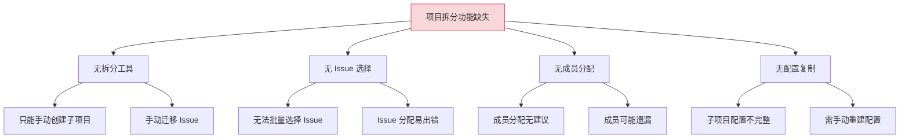
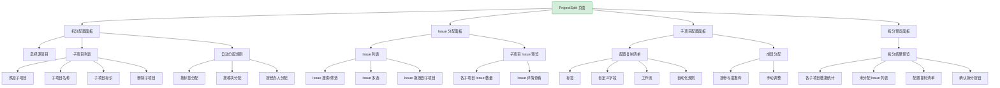
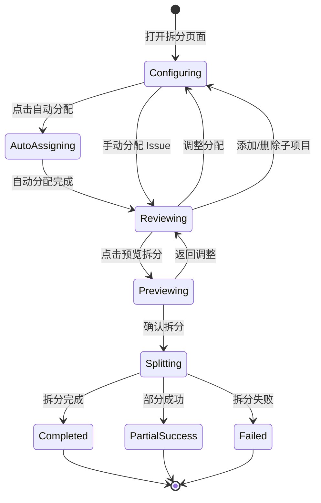

# YV-09-229: 项目拆分 — 单项目拆分为多项目、Issue 选择、成员分配与配置复制

> 需求编号：YV-09-229 · 优先级：P2 · 人天：0.3d · 状态：需求已编写
> 依赖：YV-09-226（项目克隆复制）、YV-09-228（项目合并）

## 背景

### 问题陈述

YiVad 管理中，项目随着规模增长可能需要拆分为多个子项目。例如：一个大型项目包含前端、后端、基础设施等多个模块，团队决定将其拆分为独立的项目以更好地管理。当前缺乏项目拆分功能，只能手动创建新项目后逐项迁移 Issue，效率低下且容易遗漏。

1. **无项目拆分功能**：大型项目拆分靠手动操作
2. **Issue 分配无工具**：无法可视化选择哪些 Issue 迁移到哪个子项目
3. **成员分配无规则**：拆分后成员如何分配到子项目无标准
4. **配置复制不完整**：子项目需要继承源项目的部分配置
5. **拆分预览缺失**：无法在拆分前预览拆分结果

**核心矛盾**：项目拆分是常见的组织管理需求，但当前缺乏工具支持，导致手动拆分耗时且易出错。

### 影响范围

| # | 影响 | 严重程度 | 典型场景 |
|---|------|----------|----------|
| 1 | 手动拆分耗时数小时 | 高 | 100+ Issue 的项目拆分需 3-4 小时 |
| 2 | Issue 分配错误 | 高 | Issue 被分配到错误的子项目 |
| 3 | 成员分配不当 | 中 | 成员被分配到不相关的子项目 |
| 4 | 配置遗漏 | 中 | 子项目缺少必要的自定义字段或标签 |
| 5 | 拆分后无法追溯 | 低 | 无法追溯 Issue 从哪个源项目拆分而来 |

### 挑战

| 挑战 | 说明 |
|------|------|
| Issue 批量选择 | 项目有大量 Issue 时，如何高效地选择分配到各子项目 |
| 成员智能分配 | 根据成员参与 Issue 的情况自动建议成员分配 |
| 配置选择性复制 | 哪些配置需要复制到所有子项目，哪些不需要 |
| 拆分原子性 | 拆分操作是全部成功还是允许部分成功 |

---

## 一、现状分析

### 1.1 当前项目拆分能力

```
现有功能:
├── 项目克隆复制（YV-09-226）
│   ├── 项目克隆
│   └── 克隆选项
├── 项目合并（YV-09-228）
│   ├── 源→目标合并
│   └── 冲突解决

缺失:
├── 项目拆分功能                   # ❌ 不存在
├── Issue 批量选择工具              # ❌ 不存在
├── 子项目配置                       # ❌ 不存在
├── 成员分配建议                     # ❌ 不存在
├── 拆分预览                         # ❌ 不存在
├── 拆分历史                         # ❌ 不存在
└── 拆分后源项目处理                 # ❌ 不存在
```

### 1.2 根因分析矩阵



| 根因 | 症状 | 影响 | 优先级 |
|------|------|------|--------|
| 拆分工具缺失 | 手动创建子项目 | 效率低下 | 高 |
| Issue 选择缺失 | 无法批量分配 | 易出错 | 高 |
| 成员分配缺失 | 成员分配不当 | 管理混乱 | 中 |
| 配置复制缺失 | 子项目配置不全 | 功能缺失 | 中 |

---

## 二、设计决策

### 决策 1：拆分方式

| 选项 | 描述 | 优点 | 缺点 |
|------|------|------|------|
| A: 按标签拆分 | 按 Issue 标签自动分配到子项目 | 自动化 | 依赖标签准确性 |
| B: 按模块拆分 | 预定义模块，将 Issue 分配到模块 | 结构清晰 | 需要预定义模块 |
| C: 手动分配 | 用户手动选择 Issue 分配到各子项目 | 最灵活 | 操作繁琐 |
| D: 混合模式 | 按标签/模块自动分配 + 手动调整 | 兼顾效率与灵活 | 实现稍复杂 |

**选择：D（混合模式）。** 默认按标签自动分配 Issue 到子项目（如标签"前端"的 Issue → 子项目"前端"），用户可手动调整。同时支持按模块（自定义字段"模块"）和手动拖拽分配。这平衡了自动化效率和人工精确性。

### 决策 2：子项目配置来源

| 选项 | 描述 | 优点 | 缺点 |
|------|------|------|------|
| A: 全量复制 | 子项目复制源项目的全部配置 | 配置完整 | 可能包含不需要的配置 |
| B: 空白配置 | 子项目使用默认空白配置 | 干净 | 需手动重建配置 |
| C: 选择性复制 | 用户选择复制哪些配置到子项目 | 灵活 | 配置项较多 |
| D: 智能推荐 | 根据分配给子项目的 Issue 类型推荐配置 | 智能 | 实现复杂 |

**选择：C（选择性复制）。** 提供一个配置复制清单，用户勾选需要复制到子项目的配置项（标签、自定义字段、工作流、自动化规则等）。默认勾选常用配置（标签、自定义字段），用户可取消不需要的项。

### 决策 3：成员分配策略

| 选项 | 描述 | 优点 | 缺点 |
|------|------|------|------|
| A: 不分配 | 子项目不自动分配成员 | 干净 | 需手动邀请 |
| B: 全部复制 | 所有成员复制到所有子项目 | 不遗漏 | 成员冗余 |
| C: 按参与度分配 | 根据成员在 Issue 中的参与度分配 | 精准 | 需要计算参与度 |
| D: 手动分配 | 用户手动为每个子项目分配成员 | 精确 | 操作繁琐 |

**选择：C（按参与度分配）+ D（手动调整）。** 系统根据成员在分配给子项目的 Issue 中的参与度（评论数、指派数）自动推荐成员列表。用户可在此基础上增删成员。默认将参与度 > 0 的成员加入子项目，角色继承源项目角色。

### 决策 4：源项目处理方式

| 选项 | 描述 | 优点 | 缺点 |
|------|------|------|------|
| A: 保留不动 | 拆分后源项目保持不变 | 不丢失数据 | 源项目有冗余数据 |
| B: 归档 | 拆分后源项目归档 | 干净 | 源项目不可用 |
| C: 删除已迁移 Issue | 拆分后源项目删除已迁移的 Issue | 数据不冗余 | 不可逆 |
| D: 标记已迁移 | 拆分后源项目 Issue 标记为"已迁移" | 可追溯 | 需手动清理 |

**选择：D（标记已迁移）。** 拆分后源项目保留所有 Issue，但已迁移的 Issue 标记为"已迁移至 [子项目名称]"。源项目继续可用，用户可后续决定是否归档或删除。这提供了最大的灵活性。

### 设计决策总览

| 决策 | 选项 A | 选项 B | 选择 | 理由 |
|------|--------|--------|------|------|
| 拆分方式 | 按标签 | 按模块 | **混合模式** | 效率 + 灵活 |
| 配置来源 | 全量复制 | 空白配置 | **选择性复制** | 默认常用 + 可选 |
| 成员分配 | 不分配 | 全部复制 | **按参与度 + 手动** | 精准 + 可控 |
| 源项目处理 | 保留 | 归档 | **标记已迁移** | 可追溯 |

---

## 三、目标架构

### 3.1 项目拆分页面布局



### 3.2 拆分流程状态机



### 3.3 架构决策权衡

| 维度 | 改造前 | 改造后 | 权衡说明 |
|------|--------|--------|----------|
| 项目拆分 | 手动创建 + 迁移 | 引导式拆分 | 效率 vs 开发成本 |
| Issue 分配 | 手动逐项 | 自动 + 手动调整 | 自动化 vs 精确性 |
| 成员分配 | 手动邀请 | 按参与度推荐 | 精准 vs 计算成本 |
| 配置复制 | 手动重建 | 选择性复制 | 便捷 vs 配置冗余 |

---

## 四、具体改动

### 4.1 改动总览

| 改动点 | 类型 | 涉及文件 | 预估行数 |
|--------|------|---------|---------|
| 项目拆分主页面 | 新增 | `views/project/ProjectSplit.vue` | 180 行 |
| 拆分配置面板组件 | 新增 | `components/project/SplitConfigPanel.vue` | 120 行 |
| Issue 分配组件 | 新增 | `components/project/IssueAllocator.vue` | 150 行 |
| 子项目配置组件 | 新增 | `components/project/SplitTargetConfig.vue` | 100 行 |
| 拆分预览组件 | 新增 | `components/project/SplitPreview.vue` | 100 行 |
| 拆分进度组件 | 新增 | `components/project/SplitProgress.vue` | 60 行 |
| ProjectSplit Service | 新增 | `services/projectSplitService.ts` | 60 行 |
| 类型定义 | 新增 | `types/projectSplit.ts` | 60 行 |
| 路由 + 菜单配置 | 扩展 | `routes.ts`，菜单数据 | 15 行 |

### 4.2 涉及文件

```
src/
├── views/project/
│   └── ProjectSplit.vue                  # 新增：项目拆分主页面
├── components/project/
│   ├── SplitConfigPanel.vue              # 新增：拆分配置面板
│   ├── IssueAllocator.vue                # 新增：Issue 分配器
│   ├── SplitTargetConfig.vue             # 新增：子项目配置
│   ├── SplitPreview.vue                  # 新增：拆分预览
│   └── SplitProgress.vue                 # 新增：拆分进度
├── services/
│   └── projectSplitService.ts            # 新增：拆分 API 服务
└── types/
    └── projectSplit.ts                   # 新增：拆分类型定义
```

### 4.3 核心类型定义

```typescript
// types/projectSplit.ts

type SplitStatus = 'configuring' | 'reviewing' | 'previewing' | 'splitting' | 'completed' | 'partial_success' | 'failed';
type AssignRule = 'label' | 'module' | 'assignee' | 'manual';
type ConfigCopyItem = 'labels' | 'custom_fields' | 'workflow' | 'automation' | 'webhooks' | 'notifications';

interface SplitConfig {
  source_project_key: string;
  targets: SplitTarget[];
  assign_rules: AssignRule[];
  copy_configs: ConfigCopyItem[];
  source_project_action: 'keep' | 'archive';
  mark_migrated: boolean;
}

interface SplitTarget {
  key: string;
  name: string;
  description: string;
  label_filter: string[];           // 自动分配时匹配的标签
  module_filter: string[];          // 自动分配时匹配的模块
  assignee_filter: string[];        // 自动分配时匹配的经办人
  assigned_issue_ids: string[];     // 手动分配的 Issue ID
  assigned_member_ids: string[];    // 分配的成员 ID
  member_roles: Record<string, string>;  // 成员角色映射
}

interface IssueAllocation {
  issue_id: string;
  issue_key: string;
  issue_title: string;
  target_project_key: string | null;
  allocation_method: AssignRule;
  allocated: boolean;
}

interface SplitPreview {
  config: SplitConfig;
  source_project_name: string;
  targets: SplitTargetPreview[];
  unassigned_issues: IssueAllocation[];
  stats: {
    total_issues: number;
    assigned_issues: number;
    unassigned_issues: number;
    total_targets: number;
  };
  warnings: string[];
}

interface SplitTargetPreview {
  key: string;
  name: string;
  issue_count: number;
  member_count: number;
  configs_copied: ConfigCopyItem[];
  estimated_size: string;
}

interface SplitResult {
  id: string;
  source_project_key: string;
  status: SplitStatus;
  targets: {
    key: string;
    name: string;
    status: 'created' | 'failed';
    error?: string;
    issues_migrated: number;
    members_added: number;
  }[];
  split_by: string;
  split_at: string;
  completed_at?: string;
}

interface SplitProgress {
  split_id: string;
  status: SplitStatus;
  current_target: string;
  targets_processed: number;
  total_targets: number;
  issues_processed: number;
  total_issues: number;
  step_details: {
    target: string;
    step: string;
    status: 'pending' | 'in_progress' | 'completed' | 'failed';
    issues_processed: number;
  }[];
}

interface MemberParticipation {
  user_id: string;
  user_name: string;
  issues_assigned: number;
  issues_commented: number;
  total_participation: number;
  role: string;
}
```

### 4.4 关键交互逻辑

```typescript
// 按标签自动分配 Issue
function autoAssignByLabel(
  issues: Issue[],
  targets: SplitTarget[]
): Map<string, string[]> {
  const assignment = new Map<string, string[]>();

  for (const target of targets) {
    const matchedIssues = issues.filter(issue =>
      issue.labels.some(label => target.label_filter.includes(label))
    );
    assignment.set(target.key, matchedIssues.map(i => i.id));
  }

  return assignment;
}

// 按参与度计算成员推荐
function recommendMembers(
  issues: Issue[],
  members: Member[]
): MemberParticipation[] {
  return members.map(member => {
    const assignedIssues = issues.filter(i => i.assignee_id === member.user_id);
    const commentedIssues = issues.filter(i =>
      i.comments?.some(c => c.author_id === member.user_id)
    );

    return {
      user_id: member.user_id,
      user_name: member.name,
      issues_assigned: assignedIssues.length,
      issues_commented: commentedIssues.length,
      total_participation: assignedIssues.length + commentedIssues.length,
      role: member.role,
    };
  }).sort((a, b) => b.total_participation - a.total_participation);
}

// 拆分前验证
function validateSplitConfig(config: SplitConfig): string[] {
  const errors: string[] = [];
  if (!config.source_project_key) errors.push('请选择源项目');
  if (config.targets.length < 2) errors.push('至少需要 2 个子项目');
  for (const target of config.targets) {
    if (!target.name) errors.push(`子项目 ${target.key} 缺少名称`);
    if (config.targets.filter(t => t.key === target.key).length > 1) {
      errors.push(`子项目标识 ${target.key} 重复`);
    }
  }
  return errors;
}
```

---

## 五、实施步骤

| 步骤 | 内容 | 涉及文件 | 验证方式 | 人天 |
|------|------|---------|---------|------|
| 1 | 类型定义 + Split Service | `types/projectSplit.ts`, `services/projectSplitService.ts` | 类型检查通过 | 0.04 |
| 2 | 拆分配置面板组件 | `SplitConfigPanel.vue` | 子项目增删正常 | 0.05 |
| 3 | Issue 分配组件 | `IssueAllocator.vue` | 自动分配 + 手动拖拽 | 0.06 |
| 4 | 子项目配置组件 | `SplitTargetConfig.vue` | 配置复制 + 成员分配 | 0.05 |
| 5 | 拆分预览组件 | `SplitPreview.vue` | 预览数据正确 | 0.04 |
| 6 | 拆分进度组件 | `SplitProgress.vue` | 进度步骤正确 | 0.03 |
| 7 | 项目拆分主页面 | `ProjectSplit.vue` | 所有组件集成正常 | 0.02 |
| 8 | 路由 + 菜单配置 | `routes.ts`，菜单 | 页面可访问 | 0.01 |

**总计：0.3d**

---

## 六、测试规格

### 组件测试：SplitConfigPanel

#### Scenario: 添加和删除子项目
- **GIVEN** 拆分配置面板渲染
- **WHEN** 点击"添加子项目"，输入名称"前端模块"
- **THEN** 子项目列表新增一项"前端模块"
- **WHEN** 点击删除该子项目
- **THEN** 子项目从列表中移除

#### Scenario: 自动分配规则配置
- **GIVEN** 子项目列表中有 2 个子项目
- **WHEN** 为子项目"A"配置标签过滤"前端"，为子项目"B"配置标签过滤"后端"
- **THEN** 自动分配规则正确保存

### 组件测试：IssueAllocator

#### Scenario: 按标签自动分配
- **GIVEN** 源项目有 10 个 Issue，5 个标签为"前端"，5 个标签为"后端"
- **WHEN** 点击"自动分配"
- **THEN** 5 个"前端" Issue 分配到子项目"A"，5 个"后端" Issue 分配到子项目"B"

#### Scenario: 手动拖拽分配
- **GIVEN** Issue 列表中有未分配的 Issue
- **WHEN** 拖拽 Issue 到子项目"B"
- **THEN** Issue 分配到子项目"B"，子项目 Issue 计数 +1

### 组件测试：SplitTargetConfig

#### Scenario: 成员分配推荐
- **GIVEN** 子项目"A"分配了 5 个 Issue，成员"张三"参与了其中 4 个
- **WHEN** 渲染子项目配置面板
- **THEN** 成员"张三"排在推荐列表第一位，参与度 4

#### Scenario: 配置复制选择
- **GIVEN** 配置复制清单
- **WHEN** 勾选"标签"和"自定义字段"，取消勾选"自动化规则"
- **THEN** 仅标签和自定义字段配置被复制到子项目

### 集成测试：ProjectSplit

#### Scenario: 完整拆分流程
- **GIVEN** 源项目"全栈平台"有 50 个 Issue
- **WHEN** 创建 2 个子项目，自动分配 Issue，预览拆分结果，确认拆分
- **THEN** 2 个子项目创建成功，Issue 正确分配
- **THEN** 源项目 Issue 标记为"已迁移至 [子项目]"
- **THEN** 成员按参与度正确分配到子项目

---

## 七、风险与缓解

| 风险 | 概率 | 影响 | 等级 | 缓解措施 | 应急预案 |
|------|------|------|------|----------|----------|
| 自动分配不准确 | 中 | 中 | 中 | 支持手动调整，拆分前预览 | 用户手动修正分配 |
| 部分子项目创建失败 | 低 | 中 | 低 | 部分成功策略，失败项独立处理 | 失败子项目重新创建 |
| 成员参与度计算不准确 | 低 | 低 | 低 | 展示计算依据，支持手动调整 | 用户手动调整成员列表 |
| 拆分后源项目 Issue 混乱 | 中 | 低 | 低 | 标记已迁移，不删除数据 | 用户可手动清理源项目 |

---

## 八、回滚策略

| 回滚场景 | 回滚方式 | 影响范围 | 恢复时间 |
|----------|----------|----------|----------|
| 拆分功能异常 | `git revert` 相关提交 | 拆分页面 | < 1min |
| 拆分结果错误 | 删除子项目 + 清除源项目标记 | 子项目和源项目 | < 5min |
| 拆分历史数据异常 | 从备份恢复 | 拆分历史 | < 5min |

**回滚验证：**
- 回滚后项目克隆（YV-09-226）不受影响
- 回滚后项目合并（YV-09-228）不受影响
- 回滚后已创建的子项目保留（由用户决定是否删除）

---

## 九、设计决策记录

### D-01: 为什么选择混合模式（自动 + 手动）而非纯手动？

纯手动分配在 Issue 数量多时（50+）操作极繁琐。混合模式先按标签/模块自动分配，用户只需调整少数分配错误的 Issue，大幅减少操作步骤。自动分配规则可配置，用户可关闭自动分配使用纯手动模式。

### D-02: 为什么选择标记已迁移而非删除源项目 Issue？

删除源项目 Issue 是不可逆操作，存在数据丢失风险。标记已迁移保留了完整的审计追踪，用户可追溯每个 Issue 的迁移历史。源项目保留所有 Issue 也有助于后续的报表统计和历史查询。

### D-03: 为什么成员按参与度分配而非全部复制？

全部复制会导致成员被分配到不相关的子项目，造成权限混乱。按参与度分配确保只有真正参与子项目 Issue 的成员被加入，减少了权限管理的复杂度。参与度为 0 的成员不会被自动加入，但用户可手动添加。

### D-04: 为什么配置复制默认勾选标签和自定义字段？

标签和自定义字段是 Issue 管理的基础配置，几乎每个子项目都需要。工作流和自动化规则可能因项目不同而差异较大，默认不勾选以保持子项目的独立性。用户可根据实际需要调整勾选。

---

## 十、可观测性

### 关键指标

| 指标 | 采集方式 | 告警阈值 | 说明 |
|------|---------|---------|------|
| 拆分成功率 | 统计 completed / total | < 90% | 拆分功能稳定性 |
| 自动分配准确率 | 统计 auto_assigned / manually_changed | < 70% | 自动分配规则需优化 |
| 未分配 Issue 率 | 统计 unassigned / total | > 20% | 分配规则需改进 |
| 拆分平均耗时 | 统计 duration_seconds | > 180s | 大量数据拆分性能 |
| 成员推荐准确率 | 统计 recommended_accepted / total | < 60% | 参与度算法需优化 |

### 日志规范

| 日志级别 | 场景 | 示例 |
|---------|------|------|
| `INFO` | 拆分开始 | `[Split] Split started: ${source} → ${targets}` |
| `INFO` | 拆分完成 | `[Split] Split completed: ${id}, ${targets} created` |
| `WARN` | 部分成功 | `[Split] Split partial: ${success}/${total} targets` |
| `ERROR` | 拆分失败 | `[Split] Split failed: ${id}, error: ${error}` |

---

## 十一、代码审查检查清单

- [ ] SplitConfigPanel 至少需要 2 个子项目的校验
- [ ] IssueAllocator 自动分配逻辑正确（标签/模块/经办人）
- [ ] 手动拖拽分配功能正常
- [ ] SplitTargetConfig 成员推荐按参与度排序
- [ ] 配置复制清单的默认勾选正确
- [ ] SplitPreview 数据统计准确
- [ ] 部分成功时错误信息展示正确
- [ ] `vue-tsc --noEmit` 通过
- [ ] 无 ESLint/Prettier 告警

---

## 回归问题预测

| # | 问题 | 发现场景 | 根因 | 修复方式 |
|---|------|---------|------|---------|
| 1 | 自动分配后 Issue 出现在多个子项目中 | 一个 Issue 同时匹配多个子项目的标签 | 标签匹配规则重叠 | 按优先级分配，第一个匹配的子项目获得 Issue |
| 2 | 拆分后 Issue 引用链接断裂 | Issue 描述中引用其他 Issue 的链接 | 引用链接未更新 | 拆分后更新 Issue 引用，指向新子项目 |
| 3 | 成员参与度计算错误 | 成员在 Issue 中有多次评论但只计算一次 | 评论计数逻辑错误 | 修复评论计数，按评论次数而非存在性计算 |
| 4 | 子项目标识与已有项目冲突 | 子项目标识与已有项目相同 | 未做标识冲突检查 | 拆分前检查子项目标识是否已存在 |
| 5 | 配置复制不完整 | 标签复制了但标签颜色未复制 | 配置复制遗漏字段 | 完善配置复制清单，确保所有相关字段被复制 |
| 6 | 拆分后源项目 Issue 标记混乱 | 部分 Issue 被标记但实际未迁移 | 标记与实际迁移不同步 | 仅在实际迁移完成后标记，使用事务确保一致性 |

---

## 性能分析

### 组件渲染性能

| 指标 | 无拆分功能 | 项目拆分页面 | 说明 |
|------|----------|------------|------|
| ProjectSplit 首屏渲染 | — | ~200ms（配置面板 + Issue 列表） | 新增页面 |
| IssueAllocator 渲染 | — | ~150ms（50 个 Issue 列表） | Issue 分配器 |
| SplitPreview 渲染 | — | ~80ms（拆分统计） | 预览面板 |

### 内存分析

| 数据结构 | 大小 | 说明 |
|---------|------|------|
| 拆分配置（3 个子项目） | ~5KB | 含分配规则和成员 |
| Issue 分配数据（100 条） | ~40KB | 含 Issue 基本信息 |
| 拆分预览 | ~20KB | 含子项目统计 |

### 网络请求分析

| 页面 | 首次加载 API 调用数 | 关键路径请求 | 可并行请求 |
|------|-------------------|-------------|-----------|
| ProjectSplit | 3（getProject + getIssues + getMembers） | 无依赖 | 可全部并行 |
| 自动分配 | 1（autoAssignIssues） | 依赖配置 | 分配请求 |
| 拆分执行 | 1（executeSplit） | 依赖预览结果 | 拆分请求 |

---

*PRD 来源: `projects/yivad/requirements/2026-09/00-需求-需求总览.md`*

