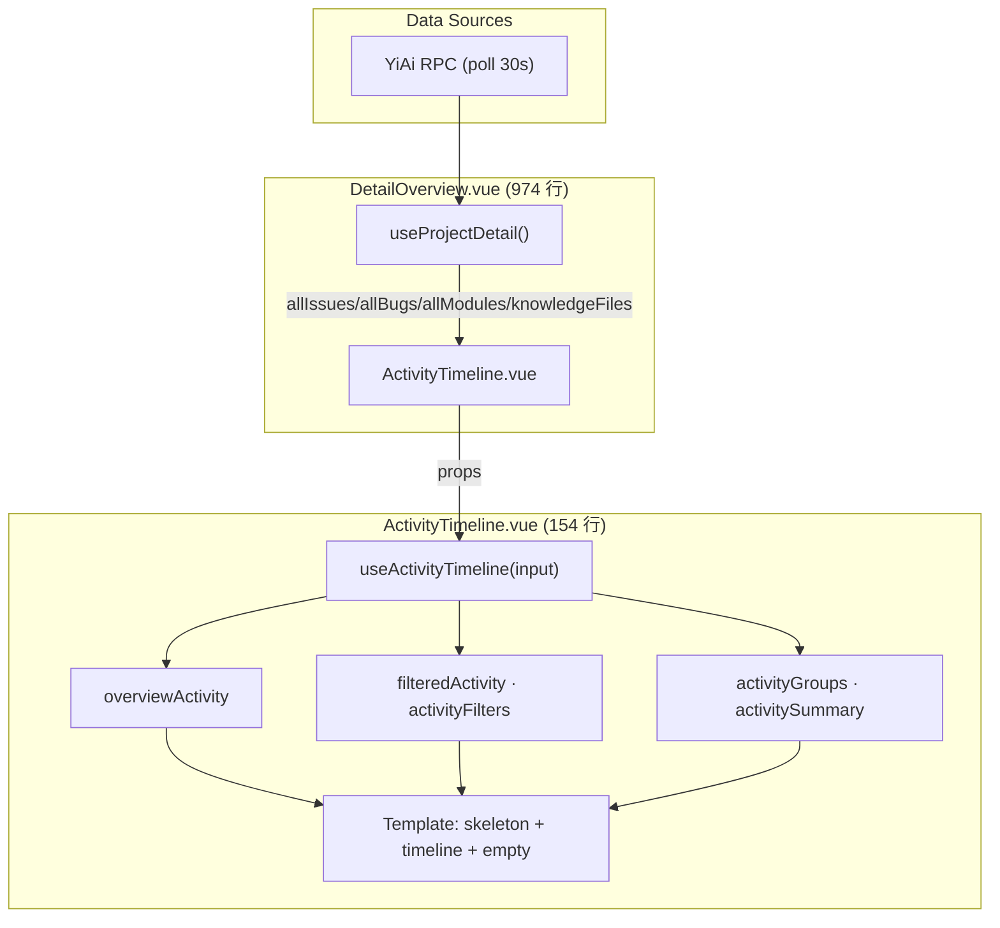
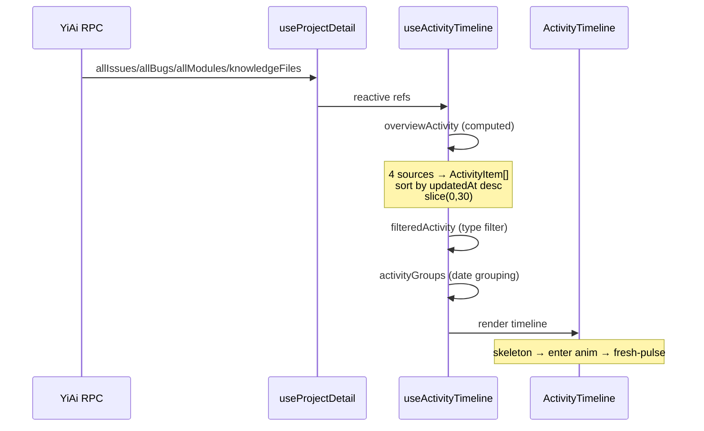

# YV-09-99: 项目详情页 Recent Activity 模块渲染优化

> 项目详情页 Overview Tab 中 Recent Activity 模块存在样式缺失、加载体验差、视觉区分度低等问题。
> 本需求对活动时间轴进行专业化渲染改造。

## 背景

当前 Recent Activity 模块存在以下问题：

| # | 问题 | 影响 |
|---|------|------|
| 1 | `.do-timeline-preview` 类无对应 CSS 规则 | 内容预览裸渲染，无样式、无截断 |
| 2 | 无 activity 专属加载骨架屏 | 数据刷新时显示空白 `el-empty`，体验割裂 |
| 3 | 类型筛选切换无动画 | 内容瞬间替换，视觉跳跃 |
| 4 | 4 种活动类型仅靠小圆点颜色区分 | 扫读困难，无法快速定位 |
| 5 | 时间戳仅有相对时间 | 无法获知精确时间 |
| 6 | 内容预览不可展开 | 长描述被截断后无法查看完整内容 |

## 验收标准

### AC-1: 内容预览样式修复
- **Given** activity 列表中有 doc 类型条目且 `contentPreview` 非空
- **When** 渲染到 `.do-timeline-preview` 元素
- **Then** 显示 2 行 clamp + 左边框 + 浅背景 + hover 高亮
- **And** 点击可展开/收起完整内容

### AC-2: 加载骨架屏
- **Given** 项目详情页数据加载中（`loading && !filteredActivity.length`）
- **When** Recent Activity 区域渲染
- **Then** 显示 5 行交错动画的微光骨架条（圆点 + 2 行文字模拟）
- **And** 加载完成后平滑切换为真实时间轴

### AC-3: 类型视觉区分
- **Given** 时间轴展示 4 种活动类型（requirement/bug/module/doc）
- **When** 渲染每个时间轴条目
- **Then** 显示类型专属图标（Document/Warning/Grid/Notebook）
- **And** 圆点带有类型专属彩色光晕（`box-shadow`）
- **And** 条目带有 `do-timeline-item--{type}` CSS 类名

### AC-4: 时间戳 Tooltip
- **Given** 时间轴条目显示相对时间（"5m ago"）
- **When** 鼠标悬停在时间文本上 > 600ms
- **Then** 弹出 `el-tooltip` 显示绝对时间（`formatAbsolute` 格式）

### AC-5: 筛选过渡动画
- **Given** 用户在类型筛选标签之间切换
- **When** `activityTypeFilter` 值改变
- **Then** 时间轴容器以 `timeline-enter` 动画重新进入（opacity + translateY, 0.25s ease-out）
- **And** 筛选后无结果时不显示空状态动画

### AC-6: 上下文空状态
- **Given** 当前筛选器下无 activity 数据
- **When** 非加载状态
- **Then** 显示带类型名称的空状态文案（如 "暂无 缺陷 相关动态"）

### AC-7: Hover 交互增强
- **Given** 鼠标悬停在时间轴条目上
- **When** hover 状态触发
- **Then** 条目左侧 padding 增加 4px 微动效
- **And** 内容区出现浅色背景 + 圆角

### AC-8: 骨架屏匹配时间轴布局
- **Given** 数据加载中
- **When** Recent Activity 区域渲染
- **Then** 骨架屏显示 2 组日期标签 + 3+2 条微光条目
- **And** 布局结构与真实时间轴（日期分组 + 条目）一致

### AC-9: 新条目视觉提示
- **Given** 时间轴中存在 5 分钟内更新的条目
- **When** 渲染该条目
- **Then** 圆点显示 `fresh-pulse` 呼吸动画（2s ease-in-out 循环）

### AC-10: 日期分组增强
- **Given** 时间轴按日期分组（Today / Yesterday / 具体日期）
- **When** 渲染分组标题
- **Then** 具体日期显示 `YYYY-MM-DD · DayOfWeek` 格式
- **And** 标题右侧显示条目计数徽章

### AC-11: 条目错峰入场动画
- **Given** 时间轴首次渲染或筛选切换
- **When** 条目挂载到 DOM
- **Then** 每条目以 `item-enter` 动画入场（opacity 0→1 + translateX -8px→0）
- **And** 动画延迟随条目索引递增（`i * 0.04s`），形成错峰效果

### AC-12: 键盘无障碍访问
- **Given** 用户使用 Tab 键导航
- **When** 时间轴条目获得焦点
- **Then** 显示 `focus-visible` 环（2px primary 色 box-shadow）
- **And** 按 Enter 键触发与点击相同的行为（打开文件预览）

### AC-13: 响应式布局
- **Given** 视口宽度 ≤ 1100px
- **When** 渲染 Activity + Todo 双列布局
- **Then** 布局切换为垂直堆叠（`flex-direction: column`）
- **And** 统计条 6 列 → 3 列（≤ 1200px）→ 2 列（≤ 768px）
- **And** OKR 网格 4 列 → 2 列（≤ 1000px）

## 架构

```
DetailOverview.vue (1090 行)
  ├── useProjectDetail()          — 数据注入（allIssues/allBugs/allModules/knowledgeFiles）
  ├── useActivityTimeline(input)  — 活动数据 composable（375 行）
  │     ├── overviewActivity      — 4 数据源 → ActivityItem[]（切片 30）
  │     ├── filteredActivity      — 类型筛选
  │     ├── activityGroups        — 日期分组（Today/Yesterday/YYYY-MM-DD · DoW）
  │     └── 辅助函数               — activityTypeIcon/isActivityFresh/togglePreview/...
  ├── useYiKnowledgeModules()     — 开发任务派生
  ├── useTestSpecs()              — 测试规格派生
  └── 模板                         — 骨架屏 + 时间轴 + Todo List

数据流:
  YiAi RPC → allIssues/allBugs/allModules/knowledgeFiles (轮询 30s)
    → useActivityTimeline → overviewActivity computed
      → filteredActivity (按类型)
        → activityGroups (按日期)
          → DOM 渲染（错峰入场 + fresh-pulse + focus-visible）
```

## 技术方案概要

| 层 | 文件 | 变更 |
|----|------|------|
| Composable | `useActivityTimeline.ts`（**新增**） | 375 行 — 4 数据源 activity 构建、筛选、分组、辅助函数全部内聚 |
| 模板 | `DetailOverview.vue` | 骨架屏含分组标签、`el-tooltip`、`el-icon`、`:key` 动画、可展开预览、a11y 属性 |
| 脚本 | `DetailOverview.vue` | ~350 行 activity 代码替换为 `useActivityTimeline` 调用（-25% 体积） |
| 样式 | `DetailOverview.scss` | 骨架屏分组、3 关键帧、圆点光晕、预览展开、focus-visible、响应式断点 |

## 设计决策

- **CSS 截断 > JS 截断**：`cleanPreview` 不再 `.slice(0, 120)`，改用 `-webkit-line-clamp: 2`。点击展开时移除 clamp，显示完整描述。
- **骨架屏 > 全局 loading**：activity 专属骨架屏匹配时间轴布局，比页面级骨架更精确。
- **`:key` 动画 > TransitionGroup**：时间轴有嵌套分组结构（日期组），用 `:key` 整体重新挂载比逐项 TransitionGroup 更简单可靠。
- **Composable 提取 > 内联**：`useActivityTimeline` 将 4 数据源构建逻辑内聚在 377 行 composable 中，`ActivityTimeline.vue` 自含调用。
- **UTC 日期比较**："Today"/"Yesterday" 检测使用 `toISOString().slice(0,10)` 直接比较 UTC 日期字符串，避免 `setHours(0,0,0,0)` 在非 UTC 时区下的偏差。

## 组件架构



## 数据流



## 风险与缓解

| 风险 | 影响 | 缓解 |
|------|------|------|
| 4 数据源任一为空 | 部分 activity 类型缺失 | 各数据源独立 `.slice()` 容错，不会整体崩溃 |
| 知识文件无 frontmatter | `contentPreview` 为空、badge 显示原始类型名 | `docTypeLabel`/`docTypeColor` 有 fallback |
| 轮询刷新时数据变化 | 时间轴瞬间重构 | 已有数据时骨架屏不显示（`!filteredActivity.length` 条件） |
| 超长描述文本 | 时间轴膨胀 | `-webkit-line-clamp: 2` 限制 + 点击展开 |
| 非 UTC 时区 | "Today" 检测偏差 | 使用 `toISOString().slice(0,10)` UTC 直接比较 |

## 专业化增强（2026-09-23）

在基础渲染优化的基础上，进一步提升为专业级活动仪表盘。新增以下能力：

### AC-14: 28 天活动热力图
- **Given** Overview 页加载完成
- **When** Recent Activity 模块渲染
- **Then** 筛选器下方显示 28 格热力图（4 周 × 7 天）
- **And** 每格颜色深度表示当日活动量（5 级：灰→浅绿→深绿）
- **And** 今日格带蓝色边框高亮
- **And** hover 显示 `{日期}: {数量} 项更新` tooltip
- **And** 右侧显示 Less/More 图例

### AC-15: 周期指标栏
- **Given** 活动时间轴有数据
- **When** Recent Activity 模块渲染
- **Then** 热力图下方显示 5 个指标卡片：总更新数、参与人数、活跃天数、连续活跃天数、最忙日
- **And** 卡片等宽均分，带浅色边框分隔

### AC-16: 按人员分组视图
- **Given** 多人在近期有活动
- **When** 用户切换分组模式为"按人员"
- **Then** 时间轴切换为人员分组视图
- **And** 每组显示人员头像（首字母）、姓名、条目数、最后活跃时间
- **And** 组内条目按时间倒序排列
- **And** 每条显示类型圆点 + badge + 动作 + 目标 + 相对时间

### AC-17: 活跃成员芯片
- **Given** 多人在近期有活动
- **When** 类型统计条下方渲染
- **Then** 显示最多 6 个活跃成员芯片（头像首字母 + 姓名 + 贡献数）
- **And** 超过 6 人时末尾显示 "+N" 标记
- **And** 点击芯片切换到人员分组视图

### AC-18: 分页加载
- **Given** 筛选后活动条目 > 15 条
- **When** 时间轴渲染
- **Then** 仅显示前 15 条
- **And** 底部显示 "加载剩余 N 项" 按钮
- **And** 点击按钮展开下 15 条
- **And** 筛选器切换时重置为前 15 条

### AC-19: 文档内容预览增强
- **Given** 活动条目为文档类型
- **When** 构建 contentPreview
- **Then** 开发方案提取 `technical_notes`/`scope` 字段
- **And** 测试规格提取 `test_cases[].description`/`test_scope`
- **And** OKR 提取 `objective` 字段
- **And** 通用兜底 `summary` 字段

### AC-20: 文档元数据增强
- **Given** 活动条目为文档类型
- **When** 渲染副标题信息
- **Then** 开发方案显示 `priority`（P0/P1/P2/P3）
- **And** 测试规格显示 `test_cases` 数量
- **And** OKR 显示 `krCount`

### AC-21: 日期格式专业化
- **Given** 活动条目按日期分组
- **When** 渲染分组标题
- **Then** 本周内格式：`Thu · Sep 21`
- **And** 更早格式：`Sep 18 · Thu`
- **And** Today/Yesterday 保持原有行为

## 更新后架构

```
ActivityTimeline.vue (245 行)
  ├── Header              — 标题 + 分组切换 + 刷新
  ├── Filters             — 类型筛选按钮（All/Req/Bug/Mod/Doc）
  ├── Heatmap             — 28 天活动热力图（5 级颜色 + legend）
  ├── Metrics Bar         — 5 指标卡片（总更新/人数/活跃天/连续/最忙日）
  ├── Type Stats Strip    — 可点击类型分布条
  ├── Contributor Chips   — 活跃成员芯片（头字母 + 姓名 + 贡献数）
  ├── Timeline (by time)  — 时间分组时间轴 + 骨架屏 + 空状态
  ├── Timeline (by ppl)   — 人员分组时间轴
  └── Load More           — 分页加载按钮
```

## 新增风险与缓解

| 风险 | 影响 | 缓解 |
|------|------|------|
| 贡献者同名 | 人员分组合并错误 | 目前按 assignee 字段精确匹配，同名视为同一人 |
| 热力图 0 活动日过多 | 视觉单调 | level=0 用浅灰填充，与背景有区分 |
| 人员分组条目过多 | 页面过长 | 单个 contributor 组内限制 20 条，配合 load-more |
| 28 天窗口无数据 | 热力图全灰 | legend 仍显示，给用户明确的时间范围参考 |