# YiVad 九月迭代 — Project 页面功能模块重构

> 菜单路径：`YiVad → 项目` · 涉及仓库：`YiVad` · 模块：`src/views/project/`
> 总人天：**9.0d** · 负责人：陈铭 · 无后端改动

```mermaid
graph LR
  subgraph Input["现状问题"]
    I1["detail.vue<br/>1450 行 God Component"]
    I2["useProjectInsights<br/>380 行 God Composable"]
    I3["Docs Tab 占位<br/>UI 仅占位文本"]
    I4["样式泄漏 + 重复代码<br/>+ 全局 spinner"]
  end

  subgraph Action["重构动作 (9 项需求)"]
    A1["Composable 分层<br/>data/filter/risk/stats"]
    A2["Tab 组件拆分<br/>4 个独立 SFC"]
    A3["Docs Tab 实现<br/>文档列表 + 预览"]
    A4["国际化 + 体验优化<br/>~136 Key + 快捷键 + 持久化"]
    A5["样式效果改造<br/>视觉升级 + 微交互 + 响应式"]
  end

  subgraph Output["目标产出"]
    O1["detail.vue ≤ 200 行"]
    O2["4 个独立可测 Tab 组件"]
    O3["useProjectInsights ≤ 100 行"]
    O4["零功能回归 100%"]
    O5["视觉统一 + 响应式适配"]
  end

  Input --> Action --> Output

  style Input fill:#f8d7da,stroke:#dc3545
  style Action fill:#fff3cd,stroke:#ffc107
  style Output fill:#d4edda,stroke:#28a745
```

---

## 0. 页面功能概述

> Project 页面是 YiVad 项目管理的核心入口，由**列表页**（`/project`）和**详情页**（`/project/:key`）两个视图组成，承载跨项目总览和单项目深度管理两大职责。

### 0.1 列表页 (`/project`) — 项目仪表盘

项目列表页是一个数据驱动的仪表盘，提供跨所有项目的全景视图和快速操作入口。

#### 页面结构（自上而下）

```
┌─ PageHeaderCard ─────────────────────────────────────────────────┐
│  icon + 标题 + 描述 + KPI pills + 日期导航                          │
├─ ProjectStatTiles ───────────────────────────────────────────────┤
│  [Issues 总数] [Open 数] [完成率%] [Bugs 总数] [At Risk 数]         │
├─ ProjectAnalytics (可折叠) ───────────────────────────────────────┤
│  Issue 状态饼图 | 优先级饼图 | 类型饼图 | Top 项目柱状图 | 活动趋势折线图  │
├─ ProjectAttention ───────────────────────────────────────────────┤
│  风险标签条: Overdue/N / Stale/N / Unassigned/N / ...              │
├─ ProjectFilterPills ─────────────────────────────────────────────┤
│  [Status:active ×] [Risk:overdue ×] ...  Undo | Clear all         │
├─ Toolbar ────────────────────────────────────────────────────────┤
│  🔍搜索 | 排序(updated/name/issues/done/risk) | 状态筛选 | ★Starred │
│  ↻刷新 | ↓导出CSV | +新建项目 | ▦Grid/☰List 视图切换               │
├─ Project Cards (Grid) / Project Rows (List) ─────────────────────┤
│  ┌──────────┐ ┌──────────┐ ┌──────────┐                          │
│  │ 项目卡片1  │ │ 项目卡片2  │ │ 项目卡片3  │  ...                    │
│  └──────────┘ └──────────┘ └──────────┘                          │
└─ Batch Bar (选中时浮动) ──────────────────────────────────────────┘
  [已选 N 项] [Archive] [Restore] [Clear]
```

#### 功能清单

| 功能 | 组件/实现 | 说明 |
|------|----------|------|
| **页面头部** | `PageHeaderCard` | 标题、描述、KPI 概要（项目数/Issue 总数/Open 数/完成率）、日期导航（前后翻日/回到今天/清除） |
| **统计卡片** | `ProjectStatTiles` | 5 个 KPI 卡片：Issues 总数、Open 数、完成率%、Bugs 总数、At Risk 数。点击 Issues/Open/Bugs 跳转对应列表页，点击 At Risk 触发风险过滤 |
| **数据分析** | `ProjectAnalytics` | 可折叠区域，含 5 个 ECharts 图表：Issue 状态饼图、Open 优先级饼图、Issue 类型饼图、Top 8 项目柱状图、30 天活动趋势折线图。点击图表分段可触发对应维度过滤 |
| **风险关注** | `ProjectAttention` | 5 类风险标签（Overdue/Stale/Unassigned/No members/No description），每类显示受影响项目数，点击触发风险过滤 |
| **过滤标签** | `ProjectFilterPills` | 当前生效的过滤条件标签，支持逐条移除、Undo 上一步、Clear all 清除全部。最多保留 20 步历史 |
| **搜索** | `el-input` | 按项目名称/标识符/描述/成员用户名模糊搜索，Ctrl+K 快捷键聚焦 |
| **排序** | `el-select` + 方向按钮 | 5 种排序：最近更新/名称/Issue 数/完成率/风险数，支持升序/降序切换 |
| **状态筛选** | `el-select` | 全部/Active/Archived，与过滤标签联动 |
| **Starred 筛选** | `el-button` | 仅显示收藏的项目，状态持久化到 localStorage |
| **刷新** | `el-button` | 重新加载项目/Issue/Bug 数据，显示最后更新时间 |
| **CSV 导出** | `el-button` | 导出当前视图（含过滤）的项目数据为 CSV，带 BOM 头兼容 Excel |
| **新建项目** | `el-dialog` | 表单：名称（必填，≤80 字符）、标识符（必填，大写开头，≤12 字符）、描述（Markdown）、状态（Active/Archived） |
| **编辑项目** | `el-dialog`（复用） | 同上表单，预填现有数据 |
| **视图切换** | `el-radio-group` | Grid 卡片视图 / List 列表视图，偏好持久化到 localStorage |
| **项目卡片** | `ProjectCard` | 封面图/首字母、健康状态色条、名称、标识符、Star、描述(Markdown 渲染)、Issue 进度条、风险标签、快速跳转（Issues/Members/Bugs）。hover 显示复选框 |
| **项目行** | `ProjectRow` | 列表视图下的紧凑行布局，相同数据字段 |
| **批量操作** | 浮动 Batch Bar | 选中项目后底部浮现，支持批量 Archive/Restore。选中项随视图过滤自动清理 |
| **空状态** | `el-empty` | 两级空状态：无项目（引导创建第一个项目）/ 无匹配结果（清除过滤按钮） |
| **骨架屏** | CSS 动画 | 首次加载时 6 个骨架卡片，脉冲动画 1.5s |
| **键盘快捷键** | `onKeydown` | Ctrl+K 聚焦搜索框 |
| **状态持久化** | localStorage | 视图模式、排序方式、Starred 筛选、Analytics 展开状态 |

#### 数据流

```
useProjectData().load()
  → getProjectList({pageSize:500}) → projects[]
  → getIssueList({pageSize:2000})  → issues[]
  → getBugList({pageSize:2000})    → bugs[]
    ↓
useProjectStats(projects, issues, bugs, filterDateStr)
  → statsByKey: Map<key, ProjectStats>  (按项目聚合)
  → rollup() → 全量/视图级汇总
  → activitySeries() → 30 天活动趋势
  → topProjects() → Top 8 项目排行
    ↓
useProjectRisk(projects, issues, statsByKey)
  → risksByKey: Map<key, RiskKey[]>  (5 类风险检测)
  → healthFor() → good/warn/poor 三级健康度
  → riskCounts → 各风险类型计数
  → flaggedCount → 有风险的项目总数
    ↓
useProjectFilter()
  → activeFilter: FilterState  (多维度交叉过滤)
  → matchesFilter(project, stats, risks, health) → boolean
  → activeFilterPills → 过滤标签列表
  → undoLastFilter() → 撤销上一步过滤
```

### 0.2 详情页 (`/project/:key`) — 单项目深度视图

项目详情页是单个项目的管理中心，通过 7 个 Tab 组织不同维度信息。

#### 页面结构

```
┌─ Header ──────────────────────────────────────────────────────────┐
│  ← Projects 返回 | 项目名称 | HeroDateNav 日期导航                    │
├─ Tabs ────────────────────────────────────────────────────────────┤
│  [Overview] [Issues(6)] [Modules(6)] [Docs(N)] [Bugs(6)] [Members(N)] │
├─ Tab Content (lazy loaded) ───────────────────────────────────────┤
│  当前激活的 Tab 组件内容                                              │
└─ KnowledgePreviewDialog (全局复用) ────────────────────────────────┘
```

#### Tab 功能清单

| Tab | 组件 | 加载方式 | 功能说明 |
|-----|------|----------|----------|
| **Overview** | `DetailOverview` | 独立加载（skeleton + 缓存） | README.md 预览（可编辑）、侧边栏统计卡片、模块列表、活动动态、交付流水线。支持日期过滤 |
| **Issues** | `IssueList`（复用） | 懒加载（首次访问触发） | 该项目的 Issue 列表，支持日期过滤 |
| **Modules** | `ModuleList`（复用） | 懒加载 | 该项目的模块列表 |
| **Docs** | `DetailDocs` | 依赖 `knowledgeFiles` prop | 项目知识库文档列表（表格视图），支持搜索/标签过滤/排序，点击预览 Markdown 内容 |
| **Bugs** | `BugList`（复用） | 懒加载 | 该项目的 Bug 列表 |
| **Members** | `DetailMembers` | 即时渲染 | 成员列表（头像+用户名+角色标签），支持添加/删除成员 |

#### 关键特性

| 特性 | 实现 | 说明 |
|------|------|------|
| **Tab 懒加载** | `visitedTabs` Set | 仅首次访问 Tab 时挂载组件，后续切换保持实例 |
| **URL Tab 同步** | `route.query.tab` | 访问 `/project/{key}?tab=members` 自动切换到 Members Tab |
| **Tab 独立加载** | 各组件自管理 loading/error | Overview 使用独立 skeleton + 缓存，不复用全局 spinner |
| **日期过滤** | `HeroDateNav` + `useDateFilter` | 详情页支持日期导航，Overview 和 Issues Tab 响应日期变化 |
| **知识文件预览** | `KnowledgePreviewDialog` | 全局复用的 Markdown 预览弹窗，Overview/Docs 共用 |
| **键盘快捷键** | `useKeyboardShortcuts` | Backspace 返回列表，1-6 切换 Tab |
| **404 处理** | `el-result` | 项目不存在时显示错误状态和返回按钮 |

#### Overview Tab 详细功能

| 区域 | 功能 |
|------|------|
| **README.md 预览** | 读取项目 README.md 文件，Markdown 渲染预览。支持编辑（弹出编辑器） |
| **统计侧边栏** | Issue 总数/进行中/逾期、模块数、需求数、Bug 数、文档数 |
| **模块列表** | 项目模块卡片列表，含进度条、状态标签、关联 Issue 预览 |
| **活动动态** | 最近活动时间线，含操作类型图标、目标链接、相对时间 |
| **交付流水线** | 5 阶段可视化（Requirements → Active Cycles → In Progress → Pending Releases → Released），每阶段可点击跳转 |

#### 数据加载

```
detail.vue onMounted
  → store.fetchProject(key)     → project (reactive)
  → listKnowledgeFiles("projects") → knowledgeFiles
  → getIssueList({project_key, pageSize:500}) → allIssues
    ↓
DetailOverview onMounted
  → loadData() → readProjectFile + 内部聚合
  → dataLoaded = true → 缓存生效
  → watch(filterDateStr) → 清除缓存重新加载
```

### 0.3 技术架构

#### 组件树

```
index.vue (列表页, 908 行)
├── PageHeaderCard          — 页面头部
├── ProjectStatTiles        — KPI 统计卡片
├── ProjectAnalytics        — 数据分析图表
├── ProjectAttention        — 风险关注条
├── ProjectFilterPills      — 过滤标签
├── ProjectCard (×N)        — 项目卡片 (Grid 视图)
├── ProjectRow (×N)         — 项目行 (List 视图)
└── el-dialog               — 新建/编辑项目弹窗

detail.vue (详情页, 178 行)
├── HeroDateNav             — 日期导航
├── el-tabs (7 tabs)
│   ├── DetailOverview      — Overview Tab
│   ├── IssueList           — Issues Tab (复用)
│   ├── ModuleList          — Modules Tab (复用)
│   ├── DetailDocs          — Docs Tab
│   ├── BugList             — Bugs Tab (复用)
│   └── DetailMembers       — Members Tab
└── KnowledgePreviewDialog  — 文档预览弹窗 (全局复用)
```

#### Composable 分层

```
useProjectInsights (组合入口, 70 行)
├── useProjectData    — 数据加载 (projects/issues/bugs)
├── useProjectStats   — 统计聚合 (statsByKey/rollup/activitySeries)
├── useProjectRisk    — 风险检测 (risksByKey/healthFor/riskCounts)
└── useProjectFilter  — 过滤管理 (activeFilter/matchesFilter/undoLastFilter)
```

依赖方向（严格单向）：`data → stats → risk`，`filter` 独立。

#### 外部依赖

| 依赖 | 用途 |
|------|------|
| `useProjectStore` (Pinia) | 项目 CRUD 操作、当前项目状态 |
| `usePageStore` (Pinia) | 页面级别状态管理 |
| `useDateFilter` (hook) | 日期导航（前后翻日/今天/清除） |
| `useMarkdown` (hook) | Markdown 渲染 |
| `useKeyboardShortcuts` (hook) | 键盘快捷键注册 |
| `listKnowledgeFiles` (API) | 知识库文件树 |
| `getIssueList` (API) | Issue 全量列表 |
| `getBugList` (API) | Bug 全量列表 |
| `getProjectList` (API) | 项目全量列表 |
| `readProjectFile` (API) | 读取项目文件内容 |

### 0.4 状态管理

| 状态 | 存储位置 | 生命周期 | 说明 |
|------|----------|----------|------|
| 项目列表 | `useProjectData.projects` | 页面级（刷新重载） | 全量项目数据 |
| Issue/Bug 列表 | `useProjectData.issues/bugs` | 页面级 | 全量数据，用于聚合统计 |
| 当前项目 | `useProjectStore.currentProject` | Store 级（持久化） | 详情页项目数据 |
| 过滤状态 | `useProjectFilter.activeFilter` | 页面级 | 多维度交叉过滤 |
| 过滤历史 | `useProjectFilter.filterHistory` | 页面级 | 最多 20 步，支持 Undo |
| 视图模式 | localStorage | 跨会话 | grid/list |
| 排序方式 | localStorage | 跨会话 | updated/name/issues/done/risk |
| Starred 项目 | localStorage | 跨会话 | 收藏的项目 key 集合 |
| Analytics 展开 | localStorage | 跨会话 | 图表区展开/折叠 |
| Tab 访问记录 | `visitedTabs` (ref) | 页面级 | 控制 Tab 懒加载 |
| Overview 缓存 | `dataLoaded` (ref) | 页面级（日期变化清除） | 避免重复加载 |

---

### 1.1 背景

Project 页面是 YiVad 项目管理的核心入口，承载跨项目视图（列表页）和单项目详情（详情页）。八月迭代完成 Issue/Cycle/Release/Module/Bug 实体接入后，Project 页面逐步演变为聚合中枢。

当前代码功能可用，但工程层面存在显著可维护性瓶颈：

| 问题 | 位置 | 严重程度 | 影响 |
|------|------|----------|------|
| God Component | `detail.vue` 1450 行 | **高** | 7 个 Tab 的逻辑和模板共处一个 SFC，修改任一 Tab 需在 1450 行中定位 |
| God Composable | `useProjectInsights.ts` 380 行 | **高** | 5 类职责、28 个导出项，`matchesFilter` 内部隐式依赖 stats/risk 层 |
| Tab 未组件化 | Overview(32%) + Requirements(20%) + Members(12%) | **高** | 三个 Tab 的完整实现内联在 detail.vue 中，无法独立测试 |
| Docs Tab 占位 | `detail.vue` | 中 | 数据加载逻辑已完成，但 UI 仅渲染占位文本 |
| 重复代码 | `roleTagType` 函数 | 中 | `detail.vue` 和 `index.vue` 各自定义相同实现 |
| 类型内联 | `RequireItem` 等接口 | 中 | 定义在 detail.vue 而非 `types.ts` |
| 样式泄漏 | 非 scoped markdown 样式 70 行 | 低 | 影响全局样式作用域 |
| 全局 spinner | `v-loading` 指令 | 中 | 任一 Tab 数据加载失败导致整个页面无响应 |

### 1.2 目标

| 目标 | 衡量指标 | 当前值 | 目标值 |
|------|----------|--------|--------|
| 降低单文件复杂度 | `detail.vue` 行数 | 1450 | ≤ 200 |
| 提升组件复用性 | 独立可测试的 Tab 组件 | 0 | 4 |
| Composable 单一职责 | `useProjectInsights` 行数 | 380 | ≤ 100 |
| 完善 Docs 功能 | Docs Tab 功能完整度 | 占位 | 完整文档列表+预览 |
| 零功能回归 | 手动回归用例通过率 | — | 100% |

### 1.3 系统范围

- **涉及**：YiVad 前端 `src/views/project/` 目录
- **不涉及**：YiAi 后端、Pinia store 结构、路由配置

---

## 2. 当前架构 vs 目标架构

### 2.1 当前架构（重构前）

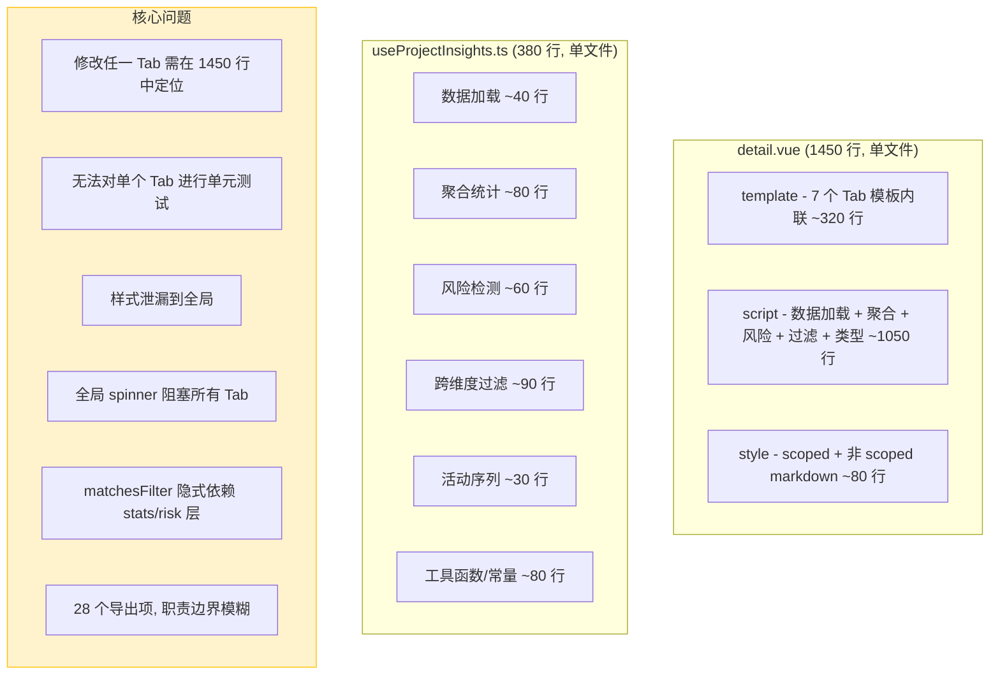

### 2.2 目标架构（重构后）

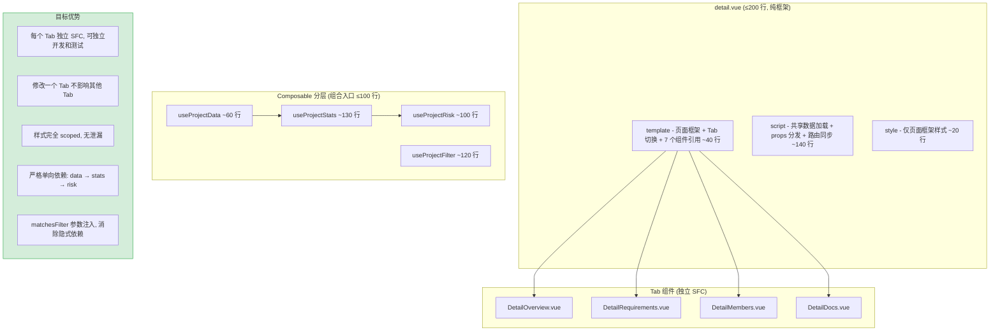

### 2.3 架构决策权衡

| 维度 | 重构前 | 重构后 | 权衡说明 |
|------|--------|--------|----------|
| 文件数量 | 1 个巨型文件 | 4 composable + 4 组件 + 1 框架 | 文件数增加，但每个文件职责单一 |
| 组件通信 | 无（全部内联） | props/emits 单向数据流 | 增加显式接口定义，但数据流可追踪 |
| 测试覆盖 | 无法独立测试 | 3/4 composable 纯函数可测 | 测试成本降低，但需额外编写测试 |
| 构建产物体积 | 单 chunk | 多 chunk（可 tree-shaking） | 首次加载略增，但按需加载更优 |
| 新人上手 | 需理解 1450 行 | 从 200 行框架入口开始 | 学习曲线显著降低 |

---

## 3. 接口协议

> 本次重构**不新增接口**，所有接口均为已有。

### 3.1 API 协议

| 接口 | 方法 | 说明 | 调用方 |
|------|------|------|--------|
| `getProjectList()` | RPC `data_service.query_documents` | 项目全量列表 | `useProjectData` → `index.vue` |
| `getIssueList()` | RPC `data_service.query_documents` | Issue 全量列表 | `useProjectData` → `index.vue` |
| `getBugList()` | RPC `data_service.query_documents` | Bug 全量列表 | `useProjectData` → `index.vue` |
| `listKnowledgeFiles("projects")` | RPC `knowledge.list_files` | 项目知识库文件树 | `detail.vue` → `DetailDocs`, `DetailRequirements` |
| `readProjectFile(key, path)` | `POST /read-file` | 读取单个项目文件内容 | `DetailDocs` (CLAUDE.md 预览) |

### 3.2 组件通信协议

所有共享数据由 `detail.vue` 通过 props 单向传递，子组件通过 emits 向上通知。**不引入 `provide/inject`**。

```mermaid
graph TD
  Detail["detail.vue (数据宿主)"]

  subgraph Shared["共享数据 (props 下发)"]
    P[project: Project]
    KF[knowledgeFiles: KnowledgeFileEntry[]]
    FD[filterDate / filterDateStr]
    PR[previewDlgRef]
  end

  subgraph Consumers["消费组件"]
    OV[DetailOverview]
    RQ[DetailRequirements]
    MB[DetailMembers]
    DC[DetailDocs]
  end

  Detail -->|props| Shared
  Shared --> OV
  Shared --> RQ
  Shared --> MB
  Shared --> DC

  OV -->|emits: preview| Detail
  RQ -->|emits: preview| Detail
  DC -->|emits: preview| Detail

  style Detail fill:#e8f4fd,stroke:#0d6efd
  style Shared fill:#f8f9fa,stroke:#6c757d
```

| 共享数据 | 类型 | 来源 | 消费方 |
|----------|------|------|--------|
| `project` | `Project` | `useProjectStore.currentProject` | Overview, Requirements, Members, Docs |
| `knowledgeFiles` | `KnowledgeFileEntry[]` | `listKnowledgeFiles` API | Overview, Requirements, Docs |
| `filterDate` / `filterDateStr` | `Date \| null` / `string` | `useDateFilter` | Overview, Requirements |
| `previewDlgRef` | `Ref<KnowledgePreviewDialog>` | detail.vue 模板引用 | Overview, Requirements, Docs |

### 3.3 数据流时序

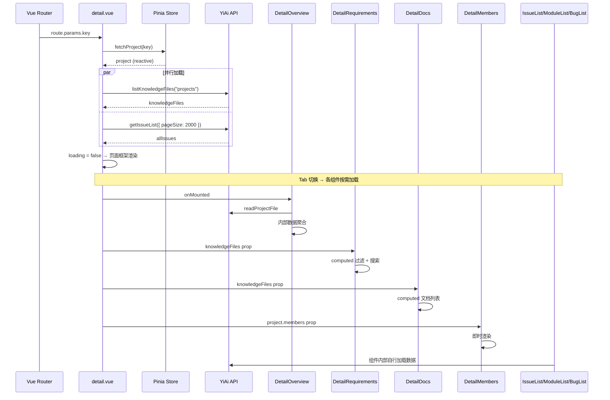

---

## 4. 功能清单

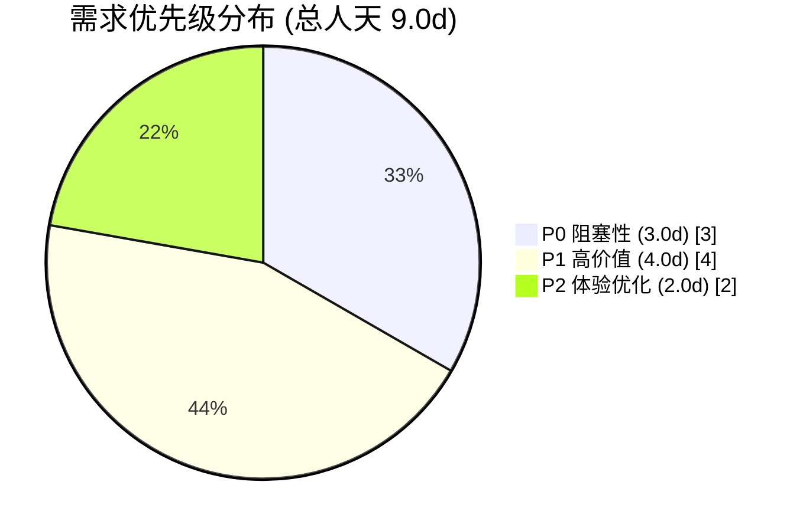

| 需求编号 | 功能模块 | 说明 | 优先级 | 人天 | 状态 | 详细文档 |
|----------|----------|------|--------|------|------|----------|
| YV-09-01-1 | Detail Tab 组件拆分 | Overview/Requirements/Members/Docs 提取为独立 SFC | **P0** | 2.0 | **已完成** | [02-架构重构-组件拆分](./02-架构重构-组件拆分.md) |
| YV-09-01-2 | useProjectInsights 分层 | 拆分为 data/filter/risk/stats 四个独立 composable | **P0** | 1.0 | **已完成** | [01-架构重构-composable分层](./01-架构重构-composable分层.md) |
| YV-09-01-3 | Docs Tab 功能实现 | 文档列表 UI + 预览交互 | **P1** | 1.0 | **已完成** | [03-功能实现-文档标签页](./03-功能实现-文档标签页.md) |
| YV-09-01-4 | Tab 独立加载状态 | 各 Tab 自管理 loading/error，替代全局 spinner | P2 | 0.5 | **已完成** | [05-体验优化-综合](./05-体验优化-综合.md) |
| YV-09-01-5 | 代码质量收尾 | 类型提取 + 重复函数消除 + 样式组件化 | P2 | 0.5 | **进行中** | [06-代码质量收尾](./06-代码质量收尾.md) |
| YV-09-01-6 | Project 页面国际化 | ~136 个文案中英双语 | **P1** | 1.0 | **已完成** | [04-功能实现-国际化](./04-功能实现-国际化.md) |
| YV-09-01-7 | 过滤状态持久化 | URL query + localStorage 双通道持久化 | P2 | 0.5 | **进行中** | [05-体验优化-综合](./05-体验优化-综合.md) |
| YV-09-01-8 | 键盘快捷键与可访问性 | 17 个快捷键 + ARIA 增强 | P2 | 0.5 | **已完成** | [05-体验优化-综合](./05-体验优化-综合.md) |
| YV-09-01-9 | 样式效果改造与内容优化 | 卡片视觉升级 + 微交互 + 响应式 + 空状态 + 模块/活动视觉重构 | **P1** | 2.0 | **进行中** | [07-样式效果改造-功能内容优化](./07-样式效果改造-功能内容优化.md) |

> **优先级**：P0 = 阻塞性，必须首先完成；P1 = 高价值功能；P2 = 体验优化，最后收尾。

---

## 5. 涉及文件

```
src/
├── languages/modules/
│   ├── index.ts                              # 修改：+2 行 import + 注册
│   └── project/
│       ├── en.ts                             # 新增：~136 个 Key
│       └── zh.ts                             # 新增：~136 个 Key
├── hooks/
│   └── useKeyboardShortcuts.ts              # 新增
├── utils/
│   └── role.ts                              # 新增
└── views/project/
    ├── index.vue                             # 修改：适配导入路径 + 持久化 + 快捷键
    ├── detail.vue                            # 重构：1450 → ≤200 行
    ├── types.ts                              # 扩展：19 → 120 行
    ├── constants.ts                          # 新增：状态色板常量
    ├── charts.ts                             # 不变
    ├── styles/
    │   └── markdown-preview.scss            # 新增：公共 markdown 样式
    ├── composables/
    │   ├── useProjectInsights.ts             # 重写：380 → ≤100 行
    │   ├── useProjectData.ts                 # 新增：~60 行
    │   ├── useProjectFilter.ts               # 新增：~120 行
    │   ├── useProjectRisk.ts                 # 新增：~100 行
    │   └── useProjectStats.ts                # 新增：~130 行
    └── components/
        ├── ProjectCard.vue                   # 不变（仅 i18n 替换）
        ├── ProjectRow.vue                    # 不变
        ├── ProjectStatTiles.vue              # 不变
        ├── ProjectAnalytics.vue              # 不变（仅 i18n 替换）
        ├── ProjectAttention.vue              # 不变（仅 i18n 替换）
        ├── ProjectFilterPills.vue            # 不变（仅 i18n 替换）
        ├── DetailOverview.vue                # 新增：≤400 行
        ├── DetailRequirements.vue            # 新增：≤250 行
        ├── DetailMembers.vue                 # 新增：≤200 行
        └── DetailDocs.vue                    # 新增：≤150 行
```

---

## 6. 目标架构

### 6.1 Composable 分层

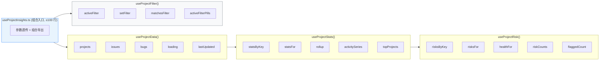

依赖方向（严格单向）：`data → stats → risk`，`filter` 独立。

### 6.2 组件树

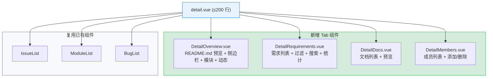

---

## 7. 开发排期

### 7.1 任务依赖

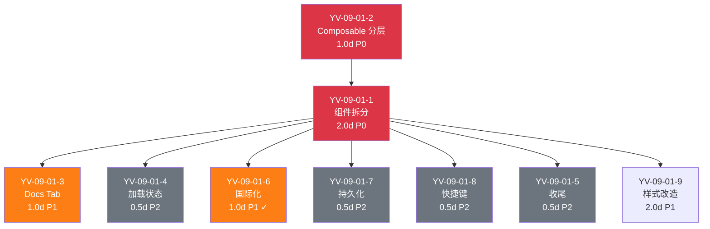

### 7.2 甘特图

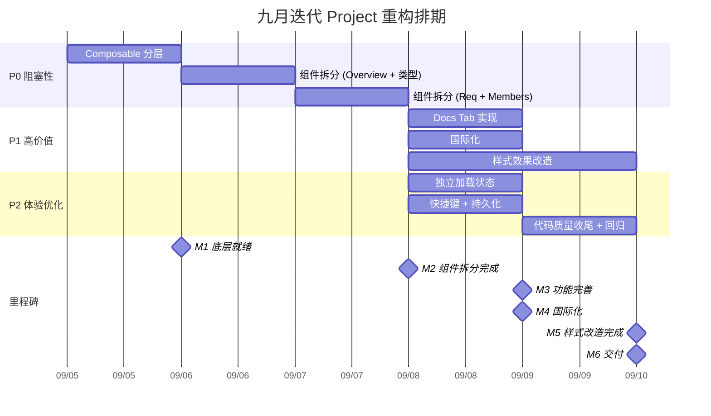

### 7.3 里程碑

| 里程碑 | 完成标准 | 预计日期 |
|--------|----------|----------|
| M1: 底层就绪 | useProjectInsights 分层完成 + 类型提取完成，列表页功能正常 | Day 1.5 |
| M2: 组件拆分完成 | 4 个 Tab 组件全部提取，detail.vue ≤ 200 行 | Day 3 |
| M3: 功能完善 | Docs Tab 功能实现 + Tab 独立加载状态 | Day 4 |
| M4: 国际化 | ~136 个文案键中英双语覆盖，语言切换正常 | Day 5 |
| M5: 样式改造完成 | 卡片视觉升级 + 微交互 + 响应式 + 空状态全部完成 | Day 7 |
| M6: 体验优化 | 快捷键 + 状态持久化 + 代码质量收尾 | Day 9 |
| M7: 交付 | 完整回归验证通过 | Day 9 |

---

## 8. 迁移策略

### 8.1 原则

- **渐进式拆分**：每次只动一个模块，立即验证，通过后再进行下一步
- **分支隔离**：在 `claude/project-page-refactor` 分支开发，合并前通过完整手动回归
- **可回滚**：每一步的改动都是独立 commit，`git revert` 即可回滚
- **零停机**：重构期间不阻塞其他开发者的工作，分支独立开发

### 8.2 分步执行

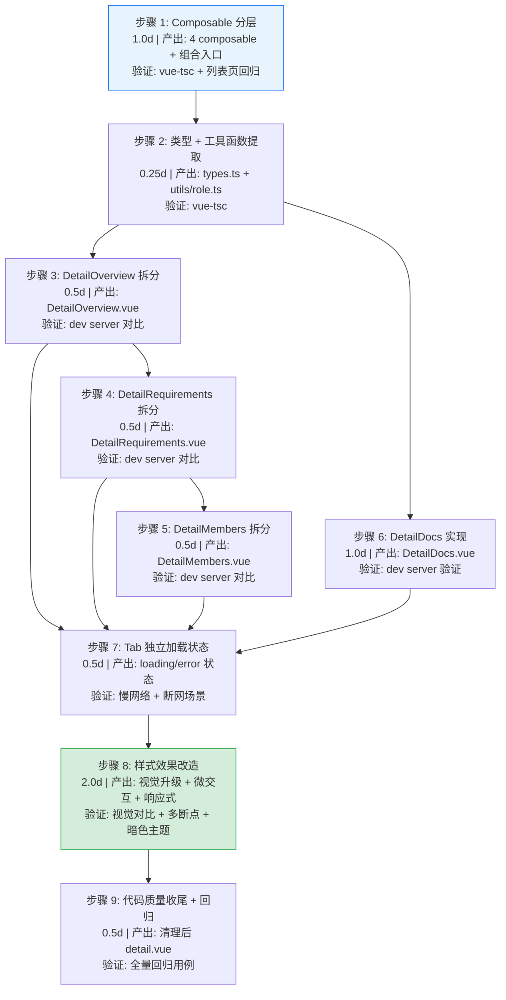

### 8.3 回滚策略

| 步骤 | 回滚方式 | 回滚影响范围 |
|------|----------|-------------|
| 步骤 1-2 | `git revert <commit>` | 仅 composable 层，组件层未动 |
| 步骤 3-6 | `git revert <commit>` | 单个组件回滚，不影响其他已拆分组件 |
| 步骤 7-8 | `git revert <commit>` | 仅体验层，核心功能不受影响 |
| 步骤 9 | `git revert <commit>` | 仅代码清理，不影响功能 |

### 8.4 每步验证检查点

| 检查点 | 验证内容 | 通过标准 |
|--------|----------|----------|
| 类型检查 | `vue-tsc --noEmit` | 0 新增错误 |
| 循环依赖 | `madge --circular src/views/project/composables/` | 0 循环依赖 |
| 列表页功能 | 20 个回归用例 | 全部通过 |
| 详情页功能 | 12 个回归用例 | 全部通过 |
| 构建验证 | `pnpm build` | 构建成功，产物大小 ≤ 基线 +5KB |

---

## 9. 测试策略

### 9.1 测试分层

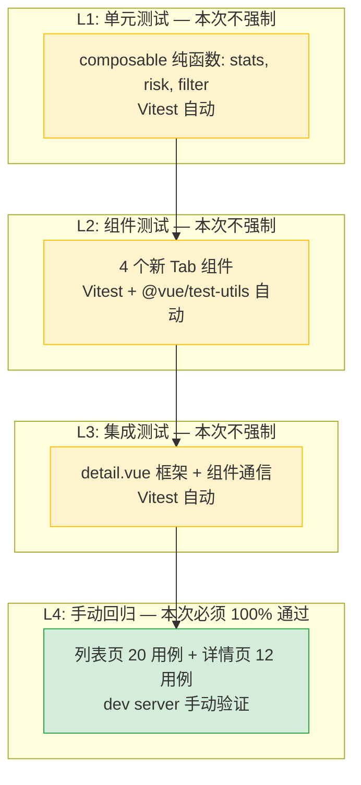

> L1-L3 计划在十月迭代补充，本次迭代仅要求 L4 手动回归 100% 通过。

### 9.2 手动回归测试用例

#### 列表页（20 个用例）

| # | 用例 | 操作 | 预期结果 |
|----|------|------|----------|
| 1 | 页面加载 | 访问 `/project` | 项目卡片正确渲染，统计卡片显示正确数据 |
| 2 | 日期过滤 | 点击日期导航前后箭头 | 项目列表和数据按日期过滤 |
| 3 | 日期清除 | 点击 "Clear date filter" | 恢复显示所有项目 |
| 4 | 统计卡片点击 | 点击 "At risk" 卡片 | 应用 `flagged=1` 过滤 |
| 5 | 搜索 | 输入项目名称/标识符关键字 | 项目列表按关键字过滤 |
| 6 | 排序 | 切换排序方式 | 项目列表按所选方式排序 |
| 7 | 升序/降序 | 点击排序方向按钮 | 切换升序/降序 |
| 8 | 状态过滤 | 选择 Active/Archived | 显示对应状态的项目 |
| 9 | Starred 过滤 | 点击 Starred 按钮 | 仅显示 starred 项目 |
| 10 | 图表过滤 | 点击图表中的状态/优先级/类型条 | 应用对应维度过滤 |
| 11 | 风险过滤 | 点击 ProjectAttention 中的风险标签 | 应用对应风险过滤 |
| 12 | 过滤 pill 操作 | 点击 pill 的 × 按钮 | 移除该过滤条件 |
| 13 | Undo 过滤 | 点击 undo 按钮 | 恢复上一个过滤状态 |
| 14 | 视图切换 | 切换到 List 视图 | 显示列表视图 |
| 15 | CSV 导出 | 点击 Export 按钮 | 下载 CSV 文件 |
| 16 | 新建项目 | 点击 New Project，填写表单 | 项目创建成功 |
| 17 | 编辑项目 | 点击项目卡的编辑按钮 | 编辑弹窗打开，修改后保存成功 |
| 18 | 归档/恢复 | 选择项目，点击 Archive/Restore | 项目状态变更 |
| 19 | 批量操作 | 多选项目，点击 Archive | 批量归档成功 |
| 20 | 点击项目卡 | 点击项目卡主体 | 导航到 `/project/{key}` |

#### 详情页（12 个用例）

| # | 用例 | 操作 | 预期结果 |
|----|------|------|----------|
| 1 | 页面加载 | 访问 `/project/{key}` | 项目详情正确渲染 |
| 2 | Overview Tab | 默认显示 | README.md 预览、统计侧边栏、模块列表、活动动态正确渲染 |
| 3 | Requirements Tab | 切换到 Requirements | 需求列表正确渲染，过滤和搜索正常 |
| 4 | Issues Tab | 切换到 Issues | IssueList 组件正确渲染 |
| 5 | Modules Tab | 切换到 Modules | ModuleList 组件正确渲染 |
| 6 | Docs Tab | 切换到 Docs | 文档列表正确渲染，点击可预览 |
| 7 | Bugs Tab | 切换到 Bugs | BugList 组件正确渲染 |
| 8 | Members Tab | 切换到 Members | 成员列表正确渲染，添加/删除成员正常 |
| 9 | URL Tab 参数 | 访问 `/project/{key}?tab=members` | 自动切换到 Members Tab |
| 10 | 日期过滤 | 切换日期导航 | Overview 和 Requirements 数据按日期过滤 |
| 11 | 返回列表 | 点击 "Projects" 返回按钮 | 导航回 `/project` |
| 12 | 404 处理 | 访问不存在的 `/project/{invalid}` | 显示 "Project not found" 错误状态 |

### 9.3 回归测试环境

| 环境要求 | 说明 |
|----------|------|
| YiAi 后端 | 必须运行，提供数据接口 |
| 浏览器 | Chrome 最新版 |
| 测试数据 | 使用现有项目数据（PLANE 等），无需准备测试数据 |
| 网络条件 | 正常网络 + Chrome DevTools 慢网络模拟（Fast 3G） |

---

## 10. 非功能性需求

### 10.1 性能预算

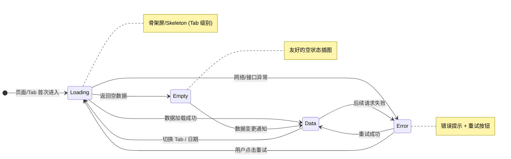

> 重构后每个 Tab 独立管理自身状态，不再使用全局 `v-loading` 阻塞整个页面。

| 指标 | 当前基线 | 目标 | 测量方式 |
|------|----------|------|----------|
| 首次内容渲染 (FCP) | 待测量 | 不退化 | Lighthouse 评分 |
| Tab 切换延迟 | 待测量 | 不退化 | Performance API 标记 |
| 构建产物体积 (gzip) | 待测量 | 增量 ≤ 5KB | `pnpm build` 后分析 |
| 内存占用 | 待测量 | 无明显增长 | Chrome Memory 面板 |
| composable 纯计算耗时 | — | 单次 < 5ms | `console.time` |

### 10.2 可访问性

| 标准 | 要求 | 覆盖范围 |
|------|------|----------|
| WCAG 2.1 A | 键盘导航、焦点管理、ARIA 标签 | 列表页 + 详情页 |
| WCAG 2.1 AA | 颜色对比度、焦点可见指示器 | Element Plus 组件已满足 |
| 屏幕阅读器 | 基本支持（NVDA/VoiceOver） | 卡片、表格、按钮 |

### 10.3 国际化

| 维度 | 要求 |
|------|------|
| 语言覆盖 | 中文（简体）+ 英文，~136 个 Key |
| 切换响应 | 即时生效，无需刷新 |
| 图表库 | ECharts 实例在语言切换时重新 `setOption` |
| 缺失 Key | 回退到 Key 本身作为显示文本（vue-i18n 默认行为） |

### 10.4 代码质量门禁

| 检查项 | 工具 | 通过标准 |
|--------|------|----------|
| 类型检查 | `vue-tsc --noEmit` | 0 新增错误 |
| 代码规范 | ESLint + Prettier | 0 告警 |
| 样式规范 | Stylelint | 0 告警 |
| 循环依赖 | `madge --circular` | 0 循环依赖 |
| 构建验证 | `pnpm build` | 构建成功 |
| 组件规范 | `<script setup lang="ts">` 必须 | 100% 遵守 |
| 类型规范 | Props/Emits 类型泛型必须 | 100% 遵守 |
| 禁止项 | 无 `any` 类型 | 0 新增 |

---

## 11. 风险矩阵

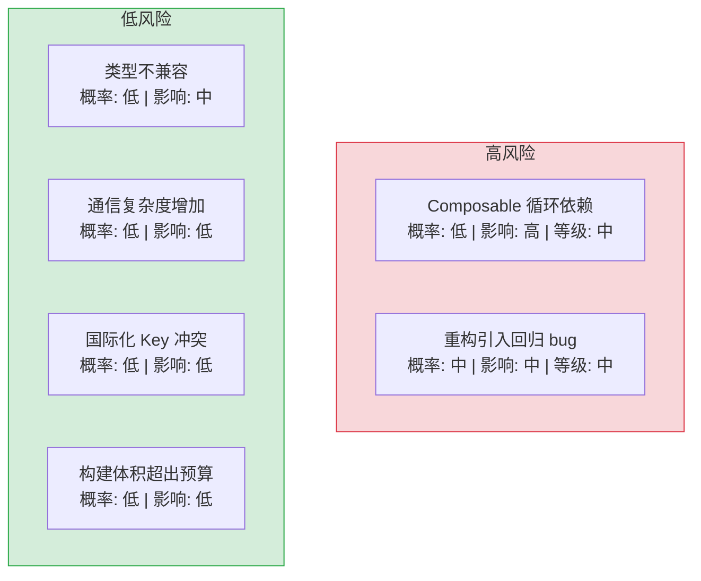

| 风险 | 概率 | 影响 | 等级 | 缓解措施 | 应急预案 |
|------|------|------|------|----------|----------|
| Composable 拆分引入循环依赖 | 低 | 高 | 中 | 严格遵循单向依赖设计；`useProjectFilter` 不引用其他 composable；使用 `madge --circular` 检测 | 合并有循环依赖的 composable 对 |
| 重构引入回归 bug | 中 | 中 | 中 | 每步验证，逐 Tab 拆分；独立分支开发；保留原文件作为参考 | `git revert` 到上一个稳定步骤 |
| 类型提取后类型不兼容 | 低 | 中 | 低 | 逐步迁移，每步运行 `vue-tsc --noEmit` | 保留内联类型，仅新增类型定义 |
| Tab 拆分后通信复杂度增加 | 低 | 低 | 低 | 共享数据由 detail.vue 通过 props 单向传递 | 如确实复杂，引入 `provide/inject` 作为补充 |
| 国际化 Key 命名冲突 | 低 | 低 | 低 | 遵循 `project.<区域>.<含义>` 命名规范 | 重命名冲突 Key |
| 构建产物体积超出预算 | 低 | 低 | 低 | 新增文件均为纯逻辑，无新依赖引入 | 检查是否有意外引入的大型依赖 |

---

## 12. 设计决策记录

| 决策 | 选项 A | 选项 B | 选择 | 理由 |
|------|--------|--------|------|------|
| 组件通信方式 | props/emits | provide/inject | **props/emits** | 通信路径短（仅 1 层），显式数据流更易调试 |
| `matchesFilter` 依赖注入 | 内部调用 statsFor/risksFor | 参数传入已计算值 | **参数传入** | 消除 filter 层对 stats/risk 层的隐式依赖，保持单向数据流 |
| 过滤历史栈深度 | 20 | 无限制 | **20** | 足够覆盖典型使用场景，避免内存泄漏 |
| 类型提取策略 | 逐步迁移 | 一次性全部提取 | **逐步迁移** | 每步 `vue-tsc` 验证，降低引入类型不兼容的风险 |
| Docs Tab CLAUDE.md 处理 | 复用 `@preview` 事件 | 内部调用 `readProjectFile` + `openRaw` | **内部调用 `openRaw`** | CLAUDE.md 不是知识库文件，API 路径不同，单独处理更清晰 |
| 持久化通道选择 | URL query（可分享状态）| localStorage（个人偏好） | **双通道** | 搜索/过滤/日期可分享 → URL；排序/视图/星标 → localStorage |
| 样式方案 | 全局样式 | scoped + mixin | **scoped + mixin** | 消除样式泄漏，mixin 复用公共样式 |

---

## 13. 代码审查检查清单

合并前审查人需确认以下项目：

- [ ] 所有新文件遵循 `<script setup lang="ts">` 规范
- [ ] 所有 Props/Emits 使用类型泛型定义
- [ ] 无 `any` 类型使用
- [ ] 无循环依赖（`madge --circular` 通过）
- [ ] `detail.vue` 行数 ≤ 200
- [ ] `useProjectInsights.ts` 行数 ≤ 100
- [ ] 各 composable 行数符合预期（data ~60, stats ~130, risk ~100, filter ~120）
- [ ] 各组件行数符合预期（Overview ≤400, Requirements ≤250, Members ≤200, Docs ≤150）
- [ ] 非 scoped 样式已全部迁移或删除
- [ ] 重复函数（`roleTagType` 等）已消除
- [ ] 类型定义已提取到 `types.ts`
- [ ] `vue-tsc --noEmit` 通过
- [ ] ESLint/Prettier/Stylelint 通过
- [ ] `pnpm build` 成功
- [ ] 手动回归测试（列表页 20 + 详情页 12）全部通过

---

## 14. 子文档索引

| 需求编号 | 文档 | 说明 |
|----------|------|------|
| YV-09-01-1 | [02-架构重构-组件拆分](./02-架构重构-组件拆分.md) | 4 个 Tab 组件的 Props/Emits 接口、模板结构、迁移策略 |
| YV-09-01-2 | [01-架构重构-composable分层](./01-架构重构-composable分层.md) | 4 个 composable 的完整接口定义、依赖关系、组合入口 |
| YV-09-01-3 | [03-功能实现-文档标签页](./03-功能实现-文档标签页.md) | 数据流、UI 规格、标签映射、预览交互 |
| YV-09-01-4/7/8 | [05-体验优化-综合](./05-体验优化-综合.md) | 加载状态、状态持久化、键盘快捷键与可访问性 |
| YV-09-01-5 | [06-代码质量收尾](./06-代码质量收尾.md) | 类型提取清单、重复函数消除、样式组件化、技术债务追踪 |
| YV-09-01-6 | [04-功能实现-国际化](./04-功能实现-国际化.md) | 中英双语 i18n 模块，~136 个文案键，含完整 zh.ts 和 en.ts |
| YV-09-01-9 | [07-样式效果改造-功能内容优化](./07-样式效果改造-功能内容优化.md) | 卡片视觉升级、微交互、响应式适配、空状态、模块/活动视觉重构 |

---

*PRD 来源: `projects/yivad/requires/2026-09/00-需求总览.md`*