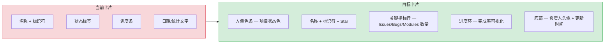
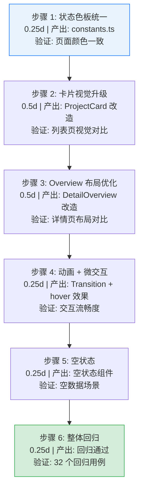

# Project 页面样式效果改造与功能内容优化

> 需求编号：YV-09-01-9 · 优先级：P1 · 人天：2.0d · 状态：进行中
> 依赖：YV-09-01-1（组件拆分完成后才能进行样式改造）

## 背景

九月迭代的架构重构（YV-09-01-1 ~ YV-09-01-8）解决了代码层面的可维护性问题，但 Project 页面在**视觉呈现**和**内容体验**上仍有提升空间：

| 问题 | 位置 | 严重程度 | 影响 |
|------|------|----------|------|
| 卡片视觉层次弱 | `ProjectCard.vue` | 中 | 项目名称、状态、进度、关键指标混杂，信息扫描效率低 |
| 详情页布局僵硬 | `detail.vue` Overview Tab | 中 | 双栏布局在小屏下挤压，模块列表和活动动态缺乏视觉节奏 |
| 缺少过渡动画 | 全局 | 低 | Tab 切换、卡片 hover、列表加载均为瞬时变化，体验生硬 |
| 空状态粗糙 | 各 Tab / 列表 | 低 | 空数据仅显示占位文本，无引导性插图和操作入口 |
| 内容密度不均 | Overview Tab | 中 | README 预览区占用过大，模块列表和动态被压缩，信息优先级倒置 |
| 状态色不一致 | 全局 | 低 | 优先级/状态颜色在各组件中独立定义，缺乏统一色板 |

目标：在组件拆分完成的基础上，对 Project 页面进行**视觉层升级**和**内容呈现优化**，提升信息消费效率和操作体验。

---

## 1. 改造范围

### 1.1 涉及页面

| 页面 | 路由 | 改造重点 |
|------|------|----------|
| 项目列表页 | `/project` | 卡片视觉升级、空状态 |
| 项目详情页 | `/project/:key` | Tab 过渡动画、Overview 布局优化、模块列表视觉增强 |

### 1.2 涉及组件

| 组件 | 改造内容 |
|------|----------|
| `ProjectCard.vue` | 卡片信息层级重构、hover 微交互、进度可视化 |
| `ProjectRow.vue` | 列表行视觉对齐、状态指示器 |
| `DetailOverview.vue` | 布局比例调整、模块列表卡片化、活动时间线视觉 |
| `DetailDocs.vue` | 文档列表视觉增强、文件类型图标 |
| `DetailMembers.vue` | 成员头像展示、角色标签视觉 |
| `ProjectStatTiles.vue` | 统计卡片微交互、点击态反馈 |
| `ProjectAnalytics.vue` | 图表配色统一、空数据占位 |
| `ProjectAttention.vue` | 风险标签视觉层级 |
| `ProjectFilterPills.vue` | 过滤标签动画 |

---

## 2. 样式效果改造

### 2.1 项目卡片视觉升级



**改造点：**

| 改造项 | 当前 | 目标 | 实现方式 |
|--------|------|------|----------|
| 状态色条 | 无 | 卡片左侧 4px 色条，颜色对应项目状态 | `border-left` 动态色 |
| 信息层级 | 平铺 | 名称行 → 指标行 → 进度行 → 底部元信息 | flexbox 分区 |
| 进度展示 | 文字百分比 | 小型进度环（`el-progress type="circle"`） | 替换文字为环形进度 |
| 关键指标 | 无 | Issues / Bugs / Modules 三指标并排 | 图标 + 数字 |
| hover 效果 | 仅阴影 | 阴影加深 + 色条变宽 + 名称色变 | CSS transition |
| Star 状态 | 图标 | 动画星标（点击缩放反馈） | CSS transform |

### 2.2 Tab 切换过渡动画

| 改造项 | 实现方式 |
|--------|----------|
| Tab 内容切换 | `<Transition name="fade" mode="out-in">` 包裹 Tab 内容区 |
| 动画时长 | 200ms ease，避免拖沓 |
| 骨架屏 | 首次加载 Tab 时显示骨架屏（Skeleton），替代全局 spinner |

**CSS 过渡定义：**

- `fade` 过渡：`opacity 0.2s ease` + `transform: translateY(4px)` → 内容淡入上移
- 仅对 Tab 内容区生效，不影响 Tab 导航栏

### 2.3 微交互增强

| 交互 | 当前 | 目标 |
|------|------|------|
| 卡片 hover | `box-shadow` 加深 | 阴影 + 色条变宽（4px → 8px）+ 标题色变 |
| 统计卡片点击 | 无反馈 | `scale(0.97)` 按压反馈 + 选中态边框 |
| 过滤标签 hover | 无 | 背景色加深 + 关闭按钮显形 |
| 模块列表项 hover | 无 | 背景色微变 + 左侧 accent 条变亮 |
| 活动动态项 hover | 无 | 左侧圆点变大 + 背景色微变 |
| 按钮点击 | Element Plus 默认 | 保持默认（已满足） |

---

## 3. 功能内容优化

### 3.1 Overview Tab 布局重比例

**当前问题：** README 预览区占据全宽上半部分，双栏布局中模块列表和活动动态被压缩在下方。

**目标布局：**

```
┌────────────────────────────────────────────┐
│  README.md 预览区（可折叠，默认展开）        │
│  最大高度 400px，超出滚动 + 渐变遮罩         │
├────────────────────┬───────────────────────┤
│  侧边栏 (30%)      │  主内容区 (70%)        │
│  · 统计卡片        │  · 模块列表（卡片式）   │
│  · 文档列表        │  · 活动动态（时间线式）  │
│  · 交付流水线      │                       │
└────────────────────┴───────────────────────┘
```

| 改造项 | 当前 | 目标 |
|--------|------|------|
| README 预览高度 | 无限制 | 最大 400px，超出显示渐变遮罩 + "展开" 按钮 |
| 侧边栏宽度 | 固定 | 30% 弹性宽度，min 240px |
| 模块列表 | 紧凑列表 | 卡片式展示，每个模块独立卡片，含进度条 |
| 活动动态 | 列表 | 时间线样式，左侧时间轴 + 右侧内容卡片 |

### 3.2 模块列表卡片化

每个模块渲染为独立卡片，替代当前紧凑列表：

```
┌──────────────────────────────────────────┐
│ ● backend  API 服务  ████████░░ 80%      │
│ 后端 API 服务模块                         │
│ 📅 2026-08-01 – 2026-09-15               │
│ Issues: PL-101 登录接口优化  [in_progress]│
│         PL-102 数据导出    [todo]         │
└──────────────────────────────────────────┘
```

### 3.3 活动动态时间线

将当前列表式活动动态改为时间线样式：

```
● Today
├─ 创建了 Issue PL-105          2h ago
├─ 更新了 Module backend         5h ago
● Yesterday
├─ 关闭了 Bug BUG-032           1d ago
├─ 发布了 Release v2.1.0        1d ago
```

### 3.4 空状态引导

| 场景 | 当前 | 目标 |
|------|------|------|
| 无项目 | 文本 "No projects" | 插图 + "创建第一个项目" 引导按钮 |
| 无 Issues | 空列表 | 插图 + "暂无 Issue" + 跳转链接 |
| 无模块 | 文本 "No modules" | 插图 + "暂无模块" |
| 无文档 | 空列表 | 插图 + "知识库中暂无文档" |
| 无活动 | 空列表 | 插图 + "暂无最近活动" |
| 搜索无结果 | 列表消失 | "未找到匹配 {keyword} 的结果" + 清除搜索按钮 |

空状态插图使用 Element Plus 内置图标组合（`el-empty` 组件），不引入额外依赖。

### 3.5 状态色板统一

将分散在各组件中的状态/优先级颜色提取为统一常量：

```typescript
// src/views/project/constants.ts (新增)
export const STATUS_COLORS = {
  active: '#67c23a',
  archived: '#909399',
  planning: '#409eff',
  in_progress: '#e6a23c',
  done: '#67c23a',
  cancelled: '#f56c6c',
} as const;

export const PRIORITY_COLORS = {
  urgent: '#f56c6c',
  high: '#e6a23c',
  medium: '#409eff',
  low: '#909399',
  none: '#c0c4cc',
} as const;

export const RISK_COLORS = {
  overdue: '#f56c6c',
  stalled: '#e6a23c',
  unassigned: '#409eff',
  noActivity: '#909399',
} as const;
```

---

## 4. 实现计划

### 4.1 分步执行



### 4.2 人天拆分

| 步骤 | 内容 | 人天 |
|------|------|------|
| 状态色板统一 | 提取颜色常量，替换硬编码色值 | 0.25 |
| 卡片视觉升级 | ProjectCard 信息层级重构 + hover 效果 | 0.5 |
| Overview 布局优化 | 布局比例调整 + 模块卡片化 + 活动时间线 | 0.5 |
| 动画 + 微交互 | Tab 过渡 + hover 效果 + 点击反馈 | 0.25 |
| 空状态 | 空状态插图 | 0.25 |
| 整体回归 | 全量 32 个回归用例 | 0.25 |
| **合计** | | **2.0d** |

---

## 5. 涉及文件

```
src/views/project/
├── index.vue                          # 修改：空状态
├── constants.ts                       # 新增：状态色板常量
├── components/
│   ├── ProjectCard.vue                # 重构：卡片视觉升级
│   ├── ProjectRow.vue                 # 修改：列表行视觉对齐
│   ├── ProjectStatTiles.vue           # 修改：微交互 + 点击反馈
│   ├── ProjectAnalytics.vue           # 修改：图表配色统一
│   ├── ProjectAttention.vue           # 修改：风险标签视觉
│   ├── ProjectFilterPills.vue         # 修改：过滤标签动画
│   ├── DetailOverview.vue             # 重构：布局 + 模块卡片 + 时间线
│   ├── DetailDocs.vue                 # 修改：文档列表视觉 + 空状态
│   └── DetailMembers.vue             # 修改：头像 + 角色标签
```

---

## 6. 验收标准

### 6.1 视觉验收

- [ ] 卡片左侧色条颜色与项目状态一致
- [ ] 卡片 hover 时色条变宽、阴影加深、标题色变
- [ ] Tab 切换有 200ms fade 过渡动画
- [ ] 模块列表以卡片形式展示，每个模块含进度条
- [ ] 活动动态以时间线样式展示
- [ ] 空状态显示 `el-empty` 插图 + 引导文案
- [ ] 所有状态/优先级/风险颜色从 `constants.ts` 统一引用
- [ ] 暗色主题下所有新增样式正常显示

### 6.2 功能回归（32 个用例）

列表页 20 个用例 + 详情页 12 个用例（同 [00-需求总览](./00-需求总览.md) 第 9.2 节），全部通过。

---

## 7. 设计决策

| 决策 | 选择 | 理由 |
|------|------|------|
| 动画方案 | CSS Transition（非 JS 动画库） | 零依赖，过渡类动画 CSS 即可满足 |
| 空状态方案 | `el-empty` 组件 | Element Plus 内置，无需新依赖 |
| 色板管理 | 集中常量文件 | 单点维护，避免色值分散 |
| 进度展示 | 环形进度条替代文字百分比 | 视觉更直观，占用空间更小 |
| 活动时间线 | 纯 CSS 实现 | 无需引入时间线组件库 |

---

*关联需求: [00-需求总览](./00-需求总览.md) · 依赖: [02-架构重构-组件拆分](./02-架构重构-组件拆分.md)*